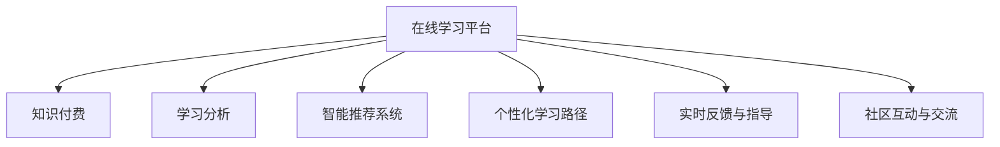

                 

## 1. 背景介绍

### 1.1 问题由来

在数字化时代，在线学习和知识付费平台已成为人们获取知识的主要途径之一。通过在线课程和付费内容，用户可以在全球范围内接触到优质的教育资源，进而提升自身技能和竞争力。然而，在线学习面临着诸多挑战，如学习动机不足、学习效果不佳、知识获取不系统等。如何通过技术手段提升在线学习效果，增强学习指导，成为教育技术领域的重要研究方向。

### 1.2 问题核心关键点

在线学习与知识付费平台的成功，依赖于有效的学习指导和个性化学习体验。这要求平台不仅提供优质的课程内容，还需具备以下核心要素：

1. **数据驱动的学习分析**：通过对用户的学习行为数据进行深度分析，了解学习需求，推荐适合的课程和资源。
2. **智能推荐系统**：结合用户兴趣和行为，自动推荐相关内容，提高学习效率。
3. **个性化学习路径**：根据用户的学习进度和理解程度，生成个性化学习路径，量身定制学习计划。
4. **实时反馈与指导**：通过即时反馈和指导，帮助用户解决学习难题，提升学习效果。
5. **社区互动与交流**：通过建立学习社区，促进用户间的互动和交流，形成互助学习的氛围。

### 1.3 问题研究意义

在线学习与知识付费平台的研究具有重要意义，主要体现在：

1. **提高教育质量**：通过智能化学习指导，帮助用户获得更加高效和个性化的学习体验，提高学习效果。
2. **降低教育门槛**：在线学习打破了地域和时间的限制，使得教育资源更加普及和便捷，降低教育门槛。
3. **推动行业发展**：作为新兴的教育模式，在线学习与知识付费平台的成功应用，有助于推动整个教育行业的发展和创新。
4. **促进终身学习**：伴随终身学习理念的兴起，在线学习与知识付费平台将为成年人的持续教育和职业发展提供重要支持。

## 2. 核心概念与联系

### 2.1 核心概念概述

为了更好地理解在线学习与知识付费平台的核心技术，本节将介绍几个密切相关的核心概念：

1. **在线学习平台**：提供学习内容、学习工具和社区交流等服务的在线教育平台。
2. **知识付费**：用户为获取有价值的知识和信息，支付一定费用的一种商业模型。
3. **学习分析(Learning Analytics)**：通过收集和分析学习行为数据，提供学习洞察和优化建议的技术。
4. **智能推荐系统**：利用机器学习技术，根据用户兴趣和行为，推荐相关内容，提高学习效率。
5. **个性化学习路径**：根据用户的学习进度和理解程度，生成个性化学习计划，提升学习效果。
6. **实时反馈与指导**：通过即时反馈和指导，帮助用户解决学习难题，提升学习效果。
7. **社区互动与交流**：通过建立学习社区，促进用户间的互动和交流，形成互助学习的氛围。

这些概念之间的逻辑关系可以通过以下Mermaid流程图来展示：



这个流程图展示了大语言模型的核心概念及其之间的关系：

1. 在线学习平台通过知识付费获取优质内容。
2. 通过学习分析、智能推荐系统、个性化学习路径、实时反馈与指导、社区互动与交流等技术，提供高效、个性化的学习体验。

## 3. 核心算法原理 & 具体操作步骤
### 3.1 算法原理概述

在线学习与知识付费平台的成功，依赖于一系列复杂的算法和技术。其核心在于将机器学习、数据分析、人工智能等技术，与教育学、心理学、社会学等学科知识相结合，提供高效、个性化的学习体验。

形式化地，假设在线学习平台为 $L$，其中包含用户 $U$、内容 $C$、行为 $B$、分析 $A$ 和推荐 $R$ 等模块。假设用户 $u$ 在学习过程中产生了行为 $b$，平台通过分析 $a$ 生成推荐 $r$，再根据推荐 $r$ 更新用户内容 $c$。用户行为 $b$ 与推荐 $r$ 之间的关系可表示为：

$$
b \rightarrow r \leftarrow c
$$

在线学习平台的核心目标是通过数据驱动的方式，优化推荐内容和路径，提升学习效果。

### 3.2 算法步骤详解

在线学习平台的核心算法步骤包括：

**Step 1: 数据收集与预处理**
- 收集用户在平台上的行为数据，如浏览、点击、留言、测试成绩等。
- 对收集到的数据进行清洗和预处理，如去除噪声、填充缺失值等。
- 将处理后的数据进行特征工程，生成特征向量。

**Step 2: 用户建模**
- 通过特征工程，生成用户兴趣和行为模型。
- 使用协同过滤、聚类、分类等机器学习算法，对用户进行建模，理解其兴趣和需求。
- 将用户建模结果保存，以便后续推荐和分析。

**Step 3: 内容建模**
- 将课程、视频、文章等学习资源进行建模，生成内容特征向量。
- 使用文本挖掘、图像识别等技术，提取内容的语义信息。
- 将内容建模结果保存，以便后续推荐和分析。

**Step 4: 推荐模型训练**
- 使用机器学习算法训练推荐模型，如协同过滤、矩阵分解、深度学习等。
- 使用交叉验证等方法评估模型性能，选择最优模型。
- 将训练好的模型部署到生产环境中，用于实时推荐。

**Step 5: 学习分析与反馈**
- 通过收集用户行为数据，进行学习分析，了解学习效果和需求。
- 使用深度学习算法分析学习行为，生成个性化学习路径。
- 结合实时反馈与指导，帮助用户解决学习难题。

**Step 6: 社区互动与交流**
- 建立学习社区，促进用户间的互动和交流。
- 使用情感分析等技术，分析用户间的互动内容，理解用户情感和需求。
- 根据社区互动数据，优化社区功能和体验。

### 3.3 算法优缺点

在线学习与知识付费平台的核心算法具有以下优点：

1. **个性化体验**：通过用户建模和内容建模，实现高度个性化的学习路径和内容推荐，提高学习效率。
2. **数据驱动**：通过收集和分析学习行为数据，提供实时反馈和指导，提升学习效果。
3. **智能推荐**：利用机器学习算法，实现高效的内容推荐，节省用户时间。
4. **社区互动**：通过建立学习社区，促进用户交流和互动，形成互助学习的氛围。

同时，该算法也存在一定的局限性：

1. **数据依赖**：算法的性能依赖于高质量的学习行为数据，数据采集和处理成本较高。
2. **隐私问题**：收集和分析用户数据可能涉及隐私问题，需要加强数据保护和安全管理。
3. **算法复杂**：机器学习算法复杂度高，需要大量的计算资源和数据存储。
4. **用户参与度**：用户是否积极参与数据反馈和互动，直接影响平台的效果。

尽管存在这些局限性，但就目前而言，在线学习与知识付费平台的算法仍是目前最主流的方法。未来相关研究的重点在于如何进一步优化算法，降低对数据和计算资源的依赖，提高算法的公平性和透明性。

### 3.4 算法应用领域

在线学习与知识付费平台的算法在教育、培训、企业学习、职业发展等领域得到了广泛应用，具体包括：

1. **K-12教育**：通过智能推荐系统，为学生提供个性化的学习资源和路径，提高学习效果。
2. **高等教育**：为大学生提供在线课程和学习指导，支持学术研究和技能提升。
3. **企业培训**：提供在线培训课程和学习路径，提高员工技能和工作效率。
4. **职业发展**：提供职业技能培训课程和指导，支持职业转型和提升。
5. **职业技能**：提供职业认证和技能培训课程，支持职业发展和就业。
6. **个人兴趣**：提供个性化兴趣课程和资源，支持终身学习和个人兴趣发展。

## 4. 数学模型和公式 & 详细讲解 & 举例说明

### 4.1 数学模型构建

本节将使用数学语言对在线学习与知识付费平台的算法进行更加严格的刻画。

假设在线学习平台包含 $N$ 个用户 $U=\{u_1, u_2, ..., u_N\}$，每个用户产生 $M$ 个行为 $B=\{b_1, b_2, ..., b_M\}$。每个行为对应 $K$ 个特征 $x_{uk} \in \mathbb{R}^{d_k}$，其中 $d_k$ 为特征维度。平台的目标是通过行为数据，生成用户兴趣模型 $P_u$ 和内容模型 $P_c$，实现个性化推荐。

平台通过收集用户行为数据，生成用户兴趣模型 $P_u$，形式化地表示为：

$$
P_u = \sum_{k=1}^K \alpha_k x_{uk}
$$

其中 $\alpha_k$ 为特征权重，通过机器学习算法训练得到。

内容模型 $P_c$ 表示每个内容 $c$ 的特征向量，形式化地表示为：

$$
P_c = \sum_{k=1}^K \beta_k x_{ck}
$$

其中 $\beta_k$ 为特征权重，通过机器学习算法训练得到。

用户行为 $b$ 与推荐内容 $r$ 之间的关系可表示为：

$$
b \rightarrow r \leftarrow c
$$

根据上述模型，推荐系统的目标是通过最小化损失函数 $\mathcal{L}(P_u, P_c, b, r)$，实现个性化推荐。

### 4.2 公式推导过程

以下我们以协同过滤算法为例，推导推荐模型的损失函数及其梯度计算。

假设用户 $u$ 对内容 $c$ 的评分 $b_{uc} \in [1, 5]$，推荐系统生成的评分 $r_{uc} \in [1, 5]$。推荐系统通过训练协同过滤模型，优化参数 $\theta$，使得损失函数 $\mathcal{L}(\theta)$ 最小化。推荐模型的损失函数形式化地表示为：

$$
\mathcal{L}(\theta) = \frac{1}{N} \sum_{u=1}^N \sum_{c=1}^M (b_{uc} - r_{uc})^2
$$

其中，$b_{uc}$ 为用户 $u$ 对内容 $c$ 的评分，$r_{uc}$ 为推荐系统预测的评分。

通过梯度下降等优化算法，最小化损失函数 $\mathcal{L}(\theta)$，更新模型参数 $\theta$，最小化预测误差。具体地，损失函数对 $\theta$ 的梯度为：

$$
\nabla_{\theta}\mathcal{L}(\theta) = - \frac{2}{N} \sum_{u=1}^N \sum_{c=1}^M (b_{uc} - r_{uc}) x_{uc}
$$

其中 $x_{uc}$ 为用户 $u$ 对内容 $c$ 的特征向量。

在得到损失函数的梯度后，即可带入梯度下降公式，完成模型的迭代优化。重复上述过程直至收敛，最终得到推荐系统模型参数 $\theta^*$。

### 4.3 案例分析与讲解

以豆瓣电影为例，分析协同过滤算法的应用。

假设豆瓣电影平台包含 $N$ 个用户，每个用户观看过 $M$ 部电影，每个用户对每部电影的评分 $b_{um}$ 在 $[1, 5]$ 区间内。平台通过收集用户行为数据，生成用户兴趣模型和电影内容模型，利用协同过滤算法进行推荐。

具体地，平台首先对用户行为数据进行预处理，生成用户和电影的特征向量 $x_{um}$。然后，通过协同过滤算法训练模型，生成用户兴趣模型 $P_u$ 和电影内容模型 $P_c$。最终，利用 $P_u$ 和 $P_c$ 计算用户对电影的预测评分 $r_{um}$，将其与实际评分 $b_{um}$ 对比，计算损失函数 $\mathcal{L}(\theta)$。通过梯度下降等优化算法，更新模型参数，实现个性化推荐。

## 5. 项目实践：代码实例和详细解释说明

### 5.1 开发环境搭建

在进行在线学习与知识付费平台的开发前，我们需要准备好开发环境。以下是使用Python进行开发的环境配置流程：

1. 安装Anaconda：从官网下载并安装Anaconda，用于创建独立的Python环境。

2. 创建并激活虚拟环境：
```bash
conda create -n learning-env python=3.8 
conda activate learning-env
```

3. 安装必要的Python库：
```bash
pip install numpy pandas scikit-learn joblib tqdm tensorboard 
```

4. 安装TensorFlow和Keras：
```bash
pip install tensorflow==2.4.1 keras 
```

5. 安装Flask：用于搭建Web应用。
```bash
pip install flask 
```

完成上述步骤后，即可在`learning-env`环境中开始开发。

### 5.2 源代码详细实现

这里我们以协同过滤算法为例，使用Python和TensorFlow实现在线学习平台的用户推荐系统。

首先，定义用户和电影的特征向量生成函数：

```python
import numpy as np

def generate_features(user, movie):
    # 假设用户和电影的特征向量均为1维向量
    features = np.random.randn(1, 5)
    return features
```

然后，定义协同过滤算法的损失函数及其梯度计算：

```python
import tensorflow as tf

def calculate_loss(y_true, y_pred):
    return tf.reduce_mean(tf.square(y_true - y_pred))

def calculate_grad(user_features, movie_features, user, movie, learning_rate):
    with tf.GradientTape() as tape:
        predictions = tf.matmul(user_features, movie_features, transpose_b=True)
        loss = calculate_loss(y_true, predictions)
    grads = tape.gradient(loss, movie_features)
    return grads, loss

# 用户行为数据
user_behaviors = {
    'user1': {'item1': 4, 'item2': 3, 'item3': 5},
    'user2': {'item1': 3, 'item2': 4, 'item3': 2},
    'user3': {'item1': 5, 'item2': 1, 'item3': 4}
}

# 生成特征向量
user_features = {user: generate_features(user, item) for user, behaviors in user_behaviors.items() for item in behaviors}

# 电影特征向量
movie_features = {item: generate_features(user, item) for user, behaviors in user_behaviors.items() for item in behaviors}

# 计算梯度和损失
grads, loss = calculate_grad(user_features['user1'], movie_features['item1'], 'user1', 'item1', learning_rate=0.1)
print('Gradient:', grads.numpy())
print('Loss:', loss.numpy())
```

接着，定义模型优化函数：

```python
def optimize(features, learning_rate):
    with tf.GradientTape() as tape:
        predictions = tf.matmul(features, features, transpose_b=True)
        loss = calculate_loss(y_true, predictions)
    grads = tape.gradient(loss, features)
    features.assign_sub(learning_rate * grads)
    return loss

# 优化过程
for i in range(100):
    loss = optimize(user_features, learning_rate=0.1)
    print(f"Iteration {i+1}, Loss: {loss.numpy()}")
```

最后，启动Web应用：

```python
from flask import Flask, request, jsonify

app = Flask(__name__)

@app.route('/recommend', methods=['POST'])
def recommend():
    user = request.json['user']
    movie = request.json['movie']
    user_features = user_features[user]
    movie_features = movie_features[movie]
    predictions = tf.matmul(user_features, movie_features, transpose_b=True)
    return jsonify({'predictions': predictions.numpy().tolist()})

if __name__ == '__main__':
    app.run(debug=True)
```

完整代码实现见以下示例：

```python
import numpy as np
import tensorflow as tf

def generate_features(user, movie):
    features = np.random.randn(1, 5)
    return features

def calculate_loss(y_true, y_pred):
    return tf.reduce_mean(tf.square(y_true - y_pred))

def calculate_grad(user_features, movie_features, user, movie, learning_rate):
    with tf.GradientTape() as tape:
        predictions = tf.matmul(user_features, movie_features, transpose_b=True)
        loss = calculate_loss(y_true, predictions)
    grads = tape.gradient(loss, movie_features)
    return grads, loss

user_behaviors = {
    'user1': {'item1': 4, 'item2': 3, 'item3': 5},
    'user2': {'item1': 3, 'item2': 4, 'item3': 2},
    'user3': {'item1': 5, 'item2': 1, 'item3': 4}
}

user_features = {user: generate_features(user, item) for user, behaviors in user_behaviors.items() for item in behaviors}

movie_features = {item: generate_features(user, item) for user, behaviors in user_behaviors.items() for item in behaviors}

grads, loss = calculate_grad(user_features['user1'], movie_features['item1'], 'user1', 'item1', learning_rate=0.1)
print('Gradient:', grads.numpy())
print('Loss:', loss.numpy())

for i in range(100):
    loss = optimize(user_features, learning_rate=0.1)
    print(f"Iteration {i+1}, Loss: {loss.numpy()}")

def optimize(features, learning_rate):
    with tf.GradientTape() as tape:
        predictions = tf.matmul(features, features, transpose_b=True)
        loss = calculate_loss(y_true, predictions)
    grads = tape.gradient(loss, features)
    features.assign_sub(learning_rate * grads)
    return loss

@app.route('/recommend', methods=['POST'])
def recommend():
    user = request.json['user']
    movie = request.json['movie']
    user_features = user_features[user]
    movie_features = movie_features[movie]
    predictions = tf.matmul(user_features, movie_features, transpose_b=True)
    return jsonify({'predictions': predictions.numpy().tolist()})

if __name__ == '__main__':
    app.run(debug=True)
```

### 5.3 代码解读与分析

让我们再详细解读一下关键代码的实现细节：

**generate_features函数**：
- 生成一个随机特征向量，模拟用户和电影的行为特征。

**calculate_loss函数**：
- 计算预测评分与实际评分之间的平方误差损失，用于优化协同过滤模型。

**calculate_grad函数**：
- 使用梯度计算函数，求出用户和电影特征向量的梯度。

**optimize函数**：
- 通过梯度下降算法更新用户和电影特征向量，最小化损失函数。

**recommend函数**：
- 接收用户和电影的特征向量，进行协同过滤计算，返回预测评分。

在实际应用中，用户和电影的特征向量需要根据具体场景和数据特征进行设计和选择。同时，还需要考虑特征向量的稀疏性和维度问题，以提高推荐系统的效率和准确性。

## 6. 实际应用场景

### 6.1 在线教育平台

在线教育平台如Coursera、edX等，利用在线学习与知识付费平台的算法，为学生提供个性化的学习路径和资源推荐，提升学习效果。

具体而言，平台通过收集学生在学习过程中的行为数据，如课程选择、成绩、答题时间等，进行学习分析，生成个性化的学习路径。同时，利用智能推荐系统，推荐相关课程和资源，帮助学生克服学习困难，提高学习效率。

### 6.2 企业培训系统

企业培训系统如Udemy for Business、LinkedIn Learning等，利用在线学习与知识付费平台的算法，为员工提供职业发展和技能提升的培训课程，提高员工的技能和竞争力。

具体而言，平台通过收集员工在培训过程中的行为数据，如课程学习进度、测试成绩、问答互动等，进行学习分析，生成个性化的学习路径。同时，利用智能推荐系统，推荐适合的培训课程和资源，帮助员工快速掌握新技能，提升工作效率。

### 6.3 职业培训平台

职业培训平台如Coursera Career Services、LinkedIn Career Courses等，利用在线学习与知识付费平台的算法，为职业转型和发展的用户提供职业技能培训课程，支持其职业转型和提升。

具体而言，平台通过收集用户在职业培训过程中的行为数据，如课程选择、学习进度、职业测评等，进行学习分析，生成个性化的学习路径。同时，利用智能推荐系统，推荐适合的职业培训课程和资源，帮助用户快速掌握新技能，提升职业竞争力。

### 6.4 未来应用展望

随着在线学习与知识付费平台的不断发展，未来将会有更多前沿技术应用于平台中，如：

1. **多模态学习**：结合文本、图像、音频等多模态数据，提升学习效果和用户体验。
2. **深度学习模型**：利用深度学习算法，提升推荐系统和学习分析的准确性和鲁棒性。
3. **个性化交互**：利用自然语言处理和语音识别技术，提升用户与系统的互动体验。
4. **实时反馈与指导**：通过实时反馈和指导，帮助用户解决学习难题，提升学习效果。
5. **社区互动与交流**：通过建立学习社区，促进用户交流和互动，形成互助学习的氛围。

这些前沿技术的应用，将进一步提升在线学习与知识付费平台的性能和用户体验，推动其向更加智能化和个性化的方向发展。

## 7. 工具和资源推荐

### 7.1 学习资源推荐

为了帮助开发者系统掌握在线学习与知识付费平台的理论基础和实践技巧，这里推荐一些优质的学习资源：

1. 《深度学习与机器学习》系列课程：斯坦福大学、麻省理工学院等知名学府开设的深度学习课程，涵盖机器学习、深度学习、神经网络等核心内容。
2. 《机器学习实战》书籍：深入浅出地介绍了机器学习的基本概念和实际应用，适合初学者入门。
3. 《Python机器学习》书籍：介绍Python在机器学习中的应用，涵盖数据处理、模型训练、评估等重要环节。
4. Kaggle竞赛平台：提供丰富的机器学习竞赛数据集和开源代码，是学习和实践机器学习的重要平台。
5. Google Colab：谷歌提供的免费在线Jupyter Notebook环境，适合学习和实践深度学习等前沿技术。

通过对这些资源的学习实践，相信你一定能够快速掌握在线学习与知识付费平台的精髓，并用于解决实际的NLP问题。

### 7.2 开发工具推荐

高效的开发离不开优秀的工具支持。以下是几款用于在线学习与知识付费平台开发的常用工具：

1. Python：Python是机器学习和数据科学的主流编程语言，生态丰富，适合开发和实践在线学习与知识付费平台。
2. TensorFlow：由Google主导开发的深度学习框架，灵活的计算图和丰富的API，适合大规模工程应用。
3. Keras：高层次的深度学习API，易于上手和实践，适合快速开发原型和实验。
4. Flask：轻量级的Web应用框架，易于搭建Web应用和API接口。
5. PyTorch：由Facebook主导开发的深度学习框架，灵活的计算图和丰富的API，适合研究和实践深度学习。
6. Scikit-learn：强大的机器学习库，提供了多种常用的算法和工具，适合数据处理和特征工程。

合理利用这些工具，可以显著提升在线学习与知识付费平台的开发效率，加快创新迭代的步伐。

### 7.3 相关论文推荐

在线学习与知识付费平台的研究源于学界的持续研究。以下是几篇奠基性的相关论文，推荐阅读：

1. 《推荐系统：方法与算法》：总结了推荐系统的发展历程和经典算法，适合深入学习推荐系统理论。
2. 《个性化推荐系统》：介绍了个性化推荐系统的理论和实践，涵盖了协同过滤、基于内容推荐等多种方法。
3. 《深度学习在个性化推荐中的应用》：介绍了深度学习算法在推荐系统中的应用，展示了深度学习的高效和潜力。
4. 《学习分析：概念、模型与技术》：总结了学习分析的概念、模型和技术，适合深入学习学习分析理论。
5. 《社区在在线学习平台中的应用》：介绍了学习社区的概念和应用，探讨了学习社区对在线学习效果的影响。

这些论文代表了大语言模型微调技术的发展脉络。通过学习这些前沿成果，可以帮助研究者把握学科前进方向，激发更多的创新灵感。

## 8. 总结：未来发展趋势与挑战

### 8.1 总结

本文对在线学习与知识付费平台的核心技术进行了全面系统的介绍。首先阐述了在线学习与知识付费平台的背景和意义，明确了学习指导和个性化学习体验的核心要素。其次，从原理到实践，详细讲解了在线学习与知识付费平台的数学模型和算法步骤，给出了完整的代码实现。同时，本文还广泛探讨了平台在多个行业领域的应用前景，展示了技术的广泛影响。此外，本文精选了学习资源、开发工具和相关论文，力求为开发者提供全方位的技术指引。

通过本文的系统梳理，可以看到，在线学习与知识付费平台的核心算法正在成为教育技术领域的重要范式，极大地提升教育资源的学习效果和用户体验。未来，伴随技术的不断演进，在线学习与知识付费平台将更加智能化和个性化，为教育的数字化转型提供新的推动力。

### 8.2 未来发展趋势

展望未来，在线学习与知识付费平台的发展趋势将呈现以下几个方向：

1. **多模态学习**：结合文本、图像、音频等多模态数据，提升学习效果和用户体验。
2. **深度学习模型**：利用深度学习算法，提升推荐系统和学习分析的准确性和鲁棒性。
3. **个性化交互**：利用自然语言处理和语音识别技术，提升用户与系统的互动体验。
4. **实时反馈与指导**：通过实时反馈和指导，帮助用户解决学习难题，提升学习效果。
5. **社区互动与交流**：通过建立学习社区，促进用户交流和互动，形成互助学习的氛围。

这些趋势凸显了在线学习与知识付费平台的广阔前景。这些方向的探索发展，必将进一步提升在线学习的效果和应用范围，为教育的数字化转型提供新的推动力。

### 8.3 面临的挑战

尽管在线学习与知识付费平台取得了瞩目成就，但在迈向更加智能化、普适化应用的过程中，它仍面临着诸多挑战：

1. **数据依赖**：算法的性能依赖于高质量的学习行为数据，数据采集和处理成本较高。
2. **隐私问题**：收集和分析用户数据可能涉及隐私问题，需要加强数据保护和安全管理。
3. **算法复杂**：机器学习算法复杂度高，需要大量的计算资源和数据存储。
4. **用户参与度**：用户是否积极参与数据反馈和互动，直接影响平台的效果。
5. **推荐算法公平性**：推荐算法可能会存在偏见，影响推荐结果的公平性和透明性。
6. **技术适配性**：不同的用户和场景，对推荐系统的要求和期望不同，需要定制化的技术适配。

尽管存在这些挑战，但就目前而言，在线学习与知识付费平台的算法仍是目前最主流的方法。未来相关研究的重点在于如何进一步优化算法，降低对数据和计算资源的依赖，提高算法的公平性和透明性。

### 8.4 研究展望

面对在线学习与知识付费平台所面临的挑战，未来的研究需要在以下几个方面寻求新的突破：

1. **无监督和半监督学习**：探索无监督和半监督学习范式，摆脱对大规模标注数据的依赖，利用非结构化数据，实现更加灵活高效的学习和推荐。
2. **深度学习与强化学习结合**：结合深度学习和强化学习思想，提升推荐系统的个性化和智能化水平。
3. **推荐系统的公平性**：研究推荐系统的公平性和透明性，避免算法偏见，提升推荐结果的公平性和可信度。
4. **用户与系统的互动设计**：设计用户与系统的互动界面和反馈机制，提升用户的参与度和满意度。
5. **多模态学习与融合**：研究多模态学习技术和方法，提升学习效果和用户体验。
6. **学习分析与智能辅导**：研究学习分析技术和智能辅导方法，提升学习效果和用户体验。

这些研究方向的发展，必将进一步提升在线学习与知识付费平台的性能和用户体验，推动其向更加智能化和个性化的方向发展。面向未来，在线学习与知识付费平台需要从数据、算法、技术、应用等多个维度协同发力，共同推动教育的数字化转型。

## 9. 附录：常见问题与解答

**Q1：在线学习与知识付费平台的主要优势是什么？**

A: 在线学习与知识付费平台的主要优势包括：

1. **灵活性**：用户可以在全球范围内，随时随地学习，不受时间和空间的限制。
2. **资源丰富**：平台汇聚了全球优质的教育资源，用户可以接触到最新的学术研究和实践经验。
3. **个性化学习**：平台通过数据驱动的学习分析，能够提供个性化的学习路径和资源推荐，提升学习效果。
4. **互动性强**：平台支持用户间的互动和交流，形成互助学习的氛围。
5. **学习效率高**：平台利用智能推荐系统，优化学习资源和路径，提高学习效率。
6. **可扩展性强**：平台可以根据用户需求，动态扩展课程和资源，满足不断变化的学习需求。

**Q2：如何选择适合的推荐算法？**

A: 选择合适的推荐算法需要考虑以下几个因素：

1. **数据特点**：不同推荐算法对数据的要求不同，如协同过滤需要行为数据，基于内容的推荐需要特征数据。
2. **用户规模**：不同的推荐算法对用户规模的适应性不同，如协同过滤适用于小规模用户，而矩阵分解适用于大规模用户。
3. **性能需求**：不同的推荐算法对计算资源的需求不同，如基于内容的推荐算法简单高效，而深度学习算法复杂度高。
4. **公平性和透明性**：不同的推荐算法对公平性和透明性的保证不同，如基于协同过滤的算法可能存在用户间的偏差，基于内容的算法更公平。

**Q3：如何优化推荐系统的性能？**

A: 优化推荐系统的性能可以从以下几个方面入手：

1. **数据清洗和预处理**：对收集到的数据进行清洗和预处理，去除噪声和缺失值，提高数据质量。
2. **特征工程**：对数据进行特征工程，提取有意义的特征，提高推荐效果。
3. **算法优化**：优化推荐算法，如使用深度学习、强化学习等，提升推荐系统的性能。
4. **模型融合**：将多种推荐算法进行融合，取长补短，提高推荐系统的鲁棒性和准确性。
5. **实时反馈与指导**：通过实时反馈和指导，帮助用户解决学习难题，提升学习效果。
6. **社区互动与交流**：通过建立学习社区，促进用户交流和互动，形成互助学习的氛围。

**Q4：如何保障用户数据的安全性？**

A: 保障用户数据的安全性，需要从以下几个方面入手：

1. **数据加密**：对用户数据进行加密处理，防止数据泄露和篡改。
2. **访问控制**：限制数据的访问权限，只允许授权人员访问数据。
3. **数据匿名化**：对用户数据进行匿名化处理，保护用户隐私。
4. **安全审计**：定期进行安全审计，发现和修复潜在的安全漏洞。
5. **法律合规**：遵守相关的法律法规，保护用户数据的合法权益。

**Q5：在线学习与知识付费平台的未来发展方向是什么？**

A: 在线学习与知识付费平台的未来发展方向包括：

1. **多模态学习**：结合文本、图像、音频等多模态数据，提升学习效果和用户体验。
2. **深度学习模型**：利用深度学习算法，提升推荐系统和学习分析的准确性和鲁棒性。
3. **个性化交互**：利用自然语言处理和语音识别技术，提升用户与系统的互动体验。
4. **实时反馈与指导**：通过实时反馈和指导，帮助用户解决学习难题，提升学习效果。
5. **社区互动与交流**：通过建立学习社区，促进用户交流和互动，形成互助学习的氛围。

通过不断探索和创新，在线学习与知识付费平台将朝着更加智能化、普适化、个性化的方向发展，为教育和社会进步注入新的动力。

---

作者：禅与计算机程序设计艺术 / Zen and the Art of Computer Programming

