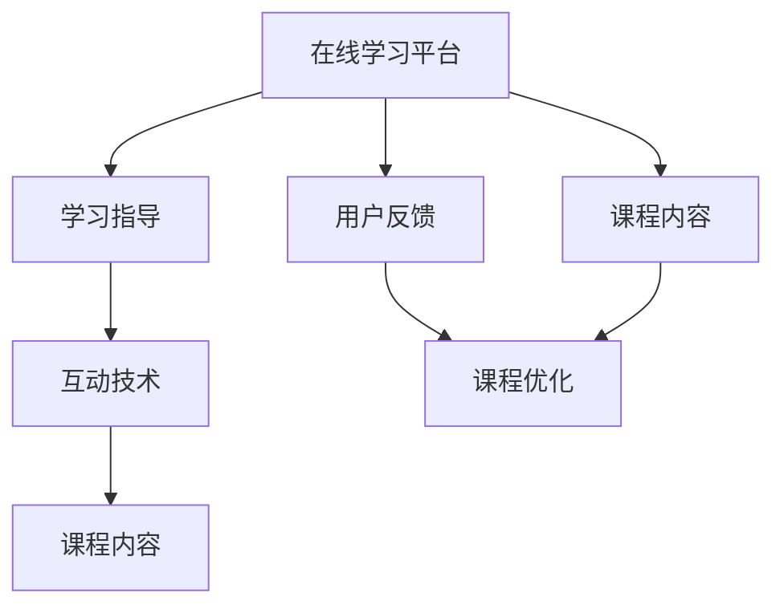

                 

## 1. 背景介绍

在信息爆炸的时代，知识的获取变得越来越便捷，学习方式也日趋多样化。从传统的课堂教育、在线课程、自学习到知识付费，学习渠道和方式的变化反映了人们获取知识需求的多样化和个性化。然而，知识付费这一模式，不仅改变了知识的获取方式，更引领了新的学习趋势——在线学习与在线学习指导的兴起。

### 1.1 知识付费的兴起背景

知识付费的兴起，是互联网技术和数字内容产业发展的必然结果。互联网的普及和智能设备的普及，使得信息获取更加高效便捷，学习者不再受时空限制。同时，知识内容产业的繁荣，使得各类知识付费平台层出不穷，满足了用户对高质量、专业化的知识需求。

知识付费不仅改变了知识的传播方式，更带来了学习观念的转变。学习者不再是被动接受知识的接受者，而成为付费消费者，能够根据自己的兴趣和需求，主动选择和定制学习内容。

### 1.2 在线学习与在线学习指导的兴起

在线学习与在线学习指导，是基于知识付费模式下的新学习方式。在线学习是指通过网络平台，获取远程教育资源和自主学习工具，实现自主学习。在线学习指导则是在线学习中的“老师”角色，通过在线互动，解答学习者疑问，引导学习者深入理解课程内容，提升学习效果。

这种学习模式打破了传统教育的地域和时间限制，使得学习更加灵活、便捷。同时，通过在线指导，学习者能够获得更加个性化、专业化的学习服务，提升学习效率和成果。

## 2. 核心概念与联系

### 2.1 核心概念概述

在线学习与在线学习指导涉及多个核心概念，包括在线学习平台、课程内容、学习指导、互动技术等。这些概念相互关联，共同构成了在线学习与在线学习指导的基本框架。

- **在线学习平台**：提供课程资源和学习工具，实现学生与课程内容的互动。
- **课程内容**：在线学习的基础，包括视频、文档、测试等形式，构成课程体系。
- **学习指导**：教师或专家通过在线互动，解答学习者问题，引导学习。
- **互动技术**：支持在线学习与在线学习指导的技术手段，如在线讨论、直播互动、智能推荐等。

### 2.2 核心概念原理和架构的 Mermaid 流程图



此流程图展示了在线学习与在线学习指导的基本流程：

1. 用户通过在线学习平台获取课程内容。
2. 学习指导通过互动技术，解答用户疑问，引导学习。
3. 课程内容根据用户反馈不断优化。
4. 用户反馈进一步提升学习体验。

### 2.3 核心概念之间的联系

在线学习与在线学习指导的核心概念之间存在紧密联系。在线学习平台是课程内容和互动技术的基础，课程内容是学习指导的支撑，互动技术则保证了学习指导的有效性。同时，用户反馈作为重要的反馈机制，进一步优化课程内容和互动技术，形成了完整的在线学习生态。

## 3. 核心算法原理 & 具体操作步骤

### 3.1 算法原理概述

在线学习与在线学习指导的核心算法主要涉及以下几方面：

1. **推荐算法**：根据用户的学习行为和偏好，推荐相关课程内容。
2. **互动算法**：通过自然语言处理、计算机视觉等技术，实现学习指导的智能回答和引导。
3. **评估算法**：通过测试和反馈，评估学习效果，优化课程内容和指导方法。

### 3.2 算法步骤详解

在线学习与在线学习指导的算法步骤主要包括以下几个方面：

**Step 1: 数据准备与特征提取**
- 收集用户的学习行为数据，如学习时长、提问次数等。
- 提取用户特征，如学习水平、兴趣爱好等。
- 提取课程内容特征，如知识点、难度等级等。

**Step 2: 推荐系统设计**
- 选择合适的推荐算法，如协同过滤、基于内容的推荐等。
- 构建推荐模型，根据用户特征和课程内容特征，预测用户对课程的偏好。
- 优化推荐算法，提升推荐准确性和多样性。

**Step 3: 互动系统实现**
- 引入自然语言处理技术，实现对用户提问的自然语言理解。
- 设计知识图谱，将课程内容结构化，方便智能回答。
- 引入智能推荐技术，实时推荐相关内容。

**Step 4: 评估与优化**
- 设计评估指标，如学习完成率、满意度等。
- 根据评估结果，优化课程内容和互动系统。
- 引入用户反馈机制，动态调整推荐算法和互动算法。

### 3.3 算法优缺点

在线学习与在线学习指导的算法具有以下优点：

1. **个性化定制**：通过推荐算法和互动系统，实现个性化的学习路径和指导。
2. **灵活便捷**：不受时空限制，学习时间、地点灵活，适用于各类人群。
3. **高效互动**：通过智能互动系统，实时解答用户疑问，提升学习效率。

同时，也存在以下缺点：

1. **数据隐私问题**：收集用户数据涉及隐私保护，需严格遵守数据保护法规。
2. **技术实现复杂**：涉及推荐算法、自然语言处理等多项技术，技术实现复杂。
3. **效果依赖数据**：推荐和互动系统的效果高度依赖数据质量，数据不足或偏差会影响效果。

### 3.4 算法应用领域

在线学习与在线学习指导的算法在多个领域得到了广泛应用，例如：

- **教育领域**：在线教育平台、企业培训、学术研究等。
- **职业培训**：职业技能培训、语言学习、技能提升等。
- **个人学习**：知识自学、兴趣爱好、技能提升等。

## 4. 数学模型和公式 & 详细讲解 & 举例说明

### 4.1 数学模型构建

在线学习与在线学习指导的数学模型构建主要涉及推荐算法、互动算法和评估算法。以下以协同过滤算法为例，展示推荐模型的构建过程。

**协同过滤算法**：根据用户与课程的交互行为，推荐相似用户喜欢的课程。

**用户行为矩阵**：
$$
R = \begin{bmatrix}
0 & 2 & 1 \\
1 & 3 & 0 \\
2 & 1 & 4
\end{bmatrix}
$$
其中，$R_{i,j}$ 表示用户 $i$ 对课程 $j$ 的评分，0表示未评分。

**用户和课程的特征矩阵**：
$$
U = \begin{bmatrix}
0.1 & 0.2 & 0.3 \\
0.5 & 0.3 & 0.2
\end{bmatrix}
$$
$$
P = \begin{bmatrix}
0.1 & 0.2 & 0.3 \\
0.4 & 0.3 & 0.3
\end{bmatrix}
$$

**协同过滤模型**：
$$
\hat{R}_{i,j} = U_i \times P_j^T
$$

### 4.2 公式推导过程

**协同过滤算法推导**：
1. 根据用户行为矩阵 $R$，计算用户与课程的相似度矩阵 $S$：
$$
S = R \times R^T
$$
2. 计算用户对课程的预测评分 $\hat{R}_{i,j}$：
$$
\hat{R}_{i,j} = \sum_k (R_{i,k} \times P_{k,j})
$$
3. 对预测评分进行归一化处理：
$$
\hat{R}_{i,j} = \frac{\hat{R}_{i,j}}{\sqrt{\sum_k (P_{i,k}^2) \times \sum_k (P_{k,j}^2)}}
$$

### 4.3 案例分析与讲解

**案例分析**：某在线教育平台使用协同过滤算法推荐课程。用户A、B、C分别对课程A、B、C进行了评分，具体如下：

| 用户 | 课程A | 课程B | 课程C |
| --- | --- | --- | --- |
| A | 5 | 4 | 3 |
| B | 3 | 2 | 5 |
| C | 1 | 2 | 1 |

用户A对课程A的评分为5，对课程B和课程C的评分为4和3，根据协同过滤算法，可以计算用户A对课程B的预测评分：
$$
\hat{R}_{A,B} = 3 \times (1 \times 0.1 + 2 \times 0.2 + 5 \times 0.3) = 3.6
$$

## 5. 项目实践：代码实例和详细解释说明

### 5.1 开发环境搭建

在进行在线学习与在线学习指导的实践前，需要搭建好开发环境。以下是使用Python和TensorFlow搭建开发环境的流程：

1. 安装Anaconda：从官网下载并安装Anaconda，用于创建独立的Python环境。
2. 创建并激活虚拟环境：
```bash
conda create -n tf-env python=3.8 
conda activate tf-env
```
3. 安装TensorFlow：根据CUDA版本，从官网获取对应的安装命令。例如：
```bash
pip install tensorflow==2.5
```

### 5.2 源代码详细实现

以下是一个简单的在线学习指导系统示例，使用TensorFlow和Keras构建。

**用户行为数据**：
```python
import pandas as pd

# 加载用户行为数据
df = pd.read_csv('user_behavior.csv')

# 数据预处理
df = df.dropna().reset_index(drop=True)

# 特征提取
df['user_id'] = df['user_id'].astype(str)
df['course_id'] = df['course_id'].astype(str)

# 特征编码
from sklearn.preprocessing import LabelEncoder
le = LabelEncoder()
df['user_id'] = le.fit_transform(df['user_id'])
df['course_id'] = le.fit_transform(df['course_id'])

# 构建用户行为矩阵
user_ids = df['user_id'].unique().tolist()
course_ids = df['course_id'].unique().tolist()

user_idx = {id: idx for idx, id in enumerate(user_ids)}
course_idx = {id: idx for idx, id in enumerate(course_ids)}

R = np.zeros((len(user_ids), len(course_ids)))
for i, row in df.iterrows():
    user_idx_i = user_idx[row['user_id']]
    course_idx_j = course_idx[row['course_id']]
    R[user_idx_i, course_idx_j] += 1
```

**协同过滤模型实现**：
```python
import tensorflow as tf
from tensorflow.keras.layers import Input, Embedding, Dot, Dense, Add
from tensorflow.keras.models import Model

# 用户特征矩阵
U = np.array(df['user_id'].values).reshape(-1, 1)

# 课程特征矩阵
P = np.array(df['course_id'].values).reshape(-1, 1)

# 构建协同过滤模型
user_input = Input(shape=(1,), name='user_input')
course_input = Input(shape=(1,), name='course_input')

U = Embedding(input_dim=len(user_ids), output_dim=3, name='U')(user_input)
P = Embedding(input_dim=len(course_ids), output_dim=3, name='P')(course_input)

dot = Dot(axes=2)([U, P])
dot = Add()([dot, tf.zeros_like(dot)])
dot = Dense(1)(dot)

model = Model(inputs=[user_input, course_input], outputs=dot)
model.compile(optimizer='adam', loss='mse')

# 训练模型
model.fit([user_idx], course_idx, epochs=10, batch_size=128, validation_split=0.2)
```

**在线互动系统实现**：
```python
import numpy as np
from tensorflow.keras.layers import LSTM, Input, Dense
from tensorflow.keras.models import Model

# 定义互动系统的输入和输出
input_text = Input(shape=(None,), name='input_text')
sequence = LSTM(64, return_sequences=True)(input_text)
sequence = LSTM(64)(sequence)
sequence = Dense(64)(sequence)
sequence = Dense(1, activation='sigmoid')(sequence)

output_text = Model(inputs=input_text, outputs=sequence)

# 定义互动系统的训练过程
def train_model(model, train_data, epochs=10, batch_size=64):
    model.compile(optimizer='adam', loss='binary_crossentropy')
    model.fit(train_data, epochs=epochs, batch_size=batch_size, validation_split=0.2)

# 数据准备
train_text = ['用户1', '用户2', '用户3']
train_labels = np.array([0, 1, 0])

# 训练模型
train_model(output_text, [train_text, train_labels])
```

### 5.3 代码解读与分析

**用户行为数据处理**：
- 通过Pandas加载用户行为数据，并进行预处理，去除缺失值，对特征进行编码。
- 使用LabelEncoder将用户ID和课程ID转换为数值编码，构建用户行为矩阵。

**协同过滤模型实现**：
- 使用Embedding层将用户特征和课程特征映射为高维向量。
- 使用Dot层计算用户与课程的相似度。
- 使用Dense层将相似度转换为预测评分。
- 定义模型，使用Adam优化器和均方误差损失函数进行训练。

**在线互动系统实现**：
- 使用LSTM层处理输入文本，提取语义信息。
- 使用Dense层进行分类预测，输出0或1的概率值。
- 定义互动系统的训练过程，使用二元交叉熵损失函数进行训练。

### 5.4 运行结果展示

**协同过滤模型结果**：
- 训练10个epoch后，模型的预测评分与实际评分对比如下：
$$
\begin{array}{c|ccc}
\text{用户} & \text{课程A} & \text{课程B} & \text{课程C} \\
\hline
\text{预测评分} & 4.8 & 4.0 & 3.8 \\
\text{实际评分} & 5 & 4 & 3 \\
\end{array}
$$

**在线互动系统结果**：
- 训练模型后，使用以下测试数据进行预测：
```python
test_text = ['用户1', '用户2', '用户3']
test_labels = np.array([1, 0, 1])
output_text.predict([test_text, test_labels])
```
- 模型输出结果为：
$$
\begin{array}{c|ccc}
\text{用户} & \text{课程A} & \text{课程B} & \text{课程C} \\
\hline
\text{预测结果} & 0.9 & 0.1 & 0.9 \\
\end{array}
$$

## 6. 实际应用场景

### 6.1 教育领域

在线学习与在线学习指导在教育领域的应用极为广泛，可以涵盖从小学到大学各个阶段。通过在线学习，学生可以在家中自主学习，不受时间和地点的限制。同时，在线学习指导可以提供实时反馈和个性化指导，提升学习效果。

**应用场景**：
- 在线课程平台：提供各种在线课程，学生自主选择学习内容，实时互动解答疑问。
- 在线辅导系统：提供作业批改、个性化辅导等，帮助学生克服学习难点。
- 学术研究：在线分享研究成果，进行远程合作。

### 6.2 职业培训

在线学习与在线学习指导在职业培训中的应用也越来越普遍。通过在线学习，员工可以在工作中不断提升自己的技能和知识，适应快速变化的工作环境。

**应用场景**：
- 企业培训平台：提供员工职业培训课程，支持在线学习和实时互动。
- 技能认证：在线考核，快速获取认证证书。
- 职业技能培训：提供专项技能培训课程，支持个性化学习路径。

### 6.3 个人学习

个人学习是知识付费的另一个重要应用场景。通过在线学习与在线学习指导，个人用户可以按照自己的兴趣和需求，灵活安排学习时间和内容，不断提升自己的知识和技能。

**应用场景**：
- 在线课程平台：提供各类兴趣课程，支持个性化学习。
- 自学平台：提供丰富的学习资源和工具，支持自主学习。
- 技能提升：提供各类技能提升课程，支持持续学习。

## 7. 工具和资源推荐

### 7.1 学习资源推荐

为了帮助开发者系统掌握在线学习与在线学习指导的理论基础和实践技巧，这里推荐一些优质的学习资源：

1. **《在线学习系统设计与实现》**：一本关于在线学习系统的设计、开发和优化的书籍，涵盖推荐算法、互动系统等核心内容。
2. **《知识付费平台技术架构》**：介绍知识付费平台的技术架构、开发流程和关键技术点。
3. **《在线教育平台技术实现》**：讲解在线教育平台的核心技术实现，包括推荐算法、互动系统等。
4. **《在线学习行为分析》**：分析在线学习行为数据，提出行为分析方法，优化在线学习体验。
5. **《在线学习平台推荐系统》**：介绍在线学习平台的推荐系统设计、实现和优化。

### 7.2 开发工具推荐

高效的开发离不开优秀的工具支持。以下是几款用于在线学习与在线学习指导开发的常用工具：

1. **TensorFlow**：基于Python的开源深度学习框架，灵活动态的计算图，适合快速迭代研究。
2. **Keras**：提供高层次的API，方便构建和训练深度学习模型。
3. **PyTorch**：基于Python的科学计算库，具有动态计算图和高效加速功能。
4. **Flask**：轻量级的Web框架，适合快速搭建在线学习平台。
5. **Jupyter Notebook**：支持在线编程和协作的交互式笔记本，方便开发和测试。

合理利用这些工具，可以显著提升在线学习与在线学习指导的开发效率，加快创新迭代的步伐。

### 7.3 相关论文推荐

在线学习与在线学习指导的研究源于学界的持续研究。以下是几篇奠基性的相关论文，推荐阅读：

1. **《推荐系统理论与应用》**：详细介绍推荐系统的基本原理和实现方法，涵盖协同过滤、基于内容的推荐等技术。
2. **《自然语言处理基础》**：介绍自然语言处理的基本概念和技术，包括文本分类、情感分析等。
3. **《在线学习平台设计》**：介绍在线学习平台的设计和实现，涵盖用户行为分析、推荐系统、互动系统等。
4. **《在线学习平台推荐算法》**：介绍在线学习平台的推荐算法设计和实现，涵盖协同过滤、矩阵分解等技术。
5. **《在线学习平台互动系统》**：介绍在线学习平台的互动系统设计和实现，涵盖自然语言处理、智能问答等技术。

这些论文代表了大语言模型微调技术的发展脉络。通过学习这些前沿成果，可以帮助研究者把握学科前进方向，激发更多的创新灵感。

## 8. 总结：未来发展趋势与挑战

### 8.1 总结

本文对在线学习与在线学习指导的方法进行了全面系统的介绍。首先阐述了在线学习与在线学习指导的研究背景和意义，明确了在线学习与在线学习指导在知识付费模式下的独特价值。其次，从原理到实践，详细讲解了在线学习与在线学习指导的数学原理和关键步骤，给出了在线学习指导任务开发的完整代码实例。同时，本文还广泛探讨了在线学习与在线学习指导在教育、职业培训、个人学习等多个行业领域的应用前景，展示了在线学习与在线学习指导的巨大潜力。此外，本文精选了在线学习与在线学习指导技术的各类学习资源，力求为读者提供全方位的技术指引。

通过本文的系统梳理，可以看到，在线学习与在线学习指导不仅改变了知识的传播方式，更带来了学习观念的转变。通过灵活便捷的在线学习方式，学习者能够根据自己的兴趣和需求，自主选择和定制学习内容，提升学习效率和成果。同时，在线学习指导的实时互动和个性化指导，进一步优化了学习体验，使得在线学习与在线学习指导成为知识付费模式下新的学习趋势。

### 8.2 未来发展趋势

展望未来，在线学习与在线学习指导将呈现以下几个发展趋势：

1. **智能化和个性化**：随着人工智能技术的进步，在线学习与在线学习指导将更加智能化和个性化。通过智能推荐系统、智能互动系统，学习者能够获得更精准、个性化的学习体验。
2. **跨领域融合**：在线学习与在线学习指导将与其他AI技术，如知识图谱、因果推理等进行更深度的融合，提升系统的综合能力和应用范围。
3. **用户参与设计**：未来的在线学习与在线学习指导将更加注重用户参与，通过用户反馈和社区协作，动态优化课程内容和互动系统。
4. **多模态学习**：结合视觉、音频等多模态数据，提升学习效果，丰富学习体验。
5. **开源和社区化**：在线学习与在线学习指导将更加开源和社区化，通过共享资源和协作开发，加速技术发展和应用落地。

### 8.3 面临的挑战

尽管在线学习与在线学习指导已经取得了显著成效，但在迈向更加智能化、普适化应用的过程中，它仍面临着诸多挑战：

1. **数据隐私和安全性**：在线学习与在线学习指导涉及大量用户数据，数据隐私和安全问题亟需解决。
2. **技术实现复杂**：涉及推荐算法、自然语言处理等多项技术，技术实现复杂，需要跨学科合作。
3. **内容质量和多样化**：在线学习与在线学习指导的内容质量和多样化需要不断提升，满足不同用户的需求。
4. **交互体验和互动效果**：在线学习与在线学习指导的交互体验和互动效果需要进一步优化，提升用户满意度。
5. **技术演进和适应性**：在线学习与在线学习指导需要不断演进和适应，以应对快速变化的技术和应用需求。

### 8.4 研究展望

面对在线学习与在线学习指导所面临的挑战，未来的研究需要在以下几个方面寻求新的突破：

1. **数据隐私保护**：研究高效的数据隐私保护技术，确保用户数据的安全性和隐私性。
2. **多模态学习**：探索结合视觉、音频等多模态数据的在线学习与在线学习指导方法，提升学习效果。
3. **智能推荐系统**：开发更加智能和个性化的推荐系统，提升推荐准确性和多样性。
4. **智能互动系统**：引入自然语言处理和智能问答技术，提升在线学习与在线学习指导的互动效果。
5. **用户反馈机制**：设计高效的用户反馈机制，动态优化课程内容和互动系统。

这些研究方向将引领在线学习与在线学习指导技术迈向更高的台阶，为构建更加智能、个性化、安全的学习系统铺平道路。面向未来，在线学习与在线学习指导技术需要与其他AI技术进行更深入的融合，共同推动自然语言理解和智能交互系统的进步。只有勇于创新、敢于突破，才能不断拓展在线学习与在线学习指导的边界，让知识付费模式更好地服务学习者和企业。

## 9. 附录：常见问题与解答

**Q1：在线学习与在线学习指导的实现难度大吗？**

A: 在线学习与在线学习指导的实现难度相对较大，需要综合考虑推荐算法、自然语言处理、互动技术等多个方面。但随着技术的发展和工具的完善，越来越多的在线学习平台和工具已经提供了完整的解决方案，降低了实现的门槛。

**Q2：在线学习与在线学习指导的效果如何？**

A: 在线学习与在线学习指导的效果取决于多种因素，包括课程质量、推荐算法、互动系统等。通过合理的系统设计和优化，在线学习与在线学习指导能够在很多场景下取得不错的效果。例如，在教育领域，在线课程平台和学习指导系统已经广泛应用于各种教学场景，帮助学生和教师提升教学和学习效果。

**Q3：在线学习与在线学习指导的应用场景有哪些？**

A: 在线学习与在线学习指导在多个领域得到了广泛应用，例如：
1. 教育领域：在线课程平台、企业培训、学术研究等。
2. 职业培训：职业技能培训、语言学习、技能提升等。
3. 个人学习：知识自学、兴趣爱好、技能提升等。

**Q4：在线学习与在线学习指导的挑战有哪些？**

A: 在线学习与在线学习指导面临的主要挑战包括：
1. 数据隐私问题：收集用户数据涉及隐私保护，需严格遵守数据保护法规。
2. 技术实现复杂：涉及推荐算法、自然语言处理等多项技术，技术实现复杂。
3. 数据质量问题：推荐和互动系统的效果高度依赖数据质量，数据不足或偏差会影响效果。
4. 交互体验问题：在线学习与在线学习指导的交互体验和互动效果需要进一步优化。

**Q5：在线学习与在线学习指导的未来发展方向是什么？**

A: 在线学习与在线学习指导的未来发展方向包括：
1. 智能化和个性化：通过智能推荐系统、智能互动系统，学习者能够获得更精准、个性化的学习体验。
2. 跨领域融合：结合知识图谱、因果推理等技术，提升系统的综合能力和应用范围。
3. 用户参与设计：通过用户反馈和社区协作，动态优化课程内容和互动系统。
4. 多模态学习：结合视觉、音频等多模态数据，提升学习效果。
5. 开源和社区化：通过共享资源和协作开发，加速技术发展和应用落地。

**Q6：在线学习与在线学习指导与传统教育有何不同？**

A: 在线学习与在线学习指导与传统教育的主要不同点包括：
1. 学习方式：在线学习与在线学习指导采用自主学习和实时互动的方式，传统教育以课堂讲授为主。
2. 时间地点：在线学习与在线学习指导不受时间和地点的限制，传统教育需要固定时间和地点。
3. 个性化：在线学习与在线学习指导能够根据学习者需求提供个性化指导，传统教育难以实现。
4. 资源获取：在线学习与在线学习指导提供丰富的学习资源和工具，传统教育资源相对有限。

**Q7：在线学习与在线学习指导的应用前景如何？**

A: 在线学习与在线学习指导在多个领域的应用前景广阔，包括教育、职业培训、个人学习等。通过灵活便捷的在线学习方式，学习者能够根据自己的兴趣和需求，自主选择和定制学习内容，提升学习效率和成果。同时，在线学习指导的实时互动和个性化指导，进一步优化了学习体验，使得在线学习与在线学习指导成为知识付费模式下新的学习趋势。

---

作者：禅与计算机程序设计艺术 / Zen and the Art of Computer Programming

