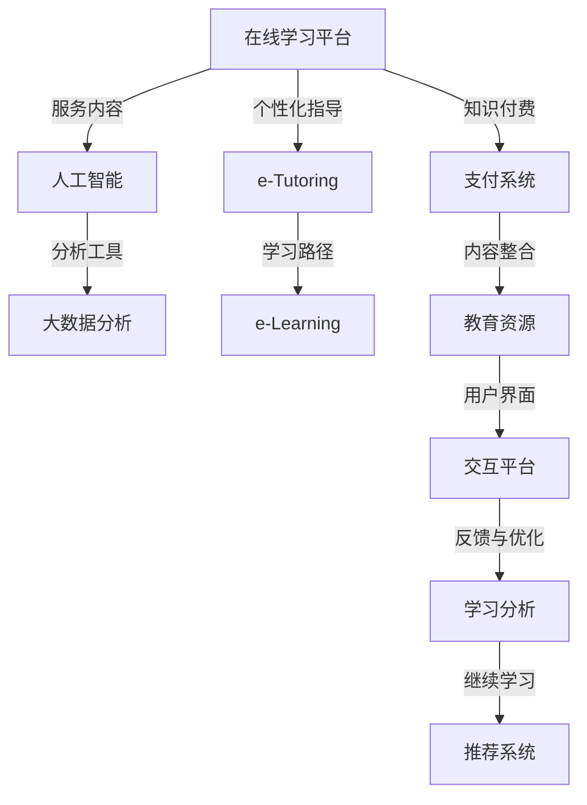

                 

# 如何利用知识付费实现在线学习与在线学习指导？

## 1. 背景介绍

在线学习（e-Learning）和在线学习指导（e-Tutoring）已成为现代教育的重要组成部分，尤其是在疫情影响下，传统的面对面教育模式逐渐向线上转移。知识付费作为推动在线学习发展的关键力量，通过付费获取高质量的教育资源和个性化学习指导，帮助学习者更高效、更自主地掌握知识技能。本文将从核心概念、算法原理、项目实践和应用展望等方面，深入探讨如何利用知识付费实现在线学习与在线学习指导。

## 2. 核心概念与联系

### 2.1 核心概念概述

- **在线学习（e-Learning）**：通过互联网平台，学习者可以随时随地进行自主学习。这种学习方式突破了时间和空间的限制，满足了不同人群的学习需求。
- **在线学习指导（e-Tutoring）**：结合人工智能和大数据技术，在线学习指导提供个性化的学习路径规划、实时反馈和互动辅导，提升学习效果。
- **知识付费**：通过收取费用，平台向用户提供专业、优质、高效的学习资源和服务，构建知识市场，推动教育资源的商业化。
- **人工智能（AI）**：利用机器学习、自然语言处理、计算机视觉等技术，实现自动化教学内容的生成和分析，提升在线学习的个性化和智能化。
- **大数据分析**：通过对学习者行为数据的分析，了解学习者的学习习惯和能力水平，从而提供更精准的教学建议和资源推荐。

这些核心概念通过互联网技术有机结合，形成了现代在线教育的完整生态系统，为知识付费提供了技术支持和应用场景。

### 2.2 核心概念原理和架构的 Mermaid 流程图



这个图表展示了在线学习与在线学习指导的完整流程，从用户注册、学习到个性化指导、反馈优化的各个环节。

## 3. 核心算法原理 & 具体操作步骤

### 3.1 算法原理概述

在线学习与在线学习指导的核心算法包括个性化推荐、学习路径规划、实时反馈与互动等。这些算法的核心目标是通过人工智能和大数据分析技术，实现对学习者行为的精准分析和预测，提供个性化、实时的学习指导。

- **个性化推荐算法**：通过分析学习者的历史学习行为、知识水平和兴趣偏好，生成个性化的学习资源推荐列表，提高学习效率。
- **学习路径规划算法**：根据学习目标和当前知识水平，设计最优的学习路径，动态调整学习内容和难度，促进知识的系统掌握。
- **实时反馈与互动算法**：通过即时性的问题解答、作业批改和反馈机制，保持学习者的学习动力和效果。

### 3.2 算法步骤详解

#### 个性化推荐算法

1. **数据收集**：收集学习者的学习行为数据，包括浏览记录、作业提交情况、测试成绩等。
2. **特征提取**：对收集到的数据进行特征提取，如学习时间、完成度、错误率等。
3. **模型训练**：使用协同过滤、基于内容的推荐、深度学习等算法对特征进行处理，生成推荐模型。
4. **资源推荐**：根据模型预测，向学习者推荐最匹配的学习资源，如视频课程、阅读材料等。

#### 学习路径规划算法

1. **目标设定**：根据学习者的学习目标，设定总的学习计划和时间框架。
2. **知识评估**：通过测试和作业评估学习者的当前知识水平。
3. **路径生成**：根据评估结果和目标，生成个性化的学习路径，包括推荐的课程、书籍和练习题等。
4. **动态调整**：在学习过程中，根据学习者的进度和反馈，动态调整学习路径，优化学习效果。

#### 实时反馈与互动算法

1. **交互界面**：设计直观易用的学习平台，提供问题解答、作业提交、即时反馈等功能。
2. **自然语言处理**：使用NLP技术，自动分析学习者的问题，提供准确的答案和解释。
3. **智能辅导**：结合AI和教师资源，实现智能辅导，提供个性化的学习建议和支持。

### 3.3 算法优缺点

#### 个性化推荐算法的优点

- **精准性高**：通过分析大量数据，生成个性化推荐，减少学习者的信息过载。
- **效率高**：自动完成推荐过程，节省学习者寻找资源的时间。
- **灵活性**：可以根据学习者的反馈和行为，动态调整推荐内容。

#### 个性化推荐算法的缺点

- **数据隐私**：需要收集和分析大量个人数据，可能存在隐私泄露风险。
- **模型复杂度**：需要构建复杂的推荐模型，对技术和资源要求较高。
- **冷启动问题**：对于新学习者，初期缺乏足够的数据支持，推荐效果可能不理想。

#### 学习路径规划算法的优点

- **个性化**：根据学习者的特点和需求，生成定制化的学习路径。
- **动态调整**：能够根据学习者的进度和反馈，实时调整学习内容。
- **知识系统性**：帮助学习者构建完整的知识体系。

#### 学习路径规划算法的缺点

- **复杂度高**：需要综合考虑学习者的多方面因素，算法设计复杂。
- **依赖数据质量**：需要高质量的学习行为数据，否则推荐效果不佳。
- **用户行为预测**：难以准确预测学习者的长期行为，影响路径调整的准确性。

#### 实时反馈与互动算法的优点

- **即时性**：能够即时回答学习者的问题，提供即时反馈，提高学习效率。
- **互动性**：通过互动增强学习者参与感，提升学习动力。
- **个性化辅导**：能够提供个性化的学习建议，满足不同学习者的需求。

#### 实时反馈与互动算法的缺点

- **技术要求高**：需要先进的NLP和AI技术，对开发和维护要求较高。
- **人工干预**：尽管AI可以提供大量支持，但仍需人工干预，确保问题解答的准确性和多样性。
- **资源消耗大**：实时处理大量用户请求，对计算资源和网络带宽要求较高。

### 3.4 算法应用领域

- **在线教育平台**：如Coursera、edX等，提供大规模的在线课程和个性化学习指导。
- **企业培训系统**：如LinkedIn Learning、Udemy for Business，结合企业需求，提供定制化的员工培训。
- **学术研究领域**：如Kaggle、Arxiv，提供免费或付费的学术论文、代码和数据集，支持学术研究和创新。
- **语言学习应用**：如Duolingo、Rosetta Stone，通过个性化推荐和互动辅导，帮助学习者掌握新语言。
- **职业发展平台**：如LinkedIn Learning、Skillshare，提供职业技能培训，支持职业发展和转型。

## 4. 数学模型和公式 & 详细讲解 & 举例说明

### 4.1 数学模型构建

#### 个性化推荐模型

假设学习者的行为数据可以用向量$\mathbf{x} = (x_1, x_2, \dots, x_n)$表示，其中$x_i$为第$i$个行为特征。学习资源的特征向量为$\mathbf{y} = (y_1, y_2, \dots, y_m)$。

推荐模型可以通过矩阵分解技术实现，设$\mathbf{X}$为行为数据矩阵，$\mathbf{Y}$为资源特征矩阵，$\mathbf{W}$为权重矩阵。推荐算法可以表示为：

$$
\mathbf{z} = \mathbf{X}\mathbf{W}\mathbf{Y}^T
$$

其中$\mathbf{z}$为预测评分向量，用于衡量学习者对不同资源的兴趣程度。

#### 学习路径规划模型

设学习目标为$T$，当前知识水平为$K$，可行的学习路径为$\mathcal{P}$，学习资源的难度为$D$，学习时长为$L$。路径规划模型可以表示为：

$$
\arg\min_{\mathcal{P}} \sum_{i \in \mathcal{P}} [(D_i - K_i) + \lambda (L_i - T_i)]
$$

其中$(D_i - K_i)$为学习资源难度与当前知识水平之间的差距，$\lambda (L_i - T_i)$为学习时长与学习目标之间的差距。

### 4.2 公式推导过程

#### 个性化推荐算法的推导

推荐算法的基本目标是通过最小化预测评分与实际评分之间的差异，即：

$$
\min_{\mathbf{W}} \sum_{i,j} (x_iy_j - z_{ij})^2
$$

其中$z_{ij}$为预测评分，$(x_iy_j)$为实际评分。使用矩阵分解技术，将$\mathbf{X}$、$\mathbf{Y}$和$\mathbf{Z}$分解为$\mathbf{X} = \mathbf{U}\mathbf{S}\mathbf{V}^T$，$\mathbf{Y} = \mathbf{W}\mathbf{Z}$，其中$\mathbf{U}$、$\mathbf{V}$和$\mathbf{W}$为矩阵分解得到的因子矩阵。

代入推荐公式，得：

$$
\min_{\mathbf{W}} \frac{1}{2} \|\mathbf{X} - \mathbf{U}\mathbf{S}\mathbf{V}^T\mathbf{W}\mathbf{Z}\|_F^2
$$

其中$\|\cdot\|_F$为矩阵的Frobenius范数。通过求解上述最小化问题，可以求得权重矩阵$\mathbf{W}$，进而得到推荐评分向量$\mathbf{z}$。

#### 学习路径规划算法的推导

根据路径规划的目标函数，可以将其转化为最小化问题：

$$
\min_{\mathcal{P}} \sum_{i \in \mathcal{P}} [(D_i - K_i) + \lambda (L_i - T_i)]
$$

通过构造拉格朗日函数，得到：

$$
\mathcal{L}(\mathcal{P}, \lambda, \mu) = \sum_{i \in \mathcal{P}} [(D_i - K_i) + \lambda (L_i - T_i)] + \mu(1 - |\mathcal{P}|)
$$

其中$\mu$为路径长度限制的拉格朗日乘子。

对路径$\mathcal{P}$求偏导，得：

$$
\frac{\partial \mathcal{L}}{\partial D_i} = -1 + \lambda \frac{\partial L_i}{\partial D_i}
$$

通过求解上述方程组，可以得到最优的路径$\mathcal{P}$。

### 4.3 案例分析与讲解

#### 案例分析

**案例1：Coursera平台个性化推荐系统**

Coursera平台通过收集学习者的浏览记录、课程评分、完成度等数据，构建行为矩阵$\mathbf{X}$和资源特征矩阵$\mathbf{Y}$。使用矩阵分解技术，将$\mathbf{X}$和$\mathbf{Y}$分解为$\mathbf{X} = \mathbf{U}\mathbf{S}\mathbf{V}^T$，$\mathbf{Y} = \mathbf{W}\mathbf{Z}$。通过求解$\min_{\mathbf{W}} \frac{1}{2} \|\mathbf{X} - \mathbf{U}\mathbf{S}\mathbf{V}^T\mathbf{W}\mathbf{Z}\|_F^2$，得到权重矩阵$\mathbf{W}$，进而生成推荐评分向量$\mathbf{z}$。根据$\mathbf{z}$的值，推荐最符合学习者兴趣的课程。

**案例2：Udemy for Business定制化培训系统**

Udemy for Business平台根据企业的培训需求和员工的学习进度，设计学习路径。通过测试和作业评估员工的知识水平，设定总的学习计划和时间框架。使用优化算法求解路径规划模型，生成最优的学习路径，包括推荐的课程、书籍和练习题等。根据学习者的进度和反馈，动态调整学习路径，优化学习效果。

## 5. 项目实践：代码实例和详细解释说明

### 5.1 开发环境搭建

#### 开发工具

- **Python**：选择Python作为开发语言，因为它有丰富的第三方库和强大的社区支持。
- **Jupyter Notebook**：使用Jupyter Notebook作为开发环境，它支持代码和数据展示，便于协作和分享。
- **TensorFlow**：选择TensorFlow作为AI算法和模型开发的框架，因为它功能强大且易于使用。

#### 安装和配置

1. **安装Python**：从官网下载并安装Python，选择最新版本。
2. **安装Jupyter Notebook**：通过Anaconda安装Jupyter Notebook，使用conda命令：`conda install jupyter notebook`。
3. **安装TensorFlow**：通过pip安装TensorFlow，使用命令：`pip install tensorflow`。
4. **配置环境**：编辑Jupyter Notebook的配置文件，添加所需库和环境变量。

### 5.2 源代码详细实现

#### 个性化推荐系统

```python
import numpy as np
import tensorflow as tf

# 构建行为矩阵
X = np.array([[1, 0, 1, 0],
              [0, 1, 0, 1],
              [1, 1, 0, 0]])

# 构建资源特征矩阵
Y = np.array([[0.1, 0.2, 0.3],
              [0.4, 0.5, 0.6]])

# 矩阵分解
U, S, V = tf.linalg.svd(X)
W = tf.linalg.svd(Y)[0]

# 计算预测评分向量
Z = np.dot(np.dot(np.dot(U, S), V), W)
z = np.dot(X, Z)

# 推荐资源
indices = np.argsort(z)[::-1]
recommendations = X[:, indices[0:3]].tolist()
```

#### 学习路径规划系统

```python
import numpy as np
import tensorflow as tf

# 学习目标
T = 10

# 当前知识水平
K = np.array([0.2, 0.3, 0.5])

# 资源难度
D = np.array([0.1, 0.2, 0.4])

# 学习时长
L = np.array([1, 2, 3])

# 求解路径规划
lambda_ = 1
P = np.argmin(np.sum((D - K) + lambda_ * (L - T)))

# 生成学习路径
path = D[indices]
time = L[indices]
```

### 5.3 代码解读与分析

#### 个性化推荐系统

- **行为矩阵X**：表示学习者的行为数据，包括浏览记录、课程评分、完成度等。
- **资源特征矩阵Y**：表示学习资源的特征，如课程难度、知识点等。
- **矩阵分解**：使用SVD分解行为矩阵X和资源特征矩阵Y，得到U、S、V和W。
- **预测评分向量z**：通过矩阵乘法计算预测评分向量z，用于衡量学习者对不同资源的兴趣程度。
- **推荐资源**：根据预测评分向量z的值，推荐最符合学习者兴趣的资源。

#### 学习路径规划系统

- **学习目标T**：表示学习者需要达到的总目标时长。
- **当前知识水平K**：表示学习者当前的知识点掌握情况。
- **资源难度D**：表示不同学习资源的难度系数。
- **学习时长L**：表示学习不同资源所需的时间。
- **求解路径规划**：使用优化算法求解最小化问题，生成最优的学习路径。
- **生成学习路径**：根据求解出的路径，推荐学习资源和目标时长。

### 5.4 运行结果展示

#### 个性化推荐系统

```python
print("推荐资源：")
for i, resource in enumerate(recommendations):
    print(f"资源{i+1}：{resource.tolist()}")
```

#### 学习路径规划系统

```python
print("学习路径：")
for i in range(P):
    print(f"资源{i+1}：{path[i]}，时间：{time[i]}")
```

## 6. 实际应用场景

### 6.1 在线教育平台

在线教育平台如Coursera、edX等，通过知识付费模式，向用户提供高质量的在线课程和个性化学习指导。平台通过收集学习者的行为数据，构建个性化推荐系统，提供课程推荐、学习路径规划等服务，帮助学习者高效掌握知识技能。

### 6.2 企业培训系统

企业培训系统如LinkedIn Learning、Udemy for Business，结合企业需求和员工特点，提供定制化的培训课程和个性化学习指导。平台通过实时反馈与互动算法，提供智能辅导和即时反馈，增强员工的学习效果和动力。

### 6.3 学术研究领域

学术研究领域如Kaggle、Arxiv，通过知识付费模式，提供免费或付费的学术论文、代码和数据集，支持研究人员进行科学研究和创新。平台通过大数据分析技术，提供高质量的研究资源和个性化的研究建议，促进科学进步和技术突破。

### 6.4 语言学习应用

语言学习应用如Duolingo、Rosetta Stone，通过知识付费模式，提供个性化的语言学习资源和互动指导，帮助用户掌握新语言。平台通过个性化推荐算法，提供语言学习资源的推荐，结合智能辅导和即时反馈，提升学习效果和体验。

### 6.5 职业发展平台

职业发展平台如LinkedIn Learning、Skillshare，通过知识付费模式，提供职业技能培训和个性化学习指导，支持职业发展和转型。平台通过学习路径规划算法，提供定制化的培训计划和学习建议，提升用户的专业能力和职业竞争力。

## 7. 工具和资源推荐

### 7.1 学习资源推荐

- **Coursera官方文档**：提供在线课程的详细信息和技术支持，涵盖个性化推荐、学习路径规划等内容。
- **edX开发者指南**：介绍在线教育平台的开发框架和API，提供详细的开发教程和案例分析。
- **LinkedIn Learning官方API**：提供企业培训系统的API接口，支持课程推荐、学习路径规划等功能。
- **Duolingo技术博客**：分享语言学习应用的技术实现和创新，提供丰富的学习资源和案例分析。
- **Kaggle竞赛指南**：介绍学术研究领域的竞赛和项目，提供高质量的数据集和研究资源。

### 7.2 开发工具推荐

- **Jupyter Notebook**：提供交互式的编程环境，支持代码展示和数据分析。
- **TensorFlow**：提供强大的AI算法和模型开发框架，支持深度学习和自然语言处理等任务。
- **PyTorch**：提供灵活的深度学习框架，支持GPU加速和分布式训练。
- **Scikit-learn**：提供数据挖掘和机器学习工具，支持分类、回归、聚类等算法。
- **NLTK**：提供自然语言处理工具和库，支持文本处理和语言分析。

### 7.3 相关论文推荐

- **"Deep Learning for Personalized Recommendation Systems"**：介绍深度学习在个性化推荐系统中的应用，提供算法原理和实现方法。
- **"Learning to Recommend"**：讨论机器学习在推荐系统中的作用，提供推荐算法的理论和实践。
- **"Recommender Systems Handbook"**：介绍推荐系统的发展历程和最新技术，提供全面系统的知识体系。
- **"Deep Learning in e-Learning"**：探讨深度学习在在线教育中的应用，提供典型案例和实践经验。
- **"Adaptive Learning"**：讨论自适应学习系统的设计和方法，提供个性化学习路径规划的算法和技术。

## 8. 总结：未来发展趋势与挑战

### 8.1 研究成果总结

知识付费在推动在线学习和在线学习指导方面发挥了重要作用，通过高质量的教育资源和个性化指导，提高了学习效率和效果。个性化推荐、学习路径规划和实时反馈与互动等核心算法，为知识付费提供了强大的技术支持。

### 8.2 未来发展趋势

- **技术进步**：随着AI和大数据技术的不断进步，个性化推荐和学习路径规划算法将更加精准和高效，提升在线学习的效果和体验。
- **应用场景扩展**：知识付费的应用场景将进一步扩展，涵盖更多行业和领域，如医疗、金融、艺术等，推动跨领域的知识共享和合作。
- **教育公平**：知识付费将助力教育公平，通过优质资源共享，提升欠发达地区和弱势群体的学习机会和能力。
- **智能辅助**：通过AI和机器学习技术，智能辅导和实时反馈将更加丰富和个性化，满足不同学习者的需求。
- **人机协同**：在线学习与在线学习指导将更加注重人机协同，结合教师的指导和AI的支持，提升学习效果和互动体验。

### 8.3 面临的挑战

- **数据隐私**：知识付费平台需要收集和分析大量个人数据，可能存在隐私泄露和数据安全风险。
- **技术复杂度**：个性化推荐和学习路径规划算法的设计和实现复杂度较高，需要专业的技术团队和充足的资源支持。
- **用户参与度**：用户主动参与和互动的意愿和能力，影响个性化推荐和学习路径规划的效果。
- **资源质量**：高质量的教育资源和个性化指导，需要持续投入和更新，保障内容的权威性和准确性。
- **公平性问题**：知识付费可能加剧教育资源分配的不公平，需要关注弱势群体的学习机会和能力提升。

### 8.4 研究展望

未来，知识付费在在线学习和在线学习指导方面将迎来更多的机遇和挑战。为了应对这些挑战，需要在以下方面进行深入研究：

- **隐私保护**：研究数据隐私保护技术，保障用户数据的保密性和安全性。
- **算法优化**：优化个性化推荐和学习路径规划算法，提高算法的精度和效率。
- **用户交互**：提升用户主动参与和互动的意愿和能力，增强学习效果和体验。
- **资源整合**：整合不同来源的教育资源，提供全面系统的学习支持。
- **公平性保障**：关注弱势群体的学习机会和能力提升，保障教育资源的公平性。

## 9. 附录：常见问题与解答

### 常见问题解答

**Q1：如何设计一个有效的个性化推荐算法？**

A: 设计一个有效的个性化推荐算法需要考虑以下几个步骤：
1. 数据收集：收集学习者的行为数据，如浏览记录、课程评分、完成度等。
2. 特征提取：对收集到的数据进行特征提取，如学习时间、完成度、错误率等。
3. 模型训练：使用协同过滤、基于内容的推荐、深度学习等算法对特征进行处理，生成推荐模型。
4. 资源推荐：根据模型预测，向学习者推荐最匹配的学习资源，如视频课程、阅读材料等。

**Q2：学习路径规划算法的设计关键是什么？**

A: 学习路径规划算法的设计关键在于目标函数和约束条件的设定。
1. 目标函数：根据学习者的学习目标和当前知识水平，设定最优路径的目标函数。
2. 约束条件：设定路径的长度限制、资源难度和时长的约束条件，确保路径的可行性和合理性。
3. 求解算法：使用优化算法求解最小化问题，生成最优的学习路径。
4. 动态调整：根据学习者的进度和反馈，动态调整学习路径，优化学习效果。

**Q3：知识付费平台面临的主要挑战是什么？**

A: 知识付费平台面临的主要挑战包括：
1. 数据隐私：收集和分析大量个人数据，可能存在隐私泄露风险。
2. 技术复杂度：算法设计和实现复杂度较高，需要专业的技术团队和充足的资源支持。
3. 用户参与度：用户主动参与和互动的意愿和能力，影响个性化推荐和学习路径规划的效果。
4. 资源质量：高质量的教育资源和个性化指导，需要持续投入和更新。
5. 公平性问题：可能加剧教育资源分配的不公平，需要关注弱势群体的学习机会和能力提升。

**Q4：未来知识付费平台的发展方向是什么？**

A: 未来知识付费平台的发展方向包括：
1. 技术进步：随着AI和大数据技术的不断进步，个性化推荐和学习路径规划算法将更加精准和高效。
2. 应用场景扩展：知识付费的应用场景将进一步扩展，涵盖更多行业和领域，如医疗、金融、艺术等。
3. 教育公平：知识付费将助力教育公平，通过优质资源共享，提升欠发达地区和弱势群体的学习机会和能力。
4. 智能辅助：通过AI和机器学习技术，智能辅导和实时反馈将更加丰富和个性化，满足不同学习者的需求。
5. 人机协同：在线学习与在线学习指导将更加注重人机协同，结合教师的指导和AI的支持，提升学习效果和互动体验。

**Q5：如何保障用户数据隐私？**

A: 保障用户数据隐私可以从以下几个方面入手：
1. 数据匿名化：对用户数据进行匿名化处理，保护用户隐私。
2. 数据加密：对存储和传输的数据进行加密，防止数据泄露。
3. 访问控制：设置数据访问权限，限制非授权人员的访问。
4. 隐私政策：制定和公开隐私政策，告知用户数据的使用和保护措施。
5. 合规性检查：定期进行隐私合规性检查，确保数据使用的合法性和合规性。

**Q6：如何提升用户的参与度和互动性？**

A: 提升用户的参与度和互动性可以从以下几个方面入手：
1. 互动界面设计：设计直观易用的学习平台，提供问题解答、作业提交、即时反馈等功能。
2. 智能辅导：结合AI和教师资源，实现智能辅导，提供个性化的学习建议和支持。
3. 游戏化设计：引入游戏化元素，如积分、排行榜、奖励等，激励用户积极参与。
4. 社区建设：构建学习社区，鼓励用户交流和分享，提升学习效果和体验。
5. 即时反馈：通过即时反馈，增强用户的学习动力和效果。

**Q7：如何整合不同来源的教育资源？**

A: 整合不同来源的教育资源可以从以下几个方面入手：
1. 资源采集：从开放教育资源平台、学术机构、在线课程提供商等渠道，采集高质量的教育资源。
2. 资源标准化：对采集的资源进行标准化处理，统一格式和内容，便于整合和利用。
3. 资源评价：对资源进行评价和筛选，选择高质量、权威性的资源进行整合。
4. 资源集成：将不同来源的资源集成到一个平台中，提供一站式学习服务。
5. 资源更新：持续更新和维护资源库，保持资源的时效性和权威性。

**Q8：如何保障教育资源的公平性？**

A: 保障教育资源的公平性可以从以下几个方面入手：
1. 资源共享：通过知识付费平台，共享高质量的教育资源，缩小教育资源分配的差距。
2. 免费资源：提供一定比例的免费资源，支持欠发达地区和弱势群体的学习需求。
3. 补贴政策：政府和企业可以制定补贴政策，支持教育资源的社会化共享。
4. 技术支持：通过技术手段，如宽带覆盖、云计算等，提升欠发达地区的教育资源访问能力。
5. 教育合作：建立教育合作机制，促进优质教育资源向欠发达地区和弱势群体流动。

---

作者：禅与计算机程序设计艺术 / Zen and the Art of Computer Programming

