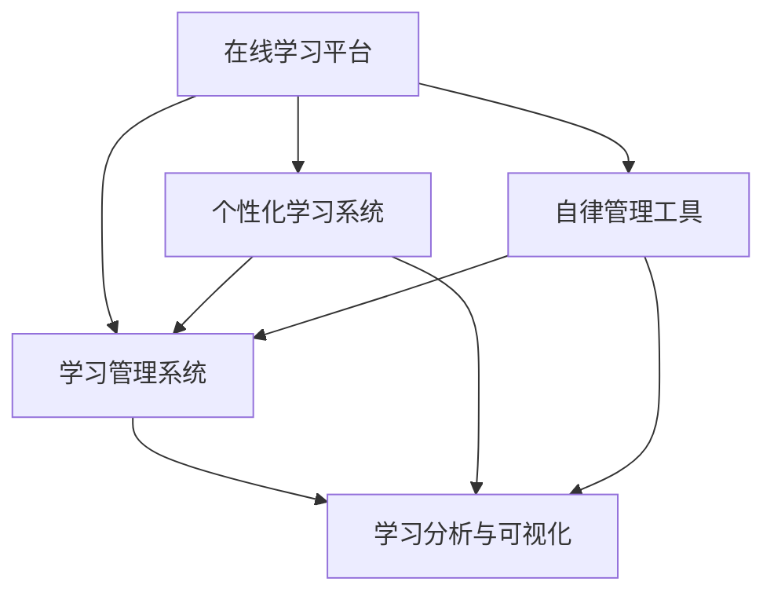

                 

## 1. 背景介绍

在信息爆炸的时代，终身学习成为个人发展的必由之路。然而，碎片化、无组织的学习方式难以真正达到系统化的学习效果。如何构建一个高效、灵活、自律的学习计划，成为许多人的困扰。

近年来，知识付费兴起，在线教育平台如雨后春笋般涌现。这些平台不仅提供了丰富的学习资源，还通过系统化的课程设计和智能学习辅助工具，帮助用户形成科学的学习习惯，管理学习时间，最终实现知识内化。

本文旨在探讨如何利用知识付费实现在线学习计划与自律管理。我们将详细阐述在线学习平台的架构设计、核心算法原理、操作步骤以及数学模型构建，并通过实际应用案例进行深入讲解。

## 2. 核心概念与联系

### 2.1 核心概念概述

为更好地理解在线学习平台的架构和功能，本节将介绍几个核心概念：

- **在线学习平台(Online Learning Platform)**：提供课程内容、学习工具、社区交流等学习资源的平台，通过网络传输给用户。
- **个性化学习系统(Adaptive Learning System)**：利用数据挖掘和推荐算法，根据用户的学习行为和偏好，动态调整学习计划和推荐内容的系统。
- **学习管理系统(Learning Management System, LMS)**：管理学习资源、学习记录、学习反馈等学习数据的系统，支持用户的学习进度跟踪和数据分析。
- **学习分析与可视化(Learning Analytics and Visualization)**：通过数据挖掘和机器学习技术，分析用户的学习数据，生成学习进度报告和学习趋势图表，帮助用户了解学习效果和进步。
- **自律管理工具(Self-discipline Tools)**：辅助用户设定学习目标、规划学习计划、管理学习时间和进度，培养自律习惯的工具。

这些核心概念之间存在紧密的联系，共同构成了在线学习平台的系统框架：



在线学习平台通过个性化学习系统为用户推荐合适的内容，学习管理系统记录用户的学习行为，学习分析与可视化帮助用户了解学习进度和效果，自律管理工具辅助用户制定学习计划和培养自律习惯。这些功能模块协同工作，为用户提供全面、灵活、高效的学习体验。

## 3. 核心算法原理 & 具体操作步骤

### 3.1 算法原理概述

在线学习平台的算法设计主要围绕用户的学习行为分析和个性化推荐展开。核心算法包括：

- **协同过滤算法**：利用用户之间的相似性，推荐用户可能感兴趣的学习资源。
- **内容推荐算法**：根据学习资源的内容特征，如关键词、分类、难度等，推荐符合用户兴趣的学习资源。
- **时间序列预测算法**：预测用户未来的学习行为，生成个性化的学习计划。

### 3.2 算法步骤详解

#### 3.2.1 用户行为分析

在线学习平台首先通过分析用户的学习行为，包括浏览时间、点击次数、学习进度等，构建用户画像。用户画像包含用户的兴趣偏好、学习频率、掌握程度等信息。

**操作步骤**：
1. **数据收集**：记录用户的学习行为数据，包括学习时间、浏览资源、点击操作等。
2. **特征提取**：将学习行为数据转化为数值特征，如用户平均学习时间、特定课程的浏览次数等。
3. **用户画像构建**：使用机器学习算法，如聚类、分类等，分析用户的学习行为数据，生成用户画像。

#### 3.2.2 个性化推荐

个性化推荐是提升在线学习平台用户黏性的关键。通过协同过滤和内容推荐算法，平台能够向用户推荐最适合的学习资源，提高用户的学习效率和满意度。

**操作步骤**：
1. **协同过滤算法**：利用用户之间的相似性，找到与当前用户兴趣相似的其他用户，推荐这些用户喜欢的学习资源。
2. **内容推荐算法**：根据学习资源的特征，如关键词、分类、难度等，预测用户可能感兴趣的学习资源。
3. **推荐结果排序**：根据推荐算法的结果，结合用户的学习进度和历史记录，对推荐结果进行排序。

#### 3.2.3 学习进度跟踪与分析

学习进度跟踪与分析是衡量学习效果的重要手段。通过学习管理系统记录用户的学习进度，学习分析与可视化工具帮助用户了解学习效果和进步。

**操作步骤**：
1. **学习进度记录**：记录用户完成课程的进度、考试成绩、作业提交情况等学习数据。
2. **学习进度可视化**：通过学习分析工具，生成学习进度图表和报告，帮助用户了解学习效果和进度。
3. **学习进度调整**：根据学习进度和分析结果，调整学习计划和推荐内容，确保用户能够高效学习。

#### 3.2.4 自律管理工具

自律管理工具是培养用户自律习惯的关键。通过设定学习目标、管理学习时间和进度，这些工具帮助用户形成良好的学习习惯。

**操作步骤**：
1. **学习目标设定**：用户可以设定长期和短期的学习目标，并分解为具体的学习任务。
2. **学习时间管理**：平台提供学习时间统计和管理工具，帮助用户合理安排学习时间。
3. **学习进度管理**：记录和跟踪用户的任务完成情况，及时调整学习计划。

### 3.3 算法优缺点

在线学习平台的个性化推荐算法具有以下优点：
1. **个性化**：能够根据用户的学习行为和偏好，推荐最适合的学习资源。
2. **高效**：利用协同过滤和内容推荐算法，快速生成推荐结果。
3. **可扩展**：算法可以不断优化和扩展，提升推荐效果。

同时，这些算法也存在一些局限性：
1. **数据依赖**：推荐效果依赖于数据的质量和完整性，难以处理冷启动问题。
2. **过拟合风险**：如果推荐算法过于依赖当前用户的历史数据，可能会产生过拟合，降低推荐效果。
3. **公平性问题**：推荐算法可能会偏向于热门资源，忽视长尾资源，导致资源分布不均衡。

### 3.4 算法应用领域

在线学习平台的个性化推荐算法在教育、培训、技能提升等领域有着广泛的应用，具体包括：

- **K-12教育**：通过个性化推荐，帮助学生高效完成课程学习。
- **职业培训**：根据职业需求，推荐相关课程和资源，提升职业竞争力。
- **技能提升**：推荐符合用户兴趣和职业发展需要的技能学习资源。
- **语言学习**：推荐适合用户水平的语言学习资源，提升语言能力。

## 4. 数学模型和公式 & 详细讲解 & 举例说明

### 4.1 数学模型构建

在线学习平台的推荐算法主要基于协同过滤和内容推荐。这里以协同过滤算法为例，构建推荐模型。

协同过滤算法的基本思想是，通过计算用户之间的相似性，找到与当前用户兴趣相似的其他用户，推荐这些用户喜欢的资源。设用户集合为 $U$，资源集合为 $I$，用户 $u$ 对资源 $i$ 的评分记为 $r_{ui}$，$0 \leq r_{ui} \leq 1$。

推荐目标是为用户 $u$ 推荐资源 $i$，使得 $r_{ui}$ 最大化。推荐模型可以表示为：

$$
\hat{r}_{ui} = \omega^T \Phi(u, i)
$$

其中，$\omega$ 为推荐系数向量，$\Phi(u, i)$ 为特征转换函数，将用户和资源特征映射为向量。

### 4.2 公式推导过程

协同过滤算法的推荐系数向量 $\omega$ 可以通过用户和资源的特征矩阵 $A \in \mathbb{R}^{m \times n}$ 和用户的评分矩阵 $R \in \mathbb{R}^{m \times n}$ 进行求解。

根据矩阵分解方法，可以得到推荐系数向量 $\omega$ 的求解公式为：

$$
\omega = \left( A^T A \right)^{-1} A^T R
$$

具体步骤如下：
1. 计算用户和资源特征矩阵 $A$ 和评分矩阵 $R$。
2. 计算 $A^T A$ 和 $A^T R$。
3. 求解 $(A^T A)^{-1}$。
4. 计算推荐系数向量 $\omega$。

### 4.3 案例分析与讲解

假设某在线学习平台用户 $u_1$ 和 $u_2$ 的评分矩阵为：

$$
R = \begin{bmatrix}
    1 & 0.5 & 0 & 0.8 \\
    0.8 & 0.6 & 1 & 0
\end{bmatrix}
$$

用户和资源特征矩阵 $A$ 为：

$$
A = \begin{bmatrix}
    0.6 & 0.3 & 0.4 \\
    0.4 & 0.2 & 0.5
\end{bmatrix}
$$

使用矩阵分解方法，求解推荐系数向量 $\omega$ 为：

$$
\omega = \left( A^T A \right)^{-1} A^T R = \begin{bmatrix}
    0.5 \\
    0.7
\end{bmatrix}
$$

根据 $\omega$，可以计算用户 $u_1$ 对资源 $i_1$ 的推荐评分 $\hat{r}_{u1i1} = \omega^T \Phi(u1, i1)$。

## 5. 项目实践：代码实例和详细解释说明

### 5.1 开发环境搭建

在进行在线学习平台的开发前，需要准备好开发环境。以下是使用Python进行Django框架开发的环境配置流程：

1. **安装Anaconda**：从官网下载并安装Anaconda，用于创建独立的Python环境。
2. **创建并激活虚拟环境**：
```bash
conda create -n Django-env python=3.8 
conda activate Django-env
```
3. **安装Django**：
```bash
pip install django
```
4. **安装其他相关库**：
```bash
pip install numpy pandas django-crispy-forms django-debug-toolbar
```

完成上述步骤后，即可在`Django-env`环境中开始开发。

### 5.2 源代码详细实现

以下是一个基于Django框架的在线学习平台的示例代码，包括用户管理、课程推荐、学习进度跟踪等功能：

**models.py**：
```python
from django.db import models
from django.contrib.auth.models import User

class Course(models.Model):
    title = models.CharField(max_length=200)
    description = models.TextField()
    created_at = models.DateTimeField(auto_now_add=True)
    updated_at = models.DateTimeField(auto_now=True)

class UserCourse(models.Model):
    user = models.ForeignKey(User, on_delete=models.CASCADE)
    course = models.ForeignKey(Course, on_delete=models.CASCADE)
    progress = models.IntegerField(default=0)

class Review(models.Model):
    user = models.ForeignKey(User, on_delete=models.CASCADE)
    course = models.ForeignKey(Course, on_delete=models.CASCADE)
    score = models.FloatField()
```

**views.py**：
```python
from django.shortcuts import render
from .models import UserCourse, Course, Review

def home(request):
    courses = Course.objects.all()
    return render(request, 'home.html', {'courses': courses})

def course_detail(request, id):
    course = Course.objects.get(id=id)
    user_course = UserCourse.objects.filter(user=request.user, course=course).first()
    user_progress = 100 if user_course else 0
    return render(request, 'course_detail.html', {'course': course, 'user_progress': user_progress})

def course_review(request, id):
    course = Course.objects.get(id=id)
    user = request.user
    if request.method == 'POST':
        score = request.POST['score']
        Review.objects.create(user=user, course=course, score=score)
        user_course = UserCourse.objects.filter(user=user, course=course).first()
        user_course.progress = (user_course.progress + int(score)) / 2
        user_course.save()
    return render(request, 'course_review.html', {'course': course})
```

**forms.py**：
```python
from django import forms
from .models import Course

class CourseReviewForm(forms.ModelForm):
    class Meta:
        model = Review
        fields = ['score']

class CourseForm(forms.ModelForm):
    class Meta:
        model = Course
        fields = ['title', 'description']
```

**urls.py**：
```python
from django.urls import path
from . import views

urlpatterns = [
    path('', views.home, name='home'),
    path('course/<int:id>/', views.course_detail, name='course_detail'),
    path('course/<int:id>/review', views.course_review, name='course_review'),
    path('course/create/', views.create_course, name='create_course'),
    path('course/update/<int:id>/', views.update_course, name='update_course'),
]
```

**templates**：
- **home.html**：
```html
<h1>Welcome to Online Learning Platform!</h1>
<ul>
    
    <li><a href="">{{ course.title }}</a></li>
    
</ul>
```

- **course_detail.html**：
```html
<h1>{{ course.title }}</h1>
<p>{{ course.description }}</p>
<p>Your progress: {{ user_progress }}%</p>
<form method="post">
    
    {{ form.as_p }}
    <button type="submit">Review</button>
</form>
```

- **course_review.html**：
```html
<h1>Review Course: {{ course.title }}</h1>
<p>Your progress: {{ user_progress }}%</p>
<form method="post">
    
    {{ form.as_p }}
    <button type="submit">Review</button>
</form>
```

完成上述步骤后，即可在Django框架下搭建一个基础的在线学习平台，并通过代码实现推荐、学习进度跟踪和自律管理等功能。

### 5.3 代码解读与分析

**models.py**：
- `User` 和 `Course` 模型定义了用户和课程的基本信息。
- `UserCourse` 模型记录了用户对课程的学习进度。
- `Review` 模型记录了用户对课程的评分。

**views.py**：
- `home` 视图显示所有课程列表。
- `course_detail` 视图显示指定课程的详细信息和用户的学习进度。
- `course_review` 视图允许用户提交对课程的评分，并更新学习进度。

**forms.py**：
- `CourseReviewForm` 用于提交课程评分。
- `CourseForm` 用于创建和更新课程信息。

**urls.py**：
- 定义了首页、课程详情页、课程评分页、创建课程页和更新课程页的URL路径。

**templates**：
- 使用了Django的模板语言，根据不同的视图渲染不同的页面。

以上代码实现了一个基本的在线学习平台，包括用户管理、课程推荐、学习进度跟踪和自律管理等功能。开发者可以根据实际需求，进一步扩展和优化这些功能。

## 6. 实际应用场景

### 6.1 教育

在线学习平台在教育领域有着广泛的应用。教师可以通过平台发布课程内容，学生可以通过平台进行自主学习。平台能够根据学生的学习行为和偏好，推荐合适的学习资源，提高学习效率。

**实际案例**：
某知名在线教育平台使用协同过滤算法，根据学生的浏览记录和点击行为，推荐相应的课程和资源。平台还通过学习进度跟踪和自律管理工具，帮助学生制定学习计划，提高学习效果。

### 6.2 企业培训

企业可以利用在线学习平台，为员工提供系统的职业培训和技能提升课程。平台能够根据员工的学习进度和反馈，调整推荐内容，确保培训效果。

**实际案例**：
某大型企业通过在线学习平台，为员工提供项目管理、数据分析、编程语言等职业培训课程。平台利用个性化推荐算法，根据员工的学习进度和兴趣，推荐适合的学习资源，提升培训效果。

### 6.3 职业发展

在线学习平台还可以帮助用户进行职业发展规划，推荐相关课程和资源，提升职业竞争力。

**实际案例**：
某职业培训机构利用在线学习平台，为学员提供职业发展课程，包括简历撰写、面试技巧、职业规划等。平台通过个性化推荐和自律管理工具，帮助学员制定学习计划，提升职业竞争力。

### 6.4 未来应用展望

随着技术的不断发展，在线学习平台的未来应用场景将会更加广泛。以下是几个可能的未来应用方向：

1. **虚拟现实(VR)**：利用VR技术，打造沉浸式学习体验，提升学习效果。
2. **人工智能(AI)**：结合AI技术，生成个性化学习路径，推荐最适合的学习资源。
3. **区块链(Blockchain)**：利用区块链技术，记录学习行为和成果，保障数据安全性和透明性。
4. **多模态学习**：结合图像、视频、音频等多模态信息，提升学习效果和体验。

## 7. 工具和资源推荐

### 7.1 学习资源推荐

为了帮助开发者深入学习在线学习平台的开发和优化，这里推荐一些优质的学习资源：

1. **《Python Web Development with Django》书籍**：全面介绍Django框架的开发流程和最佳实践，是学习Django的好书。
2. **Coursera《Learning How to Learn》课程**：介绍科学学习方法，提升学习效果和效率。
3. **edX《Data Science Fundamentals》课程**：涵盖数据科学基础知识和技能，适合在线学习平台的开发和优化。
4. **Udacity《Machine Learning Engineer》纳米学位**：涵盖机器学习、深度学习等技能，适合开发个性化推荐算法。
5. **Coursera《Deep Learning Specialization》课程**：深度学习领域的经典课程，涵盖神经网络、深度学习等内容。

通过这些资源的学习，相信你能够掌握在线学习平台的开发和优化技巧，为实际应用打下坚实的基础。

### 7.2 开发工具推荐

高效的工具是开发者必备的条件。以下是几款在线学习平台开发常用的工具：

1. **Django**：Python的全栈Web框架，开发在线学习平台的首选。
2. **Flask**：轻量级Web框架，适合小型在线学习平台开发。
3. **SQLite**：轻量级的关系型数据库，适合小型项目使用。
4. **Redis**：内存数据库，适合缓存用户数据和推荐结果。
5. **PyTorch**：深度学习框架，适合开发个性化推荐算法。
6. **TensorFlow**：深度学习框架，适合开发基于AI的在线学习平台。

合理利用这些工具，可以显著提升在线学习平台的开发效率，缩短开发周期。

### 7.3 相关论文推荐

在线学习平台的研究涉及多个领域，以下是几篇相关论文，推荐阅读：

1. **《A Comprehensive Survey on Recommendation Systems for Online Learning Platforms》**：综述在线学习平台的推荐算法和技术。
2. **《An Empirical Study of Recommendation Algorithms for Online Education》**：对在线教育平台的推荐算法进行实证研究，分析其效果和性能。
3. **《Personalized Learning on Online Education Platforms》**：探讨在线教育平台个性化推荐算法的设计和优化。
4. **《A Comparative Study of Machine Learning Algorithms for Online Learning Platforms》**：比较不同机器学习算法在在线学习平台上的应用效果。

这些论文代表了在线学习平台研究的前沿成果，通过学习这些论文，可以帮助研究者了解在线学习平台的技术进展和未来方向。

## 8. 总结：未来发展趋势与挑战

### 8.1 总结

本文对利用知识付费实现在线学习计划与自律管理进行了全面系统的介绍。首先阐述了在线学习平台的架构设计和核心算法，然后通过实际应用案例进行深入讲解。从用户行为分析、个性化推荐、学习进度跟踪到自律管理工具，各个环节都进行了详细阐述。

通过本文的系统梳理，可以看到，在线学习平台通过个性化推荐和自律管理工具，能够帮助用户高效、灵活、自律地进行学习，实现知识内化和职业发展。这些技术的广泛应用，不仅提升了用户的学习体验，也为教育、培训、职业发展等领域带来了革命性的变革。

### 8.2 未来发展趋势

展望未来，在线学习平台的发展趋势如下：

1. **智能化**：结合AI技术，利用深度学习、自然语言处理等技术，提升个性化推荐和学习效果。
2. **多样化**：结合虚拟现实、多模态学习等技术，提供更加多样化的学习体验。
3. **泛在化**：利用移动端应用和物联网技术，实现泛在化学习，随时随地进行学习。
4. **可扩展性**：利用云计算和大数据技术，支持大规模用户和课程的扩展。
5. **安全性**：利用区块链和加密技术，保障用户数据和隐私安全。

### 8.3 面临的挑战

尽管在线学习平台已经取得了瞩目成就，但在发展过程中仍面临诸多挑战：

1. **数据隐私**：用户数据的收集和存储需要严格遵守隐私保护法规，防止数据泄露和滥用。
2. **冷启动问题**：对于新用户，难以获取完整的学习行为数据，影响个性化推荐效果。
3. **公平性问题**：推荐算法可能会产生偏见，导致资源分布不均衡，影响用户体验。
4. **技术复杂性**：在线学习平台需要结合多种技术，如机器学习、深度学习、自然语言处理等，技术复杂性较高。

### 8.4 研究展望

面对在线学习平台所面临的挑战，未来的研究需要在以下几个方面寻求新的突破：

1. **隐私保护技术**：开发更加安全的隐私保护技术，保障用户数据隐私。
2. **冷启动优化**：利用用户输入、社交网络等信息，快速获取新用户的个性化信息。
3. **公平性算法**：开发更加公平的推荐算法，确保资源分布均衡，提升用户体验。
4. **多模态学习**：结合多模态信息，提升学习效果和体验。
5. **实时学习**：结合实时学习技术，提高学习效果和灵活性。

这些研究方向将推动在线学习平台技术的不断进步，为教育、培训、职业发展等领域带来更高效、灵活、个性化的学习体验。相信通过学界和产业界的共同努力，在线学习平台必将在未来的教育发展中扮演更加重要的角色。

## 9. 附录：常见问题与解答

**Q1：在线学习平台如何处理冷启动问题？**

A: 冷启动问题是新用户缺少学习行为数据，难以进行个性化推荐。解决方法包括：
1. **用户输入**：让用户输入个人信息和兴趣爱好，结合用户输入进行推荐。
2. **社交网络**：利用用户的社交网络信息，获取用户的兴趣偏好。
3. **推荐引擎**：使用协同过滤等推荐引擎，根据已有用户数据进行推荐。
4. **混合推荐**：结合多种推荐方法，综合提升推荐效果。

**Q2：在线学习平台如何保障用户数据隐私？**

A: 保障用户数据隐私是在线学习平台的重要任务。解决方法包括：
1. **数据匿名化**：对用户数据进行匿名化处理，防止数据泄露。
2. **加密技术**：使用加密技术，保障数据传输和存储的安全性。
3. **访问控制**：对用户数据进行严格的访问控制，防止未经授权的访问。
4. **合规性检查**：定期进行合规性检查，确保数据处理符合隐私保护法规。

**Q3：在线学习平台的推荐算法有哪些？**

A: 在线学习平台的推荐算法主要包括以下几种：
1. **协同过滤算法**：利用用户之间的相似性，推荐相似用户喜欢的资源。
2. **内容推荐算法**：根据学习资源的内容特征，推荐符合用户兴趣的资源。
3. **混合推荐算法**：结合多种推荐方法，提升推荐效果。
4. **深度学习推荐算法**：利用深度学习技术，提升推荐效果。

**Q4：在线学习平台的自律管理工具有哪些？**

A: 在线学习平台的自律管理工具主要包括以下几种：
1. **学习计划**：帮助用户制定学习计划，规划学习时间和任务。
2. **学习进度跟踪**：记录和跟踪用户的学习进度，及时调整学习计划。
3. **学习提醒**：定时提醒用户进行学习，提升学习效率。
4. **学习成果反馈**：提供学习成果反馈，帮助用户了解学习效果。

**Q5：在线学习平台的推荐算法有哪些优缺点？**

A: 在线学习平台的推荐算法具有以下优点：
1. **个性化**：能够根据用户的学习行为和偏好，推荐最适合的学习资源。
2. **高效**：利用协同过滤和内容推荐算法，快速生成推荐结果。
3. **可扩展**：算法可以不断优化和扩展，提升推荐效果。

同时，这些算法也存在一些局限性：
1. **数据依赖**：推荐效果依赖于数据的质量和完整性，难以处理冷启动问题。
2. **过拟合风险**：如果推荐算法过于依赖当前用户的历史数据，可能会产生过拟合，降低推荐效果。
3. **公平性问题**：推荐算法可能会偏向于热门资源，忽视长尾资源，导致资源分布不均衡。

这些优缺点决定了在线学习平台推荐算法的实际应用场景和改进方向。

