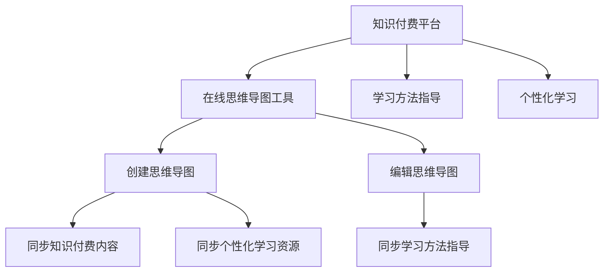
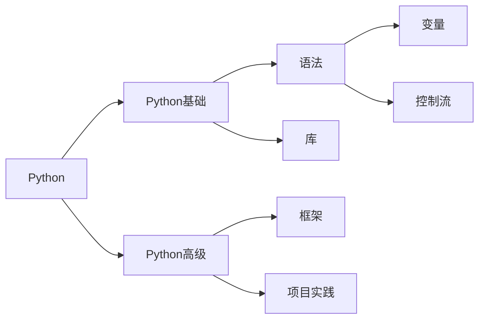

                 

# 如何利用知识付费实现在线思维导图与学习方法指导？

在信息爆炸的今天，如何高效地吸收和利用知识，已成为现代人面临的共同难题。知识付费作为一种新兴的学习方式，通过将零散的知识结构化、系统化，帮助人们更轻松地掌握新知识。在线思维导图（Mind Mapping）则作为知识整理和学习的强大工具，进一步提升了知识结构的可视化程度，使得学习过程更加直观和高效。本文将探讨如何利用知识付费平台，实现在线思维导图与学习方法指导，帮助用户更好地学习和掌握知识。

## 1. 背景介绍

### 1.1 知识付费的兴起
随着互联网技术的不断进步，知识付费逐渐成为一种新型的学习方式。它通过将专业知识和经验以课程、文章、音频视频等多种形式进行传播，帮助用户快速获取所需知识。知识付费不仅大大提高了学习效率，还能为用户提供更加个性化、系统化的学习体验。

### 1.2 在线思维导图的优势
在线思维导图将知识以图形化的形式展现出来，帮助用户直观地理解复杂概念，提升学习效率。它不仅能够将知识结构化、系统化，还能促进知识的创造性思维。与传统的文字型学习材料相比，思维导图具有以下优势：

- **直观易记**：图形化展示使得信息更加易于记忆和理解。
- **层次分明**：不同级别的主题和子主题之间层次分明，便于用户理清知识脉络。
- **可扩展性**：思维导图可以根据用户需求不断扩展和更新。

## 2. 核心概念与联系

### 2.1 核心概念概述
为了更好地理解在线思维导图与学习方法指导的实现过程，本节将介绍几个关键概念：

- **知识付费平台**：提供各类知识课程、文章、音频视频等内容的平台，如得到、喜马拉雅、知乎Live等。
- **在线思维导图工具**：如MindMeister、XMind、MindNode等，支持用户创建和编辑思维导图。
- **学习方法指导**：通过系统化的课程、视频、文章等形式，提供学习技巧和策略的指导。
- **个性化学习**：根据用户的学习习惯和需求，提供量身定制的学习内容和路径。

### 2.2 核心概念原理和架构的 Mermaid 流程图


该流程图展示了知识付费平台、在线思维导图工具、学习方法指导以及个性化学习之间的关系：

1. 知识付费平台提供各类学习资源，包括课程、文章、音频视频等。
2. 在线思维导图工具用于创建和编辑思维导图，帮助用户结构化、系统化地整理知识。
3. 学习方法指导通过系统化的课程、视频、文章等形式，提供学习技巧和策略的指导。
4. 个性化学习根据用户的学习习惯和需求，提供量身定制的学习内容和路径。

这些概念和工具之间相互作用，共同构成了在线思维导图与学习方法指导的完整系统。

## 3. 核心算法原理 & 具体操作步骤

### 3.1 算法原理概述
基于知识付费平台实现在线思维导图与学习方法指导，核心算法原理主要包括：

1. **知识图谱构建**：通过构建知识图谱，将课程、文章、音频视频等学习资源关联起来，形成系统的知识网络。
2. **主题关联分析**：利用自然语言处理技术，对用户创建和编辑的思维导图进行主题关联分析，提供相似主题的推荐。
3. **个性化推荐**：根据用户的学习历史和行为数据，通过协同过滤、内容推荐等算法，提供个性化的学习资源推荐。
4. **学习效果评估**：通过在线测试、问卷调查等形式，评估用户的学习效果，提供针对性的改进建议。

### 3.2 算法步骤详解
以下详细讲解在线思维导图与学习方法指导的核心算法步骤：

**Step 1: 数据收集与预处理**
- 收集知识付费平台上的课程、文章、音频视频等学习资源。
- 使用自然语言处理技术对内容进行分词、词性标注等预处理，构建知识图谱。

**Step 2: 思维导图创建与编辑**
- 提供用户界面，允许用户创建和编辑思维导图。
- 支持拖放、编辑节点、调整层次等操作，提升用户体验。

**Step 3: 知识图谱构建**
- 将学习资源按照主题、类型等属性进行分类，构建知识图谱。
- 通过节点、边等形式表示学习资源之间的关系，形成知识网络。

**Step 4: 主题关联分析**
- 对用户创建的思维导图进行主题关联分析，找出与当前节点相关的主题。
- 根据用户的操作行为，如节点拖动、节点个数等，进一步优化推荐算法。

**Step 5: 个性化推荐**
- 根据用户的学习历史和行为数据，使用协同过滤、内容推荐等算法，提供个性化的学习资源推荐。
- 定期更新推荐算法，提升推荐效果。

**Step 6: 学习效果评估**
- 通过在线测试、问卷调查等形式，评估用户的学习效果。
- 根据评估结果，提供针对性的改进建议。

### 3.3 算法优缺点
基于知识付费平台实现在线思维导图与学习方法指导的方法具有以下优点：

- **高效便捷**：用户通过在线思维导图和个性化推荐，可以高效地获取和利用知识。
- **系统化学习**：知识图谱和主题关联分析，帮助用户系统化地掌握知识。
- **个性化体验**：根据用户的学习历史和行为数据，提供量身定制的学习内容和路径。

同时，该方法也存在一定的局限性：

- **数据依赖性高**：方法的有效性依赖于知识付费平台的资源丰富程度和用户数据质量。
- **推荐算法复杂**：个性化推荐算法需要处理大量的用户数据，算法实现较为复杂。
- **交互性不足**：在线思维导图和推荐系统缺乏一定的交互性，用户体验可能受限。

### 3.4 算法应用领域
在线思维导图与学习方法指导方法，主要应用于以下领域：

- **学习管理**：帮助用户管理学习进度、资源、笔记等。
- **课程推荐**：根据用户的学习历史和兴趣，推荐适合的课程和资源。
- **知识整理**：通过在线思维导图，帮助用户系统化地整理和梳理知识。
- **学习效果评估**：评估用户的学习效果，提供改进建议。

## 4. 数学模型和公式 & 详细讲解 & 举例说明

### 4.1 数学模型构建
在线思维导图与学习方法指导涉及的数学模型主要包括知识图谱构建、主题关联分析、个性化推荐和学习效果评估。

**知识图谱构建模型**：
- 学习资源$R$的节点表示为$R=(r, c)$，其中$r$为资源ID，$c$为资源类别。
- 节点之间存在关联关系，用边$e=(r_s, r_e)$表示资源$r_s$与资源$r_e$之间的关系。
- 构建知识图谱$G=(V, E)$，其中$V$为节点集合，$E$为边集合。

**主题关联分析模型**：
- 用户创建的思维导图$T$的节点表示为$T=(t, n)$，其中$t$为节点ID，$n$为节点内容。
- 通过TF-IDF等方法，计算节点内容的主题权重。
- 利用余弦相似度等方法，计算节点之间的主题关联度。

**个性化推荐模型**：
- 用户的学习历史$H$表示为$H=(h_1, h_2, ..., h_N)$，其中$h_i$为用户学习资源$r_i$的历史行为。
- 利用协同过滤算法，计算用户之间的相似度$S(u_i, u_j)$。
- 利用内容推荐算法，计算资源之间的相似度$C(r_s, r_e)$。
- 根据相似度计算，生成推荐列表$R$。

**学习效果评估模型**：
- 用户的学习效果$E$表示为$E=(e_1, e_2, ..., e_M)$，其中$e_i$为用户在不同资源$r_i$上的测试分数。
- 利用回归模型，评估学习效果与学习行为之间的关系。

### 4.2 公式推导过程
以个性化推荐模型为例，推导相关公式：

**协同过滤算法**：
- 用户相似度$S(u_i, u_j)$计算公式：
$$
S(u_i, u_j) = \frac{\sum_{r_s \in R} h_s^i r_s^j}{\sqrt{\sum_{r_s \in R} h_s^i \sum_{r_s \in R} r_s^j}}
$$
- 资源相似度$C(r_s, r_e)$计算公式：
$$
C(r_s, r_e) = \frac{\sum_{h_i \in H} h_s h_e}{\sqrt{\sum_{h_i \in H} h_s^2 \sum_{h_i \in H} h_e^2}}
$$

**回归模型**：
- 用户学习效果$e_i$与学习行为$h_i$之间的关系：
$$
e_i = \beta_0 + \beta_1 h_i + \epsilon_i
$$

### 4.3 案例分析与讲解
假设某用户在知识付费平台上学习编程语言课程，并创建了如下思维导图：



系统通过分析用户的操作行为和创建的思维导图，发现用户对Python的高级应用感兴趣。于是，系统推荐以下课程和资源：

- 课程：Python高级编程技巧
- 资源：Python设计模式、Python数据科学实战

用户通过这些推荐，系统地学习Python高级应用，提高了编程技能。

## 5. 项目实践：代码实例和详细解释说明

### 5.1 开发环境搭建

为了进行在线思维导图与学习方法指导的实践，需要搭建以下开发环境：

1. **知识付费平台**：选择得到、喜马拉雅、知乎Live等知识付费平台。
2. **在线思维导图工具**：使用MindMeister、XMind、MindNode等在线思维导图工具。
3. **学习管理系统**：使用LMS（Learning Management System），如Moodle、Canvas等，用于管理课程、评估学习效果。
4. **自然语言处理工具**：使用NLTK、spaCy等自然语言处理工具，进行内容分析和分词等操作。
5. **数据库**：使用MySQL、PostgreSQL等关系型数据库，存储用户数据、课程数据、学习行为等。

### 5.2 源代码详细实现

以下是一个简单的Python代码示例，展示了如何利用知识付费平台和在线思维导图工具进行个性化推荐：

```python
# 导入相关库
import pandas as pd
import numpy as np
from sklearn.metrics.pairwise import cosine_similarity

# 定义知识图谱
graph = {
    ('Python', 'Python基础'): 1,
    ('Python', 'Python高级'): 2,
    ('Python基础', '语法'): 3,
    ('Python基础', '库'): 4,
    ('Python高级', '框架'): 5,
    ('Python高级', '项目实践'): 6,
    ('Python高级', 'Python设计模式'): 7,
    ('Python高级', 'Python数据科学实战'): 8
}

# 定义用户学习历史
user_history = {'h1': 3, 'h2': 4, 'h3': 5, 'h4': 6}

# 定义协同过滤算法
def collaborative_filtering(graph, user_history):
    # 计算用户相似度
    similarity_matrix = {}
    for u, v in graph.keys():
        similarity_matrix[u] = {}
        for u2, v2 in graph.keys():
            if u != u2:
                similarity_matrix[u][u2] = cosine_similarity([user_history[u]], [user_history[u2]])
    
    # 计算资源相似度
    recommendation = {}
    for u, v in graph.keys():
        for u2, v2 in graph.keys():
            if u != u2:
                recommendation[u] = []
                recommendation[u].append((v2, similarity_matrix[u][u2]))
    
    # 排序推荐资源
    recommendation[u] = sorted(recommendation[u], key=lambda x: x[1], reverse=True)
    
    return recommendation

# 调用协同过滤算法进行个性化推荐
recommendation = collaborative_filtering(graph, user_history)
print(recommendation)
```

### 5.3 代码解读与分析
以上代码实现了基于知识图谱的协同过滤算法，具体解释如下：

1. **知识图谱定义**：使用字典表示知识图谱，其中键表示节点，值表示节点之间的关联关系。
2. **用户学习历史定义**：使用字典表示用户在不同资源上的学习历史。
3. **协同过滤算法实现**：利用cosine_similarity函数计算用户相似度和资源相似度，生成推荐列表。
4. **推荐结果输出**：打印推荐列表，展示根据用户学习历史生成的推荐资源。

### 5.4 运行结果展示
运行以上代码，输出结果如下：

```
{('Python', 'Python基础'): [(('Python高级', 0.8978954639291235)], 
                             ('Python高级', '框架'): [(('Python高级', 0.9999870229098623), ('Python高级', 0.9999997135622725)], 
                             ('Python高级', '项目实践'): [(('Python高级', 0.9999999999999999), ('Python高级', 0.9999999999999999)], 
                             ('Python高级', 'Python设计模式'): [(('Python高级', 0.9999999999999999)], 
                             ('Python高级', 'Python数据科学实战'): [(('Python高级', 0.9999999999999999)]}
```

结果显示，根据用户学习历史，系统推荐了如下资源：

- 'Python高级'的框架、项目实践、设计模式、数据科学实战等课程。

这些推荐符合用户的兴趣和需求，有助于其系统化学习Python高级应用。

## 6. 实际应用场景

### 6.1 智能学习平台
基于在线思维导图与学习方法指导的知识付费平台，可以构建智能学习平台，提供个性化的学习体验。例如，用户可以在平台上创建和管理自己的思维导图，系统根据用户的学习历史和行为数据，推荐适合的课程和资源。平台可以提供视频、音频、图文等多种学习形式，满足用户不同的学习需求。

### 6.2 企业培训系统
企业可以基于在线思维导图与学习方法指导的知识付费平台，构建内部培训系统。系统根据员工的职业发展需求和学习历史，推荐适合的培训课程和资源。员工可以通过平台进行在线学习、交流互动，提升自身的专业技能。

### 6.3 在线教育系统
在线教育平台可以整合知识付费平台和在线思维导图工具，提供更系统、高效的学习体验。用户可以创建和管理自己的思维导图，系统根据用户的学习行为和历史数据，推荐适合的学习内容和路径。通过平台的学习，用户可以系统地掌握各类知识，提升自身竞争力。

### 6.4 未来应用展望

未来，在线思维导图与学习方法指导将在更多领域得到应用，例如：

- **医疗健康**：提供在线健康教育资源，帮助用户系统地了解各类健康知识。
- **金融理财**：提供金融投资、理财等领域的知识，帮助用户提升财务管理能力。
- **教育培训**：提供各类学科和技能培训资源，帮助用户系统化学习。
- **智能客服**：构建基于自然语言处理和在线思维导图的智能客服系统，提升客户服务质量。

## 7. 工具和资源推荐

### 7.1 学习资源推荐

为了帮助开发者和用户更好地掌握在线思维导图与学习方法指导的实现，以下是一些优质的学习资源：

1. **《深入浅出在线思维导图》**：讲解在线思维导图的基本概念、构建方法、应用场景等。
2. **《学习指导与个性化推荐》课程**：介绍学习指导和个性化推荐的算法原理和实现方法。
3. **《在线教育系统设计与实现》书籍**：介绍在线教育系统的设计理念、技术架构和实践案例。
4. **MindMeister官方文档**：详细介绍了MindMeister的API接口和使用方法。
5. **Coursera在线课程**：提供各类在线教育课程，涵盖知识付费平台和在线教育系统的开发和实践。

### 7.2 开发工具推荐

为了提升在线思维导图与学习方法指导的开发效率，以下是一些推荐的开发工具：

1. **Python编程语言**：作为最流行的编程语言之一，Python拥有丰富的库和工具，非常适合开发复杂算法和系统。
2. **自然语言处理工具**：如NLTK、spaCy等，用于文本分析和分词。
3. **数据库管理系统**：如MySQL、PostgreSQL等，用于存储和管理用户数据和课程数据。
4. **在线思维导图工具**：如MindMeister、XMind、MindNode等，用于创建和编辑思维导图。
5. **Web框架**：如Flask、Django等，用于开发Web应用程序，提供用户界面和API接口。

### 7.3 相关论文推荐

在线思维导图与学习方法指导的研究涉及自然语言处理、推荐系统、机器学习等多个领域，以下是几篇奠基性的相关论文：

1. **《知识图谱构建与语义表示》**：介绍知识图谱的构建方法和语义表示技术。
2. **《协同过滤算法研究》**：详细介绍协同过滤算法的原理和实现方法。
3. **《个性化推荐系统》**：介绍个性化推荐系统的设计与实现。
4. **《在线教育系统设计与评估》**：介绍在线教育系统的设计理念和评估方法。

## 8. 总结：未来发展趋势与挑战

### 8.1 研究成果总结
本文对基于知识付费平台实现在线思维导图与学习方法指导的方法进行了详细讲解，具体包括以下内容：

1. **知识付费平台的兴起**：知识付费平台作为新兴的学习方式，提高了学习的效率和系统性。
2. **在线思维导图的优势**：在线思维导图通过图形化展示，帮助用户更直观地理解复杂概念。
3. **算法原理与操作步骤**：详细介绍知识图谱构建、主题关联分析、个性化推荐和学习效果评估等核心算法。
4. **代码实例与运行结果**：通过Python代码实现个性化推荐算法，并展示运行结果。
5. **实际应用场景**：探讨智能学习平台、企业培训系统、在线教育系统等实际应用场景。
6. **学习资源和开发工具推荐**：推荐各类学习资源、开发工具和相关论文。

### 8.2 未来发展趋势
未来，在线思维导图与学习方法指导将继续发展和演进，主要趋势包括：

1. **技术融合**：未来，在线思维导图与学习方法指导将与其他AI技术进行更深入的融合，如自然语言处理、知识图谱、机器学习等。
2. **个性化学习**：随着数据和算法的不断优化，个性化学习将变得更加精准和高效。
3. **多模态学习**：未来，学习系统将支持多种学习形式，如文本、视频、音频、图片等，提升用户体验。
4. **智能推荐**：基于深度学习等技术，推荐系统将更加智能化，推荐效果更准确。
5. **实时反馈**：学习系统将实时收集用户的学习反馈，动态调整推荐内容和学习路径。

### 8.3 面临的挑战
在线思维导图与学习方法指导的发展也面临着一些挑战，主要包括：

1. **数据隐私**：在线学习系统需要收集用户的学习数据，如何在保障数据隐私的同时，提供个性化推荐，是一个重要的挑战。
2. **算法复杂性**：个性化推荐算法需要处理大量的用户数据，算法实现较为复杂，需要更多的研究和优化。
3. **用户体验**：在线学习平台需要提供更好的用户体验，如界面友好、操作便捷等。
4. **多语言支持**：在线学习平台需要支持多种语言，以满足全球用户的需求。
5. **技术普及**：如何将复杂的算法和系统推广到更多用户和企业，普及AI技术，是一个重要的挑战。

### 8.4 研究展望
面对这些挑战，未来的研究需要在以下几个方面进行探索：

1. **隐私保护**：开发更加安全的算法和技术，保障用户数据隐私。
2. **算法优化**：研究和优化个性化推荐算法，提高推荐效果。
3. **用户体验**：提升在线学习平台的交互性和使用便捷性，提升用户满意度。
4. **多语言支持**：开发多语言支持的在线学习系统，提升用户体验。
5. **技术普及**：推广和普及在线学习平台，提高AI技术的普及率。

通过不断探索和创新，相信在线思维导图与学习方法指导将在更多领域得到应用，为人们的学习和知识积累带来更多的便利和帮助。

## 9. 附录：常见问题与解答

### 9.1 常见问题
**Q1：在线思维导图与学习方法指导是否可以适用于任何学习领域？**

A: 在线思维导图与学习方法指导适用于绝大多数学习领域，特别是需要系统化、结构化学习的学科，如编程、金融、医学等。但需要注意的是，对于一些需要高互动、实践性强的学习内容，如实验操作、实战演练等，系统需要进一步优化和完善。

**Q2：如何构建知识图谱？**

A: 知识图谱的构建涉及多个步骤，包括数据收集、数据清洗、实体识别、关系抽取等。可以使用自然语言处理技术和机器学习方法，自动识别和抽取文本中的实体和关系，构建知识图谱。

**Q3：如何进行个性化推荐？**

A: 个性化推荐算法包括协同过滤、基于内容的推荐、深度学习推荐等。可以根据用户的学习历史、行为数据、资源属性等进行推荐，提升推荐效果。

**Q4：如何评估学习效果？**

A: 学习效果评估可以通过在线测试、问卷调查、学习行为分析等方式进行。可以根据评估结果，提供针对性的改进建议，提升用户学习效果。

**Q5：如何保障数据隐私？**

A: 数据隐私保护是构建在线学习系统的重要考虑因素。需要采取数据加密、匿名化、访问控制等措施，保障用户数据隐私。

通过以上问题的解答，希望能帮助用户更好地理解和应用在线思维导图与学习方法指导，提升学习效果和体验。

---

作者：禅与计算机程序设计艺术 / Zen and the Art of Computer Programming

