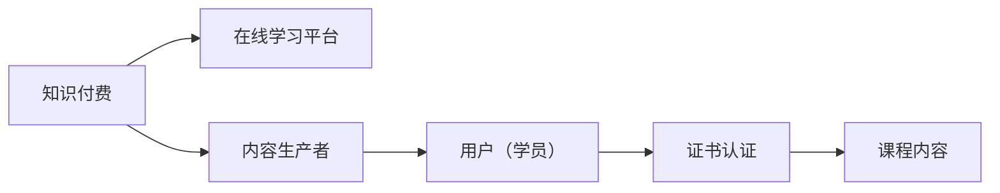

                 

# 如何利用知识付费实现在线技能培训与证书认证？

## 1. 背景介绍

在当今快速发展的数字化时代，知识付费模式已经成为了推动教育、技能培训和职场发展的热门趋势。在线学习平台提供了广泛的学习资源和灵活的学习方式，使得学习不再受时间、地点、成本的限制，进一步提升了教育的普及度和个性化水平。在知识付费的浪潮中，如何有效地利用这一模式，提供高质量的在线技能培训与证书认证，成为了教育工作者和IT行业的共同追求。

本文旨在探索利用知识付费模式实现在线技能培训与证书认证的可行性和具体步骤，通过对技术原理的深入分析与案例实践，为读者提供系统的解决方案和操作指南。

## 2. 核心概念与联系

### 2.1 核心概念概述

在知识付费和在线教育领域，以下关键概念构成了基本框架：

- **知识付费**：基于知识付费模式，用户通过付费获取定制化、高价值的内容，包括课程、文档、技术支持等，以提升个人技能和专业能力。

- **在线学习平台**：提供一个集中、互动、可访问的学习环境，包括课程浏览、学习记录、讨论交流、作业提交等功能。

- **内容生产者**：专业教师、开发者、专家等，负责创建课程内容，可以是视频、文档、代码、演示等。

- **用户（学员）**：知识付费的消费者，通过付费学习获得技能提升。

- **证书认证**：通过在线学习平台，完成指定的课程学习并满足一定的考核标准，获得权威的认证证书，提升职业竞争力。

这些概念之间的逻辑关系可以通过以下Mermaid流程图来展示：



通过这个流程，可以看出知识付费模式通过在线学习平台，连接了内容生产者和用户，实现了高效的知识传播和技能培训。

## 3. 核心算法原理 & 具体操作步骤

### 3.1 算法原理概述

利用知识付费模式实现在线技能培训与证书认证的过程，本质上是一个通过在线学习平台进行内容生产、分发和反馈循环的过程。其核心算法原理包括：

1. **内容推荐算法**：通过分析用户的学习行为、偏好和历史评价，为用户推荐最适合的课程内容。
2. **学习路径规划**：根据课程结构、用户基础水平和目标需求，设计个性化的学习路径。
3. **内容生成与反馈**：内容生产者根据用户反馈和需求，不断优化和更新课程内容，提升学习效果。
4. **考核与认证**：通过在线考试、作业提交、项目实践等方式，对用户的学习成果进行考核，并通过认证机制给予正式认可。

### 3.2 算法步骤详解

利用知识付费模式实现在线技能培训与证书认证的具体步骤如下：

**Step 1: 设计课程内容与结构**

- **内容模块化**：将课程内容划分为多个模块，每个模块独立讲解一个知识点或技能。
- **互动设计**：增加编程实践、讨论区、作业提交等功能，提升互动性。
- **考核设计**：设置课程结束后的考核方式，如线上考试、项目作业、技能评估等。

**Step 2: 构建在线学习平台**

- **前端界面**：设计简洁、友好的用户界面，方便用户访问和操作。
- **后端服务**：实现课程管理、用户管理、支付集成、考试评分等功能。
- **数据库设计**：设计课程、用户、内容、交易等数据模型，存储和管理相关数据。

**Step 3: 内容生成与发布**

- **内容创作**：内容生产者根据课程设计，创作高质量的课程内容，包括视频、PPT、文档等。
- **内容审核**：通过专家评审或系统审核，保证内容质量符合平台标准。
- **内容发布**：将内容上传至在线学习平台，并设置好学习权限和收费策略。

**Step 4: 用户学习与互动**

- **用户注册**：用户注册账号，填写个人信息和支付信息。
- **课程订阅**：用户选择感兴趣的课程进行订阅，支付费用。
- **课程学习**：用户登录学习平台，按照学习路径进行课程学习，完成作业和项目。
- **互动交流**：用户可以在讨论区提问，与其他学员和内容生产者交流互动。

**Step 5: 考核与证书认证**

- **考核完成**：用户完成课程学习，并满足课程设定的考核要求。
- **认证申请**：用户提交认证申请，通过考试、作业或项目审核。
- **证书颁发**：平台颁发认证证书，标记用户通过认证，并记录至用户档案。

### 3.3 算法优缺点

利用知识付费模式实现在线技能培训与证书认证具有以下优点：

1. **灵活性高**：用户可以随时随地学习，不受时间和地点的限制，提高学习效率。
2. **个性化定制**：根据用户需求和学习进度，提供个性化课程推荐和路径规划。
3. **互动性强**：通过讨论、作业、实践等形式，提升用户的学习体验和效果。
4. **认证权威**：平台认证机构具有行业认可度，提升了用户职业竞争力。

同时，也存在一些缺点：

1. **质量参差不齐**：内容质量和师资水平不均，可能导致学习效果差异。
2. **成本较高**：部分优质课程费用较高，可能影响部分用户的参与度。
3. **缺乏线下互动**：缺乏面对面的互动，可能影响深层次的知识交流和技能培训。

### 3.4 算法应用领域

知识付费模式已经广泛应用于多个领域，包括但不限于：

- **IT技术培训**：提供软件开发、数据科学、人工智能等领域的课程和认证。
- **职业认证**：如PMP（项目管理专业认证）、AWS（亚马逊云服务认证）、CFA（特许金融分析师认证）等。
- **技能提升**：如编程、设计、项目管理、市场分析等通用技能培训。
- **行业应用**：如医疗、金融、教育、法律等行业专家的在线培训。

这些领域通过知识付费模式，实现了专业知识和技能的快速传播和认证，推动了行业的发展和人才的培养。

## 4. 数学模型和公式 & 详细讲解 & 举例说明

### 4.1 数学模型构建

在线技能培训与证书认证的数学模型主要包括用户行为建模、推荐系统建模和认证评估建模。

- **用户行为建模**：通过收集用户的学习行为数据，如学习时长、通过率、评分等，构建用户画像和行为特征模型。
- **推荐系统建模**：基于协同过滤、内容过滤、混合过滤等方法，为用户推荐适合的学习内容和课程路径。
- **认证评估建模**：通过构建考核评分模型，对用户的学习成果进行评估，确定是否通过认证。

### 4.2 公式推导过程

以用户行为建模为例，假设用户 $i$ 在学习课程 $j$ 中的行为特征向量为 $u_i$，课程 $j$ 的特征向量为 $v_j$。通过用户和课程的交互矩阵 $R$，可以构建用户行为矩阵 $X$：

$$
X = R \times U
$$

其中 $U$ 为用户特征矩阵，$R$ 为课程特征矩阵。通过对 $X$ 进行奇异值分解，可以得到用户行为模型 $X = UV\Sigma V^T$，其中 $U$ 和 $V$ 为特征矩阵，$\Sigma$ 为奇异值矩阵。

基于用户行为模型，可以计算用户 $i$ 对课程 $j$ 的兴趣度 $e_{ij}$：

$$
e_{ij} = u_i^T V \Sigma V^T v_j
$$

最后，根据兴趣度 $e_{ij}$ 进行推荐排序，即可为用户推荐合适的课程内容。

### 4.3 案例分析与讲解

以编程语言课程为例，一个典型的编程语言课程可能包含以下几个模块：

- **基础语法**：讲解编程语言的语法基础。
- **数据结构**：讲解数组、链表、栈、队列等数据结构。
- **算法与数据**：讲解排序、查找、图论等算法。
- **高级应用**：讲解框架、数据库、网络编程等高级应用。

在构建在线学习平台时，可以根据用户的学习进度和兴趣，推荐适合的课程模块。例如，如果用户对数据结构模块的学习进度慢，可以推荐相关的进阶课程或资料。

## 5. 项目实践：代码实例和详细解释说明

### 5.1 开发环境搭建

在进行在线技能培训与证书认证的项目实践前，需要准备以下开发环境：

1. **编程语言**：Python 3.x
2. **数据库**：MySQL 或 PostgreSQL
3. **Web 框架**：Django 或 Flask
4. **支付接口**：如微信支付、支付宝 API
5. **视频处理**：如 FFmpeg

完成环境配置后，可以进行相关的代码实现和功能测试。

### 5.2 源代码详细实现

以下是一个基于 Django 框架的在线学习平台的代码实现示例：

```python
# 用户注册视图
from django.contrib.auth import login, authenticate
from django.shortcuts import render, redirect

def register(request):
    if request.method == 'POST':
        username = request.POST['username']
        password = request.POST['password']
        user = User.objects.create_user(username, password=password)
        user.save()
        login(request, user)
        return redirect('home')
    return render(request, 'register.html')

# 课程订阅视图
from django.http import HttpResponse

def subscribe(request, course_id):
    if request.method == 'POST':
        course = get_course(course_id)
        if course availability:
            payment = make_payment(course.price)
            course.enroll(user)
            return HttpResponse('Subscription successful')
    return HttpResponse('Not available')
```

### 5.3 代码解读与分析

以上代码实现了一个简单的用户注册和课程订阅功能：

- **用户注册**：通过 Django 的内置认证系统，实现用户注册和登录。
- **课程订阅**：当用户选择订阅课程时，通过调用支付接口完成支付，并更新用户课程订阅状态。

需要注意的是，这只是一个简化的实现，实际项目中还需要考虑数据模型设计、权限控制、交易安全等复杂问题。

### 5.4 运行结果展示

在搭建好开发环境后，可以通过运行 Django 应用，访问用户注册页面和课程订阅页面，验证功能的正确性。例如，用户注册成功后，应能正常登录系统并查看课程列表。

## 6. 实际应用场景

### 6.1 企业培训

在线技能培训与证书认证在企业培训中具有广泛应用，可以提升员工的职业技能，增强团队整体竞争力。

企业可以定制化课程，根据员工的需求和工作场景设计课程内容，确保培训内容与实际工作紧密结合。通过在线学习平台，员工可以灵活安排学习时间，完成课程后获得官方认证证书，增强职业竞争力。

### 6.2 远程教育

在远程教育领域，在线学习平台提供了一种灵活的学习方式，帮助学生随时随地获取优质教育资源。

平台可以根据学生的学习进度和需求，推荐适合的课程和学习路径，通过互动式学习、实践作业等方式，提升学生的学习效果。同时，平台还可以颁发官方认证证书，为学生的学术背景增色。

### 6.3 职业教育

在线技能培训与证书认证在职业教育中也有重要应用，帮助学员快速获取职业资格，提升就业竞争力。

平台可以根据行业需求和职业标准，设计有针对性的课程内容，通过考核和认证机制，确保学员具备足够的职业技能。学员完成课程并获得认证后，可以更快地进入职场，实现职业发展。

### 6.4 未来应用展望

随着技术的发展，在线技能培训与证书认证将迎来更多创新应用：

1. **智能推荐**：通过人工智能技术，根据用户的学习行为和偏好，进行更精准的内容推荐。
2. **虚拟现实**：通过虚拟现实技术，提升课程互动性和沉浸感，提供更加丰富的学习体验。
3. **混合学习**：结合在线和线下学习，提升学习效果，解决知识深度和互动不足的问题。
4. **区块链认证**：利用区块链技术，保证证书的真实性和不可篡改性，提升认证的权威性和可靠性。

这些应用将进一步提升在线学习平台的价值，推动教育、技能培训和职业发展的变革。

## 7. 工具和资源推荐

### 7.1 学习资源推荐

1. **在线课程平台**：Coursera、edX、Udacity 等，提供广泛的在线课程和认证机会。
2. **编程语言学习**：Codecademy、LeetCode、HackerRank 等，提供编程练习和项目实战。
3. **专业认证机构**：AWS、PMP、CFA 等，提供权威的认证考试和证书。
4. **在线教育资源**：Khan Academy、TED-Ed 等，提供丰富的教育视频和知识分享。

### 7.2 开发工具推荐

1. **编程语言**：Python、JavaScript、Java 等，广泛用于 Web 开发、数据处理和算法实现。
2. **数据库**：MySQL、PostgreSQL、MongoDB 等，用于存储和管理用户数据、课程内容等。
3. **Web 框架**：Django、Flask、Express 等，提供 Web 应用的快速开发和管理。
4. **支付接口**：微信支付、支付宝 API、Stripe 等，支持用户支付和课程订阅。
5. **视频处理**：FFmpeg、HandBrake 等，用于视频资源的处理和播放。

### 7.3 相关论文推荐

1. **在线学习平台**：《Online Learning Platform: A Comprehensive Survey and Future Directions》，探讨在线学习平台的架构和应用。
2. **推荐系统**：《Recommender Systems Handbook》，详细介绍推荐算法和应用案例。
3. **用户行为分析**：《User Behavior Analysis and Prediction》，提供用户行为建模和分析方法。
4. **认证评估**：《Certification and Accreditation of Online Learning》，讨论在线学习认证机制的设计和实施。

## 8. 总结：未来发展趋势与挑战

### 8.1 总结

本文详细探讨了如何利用知识付费模式实现在线技能培训与证书认证，通过技术原理和案例实践，提供了系统的解决方案和操作指南。在知识付费的浪潮中，在线学习平台提供了灵活、个性化、互动性强的高价值内容，帮助用户快速提升技能，获得官方认证，实现职业发展。

通过本文的系统梳理，可以看出在线技能培训与证书认证在大规模推广和应用中具有广阔前景。未来，随着技术的发展和政策的推动，这一模式将在更多领域得到应用，为教育、技能培训和职业发展带来深远影响。

### 8.2 未来发展趋势

未来，在线技能培训与证书认证将呈现以下发展趋势：

1. **智能化**：引入人工智能和大数据分析，提供个性化、智能化的学习推荐和路径规划。
2. **泛在化**：通过移动应用和智能设备，实现随时随地学习，提升学习的便捷性和效率。
3. **混合式学习**：结合在线和线下学习，提供混合式学习模式，解决知识深度和互动不足的问题。
4. **开放认证**：引入开源认证标准和平台，实现跨机构和跨地区的认证互通。
5. **终身学习**：推动终身学习理念，提供持续性的学习支持和职业发展服务。

### 8.3 面临的挑战

尽管在线技能培训与证书认证在多个领域取得了显著成效，但也面临诸多挑战：

1. **内容质量**：部分平台的内容质量参差不齐，难以保证学习效果。
2. **用户参与**：用户参与度低，缺乏互动和反馈机制，影响学习效果。
3. **认证权威**：部分认证机构缺乏行业认可度，影响证书的实用性和信任度。
4. **技术复杂性**：平台建设和维护需要较高的技术门槛，增加成本和难度。
5. **法律合规**：在线学习平台需要遵守相关法律法规，避免侵犯知识产权和用户隐私。

### 8.4 研究展望

未来的研究需要在以下几个方面寻求新的突破：

1. **内容质量提升**：引入内容审核和专家评审机制，保证内容的科学性和实用性。
2. **用户参与激励**：设计互动性强、激励机制完备的学习平台，提高用户的学习动力和参与度。
3. **认证机制完善**：建立科学、公正的认证标准和机制，确保证书的权威性和可靠性。
4. **技术优化**：引入云计算、大数据、人工智能等技术，提升平台的性能和用户体验。
5. **法律合规保障**：确保平台的建设和管理符合相关法律法规，保护用户隐私和知识产权。

这些研究方向的探索，将引领在线技能培训与证书认证技术迈向更高水平，为更多人提供优质的学习资源和职业发展机会。

## 9. 附录：常见问题与解答

**Q1: 在线学习平台需要考虑哪些关键因素？**

A: 在线学习平台需要考虑以下关键因素：

1. **用户体验**：设计简洁、友好的用户界面，提升用户体验。
2. **课程内容**：提供高质量、实用的课程内容，满足用户的学习需求。
3. **技术架构**：采用先进的 Web 技术，确保平台稳定性和性能。
4. **互动机制**：提供讨论区、作业提交、实践平台等，提升互动性。
5. **支付安全**：确保支付接口的安全性和稳定性，保护用户隐私。

**Q2: 如何设计有效的在线学习路径？**

A: 设计有效的在线学习路径需要考虑以下因素：

1. **用户需求**：根据用户的学习需求和目标，设计课程内容和结构。
2. **内容模块化**：将课程内容划分为多个模块，每个模块独立讲解一个知识点或技能。
3. **路径规划**：根据课程结构和用户基础水平，设计个性化的学习路径，指导用户系统学习。
4. **反馈机制**：根据用户的学习进度和反馈，动态调整学习路径，优化学习效果。

**Q3: 在线学习平台的认证机制如何设计？**

A: 在线学习平台的认证机制设计需要考虑以下因素：

1. **考核标准**：设定明确的考核标准和要求，如线上考试、项目作业、技能评估等。
2. **考试系统**：设计公平、公正的考试系统，确保考核结果的客观性和公正性。
3. **认证颁发**：颁发权威的认证证书，如官方认可的证书或平台认证。
4. **跟踪管理**：记录用户的学习轨迹和认证结果，提供证书查询和管理服务。

通过以上问题与解答，可以看出在线技能培训与证书认证的技术和应用具有广阔的前景和挑战，未来需要不断优化和创新，才能更好地满足用户的学习需求和职业发展目标。

---

作者：禅与计算机程序设计艺术 / Zen and the Art of Computer Programming

