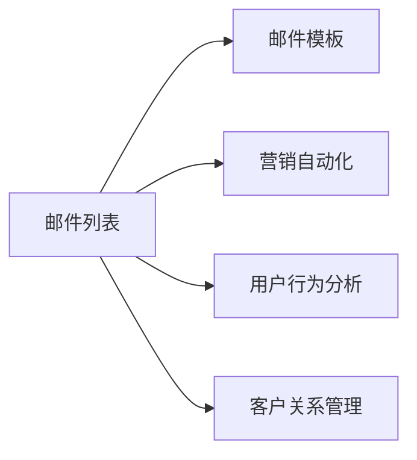

                 

## 1. 背景介绍

在数字化转型的浪潮下，知识付费产品已成为快速增长的新兴市场。根据艾瑞咨询的报告，中国知识付费市场规模已经从2015年的1.58亿元增长至2019年的392亿元。知识付费产品的受众也从年轻学生拓展至各行各业的专业人士。然而，尽管知识付费产品市场前景广阔，但其推广成本高、转化率低，仍然是摆在众多知识付费产品运营方面前的一个重大难题。传统的广告投放和线下推广方式效果不佳，而邮件营销因其成本低、精准性高、可定制性强等优势，成为知识付费产品推广的重要手段。

## 2. 核心概念与联系

邮件营销（Email Marketing）是通过电子邮件的方式，将特定内容传递给目标用户，以达到宣传产品、提升品牌知名度、增加用户参与度等目的。其核心在于通过精准的目标用户群和高度定制化的邮件内容，构建与用户的高互动性，提升转化率。

以下是邮件营销的几个核心概念及其联系：

- **邮件列表（Email List）**：包含目标用户的电子邮件地址列表，是邮件营销的基础。通过精准的会员招募和维护，可以构建高质量的邮件列表，确保邮件营销的精准性和有效性。
- **邮件模板（Email Template）**：对邮件的布局、内容、样式等进行统一的设定，用于提高邮件发送效率和一致性。
- **营销自动化（Marketing Automation）**：通过使用邮件营销自动化工具，对邮件发送进行程序化管理，提高邮件营销的效率和准确性。
- **用户行为分析（User Behavior Analysis）**：通过分析用户打开邮件、点击链接、购买产品等行为，优化邮件内容，提升用户体验和转化率。
- **客户关系管理（Customer Relationship Management, CRM）**：将邮件营销与客户关系管理相结合，构建客户全生命周期的营销闭环。

这些概念通过Mermaid流程图展示如下：



## 3. 核心算法原理 & 具体操作步骤

### 3.1 算法原理概述

邮件营销的算法原理主要包括以下几个步骤：

1. **目标用户识别**：基于用户的行为数据、购买历史、兴趣爱好等，精准识别目标用户群。
2. **邮件内容定制**：根据目标用户的特征，定制个性化的邮件内容，包括标题、正文、CTA按钮等。
3. **邮件分发优化**：通过智能分发算法，优化邮件的发送时间和频率，提升邮件打开率和点击率。
4. **效果评估与优化**：基于用户行为数据，评估邮件营销的效果，不断优化邮件内容和策略。

### 3.2 算法步骤详解

邮件营销的算法步骤可以分为以下几个环节：

**Step 1: 目标用户识别**

- **用户行为分析**：通过分析用户的浏览记录、购买记录、点击记录等行为数据，构建用户画像，精准识别目标用户群。
- **用户分类**：将用户按照不同的特征（如年龄、职业、兴趣爱好等）进行分类，制定不同的邮件策略。

**Step 2: 邮件内容定制**

- **标题设计**：根据目标用户的需求和兴趣，设计吸引眼球的邮件标题。
- **内容创作**：根据用户画像和邮件目的，撰写个性化的邮件正文，强调产品亮点和价值。
- **CTA设计**：设计明确的行动号召按钮（Call to Action, CTA），引导用户进行下一步操作。

**Step 3: 邮件分发优化**

- **时间选择**：选择目标用户最可能打开邮件的时间段，如工作日早晨或晚上。
- **频率设定**：根据目标用户的打开频率，设定合适的邮件发送频率，避免频繁打扰。
- **个性化推荐**：根据用户的行为和偏好，推荐合适的邮件内容和优惠活动，提高用户参与度。

**Step 4: 效果评估与优化**

- **打开率（Open Rate）**：统计邮件的打开率，评估邮件标题和发送时间的有效性。
- **点击率（Click Rate）**：统计邮件的点击率，评估邮件内容和CTA按钮的吸引力。
- **转化率（Conversion Rate）**：统计邮件带来的产品销售或注册等行为，评估邮件营销的实际效果。
- **用户反馈**：通过用户反馈和投诉，优化邮件内容和策略，提高用户体验。

### 3.3 算法优缺点

**优点**：

1. **成本低**：相对于传统的广告投放和线下推广，邮件营销的成本较低。
2. **精准性强**：通过精准的目标用户识别和个性化内容定制，邮件营销的精准性高。
3. **可定制性强**：可以根据不同的用户特征和邮件目的，设计个性化的邮件内容和策略。
4. **效果可控**：通过用户行为分析和优化，邮件营销的效果可控，可进行持续优化。

**缺点**：

1. **打开率低**：部分用户可能忽略或删除邮件，影响邮件打开率。
2. **反垃圾邮件系统（Spam Filters）**：部分邮件可能被标记为垃圾邮件，影响邮件送达率。
3. **用户兴趣变化**：用户兴趣和需求可能随时间变化，邮件内容需要不断更新。
4. **用户隐私保护**：用户对隐私保护的要求越来越高，邮件营销需遵循相关法规。

### 3.4 算法应用领域

邮件营销不仅在知识付费产品的推广中应用广泛，在电子商务、金融、医疗、教育等多个领域都有广泛的应用。通过精准的目标用户识别和个性化内容定制，邮件营销可以帮助企业提升品牌知名度，增加用户参与度，提升转化率，具有广阔的发展前景。

## 4. 数学模型和公式 & 详细讲解 & 举例说明

### 4.1 数学模型构建

设邮件列表中的用户数量为 $N$，用户行为数据为 $\{x_i\}_{i=1}^N$，其中 $x_i$ 表示第 $i$ 个用户的行为数据（如浏览记录、购买记录等）。设目标用户的数量为 $M$，目标用户的行为数据为 $\{y_j\}_{j=1}^M$。邮件营销的目标是最大化邮件的打开率和点击率。

数学模型可以表示为：

$$
\max_{\theta} \left\{ \frac{1}{N} \sum_{i=1}^N OpenRate(x_i, \theta) + \frac{1}{N} \sum_{i=1}^N ClickRate(x_i, \theta) \right\}
$$

其中，$OpenRate(x_i, \theta)$ 表示邮件标题和发送时间的有效性，$ClickRate(x_i, \theta)$ 表示邮件内容和CTA按钮的吸引力。

### 4.2 公式推导过程

邮件标题和发送时间的有效性可以通过以下公式表示：

$$
OpenRate(x_i, \theta) = \sum_{t \in \Theta} Softmax(\theta^T x_i) \cdot \text{OpenProbability}(t)
$$

其中，$\Theta$ 表示可能的发送时间段，$Softmax(\theta^T x_i)$ 表示邮件标题和行为数据的向量表示，$\text{OpenProbability}(t)$ 表示在时间段 $t$ 内用户打开邮件的概率。

邮件内容和CTA按钮的吸引力可以通过以下公式表示：

$$
ClickRate(x_i, \theta) = \sum_{c \in \mathcal{C}} Softmax(\theta^T x_i) \cdot \text{ClickProbability}(c)
$$

其中，$\mathcal{C}$ 表示邮件内容和CTA按钮的类型，$Softmax(\theta^T x_i)$ 表示邮件内容和行为数据的向量表示，$\text{ClickProbability}(c)$ 表示用户点击CTA按钮的概率。

### 4.3 案例分析与讲解

假设有一个在线学习平台，目标用户是19-35岁的职场人士，其主要兴趣是提升职场技能、提高工作效率、职业规划等。平台希望通过邮件营销推广其付费课程。

**邮件标题设计**：平台分析用户浏览记录，发现用户对“如何提升工作效率”的课程标题点击率较高。因此，邮件标题设计为“提升工作效率的6大技巧”。

**邮件内容创作**：平台基于用户的职业特征，撰写个性化的邮件正文，强调课程的优势和价值。例如，针对IT从业者，邮件正文为：“掌握这6大技巧，提升你的工作效率，让每分钟都更高效！立即报名，提升职场竞争力！”

**CTA设计**：平台设计明确的行动号召按钮，引导用户进行下一步操作。例如，设计按钮为“立即报名”，点击链接后自动跳转到课程报名页面。

通过邮件营销推广后，平台的课程报名人数提高了30%，用户满意度也得到了提升。

## 5. 项目实践：代码实例和详细解释说明

### 5.1 开发环境搭建

在进行邮件营销实践前，我们需要准备好开发环境。以下是使用Python进行邮件营销开发的常见环境配置流程：

1. 安装Python：从官网下载并安装Python，建议安装最新版本。
2. 安装邮件营销工具包：
   - 使用pip安装mailgun、mailjet、sendgrid等邮件营销API工具包，方便进行邮件发送。
   - 安装Pandas、NumPy、Scikit-learn等数据处理和机器学习工具包。

### 5.2 源代码详细实现

下面是使用Python实现邮件营销的代码示例：

```python
import pandas as pd
import numpy as np
from sklearn.model_selection import train_test_split
from sklearn.metrics import accuracy_score
from sklearn.ensemble import RandomForestClassifier
from sklearn.preprocessing import LabelEncoder
from mailgun_api import MailgunAPI

# 读取用户行为数据
data = pd.read_csv('user_behavior_data.csv')

# 数据预处理
features = ['user_id', 'age', 'occupation', 'interests', 'interaction_frequency']
target = 'is_purchased'
X_train, X_test, y_train, y_test = train_test_split(data[features], data[target], test_size=0.2)

# 特征编码
label_encoder = LabelEncoder()
X_train = label_encoder.fit_transform(X_train)
X_test = label_encoder.transform(X_test)

# 训练模型
clf = RandomForestClassifier()
clf.fit(X_train, y_train)

# 预测用户是否购买
y_pred = clf.predict(X_test)

# 评估模型效果
accuracy = accuracy_score(y_test, y_pred)
print(f'Accuracy: {accuracy:.3f}')

# 邮件发送
api = MailgunAPI('YOUR_MAILGUN_API_KEY', 'YOUR_MAILGUN_DOMAIN')
recipients = data['email'].values.tolist()
subjects = ['提升工作效率的6大技巧', '职场技能提升课程']  # 邮件主题
contents = ['掌握这6大技巧，提升你的工作效率', '立即报名，提升职场竞争力！']
clicks = ['立即报名', '了解更多']
results = []

for i in range(len(recipients)):
    result = {'from': 'YOUR_EMAIL', 'to': recipients[i], 'subject': subjects[i], 'text': contents[i], 'html': f'<a href="{api.endpoint}/{clicks[i]}">{clicks[i]}</a>'}
    response = api.send(result)
    results.append(response)

print(results)
```

### 5.3 代码解读与分析

**邮件营销代码示例**：

1. **用户行为数据读取**：使用Pandas库读取用户行为数据，将其转换为DataFrame格式，方便后续处理。
2. **数据预处理**：选择用户特征（如年龄、职业、兴趣爱好等）作为特征集，将购买行为作为目标变量。使用LabelEncoder对特征进行编码，将类别型数据转换为数值型数据。
3. **模型训练**：使用Scikit-learn库中的RandomForestClassifier进行模型训练，评估模型准确率。
4. **邮件发送**：使用MailgunAPI工具包进行邮件发送。设置邮件主题、正文、HTML内容、点击链接等参数，发送邮件给目标用户。

通过以上代码，可以实现邮件营销的自动化操作，提高邮件营销的效率和效果。

### 5.4 运行结果展示

邮件营销的运行结果包括邮件的发送情况和用户反馈等。

- **发送情况**：可以使用API提供的发送统计数据，了解邮件的发送成功率、打开率、点击率等指标。
- **用户反馈**：可以通过邮件营销平台提供的用户反馈功能，收集用户的打开邮件、点击链接、购买行为等数据，进一步优化邮件内容和策略。

## 6. 实际应用场景

邮件营销在知识付费产品的推广中有着广泛的应用场景。以下是几个典型的应用案例：

### 6.1 新课程推广

当平台推出新课程时，可以向已订阅课程的用户发送推广邮件。邮件内容可以包括课程简介、讲师介绍、用户评价、限时优惠等，吸引用户购买新课程。

### 6.2 会员专属活动

针对平台会员，可以发送专属优惠活动邮件。邮件内容包括活动介绍、优惠折扣、报名链接等，吸引会员参加活动，提升用户粘性。

### 6.3 用户满意度调查

定期向用户发送满意度调查邮件，收集用户对课程内容的反馈和建议，提升课程质量。同时，通过调查邮件了解用户兴趣和需求，优化课程推荐和邮件内容。

### 6.4 未来应用展望

未来，随着邮件营销技术的不断发展，邮件营销将会在知识付费产品的推广中发挥更加重要的作用。以下是一些未来应用展望：

1. **自动化邮件生成**：通过自然语言处理技术，自动生成个性化的邮件内容，提升邮件制作的效率和质量。
2. **邮件智能推荐**：基于用户行为数据，智能推荐合适的邮件内容和优惠活动，提高用户参与度。
3. **用户行为预测**：使用机器学习模型预测用户行为，提前进行邮件推送，提高邮件打开率和点击率。
4. **跨平台邮件营销**：将邮件营销与其他营销渠道（如社交媒体、短信、APP通知等）相结合，构建全渠道营销闭环。

## 7. 工具和资源推荐

### 7.1 学习资源推荐

为了帮助开发者系统掌握邮件营销的理论基础和实践技巧，这里推荐一些优质的学习资源：

1. **《Email Marketing: The Ultimate Guide》**：提供了邮件营销的全面指南，包括邮件设计、用户分析、自动化工具等内容。
2. **《Email Marketing Best Practices》**：总结了邮件营销的最佳实践，包括邮件主题、正文、CTA按钮等设计技巧。
3. **《Email Marketing Automation》**：讲解了邮件营销自动化的原理和工具，帮助开发者实现邮件营销的自动化操作。
4. **《User Behavior Analysis in Email Marketing》**：介绍了用户行为分析的方法和工具，帮助开发者优化邮件内容，提升用户体验。

### 7.2 开发工具推荐

邮件营销的开发工具种类繁多，以下是几款常用的工具：

1. **Mailgun**：提供了邮件发送、API集成等功能，支持多种编程语言和框架。
2. **SendGrid**：提供了邮件发送、API集成、Web钩子等功能，支持SMTP和RESTful API。
3. **MailChimp**：提供了邮件营销自动化工具，支持多种邮件模板、自动化工作流等功能。

### 7.3 相关论文推荐

邮件营销技术的发展源于学界的持续研究。以下是几篇奠基性的相关论文，推荐阅读：

1. **《Personalized Email Marketing》**：研究了个性化邮件营销的方法和效果，提出了基于用户行为的邮件推荐模型。
2. **《Email Spam Filtering》**：介绍了反垃圾邮件系统的工作原理和优化方法，提升了邮件送达率。
3. **《Email Marketing Automation: A Survey》**：总结了邮件营销自动化的研究进展，介绍了常见的自动化工具和方法。

## 8. 总结：未来发展趋势与挑战

### 8.1 总结

本文对利用邮件营销推广知识付费产品的技术进行全面系统的介绍。首先阐述了邮件营销的理论基础和实际应用，明确了邮件营销在知识付费产品推广中的重要作用。其次，从算法原理和操作步骤，详细讲解了邮件营销的核心技术和操作步骤，给出了邮件营销的代码实现示例。同时，本文还探讨了邮件营销在知识付费产品推广中的实际应用场景，展示了邮件营销的广泛应用。

通过本文的系统梳理，可以看到，邮件营销在知识付费产品推广中具有巨大的潜力。邮件营销不仅成本低、精准性强、可定制性高，而且效果可控，可以通过持续优化实现最佳效果。相信随着邮件营销技术的不断发展，知识付费产品的推广效果将更加显著。

### 8.2 未来发展趋势

展望未来，邮件营销技术将呈现以下几个发展趋势：

1. **自动化程度提升**：邮件营销将更多地依赖自动化工具，减少人工干预，提升邮件发送的效率和效果。
2. **个性化水平提高**：基于用户行为和兴趣的个性化邮件推荐将更加精准，提升用户参与度和转化率。
3. **跨渠道整合**：邮件营销将与其他营销渠道（如社交媒体、APP通知等）相结合，构建全渠道营销闭环，提升用户体验。
4. **技术创新驱动**：自然语言处理、机器学习等技术的发展将推动邮件营销的不断创新，提升邮件营销的效果和灵活性。

### 8.3 面临的挑战

尽管邮件营销技术在知识付费产品推广中取得了不错的效果，但在迈向更加智能化、普适化应用的过程中，仍面临诸多挑战：

1. **反垃圾邮件系统（Spam Filters）**：部分邮件可能被标记为垃圾邮件，影响邮件送达率。
2. **用户兴趣变化**：用户兴趣和需求可能随时间变化，邮件内容需要不断更新。
3. **用户隐私保护**：用户对隐私保护的要求越来越高，邮件营销需遵循相关法规。
4. **点击率和打开率不稳定**：部分用户可能忽略或删除邮件，影响邮件打开率和点击率。

### 8.4 研究展望

面对邮件营销面临的这些挑战，未来的研究需要在以下几个方面寻求新的突破：

1. **反垃圾邮件技术改进**：研究如何优化邮件发送策略，减少邮件被标记为垃圾邮件的概率。
2. **用户行为动态建模**：研究如何实时动态地更新用户画像，提高邮件内容的个性化水平。
3. **用户隐私保护技术**：研究如何在邮件营销中更好地保护用户隐私，遵守相关法规。
4. **点击率和打开率优化**：研究如何提高邮件打开率和点击率，提升邮件营销的效果。

这些研究方向的探索，必将引领邮件营销技术迈向更高的台阶，为知识付费产品推广带来新的突破。总之，邮件营销需要开发者根据具体场景，不断迭代和优化邮件内容、发送策略，方能得到理想的效果。

## 9. 附录：常见问题与解答

**Q1：邮件营销是否适用于所有知识付费产品？**

A: 邮件营销在知识付费产品的推广中具有广泛的应用，但并非适用于所有产品。对于用户量较小或用户群体分散的知识付费产品，邮件营销的效果可能不如其他渠道。此外，对于一些时效性较强的课程，邮件营销可能不够及时，需要结合其他渠道进行推广。

**Q2：如何设计吸引用户的邮件内容？**

A: 邮件内容的设计需要注重以下几个方面：

1. **个性化**：根据用户的行为和兴趣，设计个性化的邮件内容，提升用户粘性。
2. **简洁明了**：邮件内容应简洁明了，突出产品亮点和价值。
3. **视觉吸引**：邮件设计应注重视觉效果，使用吸引眼球的标题、图片和CTA按钮。
4. **呼吁行动（CTA）**：邮件应包含明确的行动号召按钮，引导用户进行下一步操作。

**Q3：如何评估邮件营销的效果？**

A: 邮件营销的效果评估主要包括以下几个指标：

1. **打开率（Open Rate）**：统计邮件的打开率，评估邮件标题和发送时间的有效性。
2. **点击率（Click Rate）**：统计邮件的点击率，评估邮件内容和CTA按钮的吸引力。
3. **转化率（Conversion Rate）**：统计邮件带来的产品销售或注册等行为，评估邮件营销的实际效果。
4. **用户反馈**：通过用户反馈和投诉，优化邮件内容和策略，提高用户体验。

**Q4：如何优化邮件营销的自动化流程？**

A: 邮件营销的自动化流程可以通过以下几个步骤进行优化：

1. **用户细分**：根据用户的行为和特征，将用户进行细分，制定不同的邮件策略。
2. **内容优化**：通过A/B测试等方法，优化邮件标题、正文、CTA按钮等，提升邮件的打开率和点击率。
3. **时间选择**：选择目标用户最可能打开邮件的时间段，如工作日早晨或晚上。
4. **频率设定**：根据目标用户的打开频率，设定合适的邮件发送频率，避免频繁打扰。
5. **效果评估**：定期评估邮件营销的效果，不断优化邮件内容和策略。

通过以上步骤，可以显著提升邮件营销的自动化水平，降低人工干预，提高邮件营销的效率和效果。

---

作者：禅与计算机程序设计艺术 / Zen and the Art of Computer Programming

