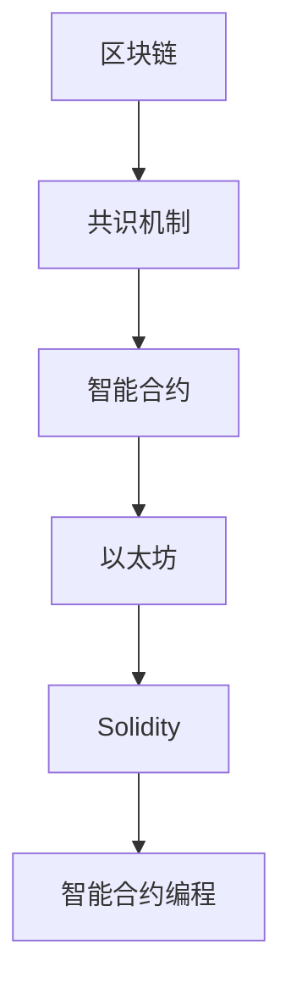

                 

## 1. 背景介绍

随着区块链技术的兴起，智能合约作为其重要应用之一，正逐渐在金融、供应链、物联网、医疗等众多领域展现出巨大潜力。智能合约利用代码自动执行合同条款，减少人为干预，提高交易透明性，降低运营成本。但由于智能合约的代码编写和执行过程具有特殊性和复杂性，开发者需要掌握一种全新的编程范式。

### 1.1 什么是智能合约？

智能合约是一种基于区块链技术的自动执行合约。它通过代码逻辑实现交易条件和条款的自动执行，无须中介机构，即可确保交易的自动执行和可信性。智能合约的代码一旦部署到区块链上，将永远不可更改，确保交易的不可逆性。

### 1.2 智能合约与传统编程的区别

智能合约与传统编程最大的区别在于其执行环境的特殊性。传统编程环境是中心化的，有明确的输入输出和状态管理。而智能合约的执行环境是去中心化的，基于区块链技术，每个参与者都可以读取和写入数据。因此，开发者需要理解区块链的核心概念，如区块链、共识机制、去中心化等。

## 2. 核心概念与联系

### 2.1 核心概念概述

以下是智能合约开发中需要理解的核心概念及其联系：

1. **区块链(区块链)**
   - 区块链是一种分布式数据库技术，通过节点间的共识机制维护交易数据的完整性和安全性。每个节点保存一份完整的区块链副本，并通过共识算法同步更新区块链。

2. **共识机制(共识算法)**
   - 共识机制确保区块链上的交易数据经过共识后，能够被所有节点认可。常见的共识机制包括工作量证明(PoW)、权益证明(PoS)、委托证明(DPoS)等。

3. **智能合约(智能合约)**
   - 智能合约是一段代码逻辑，部署到区块链上后能够自动执行合同条款。它由代码、数据和参数组成，能够处理特定场景下的逻辑和业务规则。

4. **以太坊(以太坊)**
   - 以太坊是一种基于区块链的去中心化平台，支持智能合约的编写和部署。以太坊使用Solidity作为其官方编程语言。

5. **Solidity(智能合约编程语言)**
   - Solidity是一种为以太坊开发的Turing完备型编程语言，用于编写智能合约代码。Solidity具有类声明、继承、函数、变量等编程特性。

### 2.2 核心概念原理和架构的 Mermaid 流程图



## 3. 核心算法原理 & 具体操作步骤

### 3.1 算法原理概述

智能合约的开发过程主要包括以下几个步骤：

1. 理解需求，设计合同条款。
2. 编写智能合约代码，确保符合以太坊规范。
3. 在以太坊网络上部署智能合约。
4. 测试智能合约功能，确保无误。
5. 部署智能合约到主网，开始执行。

### 3.2 算法步骤详解

#### 步骤1：需求分析与合约设计

需求分析是智能合约开发的重要起点。需要明确合约的目的、功能、约束条件等关键信息。例如，一个简单的智能合约可以是：

```solidity
// SPDX-License-Identifier: MIT
pragma solidity ^0.8.0;

contract SimpleContract {
    address payable public owner;
    uint256 private balance;
    address payable public receiver;

    constructor() {
        owner = msg.sender;
        balance = 0;
    }

    function receive(uint256 amount) public payable {
        balance += msg.value;
        receiver = msg.sender;
        payable(bool(0)).send(amount);
    }

    function sendToReceiver() public {
        payable(bool(0)).send(balance);
        balance = 0;
    }
}
```

#### 步骤2：编写智能合约代码

智能合约代码的编写遵循Solidity规范。以下是一个简单的智能合约示例：

```solidity
// SPDX-License-Identifier: MIT
pragma solidity ^0.8.0;

contract SimpleContract {
    address payable public owner;
    uint256 private balance;
    address payable public receiver;

    constructor() {
        owner = msg.sender;
        balance = 0;
    }

    function receive(uint256 amount) public payable {
        balance += msg.value;
        receiver = msg.sender;
        payable(bool(0)).send(amount);
    }

    function sendToReceiver() public {
        payable(bool(0)).send(balance);
        balance = 0;
    }
}
```

#### 步骤3：测试智能合约功能

智能合约开发完成后，需要在其本地环境进行测试。可以使用Solidity IDE如Remix，或本地搭建以太坊测试网络进行测试。测试过程中，需要检查合约是否按预期工作，是否存在漏洞。

#### 步骤4：部署智能合约到主网

完成测试后，需要部署智能合约到以太坊主网。这需要调用部署函数，如：

```solidity
function deploy() public {
    owner.send(msg.value);
    receiver.send(msg.value);
}
```

### 3.3 算法优缺点

#### 优点

1. 透明性：智能合约的执行逻辑公开透明，所有参与者都可以查看合约代码和执行过程。
2. 自动执行：智能合约一旦部署，将自动执行合同条款，减少人为干预。
3. 降低成本：智能合约减少了中介机构的费用，提高了交易效率。

#### 缺点

1. 安全性：智能合约的代码需要经过严格的测试和验证，确保没有漏洞。
2. 复杂性：智能合约的开发和测试具有较高难度，需要熟悉Solidity语言和以太坊生态。
3. 可扩展性：智能合约的设计和实现需要考虑未来可扩展性，确保能够适应不同的应用场景。

### 3.4 算法应用领域

智能合约在金融、供应链、物联网、医疗等领域有广泛应用：

- **金融领域**：智能合约用于自动执行交易、支付、贷款等金融操作。
- **供应链领域**：智能合约用于供应链的透明化管理和自动化执行。
- **物联网领域**：智能合约用于物联网设备的自动化管理和智能合约。
- **医疗领域**：智能合约用于医疗记录的共享和管理，确保数据的安全性和隐私性。

## 4. 数学模型和公式 & 详细讲解

### 4.1 数学模型构建

智能合约的开发主要涉及Solidity编程和以太坊智能合约部署。Solidity是一种编程语言，用于编写以太坊智能合约。

### 4.2 公式推导过程

以太坊智能合约的部署需要遵循以下步骤：

1. 编译智能合约代码：使用`solidity compile`命令编译智能合约代码，生成字节码文件。
2. 部署智能合约：使用`eth deploy`命令部署智能合约到以太坊主网。

```solidity
// SPDX-License-Identifier: MIT
pragma solidity ^0.8.0;

contract SimpleContract {
    address payable public owner;
    uint256 private balance;
    address payable public receiver;

    constructor() {
        owner = msg.sender;
        balance = 0;
    }

    function receive(uint256 amount) public payable {
        balance += msg.value;
        receiver = msg.sender;
        payable(bool(0)).send(amount);
    }

    function sendToReceiver() public {
        payable(bool(0)).send(balance);
        balance = 0;
    }
}

pragma version = 0.6.4
contract SimpleContract {
    address payable public owner;
    uint256 private balance;
    address payable public receiver;

    constructor() {
        owner = msg.sender;
        balance = 0;
    }

    function receive(uint256 amount) public payable {
        balance += msg.value;
        receiver = msg.sender;
        payable(bool(0)).send(amount);
    }

    function sendToReceiver() public {
        payable(bool(0)).send(balance);
        balance = 0;
    }
}
```

### 4.3 案例分析与讲解

以下是一个简单的智能合约案例：

```solidity
// SPDX-License-Identifier: MIT
pragma solidity ^0.8.0;

contract SimpleContract {
    address payable public owner;
    uint256 private balance;
    address payable public receiver;

    constructor() {
        owner = msg.sender;
        balance = 0;
    }

    function receive(uint256 amount) public payable {
        balance += msg.value;
        receiver = msg.sender;
        payable(bool(0)).send(amount);
    }

    function sendToReceiver() public {
        payable(bool(0)).send(balance);
        balance = 0;
    }
}
```

## 5. 项目实践：代码实例和详细解释说明

### 5.1 开发环境搭建

智能合约的开发需要搭建以太坊测试网络。可以使用`ganache-cli`搭建本地测试网络，或使用` Remix IDE`进行在线开发。

### 5.2 源代码详细实现

以下是智能合约的源代码实现：

```solidity
// SPDX-License-Identifier: MIT
pragma solidity ^0.8.0;

contract SimpleContract {
    address payable public owner;
    uint256 private balance;
    address payable public receiver;

    constructor() {
        owner = msg.sender;
        balance = 0;
    }

    function receive(uint256 amount) public payable {
        balance += msg.value;
        receiver = msg.sender;
        payable(bool(0)).send(amount);
    }

    function sendToReceiver() public {
        payable(bool(0)).send(balance);
        balance = 0;
    }
}
```

### 5.3 代码解读与分析

智能合约的主要逻辑如下：

- 合约的构造函数`constructor`：初始化合约的`owner`和`balance`。
- 接收函数`receive`：收到资金时更新`balance`，并将资金发送给`receiver`。
- 发送函数`sendToReceiver`：将`balance`发送给`receiver`。

### 5.4 运行结果展示

在测试网络中运行智能合约后，可以检查`balance`和`receiver`是否按照预期变化。

## 6. 实际应用场景

### 6.1 金融领域

智能合约在金融领域有广泛应用，如自动贷款、保险赔付等。智能合约可以自动执行合同条款，减少中介机构和交易成本。

### 6.2 供应链领域

智能合约在供应链领域用于自动化合同执行和数据共享。例如，智能合约可以自动确认订单发货、支付和结算等操作。

### 6.3 物联网领域

智能合约在物联网领域用于设备管理和自动化操作。例如，智能合约可以自动控制设备的开关和参数设置。

### 6.4 医疗领域

智能合约在医疗领域用于医疗记录的共享和管理。例如，智能合约可以确保医疗数据的安全性和隐私性。

## 7. 工具和资源推荐

### 7.1 学习资源推荐

- **Solidity官方文档**：https://solidity.readthedocs.io/
- **Remix IDE**：https://remix.ethereum.org/
- **Etherscan**：https://etherscan.io/

### 7.2 开发工具推荐

- **Ganache**：https://www.getganache.com/
- **Truffle**：https://www.trufflesuite.com/
- **MythX**：https://mythx.ai/

### 7.3 相关论文推荐

- **Ethereum Yellow Paper**：https://ethereum.org/en/whitepaper/
- **Solidity Specification**：https://ethereum.org/en/developers/docs/solidity/

## 8. 总结：未来发展趋势与挑战

### 8.1 研究成果总结

智能合约作为区块链技术的重要应用之一，具有广泛的应用前景。通过编程技能，开发者可以轻松编写和部署智能合约，实现自动化的合约执行。

### 8.2 未来发展趋势

智能合约的未来发展趋势包括：

1. 去中心化应用(DeFi)：智能合约在DeFi领域的应用将会进一步扩展，如去中心化交易所、借贷平台等。
2. 智能合约标准化：未来的智能合约将遵循统一的标准化协议，提高合约的互操作性。
3. 跨链技术：未来的智能合约将支持跨链操作，实现跨区块链平台的数据共享和协同。
4. 多代理智能合约：未来的智能合约将支持多代理执行，提高合约的复杂性和自动化水平。

### 8.3 面临的挑战

智能合约面临的挑战包括：

1. 安全性：智能合约的安全性问题仍需进一步研究和完善。
2. 可扩展性：智能合约的可扩展性仍需进一步优化。
3. 跨链操作：智能合约的跨链操作仍需技术突破和标准化。

### 8.4 研究展望

未来的智能合约研究将聚焦于以下方向：

1. 安全性和可靠性：未来的智能合约将更加注重安全性，使用更加先进的加密技术和共识算法。
2. 跨链交互：未来的智能合约将支持跨链交互，实现不同区块链平台的数据共享和协同。
3. 自动化和智能化：未来的智能合约将更加自动化和智能化，支持更复杂的多代理执行。

## 9. 附录：常见问题与解答

**Q1：智能合约与传统合约有什么区别？**

A: 智能合约是代码自动执行的合约，而传统合约需要人工执行。智能合约具有透明性、自动执行和降低成本等优点，但需要具备编程技能。

**Q2：智能合约的部署过程有哪些步骤？**

A: 智能合约的部署过程主要包括以下几个步骤：编译智能合约代码、部署智能合约、测试智能合约功能。

**Q3：智能合约的安全性问题如何避免？**

A: 智能合约的安全性问题需要开发者在编写和测试过程中严格遵守Solidity规范，使用先进的加密技术和共识算法。

**Q4：智能合约的跨链操作如何进行？**

A: 智能合约的跨链操作需要支持跨链协议和技术，如跨链桥接、互操作性协议等。

**Q5：智能合约的可扩展性如何提升？**

A: 智能合约的可扩展性可以通过优化代码结构、提高执行效率、支持多代理执行等方式提升。

---

作者：禅与计算机程序设计艺术 / Zen and the Art of Computer Programming

