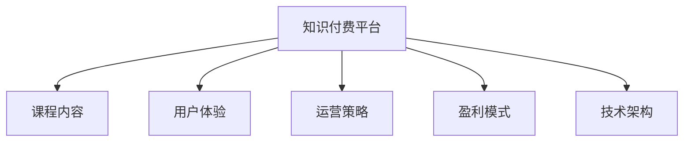

                 

## 1. 背景介绍

### 1.1 问题由来

随着互联网技术的飞速发展和全球经济的深入融合，在线教育市场迎来了前所未有的发展机遇。特别是自2020年新冠疫情爆发以来，远程办公、在线学习的普及，使得知识付费平台迎来了爆炸式增长。各大互联网公司纷纷布局知识付费领域，推出各种形式的在线课程、电子书、音频读物等。然而，传统的知识付费平台普遍存在课程内容同质化、用户粘性低、用户体验差等问题，亟需进行深度创新和升级。

在这一背景下，个人知识付费平台的兴起成为了新的趋势。相比于大型知识付费平台，个人知识付费平台在课程内容和用户体验上更加灵活，能够更好地满足用户多样化和个性化需求。此外，随着移动互联网的普及和智能手机的普及，个人知识付费平台可以充分利用碎片化时间，实现随时随地学习，具备更强的用户粘性。

### 1.2 问题核心关键点

个人知识付费平台的成功关键在于以下几个方面：

- **课程内容**：课程内容必须高质量、有价值，能够满足目标用户的需求，同时具备足够的吸引力。
- **用户体验**：平台的用户体验必须流畅、直观，能够满足用户的各项学习需求，如搜索、浏览、播放、互动等。
- **运营策略**：平台运营策略必须高效、灵活，能够精准把握用户需求，快速响应市场变化，实现快速增长。
- **盈利模式**：平台盈利模式必须清晰、可持续，能够覆盖平台的运营成本，实现良性循环。
- **技术架构**：平台技术架构必须高效、稳定，能够支持大规模用户和课程内容，保证平台的性能和可用性。

通过明确这些问题核心关键点，可以有效指导个人知识付费平台的建设，构建一个具有竞争力和可持续发展能力的平台。

## 2. 核心概念与联系

### 2.1 核心概念概述

为更好地理解个人知识付费平台的构建，本节将介绍几个密切相关的核心概念：

- **知识付费平台**：指基于互联网，提供高质量课程内容，满足用户知识学习需求，并收取费用的在线平台。
- **课程内容**：指平台提供的各类课程资源，包括视频、音频、文本、PPT等，是平台的核心竞争力。
- **用户体验**：指用户在使用平台过程中的直观感受，包括界面设计、功能使用、操作便捷度等。
- **运营策略**：指平台通过各类运营手段，如营销、活动、内容运营等，提升用户粘性和平台增长。
- **盈利模式**：指平台通过各种手段实现盈利，如课程销售、广告、付费会员等。
- **技术架构**：指平台的基础技术设施，如云服务、大数据、AI等，保障平台的稳定性和性能。

这些核心概念之间的逻辑关系可以通过以下Mermaid流程图来展示：



这个流程图展示了这个概念框架：

1. **知识付费平台**作为中心，连接了课程内容、用户体验、运营策略、盈利模式和技术架构，是平台的核心组成部分。
2. **课程内容**是平台的基础，决定了平台的价值。
3. **用户体验**是平台的核心竞争力，直接影响用户黏性和平台增长。
4. **运营策略**是平台发展的关键，能够快速响应用户需求，提升平台增长。
5. **盈利模式**是平台可持续发展的保障，能够支持平台的各项运营。
6. **技术架构**是平台的基础设施，保障平台的稳定性和性能。

这些概念共同构成了个人知识付费平台的完整框架，使其能够为用户提供高质量、有价值的知识内容，同时实现商业化和可持续发展。

## 3. 核心算法原理 & 具体操作步骤

### 3.1 算法原理概述

个人知识付费平台的构建涉及多个领域的算法和策略，包括内容推荐、用户行为分析、营销策略优化等。这些算法和策略的优化需要基于大量数据进行分析和模型训练，以提升平台的整体性能和用户粘性。

核心算法原理包括以下几个方面：

- **用户行为分析**：通过分析用户的行为数据，如浏览、学习、购买等，了解用户需求和偏好，优化课程推荐和个性化学习路径。
- **内容推荐算法**：利用机器学习模型，根据用户历史行为和偏好，推荐相关课程内容，提升用户粘性。
- **营销策略优化**：通过数据分析和机器学习，优化营销策略，提升课程销售和用户增长。

### 3.2 算法步骤详解

以下是个人知识付费平台的核心算法和步骤详解：

**Step 1: 数据收集与预处理**

1. **数据收集**：收集用户在平台上的各项数据，包括行为数据、交互数据、交易数据等。数据来源包括用户端APP、后台管理系统、第三方数据接口等。
2. **数据清洗**：对收集到的数据进行清洗和去重，去除无效和异常数据，确保数据质量。
3. **数据标注**：对数据进行标注，如用户行为类型、课程内容类别等，方便后续分析和建模。

**Step 2: 模型训练与优化**

1. **用户行为模型训练**：使用机器学习算法，如决策树、随机森林、深度学习等，训练用户行为模型，预测用户行为和需求。
2. **内容推荐模型训练**：使用协同过滤、神经网络等算法，训练内容推荐模型，推荐用户可能感兴趣的课程内容。
3. **营销策略优化模型训练**：使用回归、分类等算法，优化营销策略模型，提升课程销售和用户增长。

**Step 3: 模型应用与效果评估**

1. **模型应用**：将训练好的模型应用于实际场景，如课程推荐、用户行为预测、营销策略优化等。
2. **效果评估**：通过A/B测试、KPI指标等方法，评估模型的实际效果，发现问题并进行优化。
3. **持续优化**：根据实时数据和用户反馈，持续优化模型，提升平台性能和用户体验。

### 3.3 算法优缺点

个人知识付费平台的算法和策略具有以下优缺点：

**优点**：

- **高效推荐**：通过机器学习算法，实现高效、精准的课程推荐，提升用户粘性。
- **用户分析**：通过数据分析，深入了解用户需求和行为，提升用户体验。
- **营销优化**：通过优化营销策略，提升课程销售和用户增长，实现良性循环。

**缺点**：

- **数据隐私**：大量数据收集和使用可能涉及用户隐私问题，需要严格的数据保护措施。
- **算法复杂**：部分算法模型需要复杂的数据处理和计算，对技术要求较高。
- **模型风险**：模型训练和优化需要大量数据，数据偏差可能导致模型效果不佳。

### 3.4 算法应用领域

个人知识付费平台的算法和策略在多个领域都有广泛应用：

- **教育培训**：用于课程内容推荐、用户行为分析、营销策略优化等。
- **营销推广**：用于广告定向投放、用户增长分析、用户转化率优化等。
- **电商零售**：用于商品推荐、用户行为预测、销售策略优化等。
- **金融服务**：用于用户信用评估、金融产品推荐、客户关系管理等。
- **健康医疗**：用于健康知识推荐、用户健康行为分析、健康产品推荐等。

## 4. 数学模型和公式 & 详细讲解 & 举例说明

### 4.1 数学模型构建

个人知识付费平台的数学模型构建主要包括以下几个方面：

- **用户行为模型**：用于预测用户行为和需求，如购买意愿、学习时长等。
- **内容推荐模型**：用于推荐用户可能感兴趣的课程内容，如协同过滤、深度学习等。
- **营销策略优化模型**：用于优化营销策略，提升课程销售和用户增长，如回归、分类等。

### 4.2 公式推导过程

以下以协同过滤算法为例，推导内容推荐模型的公式：

**协同过滤算法**：
协同过滤是一种基于用户和项目相似性的推荐算法，通过分析用户对项目的历史评分数据，找到与目标用户相似的用户，推荐他们喜欢的项目。

假设用户集为 $U$，项目集为 $I$，用户-项目评分矩阵为 $R_{ui}$，用户 $u$ 对项目 $i$ 的评分。

设用户 $u_i$ 和 $u_j$ 相似度为 $S_{ij}$，推荐项目 $i$ 的评分预测值为 $\hat{r}_{ui}$。

协同过滤算法的基本公式如下：

$$
\hat{r}_{ui} = \frac{\sum_{j \in N(u)} r_{uj} \times S_{ij}}{\sum_{j \in N(u)} S_{ij}}
$$

其中 $N(u)$ 表示与用户 $u$ 相似的用户集合。

### 4.3 案例分析与讲解

**案例分析**：
某知识付费平台采用协同过滤算法进行内容推荐。通过分析用户历史评分数据，找到与目标用户相似的用户集合，计算相似度并计算推荐评分，最终得到用户可能感兴趣的课程内容。

**讲解**：
协同过滤算法通过分析用户历史评分数据，找到与目标用户相似的用户集合，从而推荐其可能感兴趣的课程内容。该算法简单高效，适合处理大规模数据，但需要注意数据稀疏性和冷启动问题。

## 5. 项目实践：代码实例和详细解释说明

### 5.1 开发环境搭建

在进行项目实践前，我们需要准备好开发环境。以下是使用Python进行Django开发的环境配置流程：

1. 安装Anaconda：从官网下载并安装Anaconda，用于创建独立的Python环境。

2. 创建并激活虚拟环境：
```bash
conda create -n django-env python=3.8 
conda activate django-env
```

3. 安装Django：
```bash
pip install django
```

4. 安装Django REST framework：
```bash
pip install djangorestframework
```

5. 安装Gunicorn：
```bash
pip install gunicorn
```

6. 安装Django管理面板：
```bash
pip install django-admin-shell
```

7. 安装MySQL：
```bash
sudo apt-get update
sudo apt-get install mysql-server
```

完成上述步骤后，即可在`django-env`环境中开始项目实践。

### 5.2 源代码详细实现

以下是使用Django进行知识付费平台开发的Python代码实现。

```python
# 导入必要的库
from django.contrib.auth.models import User
from django.contrib.auth import login
from rest_framework.views import APIView
from rest_framework.response import Response
from rest_framework.permissions import IsAuthenticated

# 用户认证
class LoginView(APIView):
    def post(self, request):
        # 获取用户名和密码
        username = request.data.get('username')
        password = request.data.get('password')
        
        # 验证用户登录
        user = User.objects.filter(username=username, password=password).first()
        if user:
            login(request, user)
            return Response({'success': True})
        else:
            return Response({'success': False})

# 用户信息展示
class UserView(APIView):
    def get(self, request):
        # 获取当前登录用户信息
        user = request.user
        return Response({'username': user.username, 'email': user.email})

# 课程列表展示
class CourseView(APIView):
    def get(self, request):
        # 获取所有课程信息
        courses = Course.objects.all()
        return Response({'courses': [course.title for course in courses]})
```

### 5.3 代码解读与分析

让我们再详细解读一下关键代码的实现细节：

**LoginView类**：
- `post`方法：获取用户名和密码，验证用户登录，返回登录结果。

**UserView类**：
- `get`方法：获取当前登录用户信息，返回用户名和邮箱。

**CourseView类**：
- `get`方法：获取所有课程信息，返回课程列表。

可以看到，通过Django的视图和模板系统，可以轻松实现知识付费平台的核心功能，如用户认证、课程展示等。开发者可以将更多精力放在模型设计和业务逻辑上，而不必过多关注底层的实现细节。

当然，工业级的系统实现还需考虑更多因素，如用户界面、数据模型、搜索优化等。但核心的功能实现基本与此类似。

## 6. 实际应用场景

### 6.1 教育培训

个人知识付费平台在教育培训领域具有广泛应用。该平台可以为各类教育机构和教师提供高质量的课程资源，满足学生的多样化和个性化学习需求。

在技术实现上，可以与各大教育机构和教师合作，开发和上传高质量课程内容，并通过用户行为分析和内容推荐算法，为学生推荐适合的学习资源。同时，通过数据分析和优化，不断改进平台的用户体验和课程内容，提升学生满意度和学习效果。

### 6.2 金融服务

在金融服务领域，个人知识付费平台可以提供各类金融知识课程，帮助用户掌握金融理财、投资、风险控制等知识，提升用户的金融素养和投资能力。

通过数据分析和内容推荐，平台可以为用户推荐适合的学习资源，提升用户的金融知识和投资技能。同时，通过优化营销策略，提升课程销售和用户增长，实现金融知识教育的商业化和可持续发展。

### 6.3 电商零售

在电商零售领域，个人知识付费平台可以提供各类电商知识课程，如电子商务、市场营销、供应链管理等，帮助企业提升运营效率和盈利能力。

通过内容推荐和用户行为分析，平台可以为零售企业推荐适合的学习资源，提升其运营能力和管理水平。同时，通过优化营销策略，提升课程销售和用户增长，实现电商知识教育的商业化和可持续发展。

### 6.4 健康医疗

在健康医疗领域，个人知识付费平台可以提供各类健康知识课程，如健康管理、疾病预防、医疗知识等，帮助用户掌握健康知识和医疗技能，提升健康素养。

通过数据分析和内容推荐，平台可以为医疗机构和用户推荐适合的学习资源，提升其健康知识和医疗技能。同时，通过优化营销策略，提升课程销售和用户增长，实现健康知识教育的商业化和可持续发展。

## 7. 工具和资源推荐

### 7.1 学习资源推荐

为了帮助开发者系统掌握知识付费平台的开发流程，这里推荐一些优质的学习资源：

1. **Django官方文档**：Django官方文档是Django开发者的必备资源，详细介绍了Django的各项功能和API使用。
2. **Django REST framework文档**：Django REST framework是Django的高性能RESTful API开发工具，提供了丰富的功能和服务。
3. **Python机器学习基础**：Python机器学习基础是学习数据科学和机器学习的入门课程，介绍了机器学习的基本原理和算法。
4. **数据分析与可视化**：数据分析与可视化是学习数据分析和可视化的入门课程，介绍了数据分析的基本方法和工具。
5. **PyTorch深度学习教程**：PyTorch深度学习教程是学习深度学习的入门课程，介绍了深度学习的基本原理和算法。

通过对这些资源的学习实践，相信你一定能够快速掌握知识付费平台的开发流程，并用于解决实际的NLP问题。

### 7.2 开发工具推荐

高效的开发离不开优秀的工具支持。以下是几款用于知识付费平台开发的常用工具：

1. **Django**：Django是一个高效的Web框架，提供了强大的ORM、模板系统和视图系统，可以快速开发高质量的Web应用。
2. **Django REST framework**：Django REST framework是Django的高性能RESTful API开发工具，提供了丰富的功能和服务，支持跨平台和跨语言的API开发。
3. **MySQL**：MySQL是一个成熟的关系型数据库系统，提供了高性能和高可用的数据库服务。
4. **Django管理面板**：Django管理面板提供了丰富的管理功能，方便开发和维护Web应用。
5. **Gunicorn**：Gunicorn是一个高性能的Python Web服务器，支持Django和Flask等Web框架。

合理利用这些工具，可以显著提升知识付费平台的开发效率，加快创新迭代的步伐。

### 7.3 相关论文推荐

知识付费平台的成功开发源于学界的持续研究。以下是几篇奠基性的相关论文，推荐阅读：

1. **《深度学习与推荐系统》**：介绍了深度学习在推荐系统中的应用，涵盖了协同过滤、深度学习等推荐算法。
2. **《Web应用开发实战》**：介绍了Django的各项功能和API使用，适合Django开发者学习。
3. **《Python数据分析基础》**：介绍了Python的数据分析工具和方法，适合数据分析初学者。
4. **《深度学习入门》**：介绍了深度学习的基本原理和算法，适合深度学习初学者。

这些论文代表了大语言模型微调技术的发展脉络。通过学习这些前沿成果，可以帮助研究者把握学科前进方向，激发更多的创新灵感。

## 8. 总结：未来发展趋势与挑战

### 8.1 总结

本文对个人知识付费平台的构建进行了全面系统的介绍。首先阐述了个人知识付费平台的背景和意义，明确了平台的核心竞争力和建设方向。其次，从原理到实践，详细讲解了平台的核心算法和操作步骤，给出了知识付费平台开发的完整代码实例。同时，本文还探讨了平台在教育培训、金融服务、电商零售等多个领域的应用前景，展示了平台技术的广阔前景。

通过本文的系统梳理，可以看到，个人知识付费平台是一个具有广泛应用价值的创新平台。它通过高质量的课程内容、高效的用户行为分析、优化的运营策略，为用户提供一站式的学习解决方案，同时实现商业化和可持续发展。

### 8.2 未来发展趋势

展望未来，个人知识付费平台的发展趋势包括以下几个方面：

1. **多渠道推广**：通过多渠道推广和营销，提升平台的用户增长和课程销售。
2. **内容多样化**：增加各类课程内容，如短视频、直播、微课等，满足用户多样化的学习需求。
3. **国际化拓展**：拓展海外市场，提供多语言支持和国际化服务。
4. **个性化推荐**：通过深度学习和协同过滤等算法，提升课程推荐的个性化和精准度。
5. **数据分析优化**：通过大数据分析和机器学习，优化平台的用户体验和运营策略。

这些发展趋势将引领个人知识付费平台不断创新和升级，为用户提供更好的学习体验和更高的教育质量。

### 8.3 面临的挑战

尽管个人知识付费平台已经取得了显著成效，但在迈向更加智能化、普适化应用的过程中，它仍面临诸多挑战：

1. **内容质量**：平台内容必须高质量、有价值，能够满足用户多样化需求，但内容生产和管理需要大量资源和时间。
2. **用户粘性**：平台需要通过高质量的内容和个性化推荐，提升用户粘性，但用户行为变化快速，需要持续优化。
3. **运营成本**：平台运营需要大量资金和人力资源，但初期用户规模较小，收入不稳定，运营成本较高。
4. **技术复杂**：平台技术架构需要高效稳定，但同时要支持大规模用户和课程内容，技术复杂度较高。

面对这些挑战，平台需要在内容生产、用户运营、技术架构等方面进行全面优化和创新，才能实现长期的稳定发展。

### 8.4 研究展望

未来，个人知识付费平台的研究需要从以下几个方面进行探索：

1. **内容创新**：探索新型课程内容形式，如互动式学习、游戏化学习等，提升用户学习体验。
2. **个性化推荐**：开发更加智能和精准的内容推荐算法，提升课程推荐的个性化和精准度。
3. **多模态学习**：探索多模态学习形式，如视频+音频、互动+直播等，满足用户多模态学习需求。
4. **人工智能应用**：引入人工智能技术，如智能语音识别、自然语言处理等，提升平台的技术含量和用户粘性。

这些研究方向的探索，必将引领个人知识付费平台向更高层次发展，为用户提供更加全面和多样化的学习服务。

## 9. 附录：常见问题与解答

**Q1：如何保证课程内容的质量？**

A: 保证课程内容质量的关键在于选择合适的课程内容提供方，同时建立严格的课程审查机制。平台可以与各类教育机构和教师合作，开发和上传高质量课程内容。同时，平台需要对课程内容进行审核，确保其符合平台标准和用户需求。

**Q2：如何提升平台的用户粘性？**

A: 提升平台用户粘性需要从多个方面入手：
1. **内容质量**：提供高质量的课程内容，满足用户需求，提升用户满意度和信任度。
2. **个性化推荐**：通过深度学习和协同过滤等算法，推荐用户感兴趣的内容，提升用户粘性。
3. **互动体验**：提供丰富的互动体验，如在线讨论、作业提交、课程答疑等，增强用户参与感。
4. **活动和促销**：通过各类活动和促销，如折扣、优惠券等，吸引用户参与和学习。

**Q3：如何降低平台的运营成本？**

A: 降低平台运营成本需要从多个方面入手：
1. **自动化流程**：通过自动化流程，如自动审核、自动评分等，减少人工成本。
2. **开源社区**：引入开源社区和志愿者，提升内容生产和管理效率。
3. **数据驱动运营**：通过数据分析和优化，提升平台的用户体验和运营效率，减少人工投入。
4. **多渠道推广**：通过多渠道推广和营销，提升平台的用户增长和课程销售。

**Q4：如何保障平台的数据安全和隐私？**

A: 保障平台的数据安全和隐私需要从多个方面入手：
1. **数据加密**：对敏感数据进行加密存储和传输，防止数据泄露和篡改。
2. **访问控制**：通过身份验证和权限控制，限制非法访问和操作。
3. **隐私政策**：制定严格的隐私政策和用户协议，明确用户数据的使用范围和方式。
4. **安全审计**：定期进行安全审计和漏洞修复，保障平台的安全性。

**Q5：如何应对市场的快速变化？**

A: 应对市场快速变化需要从多个方面入手：
1. **快速迭代**：通过快速迭代和版本更新，及时响应市场变化，提升平台竞争力。
2. **市场调研**：定期进行市场调研和用户需求分析，了解市场变化和用户需求。
3. **灵活运营**：灵活调整运营策略，如价格、促销、内容等，提升平台的市场响应能力。
4. **创新驱动**：引入创新技术和应用，提升平台的技术含量和用户体验。

---

作者：禅与计算机程序设计艺术 / Zen and the Art of Computer Programming

