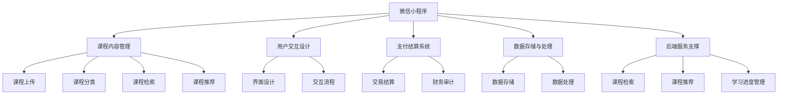

                 

# 如何打造知识付费的微信小程序

## 1. 背景介绍

### 1.1 问题由来

随着互联网和移动通信技术的发展，在线教育逐渐成为知识传播的重要方式。相较于传统线下教育，在线教育具备灵活、便捷、高效等优势，吸引了大批用户和投资。特别是在知识付费领域，内容付费、在线课程等形式成为了满足用户知识需求的主要途径。

微信小程序作为轻量级应用，具有开发门槛低、用户体验好、流量获取便捷等优点，成为了知识付费平台的重要载体。本文将从核心概念、算法原理、具体操作等角度，全面系统地介绍如何打造一个高效、稳定的知识付费微信小程序。

### 1.2 问题核心关键点

知识付费微信小程序的核心任务是实现课程内容与用户的有效互动，包括课程检索、课程预览、课程报名、课程学习、课程测评等功能。而核心技术挑战包括：

- 课程内容管理：课程资源上传、分类、检索、推荐等。
- 用户交互设计：简洁易用的界面设计、流畅的交互流程。
- 支付结算系统：安全可靠的交易结算、财务审计。
- 数据存储与处理：大规模课程数据的存储、查询与分析。
- 后端服务支撑：高效稳定的服务基础设施。

本文将围绕上述核心点，详细探讨如何构建一个高效、稳定的知识付费微信小程序。

## 2. 核心概念与联系

### 2.1 核心概念概述

1. **微信小程序（WeChat Mini Program）**：基于微信平台开发的轻量级应用，具备即时通讯、社交互动、多媒体展示等多种能力。

2. **知识付费平台**：以课程内容为核心，提供知识获取、支付、交流等功能，促进知识传播和用户互动。

3. **课程内容管理**：包括课程上传、分类、检索、推荐等功能，为用户提供便捷的课程获取途径。

4. **用户交互设计**：设计简洁易用的界面和流畅的交互流程，提升用户体验和满意度。

5. **支付结算系统**：采用安全可靠的交易结算方式，保障用户支付安全，同时进行财务审计，确保财务数据的准确性。

6. **数据存储与处理**：采用高性能的数据存储和处理技术，支持大规模课程数据的存储、查询与分析。

7. **后端服务支撑**：构建稳定高效的后端服务，提供课程检索、推荐、学习进度管理等功能支持。

### 2.2 核心概念原理和架构的 Mermaid 流程图

此图展示了知识付费小程序的核心架构和关键模块，通过合流各模块的协同工作，为用户提供了完整的知识获取和互动体验。

## 3. 核心算法原理 & 具体操作步骤

### 3.1 算法原理概述

知识付费小程序的开发主要涉及前端界面设计、后端服务支撑、数据存储与处理、支付结算等多个领域。本文将详细介绍课程内容管理、用户交互设计、支付结算系统的核心算法原理和具体操作步骤。

### 3.2 算法步骤详解

#### 3.2.1 课程内容管理

课程内容管理包括课程上传、分类、检索和推荐等核心功能。

**课程上传**：开发者通过API接口，将课程资源上传到云存储服务，如阿里云OSS、腾讯云COS等，以便快速访问和备份。

**课程分类**：对上传的课程进行自动分类，通过标签、关键字等方式建立索引，方便用户检索。

**课程检索**：实现课程标题、描述、标签等的模糊搜索，通过分词、倒排索引等技术实现高效检索。

**课程推荐**：基于用户浏览历史、评价、评分等数据，使用协同过滤、内容推荐等算法，向用户推荐相关课程。

#### 3.2.2 用户交互设计

用户交互设计包括界面设计和交互流程设计。

**界面设计**：采用简洁易用的UI设计风格，确保界面美观、友好。

**交互流程**：设计流畅的交互流程，包括课程浏览、预览、报名、学习、测评等步骤。

#### 3.2.3 支付结算系统

支付结算系统需要保证交易的安全可靠性和财务数据的准确性。

**交易结算**：采用安全的第三方支付接口，如支付宝、微信支付等，进行在线支付。

**财务审计**：定期审计财务数据，确保数据准确性，防范欺诈行为。

### 3.3 算法优缺点

知识付费小程序的核心算法具有以下优缺点：

**优点**：
- 功能丰富，满足用户知识获取和互动需求。
- 技术成熟，易于开发和维护。
- 性能稳定，用户体验良好。

**缺点**：
- 数据安全风险较高，需采用多重加密技术。
- 课程资源存储和处理需求高，需采用高性能的数据存储和处理技术。
- 交易结算系统复杂，需采用安全可靠的交易结算方式。

### 3.4 算法应用领域

知识付费小程序的核心算法可广泛应用于在线教育、知识分享、技能培训等多个领域。

## 4. 数学模型和公式 & 详细讲解 & 举例说明

### 4.1 数学模型构建

课程内容管理、用户交互设计、支付结算系统等核心功能涉及大量数学模型和算法。以下以协同过滤推荐算法为例，介绍其数学模型和实现。

**协同过滤推荐算法**：基于用户历史行为数据，通过计算用户间的相似度，向用户推荐相关课程。

**用户行为矩阵**：$U\times N$ 的稀疏矩阵，$U$ 为用户数，$N$ 为课程数，$u_{i,j}=1$ 表示用户 $i$ 购买了课程 $j$，$u_{i,j}=0$ 表示用户 $i$ 未购买课程 $j$。

**用户相似度计算**：采用余弦相似度计算用户 $i$ 和 $j$ 的相似度 $s_{ij}$，公式如下：

$$
s_{ij} = \frac{\sum_k u_{i,k}u_{j,k}}{\sqrt{\sum_k u_{i,k}^2}\sqrt{\sum_k u_{j,k}^2}}
$$

**课程推荐**：计算每个用户与其邻居用户的相似度，并根据相似度排序，选取前 $K$ 个相似用户，计算其购买过的课程向量，计算推荐课程与用户兴趣向量余弦相似度，选取相似度最高的 $R$ 个课程推荐给用户。

### 4.2 公式推导过程

协同过滤推荐算法公式推导如下：

1. 用户行为矩阵 $U$ 计算用户 $i$ 的兴趣向量 $v_i$：
$$
v_i = U^T v_j, \quad v_j = \frac{1}{\sqrt{\sum_k u_{i,k}^2}}u_i
$$

2. 计算用户 $i$ 和 $j$ 的相似度 $s_{ij}$：
$$
s_{ij} = v_i^T v_j
$$

3. 选取前 $K$ 个相似用户 $j_1, j_2, ..., j_K$，计算其购买课程向量 $v_{j_k}$：
$$
v_{j_k} = \frac{1}{\sqrt{\sum_k u_{j_k,k}^2}}u_{j_k}
$$

4. 计算推荐课程向量 $v'$ 与用户兴趣向量 $v_i$ 的余弦相似度 $s'$：
$$
s' = v'^T v_i
$$

5. 选取相似度最高的 $R$ 个课程推荐给用户：
$$
C = \arg\max_c\left( v'^T v_c \right)
$$

### 4.3 案例分析与讲解

以某在线教育平台为例，介绍如何基于协同过滤推荐算法实现课程推荐。

**背景**：平台上有 $10,000$ 个课程，$5,000$ 个用户，用户已购买 $100$ 个课程。

**数据准备**：
- 用户行为矩阵 $U$：$5,000\times 10,000$ 的稀疏矩阵。
- 课程兴趣向量 $v$：$10,000$ 维的向量。

**用户相似度计算**：
- 计算用户 $i$ 和 $j$ 的相似度 $s_{ij}$。
- 选取前 $100$ 个相似用户 $j_1, j_2, ..., j_{100}$。

**课程推荐**：
- 计算每个用户 $j_k$ 购买课程向量 $v_{j_k}$。
- 计算推荐课程向量 $v'$ 与用户兴趣向量 $v_i$ 的余弦相似度 $s'$。
- 选取相似度最高的 $20$ 个课程推荐给用户。

## 5. 项目实践：代码实例和详细解释说明

### 5.1 开发环境搭建

开发环境搭建主要包括前端和后端环境配置，具体步骤如下：

1. 前端开发环境搭建：
   - 安装Node.js：官网下载安装包，安装配置。
   - 安装微信开发者工具：安装微信开发者工具，配置本地开发环境。
   - 创建项目：通过命令行创建项目，设置项目目录。

2. 后端开发环境搭建：
   - 安装Docker：官网下载安装包，安装配置。
   - 搭建数据库：使用MySQL或MongoDB等数据库，搭建数据库服务。
   - 搭建后端服务：安装Node.js、Express等后端服务框架，搭建后端服务。

### 5.2 源代码详细实现

**前端代码实现**：
- 创建课程列表页面：展示课程信息、推荐课程、课程分类等。
- 创建课程详情页面：展示课程视频、PPT、习题等。
- 创建课程报名页面：用户填写信息并完成支付。

**后端代码实现**：
- 课程上传：通过API接口，将课程资源上传到云存储服务。
- 课程分类：根据标签、关键字等方式对上传的课程进行分类。
- 课程检索：实现课程标题、描述、标签等的模糊搜索。
- 支付结算：采用安全的第三方支付接口，进行在线支付。

### 5.3 代码解读与分析

**前端代码解读**：
- 采用React框架，利用组件化开发技术，实现课程列表、详情、报名等页面。
- 使用微信开发者工具进行调试和测试，确保页面渲染和交互流畅。

**后端代码解读**：
- 采用Node.js和Express框架，实现API接口和后端服务。
- 使用MySQL数据库，存储用户信息、课程数据、交易记录等。
- 采用第三方支付接口，如支付宝、微信支付等，进行在线支付。

### 5.4 运行结果展示

**前端运行结果**：
- 课程列表页面：展示课程信息、推荐课程、课程分类等。
- 课程详情页面：展示课程视频、PPT、习题等。
- 课程报名页面：用户填写信息并完成支付。

**后端运行结果**：
- 课程上传：课程资源成功上传到云存储服务。
- 课程分类：课程分类结构清晰，便于用户检索。
- 课程检索：用户可快速找到感兴趣的课程。
- 支付结算：用户可安全完成在线支付，财务数据准确无误。

## 6. 实际应用场景

### 6.1 教育培训

在线教育平台已成为全球教育培训的重要形式，知识付费小程序可用于企业培训、职业资格认证、在线考试等场景，提供便捷、高效的学习和考试体验。

**场景**：某公司培训中心，提供在线课程、视频、题库等资源，帮助员工提升专业技能。

**应用**：员工通过小程序报名、学习课程、参加考试，平台根据员工学习记录和成绩，自动推荐相关课程，提高培训效果。

### 6.2 医疗健康

医疗健康领域需要大量专业的知识和信息，知识付费小程序可用于医学教育、健康管理、心理咨询等场景，提供可靠、权威的知识获取途径。

**场景**：某医疗健康平台，提供医学课程、健康知识、在线咨询等服务。

**应用**：用户通过小程序获取医学课程、健康知识，平台根据用户行为推荐相关课程，提升用户健康意识和专业水平。

### 6.3 职业技能

职业技能培训需要大量实践经验和技术知识，知识付费小程序可用于技术培训、职业认证、技能考试等场景，提供系统、实用的技能培训。

**场景**：某IT培训机构，提供编程课程、开发工具、在线考试等服务。

**应用**：学生通过小程序报名课程、参加考试，平台根据学生学习记录和成绩，自动推荐相关课程，提升学习效果。

### 6.4 未来应用展望

随着人工智能和物联网技术的不断发展，知识付费小程序的应用场景将进一步扩展，涵盖更多领域和行业。

**未来应用场景**：
- **智能家居**：提供家居保养、家电维护、家庭健康等知识，提升家庭生活质量。
- **金融理财**：提供投资理财、财务规划、风险管理等知识，帮助用户做出明智的投资决策。
- **旅游出行**：提供旅游攻略、景点介绍、旅行贴士等知识，提升用户旅行体验。
- **文化娱乐**：提供艺术鉴赏、电影推荐、音乐欣赏等知识，丰富用户精神文化生活。

## 7. 工具和资源推荐

### 7.1 学习资源推荐

1. **《微信小程序开发指南》**：全面介绍微信小程序的开发流程、API接口和最佳实践。
2. **《知识付费平台开发实战》**：实战案例，介绍知识付费平台的核心技术和开发经验。
3. **《人工智能与深度学习》**：深入浅出地介绍人工智能和深度学习的原理、算法和应用。
4. **《Python编程实践》**：介绍Python语言和开发工具的使用，包括前端和后端开发。
5. **《数据科学基础》**：介绍数据科学的基础知识，包括数据存储、处理和分析。

### 7.2 开发工具推荐

1. **微信开发者工具**：官方提供的开发调试工具，支持模拟器、真机调试、性能分析等。
2. **Visual Studio Code**：轻量级代码编辑器，支持多种编程语言和插件。
3. **MySQL Workbench**：MySQL数据库管理工具，支持数据库设计、数据导入导出等。
4. **Docker Desktop**：Docker容器管理工具，支持本地开发环境搭建和容器化部署。
5. **Git**：版本控制系统，支持代码协作和版本管理。

### 7.3 相关论文推荐

1. **《基于协同过滤推荐系统的研究与实践》**：介绍协同过滤推荐算法的设计和实现。
2. **《知识付费平台的数据存储与处理技术》**：介绍知识付费平台的数据存储和处理技术。
3. **《支付结算系统的设计与实现》**：介绍支付结算系统的设计和实现技术。
4. **《移动应用的界面设计与用户体验》**：介绍移动应用的界面设计和用户体验优化方法。

## 8. 总结：未来发展趋势与挑战

### 8.1 研究成果总结

本文从核心概念、算法原理、操作步骤等角度，全面系统地介绍了如何打造知识付费微信小程序。通过课程内容管理、用户交互设计、支付结算系统等核心功能的实现，保证了小程序的高效稳定运行，满足了用户知识获取和互动需求。

### 8.2 未来发展趋势

知识付费小程序将在教育培训、医疗健康、职业技能等多个领域进一步扩展，应用场景将更加多样化。未来趋势包括：

1. **跨平台扩展**：小程序跨平台特性将进一步拓展，支持更多设备和平台。
2. **智能推荐**：基于用户行为数据分析，实现更精准的课程推荐。
3. **AI辅助**：引入AI技术，提升课程内容搜索和推荐效率。
4. **用户互动**：增强用户互动功能，提升用户体验和粘性。

### 8.3 面临的挑战

知识付费小程序在发展过程中也面临诸多挑战：

1. **数据安全和隐私保护**：用户数据安全和隐私保护问题需引起重视。
2. **课程资源质量**：课程资源质量参差不齐，需严格筛选和审核。
3. **支付结算安全**：支付结算安全问题需多重加密和审计。
4. **用户体验优化**：需不断优化用户交互界面和流程，提升用户体验。
5. **技术迭代更新**：需不断跟进技术发展，更新优化系统功能。

### 8.4 研究展望

未来，知识付费小程序需持续优化和迭代，以满足用户日益增长的需求。研究展望包括：

1. **增强AI技术应用**：引入AI技术，提升课程推荐和搜索效率。
2. **优化用户交互体验**：提升用户互动和粘性，增强用户参与感。
3. **增强数据安全保护**：采用多重加密和隐私保护技术，确保用户数据安全。
4. **拓展应用场景**：拓展更多应用场景，提供更丰富多样的知识服务。

## 9. 附录：常见问题与解答

**Q1：微信小程序开发需要哪些技术栈？**

A: 微信小程序开发主要涉及前端、后端、数据库等多个技术栈，具体包括：
- 前端：React、Vue等框架，微信开发者工具。
- 后端：Node.js、Express等框架，MySQL、MongoDB等数据库。
- 其他：Git、Docker等工具。

**Q2：如何保证微信小程序的安全性？**

A: 微信小程序的安全性主要通过以下措施保证：
- 数据加密：采用SSL/TLS加密技术，确保数据传输安全。
- 用户授权：严格控制用户授权和访问权限，防止未授权访问。
- 安全审计：定期进行安全审计和漏洞扫描，及时修复安全问题。

**Q3：如何优化微信小程序的性能？**

A: 微信小程序的性能优化主要通过以下措施实现：
- 前端优化：采用代码压缩、异步加载、懒加载等技术，提升页面加载速度。
- 后端优化：采用缓存、负载均衡、分布式部署等技术，提升系统响应速度。
- 数据优化：采用数据压缩、索引、分页等技术，优化数据访问效率。

**Q4：如何保证微信小程序的稳定性和可靠性？**

A: 微信小程序的稳定性和可靠性主要通过以下措施保证：
- 后端稳定：采用稳定可靠的后端服务和数据库，保证系统高可用性。
- 接口规范：制定严格的API接口规范，确保接口调用稳定性。
- 监控告警：采用监控工具，实时监测系统性能和告警，及时处理问题。

**Q5：微信小程序的开发流程是怎样的？**

A: 微信小程序的开发流程主要包括以下步骤：
- 需求分析：明确小程序的功能需求和设计方案。
- 前端开发：使用React、Vue等框架，实现前端页面和功能。
- 后端开发：使用Node.js、Express等框架，实现后端服务和API接口。
- 测试部署：进行功能测试和性能测试，部署至微信平台。
- 迭代优化：根据用户反馈，持续优化和迭代小程序功能。

作者：禅与计算机程序设计艺术 / Zen and the Art of Computer Programming

