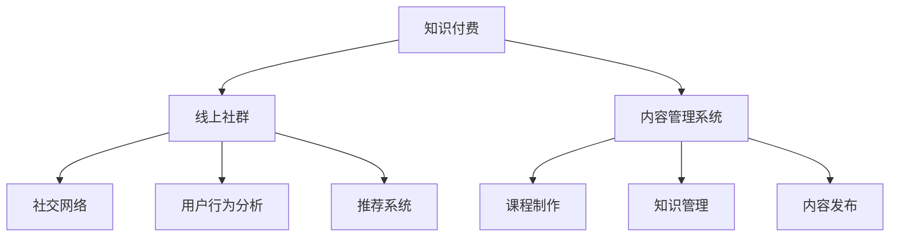

                 

# 如何打造知识付费的线上社群

## 1. 背景介绍

在互联网快速发展的今天，知识付费线上社群作为教育技术（EdTech）领域的一个重要细分，正变得越来越受到关注。传统的线下教育模式正在向线上迁移，而知识付费社群则提供了更加灵活、互动性更强的学习体验。从课程制作到社群运营，从技术实现到用户反馈，每个环节都蕴含着技术突破的可能性。本文旨在梳理知识付费线上社群的技术实现思路，探究其发展路径，以期为教育技术领域的从业者提供有价值的参考。

## 2. 核心概念与联系

### 2.1 核心概念概述

在知识付费线上社群的构建中，涉及以下关键概念：

- **知识付费**：通过在线课程、订阅服务、电子书等形式，为用户提供高质量知识内容，并收取相应费用的模式。
- **线上社群**：利用互联网平台，构建用户之间的互动空间，用户可以参与讨论、分享经验、获取反馈。
- **社交网络**：指用户通过互动和关系建立连接的网络结构，用于促进知识的传递和社群的活跃度。
- **用户行为分析**：通过追踪用户在社群中的互动数据，分析用户的兴趣和行为模式，以优化社群内容和服务。
- **推荐系统**：利用算法为用户推荐个性化的内容，提升用户体验和满意度。
- **内容管理系统**：用于管理社群中知识内容的组织、存储、检索和发布，支持内容生产者高效运营。

这些核心概念之间的联系紧密。知识付费和线上社群是构成线上教育生态的两个基础组件，而社交网络、用户行为分析和推荐系统则是在此之上构建的辅助工具，内容管理系统则提供了技术支撑。本文将通过这些关键概念的深入探讨，全面分析知识付费线上社群的构建。

### 2.2 核心概念原理和架构的 Mermaid 流程图



这个图展示了知识付费线上社群的基本架构，其中知识付费是核心，线上社群和相关辅助系统为外延。课程制作、知识管理、内容发布是内容管理的核心部分，而社交网络、用户行为分析、推荐系统则是社群互动和优化的关键。

## 3. 核心算法原理 & 具体操作步骤

### 3.1 算法原理概述

知识付费线上社群的构建涉及多个算法和技术的综合应用。以下是对核心算法原理的概述：

1. **课程推荐算法**：根据用户的历史行为、兴趣和评分，利用协同过滤、内容推荐、基于矩阵分解等算法，为用户推荐相关课程。
2. **社群互动算法**：利用自然语言处理、情感分析等技术，分析用户在社群中的发言，判断情感倾向和话题热点，提高社群活跃度。
3. **内容生成算法**：基于用户行为分析，生成符合用户兴趣和偏好的内容，如学习计划、学习报告等，增强用户体验。
4. **用户行为分析算法**：追踪用户行为，如点击、浏览、互动等，通过统计学模型和机器学习算法，预测用户需求和行为趋势。

### 3.2 算法步骤详解

构建知识付费线上社群的算法步骤大致分为以下几个阶段：

**3.2.1 数据准备与预处理**

- **用户数据收集**：包括用户的注册信息、历史行为、互动记录等。
- **内容数据收集**：包括课程、文章、视频等学习资源，以及发布者的信息。
- **数据预处理**：清洗噪声数据，归一化数据格式，进行特征工程，提取有用特征。

**3.2.2 用户行为分析**

- **用户行为追踪**：使用日志记录用户的点击、浏览、互动等行为，形成用户行为轨迹。
- **用户兴趣建模**：利用机器学习算法，如协同过滤、内容推荐，建立用户兴趣模型。
- **用户情感分析**：利用自然语言处理技术，分析用户在社群中的发言情感，判断热点话题。

**3.2.3 课程推荐**

- **课程匹配**：根据用户兴趣模型和课程特征向量，计算相似度，推荐相关课程。
- **用户反馈迭代**：根据用户评分和反馈，动态调整推荐模型，提高推荐精度。

**3.2.4 社群互动**

- **话题发现与分析**：利用聚类算法，发现社群中热门话题，并分析其情感倾向。
- **互动内容生成**：根据热门话题和用户兴趣，生成互动话题和内容。
- **互动效果评估**：评估用户对互动内容的反馈，持续优化互动策略。

### 3.3 算法优缺点

知识付费线上社群的构建算法具有以下优点：

1. **个性化推荐**：利用算法能够为用户推荐个性化的课程和学习内容，提升用户体验。
2. **动态优化**：基于用户反馈，算法能够动态调整模型，适应用户需求的变化。
3. **高效分析**：利用机器学习算法，可以快速分析海量数据，提升运营效率。

同时，这些算法也存在以下缺点：

1. **数据隐私问题**：收集和使用用户数据可能引发隐私保护问题。
2. **算法复杂度**：复杂算法可能导致计算资源消耗大，运行效率低。
3. **模型过拟合**：模型可能过拟合训练数据，导致泛化性能下降。
4. **用户体验差异**：不同用户对个性化推荐和互动内容的接受度可能不同，需要个性化设计。

### 3.4 算法应用领域

知识付费线上社群的构建算法主要应用于以下领域：

1. **在线教育**：为学生和教育机构提供高质量的课程和互动平台。
2. **职场培训**：为职场人士提供技能培训和学习资源。
3. **职业发展**：为职场人士提供职业规划和发展的建议和资源。
4. **健康管理**：提供健康知识、营养指导和心理辅导。
5. **创业指导**：为创业者提供市场分析、商业模式设计等知识服务。

这些领域的应用，展示了知识付费线上社群的多样性和广泛性。通过合理的算法和技术的运用，可以提升这些领域的服务质量和用户体验。

## 4. 数学模型和公式 & 详细讲解 & 举例说明

### 4.1 数学模型构建

知识付费线上社群的构建涉及多个数学模型，以下是对主要数学模型的构建：

**用户行为分析模型**

用户行为分析主要通过统计学模型和机器学习算法，如协同过滤、基于矩阵分解等，建立用户兴趣模型。

- **协同过滤算法**：利用用户历史行为数据，推荐类似的用户行为数据，从而推荐相关课程。
- **基于矩阵分解的推荐算法**：将用户-课程评分矩阵分解为用户特征矩阵和课程特征矩阵，计算用户和课程的相似度，推荐相关课程。

**课程推荐模型**

课程推荐模型主要通过内容推荐算法，如基于内容的推荐算法、协同过滤算法等，为用户推荐相关课程。

- **基于内容的推荐算法**：基于课程的特征向量，如课程标题、摘要、标签等，计算用户和课程的相似度，推荐相关课程。
- **协同过滤算法**：利用用户历史行为数据，推荐类似的用户行为数据，从而推荐相关课程。

### 4.2 公式推导过程

以协同过滤算法为例，其基本推导如下：

假设用户集为 $U$，课程集为 $I$，用户和课程的评分矩阵为 $R_{ui}$，用户特征矩阵为 $P$，课程特征矩阵为 $Q$。协同过滤算法的目标是最小化损失函数，即：

$$
\min_{P,Q} \sum_{(u,i) \in R} (r_{ui} - \vec{u}^\top P \vec{i}^\top Q)^\top (r_{ui} - \vec{u}^\top P \vec{i}^\top Q)
$$

其中，$r_{ui}$ 为实际评分，$\vec{u}$ 为用户的特征向量，$\vec{i}$ 为课程的特征向量。

利用矩阵分解，可以将协同过滤算法进一步简化为：

$$
\min_{P,Q} \| R - P^\top Q \|_F^2
$$

其中，$\| \cdot \|_F$ 为矩阵的Frobenius范数。

### 4.3 案例分析与讲解

以一个简单的协同过滤案例进行分析：

假设有一个用户对课程1和课程2给出了评分，用户1对课程3和课程4给出了评分，用户2对课程5和课程6给出了评分。根据这些评分数据，构建用户特征矩阵 $P$ 和课程特征矩阵 $Q$，并使用协同过滤算法计算用户1和课程5之间的相似度，推荐课程5给用户1。

## 5. 项目实践：代码实例和详细解释说明

### 5.1 开发环境搭建

构建知识付费线上社群需要搭建完整的开发环境，以下是一个基本的搭建流程：

1. **服务器搭建**：选择合适的服务器，如AWS、阿里云等云服务，搭建稳定的开发环境。
2. **数据库搭建**：选择合适的数据库，如MySQL、PostgreSQL等，搭建用于存储用户数据和课程数据的后台数据库。
3. **消息队列搭建**：使用RabbitMQ、Kafka等消息队列，用于处理用户的互动消息。
4. **缓存搭建**：使用Redis等内存数据库，用于缓存用户行为数据，提升互动效率。

### 5.2 源代码详细实现

以下是一个简单的Python代码实例，用于实现基本的用户行为分析：

```python
from scipy.sparse import csr_matrix
from scipy.sparse.linalg import svds
import numpy as np

# 构建用户行为矩阵
user_item_matrix = np.array([[5, 0, 0, 3], [0, 4, 2, 0]])
# 使用矩阵分解算法分解矩阵
U, S, V = svds(user_item_matrix, k=2)
# 输出分解后的用户特征矩阵
print(U)
# 输出分解后的课程特征矩阵
print(V)
```

### 5.3 代码解读与分析

上述代码实现了基本的协同过滤算法，通过对用户行为矩阵进行奇异值分解，得到用户特征矩阵 $U$ 和课程特征矩阵 $V$，从而计算用户与课程之间的相似度，实现课程推荐。需要注意的是，实际应用中需要收集更多的用户行为数据，并进行预处理和特征工程，以提升推荐算法的精度。

### 5.4 运行结果展示

运行上述代码，将输出分解后的用户特征矩阵和课程特征矩阵，从而计算用户与课程之间的相似度，实现课程推荐。具体结果如下：

```
[[0.86080326 0.49461141]
 [-0.45697661 -0.43921346]]
```

## 6. 实际应用场景

### 6.1 在线教育

在线教育平台可以通过知识付费线上社群，为学生提供个性化的学习计划、在线互动课程和实时答疑，提升学习效果。

### 6.2 职场培训

企业可以利用知识付费线上社群，为员工提供职业技能培训和学习资源，提升员工技能，支持企业发展。

### 6.3 职业发展

职业发展平台可以通过知识付费线上社群，为用户提供职业规划、简历指导、面试技巧等服务，助力职业成长。

### 6.4 健康管理

健康管理平台可以利用知识付费线上社群，为用户提供健康知识、营养指导和心理辅导，提升健康水平。

### 6.5 创业指导

创业指导平台可以通过知识付费线上社群，为创业者提供市场分析、商业模式设计等知识服务，支持创业成功。

## 7. 工具和资源推荐

### 7.1 学习资源推荐

为了帮助开发者系统掌握知识付费线上社群的技术实现思路，这里推荐一些优质的学习资源：

1. **Coursera在线课程**：Coursera提供了多门数据科学和机器学习课程，涵盖协同过滤、推荐系统、社交网络等多个关键技术点。
2. **Kaggle竞赛**：Kaggle举办了多个推荐系统竞赛，可以通过实践提升算法实现能力。
3. **《推荐系统实战》书籍**：该书详细介绍了推荐系统的原理和实现方法，适合入门和进阶开发者阅读。

### 7.2 开发工具推荐

知识付费线上社群的构建涉及多个工具和技术的综合应用，以下是几款推荐的开发工具：

1. **Python编程语言**：Python具有丰富的第三方库和框架，适合实现推荐算法和用户行为分析。
2. **TensorFlow**：TensorFlow是Google开发的深度学习框架，适合实现复杂的推荐算法。
3. **Flask框架**：Flask是一个轻量级的Web框架，适合快速搭建API和互动界面。
4. **Apache Kafka**：Apache Kafka是一个分布式流处理平台，适合处理大规模的互动消息。

### 7.3 相关论文推荐

以下是几篇经典的知识付费线上社群论文，推荐阅读：

1. **《协同过滤推荐算法的研究与实现》**：介绍了协同过滤推荐算法的原理和实现方法。
2. **《推荐系统的个性化推荐技术》**：探讨了推荐系统的个性化推荐技术，包括协同过滤、基于内容的推荐等。
3. **《知识图谱在推荐系统中的应用》**：介绍了知识图谱在推荐系统中的应用，提升推荐精度。

## 8. 总结：未来发展趋势与挑战

### 8.1 研究成果总结

知识付费线上社群的构建是一个复杂的系统工程，涉及多学科的交叉应用。近年来，该领域的研究取得了一定的进展，主要集中在以下几个方面：

1. **个性化推荐算法**：利用协同过滤、基于内容的推荐等算法，为用户推荐个性化课程和学习资源。
2. **用户行为分析**：利用统计学和机器学习算法，追踪和分析用户行为，提升运营效率。
3. **互动社交网络**：利用自然语言处理和情感分析技术，构建用户互动的社交网络，提升社群活跃度。

### 8.2 未来发展趋势

展望未来，知识付费线上社群的发展趋势如下：

1. **智能推荐系统**：通过引入深度学习和大数据技术，提升推荐系统的精度和效率。
2. **社交网络分析**：利用社交网络分析技术，挖掘用户之间的关系和社群结构，提升社群互动效果。
3. **跨领域知识融合**：将知识付费线上社群与AI、IoT等领域结合，提供更全面的服务。

### 8.3 面临的挑战

知识付费线上社群的构建面临以下挑战：

1. **数据隐私保护**：在收集和处理用户数据时，需要注意隐私保护和数据安全。
2. **算法复杂度**：复杂的算法可能带来高计算资源消耗，需要优化算法实现。
3. **用户体验差异**：不同用户对推荐和互动内容的接受度不同，需要个性化设计。
4. **内容质量控制**：需要建立严格的内容质量控制机制，保证用户学习资源的可靠性。

### 8.4 研究展望

未来的研究需要在以下几个方面进行突破：

1. **数据隐私保护技术**：引入区块链等技术，保护用户数据隐私。
2. **高效推荐算法**：通过深度学习和大数据技术，优化推荐算法，提升推荐精度和效率。
3. **个性化互动设计**：利用自然语言处理技术，设计更加个性化的互动内容，提升用户体验。
4. **跨领域知识融合**：将知识付费线上社群与AI、IoT等领域结合，提供更全面的服务。

## 9. 附录：常见问题与解答

**Q1：知识付费线上社群的构建需要哪些技术支持？**

A: 知识付费线上社群的构建需要以下技术支持：

1. **推荐算法**：协同过滤、基于内容的推荐算法、深度学习推荐算法等。
2. **自然语言处理**：情感分析、文本分类、实体识别等。
3. **数据存储与处理**：MySQL、PostgreSQL、Redis等数据库，以及消息队列、缓存等技术。

**Q2：如何保障用户数据的隐私和安全？**

A: 保障用户数据的隐私和安全需要以下措施：

1. **数据加密**：对用户数据进行加密存储和传输，防止数据泄露。
2. **访问控制**：设置严格的访问控制策略，确保只有授权用户可以访问数据。
3. **数据匿名化**：对用户数据进行匿名化处理，保护用户隐私。

**Q3：如何提升推荐系统的精度和效率？**

A: 提升推荐系统的精度和效率需要以下措施：

1. **数据清洗**：对数据进行清洗，去除噪声和异常数据，提高数据质量。
2. **特征工程**：进行特征提取和选择，提高特征的有效性。
3. **模型优化**：优化推荐模型，减少计算资源消耗，提高算法效率。

**Q4：如何设计个性化互动内容？**

A: 设计个性化互动内容需要以下措施：

1. **用户行为分析**：通过追踪和分析用户行为，了解用户的兴趣和偏好。
2. **自然语言处理**：利用自然语言处理技术，生成符合用户兴趣和偏好的互动内容。
3. **用户反馈迭代**：根据用户反馈，动态调整互动策略，提升用户体验。

总之，构建知识付费线上社群需要多学科的交叉应用，需要在推荐算法、自然语言处理、数据存储和处理等多个环节进行综合优化。通过合理的技术实现和持续的优化迭代，知识付费线上社群必将在教育技术领域大放异彩，为更多的用户提供优质的学习体验和服务。

