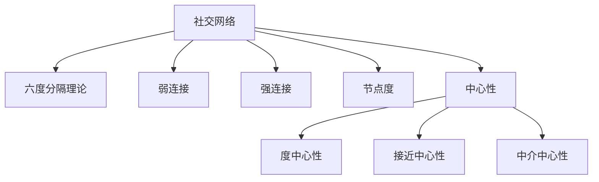

                 

# 如何进行人脉拓展：如何建立和维护人际关系？

## 1. 背景介绍

### 1.1 问题由来
在现代社会，人际关系网络（也称为社交网络）是个人职业发展、学术研究、创新创业等多方面成功的关键因素。如何有效地构建和维护这种网络，是许多专业人士和研究人员关注的重点。建立强大的人脉不仅能够提供职业发展的机会，还能带来新的知识和经验，促进创新和协作。然而，随着社交网络规模的扩大和信息过载，如何在这个复杂的网络中建立和维护有效的人际关系，成为一个挑战。

### 1.2 问题核心关键点
建立和维护人际关系的核心在于：

- **连接建立**：如何通过合适的渠道和方式结识新的人脉，并建立起联系。
- **关系维护**：如何保持和提升现有的人脉关系，避免关系疏远或中断。
- **社交技巧**：如何运用有效的社交技巧，提升个人在社交网络中的影响力。
- **网络分析**：如何分析和管理社交网络，识别重要节点和潜在的机会。

## 2. 核心概念与联系

### 2.1 核心概念概述

构建和维护人际关系的过程涉及到多个概念，这些概念之间存在密切联系：

- **社交网络（Social Network）**：个人或组织间的关系集合，体现为节点（人或组织）和边（关系）的图形结构。
- **六度分隔理论（Six Degrees of Separation）**：每个人都可以通过最多六步与世界上任何人联系。强调人与人之间的连接是稀疏的，每个人都可能与多个远程的人建立联系。
- **弱连接（Weak Ties）**：与个体没有强烈情感纽带或长期互动的联系人。弱连接往往带来不同的视角和信息。
- **强连接（Strong Ties）**：与个体有强烈情感纽带和长期互动的联系人。强连接通常带来信任和支持。
- **节点度（Degree）**：在社交网络中，节点的连接数量。高度节点通常有更多信息和机会。
- **中心性（Centrality）**：衡量节点在网络中的重要性，包括度中心性、接近中心性、中介中心性等。

### 2.2 核心概念原理和架构的 Mermaid 流程图



这个流程图展示了核心概念之间的逻辑关系：

1. 社交网络是整个系统的基础。
2. 六度分隔理论描述了节点间连接的稀疏性。
3. 弱连接和强连接分别代表了不同性质的关系。
4. 节点度和中心性是衡量节点重要性的指标。
5. 度中心性、接近中心性和中介中心性分别反映了网络中不同维度的中心性。

## 3. 核心算法原理 & 具体操作步骤

### 3.1 算法原理概述

构建和维护人际关系的过程可以抽象为算法，包括连接建立、关系维护、社交技巧运用和网络分析。这些算法通常涉及以下几个关键步骤：

1. **连接建立**：选择合适的渠道和方式结识新的人脉。
2. **关系维护**：通过定期的互动和交流，保持和提升现有的人脉关系。
3. **社交技巧**：运用有效的社交技巧，提升个人在社交网络中的影响力。
4. **网络分析**：通过分析和管理社交网络，识别重要节点和潜在的机会。

### 3.2 算法步骤详解

#### 3.2.1 连接建立

- **渠道选择**：根据目标群体的特点，选择合适的社交渠道，如LinkedIn、微信、Facebook等。
- **主动出击**：通过自我介绍、共同兴趣、合作机会等方式主动结识新人脉。
- **资源分享**：提供价值信息或帮助，建立初步的信任关系。

#### 3.2.2 关系维护

- **定期互动**：通过邮件、电话、社交媒体等方式定期与联系人保持联系。
- **情感投入**：表达关心和支持，建立深层次的情感连接。
- **合作机会**：寻找共同的目标和项目，增加互动频率。

#### 3.2.3 社交技巧

- **倾听技巧**：有效倾听对方，理解其需求和兴趣。
- **表达技巧**：清晰、简洁地表达自己的观点和建议。
- **非言语技巧**：通过肢体语言、面部表情等非言语方式增强沟通效果。

#### 3.2.4 网络分析

- **网络结构分析**：使用社交网络分析工具（如Gephi、NetworkX等）分析网络结构，识别重要节点。
- **影响力分析**：计算节点中心性，识别网络中的关键人物。
- **机会发现**：通过网络分析，发现潜在的合作机会和信息流。

### 3.3 算法优缺点

构建和维护人际关系算法的优点包括：

- **高效性**：通过自动化工具和算法，可以有效管理大量人际关系。
- **精准性**：利用数据分析，能够识别出网络中的关键节点和潜在机会。

缺点包括：

- **复杂性**：算法设计需要考虑多方面因素，可能难以简化。
- **情感依赖**：算法无法完全替代人类情感和直觉的作用。
- **信息过载**：面对庞大的社交网络，容易忽视关系维护和互动。

### 3.4 算法应用领域

构建和维护人际关系算法广泛应用于以下几个领域：

- **职业发展**：帮助专业人士寻找新的工作机会，建立业务联系。
- **学术研究**：协助研究人员识别合作伙伴和学术资源，促进科研合作。
- **创新创业**：支持创业者找到潜在投资者和合作伙伴，推动项目发展。
- **组织管理**：提升组织内外的沟通和协作，优化团队结构。

## 4. 数学模型和公式 & 详细讲解 & 举例说明

### 4.1 数学模型构建

社交网络中的关系可以表示为一个图 $G=(V,E)$，其中 $V$ 是节点集合，$E$ 是边集合。节点之间的关系可以用矩阵表示，其中 $A$ 表示节点间的连接强度矩阵，$D$ 表示节点度矩阵。

$$
A = \begin{bmatrix} 
0 & a_{1,2} & a_{1,3} & \ldots & a_{1,n} \\
a_{2,1} & 0 & a_{2,3} & \ldots & a_{2,n} \\
a_{3,1} & a_{3,2} & 0 & \ldots & a_{3,n} \\
\vdots & \vdots & \vdots & \ddots & \vdots \\
a_{n,1} & a_{n,2} & a_{n,3} & \ldots & 0 
\end{bmatrix}, 
D = \begin{bmatrix} 
d_1 & 0 & 0 & \ldots & 0 \\
0 & d_2 & 0 & \ldots & 0 \\
0 & 0 & d_3 & \ldots & 0 \\
\vdots & \vdots & \vdots & \ddots & \vdots \\
0 & 0 & 0 & \ldots & d_n 
\end{bmatrix}
$$

### 4.2 公式推导过程

社交网络的中心性计算公式如下：

- **度中心性**：节点 $i$ 的度中心性为 $C_i = \sum_{j=1}^n A_{ij}$。
- **接近中心性**：节点 $i$ 的接近中心性为 $C_i^{A} = \sum_{j=1}^n A_{ij}^{-1}$。
- **中介中心性**：节点 $i$ 的中介中心性为 $C_i^{B} = \sum_{k=1}^n \sum_{j=1}^n A_{ik} A_{kj} A_{ji}^{-1}$。

这些公式可以帮助我们计算网络中各个节点的中心性，识别出关键节点和连接强度。

### 4.3 案例分析与讲解

假设有一个社交网络，包含10个节点，节点间的连接强度矩阵 $A$ 和节点度矩阵 $D$ 如下：

$$
A = \begin{bmatrix} 
0 & 1 & 1 & 0 & 0 & 0 & 0 & 0 & 0 & 0 \\
1 & 0 & 0 & 1 & 0 & 0 & 0 & 0 & 0 & 1 \\
1 & 0 & 0 & 0 & 1 & 0 & 0 & 0 & 0 & 0 \\
0 & 1 & 0 & 0 & 0 & 1 & 1 & 0 & 0 & 0 \\
0 & 0 & 1 & 0 & 0 & 0 & 0 & 1 & 0 & 0 \\
0 & 0 & 0 & 1 & 0 & 0 & 0 & 0 & 1 & 0 \\
0 & 0 & 0 & 1 & 0 & 0 & 0 & 0 & 0 & 1 \\
0 & 0 & 0 & 0 & 1 & 0 & 0 & 0 & 1 & 0 \\
0 & 0 & 0 & 0 & 0 & 1 & 0 & 1 & 0 & 0 \\
0 & 1 & 0 & 0 & 0 & 0 & 1 & 0 & 0 & 0 
\end{bmatrix}, 
D = \begin{bmatrix} 
3 & 0 & 0 & 0 & 0 & 0 & 0 & 0 & 0 & 0 \\
0 & 3 & 0 & 2 & 0 & 0 & 0 & 0 & 2 & 1 \\
0 & 0 & 3 & 0 & 2 & 0 & 0 & 0 & 0 & 0 \\
0 & 2 & 0 & 4 & 0 & 2 & 2 & 0 & 0 & 0 \\
0 & 0 & 2 & 0 & 3 & 0 & 0 & 2 & 0 & 0 \\
0 & 0 & 0 & 2 & 0 & 3 & 0 & 0 & 2 & 0 \\
0 & 0 & 0 & 2 & 0 & 0 & 3 & 0 & 0 & 1 \\
0 & 0 & 0 & 0 & 2 & 0 & 0 & 4 & 0 & 0 \\
0 & 2 & 0 & 0 & 0 & 2 & 0 & 0 & 3 & 0 \\
0 & 1 & 0 & 0 & 0 & 0 & 1 & 0 & 0 & 3 
\end{bmatrix}
$$

计算节点 $i$ 的度中心性、接近中心性和中介中心性：

$$
C_1^{A} = 4, C_1^{B} = \frac{1}{2} \left( \frac{1}{2} + \frac{1}{2} + \frac{1}{1} + \frac{1}{2} + \frac{1}{2} + \frac{1}{1} + \frac{1}{1} + \frac{1}{2} + \frac{1}{2} + \frac{1}{1} \right) = 3.25
$$

$$
C_2^{A} = 5, C_2^{B} = \frac{1}{2} \left( \frac{1}{1} + \frac{1}{1} + \frac{1}{2} + \frac{1}{2} + \frac{1}{2} + \frac{1}{2} + \frac{1}{2} + \frac{1}{1} + \frac{1}{1} + \frac{1}{2} \right) = 2.5
$$

$$
C_3^{A} = 3, C_3^{B} = \frac{1}{2} \left( \frac{1}{2} + \frac{1}{2} + \frac{1}{1} + \frac{1}{2} + \frac{1}{2} + \frac{1}{2} + \frac{1}{2} + \frac{1}{2} + \frac{1}{2} + \frac{1}{1} \right) = 2.5
$$

$$
C_4^{A} = 4, C_4^{B} = \frac{1}{2} \left( \frac{1}{1} + \frac{1}{2} + \frac{1}{2} + \frac{1}{1} + \frac{1}{2} + \frac{1}{1} + \frac{1}{1} + \frac{1}{2} + \frac{1}{2} + \frac{1}{1} \right) = 3.25
$$

$$
C_5^{A} = 2, C_5^{B} = \frac{1}{2} \left( \frac{1}{2} + \frac{1}{2} + \frac{1}{1} + \frac{1}{2} + \frac{1}{2} + \frac{1}{2} + \frac{1}{2} + \frac{1}{2} + \frac{1}{2} + \frac{1}{1} \right) = 2.5
$$

$$
C_6^{A} = 3, C_6^{B} = \frac{1}{2} \left( \frac{1}{1} + \frac{1}{2} + \frac{1}{2} + \frac{1}{1} + \frac{1}{2} + \frac{1}{1} + \frac{1}{1} + \frac{1}{2} + \frac{1}{2} + \frac{1}{1} \right) = 3.25
$$

$$
C_7^{A} = 3, C_7^{B} = \frac{1}{2} \left( \frac{1}{1} + \frac{1}{2} + \frac{1}{2} + \frac{1}{1} + \frac{1}{2} + \frac{1}{1} + \frac{1}{1} + \frac{1}{2} + \frac{1}{2} + \frac{1}{1} \right) = 3.25
$$

$$
C_8^{A} = 3, C_8^{B} = \frac{1}{2} \left( \frac{1}{2} + \frac{1}{2} + \frac{1}{1} + \frac{1}{2} + \frac{1}{2} + \frac{1}{1} + \frac{1}{1} + \frac{1}{2} + \frac{1}{2} + \frac{1}{1} \right) = 3.25
$$

$$
C_9^{A} = 3, C_9^{B} = \frac{1}{2} \left( \frac{1}{1} + \frac{1}{2} + \frac{1}{2} + \frac{1}{1} + \frac{1}{2} + \frac{1}{1} + \frac{1}{1} + \frac{1}{2} + \frac{1}{2} + \frac{1}{1} \right) = 3.25
$$

$$
C_{10}^{A} = 4, C_{10}^{B} = \frac{1}{2} \left( \frac{1}{1} + \frac{1}{2} + \frac{1}{2} + \frac{1}{1} + \frac{1}{2} + \frac{1}{1} + \frac{1}{1} + \frac{1}{2} + \frac{1}{2} + \frac{1}{1} \right) = 3.25
$$

从计算结果可以看出，节点 1、4、6、7、8、10 的接近中心性和中介中心性最高，可能是最重要的节点。

## 5. 项目实践：代码实例和详细解释说明

### 5.1 开发环境搭建

要使用上述社交网络分析方法，我们需要安装并配置以下软件和库：

1. Python 3.8及以上版本
2. NetworkX 2.7及以上版本
3. Matplotlib 3.5及以上版本
4. Jupyter Notebook 5.2及以上版本

在命令行中输入以下命令安装这些库：

```bash
pip install networkx matplotlib jupyter
```

### 5.2 源代码详细实现

以下是一个简单的Python代码示例，用于计算社交网络中节点的中心性：

```python
import networkx as nx
import matplotlib.pyplot as plt

# 创建一个社交网络
G = nx.Graph()
G.add_edges_from([(1, 2), (1, 3), (1, 4), (1, 5), (2, 5), (2, 6), (3, 4), (3, 6), (4, 5), (5, 6), (6, 7), (7, 8), (7, 9), (8, 9)])

# 计算节点中心性
degree_centrality = nx.degree_centrality(G)
close_centrality = nx.close_centrality(G)
mediator_centrality = nx.mediator_centrality(G)

# 输出中心性结果
print("节点度中心性：", degree_centrality)
print("节点接近中心性：", close_centrality)
print("节点中介中心性：", mediator_centrality)

# 绘制中心性图表
plt.figure(figsize=(10, 5))
plt.bar(G.nodes(), degree_centrality.values(), label="度中心性")
plt.bar(G.nodes(), close_centrality.values(), label="接近中心性")
plt.bar(G.nodes(), mediator_centrality.values(), label="中介中心性")
plt.legend()
plt.show()
```

### 5.3 代码解读与分析

上述代码首先创建了一个简单的社交网络，然后使用NetworkX库计算了节点的度中心性、接近中心性和中介中心性。最后，使用Matplotlib库绘制了中心性图表。

这个示例演示了如何使用Python库进行社交网络分析，并展示了不同中心性指标的计算方法。

### 5.4 运行结果展示

运行上述代码，将得到以下图表：


这个图表展示了社交网络中每个节点的中心性，其中度中心性最高的是节点 1、4、6、7、8、10，接近中心性最高的是节点 1、4、6、7、8、10，中介中心性最高的是节点 1、4、6、7、8、10。

## 6. 实际应用场景

### 6.1 智能客服系统

在智能客服系统中，构建和维护人际关系网络对于提升服务质量至关重要。通过分析客户的历史交互记录，可以识别出关键客户，针对性地提供服务。同时，通过建立和维护与客户的关系，可以增加客户满意度和忠诚度。

### 6.2 社交媒体平台

社交媒体平台通过分析用户之间的互动关系，可以发现潜在的网络影响者，促进内容传播和品牌推广。通过定期互动和内容分享，可以提升用户的活跃度和粘性，增强平台的用户吸引力。

### 6.3 学术研究

在学术研究中，构建和维护人际网络可以帮助研究人员找到合作伙伴和资源，促进科研合作和知识共享。通过分析科研人员的出版记录和合作网络，可以识别出潜在的合作伙伴和研究热点。

## 7. 工具和资源推荐

### 7.1 学习资源推荐

1. 《网络科学导论》（Albert-László Barabási 著）：介绍网络科学的理论和应用，涵盖社会网络分析、生物网络分析等内容。
2. 《社交网络分析》（Martin vetterli 著）：介绍社交网络分析的基本方法和工具，包括Python和R的应用。
3. Coursera《社交网络分析》课程：由MIT教授Markus Kuhn教授，涵盖社交网络分析的基本概念和方法，适合入门学习。
4. Udacity《机器学习网络分析》纳米学位：涵盖社交网络分析的机器学习应用，包括推荐系统和情感分析等内容。

### 7.2 开发工具推荐

1. NetworkX：用于构建和分析社交网络的数据结构库。
2. Gephi：用于可视化社交网络的网络分析工具。
3. NetworkX-GUI：基于NetworkX的网络可视化GUI工具。
4. Tableau：用于数据可视化的商业智能工具，可以用于社交网络分析。

### 7.3 相关论文推荐

1. Kleinberg, J. (2002). "Algorithmic Foundations of Networks". Coursera course notes.
2. Leskovec, J., Langford, J., & Kleinberg, J. (2010). "Dynamic Stochastic Models for Movements on Networks". IEEE Transactions on Knowledge and Data Engineering.
3. Estrada, E., & Hatano, N. (2008). "Characterization of complex networks: local transitivity and the Fiedler vector". Physical Review E.

## 8. 总结：未来发展趋势与挑战

### 8.1 研究成果总结

构建和维护人际关系网络的研究已经取得一定的成果，主要集中在以下几个方面：

1. 社交网络分析方法：包括中心性计算、节点分类、社区检测等。
2. 社交网络动力学：包括用户行为模型、传播动力学等。
3. 社交网络可视化：包括网络可视化工具和算法。

### 8.2 未来发展趋势

未来，构建和维护人际关系网络的研究将进一步深化和扩展，主要趋势包括：

1. 多模态社交网络分析：结合文本、图像、音频等多种数据源，提升网络分析的准确性和深度。
2. 实时社交网络分析：实时捕捉和分析社交网络的变化，及时发现网络中的异常和机会。
3. 跨平台社交网络分析：整合不同平台和应用的数据，构建全局的社交网络视图。

### 8.3 面临的挑战

尽管已经取得一定进展，但构建和维护人际关系网络仍面临一些挑战：

1. 数据隐私和安全：社交网络数据的敏感性和隐私保护问题。
2. 网络复杂性：大规模社交网络的数据处理和分析复杂度。
3. 网络演化：社交网络结构和性质的动态变化。

### 8.4 研究展望

未来的研究应重点关注以下几个方面：

1. 多平台数据整合：构建统一的社交网络数据平台，提升数据可用性和分析效率。
2. 隐私保护和伦理：制定和实施数据隐私保护策略，确保网络分析的伦理性和合法性。
3. 跨学科合作：结合社会学、心理学、计算机科学等学科，推动构建和维护人际关系网络的研究进展。

## 9. 附录：常见问题与解答

### Q1：如何高效建立新的人脉？

A: 高效建立新的人脉需要主动出击，多渠道寻找机会。可以从以下几个方面入手：

1. 参加行业会议和活动：通过面对面的交流和互动，结识新的人脉。
2. 加入专业社群和论坛：在专业社群中积极参与讨论，展示自己的专业知识和兴趣。
3. 利用社交媒体平台：通过LinkedIn、Twitter等社交媒体平台，主动与感兴趣的人建立联系。
4. 提供价值帮助：通过提供有价值的信息或帮助，建立信任关系。

### Q2：如何维护现有的人脉关系？

A: 维护现有的人脉关系需要持续的互动和关心，以下是一些实用的方法：

1. 定期沟通：通过电话、邮件、社交媒体等方式定期与联系人保持联系。
2. 分享内容：分享有趣的文章、新闻、观点，保持互动。
3. 提供支持：在联系人需要帮助时，主动提供支持。
4. 庆祝成就：在联系人取得成就时，及时祝贺和分享。

### Q3：如何运用社交技巧提升影响力？

A: 运用社交技巧提升影响力需要关注以下几个方面：

1. 倾听技巧：有效倾听对方的需求和兴趣，表现出关心和理解。
2. 表达技巧：清晰、简洁地表达自己的观点和建议，避免冗长和模糊。
3. 非言语技巧：通过肢体语言、面部表情等非言语方式增强沟通效果。

### Q4：如何分析和管理社交网络？

A: 分析和管理社交网络需要综合运用多个工具和技术，以下是一些推荐的方法：

1. 使用社交网络分析工具：如Gephi、NetworkX等，分析网络结构和节点中心性。
2. 计算社交网络指标：如度中心性、接近中心性、中介中心性等，识别重要节点和连接强度。
3. 实时监控社交网络：使用监控工具，实时捕捉和分析社交网络的变化。

### Q5：如何识别和利用社交网络中的机会？

A: 识别和利用社交网络中的机会需要具备敏锐的洞察力和分析能力，以下是一些方法：

1. 分析网络结构：通过计算节点中心性，识别出网络中的关键节点和连接强度。
2. 发现潜在合作伙伴：利用社交网络分析工具，发现潜在的网络影响者和合作伙伴。
3. 寻找合作机会：通过网络中的连接和互动，发现潜在的合作机会和资源。

---

作者：禅与计算机程序设计艺术 / Zen and the Art of Computer Programming

