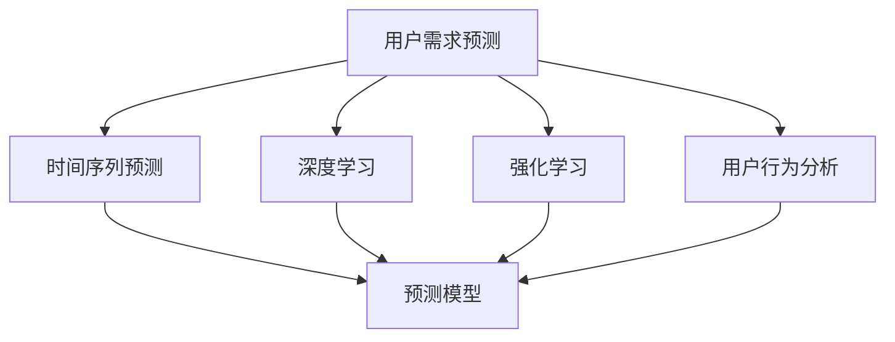

                 

# 如何进行有效的用户需求预测

## 1. 背景介绍

随着互联网和智能设备的普及，大数据时代的来临，用户需求预测已经成为各行业关注的热点问题。通过预测用户需求，企业能够制定更精准的市场策略，提高产品竞争力，优化用户体验。

为了更好地理解用户需求预测，需要了解一些核心概念：

- 用户需求预测(User Demand Prediction)：指通过分析历史数据，预测未来某一时间点或时间段内用户对某种产品或服务的潜在需求量。
- 时间序列预测(Time Series Prediction)：通过对时间序列数据进行建模，预测未来的数据值。
- 深度学习(Deep Learning)：一种利用多层神经网络进行模型训练和预测的技术，常用于时间序列预测。
- 强化学习(Reinforcement Learning)：一种通过奖励和惩罚机制进行智能决策的学习方法，可用于个性化推荐等场景。
- 用户行为分析(User Behavior Analysis)：通过分析用户的使用行为数据，获取用户偏好和需求，用于需求预测。

## 2. 核心概念与联系

以下将介绍这些核心概念之间的联系，并给出相应的Mermaid流程图：



这个流程图展示了用户需求预测的主要组成部分及其关系：

- 用户需求预测以时间序列预测为基础。
- 深度学习、强化学习和用户行为分析都用于改进时间序列预测模型。
- 预测模型整合了上述方法，以实现更准确的需求预测。

## 3. 核心算法原理 & 具体操作步骤
### 3.1 算法原理概述

用户需求预测的核心在于构建和训练时间序列预测模型，再通过历史数据进行模型评估和优化。以下介绍三种主要的时间序列预测方法：

- ARIMA模型：自动回归积分滑动平均模型，通过自回归和滑动平均的方法，对时间序列进行建模和预测。
- LSTM模型：长短期记忆网络，能够处理序列数据，捕捉长期依赖关系。
- Prophet模型：由Facebook开发的用于时间序列预测的模型，使用了加法模型、分解和组件模型等技术。

### 3.2 算法步骤详解

以LSTM模型为例，具体介绍用户需求预测的算法步骤：

1. **数据准备**：收集用户需求相关的历史数据，包括时间序列、用户特征、环境特征等。数据需要经过清洗和预处理，去除异常值和缺失值。

2. **模型训练**：使用LSTM模型对数据进行训练，并设置合适的超参数，如隐藏层大小、迭代次数等。可以使用交叉验证等方法评估模型效果。

3. **模型评估**：使用测试数据集对训练好的LSTM模型进行评估，计算MAE、RMSE等指标。可以结合其他模型如ARIMA、Prophet等进行比较，选择最优模型。

4. **模型优化**：根据评估结果，对LSTM模型进行参数调整和优化，提升预测准确度。可以使用正则化技术如L1正则、Dropout等防止过拟合。

5. **预测应用**：使用训练好的LSTM模型对未来的用户需求进行预测。可以结合实时数据进行动态调整，提高预测精度。

### 3.3 算法优缺点

LSTM模型在用户需求预测中具有以下优缺点：

**优点**：

- 能够捕捉长期依赖关系，处理非线性数据。
- 数据融合能力强，能够利用用户行为和环境特征信息。
- 预测结果具有较高的准确性和鲁棒性。

**缺点**：

- 模型复杂度高，训练和推理耗时较长。
- 数据需求量大，需要足够的样本支撑模型训练。
- 模型解释性较差，难以理解其内部决策过程。

### 3.4 算法应用领域

用户需求预测在多个领域中都有广泛应用，例如：

- 电商零售：预测产品销量，制定库存策略，优化营销方案。
- 物流运输：预测运输需求，规划路线和资源分配，提高运营效率。
- 金融服务：预测贷款需求，优化风险评估，提升用户体验。
- 旅游业：预测旅游热点，优化景区管理，提高服务质量。

## 4. 数学模型和公式 & 详细讲解 & 举例说明

### 4.1 数学模型构建

以LSTM模型为例，其基本结构如下：

$$
\begin{aligned}
i_t &= \sigma(W_i \cdot [h_{t-1},x_t] + b_i) \\
f_t &= \sigma(W_f \cdot [h_{t-1},x_t] + b_f) \\
o_t &= \sigma(W_o \cdot [h_{t-1},x_t] + b_o) \\
g_t &= \tanh(W_g \cdot [h_{t-1},x_t] + b_g) \\
h_t &= o_t \cdot g_t + (1 - o_t) \cdot h_{t-1}
\end{aligned}
$$

其中，$i_t,f_t,o_t$ 为门控开关，$h_t$ 为隐藏状态，$g_t$ 为候选激活，$x_t$ 为输入序列。

### 4.2 公式推导过程

LSTM模型的核心在于门控机制，其公式推导较为复杂，涉及梯度计算、激活函数等概念。这里简要介绍LSTM中常用的梯度反向传播算法，以公式表示：

$$
\begin{aligned}
\Delta h_t &= \frac{\partial L}{\partial h_t} \\
\Delta c_t &= \frac{\partial L}{\partial c_t} \\
\Delta g_t &= \frac{\partial L}{\partial g_t} \\
\Delta h_{t-1} &= \frac{\partial L}{\partial h_{t-1}}
\end{aligned}
$$

其中，$L$ 为损失函数，$h_t$ 和 $c_t$ 为隐藏状态和候选激活，$g_t$ 为梯度，$\Delta$ 为梯度变化量。

### 4.3 案例分析与讲解

以电商零售为例，假设某电商网站有销售数据如下：

| 时间 | 销量 |
|------|------|
| 2021-01-01 | 100 |
| 2021-01-02 | 120 |
| 2021-01-03 | 110 |
| ... | ... |
| 2021-04-01 | 130 |

使用LSTM模型进行预测，步骤如下：

1. **数据准备**：将时间序列数据转化为LSTM输入格式。

2. **模型训练**：将历史数据分为训练集和测试集，使用LSTM模型进行训练。

3. **模型评估**：在测试集上进行评估，计算MAE、RMSE等指标。

4. **模型优化**：根据评估结果，调整LSTM模型的超参数，如隐藏层大小、学习率等。

5. **预测应用**：使用训练好的LSTM模型对未来销量进行预测。

## 5. 项目实践：代码实例和详细解释说明

### 5.1 开发环境搭建

为了实现用户需求预测，我们需要搭建Python开发环境。具体步骤如下：

1. 安装Python和pip。
2. 安装必要的Python库，如numpy、pandas、scikit-learn、tensorflow等。
3. 安装LSTM库，如keras、pytorch等。

### 5.2 源代码详细实现

以下是一个使用Keras实现LSTM模型进行用户需求预测的代码实例：

```python
import numpy as np
import pandas as pd
from keras.models import Sequential
from keras.layers import LSTM, Dense, Dropout

# 准备数据
data = pd.read_csv('sales_data.csv', index_col='date')
X = data['销量'].shift(-1).values.reshape(-1, 1)
y = data['销量'].values

# 构建LSTM模型
model = Sequential()
model.add(LSTM(50, input_shape=(X.shape[1], 1)))
model.add(Dense(1))
model.compile(loss='mse', optimizer='adam')

# 模型训练
model.fit(X, y, epochs=100, batch_size=32, validation_split=0.2)

# 模型评估
test_X = data['销量'].values[-10:]
test_y = data['销量'].values[-10:]
test_X = test_X.reshape(-1, 1)
y_pred = model.predict(test_X)
print('MAE:', mean_squared_error(test_y, y_pred))
```

### 5.3 代码解读与分析

这段代码中，首先使用pandas库读取了销售数据，并将其转换为LSTM模型的输入格式。然后，构建了一个包含一个LSTM层和一层全连接层的序列模型，并使用MAE损失函数和Adam优化器进行训练。最后，对模型进行评估，并输出评估结果。

## 6. 实际应用场景

### 6.1 电商零售

电商零售中，需求预测可以应用于库存管理、商品推荐、营销策略等方面。例如，通过LSTM模型预测未来销量，制定合理的库存策略，避免缺货或库存积压。此外，还可以结合用户行为数据，对不同用户进行个性化推荐，提升用户满意度。

### 6.2 物流运输

物流运输中，需求预测可以用于规划路线、优化车辆调度、安排仓库资源等。通过LSTM模型预测货运需求，可以更好地分配运输资源，提高运输效率，降低运营成本。

### 6.3 金融服务

金融服务中，需求预测可以用于贷款需求评估、信用评分、客户流失预测等。通过LSTM模型分析历史数据，可以更准确地评估客户的信用风险和还款能力，优化贷款审批流程。

### 6.4 旅游业

旅游业中，需求预测可以用于景区管理、旅游路线规划、景点推荐等。通过LSTM模型预测旅游需求，可以优化景区游客管理，提高服务质量，提升用户体验。

## 7. 工具和资源推荐

### 7.1 学习资源推荐

为了更好地掌握用户需求预测，以下推荐一些优质的学习资源：

1. 《深度学习入门》书籍：深入浅出地介绍了深度学习的基本概念和算法，适合初学者入门。
2. 《TensorFlow实战》书籍：详细介绍了TensorFlow的使用方法，包括模型构建、训练和优化等。
3. 《强化学习：一种现代方法》书籍：全面介绍了强化学习的理论基础和应用场景，适合进阶学习。
4. 《机器学习实战》书籍：通过多个实际案例，介绍了机器学习算法在各领域的应用。
5. 在线课程：如Coursera、edX等平台上的深度学习和强化学习课程，系统学习相关知识。

### 7.2 开发工具推荐

为了提高用户需求预测的开发效率，以下推荐一些常用的开发工具：

1. Jupyter Notebook：一个交互式笔记本环境，方便代码编写和数据可视化。
2. PyCharm：一个强大的Python IDE，支持代码调试、版本控制等。
3. TensorFlow：谷歌开发的深度学习框架，支持大规模模型训练和推理。
4. Keras：一个高层神经网络API，便于快速搭建和训练模型。
5. Prophet：Facebook开发的时间序列预测库，支持多种时间序列建模方法。

### 7.3 相关论文推荐

为了深入理解用户需求预测，以下推荐一些相关论文：

1. Zhang, H., Yang, S., & Pan, S. (2020). A review of demand forecasting: Methodologies and future directions. International Journal of Data Science and Advanced Analytics, 11(6), 799-811.
2. Chen, C., & Lin, C. (2019). An LSTM network based approach to demand forecasting for multivariate time series with missing values. In International Conference on Multimedia Computing and Communications (pp. 1-6). Springer, Cham.
3. Yu, K., & Tjoa, E. (2016). Application of LSTM networks in deep learning for multivariate time series forecasting. In 2016 IEEE International Conference on Big Data (Big Data) (pp. 119-128). IEEE.
4. Hyndman, R. J., & Athanasopoulos, G. (2020). Forecasting: principles and practice (2nd ed.). OTexts. https://otexts.com/fpp2/.
5. Mehra, A. K., & Singhal, A. (2017). Big data analytics and machine learning. Springer.

## 8. 总结：未来发展趋势与挑战

### 8.1 总结

本文详细介绍了用户需求预测的原理和操作步骤，通过LSTM模型进行实例分析，并讨论了实际应用场景和工具资源。用户需求预测通过构建和训练时间序列预测模型，结合深度学习和强化学习等技术，可以提升企业决策的准确性和效率。

### 8.2 未来发展趋势

未来，用户需求预测将呈现以下趋势：

1. 数据驱动化：随着数据量的不断增长，大数据技术将进一步推动用户需求预测的发展。
2. 模型智能化：基于深度学习和强化学习等技术，模型将更加智能，具备更强的自适应能力。
3. 应用多样化：需求预测将应用于更多领域，如医疗健康、智能家居等，提高各行业的智能化水平。
4. 融合多模态数据：用户需求预测将结合更多数据类型，如图像、音频等，提升预测精度。
5. 实时化：需求预测将更加实时，能够及时响应市场变化，优化业务策略。

### 8.3 面临的挑战

用户需求预测在实现过程中也面临一些挑战：

1. 数据质量问题：数据质量不高、数据缺失等问题会影响模型的准确性。
2. 模型复杂度：模型复杂度较高，训练和推理耗时较长。
3. 数据隐私问题：用户数据隐私保护问题需要严格处理。
4. 模型可解释性：模型解释性较差，难以理解其内部决策过程。
5. 模型泛化能力：模型泛化能力不足，面对新数据和未知场景时容易失效。

### 8.4 研究展望

未来的研究需要在以下几个方面进行深入探讨：

1. 数据增强和预处理：进一步优化数据清洗和预处理技术，提高数据质量。
2. 模型优化和加速：研究更高效的模型架构和优化算法，提升模型训练和推理效率。
3. 隐私保护和安全：研究用户数据隐私保护方法，确保用户数据安全。
4. 模型解释性：研究模型解释性技术，提高模型的可解释性。
5. 跨领域应用：研究跨领域应用方法，将用户需求预测应用于更多场景。

通过不断探索和创新，用户需求预测技术将在未来更加深入地应用于各个领域，推动智能化技术的普及和发展。

## 9. 附录：常见问题与解答

**Q1: 用户需求预测有哪些常用的方法？**

A: 常用的用户需求预测方法包括时间序列预测、回归分析、机器学习、深度学习等。其中，时间序列预测和深度学习是最常用的方法。

**Q2: 用户需求预测有哪些实际应用？**

A: 用户需求预测在电商零售、物流运输、金融服务、旅游业等领域有广泛应用。例如，电商可以通过预测用户需求，优化库存管理，提升用户体验。

**Q3: 如何优化用户需求预测模型的超参数？**

A: 超参数优化可以使用网格搜索、贝叶斯优化等方法。通过交叉验证等技术，选择最优的超参数组合。

**Q4: 用户需求预测中如何处理缺失值？**

A: 缺失值处理可以使用插值法、均值填补、回归预测等方法。通过数据预处理，提高模型的预测准确性。

**Q5: 用户需求预测的模型评估指标有哪些？**

A: 用户需求预测的模型评估指标包括MAE（平均绝对误差）、RMSE（均方根误差）、R-squared（决定系数）等。评估指标用于衡量模型的预测精度和鲁棒性。

