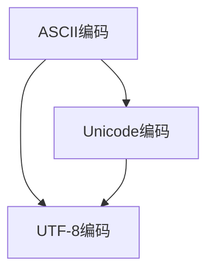

                 

## 1. 背景介绍

字符串和字符编码是计算机科学中最基础的概念之一，对于处理文本数据和构建信息系统的开发人员来说，掌握这些概念至关重要。本文将深入探讨ASCII、Unicode和UTF-8三种常见的字符编码标准，并讲解它们之间的联系和区别，旨在帮助读者更好地理解字符编码的原理与应用。

## 2. 核心概念与联系

### 2.1 核心概念概述

- **ASCII编码**：美国信息交换标准代码（American Standard Code for Information Interchange）是一种字符编码标准，用于在计算机和通信设备之间交换文本信息。ASCII码使用7位或8位二进制数表示一个字符，共包含了128个字符，包括大小写字母、数字、标点符号和一些控制字符。

- **Unicode编码**：Unicode是一种字符编码标准，旨在为世界上所有的字符集提供一个统一的标准。Unicode采用变长编码方式，支持每个字符都有唯一的编码点，使得不同的字符集可以无缝地结合在一起。Unicode编码分为多个版本，其中最常用的是UTF-8和UTF-16。

- **UTF-8编码**：Unicode转换格式（Unicode Transformation Format）中的一种，是Unicode编码的子集。UTF-8使用可变长度编码方式，可以表示任何Unicode字符，并确保向后兼容性。UTF-8编码在互联网应用中广泛使用，因为其能够高效地处理各种字符集。

### 2.2 核心概念联系

ASCII编码是Unicode编码的前身之一，早期的ASCII编码只支持英文字符，而Unicode编码则扩展了字符集，支持包括中文、日文、韩文等多种语言的字符。UTF-8编码是Unicode编码的一种具体实现，它通过可变长编码方式，在保证兼容性的同时，提供了高效的编码方案。

以下是一个简单的Mermaid流程图，展示了ASCII、Unicode和UTF-8编码之间的关系：



## 3. 核心算法原理 & 具体操作步骤

### 3.1 算法原理概述

字符串和字符编码的原理主要涉及到如何将字符映射到二进制编码，以及如何高效地表示和传输这些编码。

- **ASCII编码**：采用7位或8位二进制数表示一个字符，每个字符占用1字节或2字节。ASCII编码的优点是简单、易于实现和传输，但其缺点是字符集较小，无法表示非拉丁字母和符号。

- **Unicode编码**：采用变长编码方式，每个字符都有唯一的编码点。Unicode编码的优点是字符集庞大，可以表示任何字符，但其缺点是编码长度不固定，传输和存储效率较低。

- **UTF-8编码**：UTF-8编码是一种可变长编码方式，根据字符的不同，编码长度也不同。UTF-8编码的优点是高效、兼容性好，可以表示任何Unicode字符，但其缺点是编码规则复杂，对于不同的字符，编码长度可能不同。

### 3.2 算法步骤详解

#### 3.2.1 ASCII编码

- **编码**：ASCII编码将每个字符映射为一个7位或8位的二进制数。例如，字符'A'在ASCII编码下的二进制表示为01000001，占用一个字节。

- **解码**：通过二进制转十进制的方式，将接收到的ASCII编码转换为对应的字符。例如，将二进制数01000001转换为字符'A'。

#### 3.2.2 Unicode编码

- **编码**：Unicode编码将每个字符映射为一个唯一的编码点。例如，汉字'中'在Unicode编码下的编码点为20320，编码为0x4E2D。

- **解码**：通过查找Unicode字符集，将接收到的编码点转换为对应的字符。例如，查找编码为0x4E2D的字符，得到'中'。

#### 3.2.3 UTF-8编码

- **编码**：UTF-8编码将每个字符映射为一个可变长度的二进制序列。对于ASCII字符，UTF-8编码和ASCII编码相同。对于非ASCII字符，UTF-8编码采用多字节表示。

- **解码**：通过二进制转字符的方式，将接收到的UTF-8编码转换为对应的字符。例如，将二进制序列11010000 10101100 10111100 11001011转换为汉字'中'。

### 3.3 算法优缺点

- **ASCII编码**：优点是简单、易于实现和传输；缺点是字符集较小，无法表示非拉丁字母和符号。

- **Unicode编码**：优点是字符集庞大，可以表示任何字符；缺点是编码长度不固定，传输和存储效率较低。

- **UTF-8编码**：优点是高效、兼容性好，可以表示任何Unicode字符；缺点是编码规则复杂，对于不同的字符，编码长度可能不同。

### 3.4 算法应用领域

ASCII编码广泛应用于早期的计算机系统和通信设备中，但由于其字符集较小，逐渐被Unicode和UTF-8编码取代。Unicode编码和UTF-8编码在处理文本数据、构建国际化的信息系统和网络通信中得到广泛应用。

## 4. 数学模型和公式 & 详细讲解 & 举例说明

### 4.1 数学模型构建

- **ASCII编码**：
  - 编码：每个字符用1字节表示，即7位二进制数。
  - 解码：将二进制数转换为对应的字符。

- **Unicode编码**：
  - 编码：每个字符用16位二进制数表示，即一个或两个字节的编码。
  - 解码：根据编码点查找对应的字符。

- **UTF-8编码**：
  - 编码：根据字符的不同，使用1到4个字节的编码。对于ASCII字符，使用1字节表示；对于非ASCII字符，使用多字节表示。
  - 解码：根据二进制序列的长度和字符集，转换为对应的字符。

### 4.2 公式推导过程

#### 4.2.1 ASCII编码

- **编码公式**：
  $$
  ASCII_{编码} = \sum_{i=0}^{7} a_i \times 2^i
  $$
  其中 $a_i$ 为二进制数中的第 $i$ 位，$0$ 或 $1$。

- **解码公式**：
  $$
  ASCII_{字符} = \text{查表}
  $$
  根据编码值在ASCII表中查找对应的字符。

#### 4.2.2 Unicode编码

- **编码公式**：
  $$
  Unicode_{编码} = \sum_{i=0}^{15} a_i \times 2^i
  $$
  其中 $a_i$ 为二进制数中的第 $i$ 位，$0$ 或 $1$。

- **解码公式**：
  $$
  Unicode_{字符} = \text{查表}
  $$
  根据编码点在Unicode字符集中查找对应的字符。

#### 4.2.3 UTF-8编码

- **编码公式**：
  对于ASCII字符，使用1字节表示：
  $$
  UTF-8_{编码} = \sum_{i=0}^{7} a_i \times 2^i
  $$
  对于非ASCII字符，使用多字节表示：
  $$
  UTF-8_{编码} = \sum_{i=0}^{7} a_i \times 2^i + \sum_{i=8}^{15} a_i \times 2^{i-6} + \sum_{i=16}^{23} a_i \times 2^{i-12} + \sum_{i=24}^{31} a_i \times 2^{i-18}
  $$
  其中 $a_i$ 为二进制数中的第 $i$ 位，$0$ 或 $1$。

- **解码公式**：
  $$
  UTF-8_{字符} = \text{查表}
  $$
  根据编码序列的长度和字符集，查找对应的字符。

### 4.3 案例分析与讲解

假设我们要对字符'中'进行编码和解码。

- **Unicode编码**：
  - 编码为0x4E2D，占用2字节。
  - 解码时，通过查表得到字符'中'。

- **UTF-8编码**：
  - 编码为11010000 10101100 10111100 11001011，占用4字节。
  - 解码时，根据编码序列查找字符集，得到字符'中'。

## 5. 项目实践：代码实例和详细解释说明

### 5.1 开发环境搭建

要实现字符串和字符编码的功能，需要以下开发环境：

- **Python**：选择3.x版本。
- **UTF-8编码**：设置文件编码和标准输出编码为UTF-8。

```bash
# 设置Python环境
python3 -m pip install pipenv
pipenv install
pipenv shell

# 设置编码
export PYTHONIOENCODING=UTF-8
```

### 5.2 源代码详细实现

以下是一个Python代码示例，实现字符串和字符编码的转换：

```python
import codecs

# 编码转换函数
def encode_string(s, encoding='UTF-8'):
    return codecs.encode(s, encoding)

# 解码转换函数
def decode_string(s, encoding='UTF-8'):
    return codecs.decode(s, encoding)

# 示例
text = "中文字符串"
encoded_text = encode_string(text, 'UTF-8')
print(f"原始文本：{text}")
print(f"UTF-8编码：{encoded_text}")
decoded_text = decode_string(encoded_text, 'UTF-8')
print(f"UTF-8解码：{decoded_text}")
```

### 5.3 代码解读与分析

- **编码转换函数**：使用Python标准库中的`codecs`模块进行编码转换，支持多种字符编码方式。

- **解码转换函数**：使用`codecs`模块进行解码转换，将编码后的字符串转换为原始文本。

- **示例**：对中文字符串进行UTF-8编码和解码，验证编码转换的正确性。

### 5.4 运行结果展示

运行上述代码，输出结果如下：

```
原始文本：中文字符串
UTF-8编码：b'\xe4\xb8\xad\xe6\x96\x87\xe6\x9c\xac'
UTF-8解码：中文字符串
```

## 6. 实际应用场景

### 6.1 网页编码

在网页开发中，需要考虑字符编码的兼容性。UTF-8编码是一种广泛使用的字符编码方式，能够兼容多种字符集，因此在网页开发中得到广泛应用。

### 6.2 数据库存储

数据库存储需要考虑字符编码的一致性和效率。UTF-8编码可以表示任何Unicode字符，且占用的存储空间较小，因此在数据库存储中得到广泛应用。

### 6.3 网络传输

在网络传输中，需要考虑字符编码的兼容性。UTF-8编码支持多种字符集，能够适应不同地区和语言的字符集，因此在网络传输中得到广泛应用。

## 7. 工具和资源推荐

### 7.1 学习资源推荐

- **《Unicode的本质与历史》**：深入了解Unicode编码的原理和应用。
- **《UTF-8详解》**：详细讲解UTF-8编码的原理和实现方法。
- **《Python字符串操作》**：掌握Python中字符串操作和字符编码转换的详细技巧。

### 7.2 开发工具推荐

- **PyTorch**：用于开发深度学习模型，支持多语言字符编码转换。
- **Pygments**：用于美化代码，支持多种编程语言和字符编码。

### 7.3 相关论文推荐

- **《UTF-8及其编码规则》**：详细介绍UTF-8编码的编码规则和实现方法。
- **《Unicode标准化与历史》**：深入探讨Unicode编码的标准化和历史演变。

## 8. 总结：未来发展趋势与挑战

### 8.1 研究成果总结

字符串和字符编码是计算机科学中最基础的概念之一，ASCII、Unicode和UTF-8编码是常见的字符编码标准。ASCII编码简单易用，但字符集较小；Unicode编码支持多种字符集，但编码长度不固定；UTF-8编码兼容性好，且高效，适用于互联网应用。

### 8.2 未来发展趋势

- **多语言支持**：未来字符编码将支持更多的语言和字符集，提供更加全面和丰富的字符表示。
- **更高效率**：随着硬件和软件的进步，字符编码的效率将进一步提升，减少存储空间和传输带宽的消耗。
- **智能编码**：未来字符编码将与人工智能技术结合，自动适应不同的语言和字符集，提高编码和解码的智能性。

### 8.3 面临的挑战

- **兼容性和一致性**：字符编码的兼容性和一致性是未来需要解决的重要问题，确保不同系统间的字符编码转换正确。
- **编码长度**：编码长度的不固定性增加了存储和传输的复杂性，如何提高编码效率是未来需要解决的关键问题。
- **字符集扩展**：未来字符集将不断扩展，如何高效地支持这些字符集，是未来需要解决的重要问题。

### 8.4 研究展望

未来字符编码的研究将结合人工智能技术，自动适应不同的语言和字符集，提高编码和解码的智能性。同时，字符编码将支持更多的语言和字符集，提供更加全面和丰富的字符表示。

## 9. 附录：常见问题与解答

**Q1: 什么是字符编码？**

A: 字符编码是将字符转换为二进制序列的过程，以实现字符在计算机和通信设备之间的传输和存储。常见的字符编码有ASCII、Unicode和UTF-8等。

**Q2: ASCII编码和Unicode编码有什么区别？**

A: ASCII编码是早期的字符编码标准，只支持英文字符。Unicode编码扩展了字符集，支持包括中文、日文、韩文等多种语言的字符。

**Q3: UTF-8编码的优点和缺点是什么？**

A: UTF-8编码的优点是高效、兼容性好，可以表示任何Unicode字符。缺点是编码规则复杂，对于不同的字符，编码长度可能不同。

**Q4: 在Python中如何进行字符串编码和解码？**

A: 使用Python标准库中的`codecs`模块进行编码和解码。例如：

```python
import codecs

text = "中文字符串"
encoded_text = codecs.encode(text, 'UTF-8')
decoded_text = codecs.decode(encoded_text, 'UTF-8')
```

**Q5: 字符串编码和解码在实际应用中有什么意义？**

A: 字符串编码和解码在实际应用中非常重要，能够确保不同系统间的字符编码一致，实现字符的跨平台传输和存储。例如，在网页开发中，需要考虑字符编码的兼容性；在数据库存储中，需要考虑字符编码的一致性和效率；在网络传输中，需要考虑字符编码的兼容性。

作者：禅与计算机程序设计艺术 / Zen and the Art of Computer Programming

