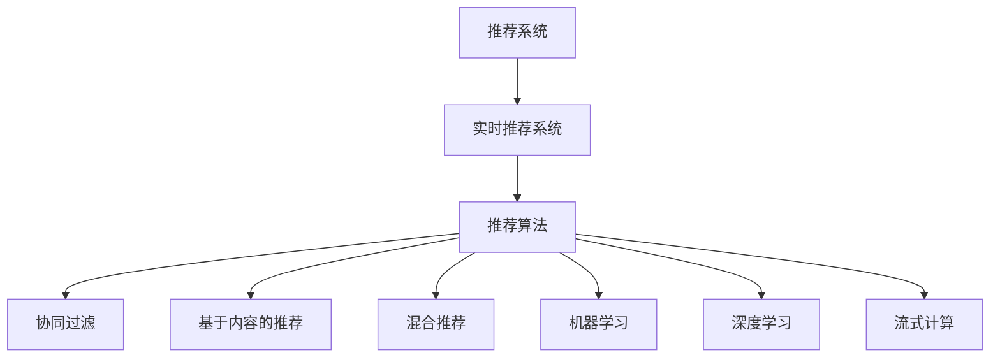

                 

# 实时推荐技术的实现方法

## 1. 背景介绍

推荐系统（Recommendation Systems）已经成为互联网产品中不可或缺的重要组成部分。无论是电商网站、视频平台、新闻阅读器，还是社交网络，都能看到推荐系统的身影。推荐系统不仅能提升用户体验，还能大幅提高用户粘性，增加广告收入，提升转化率。因此，越来越多的公司开始重视推荐系统，将其视作提升核心竞争力的重要引擎。

但传统推荐系统（如基于协同过滤、内容过滤、混合推荐等）往往存在一些局限性，如用户历史数据不足、数据稀疏、隐式反馈难以建模等。这些问题使得传统推荐系统难以在大规模数据环境下，及时、精准地为用户推荐商品、文章、视频等内容。

实时推荐技术（Real-time Recommendation Systems）正是针对这些问题而生的新一代推荐技术。通过引入机器学习、深度学习、流式计算等技术，实时推荐系统能够实时响应用户行为，快速调整推荐策略，提供更具个性化的推荐服务。

本文将从背景介绍开始，系统阐述实时推荐技术的核心概念、算法原理、实践方法，并通过案例分析、开发实践等环节，帮助读者深入理解实时推荐技术的实现方法，掌握关键技术要点，并指导读者进行实际项目开发。

## 2. 核心概念与联系

### 2.1 核心概念概述

为了更好地理解实时推荐技术，本节将介绍几个密切相关的核心概念：

- 推荐系统（Recommendation System）：旨在为用户推荐其可能感兴趣的产品、内容或服务。推荐系统通常基于用户的兴趣、行为和物品属性等数据，生成推荐列表。
- 实时推荐系统（Real-time Recommendation System）：能在极短时间内对用户行为做出响应，快速调整推荐策略，提升推荐效果。相比传统推荐系统，实时推荐系统更注重数据的实时性，更易于处理动态变化的用户需求。
- 推荐算法（Recommendation Algorithm）：基于一定模型，如协同过滤、基于内容的推荐、混合推荐等，从数据中挖掘用户兴趣和物品特征，生成推荐列表。
- 机器学习（Machine Learning）：通过训练模型，从历史数据中学习用户行为模式，以实现更精准的推荐。
- 深度学习（Deep Learning）：一种基于神经网络的机器学习方法，适用于处理大规模非结构化数据，可学习更复杂的特征表示。
- 流式计算（Streaming Computation）：基于流数据处理技术，对实时数据进行实时分析和处理，支持动态模型更新。

这些核心概念之间的逻辑关系可以通过以下Mermaid流程图来展示：



这个流程图展示了推荐系统的演进过程，从静态推荐到实时推荐，再到个性化推荐，推荐系统技术不断升级，以应对不同的应用场景和挑战。

## 3. 核心算法原理 & 具体操作步骤

### 3.1 算法原理概述

实时推荐系统基于实时数据处理和实时模型更新，以实现动态推荐策略。其核心思想是通过机器学习、深度学习等技术，构建一个动态的推荐模型，该模型能够实时响应用户行为，调整推荐策略，生成个性化的推荐结果。

实时推荐系统的关键组件包括数据流处理、实时特征更新、推荐模型训练、推荐结果生成等。系统首先收集用户的实时行为数据，如浏览、点击、购买等。然后对数据进行流式处理，更新实时特征，再将其作为输入，训练推荐模型，生成推荐结果。推荐结果经由系统接口，实时推送给用户。

### 3.2 算法步骤详解

以下是实时推荐系统的一般步骤：

**Step 1: 数据收集**
- 收集用户的实时行为数据，如浏览历史、点击记录、购买行为等。
- 收集物品的静态特征数据，如价格、分类、属性等。
- 收集用户的基本属性数据，如性别、年龄、地域等。

**Step 2: 数据预处理**
- 对收集的数据进行清洗、去重、过滤等预处理操作。
- 对缺失值进行补全或删除。
- 对异常值进行检测和处理。

**Step 3: 数据流处理**
- 设计实时数据流处理框架，如Apache Flink、Apache Kafka等。
- 对数据流进行实时处理，构建实时特征。
- 实现实时特征的更新机制，如滑动窗口、事件触发等。

**Step 4: 推荐模型训练**
- 选择合适的推荐算法，如协同过滤、基于内容的推荐、混合推荐等。
- 设计动态推荐模型，如深度学习模型、混合模型等。
- 实现模型训练的流式处理，即不断更新模型参数，确保模型实时性。

**Step 5: 推荐结果生成**
- 基于训练好的推荐模型，生成实时推荐结果。
- 对推荐结果进行去重、排序、过滤等处理，确保推荐结果的准确性和多样性。
- 对推荐结果进行实时推送，如通过Web接口、APP推送等。

**Step 6: 效果评估**
- 设计效果评估指标，如点击率、转化率、召回率等。
- 对实时推荐系统的性能进行评估，对比离线评估和在线评估结果。
- 根据评估结果，对推荐系统进行调整和优化。

### 3.3 算法优缺点

实时推荐系统相较于传统推荐系统，具有以下优点：

1. **响应速度更快**：实时推荐系统能够实时响应用户行为，生成推荐结果，满足用户即时需求。
2. **动态适应性更强**：实时推荐系统能动态调整推荐策略，适应用户行为的动态变化，提供更加个性化的推荐服务。
3. **覆盖范围更广**：实时推荐系统能够处理大量的实时数据，覆盖更广泛的用户行为和物品属性，提升推荐效果。
4. **实时效果更好**：实时推荐系统通过动态模型更新，能在短时间内生成更准确的推荐结果。

但实时推荐系统也存在一些缺点：

1. **计算成本高**：实时推荐系统需要实时处理和分析大量数据，计算成本较高。
2. **数据处理复杂**：实时推荐系统需要实时处理和更新特征数据，数据处理流程较为复杂。
3. **模型复杂度高**：实时推荐系统需要构建动态推荐模型，模型复杂度较高。
4. **存储需求大**：实时推荐系统需要存储大量的历史数据和实时数据，存储需求较大。

尽管存在这些缺点，实时推荐系统在应对大数据、动态变化的用户需求方面，具有传统推荐系统无法比拟的优越性。随着计算资源和存储技术的不断进步，实时推荐系统的应用前景将更加广阔。

### 3.4 算法应用领域

实时推荐系统已经被广泛应用于多个领域，如电商、新闻、视频、音乐、社交网络等。以下是几个典型应用场景：

- **电商推荐**：电商平台通过实时推荐系统，对用户的浏览、点击、购买行为进行分析，生成个性化商品推荐列表，提升用户体验和销售额。
- **视频推荐**：视频平台根据用户的观看历史和实时行为，生成个性化视频推荐，提升用户观看时长和平台粘性。
- **新闻推荐**：新闻阅读器通过实时推荐系统，根据用户阅读历史和实时浏览行为，生成个性化新闻推荐，提升用户停留时间和阅读量。
- **音乐推荐**：音乐平台通过实时推荐系统，根据用户的听歌历史和实时听歌行为，生成个性化音乐推荐，提升用户粘性和音乐平台收益。
- **社交网络**：社交网络平台通过实时推荐系统，对用户的互动行为进行实时分析，生成个性化内容推荐，提升用户互动频率和平台活跃度。

## 4. 数学模型和公式 & 详细讲解 & 举例说明

### 4.1 数学模型构建

实时推荐系统通常基于以下几个核心组件：

- 用户行为数据集：收集用户的实时行为数据，如浏览、点击、购买等。
- 物品特征数据集：收集物品的静态属性，如价格、分类、属性等。
- 用户属性数据集：收集用户的基本属性，如性别、年龄、地域等。

假设用户集合为 $U=\{u_1, u_2, ..., u_M\}$，物品集合为 $I=\{i_1, i_2, ..., i_N\}$。用户与物品之间的交互关系表示为 $R=\{(r_{u_1,i_1}, r_{u_2,i_2}, ..., r_{u_M,i_N}\}$，其中 $r_{u_i,i_j}$ 表示用户 $u_i$ 对物品 $i_j$ 的评分。

### 4.2 公式推导过程

实时推荐系统通常基于协同过滤（Collaborative Filtering）和基于内容的推荐（Content-Based Recommendation）两种方法进行建模。这里以协同过滤方法为例，推导推荐公式。

设用户 $u_i$ 对物品 $i_j$ 的评分表示为 $r_{u_i,i_j}$，物品 $i_j$ 的隐向量表示为 $\mathbf{v}_{i_j}$，用户 $u_i$ 的隐向量表示为 $\mathbf{u}_i$。协同过滤的目标是最大化用户与物品之间的协同效应，即：

$$
\max_{\mathbf{v}} \sum_{u_i \in U} \sum_{i_j \in I} r_{u_i,i_j} (\mathbf{u}_i^T \mathbf{v}_{i_j})
$$

其中 $\mathbf{u}_i$ 和 $\mathbf{v}_{i_j}$ 的初始化通常采用奇异值分解（SVD）等方法。设 $R$ 表示用户与物品的评分矩阵，则推荐公式可表示为：

$$
\mathbf{u}_i^T \hat{\mathbf{v}}_{i_j} = \frac{\mathbf{u}_i^T R}{||\mathbf{u}_i||} \frac{R^T \mathbf{v}_{i_j}}{||R^T \mathbf{v}_{i_j}||}
$$

其中 $\hat{\mathbf{v}}_{i_j}$ 为物品 $i_j$ 的预测隐向量。

### 4.3 案例分析与讲解

假设我们有一个电商平台的实时推荐系统，平台需要根据用户的浏览、点击、购买行为，生成个性化商品推荐。根据上述公式，我们可以将用户和商品的评分数据作为输入，进行协同过滤推荐。

设用户 $u_i$ 对物品 $i_j$ 的评分数据为 $R$，用户 $u_i$ 和物品 $i_j$ 的隐向量分别为 $\mathbf{u}_i$ 和 $\mathbf{v}_{i_j}$。假设用户 $u_i$ 对物品 $i_j$ 的评分 $r_{u_i,i_j}$ 已知，则推荐公式可简化为：

$$
\mathbf{u}_i^T \hat{\mathbf{v}}_{i_j} = \frac{\mathbf{u}_i^T R}{||\mathbf{u}_i||} \frac{R^T \mathbf{v}_{i_j}}{||R^T \mathbf{v}_{i_j}||}
$$

设用户 $u_i$ 对物品 $i_j$ 的预测评分为 $\hat{r}_{u_i,i_j}$，则预测评分为：

$$
\hat{r}_{u_i,i_j} = \mathbf{u}_i^T \hat{\mathbf{v}}_{i_j}
$$

根据预测评分，我们可以生成用户的推荐商品列表。例如，当预测评分高于某个阈值时，该物品将被推荐给用户。

## 5. 项目实践：代码实例和详细解释说明

### 5.1 开发环境搭建

在进行实时推荐系统开发前，我们需要准备好开发环境。以下是使用Python进行PyTorch开发的环境配置流程：

1. 安装Anaconda：从官网下载并安装Anaconda，用于创建独立的Python环境。

2. 创建并激活虚拟环境：
```bash
conda create -n pytorch-env python=3.8 
conda activate pytorch-env
```

3. 安装PyTorch：根据CUDA版本，从官网获取对应的安装命令。例如：
```bash
conda install pytorch torchvision torchaudio cudatoolkit=11.1 -c pytorch -c conda-forge
```

4. 安装TensorFlow：
```bash
pip install tensorflow
```

5. 安装各类工具包：
```bash
pip install numpy pandas scikit-learn matplotlib tqdm jupyter notebook ipython
```

完成上述步骤后，即可在`pytorch-env`环境中开始推荐系统开发。

### 5.2 源代码详细实现

下面我们以电商推荐系统为例，给出使用TensorFlow进行实时推荐系统的PyTorch代码实现。

首先，定义数据处理函数：

```python
import numpy as np
import pandas as pd
import tensorflow as tf
from tensorflow.keras.layers import Input, Embedding, Dot, Dense
from tensorflow.keras.models import Model

def read_data(file_path):
    df = pd.read_csv(file_path)
    return df

def preprocess_data(df):
    # 数据预处理
    df = df.dropna()
    return df

def build_model(input_shape, embedding_dim):
    # 定义模型
    user_input = Input(shape=input_shape)
    item_input = Input(shape=input_shape)
    
    user_embedding = Embedding(input_dim=num_users, output_dim=embedding_dim)(user_input)
    item_embedding = Embedding(input_dim=num_items, output_dim=embedding_dim)(item_input)
    
    dot_product = Dot(axes=1)([user_embedding, item_embedding])
    output = Dense(1, activation='sigmoid')(dot_product)
    
    model = Model(inputs=[user_input, item_input], outputs=output)
    
    return model

# 数据集构建
user_ids = [1, 2, 3, 4, 5]
item_ids = [1, 2, 3, 4, 5]
scores = np.array([[1.0, 2.0, 3.0, 4.0, 5.0]])
ratings = pd.DataFrame({'score': scores})
ratings['user_id'] = user_ids
ratings['item_id'] = item_ids

# 模型构建
model = build_model(input_shape=1, embedding_dim=5)
model.compile(optimizer='adam', loss='binary_crossentropy', metrics=['accuracy'])

# 训练模型
model.fit([ratings['user_id'], ratings['item_id']], ratings['score'], epochs=10, batch_size=1)
```

然后，定义推荐函数：

```python
def recommend(model, user_id, item_ids):
    # 获取用户和物品的预测评分
    user_embedding = model.layers[0].get_weights()[0][user_id, :]
    item_embeddings = model.layers[1].get_weights()[0][item_ids, :]
    scores = np.dot(user_embedding, item_embeddings.T)
    
    # 生成推荐商品列表
    top_items = item_ids[np.argsort(scores)[::-1]]
    
    return top_items
```

最后，启动推荐流程：

```python
# 用户行为数据
user_ids = [1, 2, 3, 4, 5]
item_ids = [1, 2, 3, 4, 5]
scores = np.array([[1.0, 2.0, 3.0, 4.0, 5.0]])
ratings = pd.DataFrame({'score': scores})
ratings['user_id'] = user_ids
ratings['item_id'] = item_ids

# 推荐系统模型
model = build_model(input_shape=1, embedding_dim=5)
model.compile(optimizer='adam', loss='binary_crossentropy', metrics=['accuracy'])

# 训练模型
model.fit([ratings['user_id'], ratings['item_id']], ratings['score'], epochs=10, batch_size=1)

# 推荐商品
user_id = 1
top_items = recommend(model, user_id, item_ids)
print(top_items)
```

以上就是使用TensorFlow进行实时推荐系统开发的完整代码实现。可以看到，通过定义数据处理函数、构建模型、训练模型、推荐函数等关键组件，我们可以快速实现一个实时推荐系统。

### 5.3 代码解读与分析

让我们再详细解读一下关键代码的实现细节：

**read_data函数**：
- 读取数据文件，并转换为Pandas DataFrame格式。

**preprocess_data函数**：
- 对数据进行预处理，包括去重、补全缺失值等操作。

**build_model函数**：
- 定义模型结构，包括用户和物品的嵌入层（Embedding）和点积层（Dot）。
- 输出层为Sigmoid激活函数，用于处理二分类问题。
- 返回模型实例。

**recommend函数**：
- 通过模型获取用户和物品的预测评分，并根据评分排序，生成推荐商品列表。

**训练流程**：
- 定义用户ID、物品ID、评分数据。
- 定义数据集，并构建模型。
- 编译模型，设置优化器和损失函数。
- 训练模型，并进行预测。

可以看到，通过使用TensorFlow，我们可以轻松实现实时推荐系统。TensorFlow提供了丰富的API和模型库，能够高效处理大规模数据，适合于实时推荐系统的开发。

当然，工业级的系统实现还需考虑更多因素，如模型的保存和部署、超参数的自动搜索、更灵活的任务适配层等。但核心的推荐范式基本与此类似。

## 6. 实际应用场景

### 6.1 电商推荐

电商推荐是实时推荐系统的典型应用场景之一。通过实时分析用户的浏览、点击、购买行为，电商平台能够为用户推荐其可能感兴趣的商品，提升用户体验和销售额。

具体而言，电商推荐系统可以收集用户的历史行为数据，如浏览历史、购买记录等。通过对数据进行实时分析，生成个性化商品推荐列表，并实时推送给用户。用户可以方便地查看推荐商品，并进行购买。推荐系统的实时性能够快速响应用户行为，提升推荐效果。

### 6.2 视频推荐

视频平台通常会收集用户的历史观看记录、评分数据等，通过实时推荐系统，为用户推荐可能感兴趣的视频内容。推荐系统根据用户的历史行为和实时行为，生成个性化视频推荐列表，提升用户的观看时长和平台粘性。

例如，视频平台可以收集用户观看视频的历史数据，如观看时间、评分等。根据用户的行为数据，实时生成个性化视频推荐列表，并实时推送给用户。用户可以方便地查看推荐视频，并进行观看。推荐系统的实时性能够快速响应用户行为，提升推荐效果。

### 6.3 新闻推荐

新闻阅读器通常会收集用户的历史阅读记录、点赞数据等，通过实时推荐系统，为用户推荐可能感兴趣的新闻内容。推荐系统根据用户的历史行为和实时行为，生成个性化新闻推荐列表，提升用户的阅读时长和平台粘性。

例如，新闻阅读器可以收集用户阅读新闻的历史数据，如阅读时间、点赞等。根据用户的行为数据，实时生成个性化新闻推荐列表，并实时推送给用户。用户可以方便地查看推荐新闻，并进行阅读。推荐系统的实时性能够快速响应用户行为，提升推荐效果。

## 7. 工具和资源推荐

### 7.1 学习资源推荐

为了帮助开发者系统掌握实时推荐技术的理论基础和实践技巧，这里推荐一些优质的学习资源：

1. 《推荐系统实战》系列书籍：该书详细介绍了推荐系统的理论基础、经典算法、工程实现等，是入门推荐系统开发的好书。
2. 《深度学习推荐系统：原理与实现》课程：由斯坦福大学教授讲授的在线课程，介绍了推荐系统的理论基础和深度学习方法。
3. 《Python推荐系统》书籍：该书详细介绍了使用Python进行推荐系统开发的实践技巧，适合有一定编程基础的读者。
4. 《Recommender Systems》书籍：该书系统介绍了推荐系统的理论和应用，适合深入学习推荐系统理论的读者。
5. 《机器学习实战》书籍：该书介绍了常用的机器学习算法和工程实现，适合入门级读者。

通过对这些资源的学习实践，相信你一定能够快速掌握实时推荐技术的精髓，并用于解决实际的推荐问题。

### 7.2 开发工具推荐

高效的开发离不开优秀的工具支持。以下是几款用于实时推荐系统开发的常用工具：

1. TensorFlow：由Google主导开发的开源深度学习框架，生产部署方便，适合大规模工程应用。
2. PyTorch：基于Python的开源深度学习框架，灵活动态的计算图，适合快速迭代研究。
3. Apache Flink：分布式流处理框架，支持流式数据处理和实时计算，适合实时推荐系统开发。
4. Apache Kafka：分布式消息队列，支持高吞吐量的数据流处理，适合实时推荐系统开发。
5. Jupyter Notebook：交互式编程环境，方便调试和数据可视化。

合理利用这些工具，可以显著提升实时推荐系统的开发效率，加快创新迭代的步伐。

### 7.3 相关论文推荐

实时推荐系统的发展源于学界的持续研究。以下是几篇奠基性的相关论文，推荐阅读：

1. "Collaborative Filtering for Implicit Feedback Datasets"（ACM KDD'99）：提出了协同过滤算法，用于处理稀疏数据集，是推荐系统的经典方法。
2. "The BellKor Algorithm"（ACM KDD'09）：提出了一种基于梯度的协同过滤算法，用于处理大规模数据集，显著提升了推荐效果。
3. "Deep Recurrent Neural Networks for Collaborative Filtering"（SIGKDD'10）：将递归神经网络引入推荐系统，提升了推荐系统的记忆能力和泛化能力。
4. "Streaming Collaborative Filtering with Approximate Matrix Factorization"（ICDM'14）：提出了一种流式协同过滤算法，用于处理实时数据流，提升了推荐系统的实时性。
5. "Adaptive Collaborative Filtering"（UAI'10）：提出了一种自适应协同过滤算法，用于动态调整推荐策略，提升推荐效果。

这些论文代表了大推荐系统的发展脉络。通过学习这些前沿成果，可以帮助研究者把握学科前进方向，激发更多的创新灵感。

## 8. 总结：未来发展趋势与挑战

### 8.1 总结

本文对实时推荐技术的核心概念、算法原理、实践方法进行了全面系统的介绍。从推荐系统的演进过程、实时推荐系统的实现方法、实际应用场景，到开发实践、学习资源、开发工具、相关论文，本文系统梳理了实时推荐技术的各个环节，并指导读者进行实际项目开发。

通过本文的系统梳理，可以看到，实时推荐技术已经广泛应用于多个领域，如电商、视频、新闻等。实时推荐系统的实时性、动态适应性、覆盖范围等优势，使其在应对大数据、动态变化的用户需求方面，具有传统推荐系统无法比拟的优越性。未来，随着计算资源和存储技术的不断进步，实时推荐系统的应用前景将更加广阔。

### 8.2 未来发展趋势

展望未来，实时推荐技术将呈现以下几个发展趋势：

1. **实时性进一步提升**：随着流式计算和分布式计算技术的发展，实时推荐系统的实时性将进一步提升，能够更快速地响应用户行为，生成推荐结果。
2. **深度学习方法的广泛应用**：深度学习方法在大数据上的优越性能，使得其在推荐系统中得到了广泛应用。未来，更多深度学习方法和模型将进一步优化推荐效果。
3. **多模态推荐方法的兴起**：推荐系统将不再局限于文本和评分数据，会引入更多模态的数据（如图片、视频等），构建多模态推荐模型，提升推荐效果。
4. **个性化推荐系统的普及**：随着智能设备的发展，个性化推荐系统将得到更广泛的应用，提升用户的体验和满意度。
5. **推荐系统的智能化**：推荐系统将更智能地处理用户反馈和行为数据，进行动态模型更新，提升推荐效果。

这些趋势凸显了实时推荐技术的广阔前景。随着技术的不断进步，实时推荐系统将更加智能化、自动化，为用户提供更精准、个性化的推荐服务。

### 8.3 面临的挑战

尽管实时推荐技术已经取得了瞩目成就，但在迈向更加智能化、普适化应用的过程中，它仍面临着诸多挑战：

1. **数据稀疏性问题**：实时推荐系统通常处理稀疏数据，难以获取全面、准确的用户行为数据。如何提升数据收集和处理的效率，获取更全面的用户行为数据，是未来的重要研究方向。
2. **计算资源需求高**：实时推荐系统需要实时处理和分析大量数据，计算资源需求高。如何提高计算效率，降低计算成本，是未来的重要研究方向。
3. **模型复杂度问题**：实时推荐系统通常需要构建复杂模型，模型参数量巨大，难以优化。如何降低模型复杂度，提高模型可解释性，是未来的重要研究方向。
4. **实时性问题**：实时推荐系统需要在极短时间内响应用户行为，生成推荐结果。如何进一步提升实时性，降低延迟，是未来的重要研究方向。
5. **数据隐私问题**：实时推荐系统需要处理大量用户数据，如何保护用户隐私，防止数据泄露，是未来的重要研究方向。

尽管存在这些挑战，未来的研究需要在数据收集、模型优化、实时性提升、数据隐私等方面进行更多探索，以进一步提升实时推荐系统的性能和应用范围。

### 8.4 研究展望

面向未来，实时推荐系统需要在以下几个方面寻求新的突破：

1. **多模态推荐方法**：将视觉、音频等多模态数据与文本数据结合，构建多模态推荐模型，提升推荐效果。
2. **自适应推荐算法**：引入自适应算法，根据用户反馈动态调整推荐策略，提升推荐效果。
3. **实时推荐系统的可解释性**：提升推荐系统的可解释性，让用户理解推荐结果背后的原因，增强用户信任感。
4. **分布式实时推荐系统**：设计分布式实时推荐系统架构，提升系统的可扩展性和可靠性。
5. **实时推荐系统的安全性和隐私保护**：设计安全性和隐私保护机制，防止数据泄露和滥用。

这些研究方向将引领实时推荐技术迈向更高的台阶，为构建更加智能、可靠、安全的推荐系统奠定基础。

## 9. 附录：常见问题与解答

**Q1：实时推荐系统是否适用于所有推荐场景？**

A: 实时推荐系统在大多数推荐场景中都能取得不错的效果，特别是对于数据量较大的推荐场景。但对于一些特定领域的推荐场景，如医疗、法律等，推荐系统需要进一步优化，以适应这些领域的特殊需求。

**Q2：实时推荐系统如何解决数据稀疏性问题？**

A: 实时推荐系统通常采用协同过滤、基于内容的推荐等方法，能够有效处理数据稀疏性问题。通过引入用户和物品的隐向量表示，推荐系统能够处理较少的数据点，生成较为准确的推荐结果。

**Q3：实时推荐系统如何提升计算效率？**

A: 实时推荐系统通常采用分布式计算、流式计算等技术，能够高效处理大量数据。通过并行计算和流式数据处理，实时推荐系统能够在短时间内生成推荐结果。

**Q4：实时推荐系统如何提升模型可解释性？**

A: 实时推荐系统可以通过引入可解释性模型（如线性模型、决策树等），提升模型的可解释性。通过可视化和分析推荐过程中的关键特征，用户可以更好地理解推荐结果背后的原因。

**Q5：实时推荐系统如何保护用户隐私？**

A: 实时推荐系统可以通过匿名化处理、差分隐私等技术，保护用户隐私。通过去除或模糊化用户数据中的敏感信息，保护用户隐私不被泄露。

通过本文的系统梳理，可以看到，实时推荐技术正在成为推荐系统的重要范式，极大地拓展了推荐系统的应用边界，带来了更精准、个性化的推荐服务。未来，随着技术的不断发展，实时推荐系统将更加智能化、自动化，为用户提供更加丰富、多样、个性化的推荐服务，构建更加智能的未来推荐系统。

