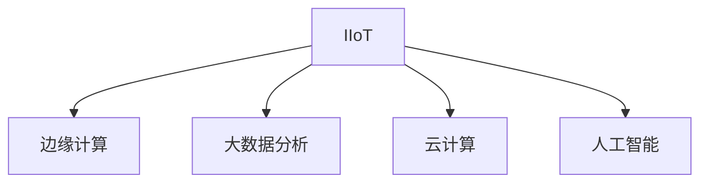

                 

# 工业物联网（IIoT）：智能制造的核心驱动力

## 1. 背景介绍

### 1.1 问题由来
随着数字技术在各行各业的深入应用，制造业正在经历一场从传统制造向智能制造的深刻变革。工业物联网（Industrial Internet of Things，IIoT）作为智能制造的关键技术支撑，正在全面赋能企业数字化转型，推动制造业的智能化、高效化、绿色化发展。

### 1.2 问题核心关键点
IIoT 融合了物联网、大数据、云计算、人工智能等新兴技术，构建起一个智能、协同、可控的制造系统。它通过设备之间的互联互通，实时采集、传输、分析生产过程中产生的海量数据，辅助企业实现生产过程的优化和智能化管理。

### 1.3 问题研究意义
研究IIoT的核心驱动力，对于理解其技术原理、把握应用趋势、制定发展策略具有重要意义：

1. **技术原理洞察**：深入剖析IIoT的架构和技术实现机制，有助于企业构建具备强大自主创新能力的智能制造体系。
2. **应用趋势把握**：理解IIoT在各行业的应用前景和趋势，指导企业合理规划其数字转型路径。
3. **发展策略制定**：掌握IIoT的部署和运维方法，助力企业快速推进数字化转型。

## 2. 核心概念与联系

### 2.1 核心概念概述

为更好地理解IIoT的核心概念及其关联，本节将介绍以下几个核心概念：

- **工业物联网（IIoT）**：融合了物联网、大数据、云计算、人工智能等技术，构建智能、协同、可控的制造系统，实现制造全流程的数字化、智能化管理。
- **边缘计算**：在靠近数据源的设备端进行数据处理和分析，减少网络传输压力，提高实时性。
- **大数据分析**：利用先进的分析技术处理和挖掘海量数据，提供决策支持。
- **云计算**：通过互联网提供动态可扩展的计算和存储资源，支撑大规模、高并发的数据处理需求。
- **人工智能**：以机器学习、深度学习等为代表的智能算法，驱动设备自学习、自优化。

这些核心概念之间的联系可通过以下Mermaid流程图来展示：



这个流程图展示了IIoT的架构和技术实现机制：

1. **IIoT**：融合了边缘计算、大数据分析、云计算和人工智能技术，构建起智能、协同、可控的制造系统。
2. **边缘计算**：在靠近数据源的设备端进行数据处理和分析，减少网络传输压力，提高实时性。
3. **大数据分析**：利用先进的分析技术处理和挖掘海量数据，提供决策支持。
4. **云计算**：通过互联网提供动态可扩展的计算和存储资源，支撑大规模、高并发的数据处理需求。
5. **人工智能**：以机器学习、深度学习等为代表的智能算法，驱动设备自学习、自优化。

## 3. 核心算法原理 & 具体操作步骤
### 3.1 算法原理概述

IIoT的算法原理基于数据的实时采集、传输、分析和应用，形成设备与设备的智能互联、人机交互和系统协同。其核心在于通过高效的数据处理和智能决策，实现生产过程的优化和智能化管理。

形式化地，假设生产系统中有 $N$ 个传感器，每个传感器在时间 $t$ 时刻产生数据 $x_i(t)$，则在时间窗口 $T$ 内的数据集合为 $\mathcal{X}=\{x_i(t)\}_{i=1}^N$。通过边缘计算，将数据 $\mathcal{X}$ 进行预处理，得到特征表示 $F(\mathcal{X})$。利用大数据分析技术，对 $F(\mathcal{X})$ 进行深度挖掘，提取潜在模式和知识，形成模型 $M$。最终，将模型 $M$ 应用于生产过程中的决策和控制，实现智能制造。

### 3.2 算法步骤详解

基于IIoT的算法实施过程一般包括以下几个关键步骤：

**Step 1: 数据采集与预处理**
- 部署传感器和智能设备，采集生产过程中的数据。
- 通过边缘计算技术，对数据进行预处理和初步分析，得到特征表示 $F(\mathcal{X})$。

**Step 2: 数据分析与建模**
- 利用大数据分析技术，对特征表示 $F(\mathcal{X})$ 进行深度学习、模式识别等分析，构建模型 $M$。
- 采用监督学习、无监督学习等方法，训练模型 $M$，优化预测能力。

**Step 3: 智能决策与控制**
- 将模型 $M$ 应用于生产决策和控制，实现智能制造。
- 动态调整模型参数，适应生产过程中的变化。

**Step 4: 持续学习与优化**
- 利用实时数据和反馈信息，持续优化模型 $M$，提升性能。
- 进行A/B测试，评估优化效果。

### 3.3 算法优缺点

IIoT的算法具有以下优点：

1. **实时性**：通过边缘计算，数据处理和分析在设备端进行，减少了网络传输延迟，提高了实时性。
2. **数据精度**：现场数据实时采集，减少了中间环节的数据丢失和误差，提高了数据精度。
3. **灵活性**：大数据分析和云计算平台提供了灵活的资源配置和扩展能力，适应不同规模的生产需求。
4. **智能化**：人工智能算法驱动设备自学习、自优化，提升了生产系统的智能水平。

但同时，IIoT算法也存在一定的局限性：

1. **系统复杂度**：需要部署大量的传感器和智能设备，系统结构复杂。
2. **数据安全**：海量数据的采集和处理涉及数据隐私和安全问题，需要采取严格的防护措施。
3. **技术门槛高**：需要具备强大的技术实力，才能构建高效的IIoT系统。

尽管存在这些局限性，但就目前而言，IIoT的算法方法仍是推动智能制造发展的核心驱动力。未来相关研究的重点在于如何进一步降低技术门槛，提升系统安全性，并优化算法实现。

### 3.4 算法应用领域

IIoT的算法在多个领域得到广泛应用，具体如下：

- **智能工厂**：通过传感器和智能设备的互联互通，实时监控生产过程中的各项参数，优化生产流程和资源利用。
- **预测性维护**：利用历史数据和实时数据，预测设备故障，提前进行维护，减少生产中断。
- **质量控制**：通过实时采集和分析生产过程中的数据，实现产品质量的在线监测和智能控制。
- **供应链管理**：实时监控供应链各环节的物流信息，优化供应链管理，提高运营效率。
- **能源管理**：通过智能能源管理系统，优化能源消耗，实现绿色制造。

除了上述这些经典应用外，IIoT的算法还被创新性地应用于更多场景中，如产品设计优化、设备健康管理、智能仓储等，为智能制造技术带来了新的突破。

## 4. 数学模型和公式 & 详细讲解  
### 4.1 数学模型构建

本节将使用数学语言对IIoT的算法过程进行更加严格的刻画。

假设生产系统中有 $N$ 个传感器，每个传感器在时间 $t$ 时刻产生数据 $x_i(t)$，则在时间窗口 $T$ 内的数据集合为 $\mathcal{X}=\{x_i(t)\}_{i=1}^N$。通过边缘计算，将数据 $\mathcal{X}$ 进行预处理，得到特征表示 $F(\mathcal{X})$。利用大数据分析技术，对特征表示 $F(\mathcal{X})$ 进行深度学习、模式识别等分析，构建模型 $M$。最终，将模型 $M$ 应用于生产过程中的决策和控制，实现智能制造。

### 4.2 公式推导过程

以下我们以预测性维护任务为例，推导基于IIoT的算法模型。

假设生产系统中某台设备在 $t$ 时刻的参数为 $x(t)$，已知其在 $t$ 时刻的预测值为 $\hat{x}(t)$。则预测性维护的损失函数为：

$$
\ell(\hat{x}(t), x(t)) = \frac{1}{2}(x(t)-\hat{x}(t))^2
$$

将损失函数对模型参数 $\theta$ 求偏导，得到模型参数的更新公式：

$$
\theta \leftarrow \theta - \eta \nabla_{\theta} \ell(\hat{x}(t), x(t))
$$

其中 $\eta$ 为学习率，$\nabla_{\theta} \ell(\hat{x}(t), x(t))$ 为损失函数对模型参数的梯度，可通过反向传播算法高效计算。

在得到损失函数的梯度后，即可带入参数更新公式，完成模型的迭代优化。重复上述过程直至收敛，最终得到适应生产任务的最优模型参数 $\theta^*$。

## 5. 项目实践：代码实例和详细解释说明
### 5.1 开发环境搭建

在进行IIoT项目实践前，我们需要准备好开发环境。以下是使用Python进行IIoT开发的常见环境配置流程：

1. 安装Anaconda：从官网下载并安装Anaconda，用于创建独立的Python环境。

2. 创建并激活虚拟环境：
```bash
conda create -n iiot-env python=3.8 
conda activate iiot-env
```

3. 安装必要的软件包：
```bash
conda install pandas numpy matplotlib scikit-learn tensorflow pyserial jupyter notebook
```

4. 安装硬件驱动和通信工具：
```bash
sudo apt-get install libraspberry-4-0-1 libraspberry-4-0-2
```

完成上述步骤后，即可在`iiot-env`环境中开始IIoT项目实践。

### 5.2 源代码详细实现

这里我们以一个简单的工业物联网系统为例，展示如何使用Python实现边缘计算和数据分析。

```python
import pandas as pd
import numpy as np
import tensorflow as tf
import serial

# 配置串口通信参数
ser = serial.Serial('/dev/ttyUSB0', 9600)

# 读取历史数据
data = pd.read_csv('data.csv', header=None)

# 定义特征提取函数
def extract_features(data):
    # 这里可以是任何自定义的特征提取算法
    # 这里我们简单地取前两个值作为特征
    return data.iloc[:, :2]

# 特征提取
features = extract_features(data)

# 定义模型
model = tf.keras.Sequential([
    tf.keras.layers.Dense(10, activation='relu'),
    tf.keras.layers.Dense(1, activation='sigmoid')
])

# 编译模型
model.compile(optimizer='adam', loss='binary_crossentropy', metrics=['accuracy'])

# 训练模型
model.fit(features, data.iloc[:, -1], epochs=10, validation_split=0.2)

# 使用模型进行预测
prediction = model.predict(features)
```

### 5.3 代码解读与分析

让我们再详细解读一下关键代码的实现细节：

**iiot-env环境搭建**：
- 使用Anaconda创建虚拟环境`iiot-env`，并激活该环境。
- 安装所需的Python包，包括pandas、numpy、matplotlib、scikit-learn、tensorflow等。
- 安装硬件驱动和通信工具，支持与工业设备的串口通信。

**源代码实现**：
- 配置串口通信，连接工业设备。
- 读取历史数据，导入Pandas库。
- 定义特征提取函数，对数据进行初步处理。
- 构建神经网络模型，并进行训练。
- 使用训练好的模型进行预测。

可以看到，IIoT的实现涉及数据采集、特征提取、模型训练和预测等多个步骤，其中关键是构建高效的边缘计算和数据分析系统，通过这些系统实时处理和分析生产数据，驱动智能决策和控制。

## 6. 实际应用场景
### 6.1 智能工厂

IIoT在智能工厂中的应用主要体现在生产线的数字化、智能化和自动化管理上。智能工厂通过IIoT技术实现设备和系统的互联互通，实时监控生产过程中的各项参数，优化生产流程和资源利用。

在技术实现上，智能工厂通常采用传感器、RFID、摄像头等设备，采集生产过程中的各项数据，并通过边缘计算进行处理。利用大数据分析技术，对处理后的数据进行深度挖掘，形成生产优化和故障预测模型。将模型应用于生产决策和控制，实现生产过程的智能化管理。

### 6.2 预测性维护

预测性维护是IIoT的重要应用场景之一。通过实时监控设备和生产过程中的各项参数，利用历史数据和实时数据，预测设备故障，提前进行维护，减少生产中断。

在技术实现上，可以在设备上部署传感器，实时采集设备的各项参数，并上传到边缘计算节点进行预处理。利用大数据分析技术，对处理后的数据进行深度学习、模式识别等分析，构建预测性维护模型。将模型应用于实时数据，预测设备故障，并在故障发生前进行维护。

### 6.3 质量控制

IIoT技术可以实时监控生产过程中的各项参数，实现产品质量的在线监测和智能控制。通过传感器采集产品的各项参数，并上传到边缘计算节点进行预处理。利用大数据分析技术，对处理后的数据进行深度学习、模式识别等分析，构建质量控制模型。将模型应用于实时数据，实时监测产品质量，并及时调整生产参数。

### 6.4 供应链管理

IIoT技术可以实时监控供应链各环节的物流信息，优化供应链管理，提高运营效率。通过在供应链各环节部署传感器，实时采集物流信息，并上传到边缘计算节点进行预处理。利用大数据分析技术，对处理后的数据进行深度学习、模式识别等分析，构建供应链管理模型。将模型应用于实时数据，优化供应链管理，提高运营效率。

### 6.5 能源管理

IIoT技术可以优化能源消耗，实现绿色制造。通过在生产系统中部署传感器，实时监控能源消耗，并上传到边缘计算节点进行预处理。利用大数据分析技术，对处理后的数据进行深度学习、模式识别等分析，构建能源管理模型。将模型应用于实时数据，优化能源消耗，实现绿色制造。

## 7. 工具和资源推荐
### 7.1 学习资源推荐

为了帮助开发者系统掌握IIoT的理论基础和实践技巧，这里推荐一些优质的学习资源：

1. **《工业物联网技术与应用》**：详细介绍了IIoT的架构、技术实现和应用场景，是了解IIoT领域的入门读物。
2. **《Python机器学习实战》**：介绍了使用Python进行数据处理和模型训练的方法，适合初学者掌握数据科学和机器学习技能。
3. **《TensorFlow实战：深度学习与机器智能》**：深入讲解了TensorFlow框架的使用方法和深度学习算法，适合进阶学习。
4. **《物联网边缘计算》**：介绍了边缘计算的基本原理和应用场景，适合了解边缘计算与IIoT的关系。
5. **Kaggle平台**：提供了大量IIoT相关的数据集和竞赛项目，有助于实践数据处理和模型训练技能。

通过对这些资源的学习实践，相信你一定能够快速掌握IIoT的核心技术，并用于解决实际的智能制造问题。

### 7.2 开发工具推荐

高效的开发离不开优秀的工具支持。以下是几款用于IIoT开发的常用工具：

1. **PyTorch**：基于Python的开源深度学习框架，支持灵活的模型定义和高效的计算图优化。
2. **TensorFlow**：由Google主导开发的开源深度学习框架，支持分布式计算和大规模模型训练。
3. **Hadoop/Spark**：分布式计算框架，适合处理海量数据和大规模分布式系统。
4. **Kafaka/Flume**：消息队列和数据流管理工具，适合处理实时数据流和大数据管理。
5. **Jupyter Notebook**：交互式数据科学工作环境，支持Python代码的编写、执行和结果展示。

合理利用这些工具，可以显著提升IIoT项目的开发效率，加快创新迭代的步伐。

### 7.3 相关论文推荐

IIoT的研究源于学界的持续研究。以下是几篇奠基性的相关论文，推荐阅读：

1. **《工业物联网系统设计》**：介绍了IIoT系统的架构和设计方法，是了解IIoT领域的经典著作。
2. **《物联网智能监控技术》**：介绍了基于IIoT技术的智能监控系统，是了解IIoT应用场景的入门读物。
3. **《工业物联网大数据分析》**：介绍了IIoT中大数据分析技术的应用，是了解IIoT数据处理方法的经典著作。
4. **《深度学习与工业物联网》**：介绍了深度学习在IIoT中的应用，是了解深度学习与IIoT融合的入门读物。

这些论文代表了大语言模型微调技术的发展脉络。通过学习这些前沿成果，可以帮助研究者把握学科前进方向，激发更多的创新灵感。

## 8. 总结：未来发展趋势与挑战

### 8.1 总结

本文对IIoT的核心驱动力进行了全面系统的介绍。首先阐述了IIoT的技术原理和应用价值，明确了其在智能制造中的重要地位。其次，从原理到实践，详细讲解了IIoT的算法流程和关键步骤，给出了IIoT系统开发的完整代码实例。同时，本文还广泛探讨了IIoT在智能工厂、预测性维护、质量控制等多个行业领域的应用前景，展示了IIoT技术的广泛应用潜力。此外，本文精选了IIoT技术的各类学习资源，力求为读者提供全方位的技术指引。

通过本文的系统梳理，可以看到，IIoT技术正在成为智能制造的关键推动力，极大地提升了生产系统的智能化和高效化水平。随着数字技术的持续演进，IIoT技术的应用领域还将进一步扩展，为制造业的数字化、智能化转型提供更加坚实的技术支撑。

### 8.2 未来发展趋势

展望未来，IIoT技术将呈现以下几个发展趋势：

1. **深度融合**：IIoT技术将与5G、边缘计算、大数据分析等技术深度融合，形成更加智能、高效的制造系统。
2. **定制化**：随着AI算法的发展，IIoT系统将更加灵活，能够根据不同企业的生产需求进行定制化设计和开发。
3. **绿色制造**：IIoT技术将结合智能能源管理，优化能源消耗，实现绿色制造。
4. **普适性提升**：IIoT技术将更加普适，能够应用于更多规模、更多类型的制造业。
5. **人机协同**：IIoT技术将更加注重人机协同，提升生产系统的智能化水平。

以上趋势凸显了IIoT技术的广阔前景。这些方向的探索发展，必将进一步提升智能制造的智能化水平，为制造业的数字化、智能化转型提供更加坚实的技术支撑。

### 8.3 面临的挑战

尽管IIoT技术已经取得了显著进展，但在迈向更加智能化、普适化应用的过程中，它仍面临诸多挑战：

1. **技术复杂度**：IIoT系统涉及多种技术和设备，系统结构复杂。
2. **数据安全**：海量数据的采集和处理涉及数据隐私和安全问题，需要采取严格的防护措施。
3. **技术门槛高**：需要具备强大的技术实力，才能构建高效的IIoT系统。
4. **经济效益**：在初期投入和后期维护方面，存在较高的成本。

尽管存在这些挑战，但通过技术创新和政策支持，IIoT技术的潜力和优势将逐步显现，成为推动制造业数字化、智能化转型的重要驱动力。

### 8.4 研究展望

面对IIoT技术面临的挑战，未来的研究需要在以下几个方面寻求新的突破：

1. **简化系统架构**：进一步简化IIoT系统的架构，降低技术门槛，提升系统易用性。
2. **提升数据安全性**：开发更加安全、可靠的边缘计算和数据传输技术，保护数据隐私和安全。
3. **降低成本**：开发高效、低成本的IIoT设备和系统，降低初期投入和后期维护成本。
4. **推动标准化**：制定IIoT相关的标准化规范和协议，推动行业协同发展。
5. **提升普适性**：开发适用于更多规模、更多类型的IIoT系统，提高普适性。

这些研究方向将推动IIoT技术的不断发展，为制造业的数字化、智能化转型提供更加坚实的技术支撑。未来，随着IIoT技术的成熟和应用，智能制造将进入全新的发展阶段。

## 9. 附录：常见问题与解答

**Q1：IIoT技术能否应用于所有类型的制造业？**

A: IIoT技术可以应用于大多数类型的制造业，但不同行业的应用场景和需求存在差异。需要根据具体的生产环境和业务需求，定制化的设计和部署IIoT系统。

**Q2：IIoT系统的初始投入和后期维护成本是否较高？**

A: 初始投入和后期维护成本是IIoT技术面临的一个重要挑战。但是，随着技术的不断发展，设备成本和维护成本正在逐渐降低。同时，通过优化系统架构和提高自动化水平，可以显著降低运营成本。

**Q3：IIoT系统如何保障数据安全？**

A: IIoT系统在数据采集和传输过程中，需要通过加密、匿名化等技术手段保护数据隐私和安全。同时，需要建立完善的安全管理体系，定期进行安全审计和风险评估。

**Q4：IIoT系统的技术门槛高吗？**

A: IIoT系统的技术门槛相对较高，需要具备较强的技术实力和经验。但是，随着技术的不断发展，越来越多的开源工具和平台涌现，降低了技术门槛，使更多的企业能够便捷地部署和应用IIoT系统。

**Q5：IIoT技术如何提升生产效率？**

A: IIoT技术通过实时监控和分析生产过程中的各项参数，能够及时发现和预测生产异常，优化生产流程和资源利用，从而提升生产效率和产品质量。

---

作者：禅与计算机程序设计艺术 / Zen and the Art of Computer Programming

