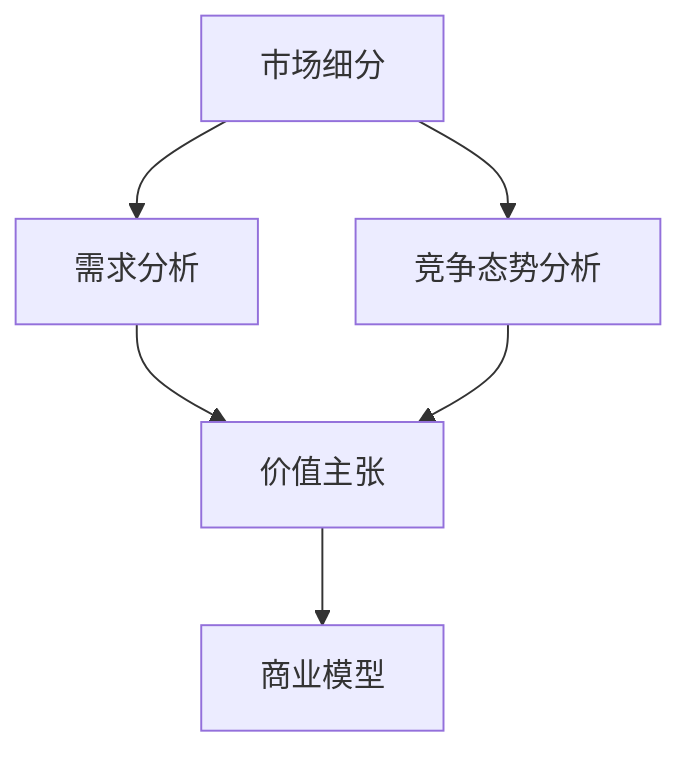

                 

# 市场分析框架：创业成功的指南

> 关键词：市场分析,创业,商业模型,价值主张,竞争分析,SWOT分析,精益创业,敏捷开发

## 1. 背景介绍

### 1.1 问题由来

创业，尤其是科技领域的创业，是一项充满挑战和机遇的旅程。从初期的创意灵感到最终的市场成功，创业者需要经过无数的考验。在这条路上，准确的市场分析和有效的商业模式设计是确保创业成功的关键。市场分析不仅帮助创业者理解市场机会，还指导他们制定战略，并作出明智的决策。本文将详细阐述一个全面的市场分析框架，旨在为初创企业提供一个清晰、系统的方法论，以提高其成功概率。

### 1.2 问题核心关键点

市场分析的核心在于理解目标市场的现状、需求、竞争态势以及未来趋势，从而找到商业机会，并制定出符合市场需求的商业模型。本文将围绕市场细分、需求分析、竞争态势分析、价值主张构建和商业模型验证等关键点展开讨论。

## 2. 核心概念与联系

### 2.1 核心概念概述

为更好地理解市场分析框架，本节将介绍几个关键概念：

- **市场细分（Market Segmentation）**：将市场划分为不同的细分市场，每个细分市场有特定的需求和特点。
- **需求分析（Demand Analysis）**：分析目标市场的需求，了解客户的需求、痛点和期望。
- **竞争态势分析（Competitive Landscape Analysis）**：评估市场中的主要竞争者及其市场地位、优势和劣势。
- **价值主张（Value Proposition）**：描述产品或服务为客户带来的具体价值和利益。
- **商业模型（Business Model）**：详细阐述企业如何创造、交付和捕获价值。

这些概念之间的逻辑关系可以通过以下Mermaid流程图来展示：



这个流程图展示了市场分析的关键步骤：首先根据市场细分找到目标市场，然后进行需求分析了解客户需求，接着评估竞争态势，进而构建价值主张，最后基于这些信息制定商业模型。

## 3. 核心算法原理 & 具体操作步骤

### 3.1 算法原理概述

市场分析的原理是基于数据驱动的洞察。通过对市场、客户和竞争环境的数据进行收集、整理和分析，市场分析框架帮助创业者识别市场机会，制定有效的商业策略。具体来说，算法原理包括以下几个步骤：

1. **数据收集**：收集关于市场、客户和竞争者的信息，包括市场规模、增长趋势、客户需求、竞争态势等。
2. **数据整理**：将收集到的数据进行整理，使其结构化和易于分析。
3. **数据分析**：运用统计学、数据挖掘等方法分析数据，发现市场趋势和客户需求。
4. **洞察生成**：根据数据分析结果，生成对市场机会和商业策略的洞察。

### 3.2 算法步骤详解

以下详细介绍市场分析的详细步骤：

#### 3.2.1 数据收集

数据收集是市场分析的基础，包括市场数据、客户数据和竞争数据。可以通过以下方式进行数据收集：

- **公开数据源**：如政府报告、行业协会发布的数据、市场研究公司的报告等。
- **客户调研**：通过问卷调查、访谈等方式直接从客户处获取信息。
- **竞争情报**：分析竞争对手的网站、社交媒体、公开报告等，了解其市场策略和产品特点。
- **内部数据**：企业内部的销售数据、客户反馈、市场活动记录等。

#### 3.2.2 数据整理

数据整理的目的是将收集到的数据结构化和标准化，以便于后续的分析。主要步骤如下：

- **清洗数据**：去除无关数据和异常值，确保数据的准确性和一致性。
- **分类归档**：根据数据类型和来源，将数据分类并归档，便于查找和管理。
- **数据可视化**：使用图表、仪表盘等工具可视化数据，帮助理解市场趋势和客户需求。

#### 3.2.3 数据分析

数据分析是市场分析的核心环节，主要采用以下方法：

- **描述性统计分析**：通过平均值、标准差、频数等统计量描述数据的基本特征。
- **回归分析**：探索变量之间的因果关系，预测市场趋势。
- **聚类分析**：将客户分成不同的群体，以便更好地了解不同客户群体的需求和行为。
- **关联规则挖掘**：发现不同变量之间的关联关系，例如客户购买行为与产品特性之间的关系。

#### 3.2.4 洞察生成

基于数据分析结果，生成对市场机会和商业策略的洞察，包括：

- **市场机会识别**：确定市场中的未满足需求和潜在机会。
- **客户需求分析**：深入了解客户的痛点、需求和期望，指导产品设计。
- **竞争分析**：评估主要竞争对手的市场地位、优势和劣势，找到差异化竞争策略。
- **价值主张构建**：明确产品或服务为客户带来的独特价值和利益，形成清晰的价值主张。

### 3.3 算法优缺点

市场分析框架的主要优点包括：

- **系统性**：通过系统化的步骤，帮助创业者全面理解市场和客户需求，避免遗漏重要信息。
- **数据驱动**：基于数据分析和实证研究，决策更具科学性和可操作性。
- **灵活性**：不同的市场环境和客户需求下，框架可以灵活调整，适应变化。

缺点主要包括：

- **复杂度**：数据收集和分析过程较为繁琐，需要投入大量时间和资源。
- **成本**：高质量的数据获取和专业分析可能需要高昂的成本。
- **动态变化**：市场环境和客户需求快速变化，市场分析需要持续更新和调整。

### 3.4 算法应用领域

市场分析框架适用于各类创业项目，特别是面向市场竞争激烈、客户需求多样的领域。具体应用领域包括但不限于：

- **科技创业**：如软件应用、互联网服务、人工智能等。
- **消费品创业**：如食品饮料、电子产品、时尚服饰等。
- **服务业创业**：如健康医疗、教育培训、旅游休闲等。
- **农业创业**：如智慧农业、精准农业、农产品电子商务等。
- **环保创业**：如可再生能源、清洁技术、环境监测等。

## 4. 数学模型和公式 & 详细讲解 & 举例说明（备注：数学公式请使用latex格式，latex嵌入文中独立段落使用 $$，段落内使用 $)
### 4.1 数学模型构建

市场分析的核心数学模型主要包括以下几个方面：

- **市场规模估计**：$M = \sum_{i=1}^{n} x_i$，其中 $x_i$ 为市场各细分市场的规模。
- **市场增长率预测**：$\text{growth rate} = \frac{M_{t+1} - M_t}{M_t}$，其中 $M_t$ 为时间 $t$ 的市场规模。
- **客户需求分析**：$D = \sum_{i=1}^{n} d_i$，其中 $d_i$ 为市场各细分市场的需求量。
- **竞争态势分析**：使用竞争分析工具，如Porter's Five Forces模型，评估市场的竞争环境。
- **价值主张评估**：$V = \sum_{i=1}^{n} v_i$，其中 $v_i$ 为客户从产品或服务中获得的价值。

### 4.2 公式推导过程

以市场规模估计为例，公式推导如下：

假设市场由 $n$ 个细分市场组成，每个市场的规模分别为 $x_i$，则整个市场的规模 $M$ 可以表示为：

$$
M = \sum_{i=1}^{n} x_i
$$

其中，$n$ 为市场细分数量，$x_i$ 为第 $i$ 个市场的规模。

### 4.3 案例分析与讲解

以一家新兴的智能家居创业公司为例：

- **数据收集**：通过市场调研和竞争情报，收集到智能家居市场的规模数据、主要竞争对手的市场份额、客户需求数据等。
- **数据整理**：将收集到的数据进行清洗和分类，构建客户需求表格和竞争态势矩阵。
- **数据分析**：通过回归分析预测未来市场规模，使用聚类分析将客户分为高端、中端、低端三个群体，并发现客户对智能家居设备的痛点和需求。
- **洞察生成**：基于分析结果，识别出市场的增长潜力，确定公司应聚焦于高端和中端市场，同时构建了差异化竞争的价值主张。

## 5. 项目实践：代码实例和详细解释说明
### 5.1 开发环境搭建

在进行市场分析实践前，我们需要准备好开发环境。以下是使用Python进行Pandas数据处理的环境配置流程：

1. 安装Anaconda：从官网下载并安装Anaconda，用于创建独立的Python环境。

2. 创建并激活虚拟环境：
```bash
conda create -n market-analysis-env python=3.8 
conda activate market-analysis-env
```

3. 安装Pandas：
```bash
conda install pandas
```

4. 安装各类工具包：
```bash
pip install numpy matplotlib seaborn matplotlib
```

完成上述步骤后，即可在`market-analysis-env`环境中开始市场分析实践。

### 5.2 源代码详细实现

以下是一个简单的市场分析代码实现，用于计算市场规模和增长率：

```python
import pandas as pd
import numpy as np
import matplotlib.pyplot as plt

# 加载市场规模数据
market_data = pd.read_csv('market_data.csv')

# 计算市场规模
market_sum = market_data['market_share'].sum()

# 计算市场增长率
market_growth = np.mean(market_data['market_growth_rate'])

# 绘制市场规模图
plt.figure(figsize=(10, 6))
plt.plot(market_data['time'], market_data['market_share'], label='Market Share')
plt.xlabel('Time')
plt.ylabel('Market Share')
plt.title('Market Share Over Time')
plt.legend()
plt.show()

# 输出市场规模和增长率
print(f'Total Market Size: {market_sum:.2f}')
print(f'Market Growth Rate: {market_growth:.2f}%')
```

### 5.3 代码解读与分析

让我们再详细解读一下关键代码的实现细节：

- **数据加载**：使用Pandas库的`read_csv`函数加载市场规模数据，数据源为`market_data.csv`文件。
- **市场规模计算**：使用`sum`函数计算市场规模总和，并打印输出。
- **市场增长率计算**：使用`mean`函数计算市场增长率的平均值，并打印输出。
- **数据可视化**：使用Matplotlib库绘制市场规模随时间变化的图表。
- **输出结果**：打印输出市场规模和增长率。

可以看到，Pandas和Matplotlib库使数据处理和可视化过程变得简洁高效。开发者可以将更多精力放在数据清洗、模型构建等高层逻辑上，而不必过多关注底层实现细节。

当然，工业级的系统实现还需考虑更多因素，如数据的动态更新、模型的多维度分析等。但核心的市场分析逻辑基本与此类似。

## 6. 实际应用场景
### 6.1 智能家居市场分析

以一家新兴的智能家居创业公司为例，通过市场分析框架进行深入的市场研究，可以更好地了解市场机会和客户需求。具体步骤如下：

1. **市场细分**：根据产品类型（如智能门锁、智能照明、智能安防等）将市场细分为多个细分市场。
2. **需求分析**：通过问卷调查和访谈，了解不同细分市场的客户需求、痛点和期望。
3. **竞争态势分析**：评估主要竞争对手的市场份额、产品特点和优势，找到差异化竞争策略。
4. **价值主张构建**：基于客户需求和竞争态势，构建差异化的价值主张，如智能家居设备的易用性、能耗低、高性价比等。
5. **商业模型设计**：根据市场需求和价值主张，设计出符合市场的商业模式，如订阅制、直销、线上线下结合等。

### 6.2 农业科技市场分析

农业科技创业项目，如智慧农业、精准农业，通过市场分析框架，可以更好地理解目标市场和客户需求，从而制定有效的市场策略。具体步骤如下：

1. **市场细分**：根据地理区域、作物类型、农业规模等将市场细分为多个细分市场。
2. **需求分析**：通过实地调研和农民访谈，了解不同细分市场的客户需求和痛点，如病虫害预测、土地利用优化、农产品销售等。
3. **竞争态势分析**：评估主要竞争对手的市场份额、产品特点和优势，找到差异化竞争策略。
4. **价值主张构建**：基于客户需求和竞争态势，构建差异化的价值主张，如精准农业的实时数据监测、精准施肥、病虫害预测等。
5. **商业模型设计**：根据市场需求和价值主张，设计出符合市场的商业模式，如B2B模式、B2C模式、合作社模式等。

## 7. 工具和资源推荐
### 7.1 学习资源推荐

为了帮助开发者系统掌握市场分析的理论基础和实践技巧，这里推荐一些优质的学习资源：

1. **《市场分析与管理》课程**：由知名高校开设的在线课程，涵盖市场细分、需求分析、竞争分析等核心内容。
2. **《市场分析实战》书籍**：由市场分析专家撰写，提供丰富的案例分析和实用技巧，帮助读者快速上手市场分析实践。
3. **Coursera《市场分析与数据科学》课程**：涵盖数据收集、数据清洗、数据分析等核心技术，适合初学者和中级用户。
4. **Kaggle市场分析比赛**：参加Kaggle的市场分析比赛，通过实际案例学习和掌握市场分析技能。
5. **MBA市场分析课程**：MBA课程中常见的市场分析模块，涵盖市场策略、竞争分析、品牌管理等重要内容。

通过对这些资源的学习实践，相信你一定能够快速掌握市场分析的精髓，并用于解决实际的创业问题。
###  7.2 开发工具推荐

高效的开发离不开优秀的工具支持。以下是几款用于市场分析开发的常用工具：

1. **Excel**：功能强大的数据处理工具，适合进行简单的市场数据分析和可视化。
2. **R语言**：开源的数据分析工具，提供丰富的数据处理和可视化库，如ggplot2、dplyr等。
3. **Python**：灵活的编程语言，适合进行复杂的数据处理和分析，Pandas和NumPy库非常实用。
4. **Tableau**：强大的数据可视化工具，支持复杂的数据分析和可视化，适合企业级使用。
5. **Google Analytics**：提供网站流量和用户行为的数据分析服务，适合进行市场活动和用户行为分析。

合理利用这些工具，可以显著提升市场分析任务的开发效率，加快创新迭代的步伐。

### 7.3 相关论文推荐

市场分析技术的发展源于学界的持续研究。以下是几篇奠基性的相关论文，推荐阅读：

1. **市场细分与数据挖掘**：介绍市场细分和数据挖掘的基础方法和应用实例。
2. **竞争分析的数学模型**：通过数学模型探讨竞争分析的方法和策略。
3. **价值主张构建与市场定位**：讨论价值主张的构建和市场定位的理论和方法。
4. **商业模型的设计原则**：阐述商业模型设计的关键原则和步骤。
5. **敏捷市场分析**：介绍敏捷市场分析的方法论和实践技巧。

这些论文代表了大数据技术在市场分析中的应用，提供丰富的理论和方法支持。

## 8. 总结：未来发展趋势与挑战

### 8.1 总结

本文对市场分析框架进行了全面系统的介绍。首先阐述了市场分析的理论基础和关键步骤，帮助创业者理解市场机会和客户需求，制定有效的商业策略。其次，通过具体的代码实例和案例分析，展示了市场分析的实际应用，验证了理论的有效性。

通过本文的系统梳理，可以看到，市场分析框架为创业者提供了一个全面的工具和方法论，帮助他们规避市场风险，抓住市场机遇，从而提高创业成功的概率。

### 8.2 未来发展趋势

展望未来，市场分析框架将呈现以下几个发展趋势：

1. **大数据与AI的结合**：随着大数据和AI技术的发展，市场分析将更加精准和自动化，大数据挖掘和AI预测将提供更全面的市场洞察。
2. **跨领域应用**：市场分析框架将逐步拓展到更多领域，如金融、医疗、教育等，提供多维度的市场分析服务。
3. **实时分析与决策支持**：市场分析将更加实时化，通过大数据流和AI模型，提供实时的市场数据支持和决策建议。
4. **用户个性化分析**：基于用户行为数据的市场分析，将为用户提供个性化的市场推荐和定制化服务。
5. **情感分析与舆情监测**：通过情感分析和舆情监测，市场分析将更好地理解客户情绪和市场动态，指导企业决策。
6. **全球化市场分析**：随着全球化的加深，市场分析框架将支持跨国市场的分析，帮助企业全球化战略的制定和执行。

以上趋势展示了市场分析框架的未来发展方向，它们将进一步提升市场分析的科学性和实用性，为企业的市场决策提供更坚实的依据。

### 8.3 面临的挑战

尽管市场分析框架已经取得了不小的进步，但在实际应用中也面临一些挑战：

1. **数据获取难度**：高质量的市场数据获取成本高、难度大，尤其是一些细分市场的市场数据难以获取。
2. **数据质量问题**：数据采集和清洗过程中可能存在噪音和偏差，影响分析结果的准确性。
3. **模型复杂性**：市场分析模型复杂，需要结合多个数据源和分析方法，需要高水平的技术能力。
4. **计算资源需求**：大数据和AI分析需要强大的计算资源支持，对硬件和算力要求较高。
5. **结果解读**：市场分析结果需要经过专业解读，才能转化为实际的商业决策，这需要大量的经验和技巧。

### 8.4 研究展望

面对市场分析面临的挑战，未来的研究需要在以下几个方面寻求新的突破：

1. **数据治理与质量管理**：建立完善的数据治理机制，确保数据采集和清洗过程的规范性和可靠性。
2. **智能数据处理与分析**：开发更智能的数据处理与分析算法，自动化数据清洗和特征工程，提高数据处理效率和分析准确性。
3. **模型简化与优化**：简化市场分析模型，提高模型的可解释性和实用性，降低计算资源需求。
4. **跨领域融合**：将市场分析与其他领域（如金融、医疗、教育等）的数据分析方法进行融合，提升多领域市场分析的深度和广度。
5. **实时与动态分析**：开发实时分析和动态更新的市场分析系统，提供实时的市场洞察和动态决策支持。
6. **个性化与定制化**：基于用户行为数据的市场分析，提供个性化的市场推荐和定制化服务，增强客户体验。

这些研究方向的探索，必将引领市场分析框架迈向更高的台阶，为企业的市场决策提供更坚实的理论基础和更高效的工具支持。总之，市场分析需要从数据治理、智能分析、模型优化等多方面持续改进，方能更好地适应快速变化的商业环境。

## 9. 附录：常见问题与解答

**Q1：市场分析框架适用于所有创业项目吗？**

A: 市场分析框架适用于大多数创业项目，特别是面向市场竞争激烈、客户需求多样的领域。但对于一些独特的、高度依赖定制化解决方案的项目，市场分析框架可能需要相应调整。

**Q2：市场分析的主要数据源有哪些？**

A: 市场分析的主要数据源包括：
1. 公开数据源：如政府报告、行业协会发布的数据、市场研究公司的报告等。
2. 客户调研：通过问卷调查、访谈等方式直接从客户处获取信息。
3. 竞争情报：分析竞争对手的网站、社交媒体、公开报告等，了解其市场策略和产品特点。
4. 内部数据：企业内部的销售数据、客户反馈、市场活动记录等。

**Q3：如何进行市场细分？**

A: 市场细分主要基于以下维度：
1. 地理区域：如北美、欧洲、亚洲等。
2. 行业类型：如科技、医疗、教育等。
3. 客户群体：如高净值客户、中小企业等。
4. 产品特性：如高端、中端、低端等。
5. 应用场景：如B2B、B2C、O2O等。

**Q4：如何构建价值主张？**

A: 构建价值主张需要明确以下几个方面：
1. 目标客户：明确产品或服务的目标客户群体。
2. 客户需求：深入了解目标客户的需求和痛点。
3. 竞争优势：分析竞争对手的产品或服务，找到差异化优势。
4. 核心价值：明确产品或服务为客户带来的核心价值和利益。

**Q5：如何评估市场机会？**

A: 评估市场机会主要包括以下几个步骤：
1. 市场规模分析：通过数据分析，估计市场的总规模和增长潜力。
2. 客户需求分析：了解目标客户的需求和痛点，确认市场机会。
3. 竞争态势分析：评估主要竞争对手的市场份额和优势，确认市场机会的可行性。
4. 机会验证：通过市场测试、客户调研等方式，验证市场机会的实际效果。

---

作者：禅与计算机程序设计艺术 / Zen and the Art of Computer Programming

