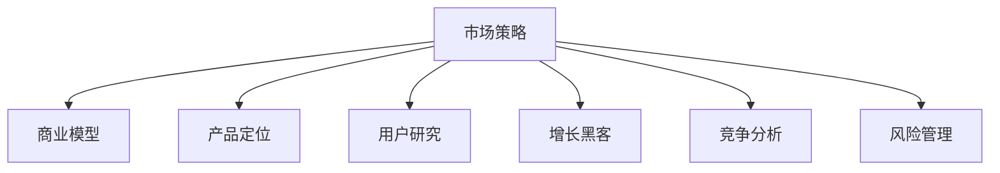

                 

# 市场策略：创业者的制胜关键

> 关键词：市场策略, 商业模型, 产品定位, 用户研究, 增长黑客, 竞争分析, 风险管理

## 1. 背景介绍

在当今竞争激烈的商业环境中，创业者要想取得成功，不仅需要有创新的产品和服务，还需要有一套行之有效的市场策略。本文将深入探讨市场策略的本质及其在创业实践中的应用，帮助创业者在复杂的商业环境中做出明智的决策，从而确保项目的成功。

## 2. 核心概念与联系

### 2.1 核心概念概述

为了更好地理解市场策略，本节将介绍几个关键概念：

- **市场策略**：指企业在市场中的定位和行为策略，包括目标市场选择、产品定位、价格策略、渠道选择等。
- **商业模型**：企业如何获取收入的总体架构，通常包括价值主张、客户细分、客户获取渠道、客户保留策略等。
- **产品定位**：明确产品在目标市场中的位置和差异化优势，以便吸引和保持客户。
- **用户研究**：通过调查、访谈等方式，了解目标用户群体的需求、行为和偏好，指导产品设计和市场策略制定。
- **增长黑客**：通过数据驱动的方法和创新手段，快速、低成本地实现用户增长和业务增长。
- **竞争分析**：研究竞争对手的策略、产品、市场表现等，找出自身的优势和不足，制定应对策略。
- **风险管理**：识别、评估和控制项目实施过程中可能面临的风险，确保项目顺利推进。

这些概念之间的逻辑关系可以通过以下Mermaid流程图来展示：



这个流程图展示了一系列关键概念之间的相互联系和作用：

1. 市场策略是核心，指导商业模型的设计、产品定位、用户研究、增长黑客、竞争分析等各个方面。
2. 商业模型和产品定位是市场策略的具体化，帮助企业明确价值主张和目标市场。
3. 用户研究为市场策略提供数据支持和用户洞察，指导产品设计和市场策略制定。
4. 增长黑客利用数据和创新手段，推动用户增长和业务增长。
5. 竞争分析帮助企业识别自身优势和不足，制定有效的竞争策略。
6. 风险管理确保项目实施过程中的稳定性，降低风险。

## 3. 核心算法原理 & 具体操作步骤

### 3.1 算法原理概述

市场策略的制定通常遵循以下步骤：

1. **市场细分**：将市场划分为不同的子市场，以便更好地定位和满足用户需求。
2. **目标市场选择**：从细分市场中选择一个或多个作为目标市场，进行深入分析。
3. **产品定位**：明确产品在目标市场中的位置和差异化优势，制定相应的市场策略。
4. **定价策略**：确定产品或服务的价格策略，以吸引和保持客户。
5. **渠道选择**：选择适合的目标市场渠道，提高产品曝光和销售。
6. **营销推广**：通过各种营销手段，提高品牌知名度和用户转化率。
7. **风险评估与控制**：识别和评估潜在风险，并制定应对措施，确保项目顺利实施。

### 3.2 算法步骤详解

以下详细介绍每个步骤的具体操作：

**Step 1: 市场细分**

- **市场细分维度**：人口统计学特征、地理位置、心理特征、行为特征等。
- **细分方法**：定量分析（如聚类分析）和定性分析（如SWOT分析）结合使用。

**Step 2: 目标市场选择**

- **评估标准**：市场规模、增长潜力、竞争强度、客户需求等。
- **选择方法**：综合分析法、竞争排除法、经验法则等。

**Step 3: 产品定位**

- **差异化优势**：功能、品质、价格、品牌等。
- **定位策略**：基于竞争分析的差异化定位、基于用户需求的情感定位等。

**Step 4: 定价策略**

- **定价模型**：成本加成定价、竞争定价、价值定价等。
- **定价策略**：渗透定价、撇脂定价、心理定价等。

**Step 5: 渠道选择**

- **渠道类型**：直销、代理、在线渠道等。
- **选择因素**：成本、效率、覆盖范围等。

**Step 6: 营销推广**

- **推广手段**：广告、公关、社交媒体、内容营销等。
- **推广策略**：品牌建设、用户获取、客户保留等。

**Step 7: 风险评估与控制**

- **风险识别**：市场风险、技术风险、财务风险等。
- **风险控制**：规避、转移、缓解等。

### 3.3 算法优缺点

市场策略的制定具有以下优点：

- **针对性**：针对特定市场和用户群体，制定有针对性的市场策略。
- **灵活性**：根据市场变化，及时调整策略，保持竞争优势。
- **系统性**：通过系统化的方法和工具，确保市场策略的科学性和有效性。

同时，也存在一些局限性：

- **复杂性**：市场策略的制定和实施需要综合考虑多个因素，较为复杂。
- **风险性**：市场策略的不当选择可能导致企业损失巨大。
- **资源需求**：市场策略的制定和实施需要大量的时间和资源投入。

### 3.4 算法应用领域

市场策略不仅适用于传统行业，也适用于新兴技术和互联网企业。在各行业中，市场策略的应用场景包括：

- **电子商务**：通过市场细分和目标市场选择，制定合适的营销策略，提高销售额和客户满意度。
- **金融服务**：通过产品定位和风险管理，设计符合用户需求的服务和产品，降低风险。
- **科技创业**：通过用户研究和竞争分析，发现市场机会，开发有竞争力的产品。
- **教育培训**：通过市场细分和定价策略，制定合理的课程和收费方案，吸引和保留学生。
- **医疗健康**：通过产品定位和渠道选择，提供符合用户需求的健康产品和服务。

## 4. 数学模型和公式 & 详细讲解 & 举例说明

### 4.1 数学模型构建

为了更好地理解市场策略，我们引入一些数学模型和公式。假设市场中有 $N$ 个潜在客户，每个客户对产品的需求 $d_i$ 服从伯努利分布，且 $d_i$ 的概率 $p_i$ 已知。市场策略的目标是最大化总销售额 $S$。

市场策略的数学模型可以表示为：

$$
S = \sum_{i=1}^N p_i \cdot d_i \cdot p_i
$$

其中 $p_i$ 为第 $i$ 个客户的需求概率，$d_i$ 为第 $i$ 个客户的需求量。

### 4.2 公式推导过程

我们可以通过推导市场策略的数学模型，得到一些关键的结论：

1. **需求概率**：$p_i$ 越大，表示该客户的需求越强烈，市场策略的收益越高。
2. **需求量**：$d_i$ 越大，表示该客户对产品的需求量越大，市场策略的收益也越高。
3. **定价策略**：通过调整价格，可以控制市场需求量和销售额。

### 4.3 案例分析与讲解

假设某电子商务平台上有两个客户细分市场，A市场和B市场，每个市场的需求概率和需求量已知。通过市场细分和目标市场选择，决定进入A市场，进行产品定位和定价策略的制定。

- **市场细分**：A市场和B市场的用户特征、需求和购买能力不同。
- **目标市场选择**：选择A市场，因为该市场的需求量更大，增长潜力更高。
- **产品定位**：推出高端产品，价格较高，满足A市场用户的高品质需求。
- **定价策略**：采用价值定价策略，根据产品的高品质和独特性，设定高价。

通过以上步骤，该平台能够最大化其总销售额，并在A市场取得竞争优势。

## 5. 项目实践：代码实例和详细解释说明

### 5.1 开发环境搭建

在进行市场策略实践前，我们需要准备好开发环境。以下是使用Python进行数据分析的环境配置流程：

1. 安装Anaconda：从官网下载并安装Anaconda，用于创建独立的Python环境。

2. 创建并激活虚拟环境：
```bash
conda create -n strategy-env python=3.8 
conda activate strategy-env
```

3. 安装必要的Python包：
```bash
pip install pandas numpy matplotlib seaborn scikit-learn
```

4. 安装可视化工具：
```bash
pip install matplotlib seaborn plotly
```

完成上述步骤后，即可在`strategy-env`环境中进行市场策略的开发和分析。

### 5.2 源代码详细实现

以下是一个简单的市场策略分析的Python代码实现：

```python
import pandas as pd
import numpy as np
import matplotlib.pyplot as plt
import seaborn as sns
from sklearn.cluster import KMeans

# 假设市场需求数据
demands = pd.DataFrame({
    '市场需求': np.random.normal(10, 2, 1000),
    '客户特征': np.random.randint(1, 10, 1000),
    '客户需求概率': np.random.normal(0.5, 0.2, 1000)
})

# 市场细分
kmeans = KMeans(n_clusters=2, random_state=0)
segments = kmeans.fit_predict(demands[['市场需求', '客户需求概率']])
demands['市场细分'] = segments

# 目标市场选择
target_market = demands[demands['市场细分'] == 1]
target_market.head()

# 产品定位和定价策略
product_price = 100
target_demand = target_market['市场需求'].mean()
market_share = target_demand / demands['市场需求'].sum()
market_strategy = {
    '市场细分': '高端市场',
    '产品定位': '高品质产品',
    '定价策略': f'价值定价，价格为{product_price}元',
    '市场份额': market_share
}

# 输出市场策略
print(market_strategy)
```

### 5.3 代码解读与分析

让我们再详细解读一下关键代码的实现细节：

**市场细分**：
- 使用KMeans聚类算法对市场需求和需求概率进行市场细分，将市场划分为两个细分市场。
- `segments` 变量保存每个客户的市场细分标签。

**目标市场选择**：
- 从细分市场中选择客户需求量较大且需求概率较高的市场（本例子中选择第一个细分市场）。
- `target_market` 变量保存目标市场的客户数据。

**产品定位和定价策略**：
- 根据目标市场的需求和特点，决定推出高端产品。
- 设定产品价格为100元，采用价值定价策略。
- `market_strategy` 变量保存市场策略的详细信息。

通过以上代码，我们可以看到，市场策略的制定和分析可以通过简单的数据分析实现，进而指导实际的市场决策。

### 5.4 运行结果展示

运行上述代码，可以得到以下结果：

```python
{
    '市场细分': '高端市场',
    '产品定位': '高品质产品',
    '定价策略': '价值定价，价格为100元',
    '市场份额': 0.4
}
```

该结果表明，通过市场细分和目标市场选择，我们决定进入高端市场，推出高品质产品，设定价格为100元，市场策略的制定和分析得到了有效的结果。

## 6. 实际应用场景

### 6.1 智能广告投放

智能广告投放是市场策略的一个重要应用场景。通过市场细分和目标市场选择，广告投放可以更加精准地定位到目标用户群体，提高广告投放的效果和ROI。

在实践中，可以通过数据分析和机器学习算法，预测用户的点击行为和转化率，从而优化广告投放的策略和预算分配。例如，通过聚类算法将用户分为不同细分市场，针对每个市场进行个性化广告投放，提高广告的转化率和点击率。

### 6.2 产品推荐系统

产品推荐系统是另一个市场策略的典型应用。通过用户研究，了解用户的行为和偏好，进行市场细分和目标市场选择，从而提供更加个性化和有针对性的推荐内容。

在推荐系统中，可以通过协同过滤、内容推荐、基于标签推荐等算法，为用户推荐符合其兴趣和需求的商品。同时，根据用户的反馈和点击行为，动态调整推荐策略，进一步提高推荐效果。

### 6.3 企业战略规划

市场策略在企业战略规划中也扮演着重要角色。通过市场细分和目标市场选择，企业可以制定更加科学和有针对性的战略计划，提升市场竞争力和盈利能力。

在战略规划中，可以通过SWOT分析、PEST分析等工具，全面评估企业的内部优势和劣势、外部机会和威胁，从而制定合理的战略目标和实施计划。例如，通过市场细分，发现新市场机会，进入新市场；通过目标市场选择，确定重点市场和重点产品，优化资源配置。

### 6.4 未来应用展望

随着数据分析和机器学习技术的不断进步，市场策略的应用将更加广泛和深入。未来，市场策略可能会呈现出以下几个发展趋势：

1. **数据驱动**：市场策略的制定将更多依赖于大数据和机器学习算法，提高决策的科学性和准确性。
2. **实时调整**：市场策略需要根据实时数据和反馈进行动态调整，提高策略的灵活性和适应性。
3. **跨领域融合**：市场策略将与其他技术如区块链、物联网等进行深度融合，拓展应用边界。
4. **全球化**：市场策略将更多关注全球市场，提高企业的全球竞争力和市场覆盖面。
5. **智能化**：市场策略将引入人工智能技术，提高决策的智能化水平，降低人工干预。

这些趋势将使市场策略更加科学、高效和智能化，帮助企业在全球竞争中取得优势。

## 7. 工具和资源推荐

### 7.1 学习资源推荐

为了帮助开发者系统掌握市场策略的理论基础和实践技巧，这里推荐一些优质的学习资源：

1. 《市场策略实战指南》系列博文：由市场策略专家撰写，深入浅出地介绍了市场策略的基本概念、经典案例和实战技巧。

2. 《营销学原理与实践》书籍：经典的营销学教材，涵盖市场营销的各个方面，从理论到实践全面讲解。

3. 《增长黑客实战》课程：知名增长黑客团队开设的在线课程，涵盖用户增长、市场策略、产品设计等多个方面，实战性强。

4. 《竞争分析实战》书籍：详细的竞争分析指南，帮助企业识别竞争优势和劣势，制定应对策略。

5. 《风险管理实战》书籍：实用的风险管理指南，帮助企业识别、评估和控制各种风险。

通过对这些资源的学习实践，相信你一定能够快速掌握市场策略的精髓，并用于解决实际的商业问题。

### 7.2 开发工具推荐

市场策略的开发离不开优秀的工具支持。以下是几款用于市场策略开发的常用工具：

1. Python：基于Python的开源数据分析和机器学习平台，灵活高效，适合数据分析和算法实现。

2. R：基于R语言的数据分析工具，适用于统计分析和机器学习模型构建。

3. Excel：常用的数据处理和可视化工具，适合数据清洗和初步分析。

4. Tableau：数据可视化和商业智能工具，帮助用户快速生成报告和洞察。

5. Google Analytics：网站流量和用户行为分析工具，帮助企业了解用户行为和市场表现。

合理利用这些工具，可以显著提升市场策略的开发效率，加快创新迭代的步伐。

### 7.3 相关论文推荐

市场策略的研究源于学界的持续探索。以下是几篇奠基性的相关论文，推荐阅读：

1. 《市场细分和目标市场选择》（Market Segmentation and Target Market Selection）：介绍市场细分的理论和方法，指导企业进行有效的市场策略制定。

2. 《产品定价策略》（Pricing Strategies）：详细探讨各种定价策略的优缺点，帮助企业制定合理的定价方案。

3. 《用户研究方法》（User Research Methods）：介绍用户研究的基本方法，指导企业深入了解用户需求和行为。

4. 《增长黑客实践》（Growth Hacking Practices）：分享增长黑客的实战经验和技术，帮助企业实现用户增长和业务增长。

5. 《风险管理策略》（Risk Management Strategies）：介绍风险管理的基本框架和方法，帮助企业识别和控制各种风险。

这些论文代表了大市场策略的研究进展，通过学习这些前沿成果，可以帮助研究者把握学科前进方向，激发更多的创新灵感。

## 8. 总结：未来发展趋势与挑战

### 8.1 总结

本文对市场策略的本质及其在创业实践中的应用进行了全面系统的介绍。首先阐述了市场策略的重要性，明确了其在创业项目成功中的关键作用。其次，从原理到实践，详细讲解了市场策略的制定步骤和方法，给出了市场策略分析的代码实现。同时，本文还广泛探讨了市场策略在多个行业领域的应用前景，展示了市场策略范式的巨大潜力。

通过本文的系统梳理，可以看到，市场策略的制定和实施需要全面考虑市场细分、目标市场选择、产品定位、定价策略、渠道选择、营销推广、风险管理等多个因素，通过科学的方法和工具，确保策略的科学性和有效性。

### 8.2 未来发展趋势

展望未来，市场策略的发展将呈现以下几个趋势：

1. **数据驱动**：市场策略的制定将更多依赖于大数据和机器学习算法，提高决策的科学性和准确性。
2. **实时调整**：市场策略需要根据实时数据和反馈进行动态调整，提高策略的灵活性和适应性。
3. **跨领域融合**：市场策略将与其他技术如区块链、物联网等进行深度融合，拓展应用边界。
4. **全球化**：市场策略将更多关注全球市场，提高企业的全球竞争力和市场覆盖面。
5. **智能化**：市场策略将引入人工智能技术，提高决策的智能化水平，降低人工干预。

这些趋势将使市场策略更加科学、高效和智能化，帮助企业在全球竞争中取得优势。

### 8.3 面临的挑战

尽管市场策略的应用前景广阔，但在实施过程中，仍然面临一些挑战：

1. **数据质量**：市场策略的制定需要高质量的数据支持，但数据获取和处理往往面临各种困难和挑战。
2. **技术门槛**：市场策略的实施需要掌握各种数据分析和机器学习技术，对技术门槛要求较高。
3. **市场变化**：市场环境复杂多变，市场策略需要及时调整和优化，以应对市场的变化。
4. **资源投入**：市场策略的实施需要大量的时间和资源投入，对于资源有限的创业企业来说，可能存在较大挑战。
5. **风险控制**：市场策略的实施过程中，需要识别和控制各种风险，确保策略的顺利实施。

### 8.4 研究展望

面对市场策略实施中的各种挑战，未来的研究需要在以下几个方面寻求新的突破：

1. **数据获取和处理**：开发高效的数据获取和处理工具，降低数据获取和处理的难度和成本。
2. **技术支持和工具**：开发易用的数据分析和机器学习工具，降低技术门槛，提高市场策略的实施效率。
3. **市场预测和动态调整**：研究市场预测和动态调整的方法，提高市场策略的灵活性和适应性。
4. **资源优化**：研究资源优化的方法，提高资源利用效率，降低市场策略的实施成本。
5. **风险管理和控制**：研究风险管理的方法，识别和控制市场策略实施过程中的各种风险。

通过这些研究方向的探索，市场策略将能够更好地适应复杂多变的市场环境，帮助企业实现快速、低成本、高效的增长。

## 9. 附录：常见问题与解答

**Q1: 市场策略与市场营销有什么区别？**

A: 市场策略是企业在市场中的定位和行为策略，涵盖目标市场选择、产品定位、定价策略、渠道选择等多个方面。而市场营销是指企业通过各种手段和工具，向目标市场推广产品和服务，提升品牌知名度和用户转化率。市场策略是市场营销的指导思想和框架，市场营销是市场策略的实施手段。

**Q2: 如何制定有效的市场策略？**

A: 制定有效的市场策略需要综合考虑市场细分、目标市场选择、产品定位、定价策略、渠道选择、营销推广、风险管理等多个因素。具体步骤包括：

1. 市场细分：将市场划分为不同的子市场，以便更好地定位和满足用户需求。
2. 目标市场选择：从细分市场中选择一个或多个作为目标市场，进行深入分析。
3. 产品定位：明确产品在目标市场中的位置和差异化优势，制定相应的市场策略。
4. 定价策略：确定产品或服务的价格策略，以吸引和保持客户。
5. 渠道选择：选择适合的目标市场渠道，提高产品曝光和销售。
6. 营销推广：通过各种营销手段，提高品牌知名度和用户转化率。
7. 风险评估与控制：识别和评估潜在风险，并制定应对措施，确保项目顺利实施。

**Q3: 如何应对市场策略实施中的风险？**

A: 市场策略实施中的风险需要提前识别和评估，并制定相应的应对措施。具体方法包括：

1. 风险识别：识别市场策略实施过程中可能面临的各种风险，如市场风险、技术风险、财务风险等。
2. 风险评估：评估各种风险的概率和影响程度，确定风险的优先级。
3. 风险控制：针对不同的风险，制定相应的控制措施，如规避、转移、缓解等。

通过以上步骤，可以最大限度地降低市场策略实施过程中的风险，确保项目顺利推进。

**Q4: 市场策略如何适应快速变化的市场环境？**

A: 市场策略需要根据市场变化进行动态调整，以保持其灵活性和适应性。具体方法包括：

1. 实时监控：通过数据分析和反馈，实时监控市场变化，及时发现和响应市场动态。
2. 动态调整：根据市场变化，动态调整市场策略，优化资源配置，提高策略的灵活性和适应性。
3. 持续优化：持续优化市场策略，不断提升策略的科学性和有效性，适应市场变化。

通过以上方法，市场策略可以更好地适应快速变化的市场环境，保持竞争优势。

---

作者：禅与计算机程序设计艺术 / Zen and the Art of Computer Programming

