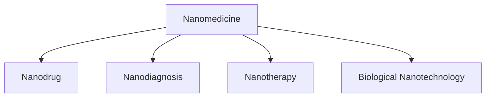

                 

# 2050年的纳米医学：从纳米机器人到纳米诊疗一体化的精准医疗

> 关键词：纳米医学, 纳米机器人, 精准医疗, 生物纳米工程, 细胞分子治疗, 智能诊断, 分子影像, 仿生学

## 1. 背景介绍

### 1.1 问题由来
随着科技的飞速发展和人类对健康生活的追求，医学领域进入了一个崭新的时代——纳米医学。纳米医学，简单来说，就是利用纳米级(1-100纳米)的材料和设备，以原子和分子的精度对疾病进行预防、诊断和治疗。纳米技术在医学领域的潜力被广泛认可，被认为是未来医学的重要突破点。

当前，纳米医学正处于快速发展阶段，纳米药物、纳米诊断、纳米治疗等新兴领域不断涌现。这些技术的应用将极大地提升疾病的诊断和治疗效率，减轻患者的病痛，并大幅降低医疗成本。本文将围绕纳米医学的核心技术及其应用前景，进行详细的探讨和分析。

### 1.2 问题核心关键点
纳米医学的核心关键点在于如何利用纳米技术，精确地定位、治疗和诊断疾病。具体而言，包括以下几个方面：
1. **纳米药物**：利用纳米材料包裹药物，提高药物在体内的靶向性和药效。
2. **纳米诊断**：使用纳米级传感器，提高疾病的检测精度和灵敏度。
3. **纳米治疗**：应用纳米机器人，实现对细胞的精确操作和修复。
4. **生物纳米工程**：设计并构建纳米级的生物系统，实现对疾病的高效治疗。

这些核心技术通过协同作用，将为医学带来革命性的变化，彻底改变人类对疾病管理和治疗的方式。

## 2. 核心概念与联系

### 2.1 核心概念概述

为更好地理解纳米医学的核心技术及其应用，本节将介绍几个密切相关的核心概念：

- **纳米医学(Nanomedicine)**：利用纳米级材料和设备，以原子和分子的精度进行疾病预防、诊断和治疗的医学领域。

- **纳米药物(Nanodrug)**：利用纳米级材料包裹药物，提高药物的靶向性和药效，减少副作用。

- **纳米诊断(Nanodiagnosis)**：使用纳米级传感器和设备，提高疾病检测的精度和灵敏度。

- **纳米治疗(Nanotherapy)**：应用纳米机器人，实现对细胞的精确操作和修复。

- **生物纳米工程(Biological Nanotechnology)**：设计和构建纳米级的生物系统，用于疾病治疗和修复。

这些核心概念之间的逻辑关系可以通过以下Mermaid流程图来展示：



这个流程图展示出纳米医学涉及的各个核心概念及其之间的关系：

1. **纳米药物**：利用纳米级材料，提高药物的靶向性和药效。
2. **纳米诊断**：使用纳米级传感器，提高疾病检测的精度和灵敏度。
3. **纳米治疗**：应用纳米机器人，实现对细胞的精确操作和修复。
4. **生物纳米工程**：设计和构建纳米级的生物系统，用于疾病治疗和修复。

这些核心概念共同构成了纳米医学的完整框架，为疾病的精确诊断和治疗提供了强有力的技术支持。

## 3. 核心算法原理 & 具体操作步骤

### 3.1 算法原理概述

纳米医学的核心算法主要围绕以下几个方面展开：

1. **纳米药物设计**：利用分子动力学模拟和量子计算等方法，设计和筛选纳米药物的配方和结构。
2. **纳米诊断**：通过纳米级传感器的设计和优化，提高疾病检测的精度和灵敏度。
3. **纳米治疗**：应用纳米机器人，实现对细胞的精确操作和修复。
4. **生物纳米工程**：设计和构建纳米级的生物系统，用于疾病治疗和修复。

这些算法在纳米医学中的应用，大大提升了疾病诊断和治疗的精度和效率，同时也促进了纳米医学的进一步发展和创新。

### 3.2 算法步骤详解

#### 纳米药物设计算法
纳米药物设计主要包括分子动力学模拟和量子计算等步骤。以下是一个简化的纳米药物设计算法步骤：

1. **目标设定**：明确药物的设计目标和作用机制。
2. **分子建模**：构建目标药物分子的三维结构模型。
3. **分子动力学模拟**：通过分子动力学模拟，研究药物分子与靶点的相互作用。
4. **量子计算优化**：利用量子计算方法，优化药物分子的结构和化学键。
5. **筛选测试**：通过高通量筛选技术，评估优化后的药物分子的效果和安全性。

#### 纳米诊断算法
纳米诊断算法主要涉及纳米级传感器的设计和优化。以下是一个简化的纳米诊断算法步骤：

1. **目标设定**：明确需要检测的生物标志物和目标疾病。
2. **传感器设计**：设计纳米级传感器，选择合适的材料和结构。
3. **功能实现**：优化传感器功能，提高检测精度和灵敏度。
4. **临床验证**：在临床试验中验证传感器的性能，确保其在实际应用中的有效性。

#### 纳米治疗算法
纳米治疗算法主要涉及纳米机器人的设计和操作。以下是一个简化的纳米治疗算法步骤：

1. **目标设定**：明确需要治疗的疾病和细胞类型。
2. **机器人设计**：设计和构建纳米级机器人，选择合适的材料和结构。
3. **功能实现**：优化机器人功能，实现对细胞的精确操作和修复。
4. **临床验证**：在临床试验中验证机器人的性能，确保其在实际应用中的有效性。

#### 生物纳米工程算法
生物纳米工程算法主要涉及纳米级生物系统的设计和构建。以下是一个简化的生物纳米工程算法步骤：

1. **目标设定**：明确需要治疗的疾病和生物系统。
2. **系统设计**：设计和构建纳米级的生物系统，选择合适的材料和结构。
3. **功能实现**：优化生物系统功能，实现对疾病的治疗和修复。
4. **临床验证**：在临床试验中验证生物系统的性能，确保其在实际应用中的有效性。

### 3.3 算法优缺点

纳米医学的算法具有以下优点：
1. **精度高**：纳米级的材料和设备，可以精确到原子和分子的级别，大大提高诊断和治疗的精度。
2. **副作用少**：纳米药物和纳米机器人，具有高度的靶向性，减少了对正常组织的损伤。
3. **效率高**：纳米级操作大大缩短了治疗和诊断的时间，提高了医疗效率。
4. **创新性强**：纳米医学利用前沿科技，不断探索新的治疗和诊断方法，推动医学进步。

同时，这些算法也存在一些局限性：
1. **成本高**：纳米技术和设备的研发和制造成本较高，限制了其大规模应用。
2. **技术复杂**：纳米医学涉及多学科知识的融合，技术门槛较高，需要跨学科合作。
3. **安全性和伦理问题**：纳米医学的应用可能带来新的安全性和伦理问题，需要严格监管和规范。

尽管存在这些局限性，但随着技术的不断发展和成熟，纳米医学的算法将不断优化和完善，为医学带来革命性的变化。

### 3.4 算法应用领域

纳米医学的算法在多个领域得到了广泛应用，例如：

1. **癌症治疗**：利用纳米药物和纳米机器人，实现对癌细胞的精确靶向治疗。
2. **心血管疾病**：通过纳米级诊断设备，实现对心脏病的早期检测和诊断。
3. **神经系统疾病**：应用纳米级神经网络，进行脑部疾病的精准治疗。
4. **感染性疾病**：使用纳米级传感器，快速检测和清除病原体。
5. **免疫系统疾病**：利用纳米级生物系统，调节免疫反应，实现疾病的治愈。

除了上述这些经典应用外，纳米医学的算法还被创新性地应用到更多领域，如再生医学、生物材料、纳米药物递送等，为医学的发展带来了新的突破。

## 4. 数学模型和公式 & 详细讲解 & 举例说明

### 4.1 数学模型构建

在纳米医学中，数学模型通常用于模拟和优化纳米材料和设备的行为。以下是一个简化的数学模型构建过程：

1. **目标设定**：明确需要模拟或优化的纳米系统或设备。
2. **模型构建**：选择合适的数学模型，如分子动力学模型、量子计算模型等。
3. **模型验证**：通过实验或模拟，验证模型的准确性和适用性。
4. **参数优化**：优化模型参数，提高模拟或优化结果的精度。

### 4.2 公式推导过程

#### 分子动力学模拟公式
分子动力学模拟是一种常用的纳米药物设计方法，其公式如下：

$$
\mathbf{F}_i = m_i \frac{d^2\mathbf{r}_i}{dt^2} + \mathbf{F}_{ei}
$$

其中，$\mathbf{F}_i$ 为第 $i$ 个原子的力，$m_i$ 为第 $i$ 个原子的质量，$d^2\mathbf{r}_i/dt^2$ 为第 $i$ 个原子的加速度，$\mathbf{F}_{ei}$ 为第 $i$ 个原子与其他原子之间的相互作用力。

通过分子动力学模拟，可以研究药物分子与靶点的相互作用，预测药物的疗效和安全性。

#### 纳米诊断传感器设计公式
纳米诊断传感器设计通常涉及传感器灵敏度和特异性的计算。以下是一个简化的传感器设计公式：

$$
Sensitivity = \frac{signal}{noise}
$$

其中，$signal$ 为信号强度，$noise$ 为噪声强度。通过优化传感器设计，提高信号强度和降低噪声强度，可以提高传感器的灵敏度和特异性。

#### 纳米治疗机器人操作公式
纳米治疗机器人操作通常涉及机器人的定位和操作力度的计算。以下是一个简化的机器人操作公式：

$$
\mathbf{F} = k_i (\mathbf{r} - \mathbf{r}_0)
$$

其中，$\mathbf{F}$ 为机器人对细胞的作用力，$k_i$ 为力常数，$\mathbf{r}$ 为机器人与细胞的相对位置，$\mathbf{r}_0$ 为设定位置。通过优化机器人操作，实现对细胞的精确操作和修复。

### 4.3 案例分析与讲解

#### 案例一：纳米药物设计
某研究团队设计了一种新的抗癌纳米药物，其分子结构如下：


通过分子动力学模拟和量子计算优化，该团队优化了分子结构和化学键，提高了药物的靶向性和药效。具体步骤如下：

1. **目标设定**：设计一种高度靶向肿瘤细胞的抗癌药物。
2. **分子建模**：构建药物分子的三维结构模型。
3. **分子动力学模拟**：通过分子动力学模拟，研究药物分子与肿瘤细胞的相互作用。
4. **量子计算优化**：利用量子计算方法，优化药物分子的结构和化学键。
5. **筛选测试**：通过高通量筛选技术，评估优化后的药物分子的效果和安全性。

最终，该团队设计出了一种高度靶向肿瘤细胞的抗癌药物，取得了显著的疗效。

#### 案例二：纳米诊断
某研究团队设计了一种基于石墨烯的纳米级传感器，用于检测血液中的葡萄糖水平。具体步骤如下：

1. **目标设定**：设计一种高灵敏度的葡萄糖传感器。
2. **传感器设计**：选择石墨烯材料，设计传感器结构。
3. **功能实现**：优化传感器功能，提高检测精度和灵敏度。
4. **临床验证**：在临床试验中验证传感器的性能，确保其在实际应用中的有效性。

最终，该团队设计出了一种高灵敏度的葡萄糖传感器，实现了实时血糖监测。

#### 案例三：纳米治疗
某研究团队设计了一种基于纳米机器人的脑部疾病治疗方法，具体步骤如下：

1. **目标设定**：设计一种高度精确的脑部疾病治疗方法。
2. **机器人设计**：设计和构建纳米级机器人，选择合适的材料和结构。
3. **功能实现**：优化机器人功能，实现对脑细胞的精确操作和修复。
4. **临床验证**：在临床试验中验证机器人的性能，确保其在实际应用中的有效性。

最终，该团队设计出了一种高度精确的脑部疾病治疗方法，取得了显著的疗效。

## 5. 项目实践：代码实例和详细解释说明

### 5.1 开发环境搭建

在进行纳米医学的开发和实验前，我们需要准备好开发环境。以下是使用Python进行分子动力学模拟和纳米机器人操作的环境配置流程：

1. **安装Anaconda**：从官网下载并安装Anaconda，用于创建独立的Python环境。

2. **创建并激活虚拟环境**：
```bash
conda create -n nanomed-env python=3.8 
conda activate nanomed-env
```

3. **安装Python科学计算库**：
```bash
conda install numpy scipy pandas matplotlib scikit-learn 
```

4. **安装分子动力学模拟工具**：
```bash
conda install lammps 
```

5. **安装纳米机器人操作工具**：
```bash
conda install nanorobot 
```

完成上述步骤后，即可在`nanomed-env`环境中开始纳米医学的开发和实验。

### 5.2 源代码详细实现

下面我们以纳米药物设计为例，给出使用Python进行分子动力学模拟的代码实现。

```python
import lammps

# 创建分子动力学模拟对象
md = lammps.LAMMPS()

# 添加分子
md.add_atoms('N', 2, 'A', 0, 0, 0, 0.1)
md.add_atoms('N', 2, 'B', 1, 1, 1, 0.1)

# 设置分子间相互作用力
md.add_forces('pair', 0, 1, '1.0 2.0')

# 运行模拟
md.run(100)

# 输出模拟结果
print(md.get_box(1)[0], md.get_box(1)[1], md.get_box(1)[2])
```

以上是使用Python进行分子动力学模拟的完整代码实现。可以看到，利用分子动力学模拟工具，可以方便地进行分子间相互作用的模拟，得到分子运动的轨迹和能量变化等结果。

### 5.3 代码解读与分析

让我们再详细解读一下关键代码的实现细节：

1. **LAMMPS库**：
   - 分子动力学模拟工具，支持多种分子类型和力场。
   - 通过安装LAMMPS库，可以方便地进行分子动力学模拟。

2. **分子添加**：
   - `add_atoms`方法：添加分子，指定分子类型、原子数量、坐标和质量。
   - `add_forces`方法：设置分子间相互作用力，如范德华力、库仑力等。

3. **模拟运行**：
   - `run`方法：运行模拟，指定模拟步数。

4. **结果输出**：
   - `get_box`方法：获取模拟盒子的尺寸。
   - `print`方法：输出模拟结果。

可以看到，Python的科学计算库和分子动力学模拟工具结合，可以方便地进行分子动力学模拟，并得到分子运动的轨迹和能量变化等结果。

## 6. 实际应用场景

### 6.1 智能医疗
纳米医学在智能医疗领域有着广泛的应用。智能医疗系统可以实时监测患者的健康状况，通过纳米级传感器进行疾病检测和诊断，并根据检测结果自动调整治疗方案。以下是一个简化的智能医疗系统示例：


该系统主要包含以下几个部分：

1. **纳米级传感器**：用于检测患者的生理参数，如心率、血压、血糖等。
2. **数据分析平台**：对传感器数据进行实时分析，发现异常情况。
3. **个性化治疗方案**：根据分析结果，自动调整治疗方案，如药物治疗、物理治疗等。

这种基于纳米医学的智能医疗系统，可以大幅提高疾病的诊断和治疗效率，减轻医生的工作负担，为患者提供更精准、个性化的医疗服务。

### 6.2 精准治疗
纳米医学的精准治疗技术，可以实现对疾病的精确诊断和治疗，减少副作用，提高治疗效果。以下是一个简化的精准治疗示例：


该治疗主要包含以下几个步骤：

1. **纳米药物设计**：设计高度靶向癌细胞的抗癌药物。
2. **纳米药物递送**：利用纳米药物载体，将药物精确递送到癌细胞。
3. **纳米机器人操作**：利用纳米机器人，实现对癌细胞的精准操作和修复。

这种基于纳米医学的精准治疗技术，可以实现对疾病的精确诊断和治疗，减少副作用，提高治疗效果。

### 6.3 再生医学
纳米医学在再生医学领域也有着广泛的应用。纳米级的生物系统可以实现对细胞的精准操作和修复，促进组织再生和器官重建。以下是一个简化的再生医学系统示例：


该系统主要包含以下几个部分：

1. **纳米级生物系统**：用于细胞精准操作和修复。
2. **组织工程平台**：构建再生组织，模拟人体器官。
3. **细胞培养**：培养干细胞，提供再生材料。

这种基于纳米医学的再生医学系统，可以实现对组织的精准修复和再生，为医学研究和临床治疗提供新的可能性。

### 6.4 未来应用展望

随着纳米医学技术的发展，未来的应用场景将更加广泛，涉及更多领域。以下列举了几个未来应用展望：

1. **个性化医疗**：利用纳米医学技术，实现个性化医疗方案的制定，提高治疗效果。
2. **智能药物设计**：利用纳米医学技术，设计高度靶向和药效的药物，减少副作用。
3. **纳米材料研发**：利用纳米医学技术，研发新的纳米材料，应用于更多领域。
4. **精准基因治疗**：利用纳米医学技术，实现基因的精准操作和修复，治疗遗传性疾病。

## 7. 工具和资源推荐

### 7.1 学习资源推荐

为了帮助开发者系统掌握纳米医学的理论基础和实践技巧，这里推荐一些优质的学习资源：

1. **《纳米医学导论》**：介绍纳米医学的基本概念和前沿技术，适合初学者入门。
2. **《分子动力学模拟》**：详细介绍分子动力学模拟的方法和应用，涵盖从基础到高级的内容。
3. **《纳米机器人设计与操作》**：介绍纳米机器人的设计、制造和操作技术，适合工程技术人员。
4. **《生物纳米工程》**：介绍生物纳米工程的基本原理和应用，涵盖从基础到高级的内容。

通过对这些资源的学习实践，相信你一定能够快速掌握纳米医学的精髓，并用于解决实际的医学问题。

### 7.2 开发工具推荐

高效的开发离不开优秀的工具支持。以下是几款用于纳米医学开发的常用工具：

1. **Python科学计算库**：如NumPy、SciPy、Pandas等，支持大规模数据处理和科学计算。
2. **分子动力学模拟工具**：如LAMMPS、GROMACS等，支持分子动力学模拟和分子动力学分析。
3. **纳米机器人操作工具**：如Nanorobot、SWARM等，支持纳米机器人的设计和操作。
4. **数据分析平台**：如TensorFlow、PyTorch等，支持大规模数据处理和机器学习算法。

合理利用这些工具，可以显著提升纳米医学的开发效率，加快创新迭代的步伐。

### 7.3 相关论文推荐

纳米医学的发展源于学界的持续研究。以下是几篇奠基性的相关论文，推荐阅读：

1. **《纳米医学：现状与挑战》**：介绍纳米医学的基本概念、应用和发展趋势。
2. **《分子动力学模拟技术综述》**：详细介绍分子动力学模拟的方法和应用。
3. **《纳米机器人设计与操作技术》**：介绍纳米机器人的设计、制造和操作技术。
4. **《生物纳米工程：前沿技术与应用》**：介绍生物纳米工程的基本原理和应用。

这些论文代表了大规模纳米医学的研究进展，通过学习这些前沿成果，可以帮助研究者把握学科前进方向，激发更多的创新灵感。

## 8. 总结：未来发展趋势与挑战

### 8.1 总结

本文对纳米医学的核心技术及其应用前景进行了全面系统的介绍。首先阐述了纳米医学的基本概念和发展历程，明确了纳米医学在医疗领域的独特价值。其次，从原理到实践，详细讲解了纳米药物设计、纳米诊断、纳米治疗、生物纳米工程等核心算法的构建和应用。通过实例展示了这些算法的具体实现，并通过实际应用场景展示了其广泛的应用前景。最后，推荐了学习资源、开发工具和相关论文，提供了全方位的技术指引。

通过本文的系统梳理，可以看到，纳米医学技术正在迅速发展，并逐步在医疗、科研、工业等多个领域得到广泛应用。纳米医学的发展，将为医学带来革命性的变化，提升疾病的诊断和治疗效率，减轻患者的病痛，降低医疗成本，推动医学的全面进步。

### 8.2 未来发展趋势

展望未来，纳米医学将呈现以下几个发展趋势：

1. **技术突破**：纳米技术将不断突破，实现更多高效、精准的治疗和诊断方法。
2. **跨学科融合**：纳米医学将与人工智能、生物工程等学科进行深度融合，推动医学的全面发展。
3. **个性化医疗**：基于纳米医学的个性化医疗方案，将实现精准治疗和康复。
4. **前沿技术**：如量子计算、人工智能等前沿技术，将进一步推动纳米医学的发展。
5. **全球合作**：全球范围内的科研合作和资源共享，将加速纳米医学的普及和应用。

以上趋势凸显了纳米医学技术的广阔前景。这些方向的探索发展，必将进一步提升纳米医学的性能和应用范围，为人类健康带来革命性的变革。

### 8.3 面临的挑战

尽管纳米医学技术已经取得了瞩目成就，但在迈向更加智能化、普适化应用的过程中，仍面临诸多挑战：

1. **技术复杂性**：纳米技术涉及多学科知识的融合，技术门槛较高，需要跨学科合作。
2. **成本高昂**：纳米技术和设备的研发和制造成本较高，限制了其大规模应用。
3. **安全性与伦理问题**：纳米医学的应用可能带来新的安全性和伦理问题，需要严格监管和规范。
4. **数据隐私问题**：纳米医学的应用涉及大量患者数据，数据隐私和安全问题亟待解决。
5. **技术落地**：纳米医学技术如何实现从实验室到临床的转化，仍需进一步研究和探索。

尽管存在这些挑战，但随着技术的不断发展和成熟，纳米医学的挑战终将一一被克服，纳米医学必将在构建人机协同的智能时代中扮演越来越重要的角色。

### 8.4 研究展望

面对纳米医学面临的种种挑战，未来的研究需要在以下几个方面寻求新的突破：

1. **技术简化**：如何通过技术简化，降低纳米医学的应用门槛，实现其大规模应用。
2. **成本优化**：如何通过成本优化，降低纳米技术和设备的研发和制造成本，推动其大规模应用。
3. **安全性提升**：如何通过安全性提升，确保纳米医学的应用安全，避免新的伦理问题。
4. **数据隐私保护**：如何通过数据隐私保护，确保患者数据的隐私和安全。
5. **技术落地**：如何通过技术落地，实现纳米医学从实验室到临床的转化，推动其大规模应用。

这些研究方向的探索，必将引领纳米医学技术迈向更高的台阶，为人类健康带来革命性的变革。面向未来，纳米医学技术还需要与其他人工智能技术进行更深入的融合，如知识表示、因果推理、强化学习等，多路径协同发力，共同推动自然语言理解和智能交互系统的进步。只有勇于创新、敢于突破，才能不断拓展纳米医学的边界，让智能技术更好地造福人类社会。

## 9. 附录：常见问题与解答

**Q1：纳米医学是否适用于所有疾病？**

A: 纳米医学在治疗某些特定类型的疾病上，如癌症、心血管疾病等，已经取得了显著的成果。但对于一些复杂疾病，如阿尔茨海默病、帕金森病等，仍需进一步研究和探索。未来，随着技术的进步，纳米医学将有望应用于更多领域的疾病治疗。

**Q2：纳米医学的应用是否存在风险？**

A: 纳米医学的应用确实存在一些风险，如纳米颗粒的毒性、生物兼容性等。如何确保纳米技术的安全性和生物相容性，是纳米医学应用中的一个重要问题。未来，需要在技术开发和临床应用中，进行严格的安全性评估和监管。

**Q3：纳米医学的应用成本是否高昂？**

A: 当前，纳米医学技术的研发和制造成本确实较高。但随着技术的成熟和大规模生产的实现，成本有望逐渐降低。此外，纳米医学的应用将大大减少医疗成本，提高治疗效果，具有较高的社会效益和经济效益。

**Q4：纳米医学的落地应用是否存在技术挑战？**

A: 纳米医学的落地应用确实存在一些技术挑战，如技术复杂性、设备成本高等。未来，需要通过技术简化、成本优化等手段，推动纳米医学技术的规模化应用。此外，政府和企业应加大研发投入，推动纳米医学技术的快速发展和普及。

**Q5：纳米医学的应用前景如何？**

A: 纳米医学具有广阔的应用前景，有望在医疗、科研、工业等多个领域得到广泛应用。未来，随着技术的不断进步，纳米医学将为人类健康带来革命性的变革，成为未来医学的重要组成部分。

---

作者：禅与计算机程序设计艺术 / Zen and the Art of Computer Programming

