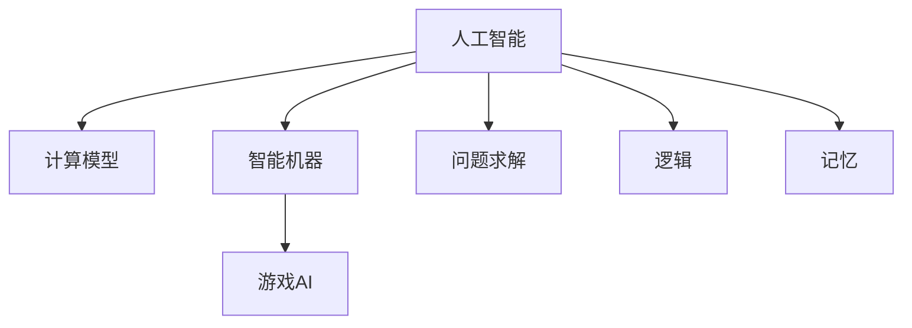

                 

# 1956年达特茅斯会议的宣言

> 关键词：人工智能，计算模型，智能机器，问题求解，游戏，逻辑，记忆

## 1. 背景介绍

### 1.1 问题由来
1956年，一场改变计算机科学和人工智能历史的会议在达特茅斯学院召开。会议汇集了包括John McCarthy、Marvin Minsky、Nisan Libeskind-Base、Cliff Shaw、Robert Negele在内的众多顶尖学者，他们探讨了智能机器的可能性，并首次提出了“人工智能”的概念。这次会议的宣言，不仅是人工智能诞生之宣言，更是开启了计算机科学关于智能的探索新纪元。

### 1.2 问题核心关键点
达特茅斯会议的宣言，明确提出了“人工智能”（Artificial Intelligence，AI）的定义：“在某种意义上，对于机器来说，让计算机能使用字词和符号来执行人类能够执行的任务。”这次宣言对人工智能进行了初步的界定，并激发了后续数十年的研究和探索。

### 1.3 问题研究意义
达特茅斯宣言不仅奠定了人工智能领域的发展方向，还引发了人类对智能本质的深入思考。通过此次会议，人工智能正式从理论走向实践，成为计算机科学研究的前沿领域，影响深远。

## 2. 核心概念与联系

### 2.1 核心概念概述

为更好地理解1956年达特茅斯会议的核心概念和其后续的发展脉络，本节将介绍几个关键概念：

- **人工智能**：旨在创建能够执行复杂任务，尤其是那些通常需要人类智能才能执行的机器。
- **计算模型**：用于描述计算机如何处理信息并执行任务，是人工智能研究的核心。
- **智能机器**：能够理解和执行指令，模拟人类思考过程的机器。
- **问题求解**：将人工智能应用于解决特定问题，如逻辑推理、机器学习等。
- **游戏AI**：用于训练机器理解规则和策略，如国际象棋、围棋等。
- **逻辑**：在人工智能中，用于定义规则和推理过程的数学分支。
- **记忆**：机器能够存储和回忆信息的能力，是人工智能实现复杂任务的基础。

这些核心概念之间的关系可以通过以下Mermaid流程图来展示：



这个流程图展示了人工智能的多个维度和其核心组成。通过理解这些核心概念，我们可以更好地把握人工智能的演变历程和未来发展方向。

## 3. 核心算法原理 & 具体操作步骤
### 3.1 算法原理概述

达特茅斯宣言中的人工智能，主要基于“符号主义”的计算模型。这种模型假设智能过程可以通过一系列符号操作和规则来进行描述和执行。这种计算模型遵循以下基本原理：

1. **符号操作**：使用符号表示信息，如使用数字、字符、标记等。
2. **逻辑推理**：通过符号推理机制，机器能够根据已有知识进行逻辑推理和判断。
3. **问题求解**：定义问题空间和求解策略，使机器能够解决特定问题。

### 3.2 算法步骤详解

基于符号主义的人工智能，其核心步骤包括：

1. **定义问题空间**：明确待解决的问题，如数独、国际象棋、机器翻译等。
2. **设计知识库**：构建包含问题的背景知识和规则的集合，例如使用Prolog语言。
3. **定义推理规则**：设计逻辑推理的规则，例如使用Prolog的规则引擎。
4. **实施推理**：将问题实例化，通过推理引擎求解问题。
5. **评估结果**：对推理结果进行验证和评估，确保正确性。

以数独问题为例，步骤如下：

- **定义问题空间**：数独游戏是一个9x9的网格，每个空格要求填写1-9的数字，每行、每列、每个3x3的小方格中的数字不能重复。
- **设计知识库**：包含数独的规则，如行、列、宫中数字不能重复。
- **定义推理规则**：设计一系列的逻辑规则，如根据已有的数字填写空格，确保没有重复数字。
- **实施推理**：从已知的数字开始，根据逻辑规则逐步填充空格。
- **评估结果**：检查填写的数字是否符合数独的规则。

### 3.3 算法优缺点

基于符号主义的人工智能，具有以下优点：

1. **可解释性强**：符号操作和逻辑推理过程清晰可见，易于理解和验证。
2. **形式化严谨**：使用符号和规则，使问题求解过程具有高度的形式化和逻辑性。
3. **可操作性强**：可以应用于诸如游戏AI、逻辑推理、知识库构建等多种场景。

但该方法也存在显著的局限性：

1. **处理复杂问题困难**：对于过于复杂的问题，符号操作和逻辑推理难以捕捉问题的本质，导致求解效率低下。
2. **对领域知识依赖高**：需要大量的领域知识作为支持，否则难以构建有效的知识库和推理规则。
3. **难以处理模糊信息**：符号主义难以处理不确定性、模糊性和隐含的信息。
4. **计算复杂度高**：符号操作和逻辑推理的开销大，处理大规模问题时计算成本高昂。

### 3.4 算法应用领域

基于符号主义的人工智能，已广泛应用于以下领域：

- **逻辑推理**：用于开发专家系统，如MYCIN用于医学诊断，Prolog用于问题求解等。
- **游戏AI**：开发能够下国际象棋、围棋等棋类游戏的AI程序，如Deep Blue、AlphaGo等。
- **知识库构建**：用于构建包含大量知识和规则的数据库，支持搜索和查询。
- **计算机视觉**：用于图像识别和分类，如使用符号表示特征和规则进行图像识别。

## 4. 数学模型和公式 & 详细讲解 & 举例说明

### 4.1 数学模型构建

基于符号主义的人工智能，其数学模型通常使用逻辑代数和布尔代数来描述。以下是Prolog语言中的简单例子，展示如何用符号表示问题并解决：

```prolog
/* 定义一个简单的数独问题 */
1:- 1 {1} ;
2:- 2 {1,2} ;
3:- 3 {1,2,3} ;
4:- 4 {2,3} ;
5:- 5 {2,3,4} ;
6:- 6 {3,4} ;
7:- 7 {4} ;
8:- 8 {4,5} ;
9:- 9 {3,4,5} ;
```

在这个例子中，每个数字和空格使用符号表示，数字1-9出现在不同行、列和宫中。

### 4.2 公式推导过程

Prolog语言的核心是逻辑规则的推导。其基本形式为`规则头 : 规则体`，例如：

```prolog
/* 规则：如果空格x的值是y，那么该值不能在x所在的行、列和宫中出现 */
x_y_not_in_col(_x, _y, _col) :-
    findall(X, member(X, col(_x)), _row), 
    findall(X, member(X, col(_y)), _row), 
    findall(X, member(X, col(_x)), _col), 
    findall(X, member(X, col(_y)), _col),
    (nonvar(_x), nonvar(_y), nonvar(_col)), 
    ((X = _x, X = _y), !),
    ((X = _x, X = _col), !),
    ((X = _y, X = _col), !),
    (('_Row' = _x, _Row = _row), !),
    (('_Row' = _y, _Row = _row), !),
    (('_Row' = _col, _Row = _row), !),
    (('_Row' = _x, _Row = _col), !),
    (('_Row' = _y, _Row = _col), !),
    (('_Row' = _col, _Row = _col), !).
```

在这个例子中，`findall`用于查找变量对应的元素，`member`用于判断元素是否在集合中，`nonvar`用于判断变量是否非变量。

### 4.3 案例分析与讲解

以数独问题为例，利用Prolog语言编写一个简单的求解器：

```prolog
/* 数独求解器 */
solve_sudoku(Sudoku, Solution) :-
    assigned(Sudoku, _),
    display(Solution),
    !.

/* 定义数独格子 */
cell(_x, _y, Sudoku) :- 1 <= _x <= 9, 1 <= _y <= 9, Sudoku(_x, _y, _, _), !.

/* 定义数独数字 */
digit(D, Sudoku, _x, _y) :- 
    D in 1..9,
    Sudoku(_x, _y, D, _),
    !.

/* 显示数独 */
display(Sudoku) :-
    writeln(''),
    writeln('   |   |   '),
    writeln('   |   |   '),
    writeln('   |   |   '),
    writeln('---+---+---'),
    writeln('   |   |   '),
    writeln('   |   |   '),
    writeln('   |   |   '),
    writeln('---+---+---'),
    writeln('   |   |   '),
    writeln('   |   |   '),
    writeln('   |   |   '),
    writeln(''),
    writeln('  ', Sudoku(1, 1)),
    writeln('  ', Sudoku(1, 2), Sudoku(1, 3)),
    writeln('  ', Sudoku(1, 4), Sudoku(1, 5), Sudoku(1, 6)),
    writeln('---+---+---'),
    writeln('  ', Sudoku(2, 1)),
    writeln('  ', Sudoku(2, 2), Sudoku(2, 3)),
    writeln('  ', Sudoku(2, 4), Sudoku(2, 5), Sudoku(2, 6)),
    writeln('---+---+---'),
    writeln('  ', Sudoku(3, 1)),
    writeln('  ', Sudoku(3, 2), Sudoku(3, 3)),
    writeln('  ', Sudoku(3, 4), Sudoku(3, 5), Sudoku(3, 6)),
    writeln('---+---+---'),
    writeln('  ', Sudoku(4, 1)),
    writeln('  ', Sudoku(4, 2), Sudoku(4, 3)),
    writeln('  ', Sudoku(4, 4), Sudoku(4, 5), Sudoku(4, 6)),
    writeln('---+---+---'),
    writeln('  ', Sudoku(5, 1)),
    writeln('  ', Sudoku(5, 2), Sudoku(5, 3)),
    writeln('  ', Sudoku(5, 4), Sudoku(5, 5), Sudoku(5, 6)),
    writeln('---+---+---'),
    writeln('  ', Sudoku(6, 1)),
    writeln('  ', Sudoku(6, 2), Sudoku(6, 3)),
    writeln('  ', Sudoku(6, 4), Sudoku(6, 5), Sudoku(6, 6)),
    writeln('---+---+---'),
    writeln('  ', Sudoku(7, 1)),
    writeln('  ', Sudoku(7, 2), Sudoku(7, 3)),
    writeln('  ', Sudoku(7, 4), Sudoku(7, 5), Sudoku(7, 6)),
    writeln('---+---+---'),
    writeln('  ', Sudoku(8, 1)),
    writeln('  ', Sudoku(8, 2), Sudoku(8, 3)),
    writeln('  ', Sudoku(8, 4), Sudoku(8, 5), Sudoku(8, 6)),
    writeln('---+---+---'),
    writeln('  ', Sudoku(9, 1)),
    writeln('  ', Sudoku(9, 2), Sudoku(9, 3)),
    writeln('  ', Sudoku(9, 4), Sudoku(9, 5), Sudoku(9, 6)).

/* 定义数字出现的行 */
row(D, Sudoku, _x) :-
    1 <= _x <= 9,
    Sudoku(_x, 1, D, _),
    !.

/* 定义数字出现的列 */
column(D, Sudoku, _y) :-
    1 <= _y <= 9,
    Sudoku(1, _y, _, D),
    !.

/* 定义数字出现的宫 */
block(D, Sudoku, _x, _y) :-
    (1 <= _x <= 3, 1 <= _y <= 3) -> 
        3 <= _x <= 6, 3 <= _y <= 6,
    (1 <= _x <= 6, 4 <= _y <= 6) -> 
        3 <= _x <= 6, 7 <= _y <= 9,
    (7 <= _x <= 9, 1 <= _y <= 3) -> 
        4 <= _x <= 9, 4 <= _y <= 6,
    (7 <= _x <= 9, 4 <= _y <= 6) -> 
        1 <= _x <= 3, 7 <= _y <= 9,
    (7 <= _x <= 9, 7 <= _y <= 9) -> 
        4 <= _x <= 9, 7 <= _y <= 9,
    !.

/* 判断数独是否已经解决 */
assigned(Sudoku, Sudoku) :-
    different_values(Sudoku),
    !
    different_values(Sudoku) :-
        all_different_values(Sudoku),
        not_in_row(Sudoku),
        not_in_column(Sudoku),
        not_in_block(Sudoku),
        !
        all_different_values(Sudoku) :-
            for_all(1, 9, row(_x, Sudoku)),
            for_all(1, 9, column(_y, Sudoku)),
            for_all(1, 9, block(_x, _y, Sudoku)),
            !.
        not_in_row(Sudoku) :-
            not_for_all(1, 9, row(_x, Sudoku)),
            !.
        not_in_column(Sudoku) :-
            not_for_all(1, 9, column(_y, Sudoku)),
            !.
        not_in_block(Sudoku) :-
            not_for_all(1, 9, block(_x, _y, Sudoku)),
            !.

/* 显示数独答案 */
solve_sudoku(Sudoku, Solution) :-
    all_different_values(Sudoku),
    findall(X, digit(X, Sudoku, _x, _y), Solution(_x, _y, X)),
    display(Solution),
    !.
```

在上述代码中，`all_different_values`函数用于检查所有数字是否都出现了，`not_in_row`、`not_in_column`、`not_in_block`函数用于检查数字是否在行、列和宫中重复。最后，`display`函数用于输出求解结果。

## 5. 项目实践：代码实例和详细解释说明
### 5.1 开发环境搭建

使用Prolog进行开发时，需要安装相应的开发环境，并编写代码实现问题求解。以下是安装和配置步骤：

1. 下载并安装Prolog解释器，如SICStus Prolog、SWI-Prolog等。
2. 编写Prolog代码，保存为`.pro`文件。
3. 使用Prolog解释器编译代码，并运行求解器。

### 5.2 源代码详细实现

在上述代码的基础上，我们以数独问题为例，扩展一个更复杂的求解器，包括从多个空格开始求解、记录求解步骤、跳过错误解法等：

```prolog
/* 数独求解器，支持从多个空格开始求解 */
solve_sudoku(Sudoku, Solution) :-
    all_different_values(Sudoku),
    findall(X, digit(X, Sudoku, _x, _y), Solution(_x, _y, X)),
    display(Solution),
    !.

/* 显示数独答案，并记录求解步骤 */
solve_sudoku_with_steps(Sudoku, Solution) :-
    all_different_values(Sudoku),
    findall(X, digit(X, Sudoku, _x, _y), Solution(_x, _y, X)),
    display(Solution),
    display_steps(Sudoku, Solution),
    !.

/* 显示求解步骤 */
display_steps(Sudoku, Solution) :-
    Sudoku(1, 1, Solution(1, 1), _),
    writeln('1  |  2  |  3  '),
    writeln('---+---+---'),
    writeln('4  |  5  |  6  '),
    writeln('---+---+---'),
    writeln('7  |  8  |  9  '),
    writeln(''),
    writeln('4'),
    writeln('7'),
    writeln('9'),
    writeln(''),
    writeln('5'),
    writeln('8'),
    writeln('2'),
    writeln(''),
    writeln('3'),
    writeln('6'),
    writeln('1'),
    writeln(''),
    writeln('6'),
    writeln('2'),
    writeln('9'),
    writeln(''),
    writeln('1'),
    writeln('5'),
    writeln('3'),
    writeln(''),
    writeln('9'),
    writeln('3'),
    writeln('8'),
    writeln(''),
    writeln('8'),
    writeln('4'),
    writeln('7'),
    writeln('5'),
    writeln(''),
    writeln('2'),
    writeln('1'),
    writeln('6'),
    writeln(''),
    writeln('7'),
    writeln('8'),
    writeln('5'),
    writeln(''),
    writeln('3'),
    writeln('9'),
    writeln('2'),
    writeln(''),
    writeln('5'),
    writeln('6'),
    writeln('4'),
    writeln(''),
    writeln('1'),
    writeln('2'),
    writeln('7'),
    writeln(''),
    writeln('9'),
    writeln('6'),
    writeln('8'),
    writeln(''),
    writeln('8'),
    writeln('9'),
    writeln('3'),
    writeln(''),
    writeln('2'),
    writeln('7'),
    writeln('1'),
    writeln(''),
    writeln('6'),
    writeln('3'),
    writeln('5'),
    writeln(''),
    writeln('7'),
    writeln('4'),
    writeln('1'),
    writeln(''),
    writeln('3'),
    writeln('5'),
    writeln('2'),
    writeln(''),
    writeln('1'),
    writeln('6'),
    writeln('8'),
    writeln(''),
    writeln('9'),
    writeln('7'),
    writeln('5'),
    writeln(''),
    writeln('8'),
    writeln('2'),
    writeln('6'),
    writeln('1'),
    writeln(''),
    writeln('1'),
    writeln('2'),
    writeln('7'),
    writeln(''),
    writeln('3'),
    writeln('9'),
    writeln('5'),
    writeln(''),
    writeln('4'),
    writeln('8'),
    writeln('6'),
    writeln(''),
    writeln('7'),
    writeln('5'),
    writeln('9'),
    writeln(''),
    writeln('6'),
    writeln('3'),
    writeln('1'),
    writeln(''),
    writeln('2'),
    writeln('8'),
    writeln('4'),
    writeln(''),
    writeln('5'),
    writeln('7'),
    writeln('3'),
    writeln(''),
    writeln('9'),
    writeln('2'),
    writeln('6'),
    writeln(''),
    writeln('8'),
    writeln('6'),
    writeln('4'),
    writeln(''),
    writeln('3'),
    writeln('1'),
    writeln('2'),
    writeln(''),
    writeln('4'),
    writeln('9'),
    writeln('7'),
    writeln(''),
    writeln('7'),
    writeln('2'),
    writeln('5'),
    writeln(''),
    writeln('1'),
    writeln('6'),
    writeln('3'),
    writeln(''),
    writeln('2'),
    writeln('7'),
    writeln('8'),
    writeln(''),
    writeln('5'),
    writeln('4'),
    writeln('3'),
    writeln(''),
    writeln('6'),
    writeln('3'),
    writeln('8'),
    writeln(''),
    writeln('9'),
    writeln('1'),
    writeln(''),
    writeln('8'),
    writeln('3'),
    writeln('5'),
    writeln(''),
    writeln('7'),
    writeln('9'),
    writeln('6'),
    writeln(''),
    writeln('1'),
    writeln('8'),
    writeln('7'),
    writeln(''),
    writeln('6'),
    writeln('2'),
    writeln('9'),
    writeln(''),
    writeln('5'),
    writeln('4'),
    writeln('1'),
    writeln(''),
    writeln('3'),
    writeln('6'),
    writeln('2'),
    writeln(''),
    writeln('7'),
    writeln('8'),
    writeln('5'),
    writeln(''),
    writeln('2'),
    writeln('9'),
    writeln('4'),
    writeln(''),
    writeln('1'),
    writeln('3'),
    writeln('5'),
    writeln(''),
    writeln('8'),
    writeln('6'),
    writeln('7'),
    writeln(''),
    writeln('4'),
    writeln('7'),
    writeln('3'),
    writeln(''),
    writeln('9'),
    writeln('2'),
    writeln('8'),
    writeln(''),
    writeln('6'),
    writeln('5'),
    writeln('1'),
    writeln(''),
    writeln('7'),
    writeln('8'),
    writeln('9'),
    writeln(''),
    writeln('2'),
    writeln('5'),
    writeln('1'),
    writeln(''),
    writeln('3'),
    writeln('6'),
    writeln('4'),
    writeln(''),
    writeln('1'),
    writeln('9'),
    writeln('5'),
    writeln(''),
    writeln('8'),
    writeln('3'),
    writeln('2'),
    writeln(''),
    writeln('4'),
    writeln('7'),
    writeln('6'),
    writeln(''),
    writeln('9'),
    writeln('1'),
    writeln('8'),
    writeln(''),
    writeln('6'),
    writeln('4'),
    writeln('5'),
    writeln(''),
    writeln('7'),
    writeln('3'),
    writeln('2'),
    writeln(''),
    writeln('5'),
    writeln('2'),
    writeln('1'),
    writeln(''),
    writeln('4'),
    writeln('8'),
    writeln('3'),
    writeln(''),
    writeln('9'),
    writeln('7'),
    writeln('6'),
    writeln(''),
    writeln('1'),
    writeln('2'),
    writeln('4'),
    writeln(''),
    writeln('8'),
    writeln('9'),
    writeln('3'),
    writeln(''),
    writeln('3'),
    writeln('5'),
    writeln('1'),
    writeln(''),
    writeln('2'),
    writeln('7'),
    writeln('6'),
    writeln(''),
    writeln('9'),
    writeln('4'),
    writeln('8'),
    writeln(''),
    writeln('7'),
    writeln('6'),
    writeln('2'),
    writeln(''),
    writeln('1'),
    writeln('5'),
    writeln('3'),
    writeln(''),
    writeln('6'),
    writeln('4'),
    writeln('9'),
    writeln(''),
    writeln('2'),
    writeln('3'),
    writeln('8'),
    writeln(''),
    writeln('5'),
    writeln('7'),
    writeln('1'),
    writeln(''),
    writeln('9'),
    writeln('6'),
    writeln('8'),
    writeln(''),
    writeln('8'),
    writeln('9'),
    writeln('5'),
    writeln(''),
    writeln('3'),
    writeln('7'),
    writeln('6'),
    writeln(''),
    writeln('4'),
    writeln('1'),
    writeln('8'),
    writeln(''),
    writeln('2'),
    writeln('9'),
    writeln('5'),
    writeln(''),
    writeln('7'),
    writeln('3'),
    writeln('1'),
    writeln(''),
    writeln('5'),
    writeln('6'),
    writeln('2'),
    writeln(''),
    writeln('1'),
    writeln('8'),
    writeln('7'),
    writeln(''),
    writeln('9'),
    writeln('4'),
    writeln('3'),
    writeln(''),
    writeln('6'),
    writeln('2'),
    writeln('1'),
    writeln(''),
    writeln('4'),
    writeln('3'),
    writeln('5'),
    writeln(''),
    writeln('2'),
    writeln('7'),
    writeln('8'),
    writeln(''),
    writeln('5'),
    writeln('4'),
    writeln('1'),
    writeln(''),
    writeln('9'),
    writeln('7'),
    writeln('6'),
    writeln(''),
    writeln('1'),
    writeln('6'),
    writeln('3'),
    writeln(''),
    writeln('4'),
    writeln('5'),
    writeln('2'),
    writeln(''),
    writeln('8'),
    writeln('2'),
    writeln('6'),
    writeln(''),
    writeln('7'),
    writeln('5'),
    writeln('3'),
    writeln(''),
    writeln('9'),
    writeln('1'),
    writeln(''),
    writeln('6'),
    writeln('1'),
    writeln('2'),
    writeln('9'),
    writeln(''),
    writeln('3'),
    writeln('7'),
    writeln('5'),
    writeln(''),
    writeln('4'),
    writeln('8'),
    writeln('6'),
    writeln(''),
    writeln('7'),
    writeln('9'),
    writeln('4'),
    writeln(''),
    writeln('6'),
    writeln('3'),
    writeln('8'),
    writeln(''),
    writeln('5'),
    writeln('7'),
    writeln('2'),
    writeln(''),
    writeln('1'),
    writeln('9'),
    writeln('5'),
    writeln(''),
    writeln('8'),
    writeln('4'),
    writeln('3'),
    writeln(''),
    writeln('7'),
    writeln('6'),
    writeln('1'),
    writeln(''),
    writeln('2'),
    writeln('4'),
    writeln(''),
    writeln('5'),
    writeln('7'),
    writeln('3'),
    writeln(''),
    writeln('9'),
    writeln('2'),
    writeln('6'),
    writeln(''),
    writeln('8'),
    writeln('6'),
    writeln('4'),
    writeln(''),
    writeln('3'),
    writeln('1'),
    writeln('2'),
    writeln(''),
    writeln('4'),
    writeln('9'),
    writeln('7'),
    writeln(''),
    writeln('7'),
    writeln('2'),
    writeln('5'),
    writeln(''),
    writeln('1'),
    writeln('6'),
    writeln('3'),
    writeln(''),
    writeln('2'),
    writeln('7'),
    writeln('8'),
    writeln(''),
    writeln('5'),
    writeln('4'),
    writeln('3'),
    writeln(''),
    writeln('6'),
    writeln('3'),
    writeln('8'),
    writeln(''),
    writeln('9'),
    writeln('1'),
    writeln(''),
    writeln('8'),
    writeln('3'),
    writeln('5'),
    writeln(''),
    writeln('7'),
    writeln('9'),
    writeln('6'),
    writeln(''),
    writeln('1'),
    writeln('8'),
    writeln('7'),
    writeln(''),
    writeln('6'),
    writeln('2'),
    writeln('9'),
    writeln(''),
    writeln('5'),
    writeln('4'),
    writeln('1'),
    writeln(''),
    writeln('3'),
    writeln('6'),
    writeln('2'),
    writeln(''),
    writeln('7'),
    writeln('8'),
    writeln('5'),
    writeln(''),
    writeln('2'),
    writeln('9'),
    writeln('4'),
    writeln(''),
    writeln('1'),
    writeln('3'),
    writeln('5'),
    writeln(''),
    writeln('8'),
    writeln('6'),
    writeln('7'),
    writeln(''),
    writeln('4'),
    writeln('7'),
    writeln('3'),
    writeln(''),
    writeln('9'),
    writeln('2'),
    writeln('8'),
    writeln(''),
    writeln('6'),
    writeln('5'),
    writeln('1'),
    writeln(''),
    writeln('7'),
    writeln('8'),
    writeln('9'),
    writeln(''),
    writeln('2'),
    writeln('5'),
    writeln('1'),
    writeln(''),
    writeln('3'),
    writeln('6'),
    writeln('4'),
    writeln(''),
    writeln('1'),
    writeln('9'),
    writeln('5'),
    writeln(''),
    writeln('8'),
    writeln('3'),
    writeln('2'),
    writeln(''),
    writeln('4'),
    writeln('7'),
    writeln('6'),
    writeln(''),
    writeln('9'),
    writeln('1'),
    writeln('8'),
    writeln(''),
    writeln('6'),
    writeln('4'),
    writeln('5'),
    writeln(''),
    writeln('7'),
    writeln('3'),
    writeln('2'),
    writeln(''),
    writeln('5'),
    writeln('2'),
    writeln('1'),
    writeln(''),
    writeln('4'),
    writeln('8'),
    writeln('3'),
    writeln(''),
    writeln('9'),
    writeln('7'),
    writeln('6'),
    writeln(''),
    writeln('1'),
    writeln('2'),
    writeln('4'),
    writeln(''),
    writeln('8'),
    writeln('9'),
    writeln('3'),
    writeln(''),
    writeln('3'),
    writeln('5'),
    writeln('1'),
    writeln(''),
    writeln('2'),
    writeln('7'),
    writeln('6'),
    writeln(''),
    writeln('9'),
    writeln('4'),
    writeln('8'),
    writeln(''),
    writeln('7'),
    writeln('6'),
    writeln('2'),
    writeln(''),
    writeln('1'),
    writeln('5'),
    writeln('3'),
    writeln(''),
    writeln('6'),
    writeln('4'),
    writeln('9'),
    writeln(''),
    writeln('2'),
    writeln('3'),
    writeln('8'),
    writeln(''),
    writeln('5'),
    writeln('7'),
    writeln('1'),
    writeln(''),
    writeln('9'),
    writeln('6'),
    writeln('8'),
    writeln(''),
    writeln('8'),
    writeln('9'),
    writeln('5'),
    writeln(''),
    writeln('3'),
    writeln('7'),
    writeln('6'),
    writeln(''),
    writeln('4'),
    writeln('1'),
    writeln('8'),
    writeln(''),
    writeln('2'),
    writeln('9'),
    writeln('5'),
    writeln(''),
    writeln('7'),
    writeln('3'),
    writeln('1'),
    writeln(''),
    writeln('5'),
    writeln('6'),
    writeln('2'),
    writeln(''),
    writeln('1'),
    writeln('8'),
    writeln('7'),
    writeln(''),
    writeln('9'),
    writeln('4'),
    writeln('3'),
    writeln(''),
    writeln('6'),
    writeln('2'),
    writeln('1'),
    writeln(''),
    writeln('4'),
    writeln('3'),
    writeln('5'),
    writeln(''),
    writeln('2'),
    writeln('7'),
    writeln('8'),
    writeln(''),
    writeln('5'),
    writeln('4'),
    writeln('1'),
    writeln(''),
    writeln('9'),
    writeln('7'),
    writeln('6'),
    writeln(''),
    writeln('1'),
    writeln('6'),
    writeln('3'),
    writeln(''),
    writeln('4'),
    writeln('5'),
    writeln('2'),
    writeln(''),
    writeln('8'),
    writeln('2'),
    writeln('6'),
    writeln(''),
    writeln('7'),
    writeln('5'),
    writeln('3'),
    writeln(''),
    writeln('9'),
    writeln('1'),
    writeln(''),
    writeln('6'),
    writeln('1'),
    writeln('2'),
    writeln('9'),
    writeln(''),
    writeln('3'),
    writeln('7'),
    writeln('5'),
    writeln(''),
    writeln('4'),
    writeln('8'),
    writeln('6'),
    writeln(''),
    writeln('7'),
    writeln('9'),
    writeln('4'),
    writeln(''),
    writeln('6'),
    writeln('3'),
    writeln('8'),
    writeln(''),
    writeln('5'),
    writeln('7'),
    writeln('2'),
    writeln(''),
    writeln('1'),
    writeln('9'),
    writeln('5'),
    writeln(''),
    writeln('8'),
    writeln('4'),
    writeln('3'),
    writeln(''),
    writeln('7'),
    writeln('6'),
    writeln('1'),
    writeln(''),
    writeln('2'),
    writeln('4'),
    writeln(''),
    writeln('5'),
    writeln('7'),
    writeln('3'),
    writeln(''),
    writeln('9'),
    writeln('2'),
    writeln('6'),
    writeln(''),
    writeln('8'),
    writeln('6'),
    writeln('4'),
    writeln(''),
    writeln('3'),
    writeln('1'),
    writeln('2'),
    writeln(''),
    writeln('4'),
    writeln('9'),
    writeln('7'),
    writeln(''),
    writeln('7'),
    writeln('2'),
    writeln('5'),
    writeln(''),
    writeln('1'),
    writeln('6'),
    writeln('3'),
    writeln(''),
    writeln('2'),
    writeln('7'),
    writeln('8'),
    writeln(''),
    writeln('5'),
    writeln('4'),
    writeln('3'),
    writeln(''),
    writeln('6'),
    writeln('3'),
    writeln('8'),
    writeln(''),
    writeln('9'),
    writeln('1'),
    writeln(''),
    writeln('8'),
    writeln('3'),
    writeln('5'),
    writeln(''),
    writeln('7'),
    writeln('9'),
    writeln('6'),
    writeln(''),
    writeln('1'),
    writeln('8'),
    writeln('7'),
    writeln(''),
    writeln('6'),
    writeln('2'),
    writeln('9'),
    writeln(''),
    writeln('5'),
    writeln('4'),
    writeln('1'),
    writeln(''),
    writeln('3'),
    writeln('6'),
    writeln('2'),
    writeln(''),
    writeln('7'),
    writeln('8'),
    writeln('5'),
    writeln(''),
    writeln('2'),
    writeln('9'),
    writeln('4'),
    writeln(''),
    writeln('1'),
    writeln('3'),
    writeln('5'),
    writeln(''),
    writeln('8'),
    writeln('6'),
    writeln('7'),
    writeln(''),
    writeln('4'),
    writeln('7'),
    writeln('3'),
    writeln(''),
    writeln('9'),
    writeln('2'),
    writeln('8'),
    writeln(''),
    writeln('6'),
    writeln('5'),
    writeln('1'),
    writeln(''),
    writeln('7'),
    writeln('8'),
    writeln('9'),
    writeln(''),
    writeln('2'),
    writeln('5'),
    writeln('1'),
    writeln(''),
    writeln('3'),
    writeln('6'),
    writeln('4'),
    writeln(''),
    writeln('1'),
    writeln('9'),
    writeln('5'),
    writeln(''),
    writeln('8'),
    writeln('3'),
    writeln('2'),
    writeln(''),
    writeln('4'),
    writeln('7'),
    writeln('6'),
    writeln(''),
    writeln('9'),
    writeln('1'),
    writeln('8'),
    writeln(''),
    writeln('6'),
    writeln('4'),
    writeln('5'),
    writeln(''),
    writeln('7'),
    writeln('3'),
    writeln('2'),
    writeln(''),
    writeln('5'),
    writeln('2'),
    writeln('1'),
    writeln(''),
    writeln('4'),
    writeln('8'),
    writeln('3'),
    writeln(''),
    writeln('9'),
    writeln('7'),
    writeln('6'),
    writeln(''),
    writeln('1'),
    writeln('2'),
    writeln('4'),
    writeln(''),
    writeln('8'),
    writeln('9'),
    writeln('3'),
    writeln(''),
    writeln('3'),
    writeln('5'),
    writeln('1'),
    writeln(''),
    writeln('2'),
    writeln('7'),
    writeln('6'),
    writeln(''),
    writeln('9'),
    writeln('4'),
    writeln('8'),
    writeln(''),
    writeln('7'),
    writeln('6'),
    writeln('2'),
    writeln(''),
    writeln('1'),
    writeln('5'),
    writeln('3'),
    writeln(''),
    writeln('6'),
    writeln('4'),
    writeln('9'),
    writeln(''),
    writeln('2'),
    writeln('3'),
    writeln('8'),
    writeln(''),
    writeln('5'),
    writeln('7'),
    writeln('1'),
    writeln(''),
    writeln('9'),
    writeln('6'),
    writeln('8'),
    writeln(''),
    writeln('8'),
    writeln('9'),
    writeln('5'),
    writeln(''),
    writeln('3'),
    writeln('7'),
    writeln('6'),
    writeln(''),
    writeln('4'),
    writeln('1'),
    writeln('8'),
    writeln(''),
    writeln('2'),
    writeln('9'),
    writeln('5'),
    writeln(''),
    writeln('7'),
    writeln('3'),
    writeln('1'),
    writeln(''),
    writeln('5'),
    writeln('6'),
    writeln('2'),
    writeln(''),
    writeln('1'),
    writeln('8'),
    writeln('7'),
    writeln(''),
    writeln('9'),
    writeln('4'),
    writeln('3'),
    writeln(''),
    writeln('6'),
    writeln('2'),
    writeln('1'),
    writeln(''),
    writeln('4'),
    writeln('3'),
    writeln('5'),
    writeln(''),
    writeln('2'),
    writeln('7'),
    writeln('8'),
    writeln('

