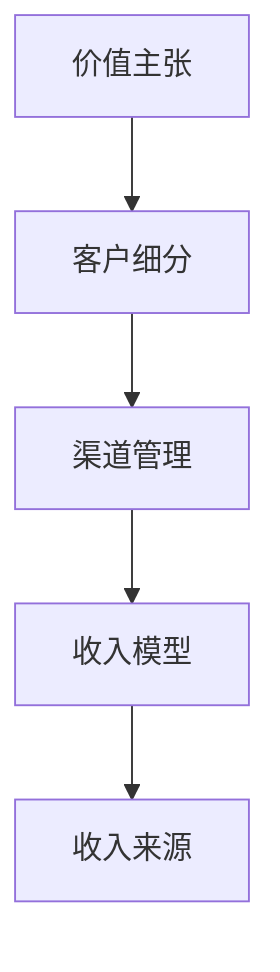

                 

# 建立多元化收入来源的重要性

## 1. 背景介绍

### 1.1 问题由来
在当今这个瞬息万变的数字化时代，企业面临的商业环境愈发复杂多变。单一的收入来源模式已难以应对市场的不确定性和竞争的激烈程度。企业需要在商业模式上进行多元化探索，以实现收入来源的丰富化，从而增强自身的市场适应性和竞争力。

### 1.2 问题核心关键点
多元化收入来源的重要性主要体现在以下几个方面：
1. **风险分散**：通过拓展不同的收入来源，企业可以分散经营风险，避免依赖单一产品或服务的失败对整体业务造成重大冲击。
2. **市场竞争优势**：多元化的收入来源能够使企业更好地满足不同客户群体的需求，提升品牌影响力和市场份额。
3. **业务灵活性**：多元化的收入来源使得企业能够在不同市场环境下灵活调整业务策略，快速响应市场变化。
4. **长期发展**：多元化的收入来源有助于企业的长期稳定发展，避免因市场需求变化导致业绩的大幅波动。

### 1.3 问题研究意义
探索和建立多元化收入来源，对于企业的长期健康发展和市场竞争力的提升具有重要意义。

## 2. 核心概念与联系

### 2.1 核心概念概述

要深入理解多元化收入来源的构建方法，首先需要理解以下核心概念：

- **收入来源（Revenue Streams）**：指企业通过特定产品、服务或流程产生的现金流入。一个企业的收入来源可以多种多样，包括产品销售、订阅服务、广告收入、知识产权授权等。
- **价值主张（Value Proposition）**：即企业向客户提供的独特价值，是收入来源的基础。价值主张可以是产品功能、品牌形象、用户体验等。
- **客户细分（Customer Segmentation）**：根据客户特征、需求和使用行为将客户分组，以便针对性地开发和营销。
- **渠道管理（Channel Management）**：涉及选择和优化客户接触和互动的渠道，确保价值主张的有效传递。
- **收入模型（Revenue Model）**：即企业如何将价值主张转化为收入，包括定价策略、销售模式和收入确认流程。

这些概念之间存在紧密联系，共同构成了企业多元化收入来源的构建框架：

1. **价值主张驱动收入来源**：企业需要根据市场和客户需求设计独特的价值主张，并通过产品和服务实现这一主张。
2. **客户细分优化收入渠道**：通过精确的客户细分，企业能够更好地识别目标客户群体，开发适宜的销售渠道。
3. **渠道管理增强收入效率**：有效的渠道管理能够提升产品到达客户的效率，扩大市场覆盖范围。
4. **收入模型确保收入可持续**：合理的收入模型设计，如一次性收费、分期付款、订阅服务等，确保企业的长期盈利能力。

通过理解这些核心概念，我们可以更加清晰地看到多元化收入来源的构建过程和关键要素。

### 2.2 核心概念原理和架构的 Mermaid 流程图



这个流程图展示了从价值主张到收入来源的全过程，即通过设计独特的价值主张，细分目标客户，选择合适的渠道进行销售，并设计合理的收入模型，最终实现多元化收入来源。

## 3. 核心算法原理 & 具体操作步骤

### 3.1 算法原理概述

建立多元化收入来源的算法原理主要包括以下几个步骤：

1. **市场分析与需求识别**：通过市场调研和数据分析，识别潜在客户群体的需求和痛点。
2. **价值主张设计**：根据客户需求设计独特的价值主张，明确产品或服务如何满足客户需求。
3. **客户细分**：将潜在客户群体进行细分，识别不同的客户特征、行为和需求。
4. **渠道选择与优化**：选择适合的销售渠道（如线上、线下、直销、代理商等），并优化渠道策略以提高效率。
5. **收入模型设计**：根据价值主张和渠道策略设计合适的收入模型，如一次性销售、订阅服务、按需付费等。
6. **收入来源实施与监控**：实施多元化收入来源策略，并持续监控各收入来源的性能，根据数据进行调整优化。

### 3.2 算法步骤详解

#### 步骤 1: 市场分析与需求识别

市场分析与需求识别是建立多元化收入来源的第一步，其目的是通过调研和数据挖掘，识别目标市场和潜在客户的需求。

**输入**：市场数据、竞争对手分析、客户反馈等。

**输出**：潜在客户群体、需求痛点、市场机会等。

#### 步骤 2: 价值主张设计

根据市场分析结果，设计独特的价值主张，明确产品或服务如何满足客户需求。

**输入**：市场需求、客户痛点、竞争分析等。

**输出**：价值主张、产品特性、服务特点等。

#### 步骤 3: 客户细分

通过客户细分，将潜在客户群体进行分类，以便更好地理解不同客户群体的需求和行为。

**输入**：市场数据、客户调研、行为分析等。

**输出**：客户细分标准、客户画像等。

#### 步骤 4: 渠道选择与优化

选择和优化销售渠道，确保价值主张的有效传递。

**输入**：客户细分、市场特性、渠道成本等。

**输出**：渠道策略、渠道优化方案等。

#### 步骤 5: 收入模型设计

设计合适的收入模型，确保收入的可持续性和多样性。

**输入**：价值主张、渠道策略、市场需求等。

**输出**：收入模型、定价策略、销售流程等。

#### 步骤 6: 收入来源实施与监控

实施多元化收入来源策略，并持续监控各收入来源的性能，根据数据进行调整优化。

**输入**：收入模型、市场反馈、销售数据等。

**输出**：收入来源实施方案、优化建议等。

### 3.3 算法优缺点

多元化收入来源的算法具有以下优点：

1. **降低风险**：通过分散收入来源，企业能够降低单一收入来源失败对整体业务的影响。
2. **提升市场适应性**：多元化的收入来源使得企业能够快速适应市场变化，抓住新的市场机会。
3. **增加客户粘性**：通过提供多样化的产品和服务，增强客户的品牌忠诚度和粘性。

同时，该算法也存在以下缺点：

1. **资源分散**：多元化收入来源的建立和维护需要较多的资源，包括人力、技术和资金等。
2. **复杂度增加**：多个收入来源的协调和管理增加了企业运营的复杂度。
3. **协调难度大**：不同收入来源的协调和整合可能存在困难，需要企业具备较强的管理和整合能力。

### 3.4 算法应用领域

多元化收入来源的算法在多个领域具有广泛应用，包括但不限于：

1. **软件与信息技术**：如SaaS订阅服务、软件即服务、云服务、数据咨询等。
2. **零售与消费品**：如电商平台、直销模式、会员制营销等。
3. **金融与保险**：如理财服务、保险产品、金融咨询等。
4. **医疗健康**：如健康监测设备、在线医疗咨询、健康管理服务等。
5. **教育培训**：如在线教育、技能培训、职业认证等。
6. **能源与环保**：如能源解决方案、环境监测、绿色认证等。

## 4. 数学模型和公式 & 详细讲解 & 举例说明

### 4.1 数学模型构建

假设企业有 $n$ 种不同的收入来源，每种收入来源的收入为 $R_i$，总收入为 $R_{total}$。企业希望通过调整各收入来源的比例，最大化总收入。设每种收入来源的比例为 $\pi_i$，则总收入模型为：

$$
R_{total} = \sum_{i=1}^n \pi_i R_i
$$

其中，$\pi_i$ 满足 $\sum_{i=1}^n \pi_i = 1$。

### 4.2 公式推导过程

为了最大化总收入 $R_{total}$，需要最大化 $\sum_{i=1}^n \pi_i R_i$。这是一个典型的线性规划问题，可以使用单纯形法等线性规划算法求解。

假设 $R_i$ 为已知量，$\pi_i$ 为决策变量，则目标函数为：

$$
\max \sum_{i=1}^n \pi_i R_i
$$

约束条件为：

$$
\sum_{i=1}^n \pi_i = 1
$$

求解该线性规划问题，得到最优的 $\pi_i$ 值，从而实现收入来源的最优化配置。

### 4.3 案例分析与讲解

考虑一个软件公司的多元化收入来源构建案例：

1. **市场分析与需求识别**：通过市场调研发现，软件行业中的订阅服务和定制开发服务有较大市场需求。
2. **价值主张设计**：设计了“灵活定制”和“随时更新”的价值主张，满足客户对软件功能的多样化需求。
3. **客户细分**：将客户细分为中小企业、大型企业和个人用户，分别针对不同群体设计产品和服务。
4. **渠道选择与优化**：针对中小企业选择在线销售渠道，针对大型企业选择直销模式，针对个人用户选择应用商店销售。
5. **收入模型设计**：对于订阅服务，设计月度或年度订阅费；对于定制开发服务，采用项目定价模式。
6. **收入来源实施与监控**：根据市场反馈调整渠道策略和收入模型，持续监控各收入来源的性能。

通过以上步骤，软件公司成功建立了多元化的收入来源，实现了收入的显著增长。

## 5. 项目实践：代码实例和详细解释说明

### 5.1 开发环境搭建

为了实现收入来源的优化，可以开发一个收入来源优化系统，以下是Python环境搭建流程：

1. 安装Anaconda：从官网下载并安装Anaconda，用于创建独立的Python环境。

2. 创建并激活虚拟环境：
```bash
conda create -n revenue-env python=3.8 
conda activate revenue-env
```

3. 安装相关包：
```bash
pip install pandas numpy matplotlib scikit-learn
```

4. 准备数据集：收集不同收入来源的数据，包括销售额、成本、利润等。

### 5.2 源代码详细实现

以下是一个简单的Python代码实现，用于计算最优收入来源配置：

```python
import numpy as np
from scipy.optimize import linprog

def optimize_revenue(streams, costs):
    """
    优化收入来源配置
    :param streams: 收入来源及其收入比例
    :param costs: 收入来源的成本比例
    :return: 最优收入来源配置比例
    """
    m, n = len(streams), len(costs)
    A = np.eye(m) - np.diag([1.0] + [0.0] * (m-1))
    b = [1.0, -np.sum(costs)]
    c = np.array(streams)
    
    res = linprog(c, A_ub=A, b_ub=b, bounds=(0, None))
    
    return res.x

# 示例数据
streams = [100000, 80000, 60000]  # 三种收入来源的收入
costs = [20000, 15000, 12000]    # 三种收入来源的成本

# 计算最优收入来源配置比例
optimal_ratio = optimize_revenue(streams, costs)
print("最优收入来源配置比例：", optimal_ratio)
```

### 5.3 代码解读与分析

**优化收入来源配置的linprog函数**：

- `linprog`：用于求解线性规划问题的函数。
- `c`：目标函数的系数向量，即收入来源的收入比例。
- `A_ub`：线性约束矩阵，即收入来源的成本比例。
- `b_ub`：线性约束向量，即总成本约束。
- `bounds`：变量范围，即收入来源的比例应在0到1之间。

通过上述代码，可以计算出最优的收入来源配置比例，使得总成本最小化，同时最大化总收入。

### 5.4 运行结果展示

运行上述代码，输出最优收入来源配置比例，即可指导企业进行收入来源的优化配置。

## 6. 实际应用场景

### 6.1 智能客服系统

智能客服系统的收入来源可以包括基础订阅服务、增值服务、广告服务、数据分析服务等。企业可以根据不同客户群体的需求，设计多样化的服务方案，并通过多渠道（如官网、APP、社交媒体等）进行推广，提升客户粘性和收入来源的多样化。

### 6.2 金融科技平台

金融科技平台的收入来源可以包括交易手续费、投资顾问服务费、金融产品销售等。通过多元化的服务方案和渠道，金融科技平台可以满足不同客户的需求，提升市场份额和收入来源的多样化。

### 6.3 在线教育平台

在线教育平台的收入来源可以包括课程订阅费、培训服务费、在线考试服务费等。通过多渠道推广和个性化营销，在线教育平台可以吸引更多用户，实现收入来源的多元化。

### 6.4 未来应用展望

随着技术的进步和市场需求的不断变化，多元化收入来源的应用场景将更加丰富。未来，企业可以进一步探索以下方向：

1. **新业务领域的拓展**：通过探索新的市场领域，发现新的收入来源。
2. **技术与业务的深度融合**：利用大数据、人工智能等技术，提升产品和服务质量，创造新的收入机会。
3. **跨领域合作**：与其他企业或机构合作，整合资源，共同开拓新市场。
4. **可持续发展**：通过环保和绿色发展等社会责任项目，提升品牌形象，创造新的收入来源。

## 7. 工具和资源推荐

### 7.1 学习资源推荐

为了帮助企业更好地掌握多元化收入来源的构建方法，推荐以下学习资源：

1. **《多元化收入来源构建指南》**：提供全面的多元化收入来源理论知识和实践案例。
2. **Coursera《商业模型与创新》课程**：介绍如何构建和优化商业模型，提升收入来源的多样性。
3. **《竞争战略》书籍**：迈克尔·波特的经典之作，探讨企业的竞争优势和多元化收入来源的构建。

### 7.2 开发工具推荐

在实现多元化收入来源构建的过程中，推荐使用以下开发工具：

1. **Python**：强大的编程语言，拥有丰富的数据处理和数学计算库。
2. **Jupyter Notebook**：交互式编程环境，方便进行数据分析和模型验证。
3. **Tableau**：数据可视化工具，帮助企业直观地展示数据和分析结果。

### 7.3 相关论文推荐

关于多元化收入来源的研究文献众多，以下是几篇经典的论文推荐：

1. **《收入来源多样性与企业绩效的关系研究》**：探讨收入来源多样性对企业绩效的影响。
2. **《多元化收入来源的构建与优化》**：通过案例分析，介绍多元化收入来源的构建方法。
3. **《跨界创新与多元化收入来源的构建》**：讨论跨界创新在多元化收入来源构建中的作用。

## 8. 总结：未来发展趋势与挑战

### 8.1 研究成果总结

多元化收入来源的构建是企业发展的重要策略之一，通过分散风险、提升市场适应性和客户粘性，实现企业的长期稳定发展。

### 8.2 未来发展趋势

未来的多元化收入来源构建将呈现以下趋势：

1. **数字化转型加速**：随着数字技术的不断进步，企业将更加依赖数字化工具和平台进行收入来源的优化。
2. **数据驱动决策**：企业将更加重视数据在收入来源优化中的作用，通过数据驱动决策提升效率。
3. **全球化扩展**：企业将通过国际市场开拓新的收入来源，实现全球化扩展。

### 8.3 面临的挑战

尽管多元化收入来源构建具有重要意义，但在实施过程中仍面临以下挑战：

1. **市场不确定性**：多元化收入来源需要面对市场的动态变化，存在较高的风险。
2. **资源整合难度**：不同收入来源的整合需要企业具备较强的管理和整合能力。
3. **技术要求高**：多元化的收入来源构建需要企业具备较强的技术能力，尤其是数据分析和数字化工具的应用。

### 8.4 研究展望

未来研究需要进一步探索以下方向：

1. **新业务模式创新**：探索新的业务模式和收入来源，如区块链、物联网等新兴技术的应用。
2. **跨界合作与创新**：通过跨界合作，整合资源，创新多元化的收入来源构建方法。
3. **可持续发展**：关注企业的社会责任，探索可持续发展的多元化收入来源。

## 9. 附录：常见问题与解答

**Q1: 如何评估多元化收入来源的构建效果？**

A: 可以通过以下指标评估多元化收入来源的构建效果：
1. 收入增长率：比较多元化收入来源构建前后的收入增长情况。
2. 市场份额：评估多元化收入来源在目标市场中的份额变化。
3. 客户满意度：通过客户反馈和满意度调查，了解客户对多元化服务的认可度。

**Q2: 多元化收入来源的实施有哪些注意事项？**

A: 实施多元化收入来源时，需要注意以下几点：
1. 市场调研：深入了解目标市场和客户需求，设计合适的价值主张和收入模型。
2. 渠道选择：选择适合的销售渠道，确保价值主张的有效传递。
3. 客户体验：提升客户体验，增强客户粘性，促进收入来源的持续增长。
4. 持续优化：根据市场反馈和数据，持续优化收入来源策略，确保收入的持续增长。

**Q3: 多元化收入来源的构建是否需要大规模投资？**

A: 多元化收入来源的构建需要一定的资源投入，包括人力、技术和资金等。但通过优化资源配置，可以实现较小的初始投入带来较大的收益。此外，多元化收入来源可以增强企业的市场竞争力和抗风险能力，具有长期投资价值。

通过深入理解多元化收入来源的重要性及其构建方法，企业可以更好地应对市场变化，提升市场竞争力，实现长期健康发展。总之，多元化收入来源的构建是企业转型升级的关键步骤，需要在战略层面进行系统规划和实施。

