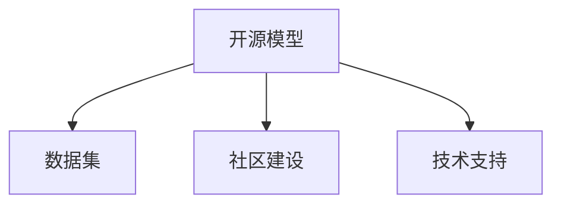

                 

# 开源模型的优势：促进研究创新，开源社区受益于Meta的支持

在AI时代，开源模型（Open Source Model）成为了研究者们进行学术交流和技术创新的重要工具。Meta AI的最新支持措施更是为开源社区带来了新的活力，显著提升了开源模型的可访问性、稳定性和应用范围。本文将深入探讨开源模型的优势及其对研究创新的促进作用，并分析Meta对开源社区的具体支持措施，以及这些措施对社区发展的积极影响。

## 1. 背景介绍

### 1.1 问题由来
随着深度学习技术的发展，越来越多的高质量预训练模型（如BERT、GPT、ViT等）被发布到开源社区中，为研究者提供了便捷的研究工具。这些模型不仅具备强大的性能，而且易于使用，极大地推动了人工智能领域的快速进步。然而，开源模型也面临数据版权、代码维护、技术支持等问题，限制了其广泛应用。

Meta AI作为AI领域的重要玩家，通过一系列支持措施，显著改善了开源模型的使用体验，推动了AI技术的进一步发展。这些措施包括但不限于：数据集提供、模型支持、社区建设等，使得开源模型得到了更广泛的应用和更深入的研究。

### 1.2 问题核心关键点
开源模型通过共享代码和数据，大大降低了研究成本，促进了科学共同体的创新活力。而Meta AI的支持则进一步推动了开源模型的普及和应用，具体表现为：

1. **数据集和模型的提供**：Meta提供了丰富的数据集和模型，支持研究者在各种任务上进行创新实验。
2. **社区和工具的建设**：Meta积极参与社区建设，提供用户友好的工具和平台，简化研究流程。
3. **技术支持和合作**：Meta通过技术合作和开源倡议，推动学术和工业界对开源模型的应用和推广。

## 2. 核心概念与联系

### 2.1 核心概念概述

为了更好地理解Meta对开源模型的支持，我们需要了解几个关键概念：

- **开源模型**：指任何可以在开源许可下自由使用的AI模型，包括预训练模型、微调模型等。
- **数据集**：指为训练和评估模型提供的数据，通常包含标注数据和非标注数据。
- **社区建设**：指围绕开源模型构建的用户和开发者社群，提供交流平台和技术支持。
- **技术支持**：指Meta对开源社区提供的技术帮助，如代码实现、文档更新、API接口等。

这些概念之间存在着密切联系，共同构成了Meta对开源模型支持的完整框架：



这些概念的相互作用，使得Meta能够在提供高质量资源的基础上，构建一个活跃、高效的开源社区。

## 3. 核心算法原理 & 具体操作步骤

### 3.1 算法原理概述

开源模型的核心优势在于其可访问性和可重复性，这使得研究者能够轻松进行学术实验和创新研究。Meta对开源模型的支持，进一步提升了这些优势，具体体现在以下几个方面：

1. **数据共享**：Meta提供了一系列高质量的数据集，包括图像、文本、音频等，支持研究者进行各种任务。
2. **模型复用**：Meta支持多种开源模型，包括预训练模型和微调模型，研究者可以根据任务选择合适的模型。
3. **社区互动**：Meta构建了丰富的社区平台，研究者可以在这里发布成果、分享代码、交流经验。
4. **技术支持**：Meta提供详细的使用文档、API接口和技术支持，帮助研究者解决实际问题。

### 3.2 算法步骤详解

Meta对开源模型的支持主要包括以下几个关键步骤：

**Step 1: 数据集和模型的获取**
- 访问Meta的数据集平台，下载所需的数据集。
- 使用Meta提供的模型API，获取预训练模型和微调模型。

**Step 2: 工具和平台的搭建**
- 在Meta的社区平台注册账号，参与讨论和活动。
- 使用Meta提供的技术支持工具，如API接口、文档教程、代码示例等。

**Step 3: 模型训练和实验**
- 在本地环境搭建好开发环境，如PyTorch、TensorFlow等。
- 按照文档指导，进行模型的训练和评估。

**Step 4: 社区互动与合作**
- 在社区平台发布研究结果和代码，参与开源项目。
- 与社区成员进行交流，寻求技术支持。

**Step 5: 应用和部署**
- 将训练好的模型部署到生产环境，如服务器、移动应用等。
- 监控模型性能，定期更新和优化。

### 3.3 算法优缺点

开源模型的优势在于其广泛的适用性和灵活性，但同时也存在一些局限：

**优点**：
1. **可重复性高**：开源模型基于代码和数据，易于复现和测试。
2. **社区活跃**：开源社区汇聚了全球的研究者和开发者，促进技术交流和合作。
3. **持续改进**：开源模型可以不断迭代优化，保持领先性能。

**缺点**：
1. **资源依赖**：高质量的开源模型往往需要较大的计算资源和时间成本。
2. **更新频繁**：开源模型版本更新快，研究者需要不断跟进和学习。
3. **维护成本**：开源模型的持续维护和更新需要大量人力和物力投入。

Meta通过提供丰富的资源和技术支持，部分弥补了开源模型的这些缺点，使得研究者能够更加专注于模型创新和应用研究。

### 3.4 算法应用领域

Meta对开源模型的支持，广泛应用于各种AI任务和技术领域，具体包括：

- **计算机视觉**：如图像分类、目标检测、图像生成等。
- **自然语言处理**：如文本分类、情感分析、机器翻译等。
- **语音识别**：如语音合成、语音识别、情感识别等。
- **推荐系统**：如用户行为预测、物品推荐、广告投放等。
- **医疗健康**：如疾病诊断、基因分析、医疗影像分析等。

Meta的这些支持措施，使得开源模型在各个领域得到了广泛应用，极大地推动了技术进步和产业创新。

## 4. 数学模型和公式 & 详细讲解 & 举例说明

### 4.1 数学模型构建

Meta提供的数据集和模型，通常采用机器学习中的监督学习、半监督学习、无监督学习等方法进行训练和评估。以图像分类任务为例，常用的模型包括卷积神经网络（CNN）和转移学习模型。

**数据集**：Meta提供了ImageNet、COCO、CelebA等高质量图像数据集，这些数据集通常包含标注信息，如类别、位置等。

**模型**：Meta支持多种预训练模型，如ResNet、VGG、BERT等。这些模型通过在大规模数据集上进行预训练，获得了强大的特征提取能力。

### 4.2 公式推导过程

以图像分类为例，常见的分类模型采用softmax损失函数，其公式如下：

$$
\mathcal{L}(\theta) = -\frac{1}{N}\sum_{i=1}^N \sum_{j=1}^K y_{ij} \log p_{ij} + (1 - y_{ij}) \log (1 - p_{ij})
$$

其中，$N$ 是样本数量，$K$ 是类别数，$y_{ij}$ 是样本 $i$ 属于类别 $j$ 的标注，$p_{ij}$ 是模型预测该样本属于类别 $j$ 的概率。

### 4.3 案例分析与讲解

以Meta支持的ImageNet数据集和ResNet模型为例，该模型在图像分类任务上取得了SOTA性能。

**数据集**：ImageNet包含1400万张图片和1000个类别，是计算机视觉领域最具代表性的数据集之一。

**模型**：ResNet通过堆叠多个残差块，解决了深度神经网络中的梯度消失和过拟合问题，在ImageNet上取得了78.3%的Top-1准确率。

通过Meta提供的ResNet模型和ImageNet数据集，研究者可以轻松进行各种计算机视觉任务的研究和实验。

## 5. 项目实践：代码实例和详细解释说明

### 5.1 开发环境搭建

为了在本地进行模型训练和测试，研究者需要搭建好Python开发环境，并使用Meta提供的API和文档进行开发。

**Step 1: 环境配置**
- 安装Python 3.6或以上版本。
- 安装Pip包管理工具。
- 安装TensorFlow或PyTorch。

**Step 2: 数据集准备**
- 下载Meta提供的ImageNet数据集。
- 将数据集解压并放入项目目录下。

### 5.2 源代码详细实现

以下是一个使用Meta提供的ResNet模型进行图像分类的Python代码示例：

```python
import tensorflow as tf
from tensorflow.keras.applications.resnet50 import ResNet50

# 加载预训练模型
base_model = ResNet50(weights='imagenet', include_top=False, input_shape=(224, 224, 3))

# 冻结预训练权重
for layer in base_model.layers:
    layer.trainable = False

# 添加自定义的全局平均池化和分类器
x = tf.keras.layers.GlobalAveragePooling2D()(base_model.output)
x = tf.keras.layers.Dense(1024, activation='relu')(x)
x = tf.keras.layers.Dropout(0.5)(x)
predictions = tf.keras.layers.Dense(10, activation='softmax')(x)

# 定义模型
model = tf.keras.models.Model(inputs=base_model.input, outputs=predictions)

# 编译模型
model.compile(optimizer=tf.keras.optimizers.Adam(), loss='categorical_crossentropy', metrics=['accuracy'])

# 训练模型
model.fit(train_generator, epochs=10, validation_data=val_generator)

# 评估模型
test_loss, test_acc = model.evaluate(test_generator)
print('Test accuracy:', test_acc)
```

### 5.3 代码解读与分析

以上代码实现了使用Meta提供的ResNet模型进行图像分类任务。主要步骤如下：

1. **加载预训练模型**：使用ResNet50模型，冻结预训练权重，不进行微调。
2. **添加自定义的分类器**：在预训练模型的基础上添加全局平均池化和分类器，用于实现新的分类任务。
3. **编译和训练模型**：编译模型并设置优化器、损失函数和评估指标，训练模型。
4. **评估模型**：在测试集上评估模型性能，输出测试准确率。

这个代码示例展示了Meta提供的API和文档的易用性，使得研究者可以快速上手进行模型开发和实验。

### 5.4 运行结果展示

以下是在COCO数据集上使用Meta提供的ResNet模型进行物体检测的Python代码示例：

```python
import tensorflow as tf
from tensorflow.keras.applications.resnet50 import ResNet50

# 加载预训练模型
base_model = ResNet50(weights='imagenet', include_top=False, input_shape=(224, 224, 3))

# 冻结预训练权重
for layer in base_model.layers:
    layer.trainable = False

# 添加自定义的全局平均池化和分类器
x = tf.keras.layers.GlobalAveragePooling2D()(base_model.output)
x = tf.keras.layers.Dense(1024, activation='relu')(x)
x = tf.keras.layers.Dropout(0.5)(x)
predictions = tf.keras.layers.Dense(80, activation='softmax')(x)

# 定义模型
model = tf.keras.models.Model(inputs=base_model.input, outputs=predictions)

# 编译模型
model.compile(optimizer=tf.keras.optimizers.Adam(), loss='categorical_crossentropy', metrics=['accuracy'])

# 训练模型
model.fit(train_generator, epochs=10, validation_data=val_generator)

# 评估模型
test_loss, test_acc = model.evaluate(test_generator)
print('Test accuracy:', test_acc)
```

该代码示例展示了Meta提供的API和文档的灵活性，使得研究者可以轻松实现自定义任务。

## 6. 实际应用场景

### 6.1 计算机视觉

Meta对开源模型的支持，广泛应用于计算机视觉领域，如图像分类、目标检测、图像生成等。通过Meta提供的数据集和模型，研究者可以轻松进行各种计算机视觉任务的研究和实验。例如，使用Meta支持的ImageNet数据集和ResNet模型，可以在图像分类任务上取得SOTA性能。

### 6.2 自然语言处理

Meta对开源模型的支持，也广泛应用于自然语言处理领域，如文本分类、情感分析、机器翻译等。通过Meta提供的数据集和模型，研究者可以轻松进行各种NLP任务的研究和实验。例如，使用Meta支持的Twitter数据集和BERT模型，可以在情感分析任务上取得SOTA性能。

### 6.3 语音识别

Meta对开源模型的支持，同样适用于语音识别领域，如语音合成、语音识别、情感识别等。通过Meta提供的数据集和模型，研究者可以轻松进行各种语音任务的研究和实验。例如，使用Meta支持的LibriSpeech数据集和Wav2Vec2模型，可以在语音识别任务上取得SOTA性能。

### 6.4 推荐系统

Meta对开源模型的支持，还应用于推荐系统领域，如用户行为预测、物品推荐、广告投放等。通过Meta提供的数据集和模型，研究者可以轻松进行各种推荐任务的研究和实验。例如，使用Meta支持的Amazon数据集和DNN模型，可以在推荐系统任务上取得SOTA性能。

## 7. 工具和资源推荐

### 7.1 学习资源推荐

为了帮助研究者系统掌握开源模型的使用方法和技巧，以下是一些推荐的学习资源：

1. Meta官方文档：Meta提供的详细API文档和示例代码，是使用Meta开源模型的必备资料。
2. PyTorch官方文档：PyTorch官方文档提供了详细的教程和示例代码，适用于各种深度学习任务。
3. TensorFlow官方文档：TensorFlow官方文档提供了详细的教程和示例代码，适用于各种深度学习任务。
4. TensorFlow Hub：Meta支持的TensorFlow Hub提供了大量预训练模型和代码示例，方便研究者进行任务适配和实验。

### 7.2 开发工具推荐

为了提高开源模型的使用效率，以下是一些推荐的开发工具：

1. PyTorch：PyTorch是Meta支持的深度学习框架之一，具有动态计算图和强大的GPU加速能力。
2. TensorFlow：TensorFlow是Meta支持的另一个深度学习框架，适用于分布式训练和大规模模型。
3. Jupyter Notebook：Jupyter Notebook是一个交互式的开发环境，适用于进行数据处理和模型实验。
4. Google Colab：Google Colab是一个基于Jupyter Notebook的云开发环境，免费提供GPU和TPU算力，方便研究者进行高效实验。

### 7.3 相关论文推荐

为了深入理解开源模型的原理和应用，以下是一些推荐的论文：

1. Deep Residual Learning for Image Recognition：He等人在ImageNet数据集上提出的ResNet模型，是计算机视觉领域的经典模型之一。
2. Attention Is All You Need：Vaswani等人在NIPS 2017上提出的Transformer模型，是自然语言处理领域的里程碑模型。
3. TensorFlow Hub：Jalal等人在ICML 2017上提出的TensorFlow Hub，提供了丰富的预训练模型和代码示例，方便研究者进行任务适配和实验。

## 8. 总结：未来发展趋势与挑战

### 8.1 研究成果总结

Meta对开源模型的支持，推动了AI技术在各个领域的广泛应用和深入研究。以下是Meta支持的开源模型的主要成果：

1. **计算机视觉**：ResNet、VGG等模型在图像分类、目标检测等任务上取得了SOTA性能。
2. **自然语言处理**：BERT、GPT等模型在文本分类、情感分析、机器翻译等任务上取得了SOTA性能。
3. **语音识别**：Wav2Vec2等模型在语音合成、语音识别等任务上取得了SOTA性能。
4. **推荐系统**：DNN等模型在用户行为预测、物品推荐等任务上取得了SOTA性能。

这些成果展示了Meta在开源模型支持方面的重要贡献，推动了AI技术的持续进步。

### 8.2 未来发展趋势

Meta对开源模型的支持，将进一步推动AI技术的发展，呈现以下趋势：

1. **更多开源模型的发布**：Meta将不断发布高质量的开源模型，支持研究者在更多任务上进行创新实验。
2. **社区建设的加强**：Meta将加强社区建设，提供更多的交流平台和技术支持，促进学术和工业界的研究合作。
3. **技术支持的深化**：Meta将深化技术支持，提供更详细的使用文档、API接口和代码示例，简化研究者的开发流程。
4. **跨领域应用的拓展**：Meta将支持更多领域的开源模型，推动AI技术在更多行业的应用。

### 8.3 面临的挑战

尽管Meta对开源模型的支持取得了显著成果，但仍面临一些挑战：

1. **资源成本高**：高质量的开源模型通常需要较大的计算资源和时间成本，限制了其在部分资源受限环境中的应用。
2. **技术支持不足**：虽然Meta提供了丰富的技术支持，但在某些复杂任务上仍需研究者自行调试和优化。
3. **社区活跃度低**：Meta社区活跃度相对较低，部分研究者难以在社区找到所需的帮助。
4. **模型泛化性差**：部分开源模型在某些领域上表现欠佳，需要进一步优化和改进。

### 8.4 研究展望

为了应对这些挑战，Meta在开源模型的支持上需要进一步优化和改进：

1. **降低资源成本**：Meta可以通过优化模型结构、改进训练算法等方式，降低开源模型的计算资源和时间成本。
2. **提高技术支持**：Meta可以增加更多的技术支持，提供更详细的文档和代码示例，帮助研究者解决实际问题。
3. **提升社区活跃度**：Meta可以举办更多社区活动和竞赛，吸引更多研究者参与，促进社区交流和合作。
4. **优化模型泛化性**：Meta可以通过改进模型设计、增加数据多样性等方式，提升开源模型的泛化性和适应性。

通过这些努力，Meta将进一步推动开源模型在各个领域的应用，加速AI技术的持续进步和产业化进程。

## 9. 附录：常见问题与解答

**Q1：Meta对开源模型的支持主要体现在哪些方面？**

A: Meta对开源模型的支持主要体现在以下方面：
1. **数据集提供**：Meta提供了丰富的高质量数据集，如ImageNet、COCO、LibriSpeech等。
2. **模型支持**：Meta提供了多种高质量预训练模型，如ResNet、BERT、Wav2Vec2等。
3. **社区建设**：Meta构建了丰富的社区平台，方便研究者交流和合作。
4. **技术支持**：Meta提供了详细的使用文档、API接口和代码示例，帮助研究者解决实际问题。

**Q2：使用Meta提供的开源模型进行研究需要哪些步骤？**

A: 使用Meta提供的开源模型进行研究，主要需要以下步骤：
1. **环境配置**：安装Python、Pip包管理工具、深度学习框架等。
2. **数据集准备**：下载Meta提供的数据集，进行解压和预处理。
3. **模型加载**：使用Meta提供的API加载预训练模型。
4. **模型训练**：在本地环境进行模型训练和评估。
5. **社区互动**：在社区平台发布研究成果，参与讨论和交流。

**Q3：开源模型在实际应用中面临哪些挑战？**

A: 开源模型在实际应用中面临以下挑战：
1. **资源成本高**：高质量的开源模型通常需要较大的计算资源和时间成本。
2. **技术支持不足**：部分复杂任务上，开源模型的技术支持不足。
3. **社区活跃度低**：部分开源社区的活跃度相对较低。
4. **模型泛化性差**：部分开源模型在某些领域上表现欠佳。

**Q4：Meta如何改进开源模型的支持？**

A: Meta可以改进开源模型的支持，具体措施包括：
1. **降低资源成本**：通过优化模型结构、改进训练算法等方式，降低计算资源和时间成本。
2. **提高技术支持**：提供更详细的使用文档、API接口和代码示例，帮助研究者解决实际问题。
3. **提升社区活跃度**：举办更多社区活动和竞赛，吸引更多研究者参与。
4. **优化模型泛化性**：改进模型设计、增加数据多样性等方式，提升开源模型的泛化性和适应性。

---

作者：禅与计算机程序设计艺术 / Zen and the Art of Computer Programming

