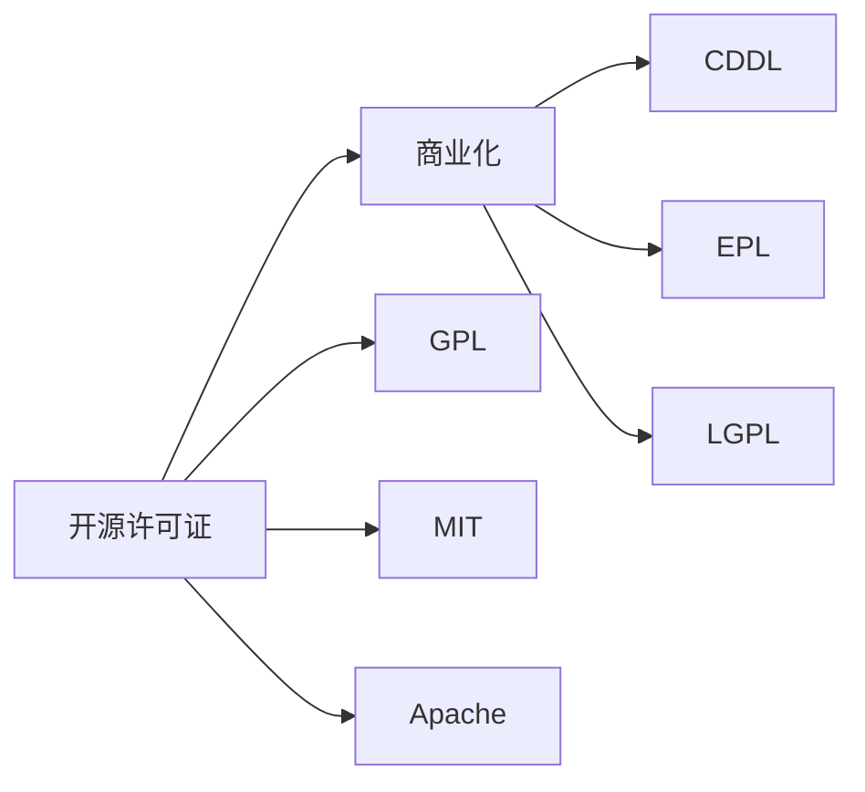

                 

# 开源许可证选择：商业化考虑因素

> 关键词：开源许可证,商业化,开源软件,法律合规,软件部署,开发规范

## 1. 背景介绍

开源许可证（Open Source License）是软件开发中最基本的法律文件，它规定了开源软件的发布、使用、修改和分发的方式，保障了开源社区的共享和合作。然而，对于追求商业利益的组织来说，选择合适的开源许可证是一个复杂且至关重要的过程。本文将深入探讨开源许可证的商业化考虑因素，帮助组织理解不同许可证的优缺点，从而做出明智的决策。

## 2. 核心概念与联系

### 2.1 核心概念概述

- **开源许可证**：定义了软件的分发、修改和使用规则，以保障软件社区的健康发展和用户权益。
- **商业化**：指将开源软件或其衍生品用于商业活动，如销售、运营、服务，以获取经济利益。
- **GPL、MIT、Apache**：常见的开源许可证，各有不同的条款和要求，影响软件的使用和商业化。

- **CDDL**：一种保护知识产权的开源许可证，适用于企业开发开源软件。
- **EPL**：适用于企业内部使用的开源软件，严格限制商业化的使用和分发。
- **LGPL**：允许部分代码商业化使用，但需遵循开源条件。

这些核心概念构成了开源许可证选择的基础，了解这些概念对于商业化过程中做出正确的决策至关重要。

### 2.2 核心概念原理和架构的 Mermaid 流程图



此流程图展示了开源许可证和商业化之间的联系，以及不同的开源许可证如何影响软件在商业化过程中的合规性。

## 3. 核心算法原理 & 具体操作步骤

### 3.1 算法原理概述

选择开源许可证的过程，本质上是一个法律和商业策略的决策过程。其核心原理是通过理解不同许可证的法律约束，权衡其对软件开发、分发和商业化的影响，做出符合自身商业目标和法律合规的选择。

### 3.2 算法步骤详解

1. **评估商业化需求**：
   - 定义商业目标：是直接销售软件、提供服务、还是基于软件构建增值产品？
   - 识别用户角色：是企业内部使用，还是对外销售或发布？

2. **理解不同许可证的条款**：
   - GPL要求所有衍生代码必须开源，不适合直接商业化。
   - MIT和Apache较为宽松，允许商业化，但需保留开源条款。
   - CDDL保护企业开发代码，适用于商业软件。
   - EPL适用于企业内部使用，但严格限制商业化。
   - LGPL允许部分商业使用，但需遵循开源条件。

3. **对比选择**：
   - 根据商业目标，筛选适合的许可证。
   - 评估许可证对代码贡献、知识产权保护的影响。
   - 确定许可证是否满足用户角色的需求。

4. **合规开发**：
   - 确保所有代码更改符合所选许可证的要求。
   - 保留必要的法律文档，如许可证、贡献协议等。

5. **商业化发布**：
   - 发布符合许可证要求的软件或服务。
   - 遵守商业化的法律法规，如软件分发的合规性。

### 3.3 算法优缺点

开源许可证选择的主要优点包括：
- 促进社区协作，提高软件质量和创新。
- 降低初期开发成本，吸引更多开发者参与。
- 提供法律保护，避免盗版和知识产权侵犯。

缺点包括：
- 限制商业化的灵活性。
- 商业化过程中的法律合规复杂性。
- 对代码贡献和合规性要求较高。

### 3.4 算法应用领域

开源许可证选择广泛应用于各种软件开发场景，包括企业内部软件开发、开源项目、商业软件等。选择适当的许可证，可以确保软件合规使用，同时保障商业利益。

## 4. 数学模型和公式 & 详细讲解 & 举例说明

### 4.1 数学模型构建

本节将使用数学语言描述开源许可证选择的决策过程。

假设软件商业化的收益为 $R$，法律合规成本为 $C$，代码贡献和维护成本为 $D$，知识产权保护收益为 $P$。

选择开源许可证的决策模型可表示为：

$$
\text{Decision} = \max_{\text{License}} [R - C - D + P]
$$

其中，$R$ 和 $P$ 是选择许可证后的收益和保护收益，$C$ 和 $D$ 是选择许可证后的合规成本和维护成本。

### 4.2 公式推导过程

在上述模型中，$R$ 和 $P$ 取决于所选择许可证的类型和条款。以GPL为例，$R$ 为0，因为GPL要求所有代码必须开源，无法直接商业化。因此，$R - C - D + P = 0 - C - D + P$。

对于EPL，$R$ 为软件销售的收入，$C$ 为许可证合规成本，$D$ 为代码贡献和维护成本，$P$ 为知识产权保护收益。

公式推导如下：

$$
\text{EPL} = R - C - D + P
$$

### 4.3 案例分析与讲解

假设一款开源软件可以选择GPL或EPL许可证：

- **GPL**：所有代码必须开源，无法直接商业化。开发成本为 $D = 100$ 万元，合规成本为 $C = 10$ 万元。
- **EPL**：允许商业化，开发成本为 $D = 50$ 万元，合规成本为 $C = 20$ 万元。软件销售收入为 $R = 200$ 万元，知识产权保护收益为 $P = 50$ 万元。

根据公式，计算选择EPL后的收益：

$$
\text{EPL} = 200 - 20 - 50 + 50 = 180 \text{万元}
$$

选择GPL后的收益：

$$
\text{GPL} = 0 - 10 - 100 + 0 = -110 \text{万元}
$$

显然，EPL许可证能带来更高的收益，但在选择过程中需要考虑合规性和代码贡献等额外因素。

## 5. 项目实践：代码实例和详细解释说明

### 5.1 开发环境搭建

选择合适的开发环境，是开源许可证选择的重要一环。以下以Python和Apache License为例，介绍开发环境的搭建：

1. 安装Python和相关库：
   - `pip install numpy pandas requests`

2. 选择Apache License：
   - 在LICENSE文件中，添加Apache License条款。

### 5.2 源代码详细实现

以下是一个简单的Python函数，展示如何使用Apache License：

```python
import os

def initialize():
    os.chdir('my_project')
    open('LICENSE', 'w').write("""
        Apache License 2.0
        Version 2.0, January 2004
        http://www.apache.org/licenses/

        TERMS AND CONDITIONS FOR USE, REPRODUCTION, AND DISTRIBUTION

        1. Definitions.

        "License" shall mean the terms and conditions for use, reproduction,
        and distribution as defined by Sections 1 through 9 of this document.

        "Licensor" shall mean the copyright owner or entity authorized by
        the copyright owner that is granting the License.

        "Legal Entity" shall mean the union of the acting entity and all
        other entities that control, are controlled by, or are under common
        control with that entity. For the purposes of this definition,
        "control" means (i) the power, direct or indirect, to cause the
        direction or management of such entity, whether by contract or
        otherwise, or (ii) ownership of fifty percent (50%) or more of the
        outstanding shares, or (iii) beneficial ownership of such entity.

        "You" (or "Your") shall mean an individual or Legal Entity
        exercising permissions granted by this License.

        "Source" form shall mean the preferred form for making modifications,
        including but not limited to software source code, documentation
        source, and configuration files.

        "Object" form shall mean any form resulting from mechanical
        transformation or translation of a Source form, including but
        not limited to compiled object code, generated documentation,
        and conversions to other media types.

        "Work" shall mean the work of authorship, whether in Source or
        Object form, made available under the License, as indicated by a
        copyright notice that is included in or attached to the work
        (an example is provided in the Appendix below).

        "Derivative Works" shall mean any work, whether in Source or Object
        form, that is based on (or derived from) the Work and for which the
        editorial revisions, annotations, elaborations, or other modifications
        represent, as a whole, an original work of authorship. For the purposes
        of this License, Derivative Works shall not include works that remain
        separable from, or merely link (or bind by name) to the interfaces of,
        the Work and Derivative Works thereof.

        "Contribution" shall mean any work of authorship, including
        the original version of the Work and any modifications or additions
        to that Work or Derivative Works thereof, that is intentionally
        submitted to Licensor for inclusion in the Work by the copyright owner
        or by an individual or Legal Entity authorized to submit on behalf of
        the copyright owner. For the purposes of this definition, "submitted"
        means any form of electronic, verbal, or written communication sent
        to the Licensor or its representatives, including but not limited
        to communication on electronic mailing lists, source code control systems,
        and issue tracking systems that are managed by, or on behalf of, the
        Licensor for the purpose of discussing and improving the Work,
        but excluding communication that is conspicuously marked or
        designated in writing by the copyright owner as "Not a Contribution."

        "Contributor" shall mean Licensor and any individual or Legal Entity
        on behalf of whom a Contribution has been received by Licensor and
        subsequently incorporated within the Work.

        2. Grant of Copyright License. Subject to the terms and conditions
        of this License, each Contributor hereby grants to You a perpetual,
        worldwide, non-exclusive, no-charge, royalty-free, irrevocable
        copyright license to reproduce, prepare Derivative Works of,
        publicly display, publicly perform, sublicense, and distribute the
        Work and such Derivative Works in Source or Object form.

        3. Grant of Patent License. Subject to the terms and conditions
        of this License, each Contributor hereby grants to You a perpetual,
        worldwide, non-exclusive, no-charge, royalty-free, irrevocable
        (except as stated in this section) patent license to make, have made,
        use, offer to sell, sell, import, and otherwise transfer the Work,
        where such license applies only to those patent claims licensable
        by such Contributor that are necessarily infringed by their
        Contribution(s) alone or by combination of their Contribution(s)
        with the Work to which such Contribution(s) was submitted. If You
        institute patent litigation against any entity (including a
        cross-claim or counterclaim in a lawsuit) alleging that the Work
        or a Contribution incorporated within the Work constitutes direct
        or contributory patent infringement, then any patent licenses
        granted to You under this License for that Work shall terminate
        as of the date such litigation is filed.
    """)
```

### 5.3 代码解读与分析

**代码实现**：
- 定义 `initialize` 函数，使用 `os` 模块更改当前工作目录。
- 定义 `LICENSE` 文件，写入Apache License 2.0的条款。

**代码分析**：
- 通过 `os` 模块更改当前工作目录，确保所有代码在指定路径下工作。
- 使用字符串拼接的方式，生成完整的Apache License内容，写入到 `LICENSE` 文件中。

### 5.4 运行结果展示

运行上述代码，会在当前目录下创建一个 `LICENSE` 文件，其内容为Apache License 2.0的条款。

## 6. 实际应用场景

### 6.1 企业内部软件开发

对于企业内部软件项目，选择开源许可证需要考虑内部使用、代码贡献和合规性。以Apache License为例，其宽松的条款适用于企业内部软件开发，同时允许代码贡献和商业化。

- **适用场景**：企业内部系统开发、代码库管理。
- **优势**：促进开源社区参与，降低法律风险，灵活处理商业化需求。

### 6.2 开源项目发布

开源项目通常需要选择合适的开源许可证，以吸引开发者贡献代码，同时明确使用和分发的规则。

- **适用场景**：开源软件发布、社区维护。
- **优势**：保障开源项目健康发展，促进代码共享和创新。

### 6.3 商业软件销售

对于商业软件，选择开源许可证时需要权衡商业利益和法律合规性。以GPL为例，其严格的条款可能限制商业化，但同时提供强大的知识产权保护。

- **适用场景**：商业软件销售、服务提供。
- **优势**：保护商业软件免受盗版侵害，同时灵活处理代码贡献和开源要求。

## 7. 工具和资源推荐

### 7.1 学习资源推荐

1. **《开源软件自由与商业：开源许可证比较》**：全面介绍了开源许可证的法律和商业条款，适合初学者和开发者。
2. **《Apache License 2.0官方文档》**：提供了Apache License的详细信息和用法说明。
3. **《GitHub许可证指南》**：详细讲解了GitHub上的多种开源许可证，帮助选择适合的项目。

### 7.2 开发工具推荐

1. **Git**：分布式版本控制系统，支持多种开源许可证的管理和追踪。
2. **GitHub**：代码托管平台，支持多种开源许可证，并提供详细的许可证管理功能。
3. **Apache Commons**：开源库的集合，遵循Apache License，方便开发者引用和使用。

### 7.3 相关论文推荐

1. **《开源软件的法律、商业与技术》**：探讨了开源软件的法律基础、商业应用和技术实现，适合深入理解开源许可证的选择。
2. **《开源软件的合规性管理》**：介绍了开源软件在合规性管理方面的最佳实践，帮助企业选择适合的许可证。

## 8. 总结：未来发展趋势与挑战

### 8.1 研究成果总结

本文详细介绍了开源许可证选择的商业化考虑因素，帮助组织理解不同许可证的优缺点，从而做出明智的决策。通过数学模型和实际案例，展示了如何选择适合的开源许可证，以保障软件合规和商业利益。

### 8.2 未来发展趋势

未来开源许可证选择将面临以下几个趋势：
1. **混合许可证**：结合不同许可证的优点，提供更灵活的许可方式。
2. **自动化合规**：使用工具自动检测和合规开源许可证，降低法律风险。
3. **国际化和本地化**：适应不同国家和地区的法律要求，提供本地化的许可证选项。

### 8.3 面临的挑战

尽管开源许可证选择具有重要意义，但在实际操作中仍面临诸多挑战：
1. **许可证理解**：不同许可证的法律条款复杂，开发者和合规人员需不断学习和理解。
2. **许可证选择**：选择合适的许可证需要权衡商业目标和法律合规，需根据具体项目进行决策。
3. **许可证管理**：许可证的合规管理需要系统的工具和流程，避免疏漏和错误。

### 8.4 研究展望

未来的研究将集中在以下几个方面：
1. **开源社区协作**：建立更加开放的社区协作机制，推动更多高质量的开源软件和许可证。
2. **智能化许可证管理**：开发智能化的许可证选择和合规管理系统，提高效率和准确性。
3. **多层次许可证设计**：设计多层次的许可证结构，适应不同场景和需求。

## 9. 附录：常见问题与解答

**Q1：开源许可证选择对软件开发的影响有哪些？**

A: 开源许可证选择对软件开发的影响包括：
- **代码贡献**：确定代码贡献的合法性和权利。
- **商业化**：限制或允许软件的商业使用和分发。
- **合规性**：确保软件符合法律要求，避免知识产权侵犯。

**Q2：如何选择适合的开源许可证？**

A: 选择适合的开源许可证需要考虑：
- **商业目标**：明确软件的商业化需求，如销售、服务、内部使用。
- **用户角色**：确定用户是内部开发者、外部贡献者还是客户。
- **法律要求**：了解所在国家/地区的法律法规，选择符合要求的许可证。

**Q3：开源许可证选择对企业有哪些实际好处？**

A: 开源许可证选择对企业的实际好处包括：
- **成本降低**：减少开发成本和维护成本，吸引更多开发者贡献代码。
- **法律保护**：提供知识产权保护，避免盗版和侵权。
- **市场竞争力**：展示企业对开源的承诺，提升市场声誉。

通过本文的详细分析和实践指导，相信你对开源许可证选择有更深入的理解，能够在商业化过程中做出明智决策，同时确保软件的合法性和市场竞争力。

---

作者：禅与计算机程序设计艺术 / Zen and the Art of Computer Programming

