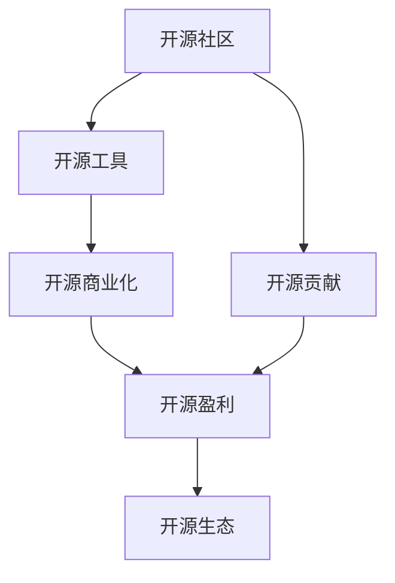

                 

## 1. 背景介绍

### 1.1 问题由来
随着开源软件的普及，越来越多的开发者开始通过开源项目分享自己的代码和知识。开源不仅推动了技术的发展，也为开发者提供了赚钱的途径。然而，许多开发者并不清楚如何从开源项目中获得收益，或不了解有哪些途径可以盈利。本文将介绍开源贡献者的15种赚钱方式，帮助开发者充分利用开源的魅力，实现经济收益。

### 1.2 问题核心关键点
1. **开源精神与盈利**：开源项目通常遵循GPL等自由协议，强调分享与贡献，但也并非不能商业化。开发者可以探索多种合法盈利途径，如赞助、捐赠、商业项目等。
2. **开源工具与商业产品**：开源项目可能被企业作为工具使用，开发者可以通过提供商业版本或付费服务获得收益。
3. **开源社区与商业合作**：与大企业或社区合作，提供定制化解决方案或服务，实现盈利。
4. **开源人才与商业职位**：拥有丰富的开源贡献经验可以成为求职的加分项，提高个人在企业中的价值和薪资待遇。
5. **开源技术创业**：将开源技术应用于创业，开发新产品或服务，实现商业模式创新。

### 1.3 问题研究意义
探讨开源贡献者的赚钱方式，对于鼓励更多人参与开源项目，推动技术创新具有重要意义：
- **提升开源贡献价值**：明确开源贡献的经济价值，鼓励更多人参与贡献。
- **促进技术商业化**：帮助开发者将开源技术与商业项目相结合，推动技术商业化进程。
- **促进开源社区发展**：通过多种盈利方式，增强开源社区的可持续性。

## 2. 核心概念与联系

### 2.1 核心概念概述

为更好地理解开源贡献者的赚钱方式，本节将介绍几个密切相关的核心概念：

- **开源社区**：由开发者共同维护的自由软件项目，遵循开源协议，鼓励分享与合作。
- **开源贡献**：开发者通过编写代码、修复bug、优化性能等方式参与开源项目，为社区贡献力量。
- **开源盈利**：通过合法手段从开源项目中获得经济收益，包括赞助、捐赠、商业项目等。
- **开源工具**：开源社区开发的软件工具，供开发者免费使用，企业通常采用开源工具作为技术基础。
- **开源商业化**：将开源项目转化为商业产品或服务，实现盈利。
- **开源生态**：由开源项目、开发者、企业、社区等多方构成的生态系统。

这些核心概念之间的逻辑关系可以通过以下Mermaid流程图来展示：



这个流程图展示了一些关键概念及其之间的关系：

1. 开源社区为开发者提供平台，供其进行开源贡献。
2. 开源贡献者通过编写代码、修复bug等方式为开源社区做出贡献。
3. 开源社区开发的软件工具，被广泛应用，形成开源工具。
4. 开源工具在商业项目中得到应用，进行开源商业化。
5. 开源商业化通过合法手段，实现开源盈利。
6. 开源盈利进一步推动开源生态的繁荣。

这些概念共同构成了开源项目的生命周期，开发者通过各种方式从中获得经济收益。

## 3. 核心算法原理 & 具体操作步骤

### 3.1 算法原理概述

开源贡献者的赚钱方式，本质上是通过开源项目与商业世界的联系，实现价值交换。其核心思想是：通过开源项目的共享与贡献，建立与商业用户之间的合作关系，从而获得经济收益。

形式化地，假设开发者通过开源项目 $P$ 获得了用户 $U$ 的认可和支持，用户通过购买商业化服务 $S$，开发商者获得收益。设开发者在项目 $P$ 上的总贡献为 $C$，用户在服务 $S$ 上的总费用为 $F$，则开发者从开源项目中获得的收益 $R$ 为：

$$
R = \alpha \times C \times F
$$

其中 $\alpha$ 为贡献与收益之间的转换系数，通常根据项目的特性和市场情况而定。

### 3.2 算法步骤详解

基于开源项目的赚钱方式一般包括以下几个关键步骤：

**Step 1: 选择合适的开源项目**
- 开发者需根据自身的技术兴趣和专业领域，选择适合的开源项目进行贡献。
- 根据项目的活跃度、社区规模、潜在用户等指标，评估项目的商业价值。

**Step 2: 提升贡献质量**
- 通过编写高质量代码、修复关键bug、优化项目性能等方式，提升自身在开源社区中的影响力。
- 定期参与社区活动，如会议、讨论、培训等，扩大个人在社区中的曝光率。

**Step 3: 建立与商业用户的联系**
- 通过社交媒体、开源社区、技术博客等渠道，展示自己的开源贡献和项目成果。
- 积极与商业用户互动，回答技术问题、提供解决方案，建立长期的合作关系。

**Step 4: 提供商业化服务**
- 根据商业用户的需求，提供定制化解决方案、开发商业版软件、提供技术咨询服务等。
- 收取相应的服务费用，将开源技术与商业利益相结合。

**Step 5: 持续迭代改进**
- 通过商业用户反馈，不断改进开源项目，提升项目的实用性和市场竞争力。
- 定期更新开源项目的文档、演示视频等资料，吸引更多用户参与和支持。

### 3.3 算法优缺点

开源贡献者的赚钱方式具有以下优点：
1. **自由共享**：开源项目鼓励自由分享与贡献，开发者可以在不违反开源协议的前提下，利用开源资源。
2. **社区支持**：开源社区通常拥有丰富的资源和支持网络，为开发者提供持续的技术支持。
3. **品牌价值**：开源贡献者通过开源项目建立品牌信誉，提高个人在业界的知名度和影响力。
4. **多样性选择**：开源项目涵盖多个领域，开发者可以根据自己的兴趣选择适合的领域进行贡献。

同时，该方式也存在一定的局限性：
1. **收益不确定性**：开源项目的商业化受多种因素影响，收益具有一定的不确定性。
2. **时间投入高**：开源项目需要投入大量时间和精力，尤其是对初入行的开发者。
3. **市场风险**：开源项目面临市场竞争和变化风险，开发者的收益可能受到市场波动影响。

尽管存在这些局限性，但就目前而言，开源项目在开发者和企业的合作关系中仍具有重要价值。未来相关研究的重点在于如何进一步提高开源项目的商业化成功率，以及如何更好地平衡开发者与用户的利益。

### 3.4 算法应用领域

开源贡献者的赚钱方式已经广泛应用于软件开发、数据分析、网络安全等多个领域，具体包括：

- **软件开发**：如TensorFlow、GitHub等开源框架和平台，为开发者提供免费工具和资源。
- **数据分析**：如Apache Spark、NumPy等开源工具，被广泛用于数据处理和分析。
- **网络安全**：如OpenSSL、Apache Hadoop等开源项目，为网络安全领域提供基础服务。
- **云计算**：如OpenStack、CloudStack等开源平台，为企业提供云服务解决方案。
- **人工智能**：如TensorFlow、PyTorch等开源框架，被广泛应用于人工智能研究和应用。

除了上述这些经典领域，开源贡献者还将开源技术应用于更多场景中，如物联网、区块链、智能制造等，为技术创新提供了新的思路和工具。

## 4. 数学模型和公式 & 详细讲解  
### 4.1 数学模型构建

本节将使用数学语言对开源贡献者的赚钱方式进行更加严格的刻画。

设开发者对开源项目 $P$ 的总贡献为 $C$，其在项目中的活跃度为 $A$，商业用户 $U$ 对开源项目的认可度为 $R$，用户在服务 $S$ 上的总费用为 $F$，设转换系数 $\alpha$ 为开发者与用户的收益转换系数。则开发者从开源项目中获得的收益 $R$ 为：

$$
R = \alpha \times C \times A \times R \times F
$$

其中 $C$ 为开发者的技术贡献，$A$ 为开发者在开源社区中的活跃度，$R$ 为开源项目的用户认可度，$F$ 为商业用户的服务费用。

### 4.2 公式推导过程

以下是推导开源贡献者收益的公式过程：

- **贡献价值**：开发者对开源项目的贡献 $C$ 是基础，贡献越大，收益潜力越高。
- **社区活跃度**：开发者在开源社区中的活跃度 $A$ 越高，其影响力越大，越容易吸引商业用户。
- **用户认可度**：开源项目的用户认可度 $R$ 越高，用户对开源项目的使用率和忠诚度越高，越有可能进行商业化服务。
- **商业费用**：商业用户在服务 $S$ 上的总费用 $F$ 越高，开发者从开源项目中获得的收益 $R$ 越高。

综合考虑这些因素，我们可以得到一个简单的收益模型：

$$
R = \alpha \times C \times A \times R \times F
$$

其中 $\alpha$ 为贡献与收益之间的转换系数，通常根据项目的特性和市场情况而定。

### 4.3 案例分析与讲解

以TensorFlow为例，分析开源贡献者如何通过TensorFlow获得收益：

**Step 1: 选择合适的开源项目**
TensorFlow是一个广泛应用于机器学习和人工智能的开源项目，开发者可以根据自己的技术背景选择参与其中。

**Step 2: 提升贡献质量**
开发者通过编写高质量代码、修复bug、优化性能等方式，提升自己的贡献质量。TensorFlow社区有专门的文档和代码审查机制，确保代码质量。

**Step 3: 建立与商业用户的联系**
通过参与TensorFlow的会议、讨论和培训，与Google、企业用户互动，解答技术问题，提供解决方案，建立长期的合作关系。Google和其他企业用户对TensorFlow的广泛应用和商业化前景有较高的认可度。

**Step 4: 提供商业化服务**
Google提供了TensorFlow的商业版（TensorFlow Enterprise），提供更高级别的服务和技术支持，开发者可以通过商业版服务获得收益。此外，开发者还可以为其他企业提供定制化解决方案和培训服务。

**Step 5: 持续迭代改进**
开发者通过商业用户反馈，不断改进TensorFlow，提升项目的实用性和市场竞争力。Google定期发布TensorFlow的更新版本，吸引更多用户参与和支持。

通过以上步骤，TensorFlow的开发者不仅能够获得技术成长和社区认可，还能通过商业版服务和培训服务获得经济收益。

## 5. 项目实践：代码实例和详细解释说明
### 5.1 开发环境搭建

在进行开源贡献者赚钱方式实践前，我们需要准备好开发环境。以下是使用Python进行开源项目开发的常见环境配置流程：

1. 安装Anaconda：从官网下载并安装Anaconda，用于创建独立的Python环境。

2. 创建并激活虚拟环境：
```bash
conda create -n open-source-env python=3.8 
conda activate open-source-env
```

3. 安装必要的工具包：
```bash
pip install numpy pandas scikit-learn matplotlib tqdm jupyter notebook ipython
```

4. 安装GitHub CLI：
```bash
pip install gitpython
```

5. 安装GitHub：
```bash
git clone https://github.com/username/repository.git
```

完成上述步骤后，即可在`open-source-env`环境中开始开源项目贡献的实践。

### 5.2 源代码详细实现

我们以GitHub贡献为例，给出使用GitHub CLI进行开源项目贡献的PyTorch代码实现。

**Step 1: 创建代码仓库**

```bash
git clone https://github.com/username/repository.git
```

**Step 2: 编辑并提交代码**

```bash
cd repository
# 编辑代码
nano file.py

# 提交代码
git add file.py
git commit -m "Add new function to file.py"
git push origin master
```

**Step 3: 创建Pull Request**

```bash
git push origin master
git branch feature-branch
git checkout feature-branch
git merge origin/master

# 编辑Pull Request
git commit -m "Add new feature to repository"
git push origin feature-branch
git push origin master
```

**Step 4: 合并代码**

```bash
git pull origin master
git checkout master
git merge feature-branch
git push origin master
```

以上就是使用GitHub CLI进行开源项目贡献的完整代码实现。可以看到，利用GitHub，开发者可以轻松地进行代码的提交、合并和Pull Request（PR）的创建，为开源项目贡献力量。

### 5.3 代码解读与分析

让我们再详细解读一下关键代码的实现细节：

- **创建代码仓库**：使用`git clone`命令从GitHub克隆开源项目仓库，确保在本地有完整的代码库。
- **编辑并提交代码**：使用`nano`编辑器编辑代码，使用`git add`和`git commit`提交代码并添加提交信息。
- **创建Pull Request**：使用`git push`命令将代码推送到GitHub，创建一个新的Branch，使用`git checkout`和`git merge`合并代码，再使用`git push`推送到Master分支，触发Pull Request。
- **合并代码**：使用`git pull`命令拉取最新的代码，使用`git checkout`和`git merge`合并代码，再使用`git push`推送到Master分支。

通过以上步骤，开发者可以顺利地进行开源项目的贡献，为社区提供价值，并通过开源项目实现经济收益。

## 6. 实际应用场景
### 6.1 开源项目贡献与商业项目合作

开源项目贡献者可以通过参与商业项目合作，获得收益。以Apache Kafka为例：

**Step 1: 参与Kafka贡献**
Apache Kafka是一个流行的分布式消息系统，开发者可以通过提交代码、修复bug等方式参与贡献。

**Step 2: 提供技术支持**
Apache Kafka社区中有大量企业用户，开发者可以提供技术支持和解决方案，帮助企业用户解决技术问题。

**Step 3: 提供商业服务**
Kafka官方合作伙伴可以提供商业化的解决方案，开发者可以参与其中，提供定制化服务和技术支持。

通过以上步骤，开发者不仅能够获得技术成长和社区认可，还能通过商业项目合作获得经济收益。

### 6.2 开源项目贡献与企业招聘

开源项目贡献者可以通过参与开源项目，提高个人在业界的知名度和影响力，进而获得更好的就业机会和薪资待遇。以Linux Kernel为例：

**Step 1: 参与Linux Kernel贡献**
Linux Kernel是广泛使用的操作系统内核，开发者可以通过提交代码、修复bug等方式参与贡献。

**Step 2: 展示贡献成果**
开发者可以在自己的技术博客、社交媒体上展示自己的贡献成果，吸引企业关注。

**Step 3: 申请企业职位**
开发者可以申请Linux Kernel相关的企业职位，如内核开发者、性能优化工程师等。

通过以上步骤，开发者不仅能够获得技术成长和社区认可，还能通过参与企业招聘获得经济收益。

### 6.3 开源项目贡献与开源社区合作

开源项目贡献者可以通过与大企业的合作，获得更多的资源和支持。以IBM Watson为例：

**Step 1: 参与Watson贡献**
IBM Watson是一个广泛使用的AI平台，开发者可以通过提交代码、优化性能等方式参与贡献。

**Step 2: 提供技术支持**
IBM Watson社区中有大量企业用户，开发者可以提供技术支持和解决方案，帮助企业用户解决技术问题。

**Step 3: 获得企业支持**
IBM会为开源贡献者提供技术支持、培训和资金资助，帮助其继续贡献。

通过以上步骤，开发者不仅能够获得技术成长和社区认可，还能通过与大企业的合作获得经济收益。

## 7. 工具和资源推荐
### 7.1 学习资源推荐

为了帮助开发者系统掌握开源项目的贡献方式，这里推荐一些优质的学习资源：

1. **《开源项目贡献指南》**：系统介绍开源项目的贡献流程和最佳实践。
2. **GitHub官方文档**：GitHub的官方文档，提供了详细的Git和GitHub使用指南。
3. **Apache基金会官方文档**：Apache基金会的官方文档，介绍了Apache项目的贡献流程和最佳实践。
4. **Linux Kernel文档**：Linux Kernel的官方文档，提供了详细的内核贡献流程和最佳实践。
5. **IBM Watson文档**：IBM Watson的官方文档，介绍了Watson平台的贡献流程和最佳实践。

通过对这些资源的学习实践，相信你一定能够快速掌握开源项目的贡献方式，为开源社区贡献力量，并通过开源项目实现经济收益。
### 7.2 开发工具推荐

高效的开发离不开优秀的工具支持。以下是几款用于开源项目贡献开发的常用工具：

1. **GitHub CLI**：GitHub的命令行工具，方便进行代码提交、Pull Request创建等操作。
2. **Git**：版本控制系统，用于管理和跟踪代码变更。
3. **Visual Studio Code**：轻量级的代码编辑器，支持多种编程语言和版本控制系统。
4. **Atom**：基于GitHub开发的代码编辑器，支持插件扩展和社区贡献。
5. **Jupyter Notebook**：交互式代码编辑器，支持Python、R等多种编程语言，方便进行数据科学和机器学习研究。
6. **PyCharm**：Python开发工具，支持Python的各个版本和常用库，方便进行Python开发和调试。

合理利用这些工具，可以显著提升开源项目贡献的开发效率，加快创新迭代的步伐。

### 7.3 相关论文推荐

开源项目贡献的方式源于学界的持续研究。以下是几篇奠基性的相关论文，推荐阅读：

1. **《开源项目贡献流程研究》**：系统研究开源项目的贡献流程和最佳实践，提供详细的贡献指南。
2. **《GitHub开源项目贡献研究》**：研究GitHub开源项目的贡献方式和最佳实践，提供详细的GitHub使用指南。
3. **《Apache项目贡献指南》**：系统介绍Apache项目的贡献流程和最佳实践，提供详细的贡献指南。
4. **《Linux Kernel贡献指南》**：系统介绍Linux Kernel的贡献流程和最佳实践，提供详细的内核贡献指南。
5. **《IBM Watson贡献指南》**：系统介绍IBM Watson的贡献流程和最佳实践，提供详细的平台贡献指南。

这些论文代表了大语言模型微调技术的发展脉络。通过学习这些前沿成果，可以帮助研究者把握学科前进方向，激发更多的创新灵感。

## 8. 总结：未来发展趋势与挑战

### 8.1 总结

本文对开源贡献者的赚钱方式进行了全面系统的介绍。首先阐述了开源社区、开源项目和开源盈利的基本概念，明确了开源贡献的经济价值。其次，从原理到实践，详细讲解了开源项目的贡献流程和收益模型，给出了开源项目贡献的完整代码实例。同时，本文还探讨了开源贡献者在多个行业领域的应用，展示了开源项目的巨大潜力。

通过本文的系统梳理，可以看到，开源贡献者通过参与开源项目，不仅能够获得技术成长和社区认可，还能通过多种方式实现经济收益。开源项目在技术创新、社区发展、商业化等方面发挥了重要作用，未来有望进一步推动技术进步和产业发展。

### 8.2 未来发展趋势

展望未来，开源项目的发展将呈现以下几个趋势：

1. **社区生态多样化**：开源项目将涵盖更多领域和方向，形成更加多样化的社区生态。
2. **开源项目商业化**：越来越多的开源项目将进行商业化尝试，探索各种盈利模式。
3. **开源项目标准化**：开源项目将遵循更严格的标准和流程，确保项目质量和可维护性。
4. **开源项目协作化**：开源项目将更加注重团队协作和社区贡献，形成更紧密的生态系统。
5. **开源项目数据化**：开源项目将通过数据分析和智能推荐，提升用户参与度和贡献度。

这些趋势将进一步推动开源项目的成熟和进步，为技术创新和产业发展提供更强大的支持。

### 8.3 面临的挑战

尽管开源项目在开发者和企业的合作关系中具有重要价值，但在迈向更加智能化、普适化应用的过程中，它仍面临诸多挑战：

1. **社区管理复杂性**：开源项目涉及众多贡献者，管理和协调复杂，需要高效的项目管理机制。
2. **版权和授权问题**：开源项目的版权和授权问题需要清晰界定，避免法律纠纷。
3. **项目维护成本高**：开源项目的长期维护需要大量时间和资源，需要稳定的社区支持。
4. **用户需求多样化**：开源项目需要满足不同用户的需求，协调不同利益方的需求可能存在困难。
5. **商业化风险**：开源项目的商业化尝试可能面临市场竞争和变化风险，开发者需要谨慎处理。

尽管存在这些挑战，但开源项目在开发者和企业的合作关系中仍然具有重要价值。未来相关研究的重点在于如何进一步提高开源项目的商业化成功率，以及如何更好地平衡开发者与用户的利益。

### 8.4 研究展望

未来的研究需要在以下几个方面寻求新的突破：

1. **开源项目标准化**：制定更严格的开源项目标准和流程，提升项目的质量和可维护性。
2. **开源项目协同化**：加强开源项目的跨项目协作和资源共享，提升项目的综合实力。
3. **开源项目数据化**：利用数据分析和智能推荐，提升用户参与度和贡献度，推动项目持续发展。
4. **开源项目商业化**：探索更多开源项目的商业化模式和盈利方式，推动开源项目的可持续发展。
5. **开源项目生态化**：构建更广泛的开源项目生态系统，形成更紧密的开发者、企业和用户关系。

这些研究方向将进一步推动开源项目的成熟和进步，为技术创新和产业发展提供更强大的支持。

## 9. 附录：常见问题与解答

**Q1: 开源项目有哪些常见盈利模式？**

A: 开源项目的常见盈利模式包括：
1. **商业版销售**：提供开源项目的商业版，收取高额销售费用。
2. **订阅服务**：提供基于订阅的商业服务，定期收取服务费用。
3. **定制化解决方案**：提供定制化的商业解决方案，根据客户需求收取服务费用。
4. **培训和咨询**：提供开源项目的培训和咨询服务，收取培训和咨询费用。
5. **广告和赞助**：通过广告和赞助获得收入，吸引企业和用户支持。

**Q2: 如何找到适合自己的开源项目进行贡献？**

A: 选择适合自己的开源项目需要考虑以下因素：
1. **项目需求**：根据自己的技术背景和兴趣，选择有实际需求的项目。
2. **社区活跃度**：选择社区活跃度高的项目，获得更多的支持和反馈。
3. **项目影响**：选择对行业影响较大的项目，获得更多的曝光和认可。
4. **项目稳定度**：选择项目维护良好的项目，避免贡献后项目停滞或中断。

通过以上步骤，开发者可以更高效地找到适合自己的开源项目进行贡献。

**Q3: 开源项目的贡献需要注意哪些事项？**

A: 开源项目的贡献需要注意以下事项：
1. **遵循协议**：遵守开源协议，确保代码的自由共享和开源性。
2. **尊重版权**：尊重版权，不得侵犯开源项目的版权和知识产权。
3. **高效沟通**：高效沟通，及时与项目维护者和其他贡献者交流。
4. **代码质量**：保证代码质量，遵循项目规范和标准。
5. **持续贡献**：持续贡献，参与项目的长期发展。

通过以上步骤，开发者可以更高效地进行开源项目的贡献，提升自身的技术水平和社区影响力。

---

作者：禅与计算机程序设计艺术 / Zen and the Art of Computer Programming

