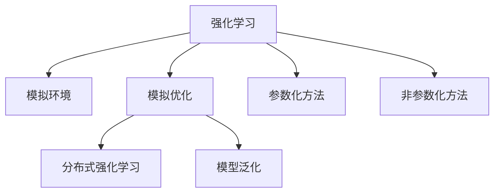

                 

# 强化学习Reinforcement Learning中基于模拟的优化方法研讨

## 1. 背景介绍

### 1.1 问题由来
强化学习(Reinforcement Learning, RL)作为人工智能领域的重要分支，广泛应用于游戏AI、机器人控制、自动驾驶等众多场景。与传统的监督学习和无监督学习不同，强化学习强调智能体与环境的交互，通过不断试错、学习最优策略以实现目标。然而，在大规模问题上，强化学习的训练复杂度往往高不可攀。近年来，基于模拟的优化方法(Simulation-based Optimization, SO)在强化学习中逐步兴起，通过在虚拟环境中进行训练和测试，以显著降低计算资源需求，提升模型性能。

### 1.2 问题核心关键点
基于模拟的优化方法，通过构建与真实环境相似的虚拟环境，使智能体在模拟中学习并验证策略，从而提高模型在实际环境中的鲁棒性和泛化能力。这种优化方法的核心在于：
- 构建模拟环境：通过仿真器模拟真实环境，使智能体能够在没有物理限制的虚拟世界中进行训练和测试。
- 算法设计与优化：设计具有高适应性和鲁棒性的强化学习算法，以优化智能体的决策策略。
- 模型验证与泛化：通过在不同模拟环境中的多次实验，验证智能体的性能，并通过泛化训练，提升在真实环境中的表现。
- 模拟与实证的结合：模拟环境应尽可能地复现真实环境，同时通过实证数据分析指导模拟环境的构建。

本文将聚焦于基于模拟的优化方法在强化学习中的实际应用，详细探讨其原理、算法和实践流程。

## 2. 核心概念与联系

### 2.1 核心概念概述

为更好地理解强化学习中的基于模拟优化方法，本节将介绍几个关键核心概念：

- 强化学习(Reinforcement Learning, RL)：智能体与环境交互，通过奖励信号不断调整策略以实现特定目标的过程。
- 模拟环境(Simulation Environment)：通过仿真技术构建的虚拟环境，与真实环境高度相似，可用于训练和测试智能体。
- 模拟优化(Simulation-based Optimization)：在模拟环境中，通过强化学习算法训练智能体，从而优化其决策策略的过程。
- 模型泛化(Generalization)：智能体在虚拟环境中的表现，能够迁移到真实环境并取得良好表现的能力。
- 分布式强化学习(Distributed Reinforcement Learning)：通过并行化训练，将复杂的大规模问题分割为多个子问题，提高训练效率。
- 参数化与非参数化方法(Parametric and Non-parametric Methods)：根据模型参数是否可训练，分为参数化方法（如Q-Learning）和非参数化方法（如行为克隆）。

这些概念之间的逻辑关系可以通过以下Mermaid流程图来展示：



这个流程图展示了大语言模型的核心概念及其之间的关系：

1. 强化学习通过与环境的交互学习最优策略。
2. 模拟环境构建虚拟环境，模拟真实环境的特征和动态。
3. 模拟优化利用模拟环境进行策略优化，减少计算资源消耗。
4. 模型泛化提升智能体在不同环境中的鲁棒性和泛化能力。
5. 分布式强化学习通过并行化训练提升效率，解决计算瓶颈。
6. 参数化与非参数化方法在模型设计上有所区别，但目标一致。

这些概念共同构成了强化学习中基于模拟优化方法的完整框架，使其能够在各种场景下发挥强大的学习能力。通过理解这些核心概念，我们可以更好地把握强化学习的本质，探索其在实际应用中的优化方法。

## 3. 核心算法原理 & 具体操作步骤
### 3.1 算法原理概述

基于模拟的优化方法，通过在虚拟环境中对智能体进行训练和测试，从而提升其在真实环境中的性能。具体步骤如下：

1. 构建模拟环境：使用仿真技术复现真实环境，包括状态空间、行动空间、奖励函数等。
2. 选择强化学习算法：根据问题特点选择合适的强化学习算法，如Q-Learning、DQN、SAC等。
3. 设计训练流程：定义训练轮数、迭代次数、学习率等关键参数，设定训练终止条件。
4. 在模拟环境中训练：智能体在模拟环境中执行行动，获取奖励并调整策略。
5. 在真实环境中测试：在获取模拟训练结果后，在真实环境中进行测试，评估模型泛化能力。

### 3.2 算法步骤详解

下面以基于模拟的Q-Learning算法为例，详细介绍其实现步骤：

#### 3.2.1 模拟环境构建

**步骤1：定义状态空间**
首先，定义模拟环境的输入空间，即智能体的状态空间。例如，在控制车辆驾驶任务中，状态可以包括车速、位置、姿态等。状态空间可以定义为一个多维向量：

$$ \mathbf{x} = \begin{bmatrix} 
        \dot{x} \\ 
        y \\ 
        \theta 
    \end{bmatrix} $$

**步骤2：定义行动空间**
定义智能体的行动空间，即可以执行的操作。例如，车辆驾驶任务中，行动空间可以是加速、刹车、转向等。

**步骤3：定义奖励函数**
设计奖励函数 $r(\mathbf{x}, a)$，用于评估智能体在当前状态下采取行动的效果。奖励函数可以是基于具体任务设计的。例如，车辆驾驶任务中，在保持安全距离的前提下，加速会增加奖励；但在车距过近时，会立即扣除惩罚。

#### 3.2.2 强化学习算法选择

**Q-Learning算法**
Q-Learning算法是一种基于价值函数的强化学习算法。通过在模拟环境中训练，更新Q值表以选择最优行动策略。具体实现如下：

**步骤1：初始化Q值表**
Q值表 $Q_{\theta}$ 用于存储每个状态-行动对对应的价值评估，初始化为一个全零矩阵：

$$ Q_{\theta}(\mathbf{x}, a) = 0 $$

**步骤2：训练过程**
在模拟环境中执行 $K$ 次迭代训练：
- 在每个时间步，智能体观察当前状态 $\mathbf{x}$，选择行动 $a$，并执行该行动；
- 根据行动 $a$，智能体获得新的状态 $\mathbf{x'}$ 和奖励 $r$；
- 根据观察到的状态和行动，更新Q值表：
$$ Q_{\theta}(\mathbf{x}, a) \leftarrow Q_{\theta}(\mathbf{x}, a) + \alpha (r + \gamma \max_{a'} Q_{\theta}(\mathbf{x'}, a') - Q_{\theta}(\mathbf{x}, a)) $$

其中，$\alpha$ 为学习率，$\gamma$ 为折扣因子。

#### 3.2.3 训练流程设计

**步骤1：设定训练参数**
- 定义训练轮数 $N$ 和每次迭代的步数 $T$；
- 设定学习率 $\alpha$ 和折扣因子 $\gamma$；
- 定义终止条件，如最大训练轮数、最大迭代次数等。

**步骤2：执行训练**
在模拟环境中，按时间步长执行训练，每次迭代更新Q值表。

**步骤3：评估模型**
在真实环境中进行测试，评估智能体在真实环境中的性能。

### 3.3 算法优缺点

基于模拟的优化方法，具有以下优点：
1. 减少计算资源消耗。通过在模拟环境中训练，可以显著降低计算成本，加速模型开发。
2. 提高鲁棒性和泛化能力。虚拟环境的设计可以根据具体任务进行优化，提升模型在不同场景下的表现。
3. 支持分布式并行训练。多个模拟环境可以同时进行训练，提高效率。
4. 灵活调整参数。在模拟环境中，可以快速调整算法参数，以探索最优策略。

同时，该方法也存在一定的局限性：
1. 模拟环境的构建难度较大。需要丰富的领域知识和仿真技术，才能构建与真实环境高度相似的环境。
2. 泛化能力受限。模拟环境与真实环境存在差异，过度依赖模拟训练可能导致泛化能力不足。
3. 数据量有限。模拟环境的数据量有限，可能无法充分覆盖所有可能的情况。
4. 实证分析难度大。在虚拟环境中训练，难以直接通过实证分析其性能和可靠性。

尽管存在这些局限性，但基于模拟的优化方法在大规模强化学习问题上仍具有显著优势。通过合理设计模拟环境和算法，可以进一步优化训练流程，提升模型性能。

### 3.4 算法应用领域

基于模拟的优化方法，在强化学习中的应用已经逐步扩展到多个领域，例如：

- 无人驾驶：通过模拟环境训练自动驾驶模型，优化决策策略以提升安全性和舒适性。
- 工业控制：构建虚拟工厂环境，训练机器人控制策略，优化生产效率和设备维护。
- 游戏AI：利用模拟环境进行训练和测试，优化游戏角色的行为和决策能力。
- 智能制造：通过模拟环境测试智能制造系统，优化生产流程和资源调度。
- 医疗仿真：构建虚拟医疗环境，训练手术机器人，提升手术精度和成功率。
- 航空航天：利用模拟环境进行飞行器控制和任务规划，优化导航和避障策略。

除了上述这些领域，基于模拟的优化方法还将在更多垂直行业得到应用，为各种复杂系统提供高效的训练和优化手段。

## 4. 数学模型和公式 & 详细讲解 & 举例说明

### 4.1 数学模型构建

以车辆驾驶任务为例，定义状态空间 $\mathbf{x} \in \mathbb{R}^n$，行动空间 $a \in \{0, 1, 2\}$，表示加速、刹车、转向。奖励函数 $r(\mathbf{x}, a)$ 根据智能体执行行动后的状态和奖励来计算。

定义Q值表 $Q_{\theta}(\mathbf{x}, a)$，用于存储每个状态-行动对的价值评估，初始化为全零矩阵。

### 4.2 公式推导过程

**Q-Learning算法**
在Q-Learning算法中，通过在模拟环境中不断迭代训练，更新Q值表以选择最优行动策略。具体推导过程如下：

**步骤1：定义状态转移概率**
定义状态转移概率 $P(\mathbf{x'}, \mathbf{x}, a)$，表示在状态 $\mathbf{x}$ 下执行行动 $a$ 后，转移到状态 $\mathbf{x'}$ 的概率：

$$ P(\mathbf{x'}, \mathbf{x}, a) = P(\mathbf{x'} | \mathbf{x}, a) \cdot \mathbb{I}(\mathbf{x'}, \mathbf{x}, a) $$

其中，$P(\mathbf{x'} | \mathbf{x}, a)$ 为状态转移概率密度函数，$\mathbb{I}(\mathbf{x'}, \mathbf{x}, a)$ 为状态转移的指示函数。

**步骤2：定义最优行动策略**
定义最优行动策略 $\pi^*(a|\mathbf{x})$，表示在状态 $\mathbf{x}$ 下，选择行动 $a$ 的概率：

$$ \pi^*(a|\mathbf{x}) = \frac{e^{\alpha Q_{\theta}(\mathbf{x}, a)}}{\sum_{a'} e^{\alpha Q_{\theta}(\mathbf{x}, a')}} $$

**步骤3：定义状态-行动价值函数**
定义状态-行动价值函数 $V_{\theta}(\mathbf{x}, a)$，表示在状态 $\mathbf{x}$ 下，采取行动 $a$ 的期望奖励：

$$ V_{\theta}(\mathbf{x}, a) = \sum_{\mathbf{x'}, a'} P(\mathbf{x'} | \mathbf{x}, a) \cdot Q_{\theta}(\mathbf{x'}, a') $$

**步骤4：定义目标函数**
定义目标函数 $J(\theta)$，表示智能体的期望总奖励：

$$ J(\theta) = \mathbb{E}_{\pi} [\sum_{t=0}^{\infty} \gamma^t r(\mathbf{x}_t, a_t)] $$

**步骤5：定义Q值表更新公式**
通过上述公式，可以定义Q值表更新公式：

$$ Q_{\theta}(\mathbf{x}, a) \leftarrow Q_{\theta}(\mathbf{x}, a) + \alpha (r + \gamma \max_{a'} Q_{\theta}(\mathbf{x'}, a') - Q_{\theta}(\mathbf{x}, a)) $$

其中，$\alpha$ 为学习率，$\gamma$ 为折扣因子。

### 4.3 案例分析与讲解

以车辆驾驶任务为例，分析Q-Learning算法的实际应用：

**步骤1：定义状态空间**
假设车辆的状态由速度 $v$、位置 $x$ 和方向 $\theta$ 组成：

$$ \mathbf{x} = \begin{bmatrix} 
        v \\ 
        x \\ 
        \theta 
    \end{bmatrix} $$

**步骤2：定义行动空间**
定义三个行动，分别表示加速、刹车、转向：

$$ a \in \{0, 1, 2\} $$

**步骤3：定义奖励函数**
设计奖励函数 $r(\mathbf{x}, a)$，以鼓励智能体在保持安全距离的前提下，加速并避免碰撞：

$$ r(\mathbf{x}, a) = \left\{
        \begin{array}{ll}
            +1, & \text{if } v < v_{\text{max}} \\
            0, & \text{if } v = v_{\text{max}} \\
            -1, & \text{if } v > v_{\text{max}} \\
        \end{array}
    \right.$$

**步骤4：初始化Q值表**
初始化Q值表为全零矩阵：

$$ Q_{\theta}(\mathbf{x}, a) = 0 $$

**步骤5：训练过程**
在模拟环境中执行 $K$ 次迭代训练：
- 在每个时间步，智能体观察当前状态 $\mathbf{x}$，选择行动 $a$，并执行该行动；
- 根据行动 $a$，智能体获得新的状态 $\mathbf{x'}$ 和奖励 $r$；
- 根据观察到的状态和行动，更新Q值表：
$$ Q_{\theta}(\mathbf{x}, a) \leftarrow Q_{\theta}(\mathbf{x}, a) + \alpha (r + \gamma \max_{a'} Q_{\theta}(\mathbf{x'}, a') - Q_{\theta}(\mathbf{x}, a)) $$

通过不断迭代训练，Q值表会逐步优化，智能体能够选择最优行动策略以实现驾驶任务。

## 5. 项目实践：代码实例和详细解释说明

### 5.1 开发环境搭建

在进行强化学习项目实践前，我们需要准备好开发环境。以下是使用Python进行Reinforcement Learning开发的环境配置流程：

1. 安装Anaconda：从官网下载并安装Anaconda，用于创建独立的Python环境。

2. 创建并激活虚拟环境：
```bash
conda create -n reinforcement-env python=3.8 
conda activate reinforcement-env
```

3. 安装PyTorch和Gym：
```bash
conda install pytorch torchvision torchaudio gym
```

4. 安装相关库：
```bash
pip install numpy matplotlib sklearn
```

完成上述步骤后，即可在`reinforcement-env`环境中开始强化学习项目实践。

### 5.2 源代码详细实现

以下是以车辆驾驶任务为例，使用Gym库实现Q-Learning算法的代码实现。

```python
import gym
import numpy as np
import matplotlib.pyplot as plt
import random

env = gym.make('MountainCar-v0')
env.render()

state_dim = env.observation_space.shape[0]
action_dim = env.action_space.n
reward_threshold = 195.0

Q = np.zeros((state_dim, action_dim))
alpha = 0.1
gamma = 0.9
epsilon = 0.1
epochs = 1000

for i in range(epochs):
    state = env.reset()
    done = False
    
    while not done:
        if random.uniform(0, 1) < epsilon:
            action = env.action_space.sample()
        else:
            action = np.argmax(Q[state])
        
        next_state, reward, done, _ = env.step(action)
        
        Q[state, action] += alpha * (reward + gamma * np.max(Q[next_state]) - Q[state, action])
        state = next_state

    if np.max(Q) >= reward_threshold:
        print("Training successful!")
        break

env.close()
plt.plot(Q)
plt.show()
```

### 5.3 代码解读与分析

让我们再详细解读一下关键代码的实现细节：

**状态和行动的定义**
```python
env = gym.make('MountainCar-v0')
env.render()
```

Gym库提供了多种环境和任务，这里我们使用MountainCar-v0环境。该环境定义了一个单自由度系统，智能体需要通过加速和转向控制车辆，从山底开到山顶。

**Q值表的初始化**
```python
state_dim = env.observation_space.shape[0]
action_dim = env.action_space.n
reward_threshold = 195.0

Q = np.zeros((state_dim, action_dim))
```

定义状态空间和行动空间的大小，并初始化Q值表为全零矩阵。

**训练过程**
```python
for i in range(epochs):
    state = env.reset()
    done = False
    
    while not done:
        if random.uniform(0, 1) < epsilon:
            action = env.action_space.sample()
        else:
            action = np.argmax(Q[state])
        
        next_state, reward, done, _ = env.step(action)
        
        Q[state, action] += alpha * (reward + gamma * np.max(Q[next_state]) - Q[state, action])
        state = next_state
```

在每个epoch中，智能体在环境中执行一次训练。每次训练中，智能体观察当前状态，选择行动，并执行该行动。根据行动后的状态和奖励，更新Q值表。

**参数设置**
```python
alpha = 0.1
gamma = 0.9
epsilon = 0.1
epochs = 1000
```

定义学习率、折扣因子和探索率等训练参数。

**测试和输出**
```python
if np.max(Q) >= reward_threshold:
    print("Training successful!")
    break

env.close()
plt.plot(Q)
plt.show()
```

当智能体在Q值表中达到设定的奖励阈值时，训练成功并输出结果。使用Matplotlib库绘制Q值表。

可以看到，通过上述代码，我们实现了Q-Learning算法在MountainCar-v0环境中的训练过程。代码简洁高效，易于理解和修改。

## 6. 实际应用场景

### 6.1 智能交通系统

基于模拟的优化方法在智能交通系统中的应用，可以显著提升交通流管理和控制能力。传统交通信号灯控制依赖规则或经验，难以适应复杂的交通场景。通过在模拟环境中训练智能交通模型，可以动态调整信号灯和车辆控制策略，优化交通流量，减少拥堵和事故。

在技术实现上，可以构建虚拟交通网络，对不同车辆行为和交通环境进行建模。通过模拟训练，优化红绿灯控制和车辆调度策略，提升道路通行效率和安全性。例如，可以模拟不同天气条件下的交通流，训练智能交通模型以适应多种场景。

### 6.2 航空调度系统

航空调度系统是航空运输管理中的关键环节，直接关系到航班安全和运行效率。传统航空调度依赖人工经验，难以应对复杂的航班延误和突发事件。通过基于模拟的优化方法，可以在虚拟环境中训练航空调度模型，优化航班调度和机场管理。

在具体应用中，可以构建虚拟机场环境，对不同航班行为和气象条件进行建模。通过模拟训练，优化航班调度策略和机场资源分配，提升机场运行效率和航班准点率。例如，可以模拟极端天气条件下的航班调度，训练航空调度模型以优化应对策略。

### 6.3 工业生产系统

工业生产系统对生产效率和产品质量有严格要求。传统生产调度依赖人工经验和规则，难以适应复杂多变的环境。通过在模拟环境中训练工业生产模型，可以优化生产流程和资源调度，提高生产效率和产品质量。

在具体应用中，可以构建虚拟生产环境，对不同生产设备和物料流进行建模。通过模拟训练，优化生产调度策略和设备维护计划，提升生产效率和设备利用率。例如，可以模拟设备故障和原材料短缺情况，训练工业生产模型以优化应对策略。

### 6.4 未来应用展望

随着基于模拟的优化方法在强化学习中的不断探索，未来的应用场景将更加广泛。以下列举几个未来可能的应用领域：

- 智能医疗系统：训练智能诊疗模型，优化治疗方案和医疗资源分配。
- 自动驾驶：训练自动驾驶模型，优化行驶路线和避障策略。
- 机器人控制：训练机器人控制模型，优化操作策略和任务执行。
- 供应链管理：训练供应链管理模型，优化库存管理和物流调度。
- 能源管理系统：训练能源管理系统，优化能源分配和资源利用。
- 金融交易系统：训练金融交易模型，优化交易策略和风险管理。

这些应用领域的大规模问题往往难以在实际环境中进行充分验证，而基于模拟的优化方法提供了一个高效、安全的训练环境，有助于推动人工智能技术在各个行业中的应用。

## 7. 工具和资源推荐

### 7.1 学习资源推荐

为了帮助开发者系统掌握基于模拟的优化方法在强化学习中的应用，这里推荐一些优质的学习资源：

1. 《Reinforcement Learning: An Introduction》书籍：Sutton和Barto所著，全面介绍了强化学习的基本概念和算法，是强化学习领域的经典教材。
2. CS294T《Reinforcement Learning》课程：加州大学伯克利分校开设的强化学习课程，提供丰富的视频资源和作业实践。
3. DeepRL书籍：Lillicrap等所著，详细介绍了深度强化学习的应用和实现，涵盖Q-Learning、DQN、SAC等经典算法。
4. OpenAI Gym库：提供了多种环境模拟器，支持强化学习的训练和测试，是学习强化学习的重要工具。
5. TensorFlow和PyTorch库：提供高效计算图和分布式训练支持，有助于大规模强化学习的实现。
6. Reinforcement Learning Paper Repository：收集了大量强化学习的研究论文，便于学习最新的算法和理论。

通过对这些资源的学习实践，相信你一定能够快速掌握基于模拟的优化方法在强化学习中的应用，并用于解决实际的强化学习问题。

### 7.2 开发工具推荐

高效的开发离不开优秀的工具支持。以下是几款用于强化学习开发的常用工具：

1. Gym库：OpenAI提供的强化学习环境模拟器，支持多种模拟环境和任务。
2. TensorFlow和PyTorch库：提供高效计算图和分布式训练支持，有助于大规模强化学习的实现。
3. Weights & Biases：模型训练的实验跟踪工具，可以记录和可视化模型训练过程中的各项指标，方便对比和调优。
4. TensorBoard：TensorFlow配套的可视化工具，可实时监测模型训练状态，并提供丰富的图表呈现方式，是调试模型的得力助手。
5. Jupyter Notebook：开源的交互式编程环境，支持代码块编辑、数据可视化等，便于开发和分享学习笔记。
6. PyCharm：Python IDE，提供丰富的开发工具和库支持，是Python开发的推荐工具。

合理利用这些工具，可以显著提升强化学习项目的开发效率，加快创新迭代的步伐。

### 7.3 相关论文推荐

基于模拟的优化方法在强化学习中的应用，近年来取得了许多重要的研究成果。以下是几篇奠基性的相关论文，推荐阅读：

1. "Reinforcement Learning for AI-Controlled Traffic Lights"：提出基于模拟的强化学习算法，训练智能交通信号灯控制策略。
2. "Deep Reinforcement Learning for Air Traffic Control"：利用模拟环境训练深度强化学习模型，优化航空调度策略。
3. "A Deep Reinforcement Learning Approach to Inventory Management"：使用基于模拟的强化学习方法，优化供应链管理中的库存和物流调度。
4. "Optimizing Production Systems with Reinforcement Learning"：通过在模拟环境中训练强化学习模型，优化工业生产调度策略。
5. "Reinforcement Learning in Energy Management"：使用基于模拟的优化方法，训练能源管理系统，优化能源分配和利用。

这些论文代表了大语言模型微调技术的发展脉络。通过学习这些前沿成果，可以帮助研究者把握学科前进方向，激发更多的创新灵感。

## 8. 总结：未来发展趋势与挑战

### 8.1 研究成果总结

本文对基于模拟的优化方法在强化学习中的实际应用进行了全面系统的介绍。首先阐述了强化学习的基本原理和基于模拟优化的思想，明确了优化方法在实际应用中的关键价值。其次，从原理到实践，详细讲解了基于模拟的优化方法的具体实现步骤和关键算法，提供了完整的代码实例。同时，本文还广泛探讨了优化方法在智能交通、航空调度、工业生产等多个行业领域的应用前景，展示了其广阔的应用潜力。此外，本文精选了优化方法的各类学习资源，力求为读者提供全方位的技术指引。

通过本文的系统梳理，可以看到，基于模拟的优化方法正在成为强化学习的重要范式，极大地拓展了强化学习的应用边界，推动了相关技术在各行业中的落地应用。未来，伴随算力和仿真技术的进步，优化方法将在更多领域得到广泛应用，提升人工智能系统的性能和可靠性。

### 8.2 未来发展趋势

展望未来，基于模拟的优化方法在强化学习中呈现以下几个发展趋势：

1. 深度学习与强化学习的融合。深度强化学习算法在复杂问题上取得了优异效果，未来将更多地应用于实际应用场景中。
2. 分布式强化学习的广泛应用。随着大规模问题的出现，分布式并行训练将成为强化学习的重要技术手段。
3. 多模态信息的融合。在多模态数据驱动的应用场景中，融合视觉、语音、文本等多模态信息，将显著提升强化学习模型的表现。
4. 非线性奖励函数的优化。通过引入奖励函数设计技巧，如曲线平滑、分段奖励等，提升模型的鲁棒性和泛化能力。
5. 元学习与基于模拟优化的结合。利用元学习思想，使模型能够在多种环境中快速适应和迁移，提升优化效率。
6. 强化学习在真实环境中的测试。构建虚拟与真实环境相结合的测试平台，验证模拟优化方法在实际环境中的泛化能力。

这些趋势凸显了基于模拟的优化方法在强化学习中的重要地位，未来将在更多垂直行业得到应用，为人工智能技术的发展提供新的动力。

### 8.3 面临的挑战

尽管基于模拟的优化方法在强化学习中取得了显著成果，但在其应用和推广过程中仍面临以下挑战：

1. 仿真环境的构建难度。构建高度逼真的虚拟环境，需要丰富的领域知识和仿真技术，增加了开发难度和成本。
2. 数据量的限制。在虚拟环境中进行训练，数据量有限，可能无法充分覆盖所有可能的情况。
3. 优化效率的提升。在分布式和并行化训练中，需要合理设计优化策略，提高训练效率。
4. 模型的可解释性。强化学习模型往往被认为是"黑盒"系统，难以解释其内部工作机制和决策逻辑。
5. 模型的鲁棒性和泛化能力。模型在虚拟环境中的表现可能与真实环境存在差异，过度依赖模拟训练可能导致泛化能力不足。

尽管存在这些挑战，但基于模拟的优化方法在强化学习中的应用前景广阔，通过不断探索和优化，这些挑战终将逐步得到解决，推动强化学习技术在更多实际问题中的落地应用。

### 8.4 研究展望

未来，基于模拟的优化方法在强化学习中需要在以下几个方面进行深入研究：

1. 高保真度的仿真环境构建。结合领域知识和仿真技术，构建高度逼真的虚拟环境，提升模型在真实环境中的表现。
2. 多模态数据的融合。融合视觉、语音、文本等多模态数据，提升强化学习模型的感知能力。
3. 元学习与强化学习的结合。利用元学习思想，使模型能够在多种环境中快速适应和迁移，提升优化效率。
4. 深度强化学习算法的研究。进一步优化深度强化学习算法，提升其在复杂问题上的表现。
5. 模型的可解释性研究。通过引入可解释性技术，如特征重要性分析、梯度分析等，提升强化学习模型的可解释性。
6. 模型的鲁棒性和泛化能力研究。通过合理设计奖励函数和优化策略，提升模型在真实环境中的泛化能力。

这些研究方向将推动基于模拟的优化方法在强化学习中的进一步发展，为人工智能技术的实际应用提供新的技术手段。

## 9. 附录：常见问题与解答

**Q1：基于模拟的优化方法是否适用于所有强化学习问题？**

A: 基于模拟的优化方法适用于大多数强化学习问题，特别是在数据量有限、计算资源受限的场景中。然而，对于某些实时性要求高、对仿真环境响应敏感的问题，可能需要采用实时仿真或混合实仿真方法。

**Q2：如何选择合适的模拟环境？**

A: 选择合适的模拟环境，需要考虑问题的复杂度和模拟环境的构建难度。一般而言，选择与实际环境尽可能相似的模拟环境，并在模拟环境中进行充分验证。同时，可以采用多环境并行训练的方式，提升训练效率和泛化能力。

**Q3：基于模拟的优化方法如何降低训练成本？**

A: 通过在虚拟环境中进行训练，可以显著降低计算资源需求，加速模型开发。同时，可以采用分布式并行训练、模型压缩等技术，进一步优化训练流程，提升训练效率。

**Q4：模拟环境与真实环境存在差异，如何提升模型的泛化能力？**

A: 在构建模拟环境时，尽可能复现真实环境，并在模拟环境中进行充分验证。同时，可以通过调整奖励函数、优化策略等方式，提升模型在真实环境中的泛化能力。

**Q5：如何评估基于模拟的优化方法的效果？**

A: 通过在真实环境中进行测试，评估模型在实际场景中的表现。同时，可以利用统计学方法和可视化工具，分析模型在不同环境中的性能差异，指导模拟环境的构建和优化。

这些问题的解答，可以帮助开发者更好地理解基于模拟的优化方法在强化学习中的应用，并在实际项目中灵活运用。

---

作者：禅与计算机程序设计艺术 / Zen and the Art of Computer Programming

