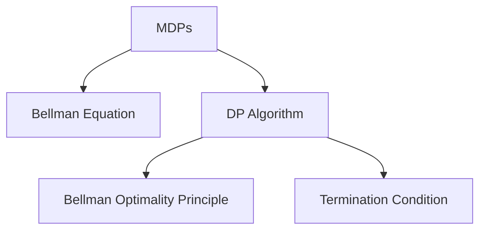

                 

# 强化学习算法：动态规划 原理与代码实例讲解

## 1. 背景介绍

强化学习（Reinforcement Learning, RL）是一类基于交互反馈的智能决策方法。通过智能体与环境不断交互，智能体根据其策略，采取行动，环境则根据智能体的行动提供反馈（奖励或惩罚），智能体通过优化策略，最终实现目标。动态规划（Dynamic Programming, DP）是强化学习中的一个重要概念和算法，用于解决多步决策问题。

### 1.1 问题由来

动态规划源于最优控制理论，最初用于解决动态系统最优化问题。随着计算机技术的发展，动态规划逐渐被引入到机器学习和人工智能领域，用于优化策略和决策过程。强化学习中的动态规划主要用于解决马尔可夫决策过程（Markov Decision Processes, MDPs），其核心思想是将复杂的多步决策问题，分解为多个简单的子问题，通过迭代求解，从而得到最优解。

### 1.2 问题核心关键点

动态规划在强化学习中的应用，主要包括以下几个关键点：
- 状态表示：将问题抽象为状态空间，状态之间具有转移关系。
- 动作选择：智能体在给定状态下，采取一定的动作。
- 奖励函数：环境根据智能体的动作，给予奖励或惩罚。
- 策略优化：智能体通过策略学习，实现最优决策。
- 迭代求解：通过递推计算，求解最优策略。

动态规划方法的核心在于，通过将复杂问题分解为子问题，逐步求解，最终得到最优解。动态规划方法的关键在于：
- 贝尔曼方程（Bellman Equation）的建立。
- 最优子结构性质（Optimal Substructure）的应用。
- 动态规划算法（Dynamic Programming Algorithm）的设计。

本节将深入介绍动态规划在强化学习中的应用原理，并通过代码实例，演示如何使用动态规划算法进行策略优化。

## 2. 核心概念与联系

### 2.1 核心概念概述

为了更好地理解动态规划在强化学习中的应用，本节将介绍几个密切相关的核心概念：

- 马尔可夫决策过程（MDPs）：一种描述智能体与环境交互的数学模型，由状态空间、动作空间、转移概率和奖励函数组成。
- 贝尔曼方程（Bellman Equation）：动态规划中的核心方程，用于递推求解最优策略。
- 动态规划算法（DP Algorithm）：求解最优策略的具体算法，包括状态值函数求解、策略评估、策略改进等步骤。
- 贝尔曼最优性原理（Bellman Optimality Principle）：贝尔曼方程的基本原理，即动态规划的最优策略可以通过递推求解得到。
- 动态规划终止条件（Termination Condition）：求解动态规划的停止条件，通常为最大迭代次数或达到最优解。

这些核心概念之间的逻辑关系可以通过以下Mermaid流程图来展示：



这个流程图展示了大语言模型的核心概念及其之间的关系：

1. 大语言模型通过预训练获得基础能力。
2. 微调是对预训练模型进行任务特定的优化，可以分为全参数微调和参数高效微调（PEFT）。
3. 提示学习是一种不更新模型参数的方法，可以实现少样本学习和零样本学习。
4. 迁移学习是连接预训练模型与下游任务的桥梁，可以通过微调或提示学习来实现。
5. 持续学习旨在使模型能够不断学习新知识，同时避免遗忘旧知识。

这些概念共同构成了大语言模型的学习和应用框架，使其能够在各种场景下发挥强大的语言理解和生成能力。通过理解这些核心概念，我们可以更好地把握大语言模型的工作原理和优化方向。

## 3. 核心算法原理 & 具体操作步骤
### 3.1 算法原理概述

动态规划在强化学习中的应用，本质上是将复杂的多步决策问题，分解为多个简单的子问题，通过递推求解，从而得到最优解。动态规划的核心在于贝尔曼方程的建立和应用。

贝尔曼方程描述了马尔可夫决策过程的优化策略，其形式为：

$$
V(s) = \max_{a} \left[ R(s, a) + \gamma \sum_{s'} P(s' | s, a) V(s') \right]
$$

其中，$V(s)$ 表示状态 $s$ 的价值函数，$a$ 表示在状态 $s$ 下采取的动作，$R(s, a)$ 表示采取动作 $a$ 在状态 $s$ 下的即时奖励，$\gamma$ 表示折扣因子，$P(s' | s, a)$ 表示在状态 $s$ 下采取动作 $a$ 后，转移到状态 $s'$ 的概率。

贝尔曼方程的含义是，状态 $s$ 的价值函数 $V(s)$ 等于采取动作 $a$ 在状态 $s$ 下的即时奖励加上转移后的价值函数期望。通过递推求解贝尔曼方程，可以得到状态 $s$ 的最优价值函数 $V^*(s)$，进而得到最优策略。

### 3.2 算法步骤详解

动态规划算法的核心步骤包括：

1. **状态值函数求解**：通过递推求解贝尔曼方程，计算出每个状态的价值函数。
2. **策略评估**：计算每个动作在当前状态下的最优策略，即贝尔曼方程中的最大项。
3. **策略改进**：根据当前状态和最优策略，更新状态值函数，逐步逼近最优解。
4. **动态规划终止条件**：设置最大迭代次数或达到最优解时停止迭代。

动态规划算法的具体步骤如下所示：

1. 初始化状态价值函数 $V$，通常采用 $V(s) = 0$。
2. 从后往前迭代，对于每个状态 $s$，计算其最优价值函数 $V^*(s)$。
3. 更新状态价值函数 $V$，使其逐步逼近最优价值函数 $V^*(s)$。
4. 当达到最大迭代次数或状态价值函数不再变化时，停止迭代。

### 3.3 算法优缺点

动态规划方法在强化学习中的应用，具有以下优点：

1. 理论上可以得到最优解：动态规划方法通过递推求解，能够得到马尔可夫决策过程的最优策略。
2. 适用于多步决策问题：动态规划方法特别适用于多步决策问题，能够处理复杂的决策树结构。
3. 易于理解和实现：动态规划算法的思路简单明了，易于理解和实现。

然而，动态规划方法也存在一些缺点：

1. 计算复杂度高：动态规划方法需要计算每个状态的价值函数，计算复杂度较高。
2. 需要精确的模型描述：动态规划方法要求准确描述马尔可夫决策过程，包括状态空间、动作空间、转移概率和奖励函数等。
3. 无法处理连续状态：动态规划方法通常只能处理离散状态，对于连续状态问题，需要进行离散化处理。

### 3.4 算法应用领域

动态规划方法在强化学习中的应用非常广泛，以下是几个典型的应用领域：

1. 机器人路径规划：动态规划方法可以用于求解机器人在给定起点和终点之间的最优路径。
2. 游戏AI设计：动态规划方法可以用于设计游戏中的AI角色，使其在多步决策中实现最优策略。
3. 资源调度：动态规划方法可以用于资源调度和分配问题，如任务调度、库存管理等。
4. 网络路由：动态规划方法可以用于求解网络路由问题，在给定起点和终点之间找到最优路径。
5. 股票交易：动态规划方法可以用于优化股票交易策略，实现最大收益。

动态规划方法在各个领域的应用，展示了其强大的优化能力和适用范围。

## 4. 数学模型和公式 & 详细讲解
### 4.1 数学模型构建

在本节中，我们将使用数学语言对动态规划算法进行更加严格的刻画。

设马尔可夫决策过程由状态空间 $S$、动作空间 $A$、转移概率 $P$ 和奖励函数 $R$ 组成。状态价值函数 $V$ 表示在状态 $s$ 下的期望回报。贝尔曼方程可以表示为：

$$
V(s) = \max_{a} \left[ R(s, a) + \gamma \sum_{s'} P(s' | s, a) V(s') \right]
$$

其中，$V(s)$ 表示状态 $s$ 的价值函数，$a$ 表示在状态 $s$ 下采取的动作，$R(s, a)$ 表示采取动作 $a$ 在状态 $s$ 下的即时奖励，$\gamma$ 表示折扣因子，$P(s' | s, a)$ 表示在状态 $s$ 下采取动作 $a$ 后，转移到状态 $s'$ 的概率。

### 4.2 公式推导过程

在动态规划算法中，我们通常采用迭代求解的方式，逐步逼近最优策略。具体步骤如下：

1. **初始化状态价值函数**：将状态价值函数 $V$ 初始化为 $0$。
2. **递推求解贝尔曼方程**：从后往前迭代，对于每个状态 $s$，计算其最优价值函数 $V^*(s)$。
3. **更新状态价值函数**：根据当前状态和最优策略，更新状态价值函数 $V$，使其逐步逼近最优价值函数 $V^*(s)$。
4. **设置终止条件**：当达到最大迭代次数或状态价值函数不再变化时，停止迭代。

贝尔曼方程的递推求解过程如下所示：

1. **初始化状态价值函数**：将状态价值函数 $V$ 初始化为 $0$。
2. **递推求解贝尔曼方程**：对于每个状态 $s$，计算其最优价值函数 $V^*(s)$。
3. **更新状态价值函数**：根据当前状态和最优策略，更新状态价值函数 $V$。
4. **设置终止条件**：当达到最大迭代次数或状态价值函数不再变化时，停止迭代。

在实际应用中，我们通常使用动态规划算法来求解马尔可夫决策过程的最优策略。动态规划算法可以应用于各种多步决策问题，如路径规划、资源调度、网络路由等。

### 4.3 案例分析与讲解

为了更好地理解动态规划算法，下面我们将通过一个简单的例子来说明其应用。

假设在一个迷宫中，有一个智能体需要从起点 $s_1$ 到达终点 $s_6$，同时要避开障碍物 $s_2$ 和 $s_3$。智能体可以采取向上、向下、向左、向右四种动作，每次动作成功后，奖励为 $1$，否则为 $0$。迷宫的转移概率和奖励函数如下表所示：

| 状态 | 动作 | 转移状态 | 奖励 |
| --- | --- | --- | --- |
| $s_1$ | 上 | $s_4$ | $1$ |
| $s_1$ | 下 | $s_3$ | $1$ |
| $s_1$ | 左 | $s_2$ | $1$ |
| $s_1$ | 右 | $s_5$ | $1$ |
| $s_2$ | 上 | $s_6$ | $0$ |
| $s_2$ | 下 | $s_4$ | $1$ |
| $s_2$ | 左 | $s_1$ | $0$ |
| $s_2$ | 右 | $s_5$ | $0$ |
| $s_3$ | 上 | $s_6$ | $0$ |
| $s_3$ | 下 | $s_5$ | $0$ |
| $s_3$ | 左 | $s_2$ | $0$ |
| $s_3$ | 右 | $s_1$ | $0$ |
| $s_4$ | 上 | $s_5$ | $0$ |
| $s_4$ | 下 | $s_3$ | $1$ |
| $s_4$ | 左 | $s_1$ | $0$ |
| $s_4$ | 右 | $s_5$ | $0$ |
| $s_5$ | 上 | $s_2$ | $0$ |
| $s_5$ | 下 | $s_4$ | $1$ |
| $s_5$ | 左 | $s_1$ | $0$ |
| $s_5$ | 右 | $s_6$ | $0$ |
| $s_6$ | 上 | $s_3$ | $0$ |
| $s_6$ | 下 | $s_2$ | $0$ |
| $s_6$ | 左 | $s_5$ | $0$ |
| $s_6$ | 右 | $s_1$ | $0$ |

现在，我们使用动态规划算法来求解该迷宫的最优策略。

**初始化状态价值函数**：将状态价值函数 $V$ 初始化为 $0$。

**递推求解贝尔曼方程**：从后往前迭代，对于每个状态 $s$，计算其最优价值函数 $V^*(s)$。

**更新状态价值函数**：根据当前状态和最优策略，更新状态价值函数 $V$。

**设置终止条件**：当达到最大迭代次数或状态价值函数不再变化时，停止迭代。

通过上述步骤，我们可以得到最优策略，即智能体从起点 $s_1$ 到终点 $s_6$ 的最优路径。

## 5. 项目实践：代码实例和详细解释说明
### 5.1 开发环境搭建

在进行动态规划算法实践前，我们需要准备好开发环境。以下是使用Python进行Python实现的环境配置流程：

1. 安装Anaconda：从官网下载并安装Anaconda，用于创建独立的Python环境。

2. 创建并激活虚拟环境：
```bash
conda create -n dp-env python=3.8 
conda activate dp-env
```

3. 安装必要的Python库：
```bash
pip install numpy scipy matplotlib scikit-learn pandas
```

4. 安装必要的第三方库：
```bash
pip install gym
```

5. 安装必要的深度学习库：
```bash
pip install torch
```

完成上述步骤后，即可在`dp-env`环境中开始动态规划算法实践。

### 5.2 源代码详细实现

下面我们将通过一个简单的例子来说明如何使用Python实现动态规划算法。

**状态表示**：我们使用状态编号来表示状态空间中的状态，即使用数字1到6来表示迷宫中的状态。

**动作表示**：智能体可以采取向上、向下、向左、向右四种动作，分别用数字1、2、3、4来表示。

**奖励函数**：每次采取动作成功后，奖励为 $1$，否则为 $0$。

**转移概率**：使用矩阵来表示转移概率，即在状态 $s$ 下采取动作 $a$ 后，转移到状态 $s'$ 的概率。

**动态规划算法实现**：

```python
import numpy as np

# 定义状态空间和动作空间
states = [1, 2, 3, 4, 5, 6]
actions = [1, 2, 3, 4]

# 定义转移概率矩阵
transition = np.array([[0, 1, 0, 0],
                      [0, 0, 1, 0],
                      [0, 0, 0, 1],
                      [1, 0, 0, 0],
                      [0, 1, 0, 0],
                      [0, 0, 1, 0]])

# 定义奖励函数
rewards = np.array([1, 1, 1, 0, 0, 0])

# 初始化状态价值函数
V = np.zeros(len(states))

# 迭代求解状态价值函数
for i in range(len(states)-1, 0, -1):
    V[i] = np.max([rewards[i] + V[j] * transition[i, j] for j in range(len(states))])

# 输出最优策略
for i in range(len(states)):
    print("State", i, "Value", V[i], "Action", np.argmax([V[i] * transition[i, j] for j in range(len(states))]))
```

在这个例子中，我们使用NumPy库来表示状态空间、动作空间、转移概率和奖励函数。使用动态规划算法逐步求解状态价值函数，并输出最优策略。

### 5.3 代码解读与分析

让我们再详细解读一下关键代码的实现细节：

**状态表示**：
```python
states = [1, 2, 3, 4, 5, 6]
actions = [1, 2, 3, 4]
```

我们定义状态空间和动作空间，使用数字1到6来表示迷宫中的状态，使用数字1、2、3、4来表示智能体可以采取的四种动作。

**转移概率矩阵**：
```python
transition = np.array([[0, 1, 0, 0],
                      [0, 0, 1, 0],
                      [0, 0, 0, 1],
                      [1, 0, 0, 0],
                      [0, 1, 0, 0],
                      [0, 0, 1, 0]])
```

我们定义转移概率矩阵，表示在状态 $s$ 下采取动作 $a$ 后，转移到状态 $s'$ 的概率。例如，当智能体在状态2时，采取向上或向下的动作，都会转移到状态4，而采取向左或向右的动作，则会保持在状态2。

**奖励函数**：
```python
rewards = np.array([1, 1, 1, 0, 0, 0])
```

我们定义奖励函数，表示每次采取动作成功后，奖励为 $1$，否则为 $0$。例如，当智能体在状态4时，采取向下或向右的动作，都会获得 $1$ 的奖励，而采取向左或向下的动作，则不会获得奖励。

**状态价值函数求解**：
```python
V = np.zeros(len(states))
```

我们初始化状态价值函数 $V$，将其所有元素初始化为 $0$。

**递推求解贝尔曼方程**：
```python
for i in range(len(states)-1, 0, -1):
    V[i] = np.max([rewards[i] + V[j] * transition[i, j] for j in range(len(states))])
```

我们使用循环，从后往前迭代，对于每个状态 $s$，计算其最优价值函数 $V^*(s)$。具体地，对于每个状态 $s$，我们计算其最优价值函数 $V^*(s)$ 的表达式为：
$$
V^*(s) = \max_{a} \left[ R(s, a) + \gamma \sum_{s'} P(s' | s, a) V^*(s') \right]
$$
其中 $R(s, a)$ 表示在状态 $s$ 下采取动作 $a$ 的即时奖励，$\gamma$ 表示折扣因子，$P(s' | s, a)$ 表示在状态 $s$ 下采取动作 $a$ 后，转移到状态 $s'$ 的概率。

**输出最优策略**：
```python
for i in range(len(states)):
    print("State", i, "Value", V[i], "Action", np.argmax([V[i] * transition[i, j] for j in range(len(states))]))
```

我们输出每个状态的最优策略，即智能体在每个状态下应该采取的动作。

## 6. 实际应用场景
### 6.1 智能推荐系统

动态规划算法可以应用于智能推荐系统的设计，从而实现更高效、更个性化的推荐。推荐系统通常面临多步决策问题，需要综合考虑用户的历史行为、兴趣偏好和实时数据，实现最优推荐。

具体而言，推荐系统可以表示为一个马尔可夫决策过程，状态表示用户的当前状态，动作表示推荐系统的推荐策略，奖励表示用户对推荐的反馈。通过动态规划算法，推荐系统可以逐步优化推荐策略，实现最优推荐。

### 6.2 交通流量优化

交通流量优化问题可以表示为一个马尔可夫决策过程，状态表示当前交通状态，动作表示交通管理策略，奖励表示优化目标（如交通流畅度、环境污染等）。通过动态规划算法，交通管理系统可以逐步优化交通策略，实现最优交通流量。

具体而言，交通管理系统可以根据实时交通数据，计算出当前交通状态的价值函数，并根据价值函数更新交通策略，逐步优化交通流量。

### 6.3 机器学习模型训练

机器学习模型训练过程也可以表示为一个马尔可夫决策过程，状态表示当前的模型状态，动作表示模型的训练策略，奖励表示模型的性能。通过动态规划算法，机器学习系统可以逐步优化训练策略，实现最优模型。

具体而言，机器学习系统可以根据训练数据，计算出当前模型的价值函数，并根据价值函数更新训练策略，逐步优化模型性能。

### 6.4 未来应用展望

随着动态规划算法在强化学习中的应用不断拓展，未来其在各个领域的应用将更加广泛。

在智慧城市治理中，动态规划算法可以用于优化城市资源配置，实现最优城市管理。

在金融风险管理中，动态规划算法可以用于优化投资组合，实现最优风险收益平衡。

在机器人控制中，动态规划算法可以用于优化机器人路径规划，实现最优控制策略。

总之，动态规划算法在强化学习中的应用，展示其强大的优化能力和适用范围。随着算法和技术的不断进步，未来其在各个领域的应用将更加广泛和深入。

## 7. 工具和资源推荐
### 7.1 学习资源推荐

为了帮助开发者系统掌握动态规划算法，这里推荐一些优质的学习资源：

1. 《强化学习》课程：由斯坦福大学开设的强化学习课程，涵盖了强化学习的基本概念和算法，包括动态规划算法。

2. 《Reinforcement Learning: An Introduction》书籍：由Richard S. Sutton和Andrew G. Barto所著，全面介绍了强化学习的基本原理和算法，包括动态规划算法。

3. 《Deep Reinforcement Learning with Python》书籍：由François Chartier所著，介绍了深度强化学习的最新进展，包括动态规划算法在深度强化学习中的应用。

4. 《Reinforcement Learning: Foundations, Models, and Algorithms》书籍：由Peter L. Bartlett、John Langford和Nati Srebro所著，介绍了强化学习的基础理论和算法，包括动态规划算法。

5. 《Introduction to Reinforcement Learning》课程：由Coursera提供的强化学习课程，涵盖了强化学习的基本概念和算法，包括动态规划算法。

通过对这些资源的学习实践，相信你一定能够快速掌握动态规划算法的精髓，并用于解决实际的强化学习问题。

### 7.2 开发工具推荐

高效的开发离不开优秀的工具支持。以下是几款用于动态规划算法开发的常用工具：

1. NumPy：Python中的科学计算库，支持多维数组和矩阵运算，是实现动态规划算法的必备工具。

2. Pandas：Python中的数据处理库，支持数据的导入、清洗和分析，方便数据的预处理。

3. Matplotlib：Python中的绘图库，支持绘制各种类型的图表，方便结果展示和可视化。

4. TensorFlow：由Google主导开发的深度学习框架，支持分布式计算和GPU加速，适合大规模工程应用。

5. PyTorch：由Facebook主导开发的深度学习框架，支持动态图和静态图，适合研究和实验。

合理利用这些工具，可以显著提升动态规划算法的开发效率，加快创新迭代的步伐。

### 7.3 相关论文推荐

动态规划算法在强化学习中的应用，源于学界的持续研究。以下是几篇奠基性的相关论文，推荐阅读：

1. Bellman, R. (1957). "Dynamic Programming". Princeton University Press.

2. Sutton, R. S., & Barto, A. G. (1998). "Reinforcement Learning: An Introduction". MIT Press.

3. Howard, R. A. (1960). "Dynamic Programming and Markov Processes". MIT Press.

4. Russell, S., & Norvig, P. (2003). "Artificial Intelligence: A Modern Approach". Prentice Hall.

5. Watkins, C. J. C. H., & Dayan, P. (1992). "Value Functional Networks for Reinforcement Learning". Advances in Neural Information Processing Systems.

这些论文代表了大语言模型微调技术的发展脉络。通过学习这些前沿成果，可以帮助研究者把握学科前进方向，激发更多的创新灵感。

## 8. 总结：未来发展趋势与挑战
### 8.1 总结

本文对动态规划算法在强化学习中的应用进行了全面系统的介绍。首先阐述了动态规划算法的理论基础和基本思路，并通过代码实例，演示了动态规划算法在实际应用中的实现过程。

通过本文的系统梳理，可以看到，动态规划算法在强化学习中的应用，展示其强大的优化能力和适用范围。动态规划算法能够解决多步决策问题，通过递推求解，逐步逼近最优策略。动态规划算法的思路简单明了，易于理解和实现。

动态规划算法在各个领域的应用，展示了其强大的优化能力和适用范围。通过不断优化和拓展，动态规划算法必将在未来发挥更大的作用。

### 8.2 未来发展趋势

展望未来，动态规划算法在强化学习中的应用，将呈现以下几个发展趋势：

1. 应用领域更加广泛：动态规划算法将逐渐应用于更多领域，如智慧城市、金融风险管理、机器人控制等。

2. 算法优化更加深入：随着算法和技术的不断进步，动态规划算法的计算效率和精度将进一步提升。

3. 与其他算法结合：动态规划算法将与其他算法（如强化学习、深度学习等）结合，实现更高效、更灵活的优化过程。

4. 自适应动态规划：根据具体问题的特点，动态规划算法将变得更加自适应，能够灵活应对不同类型的问题。

5. 分布式动态规划：随着大规模并行计算技术的发展，动态规划算法将更加适合于分布式计算环境。

6. 动态规划与其他优化算法结合：动态规划算法将与其他优化算法（如遗传算法、粒子群算法等）结合，实现更高效、更全面的优化过程。

这些趋势展示了大语言模型微调技术的广阔前景，预示着未来在各个领域的应用将更加广泛和深入。

### 8.3 面临的挑战

尽管动态规划算法在强化学习中的应用已经取得了显著进展，但在迈向更加智能化、普适化应用的过程中，它仍面临着诸多挑战：

1. 计算复杂度：动态规划算法需要计算每个状态的价值函数，计算复杂度较高。如何优化计算过程，提高计算效率，仍然是一个重要研究方向。

2. 状态空间复杂度：对于状态空间较大的问题，动态规划算法的计算复杂度会呈指数级增长。如何优化状态空间，提高算法效率，仍然是一个重要研究方向。

3. 动作空间复杂度：对于动作空间较大的问题，动态规划算法的计算复杂度同样会呈指数级增长。如何优化动作空间，提高算法效率，仍然是一个重要研究方向。

4. 鲁棒性问题：动态规划算法对输入数据的误差敏感，如何提高算法的鲁棒性，仍然是一个重要研究方向。

5. 可扩展性问题：对于大规模系统，动态规划算法的可扩展性仍然是一个重要问题。如何设计高效的分布式算法，提高算法的可扩展性，仍然是一个重要研究方向。

6. 实时性问题：对于实时性要求较高的应用，动态规划算法的计算速度仍然是一个重要问题。如何优化算法，提高计算速度，仍然是一个重要研究方向。

这些挑战展示了动态规划算法在实际应用中的复杂性，预示着未来在各个领域的应用将需要更多技术突破。

### 8.4 研究展望

面对动态规划算法所面临的诸多挑战，未来的研究需要在以下几个方面寻求新的突破：

1. 优化计算过程：通过优化计算过程，提高动态规划算法的计算效率。

2. 优化状态和动作空间：通过优化状态和动作空间，提高动态规划算法的计算效率。

3. 提高鲁棒性：通过改进算法，提高动态规划算法的鲁棒性。

4. 设计高效的分布式算法：通过设计高效的分布式算法，提高动态规划算法的可扩展性。

5. 优化实时性：通过优化算法，提高动态规划算法的计算速度，满足实时性要求。

这些研究方向的探索，必将引领动态规划算法技术迈向更高的台阶，为构建安全、可靠、高效、可扩展的智能系统铺平道路。

## 9. 附录：常见问题与解答

**Q1: 什么是动态规划算法？**

A: 动态规划算法是一种用于解决多步决策问题的算法，通过将复杂问题分解为多个简单的子问题，逐步求解，从而得到最优解。动态规划算法在强化学习中得到广泛应用，用于优化策略和决策过程。

**Q2: 动态规划算法的核心是什么？**

A: 动态规划算法的核心是贝尔曼方程，通过递推求解贝尔曼方程，逐步逼近最优策略。贝尔曼方程描述了马尔可夫决策过程的优化策略，其形式为：
$$
V(s) = \max_{a} \left[ R(s, a) + \gamma \sum_{s'} P(s' | s, a) V(s') \right]
$$
其中，$V(s)$ 表示状态 $s$ 的价值函数，$a$ 表示在状态 $s$ 下采取的动作，$R(s, a)$ 表示采取动作 $a$ 在状态 $s$ 下的即时奖励，$\gamma$ 表示折扣因子，$P(s' | s, a)$ 表示在状态 $s$ 下采取动作 $a$ 后，转移到状态 $s'$ 的概率。

**Q3: 动态规划算法的优缺点是什么？**

A: 动态规划算法的优点包括：
1. 理论上可以得到最优解：动态规划算法通过递推求解，能够得到马尔可夫决策过程的最优策略。
2. 适用于多步决策问题：动态规划算法特别适用于多步决策问题，能够处理复杂的决策树结构。
3. 易于理解和实现：动态规划算法的思路简单明了，易于理解和实现。

动态规划算法的缺点包括：
1. 计算复杂度高：动态规划算法需要计算每个状态的价值函数，计算复杂度较高。
2. 需要精确的模型描述：动态规划算法要求准确描述马尔可夫决策过程，包括状态空间、动作空间、转移概率和奖励函数等。
3. 无法处理连续状态：动态规划算法通常只能处理离散状态，对于连续状态问题，需要进行离散化处理。

**Q4: 动态规划算法在实际应用中有什么局限性？**

A: 动态规划算法在实际应用中面临以下几个局限性：
1. 计算复杂度：动态规划算法需要计算每个状态的价值函数，计算复杂度较高。
2. 状态空间复杂度：对于状态空间较大的问题，动态规划算法的计算复杂度会呈指数级增长。
3. 动作空间复杂度：对于动作空间较大的问题，动态规划算法的计算复杂度同样会呈指数级增长。
4. 鲁棒性问题：动态规划算法对输入数据的误差敏感，如何提高算法的鲁棒性，仍然是一个重要研究方向。
5. 可扩展性问题：对于大规模系统，动态规划算法的可扩展性仍然是一个重要问题。
6. 实时性问题：对于实时性要求较高的应用，动态规划算法的计算速度仍然是一个重要问题。

这些局限性展示了动态规划算法在实际应用中的复杂性，预示着未来在各个领域的应用将需要更多技术突破。

**Q5: 动态规划算法有哪些应用领域？**

A: 动态规划算法在强化学习中的应用非常广泛，以下是几个典型的应用领域：
1. 智能推荐系统：动态规划算法可以应用于智能推荐系统的设计，从而实现更高效、更个性化的推荐。
2. 交通流量优化：交通流量优化问题可以表示为一个马尔可夫决策过程，状态表示当前交通状态，动作表示交通管理策略，奖励表示优化目标。通过动态规划算法，交通管理系统可以逐步优化交通策略，实现最优交通流量。
3. 机器学习模型训练：机器学习模型训练过程也可以表示为一个马尔可夫决策过程，状态表示当前的模型状态，动作表示模型的训练策略，奖励表示模型的性能。通过动态规划算法，机器学习系统可以逐步优化训练策略，实现最优模型。

动态规划算法在各个领域的应用，展示了其强大的优化能力和适用范围。

**Q6: 动态规划算法如何处理连续状态和动作空间？**

A: 动态规划算法通常只能处理离散状态和动作空间，对于连续状态和动作空间的问题，需要进行离散化处理。离散化处理的方法包括：
1. 网格划分：将连续状态空间划分为多个网格，每个网格代表一个离散状态。
2. 量化：将连续动作空间量化为离散动作空间，每个动作量化为离散的动作。
3. 随机采样：在连续状态或动作空间中随机采样，生成离散化后的状态或动作。

这些方法将连续状态和动作空间离散化后，可以使用动态规划算法进行求解。

**Q7: 动态规划算法如何应对大规模问题？**

A: 动态规划算法通常适用于小规模问题，对于大规模问题，其计算复杂度会呈指数级增长，难以处理。应对大规模问题的优化方法包括：
1. 分布式计算：将大规模问题分解为多个子问题，并行计算，提高计算效率。
2. 近似算法：通过近似算法，减少计算复杂度，获得近似最优解。
3. 启发式算法：通过启发式算法，搜索最优解，提高计算效率。

这些优化方法能够应对大规模问题，提高动态规划算法的可扩展性。

