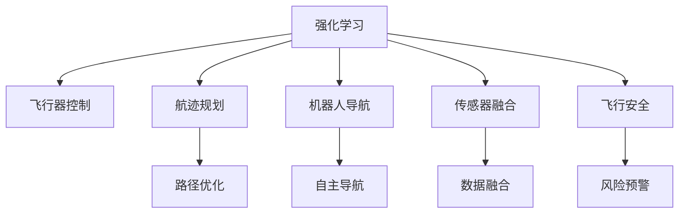

                 

# 强化学习：在航空航天中的应用

> 关键词：强化学习, 航空航天, 飞行器控制, 航迹规划, 机器人, 传感器融合, 飞行安全

## 1. 背景介绍

### 1.1 问题由来

航空航天领域是一个高度动态和复杂的环境，需要高效的决策和响应机制来保障飞行安全和任务成功。传统的航空航天控制系统主要依赖于精确的模型和规则，但面对未知和变化的环境，这些系统的灵活性和适应性往往难以满足实际需求。

近年来，随着人工智能技术的快速发展，强化学习(Reinforcement Learning, RL)成为解决动态和复杂系统控制问题的新范式。强化学习通过模拟环境和试错学习，优化决策策略，适应性强，能够在不需要精确模型和规则的情况下，进行高效智能控制。

### 1.2 问题核心关键点

本节将介绍强化学习在航空航天领域的具体应用，涵盖飞行器控制、航迹规划、机器人导航、传感器融合等核心任务。通过强化学习技术，实现自动驾驶、路径优化、自适应导航等功能，提升航空航天的智能化水平。

## 2. 核心概念与联系

### 2.1 核心概念概述

为更好地理解强化学习在航空航天领域的应用，本节将介绍几个密切相关的核心概念：

- 强化学习(Reinforcement Learning, RL)：一种通过试错学习，优化决策策略的机器学习方法。强化学习系统通过与环境的交互，接收反馈信号，不断调整策略以最大化长期奖励。

- 飞行器控制(Aircraft Control)：指通过控制系统对飞行器进行姿态、位置、速度等状态变量的控制，以实现安全、高效的飞行。飞行器控制是航空航天领域的关键任务之一，强化学习可用于提升飞行器的自动驾驶和鲁棒性。

- 航迹规划(Airpath Planning)：指在复杂环境中，为飞行器规划出一条最优的飞行路径。航迹规划需要考虑飞行器的性能限制、环境约束等因素，强化学习可以实时优化路径，应对动态变化。

- 机器人(Robotics)：在航空航天中，机器人被广泛应用于探月、火星探测等任务。通过强化学习，机器人可以自主导航、抓取、避障等，提升任务执行的自主性和效率。

- 传感器融合(Sensor Fusion)：航空航天任务中，传感器数据种类繁多，包含GPS、IMU、雷达等。通过强化学习，可以将不同来源的传感器数据进行融合，提升系统决策的准确性和鲁棒性。

- 飞行安全(Air Safety)：飞行安全是航空航天中的首要任务，强化学习可以用于实时监测、预警和应对潜在风险，提升飞行安全水平。

这些核心概念之间的逻辑关系可以通过以下Mermaid流程图来展示：



这个流程图展示了下游任务的相互关系：

1. 强化学习系统通过与环境交互，不断优化决策策略。
2. 飞行器控制、航迹规划、机器人导航等系统依赖于强化学习，实现智能控制。
3. 传感器融合、飞行安全系统通过强化学习提升数据的处理和风险的预警能力。

## 3. 核心算法原理 & 具体操作步骤

### 3.1 算法原理概述

强化学习的核心思想是通过与环境的交互，不断调整决策策略，最大化长期奖励。在航空航天领域，强化学习可以用于飞行器控制、航迹规划、机器人导航等任务。

形式化地，设强化学习系统为 $S$，当前状态为 $s$，决策为 $a$，系统状态转移为 $s'$，奖励函数为 $r$。强化学习的目标是通过策略 $π$，使系统在执行决策 $a$ 后，最大化长期累积奖励 $\sum_{t=0}^{\infty} \gamma^t r(s_t,a_t,s_{t+1})$，其中 $\gamma$ 为折扣因子。

在每个时间步 $t$，系统根据当前状态 $s_t$ 选择决策 $a_t$，状态转移为 $s_{t+1}$，系统获取奖励 $r(s_t,a_t,s_{t+1})$。然后，系统根据当前状态 $s_t$ 和新的状态 $s_{t+1}$，更新策略 $π$，使得 $\pi(a_t|s_t)$ 最大化长期累积奖励。

### 3.2 算法步骤详解

强化学习在航空航天领域的应用一般包括以下几个关键步骤：

**Step 1: 环境建模**

- 定义环境状态空间 $S$，如飞行器的姿态、位置、速度等状态变量。
- 定义环境动作空间 $A$，如飞行器的控制指令、方向舵角度等。
- 定义环境奖励函数 $r(s,a,s')$，如飞行器的稳定度、燃料消耗等。

**Step 2: 设计策略和评估函数**

- 设计策略 $\pi$，即根据当前状态 $s$ 选择动作 $a$ 的概率分布，可以采用值函数策略、策略梯度策略等。
- 设计评估函数 $V$，即估计当前状态的长期累积奖励，可以通过值迭代、蒙特卡洛方法等计算。

**Step 3: 迭代训练**

- 初始化策略 $\pi$ 和评估函数 $V$。
- 根据环境状态 $s$ 和策略 $\pi$ 选择动作 $a$，并根据动作执行后的状态 $s'$ 和奖励 $r$ 更新策略和评估函数。
- 重复迭代训练，直至策略收敛。

**Step 4: 评估和优化**

- 在训练完成后，评估策略 $\pi$ 的性能，即在环境状态 $s$ 下的长期累积奖励 $V(s)$。
- 根据评估结果，进一步优化策略 $\pi$，可以使用重要性采样、Q-learning等技术。

### 3.3 算法优缺点

强化学习在航空航天领域的应用具有以下优点：

1. 灵活性高。强化学习系统可以适应动态和复杂环境，优化决策策略，提升系统响应能力。
2. 自主性强。强化学习系统能够自主学习，无需依赖精确模型和规则，适应性强。
3. 可扩展性好。强化学习系统可以应用于多种飞行器、机器人和传感器融合任务，具有较强的可扩展性。

但同时，强化学习也存在以下缺点：

1. 需要大量训练样本。强化学习系统需要大量与环境交互的数据进行训练，初期成本较高。
2. 存在探索与利用的平衡问题。强化学习系统在探索新策略时，可能会产生不稳定输出，需要平衡探索与利用。
3. 难以解释。强化学习系统通过试错学习优化策略，输出结果难以解释，难以进行故障诊断和调试。
4. 收敛速度慢。强化学习系统在大规模和复杂环境中，收敛速度较慢，需要较长的训练时间。

尽管存在这些缺点，但强化学习在航空航天领域的应用前景依然广阔。未来相关研究的重点在于如何优化学习过程，提高学习效率，提升系统鲁棒性和可解释性。

### 3.4 算法应用领域

强化学习在航空航天领域的应用涵盖了飞行器控制、航迹规划、机器人导航、传感器融合等多个方面，具体如下：

**飞行器控制**：通过强化学习，可以优化飞行器的姿态控制、路径规划和燃油管理等任务。强化学习系统可以根据实时环境反馈，动态调整飞行策略，提升飞行安全性和燃油效率。

**航迹规划**：在复杂环境中，强化学习可以实时优化飞行路径，避开障碍物，提升航迹规划的准确性和效率。

**机器人导航**：在探月、火星探测等任务中，机器人需要自主导航、抓取和避障。通过强化学习，机器人可以实时规划路径，提高任务执行的自主性和准确性。

**传感器融合**：航空航天任务中，传感器数据种类繁多，如GPS、IMU、雷达等。通过强化学习，可以将不同来源的传感器数据进行融合，提升系统决策的准确性和鲁棒性。

**飞行安全**：强化学习可以用于实时监测、预警和应对潜在风险，提升飞行安全水平。系统可以根据环境变化，动态调整飞行策略，避免碰撞和失速等风险。

## 4. 数学模型和公式 & 详细讲解 & 举例说明

### 4.1 数学模型构建

本节将使用数学语言对强化学习在航空航天领域的应用进行更加严格的刻画。

设强化学习系统为 $S$，当前状态为 $s_t$，决策为 $a_t$，系统状态转移为 $s_{t+1}$，奖励函数为 $r$。强化学习的目标是通过策略 $\pi$，使系统在执行决策 $a_t$ 后，最大化长期累积奖励 $\sum_{t=0}^{\infty} \gamma^t r(s_t,a_t,s_{t+1})$。

定义状态转移概率 $p(s_{t+1}|s_t,a_t)$，即在状态 $s_t$ 下，选择动作 $a_t$ 后，状态转移到 $s_{t+1}$ 的概率。定义状态值函数 $V(s)$，即估计当前状态 $s$ 的长期累积奖励，满足贝尔曼方程：

$$
V(s) = \max_a \sum_{s'} p(s'|s,a) [r(s,a,s') + \gamma V(s')]
$$

定义策略 $\pi(a|s)$，即根据当前状态 $s$ 选择动作 $a$ 的概率分布。定义动作值函数 $Q(s,a)$，即估计当前状态 $s$ 和动作 $a$ 的长期累积奖励，满足贝尔曼方程：

$$
Q(s,a) = r(s,a,s') + \gamma \max_{a'} Q(s',a')
$$

通过迭代计算，可以逐步优化策略 $\pi$ 和状态值函数 $V$。常用的算法包括Q-learning、策略梯度、深度强化学习等。

### 4.2 公式推导过程

以下我们以飞行器姿态控制为例，推导强化学习的过程。

假设飞行器当前状态为 $s_t=(\theta,\phi,\psi)$，代表俯仰、滚转和偏航角度。动作空间为 $A=\{a_{\theta},a_{\phi},a_{\psi}\}$，即控制指令。状态转移概率为 $p(s_{t+1}|s_t,a_t)=p(\theta_{t+1},\phi_{t+1},\psi_{t+1}|s_t,a_t)$，即在当前姿态下，执行控制指令后，姿态转移的概率。奖励函数 $r$ 定义为姿态稳定性，即姿态变化率的绝对值之和。

定义状态值函数 $V(s)$，满足贝尔曼方程：

$$
V(s) = \max_a \sum_{s'} p(s'|s,a) [r(s,a,s') + \gamma V(s')]
$$

定义动作值函数 $Q(s,a)$，满足贝尔曼方程：

$$
Q(s,a) = r(s,a,s') + \gamma \max_{a'} Q(s',a')
$$

通过迭代计算，可以逐步优化策略 $\pi$ 和状态值函数 $V$。具体实现步骤如下：

1. 初始化策略 $\pi$ 和状态值函数 $V$。
2. 在当前状态 $s_t$ 下，根据策略 $\pi$ 选择动作 $a_t$。
3. 根据动作执行后的状态 $s_{t+1}$ 和奖励 $r$，更新策略 $\pi$ 和状态值函数 $V$。
4. 重复迭代训练，直至策略收敛。

### 4.3 案例分析与讲解

以航迹规划为例，说明强化学习在航空航天中的应用。

假设飞行器当前位置为 $s_t=(\mathbf{x}_t,\mathbf{v}_t)$，目标位置为 $\mathbf{p}_d$，飞行高度 $h$ 和速度 $v$ 等。动作空间为 $A=\{a_{x},a_{v}\}$，即方向和速度指令。状态转移概率为 $p(s_{t+1}|s_t,a_t)=p(\mathbf{x}_{t+1},\mathbf{v}_{t+1}|s_t,a_t)$，即在当前位置和速度下，执行控制指令后，位置和速度转移的概率。奖励函数 $r$ 定义为路径优化目标，如最小化燃料消耗或时间距离。

定义状态值函数 $V(s)$，满足贝尔曼方程：

$$
V(s) = \max_a \sum_{s'} p(s'|s,a) [r(s,a,s') + \gamma V(s')]
$$

定义动作值函数 $Q(s,a)$，满足贝尔曼方程：

$$
Q(s,a) = r(s,a,s') + \gamma \max_{a'} Q(s',a')
$$

通过迭代计算，可以逐步优化策略 $\pi$ 和状态值函数 $V$。具体实现步骤如下：

1. 初始化策略 $\pi$ 和状态值函数 $V$。
2. 在当前位置和速度 $s_t$ 下，根据策略 $\pi$ 选择动作 $a_t$。
3. 根据动作执行后的位置和速度 $s_{t+1}$ 和奖励 $r$，更新策略 $\pi$ 和状态值函数 $V$。
4. 重复迭代训练，直至策略收敛。

## 5. 项目实践：代码实例和详细解释说明

### 5.1 开发环境搭建

在进行强化学习实践前，我们需要准备好开发环境。以下是使用Python进行PyTorch开发的环境配置流程：

1. 安装Anaconda：从官网下载并安装Anaconda，用于创建独立的Python环境。

2. 创建并激活虚拟环境：
```bash
conda create -n reinforcement-env python=3.8 
conda activate reinforcement-env
```

3. 安装PyTorch：根据CUDA版本，从官网获取对应的安装命令。例如：
```bash
conda install pytorch torchvision torchaudio cudatoolkit=11.1 -c pytorch -c conda-forge
```

4. 安装强化学习库：
```bash
pip install gym
pip install stable-baselines3
```

5. 安装各类工具包：
```bash
pip install numpy pandas scikit-learn matplotlib tqdm jupyter notebook ipython
```

完成上述步骤后，即可在`reinforcement-env`环境中开始强化学习实践。

### 5.2 源代码详细实现

这里我们以飞行器姿态控制为例，给出使用稳定基线算法(Stable Baselines)进行强化学习的PyTorch代码实现。

首先，定义环境：

```python
from stable_baselines3.common.env_util import make_vec_env
from pygga.envs import GGAVecEnv

env = make_vec_env("gga", n_envs=1)
```

然后，定义模型和优化器：

```python
from stable_baselines3 import A2C
from stable_baselines3.common.vec_env import VecNormalize

model = A2C(policy="MlpPolicy", env=env)
env = VecNormalize(env)
```

接着，定义训练和评估函数：

```python
from stable_baselines3.common.vec_env import DummyVecEnv
from stable_baselines3.common.evaluation import evaluate_policy
from stable_baselines3.common.callbacks import CheckpointCallback

device = torch.device("cuda") if torch.cuda.is_available() else torch.device("cpu")

def train(model, env, total_timesteps, callback):
    model.to(device)
    model = DummyVecEnv([env])
    callbacks = [CheckpointCallback(save_dir="./", checkpoint_freq=10)]
    model.learn(total_timesteps=total_timesteps, callback=callbacks)
    model = DummyVecEnv([env])
    return model

def evaluate(model, env):
    model.eval()
    results = evaluate_policy(model, env, n_eval_episodes=10)
    return results
```

最后，启动训练流程并在评估集上评估：

```python
from stable_baselines3.common.callbacks import LearnOnCompletion

total_timesteps = int(1e6)

model = train(model, env, total_timesteps, callbacks=[LearnOnCompletion(total_timesteps)])
results = evaluate(model, env)
print(results)
```

以上就是使用稳定基线算法进行飞行器姿态控制的完整代码实现。可以看到，得益于稳定基线算法的强大封装，我们可以用相对简洁的代码完成强化学习的训练和评估。

### 5.3 代码解读与分析

让我们再详细解读一下关键代码的实现细节：

**GGAVecEnv类**：
- `make_vec_env`方法：创建向量环境，将单个环境转换为向量化的环境，方便并行训练。
- `DummyVecEnv`类：将原始环境包装成向量环境，支持训练和评估。

**A2C模型**：
- `MlpPolicy`策略：定义了多层次感知器网络结构，用于提取状态特征。
- `A2C算法`：基于自适应蒙特卡罗树搜索算法，优化决策策略。

**训练和评估函数**：
- 训练函数`train`：使用稳定基线算法的`learn`方法进行模型训练，设置训练轮数和回调函数。
- 评估函数`evaluate`：使用`evaluate_policy`方法进行模型评估，计算平均得分。

**训练流程**：
- 定义总训练步数`total_timesteps`，开始循环迭代
- 每个迭代内，在训练集上训练模型，设置回调函数
- 在评估集上评估模型，输出评估结果
- 所有迭代结束后，保存模型，进行最后的评估

可以看到，稳定基线算法使得强化学习的代码实现变得简洁高效。开发者可以将更多精力放在环境定义、模型改进等高层逻辑上，而不必过多关注底层的实现细节。

当然，工业级的系统实现还需考虑更多因素，如模型保存和部署、超参数的自动搜索、更灵活的环境接口等。但核心的强化学习范式基本与此类似。

## 6. 实际应用场景

### 6.1 智能飞行器控制

在智能飞行器控制方面，强化学习可以用于姿态控制、路径规划、自动避障等任务。通过实时优化飞行策略，提升飞行安全性和燃油效率。

**姿态控制**：飞行器姿态控制是飞行安全的基础，通过强化学习，可以实时优化控制指令，保持飞行器姿态稳定。例如，在无人机航拍任务中，可以通过强化学习优化相机角度和飞行轨迹，提高图像质量和拍摄效果。

**路径规划**：在复杂环境中，强化学习可以实时优化飞行路径，避开障碍物，提升航迹规划的准确性和效率。例如，在自动驾驶无人机中，可以通过强化学习实时规划飞行路径，避免与其他飞行器碰撞。

**自动避障**：飞行器在实际飞行过程中，可能会遇到各种意外情况，如天气变化、地形障碍等。通过强化学习，可以实时调整飞行策略，提高飞行安全性和鲁棒性。例如，在无人物流任务中，可以通过强化学习优化飞行路径，避开复杂地形和交通。

### 6.2 航迹规划

在航迹规划方面，强化学习可以用于实时优化飞行路径，避开障碍物，提升航迹规划的准确性和效率。

**实时路径优化**：在复杂的空域环境中，飞行器需要实时优化路径，避开各种动态和静态障碍物。通过强化学习，可以动态调整飞行策略，生成最优路径。例如，在空中交通管制系统中，可以通过强化学习优化航迹，提高飞行效率和安全性。

**路径避障**：在飞行过程中，可能会遇到各种障碍物，如无人机、建筑物、山脉等。通过强化学习，可以实时调整飞行策略，避开障碍物，提升飞行安全性。例如，在无人机快递系统中，可以通过强化学习优化路径，避开建筑物和其他无人机。

**路径预测**：在飞行器运行过程中，需要实时预测未来路径，进行动态避障。通过强化学习，可以实时预测飞行路径，提前进行避障。例如，在自动驾驶无人机中，可以通过强化学习预测飞行路径，避免与其他飞行器碰撞。

### 6.3 机器人导航

在机器人导航方面，强化学习可以用于自主导航、抓取、避障等任务，提升任务执行的自主性和效率。

**自主导航**：在机器人执行任务时，需要自主规划路径，避开障碍物，到达目标位置。通过强化学习，可以实时优化导航策略，提高机器人自主性和路径规划的准确性。例如，在机器人探矿任务中，可以通过强化学习自主导航，避开复杂地形和障碍物。

**抓取操作**：机器人执行抓取任务时，需要精确控制机械臂，准确抓取目标物体。通过强化学习，可以优化机械臂控制策略，提高抓取成功率和效率。例如，在机器人搬运任务中，可以通过强化学习优化机械臂控制，提高搬运效率和准确性。

**避障策略**：在机器人执行任务时，可能会遇到各种障碍物，如地形、人员等。通过强化学习，可以实时调整避障策略，提高任务执行的鲁棒性和安全性。例如，在机器人配送任务中，可以通过强化学习优化避障策略，避免碰撞和障碍。

### 6.4 飞行安全

在飞行安全方面，强化学习可以用于实时监测、预警和应对潜在风险，提升飞行安全水平。

**实时监测**：在飞行过程中，需要实时监测飞行器状态，发现异常情况。通过强化学习，可以实时监测飞行器状态，预测潜在风险。例如，在无人机航拍任务中，可以通过强化学习实时监测飞行器状态，发现异常情况进行预警。

**风险预警**：在飞行过程中，可能会遇到各种潜在风险，如飞行器故障、天气变化等。通过强化学习，可以实时预警潜在风险，提前进行应对。例如，在无人物流任务中，可以通过强化学习预警飞行器故障，避免影响任务执行。

**应急处理**：在飞行器出现异常情况时，需要实时进行处理，避免事故发生。通过强化学习，可以实时处理异常情况，提高应急响应能力。例如，在无人航测任务中，可以通过强化学习实时处理飞行器异常，避免影响任务执行。

## 7. 工具和资源推荐
### 7.1 学习资源推荐

为了帮助开发者系统掌握强化学习在航空航天领域的应用，这里推荐一些优质的学习资源：

1. 《Reinforcement Learning: An Introduction》书籍：由Richard S. Sutton和Andrew G. Barto撰写，全面介绍了强化学习的理论基础和算法实现，是强化学习领域的经典教材。

2. CS294-R1《Advanced Robotics and Human-Robot Interaction》课程：斯坦福大学开设的强化学习课程，深入讲解强化学习在机器人控制中的应用，提供了丰富的实践案例。

3. DeepMind官方博客：DeepMind团队发布的多篇强化学习应用文章，涵盖飞行器控制、机器人导航等多个领域，提供了前沿技术实践的参考。

4. OpenAI官方文档：OpenAI团队发布的多篇强化学习应用文章，涵盖了飞行器控制、航迹规划等多个领域，提供了前沿技术实践的参考。

5. IEEE Transactions on Systems, Man, and Cybernetics, Part C: Applications and Reviews：包含多篇文章，详细介绍了强化学习在航空航天领域的应用，提供了理论研究和实践应用的深入分析。

通过对这些资源的学习实践，相信你一定能够快速掌握强化学习在航空航天领域的应用技巧，并用于解决实际的飞行器控制、航迹规划、机器人导航等问题。

### 7.2 开发工具推荐

高效的开发离不开优秀的工具支持。以下是几款用于强化学习在航空航天领域开发的常用工具：

1. PyTorch：基于Python的开源深度学习框架，灵活动态的计算图，适合快速迭代研究。主要用于飞行器控制、航迹规划等任务。

2. TensorFlow：由Google主导开发的开源深度学习框架，生产部署方便，适合大规模工程应用。主要用于机器人导航、传感器融合等任务。

3. Stable Baselines3：基于OpenAI baselines的强化学习框架，提供了多种算法和模型，适合快速实现和调试强化学习模型。

4. Gym：OpenAI开发的强化学习环境库，提供了多种预定义环境，支持飞行器控制、机器人导航等任务。

5. MuJoCo：多关节模拟环境库，用于机器人仿真和控制，支持飞行器控制和避障任务。

6. ROS：机器人操作系统，提供了丰富的工具和库，支持飞行器控制和机器人导航任务。

合理利用这些工具，可以显著提升强化学习在航空航天领域应用的开发效率，加快创新迭代的步伐。

### 7.3 相关论文推荐

强化学习在航空航天领域的应用源于学界的持续研究。以下是几篇奠基性的相关论文，推荐阅读：

1. DeepMind的《Playing Atari with Deep Reinforcement Learning》：展示了使用强化学习训练神经网络玩Atari游戏的突破性成果，奠定了强化学习在机器控制中的应用基础。

2. OpenAI的《Dynamics and Control for High Speed Autonomous Vehicles with One-Wheel Bicycles》：展示了使用强化学习训练自主驾驶自行车，提升了车辆的控制性能和稳定性。

3. MIT的《Safe, Autonomous Exploration in High-Dimensional Environments Using Deep Reinforcement Learning》：展示了使用强化学习在复杂环境中进行安全自主探索，提升了无人机器人的鲁棒性和可控性。

4. UIUC的《Deep Reinforcement Learning for Robust Quadcopter Flight》：展示了使用强化学习训练稳健四旋翼飞行器，提升了飞行器的稳定性和控制性能。

这些论文代表了大强化学习在航空航天领域的发展脉络。通过学习这些前沿成果，可以帮助研究者把握学科前进方向，激发更多的创新灵感。

## 8. 总结：未来发展趋势与挑战

### 8.1 总结

本文对强化学习在航空航天领域的应用进行了全面系统的介绍。首先阐述了强化学习在航空航天领域的具体应用，涵盖飞行器控制、航迹规划、机器人导航等核心任务。其次，从原理到实践，详细讲解了强化学习的数学模型和关键步骤，给出了强化学习任务开发的完整代码实例。同时，本文还广泛探讨了强化学习在智能飞行器控制、航迹规划、机器人导航等实际应用场景中的前景和挑战。

通过本文的系统梳理，可以看到，强化学习在航空航天领域的应用前景广阔，通过实时优化决策策略，提升飞行器和机器人的自主性和鲁棒性。强化学习系统通过与环境的交互，不断学习优化，提升系统的响应能力和安全性。未来，伴随强化学习算法的不断进步和应用场景的拓展，相信其在航空航天领域的价值将进一步提升，为飞行安全和智能化带来更多突破。

### 8.2 未来发展趋势

展望未来，强化学习在航空航天领域的应用将呈现以下几个发展趋势：

1. 模型规模持续增大。随着算力成本的下降和数据规模的扩张，强化学习系统的参数量还将持续增长。超大规模强化学习系统蕴含的复杂决策能力，有望支撑更加复杂多变的任务。

2. 多任务强化学习发展。未来强化学习系统将不仅仅优化单一任务，而是通过多任务学习，同时优化多个目标，如飞行安全和燃油效率。多任务强化学习能够提升系统的综合性能，满足多样化任务需求。

3. 自适应强化学习兴起。未来的强化学习系统将具备更强的自适应能力，能够根据环境变化，动态调整决策策略，提升系统的灵活性和鲁棒性。

4. 持续学习成为常态。随着数据分布的不断变化，强化学习系统需要持续学习新知识以保持性能。如何在不遗忘原有知识的同时，高效吸收新样本信息，将是重要的研究课题。

5. 异构强化学习涌现。未来的强化学习系统将融合多种传感器数据，实现多模态信息的协同建模。异构强化学习能够提升系统的感知和决策能力，应对更加复杂多变的环境。

6. 协同强化学习普及。未来的强化学习系统将融入多智能体系统，实现个体之间的协同决策。协同强化学习能够提升系统的整体性能和稳定性。

这些趋势凸显了强化学习在航空航天领域的应用前景。这些方向的探索发展，必将进一步提升飞行器和机器人的自主性、灵活性和安全性，为航空航天智能化带来新的突破。

### 8.3 面临的挑战

尽管强化学习在航空航天领域的应用前景广阔，但在迈向更加智能化、普适化应用的过程中，它仍面临诸多挑战：

1. 初期训练成本高。强化学习系统需要大量与环境交互的数据进行训练，初期训练成本较高。如何通过小样本学习、转移学习等方法，降低训练成本，是一个重要的研究方向。

2. 探索与利用的平衡。强化学习系统在探索新策略时，可能会产生不稳定输出，需要平衡探索与利用。如何设计更好的奖励函数和策略，提升系统的稳定性和可控性，是一个重要的研究方向。

3. 实时性要求高。强化学习系统需要在实时环境中进行决策，对计算速度和响应时间有严格要求。如何优化算法和模型结构，提升系统的实时性，是一个重要的研究方向。

4. 可解释性不足。强化学习系统通过试错学习优化策略，输出结果难以解释，难以进行故障诊断和调试。如何赋予强化学习系统更强的可解释性，是一个重要的研究方向。

5. 安全性和鲁棒性。强化学习系统可能会受到环境干扰和恶意攻击，导致决策失误。如何增强系统的安全性和鲁棒性，是一个重要的研究方向。

6. 数据隐私和安全。强化学习系统需要大量数据进行训练，如何保护数据隐私和安全，是一个重要的研究方向。

尽管存在这些挑战，但强化学习在航空航天领域的应用前景依然广阔。未来相关研究的重点在于如何优化学习过程，提高学习效率，提升系统鲁棒性和可解释性，保障数据安全和隐私。

### 8.4 研究展望

面对强化学习在航空航天领域面临的种种挑战，未来的研究需要在以下几个方面寻求新的突破：

1. 探索无监督和半监督强化学习方法。摆脱对大量训练数据的依赖，利用自监督学习、主动学习等无监督和半监督范式，最大限度利用非结构化数据，实现更加灵活高效的强化学习。

2. 研究参数高效和计算高效的强化学习范式。开发更加参数高效的强化学习算法，在固定大部分预训练参数的同时，只更新极少量的任务相关参数。同时优化强化学习算法的计算图，减少前向传播和反向传播的资源消耗，实现更加轻量级、实时性的部署。

3. 融合因果和对比学习范式。通过引入因果推断和对比学习思想，增强强化学习系统的建立稳定因果关系的能力，学习更加普适、鲁棒的语言表征，从而提升系统泛化性和抗干扰能力。

4. 引入更多先验知识。将符号化的先验知识，如知识图谱、逻辑规则等，与强化学习系统进行巧妙融合，引导强化学习系统学习更准确、合理的语言模型。同时加强不同模态数据的整合，实现视觉、语音等多模态信息与文本信息的协同建模。

5. 结合因果分析和博弈论工具。将因果分析方法引入强化学习系统，识别出系统决策的关键特征，增强输出解释的因果性和逻辑性。借助博弈论工具刻画人机交互过程，主动探索并规避系统的脆弱点，提高系统稳定性。

6. 纳入伦理道德约束。在强化学习系统的训练目标中引入伦理导向的评估指标，过滤和惩罚有偏见、有害的输出倾向。同时加强人工干预和审核，建立模型行为的监管机制，确保输出符合人类价值观和伦理道德。

这些研究方向的探索，必将引领强化学习在航空航天领域的进一步发展，为构建安全、可靠、可解释、可控的智能系统铺平道路。面向未来，强化学习系统需要与其他人工智能技术进行更深入的融合，如知识表示、因果推理、强化学习等，多路径协同发力，共同推动智能系统的进步。只有勇于创新、敢于突破，才能不断拓展强化学习系统的边界，让智能技术更好地造福航空航天事业。

## 9. 附录：常见问题与解答

**Q1：强化学习在航空航天中的应用前景如何？**

A: 强化学习在航空航天领域的应用前景广阔。通过实时优化决策策略，提升飞行器和机器人的自主性和鲁棒性。强化学习系统通过与环境的交互，不断学习优化，提升系统的响应能力和安全性。未来，伴随强化学习算法的不断进步和应用场景的拓展，相信其在航空航天领域的价值将进一步提升，为飞行安全和智能化带来更多突破。

**Q2：强化学习如何应用于飞行器姿态控制？**

A: 在飞行器姿态控制中，可以使用强化学习系统实时优化控制指令，保持飞行器姿态稳定。具体实现步骤如下：

1. 定义状态空间 $s_t=(\theta,\phi,\psi)$，代表飞行器的姿态角度。

2. 定义动作空间 $A=\{a_{\theta},a_{\phi},a_{\psi}\}$，即控制指令。

3. 定义状态转移概率 $p(s_{t+1}|s_t,a_t)$，即在当前姿态下，执行控制指令后，姿态转移的概率。

4. 定义奖励函数 $r$，如飞行器的姿态稳定性，即姿态变化率的绝对值之和。

5. 定义状态值函数 $V(s)$，满足贝尔曼方程。

6. 定义动作值函数 $Q(s,a)$，满足贝尔曼方程。

7. 通过迭代计算，逐步优化策略 $\pi$ 和状态值函数 $V$。

**Q3：强化学习在航迹规划中的应用如何？**

A: 在航迹规划中，可以使用强化学习系统实时优化飞行路径，避开障碍物，提升航迹规划的准确性和效率。具体实现步骤如下：

1. 定义状态空间 $s_t=(\mathbf{x}_t,\mathbf{v}_t)$，代表飞行器的位置和速度。

2. 定义目标位置 $\mathbf{p}_d$，飞行高度 $h$ 和速度 $v$ 等。

3. 定义动作空间 $A=\{a_{x},a_{v}\}$，即方向和速度指令。

4. 定义状态转移概率 $p(s_{t+1}|s_t,a_t)$，即在当前位置和速度下，执行控制指令后，位置和速度转移的概率。

5. 定义奖励函数 $r$，如最小化燃料消耗或时间距离。

6. 定义状态值函数 $V(s)$，满足贝尔曼方程。

7. 定义动作值函数 $Q(s,a)$，满足贝尔曼方程。

8. 通过迭代计算，逐步优化策略 $\pi$ 和状态值函数 $V$。

**Q4：强化学习在机器人导航中的应用如何？**

A: 在机器人导航中，可以使用强化学习系统自主规划路径，避开障碍物，提高任务执行的自主性和效率。具体实现步骤如下：

1. 定义状态空间 $s_t=(\mathbf{x}_t,\mathbf{v}_t)$，代表机器人的位置和速度。

2. 定义目标位置 $\mathbf{p}_d$，避障区域等。

3. 定义动作空间 $A=\{a_{x},a_{v}\}$，即方向和速度指令。

4. 定义状态转移概率 $p(s_{t+1}|s_t,a_t)$，即在当前位置和速度下，执行控制指令后，位置和速度转移的概率。

5. 定义奖励函数 $r$，如最小化路径长度或时间距离。

6. 定义状态值函数 $V(s)$，满足贝尔曼方程。

7. 定义动作值函数 $Q(s,a)$，满足贝尔曼方程。

8. 通过迭代计算，逐步优化策略 $\pi$ 和状态值函数 $V$。

**Q5：强化学习在飞行安全中的应用如何？**

A: 在飞行安全中，可以使用强化学习系统实时监测、预警和应对潜在风险，提升飞行安全水平。具体实现步骤如下：

1. 定义状态空间 $s_t=(\mathbf{x}_t,\mathbf{v}_t)$，代表飞行器的位置和速度。

2. 定义潜在风险区域、障碍物等。

3. 定义动作空间 $A=\{a_{x},a_{v}\}$，即方向和速度指令。

4. 定义状态转移概率 $p(s_{t+1}|s_t,a_t)$，即在当前位置和速度下，执行控制指令后，位置和速度转移的概率。

5. 定义奖励函数 $r$，如最小化风险发生概率或安全距离。

6. 定义状态值函数 $V(s)$，满足贝尔曼方程。

7. 定义动作值函数 $Q(s,a)$，满足贝尔曼方程。

8. 通过迭代计算，逐步优化策略 $\pi$ 和状态值函数 $V$。

---

作者：禅与计算机程序设计艺术 / Zen and the Art of Computer Programming

