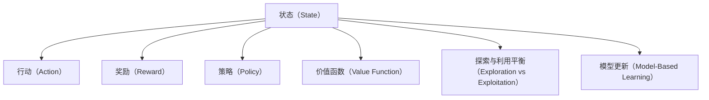

                 

## 1. 背景介绍

### 1.1 问题由来

在传统的人工智能研究中，机器学习模型往往被视为"黑盒"系统，通过历史数据学习泛化规律，对未知数据进行预测。然而，这种方法存在一些限制：
- 依赖大量标注数据：需要人类为每个数据实例进行标注，标注成本高，且难以覆盖所有可能情况。
- 无法处理动态变化：模型在训练完成后，即使环境发生变化，也无法实时更新预测策略。

强化学习（Reinforcement Learning, RL）作为人工智能的另一条分支，通过智能体（Agent）与环境的互动，不断试错、学习最优策略，实现了对动态环境的适应能力。强化学习使机器能够在没有直接监督的情况下，从经验中自我学习，预知未来的行为可能带来的后果，进而做出最优决策。

近年来，随着深度强化学习技术的发展，强化学习在自动驾驶、机器人控制、游戏AI等领域取得了突破性的进展。强化学习已成为人工智能的重要研究方向之一，为机器获取动态世界知识开辟了新的道路。

### 1.2 问题核心关键点

强化学习的核心在于探索环境中的最优策略，使智能体在指定目标下，最大化累积奖励。该过程涉及以下几个关键环节：

1. **状态-行动空间**：智能体在环境中的所有可能状态和行动。
2. **奖励函数**：对智能体的每个行动给予即时奖励或惩罚。
3. **策略优化**：通过学习和探索，逐步优化智能体的行动策略。
4. **探索与利用平衡**：在探索新状态和利用已有知识之间进行权衡。
5. **模型更新**：使用算法更新模型参数，以提高策略性能。
6. **泛化能力**：模型能够在未见过的状态中正确预测行动结果。

### 1.3 问题研究意义

强化学习具有以下重要研究意义：

1. **自主决策**：强化学习使机器能够自主决策，减少对人类干预的依赖，实现自动化。
2. **动态适应**：强化学习模型能够自适应环境变化，实时调整决策策略。
3. **智能控制**：强化学习为智能控制提供了新的手段，可用于自动驾驶、机器人等高复杂度场景。
4. **优化设计**：强化学习可以用于产品设计、运营优化等领域，提升效率和收益。
5. **探索未知**：强化学习拓展了机器对未知领域的探索能力，为科学探索提供了新方法。

## 2. 核心概念与联系

### 2.1 核心概念概述

为更好地理解强化学习，本节将介绍几个关键概念及其联系：

- **状态（State）**：环境中的当前状态，通常由一些可观测变量描述。例如，自动驾驶中的环境状态可能包括当前位置、速度、障碍物位置等。
- **行动（Action）**：智能体可以采取的行动集合。例如，自动驾驶中的行动可能包括加速、减速、转向等。
- **奖励（Reward）**：智能体每采取一个行动，环境会给予一定的奖励或惩罚，奖励越高表示行动越好。
- **策略（Policy）**：智能体采取行动的策略，通常是行动的概率分布。例如，一个确定的策略可能为：如果当前速度小于目标速度，则加速。
- **价值函数（Value Function）**：估计某个状态下采取特定行动的长期奖励，分为状态值函数（State Value Function）和行动值函数（Action Value Function）。
- **探索与利用平衡（Exploration vs Exploitation）**：在探索新状态和利用已有知识之间进行权衡。过多探索可能导致性能下降，过多利用可能陷入局部最优。
- **模型更新（Model-Based Learning）**：使用模型来估计环境的状态转移和奖励，以提高学习效率和泛化能力。

这些概念之间的逻辑关系可以通过以下Mermaid流程图来展示：



这个流程图展示了强化学习中各个关键概念的相互联系。

## 3. 核心算法原理 & 具体操作步骤
### 3.1 算法原理概述

强化学习的核心是探索最优策略，使智能体在环境中的行动最大化累积奖励。其基本框架为：

1. **环境（Environment）**：提供当前状态（State）、下一个状态（Next State）和即时奖励（Reward）。
2. **智能体（Agent）**：根据当前状态（State）和策略（Policy）选择行动（Action）。
3. **学习（Learning）**：根据智能体的行动和环境反馈，更新策略或模型参数。

强化学习的优化目标是最小化累积奖励的期望值：

$$
J(\pi) = \mathbb{E}\left[\sum_{t=1}^{T} \gamma^{t-1} r_t\right]
$$

其中，$\pi$ 为策略，$T$ 为总时间步数，$r_t$ 为即时奖励，$\gamma$ 为折扣因子。

通过梯度下降等优化算法，强化学习不断更新策略或模型参数，最小化上述目标，从而实现最优策略。

### 3.2 算法步骤详解

强化学习的具体实施通常包括以下几个关键步骤：

**Step 1: 设计环境**

1. **环境状态定义**：根据具体问题定义环境状态，例如，自动驾驶中的位置、速度、障碍物等。
2. **行动空间定义**：定义智能体可采取的行动，例如，自动驾驶中的加速、减速、转向等。
3. **奖励函数设计**：设计奖励函数，例如，自动驾驶中的安全性、速度、能耗等。
4. **环境模拟**：编写环境模拟器，以实时响应智能体的行动。

**Step 2: 选择模型和算法**

1. **选择模型**：选择适合的强化学习模型，例如，深度Q网络（DQN）、策略梯度（PG）、策略优化器（PO）等。
2. **选择算法**：选择适合的强化学习算法，例如，Q-learning、SARSA、Deep Q Network、Actor-Critic等。
3. **选择优化器**：选择适合的优化器，例如，Adam、RMSprop、SGD等。

**Step 3: 训练和测试**

1. **初始化模型**：初始化模型参数，通常设置为随机值。
2. **训练过程**：
   - 通过策略选择行动。
   - 根据行动和环境反馈计算即时奖励和下一个状态。
   - 更新模型参数以提高策略性能。
   - 重复上述过程直至策略收敛。
3. **测试过程**：
   - 在测试集上评估模型性能。
   - 输出策略在各种状态下的行动概率。

**Step 4: 部署和优化**

1. **模型部署**：将训练好的模型部署到实际环境中。
2. **实时交互**：智能体根据当前状态和策略选择行动，观察环境反馈。
3. **动态优化**：根据环境变化动态调整策略或模型参数。

### 3.3 算法优缺点

强化学习的优点包括：

1. **自主学习**：无需直接监督，智能体可自主探索最优策略。
2. **适应性强**：能够实时适应环境变化，动态优化决策。
3. **多目标优化**：可同时优化多个指标，如速度、安全、成本等。
4. **泛化能力强**：经过训练后的模型能够处理未见过的状态。

但强化学习也存在一些缺点：

1. **探索难度大**：智能体需要在不确定的环境中探索最优策略，存在较大的不确定性。
2. **学习效率低**：在复杂环境中，智能体需要较长时间才能收敛。
3. **模型难以设计**：环境复杂多变，难以设计出有效的奖励函数和状态转移模型。
4. **状态爆炸问题**：在复杂环境中，状态空间可能非常大，计算复杂度较高。
5. **可解释性差**：强化学习模型通常被视为黑盒系统，难以解释决策过程。

### 3.4 算法应用领域

强化学习已经在许多领域得到了广泛应用，包括但不限于：

1. **自动驾驶**：通过模拟驾驶环境，训练智能体学习最优驾驶策略，实现自动驾驶。
2. **机器人控制**：训练机器人学习行走、抓取、操作等复杂动作，提升自动化水平。
3. **游戏AI**：在围棋、星际争霸等游戏中，训练AI学习最优策略，实现超人类水平的表现。
4. **供应链优化**：优化库存管理、物流分配等，提升供应链效率和效益。
5. **金融交易**：训练智能体学习市场交易策略，实现自动交易和风险控制。
6. **工业控制**：通过强化学习优化生产流程，提高设备利用率和生产效率。

这些应用领域展示了强化学习在不同场景下的广泛应用潜力。

## 4. 数学模型和公式 & 详细讲解 & 举例说明

### 4.1 数学模型构建

强化学习的核心数学模型包括状态值函数（State Value Function）和行动值函数（Action Value Function）：

1. **状态值函数（V(s)）**：估计在状态$s$下采取最优行动的长期奖励。
2. **行动值函数（Q(s, a)）**：估计在状态$s$下采取行动$a$的长期奖励。

状态值函数和行动值函数的关系为：

$$
V(s) = \mathbb{E}[Q(s, a)]
$$

其中，$a$ 为最优行动，$Q(s, a)$ 为行动值函数。

状态值函数和行动值函数可以通过贝尔曼方程进行递推：

$$
V(s) = r + \gamma \mathbb{E}[V(s')]
$$

其中，$s'$ 为下一个状态，$r$ 为即时奖励，$\gamma$ 为折扣因子。

### 4.2 公式推导过程

以下对贝尔曼方程进行详细推导：

假设智能体在状态$s$下采取行动$a$，环境给出即时奖励$r_t$和下一个状态$s_{t+1}$，智能体在$s_{t+1}$下采取最优行动$a'$。则行动值函数可以表示为：

$$
Q(s, a) = r + \gamma \max_{a'} Q(s', a')
$$

将上式代入状态值函数中，得：

$$
V(s) = r + \gamma \max_{a'} (r' + \gamma Q(s', a'))
$$

$$
V(s) = r + \gamma r' + \gamma^2 \max_{a'} Q(s', a')
$$

递推下去，得：

$$
V(s) = \sum_{t=0}^{\infty} \gamma^t r_t
$$

其中，$r_t$ 为即时奖励。

通过上述推导，可以看到，状态值函数和行动值函数可以递推计算，且存在稳定收敛的解。

### 4.3 案例分析与讲解

以自动驾驶为例，分析强化学习的实施过程：

1. **环境状态**：包括当前位置、速度、障碍物位置等。
2. **行动空间**：包括加速、减速、转向等。
3. **奖励函数**：安全性高、速度快、能耗低等，给予较高奖励。
4. **策略选择**：基于当前状态和历史经验，选择最优行动。
5. **学习过程**：智能体在环境中不断试错，更新策略以提高性能。

通过强化学习训练，智能体可以学习到最优驾驶策略，实现自动驾驶。

## 5. 项目实践：代码实例和详细解释说明
### 5.1 开发环境搭建

在进行强化学习项目实践前，我们需要准备好开发环境。以下是使用Python进行Reinforcement Learning开发的环境配置流程：

1. 安装Anaconda：从官网下载并安装Anaconda，用于创建独立的Python环境。

2. 创建并激活虚拟环境：
```bash
conda create -n reinlearning-env python=3.8 
conda activate reinlearning-env
```

3. 安装相关库：
```bash
pip install numpy scipy matplotlib pybullet
```

4. 安装Reinforcement Learning库：
```bash
pip install stable-baselines3
```

5. 安装Reinforcement Learning可视化工具：
```bash
pip install gym-metastep gym-atari
```

完成上述步骤后，即可在`reinlearning-env`环境中开始强化学习实践。

### 5.2 源代码详细实现

这里我们以DQN（Deep Q Network）算法实现自动驾驶为例，展示强化学习的代码实现。

```python
import gym
import numpy as np
import matplotlib.pyplot as plt
from stable_baselines3 import DQN
from stable_baselines3.common.vec_env import DummyVecEnv
from stable_baselines3.common.env_util import make_atari

def train_agent(env, n_episodes=2000, save_model=False):
    model = DQN('CartPole-v1', env.observation_space.shape[0], env.action_space.n, verbose=1)
    env = DummyVecEnv([lambda: env])
    
    obs = env.reset()
    done = False
    total_reward = 0
    
    for episode in range(n_episodes):
        while not done:
            action = model.predict(obs)
            obs, reward, done, _ = env.step(action)
            total_reward += reward
        if (episode + 1) % 100 == 0:
            print(f"Episode {episode+1}: reward={total_reward}")
            if save_model:
                model.save('my_model.zip')
        obs = env.reset()
        total_reward = 0
    return model

if __name__ == '__main__':
    env = make_atari('CartPole-v1')
    model = train_agent(env, n_episodes=2000, save_model=True)
    model.render('reinlearning-env')
```

### 5.3 代码解读与分析

让我们再详细解读一下关键代码的实现细节：

**train_agent函数**：
- `DQN`初始化模型，`CartPole-v1`为Atari环境的名称。
- `env.observation_space.shape[0]`为观察空间的维度，`env.action_space.n`为动作空间的维度。
- `DummyVecEnv`用于将单一环境转换为向量环境，方便模型训练。
- `env.reset()`和`env.step(action)`分别用于重置环境和执行行动。
- `model.predict(obs)`用于预测观察状态对应的最佳行动。
- `model.save('my_model.zip')`用于保存训练好的模型。

**训练过程**：
- 每个回合开始时，智能体观察当前状态`obs`，根据模型预测行动。
- 在环境中执行行动，获得即时奖励`reward`，并更新状态`obs`。
- 如果达到终止状态，回合结束。
- 记录每个回合的总奖励`total_reward`。
- 每100回合输出一次训练进度。
- 保存模型以备后续使用。

**测试过程**：
- 在测试集上运行训练好的模型，输出测试结果。
- 显示模型在环境中的行为。

## 6. 实际应用场景
### 6.1 智能机器人

强化学习在智能机器人领域有着广泛的应用。传统的机器人控制通常需要依靠人类编写的控制逻辑，难以适应动态变化的环境。通过强化学习，机器人可以自主学习最优控制策略，实现高复杂度动作的执行。

例如，在自动清洁机器人中，强化学习可以训练机器人学习避障、路径规划等复杂动作，提升清洁效果和效率。在物流机器人中，强化学习可以训练机器人学习最优路径和负载策略，提高配送速度和准确性。

### 6.2 金融投资

金融投资领域也面临着不确定性和动态变化的问题。传统的投资策略通常需要复杂的量化模型和大量历史数据支持，难以实时调整策略。强化学习可以通过实时市场数据训练模型，学习最优投资策略，实现动态决策。

例如，在股票交易中，强化学习可以训练模型学习市场趋势、风险控制等策略，实现自动交易。在债券定价中，强化学习可以训练模型学习利率变化、违约风险等，优化债券组合配置。

### 6.3 供应链管理

供应链管理是一个复杂的多目标优化问题，涉及库存管理、物流分配、生产调度等多个环节。传统的供应链管理通常依赖人工决策，难以动态调整策略。强化学习可以通过实时数据分析，训练模型学习最优策略，提升供应链效率和效益。

例如，在库存管理中，强化学习可以训练模型学习需求预测、补货策略等，优化库存水平。在物流分配中，强化学习可以训练模型学习路线规划、配送策略等，提高配送效率。

### 6.4 未来应用展望

随着强化学习技术的不断进步，未来的应用场景将更加多样和广泛。

1. **医疗领域**：在医疗诊断、治疗方案优化等领域，强化学习可以训练模型学习医学知识，提升诊疗效果。
2. **教育领域**：在教育推荐、学习路径优化等领域，强化学习可以训练模型学习学生偏好，提升教育质量。
3. **社会治理**：在城市交通管理、灾害应对等领域，强化学习可以训练模型学习优化策略，提升治理效果。
4. **科学探索**：在天文观测、基因组分析等领域，强化学习可以训练模型学习探索策略，提升科研效率。

## 7. 工具和资源推荐
### 7.1 学习资源推荐

为了帮助开发者系统掌握强化学习的理论基础和实践技巧，这里推荐一些优质的学习资源：

1. 《强化学习：第2版》书籍：由Richard S. Sutton和Andrew G. Barto所著，全面介绍了强化学习的基本概念和经典算法。
2. Coursera《强化学习》课程：由David Silver等教授开设，是强化学习领域的经典入门课程。
3. Udacity《深度强化学习》课程：由Google Deepmind等公司专家授课，涵盖强化学习的高级算法和实践。
4. OpenAI Gym：开源的强化学习环境库，提供了大量标准环境和算法样例。
5. Reinforcement Learning Paper list：提供各类经典强化学习论文的汇总，便于学习研究。

通过对这些资源的学习实践，相信你一定能够快速掌握强化学习的精髓，并用于解决实际的强化学习问题。

### 7.2 开发工具推荐

高效的开发离不开优秀的工具支持。以下是几款用于强化学习开发的常用工具：

1. Python：作为一种通用编程语言，Python的简洁高效特性使其成为强化学习开发的首选。
2. OpenAI Gym：提供了丰富的环境和算法库，方便开发和实验。
3. TensorFlow和PyTorch：支持深度强化学习算法的实现，提供了强大的计算图和自动微分功能。
4. Jupyter Notebook：支持代码调试和互动展示，方便快速迭代实验。
5. TensorBoard：支持模型训练的可视化，方便监控和调试。

合理利用这些工具，可以显著提升强化学习任务的开发效率，加快创新迭代的步伐。

### 7.3 相关论文推荐

强化学习的研究已经积累了大量经典论文，以下是几篇奠基性的相关论文，推荐阅读：

1. Q-learning：由Watkins等人在1990年提出，是强化学习的经典算法之一。
2. Deep Q Network：由Mnih等人在2013年提出，将深度学习与强化学习结合，取得了显著的性能提升。
3. Actor-Critic：由Sutton和Barto在1998年提出，将策略和值函数结合，实现了更高效的训练。
4. Trust Region Policy Optimization（TRPO）：由Schulman等人在2015年提出，实现了更稳定的训练过程。
5. Proximal Policy Optimization（PPO）：由Schulman等人在2017年提出，进一步提高了训练效率和稳定性。

这些论文代表了大规模强化学习的发展脉络，通过学习这些前沿成果，可以帮助研究者把握学科前进方向，激发更多的创新灵感。

## 8. 总结：未来发展趋势与挑战

### 8.1 总结

本文对强化学习的核心概念、算法原理和实际操作进行了全面系统的介绍。首先阐述了强化学习的研究背景和意义，明确了其作为自主学习、动态适应和智能决策的重要价值。其次，从原理到实践，详细讲解了强化学习的数学模型、算法步骤和代码实现，给出了强化学习任务开发的完整代码实例。同时，本文还广泛探讨了强化学习在智能机器人、金融投资、供应链管理等多个领域的应用前景，展示了强化学习的广泛应用潜力。

通过本文的系统梳理，可以看到，强化学习技术正在成为智能决策和自动化控制的重要手段，极大地拓展了机器在复杂环境中的自主能力。未来，伴随深度强化学习技术的不断发展，强化学习必将在更多领域得到应用，为人类认知智能的进化带来深远影响。

### 8.2 未来发展趋势

展望未来，强化学习技术将呈现以下几个发展趋势：

1. **深度强化学习**：深度学习与强化学习的结合将进一步提升模型的复杂度和性能，实现更高效的学习和决策。
2. **多智能体学习**：多智能体学习将使多个智能体协同工作，实现更复杂的任务和更高效的资源利用。
3. **模型优化**：强化学习模型的优化算法将不断创新，实现更高效的策略训练和参数更新。
4. **可解释性**：强化学习模型的可解释性将成为研究重点，帮助理解智能体的决策过程。
5. **跨领域应用**：强化学习将在更多领域得到应用，实现更广泛的知识整合和智慧提升。
6. **计算效率**：强化学习算法将不断优化，提升计算效率和模型性能。

以上趋势凸显了强化学习技术的广阔前景，这些方向的探索发展，必将进一步提升强化学习的性能和应用范围，为人类认知智能的进化带来深远影响。

### 8.3 面临的挑战

尽管强化学习技术已经取得了瞩目成就，但在迈向更加智能化、普适化应用的过程中，它仍面临着诸多挑战：

1. **状态空间爆炸**：在复杂环境中，状态空间可能非常大，计算复杂度较高。
2. **动作空间多样**：在复杂动作任务中，动作空间可能非常复杂，难以优化。
3. **模型难以设计**：在复杂环境中，难以设计出有效的奖励函数和状态转移模型。
4. **探索与利用平衡**：在探索新状态和利用已有知识之间进行权衡，需要更多优化方法。
5. **训练效率低**：在复杂环境中，智能体需要较长时间才能收敛，训练效率较低。
6. **可解释性差**：强化学习模型通常被视为黑盒系统，难以解释决策过程。

### 8.4 研究展望

面对强化学习所面临的挑战，未来的研究需要在以下几个方面寻求新的突破：

1. **模型压缩**：通过模型压缩技术，减小模型参数量，提升计算效率和模型性能。
2. **高效探索**：通过探索算法，提高智能体对复杂环境的探索能力。
3. **多目标优化**：通过多目标优化算法，实现多个指标的平衡和优化。
4. **知识整合**：通过符号化知识库和专家规则，提升智能体的决策能力和泛化能力。
5. **动态学习**：通过动态学习算法，实时调整策略和模型参数，提高系统的适应能力。
6. **模型解释**：通过可解释性算法，提升模型的透明度和可信度。

这些研究方向的探索，必将引领强化学习技术迈向更高的台阶，为构建安全、可靠、可解释、可控的智能系统铺平道路。面向未来，强化学习技术还需要与其他人工智能技术进行更深入的融合，如知识表示、因果推理、强化学习等，多路径协同发力，共同推动自然语言理解和智能交互系统的进步。只有勇于创新、敢于突破，才能不断拓展强化学习的边界，让智能技术更好地造福人类社会。

## 9. 附录：常见问题与解答

**Q1：强化学习是否只适用于动态环境？**

A: 强化学习并不仅适用于动态环境，在静态环境中的简单任务也可以使用强化学习。但在动态环境中，强化学习更具优势，能够实时适应环境变化，优化决策策略。

**Q2：强化学习是否需要大量标注数据？**

A: 强化学习通常不需要大量标注数据，因为其通过试错学习策略，在环境互动中逐步优化决策。但有些特定任务，如自动驾驶，还是需要一定量的标注数据进行训练。

**Q3：强化学习是否存在过拟合问题？**

A: 强化学习存在过拟合问题，但可以通过探索算法、模型更新等方法缓解。此外，多智能体学习和分布式强化学习等技术也可以提升模型的泛化能力。

**Q4：强化学习是否需要复杂的计算资源？**

A: 强化学习需要一定的计算资源，特别是在深度强化学习中。但通过模型压缩、分布式计算等技术，可以降低计算需求，实现高效的训练和部署。

**Q5：强化学习是否易于解释？**

A: 强化学习模型通常难以解释，因为其决策过程基于试错和经验。但通过模型解释技术，可以提升模型的透明度和可信度。

---

作者：禅与计算机程序设计艺术 / Zen and the Art of Computer Programming

