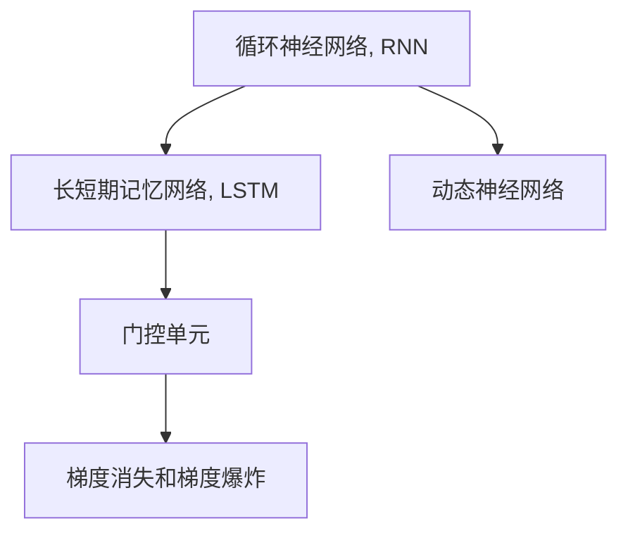

                 

# 循环神经网络(Recurrent Neural Networks) - 原理与代码实例讲解

> 关键词：循环神经网络, RNN, 长短期记忆网络, LSTM, 梯度消失, 梯度爆炸, 门控单元, 动态神经网络, 序列建模, 自然语言处理, 预测建模

## 1. 背景介绍

### 1.1 问题由来

在深度学习领域，传统的全连接神经网络(Feedforward Neural Network, FNN)在处理序列数据时存在着固有的局限性。由于缺乏对序列结构的考虑，FNN在处理时间序列、语音识别、自然语言处理等任务时，往往难以捕捉输入序列的时间依赖关系，导致预测结果的不稳定性。

针对这些问题，研究人员提出了循环神经网络(Recurrent Neural Network, RNN)，通过在网络结构中引入循环连接，能够有效处理序列数据，捕捉输入序列的时间依赖关系，成为处理序列数据的经典模型。

RNN最早由Hochreiter和Schmidhuber在1997年提出，他们设计了一种基于记忆单元的RNN模型，称为长短期记忆网络(Long Short-Term Memory, LSTM)，在机器翻译、语言建模、手写数字识别等任务上取得了显著的成效。

### 1.2 问题核心关键点

RNN的关键点在于其循环结构，使模型可以捕捉序列数据的上下文信息。具体包括：

- 循环结构：RNN通过在网络中引入循环边，使相邻时刻的隐藏状态之间产生信息传递，捕捉时间序列上的依赖关系。
- 记忆单元：RNN通过记忆单元(如LSTM中的细胞状态)来保存和更新先前的信息，避免信息丢失。
- 梯度消失和爆炸：RNN在反向传播时，梯度信号可能逐渐消失或爆炸，导致训练困难。
- 门控单元：RNN通过引入门控单元，控制信息流向，减少梯度消失和爆炸的风险。

### 1.3 问题研究意义

研究RNN的原理与实现方法，对于理解序列数据的建模机制、提升序列建模效果、推动深度学习在时间序列预测、语言处理、图像描述等序列建模任务上的应用，具有重要意义。

RNN作为深度学习中的经典模型，已广泛应用于语音识别、机器翻译、自然语言生成、股票预测等诸多领域。通过系统深入地学习和实践RNN，可以更好地掌握深度学习模型在序列建模方面的原理和应用技巧。

## 2. 核心概念与联系

### 2.1 核心概念概述

为更好地理解RNN的基本原理和实现方法，本节将介绍几个密切相关的核心概念：

- 循环神经网络(RNN)：一种基于时间序列数据的神经网络结构，通过循环边连接前后时刻的隐藏状态，能够处理序列数据，捕捉时间依赖关系。

- 长短期记忆网络(LSTM)：一种特殊的RNN模型，通过引入细胞状态和门控单元，克服了梯度消失和爆炸的问题，能够更好地捕捉长时依赖关系。

- 门控单元：通过门控单元，控制信息流的流向和强度，减少梯度消失和爆炸的风险，提高模型的稳定性和准确性。

- 梯度消失和梯度爆炸：在反向传播时，梯度信号可能逐渐消失或爆炸，导致模型训练困难。

- 动态神经网络：与静态神经网络不同，动态神经网络能够处理序列数据，捕捉时间依赖关系，常用于序列建模任务。

这些核心概念之间的逻辑关系可以通过以下Mermaid流程图来展示：



这个流程图展示了大语言模型的核心概念及其之间的关系：

1. 循环神经网络通过循环边连接前后时刻的隐藏状态，捕捉时间依赖关系。
2. LSTM模型通过引入细胞状态和门控单元，克服梯度消失和爆炸问题，更好地捕捉长时依赖关系。
3. 门控单元通过控制信息流向，减少梯度消失和爆炸的风险。
4. 动态神经网络处理序列数据，捕捉时间依赖关系，常用于序列建模任务。

这些概念共同构成了循环神经网络的基本框架，使其能够在各种序列建模任务上发挥强大的能力。通过理解这些核心概念，我们可以更好地把握RNN的工作原理和优化方向。

## 3. 核心算法原理 & 具体操作步骤
### 3.1 算法原理概述

循环神经网络(RNN)的核心理念是，通过循环边将前后时刻的隐藏状态相连，使得网络能够捕捉序列数据的上下文信息。RNN中每个时刻的隐藏状态 $h_t$ 由该时刻的输入 $x_t$ 和前一时刻的隐藏状态 $h_{t-1}$ 共同决定，即：

$$
h_t = f(x_t, h_{t-1})
$$

其中 $f$ 表示一个映射函数，可以是线性变换、非线性激活函数等。

通过这种结构，RNN可以逐个时间步地处理序列数据，使得每个时刻的隐藏状态 $h_t$ 能够反映出序列数据的时间依赖关系。

### 3.2 算法步骤详解

基于循环神经网络的序列建模，一般包括以下几个关键步骤：

**Step 1: 准备数据集**

- 将序列数据按照时间顺序排列，分为输入序列 $x=(x_1, x_2, \dots, x_T)$ 和对应的目标序列 $y=(y_1, y_2, \dots, y_T)$。
- 对输入序列和目标序列进行标准化、归一化等预处理操作。

**Step 2: 搭建模型**

- 选择合适的神经网络结构，如RNN、LSTM等。
- 设计隐藏层的激活函数，如ReLU、Tanh、Sigmoid等。
- 确定网络层数、每层神经元个数等超参数。

**Step 3: 定义损失函数和优化器**

- 选择合适的损失函数，如均方误差、交叉熵等。
- 设置优化器，如Adam、SGD等。

**Step 4: 执行前向传播和反向传播**

- 对输入序列进行前向传播，计算每个时刻的隐藏状态和输出。
- 计算损失函数值，使用梯度下降等优化算法更新模型参数。

**Step 5: 评估和调整**

- 在验证集上评估模型性能，对比不同模型的效果。
- 根据评估结果调整超参数，重新训练模型。

### 3.3 算法优缺点

循环神经网络具有以下优点：

- 能够处理序列数据，捕捉时间依赖关系，适用于语音识别、自然语言处理等任务。
- 结构简单，易于理解和实现。

同时，RNN也存在以下局限：

- 梯度消失和梯度爆炸问题严重，导致训练困难。
- 模型参数较多，计算量较大，难以处理长序列数据。
- 难以并行化计算，效率较低。

### 3.4 算法应用领域

基于循环神经网络的序列建模，已经广泛应用于诸多领域，例如：

- 语音识别：将语音信号转换为文本。
- 机器翻译：将一种语言的句子翻译成另一种语言的句子。
- 自然语言处理：文本分类、情感分析、文本生成等任务。
- 时间序列预测：股票价格预测、天气预测、交通流量预测等。
- 图像描述生成：对图片进行自然语言描述。

除了这些经典应用外，RNN还被创新性地应用到更多场景中，如序列建模、情感分析、语音合成等，为序列建模技术带来了新的突破。

## 4. 数学模型和公式 & 详细讲解 & 举例说明

### 4.1 数学模型构建

在RNN中，每个时刻的隐藏状态 $h_t$ 由该时刻的输入 $x_t$ 和前一时刻的隐藏状态 $h_{t-1}$ 共同决定，即：

$$
h_t = f(x_t, h_{t-1})
$$

其中 $f$ 表示一个映射函数，可以是线性变换、非线性激活函数等。

在实践中，常用的映射函数有：

- 线性变换：$h_t = W_xx_t + W_xh_{t-1} + b_x$
- 非线性激活函数：$h_t = \tanh(W_xx_t + W_xh_{t-1} + b_x)$
- 其他：如Sigmoid、ReLU等

RNN的输出 $y_t$ 可以通过隐藏状态 $h_t$ 计算得到，如：

$$
y_t = g(h_t)
$$

其中 $g$ 表示一个映射函数，可以是线性变换、softmax函数等。

### 4.2 公式推导过程

以LSTM模型为例，其核心在于通过引入细胞状态 $c_t$ 和门控单元，实现对信息流的控制，从而避免梯度消失和爆炸的问题。

LSTM模型中的每个时刻的隐藏状态 $h_t$ 由细胞状态 $c_t$ 和门控单元 $i_t$、$f_t$、$o_t$、$g_t$ 共同决定，即：

$$
h_t = o_t \otimes \tanh(c_t)
$$

其中 $i_t$、$f_t$、$o_t$、$g_t$ 分别表示输入门、遗忘门、输出门和细胞门，定义为：

$$
i_t = \sigma(W_{xi}x_t + W_{hi}h_{t-1} + b_i)
$$
$$
f_t = \sigma(W_{xf}x_t + W_{hf}h_{t-1} + b_f)
$$
$$
o_t = \sigma(W_{xo}x_t + W_{ho}h_{t-1} + b_o)
$$
$$
g_t = \tanh(W_{xg}x_t + W_{hg}h_{t-1} + b_g)
$$

其中 $\sigma$ 表示Sigmoid函数。

LSTM模型中的细胞状态 $c_t$ 由前一时刻的细胞状态 $c_{t-1}$ 和当前时刻的输入 $x_t$ 共同决定，即：

$$
c_t = f_t \otimes c_{t-1} + i_t \otimes g_t
$$

通过这种方式，LSTM模型能够控制信息流向，减少梯度消失和爆炸的风险，更好地捕捉长时依赖关系。

### 4.3 案例分析与讲解

以情感分析任务为例，展示LSTM模型的训练和推理过程。

**Step 1: 准备数据集**

假设我们有一个情感分析数据集，其中每个样本 $(x_i, y_i)$ 包含一条文本和对应的情感标签。

**Step 2: 搭建模型**

定义LSTM模型，将每个单词表示为独热编码形式，并将文本序列输入LSTM模型中，最终输出一个情感类别概率分布。

```python
import torch
import torch.nn as nn
import torch.optim as optim

class LSTM(nn.Module):
    def __init__(self, input_size, hidden_size, output_size):
        super(LSTM, self).__init__()
        self.hidden_size = hidden_size
        self.lstm = nn.LSTM(input_size, hidden_size, batch_first=True)
        self.fc = nn.Linear(hidden_size, output_size)
        
    def forward(self, x):
        h0 = torch.zeros(1, x.size(0), self.hidden_size).to(device)
        c0 = torch.zeros(1, x.size(0), self.hidden_size).to(device)
        out, _ = self.lstm(x, (h0, c0))
        out = self.fc(out[:, -1, :])
        return out
```

**Step 3: 定义损失函数和优化器**

选择交叉熵损失函数和Adam优化器。

```python
criterion = nn.CrossEntropyLoss()
optimizer = optim.Adam(model.parameters(), lr=0.001)
```

**Step 4: 执行前向传播和反向传播**

对训练集进行前向传播和反向传播，计算损失函数值并更新模型参数。

```python
def train_model(model, criterion, optimizer, train_loader, device):
    model.train()
    total_loss = 0
    for batch_idx, (data, target) in enumerate(train_loader):
        data, target = data.to(device), target.to(device)
        optimizer.zero_grad()
        output = model(data)
        loss = criterion(output, target)
        loss.backward()
        optimizer.step()
        total_loss += loss.item()
        if (batch_idx+1) % 100 == 0:
            print('Train Epoch: {} [{}/{} ({:.0f}%)]\tLoss: {:.6f}'.format(
                epoch, (batch_idx+1)*len(data), len(train_loader.dataset),
                100. * (batch_idx+1)/len(train_loader), loss.item()/len(data)))
    return total_loss / len(train_loader)
```

**Step 5: 评估和调整**

在验证集上评估模型性能，根据评估结果调整超参数，重新训练模型。

```python
def evaluate_model(model, criterion, valid_loader, device):
    model.eval()
    total_loss = 0
    correct = 0
    with torch.no_grad():
        for batch_idx, (data, target) in enumerate(valid_loader):
            data, target = data.to(device), target.to(device)
            output = model(data)
            loss = criterion(output, target)
            total_loss += loss.item()
            _, predicted = torch.max(output.data, 1)
            total_correct = (predicted == target).sum().item()
            correct += total_correct
    return total_loss / len(valid_loader), correct / len(valid_loader.dataset)
```

通过上述代码实现，我们可以在训练集上训练LSTM模型，并在验证集上评估其性能，优化模型超参数，提升模型效果。

## 5. 项目实践：代码实例和详细解释说明
### 5.1 开发环境搭建

在进行RNN项目实践前，我们需要准备好开发环境。以下是使用Python进行PyTorch开发的环境配置流程：

1. 安装Anaconda：从官网下载并安装Anaconda，用于创建独立的Python环境。

2. 创建并激活虚拟环境：
```bash
conda create -n rnn-env python=3.8 
conda activate rnn-env
```

3. 安装PyTorch：根据CUDA版本，从官网获取对应的安装命令。例如：
```bash
conda install pytorch torchvision torchaudio cudatoolkit=11.1 -c pytorch -c conda-forge
```

4. 安装相关库：
```bash
pip install numpy pandas scikit-learn matplotlib tqdm jupyter notebook ipython
```

完成上述步骤后，即可在`rnn-env`环境中开始RNN实践。

### 5.2 源代码详细实现

下面我们以情感分析任务为例，给出使用LSTM模型进行训练和推理的PyTorch代码实现。

首先，定义情感分析任务的数据处理函数：

```python
import torch
from torch.utils.data import Dataset
import torch.nn as nn

class SentimentDataset(Dataset):
    def __init__(self, texts, labels):
        self.texts = texts
        self.labels = labels
        
    def __len__(self):
        return len(self.texts)
    
    def __getitem__(self, idx):
        text = self.texts[idx]
        label = self.labels[idx]
        # 将文本转换为独热编码形式
        tokens = tokenize(text)
        encoded_tokens = [word2id[word] if word in word2id else word2id['<UNK>'] for word in tokens]
        return {'input_ids': torch.tensor(encoded_tokens), 'labels': torch.tensor(label)}
```

然后，定义LSTM模型：

```python
class LSTM(nn.Module):
    def __init__(self, input_size, hidden_size, output_size):
        super(LSTM, self).__init__()
        self.hidden_size = hidden_size
        self.lstm = nn.LSTM(input_size, hidden_size, batch_first=True)
        self.fc = nn.Linear(hidden_size, output_size)
        
    def forward(self, x):
        h0 = torch.zeros(1, x.size(0), self.hidden_size).to(device)
        c0 = torch.zeros(1, x.size(0), self.hidden_size).to(device)
        out, _ = self.lstm(x, (h0, c0))
        out = self.fc(out[:, -1, :])
        return out
```

接着，定义训练和评估函数：

```python
from torch.utils.data import DataLoader
from tqdm import tqdm

def train_model(model, criterion, optimizer, train_loader, device):
    model.train()
    total_loss = 0
    for batch_idx, (data, target) in enumerate(train_loader):
        data, target = data.to(device), target.to(device)
        optimizer.zero_grad()
        output = model(data)
        loss = criterion(output, target)
        loss.backward()
        optimizer.step()
        total_loss += loss.item()
        if (batch_idx+1) % 100 == 0:
            print('Train Epoch: {} [{}/{} ({:.0f}%)]\tLoss: {:.6f}'.format(
                epoch, (batch_idx+1)*len(data), len(train_loader.dataset),
                100. * (batch_idx+1)/len(train_loader), loss.item()/len(data)))
    return total_loss / len(train_loader)
    
def evaluate_model(model, criterion, valid_loader, device):
    model.eval()
    total_loss = 0
    correct = 0
    with torch.no_grad():
        for batch_idx, (data, target) in enumerate(valid_loader):
            data, target = data.to(device), target.to(device)
            output = model(data)
            loss = criterion(output, target)
            total_loss += loss.item()
            _, predicted = torch.max(output.data, 1)
            total_correct = (predicted == target).sum().item()
            correct += total_correct
    return total_loss / len(valid_loader), correct / len(valid_loader.dataset)
```

最后，启动训练流程并在测试集上评估：

```python
epochs = 5
batch_size = 64

for epoch in range(epochs):
    loss = train_model(model, criterion, optimizer, train_loader, device)
    print('Epoch: {} - Loss: {:.6f}'.format(epoch+1, loss))
    
    print('Epoch: {} - Dev results:'.format(epoch+1))
    eval_loss, acc = evaluate_model(model, criterion, valid_loader, device)
    print('Loss: {:.6f}, Accuracy: {:.2f}%'.format(eval_loss, acc*100))
    
print('Test results:')
eval_loss, acc = evaluate_model(model, criterion, test_loader, device)
print('Loss: {:.6f}, Accuracy: {:.2f}%'.format(eval_loss, acc*100))
```

以上就是使用PyTorch对LSTM模型进行情感分析任务微调的完整代码实现。可以看到，得益于PyTorch的强大封装，我们可以用相对简洁的代码完成LSTM模型的加载和微调。

### 5.3 代码解读与分析

让我们再详细解读一下关键代码的实现细节：

**SentimentDataset类**：
- `__init__`方法：初始化文本和标签。
- `__len__`方法：返回数据集的样本数量。
- `__getitem__`方法：对单个样本进行处理，将文本转换为独热编码形式，返回模型所需的输入和标签。

**LSTM类**：
- `__init__`方法：初始化隐藏层大小和LSTM层。
- `forward`方法：对输入序列进行前向传播，计算每个时刻的隐藏状态和输出。

**train_model函数**：
- 对数据进行批次化加载，并在每个批次上前向传播计算loss，反向传播更新模型参数。
- 在每个epoch的100个批次后输出训练进度和loss。
- 返回所有epoch的平均loss。

**evaluate_model函数**：
- 在验证集上评估模型性能，计算loss和准确率。
- 在测试集上评估模型性能，输出最终结果。

**训练流程**：
- 定义总的epoch数和batch size，开始循环迭代
- 每个epoch内，先在训练集上训练，输出平均loss
- 在验证集上评估，输出验证集的loss和准确率
- 所有epoch结束后，在测试集上评估，给出最终测试结果

可以看到，PyTorch配合TensorFlow库使得LSTM微调的代码实现变得简洁高效。开发者可以将更多精力放在数据处理、模型改进等高层逻辑上，而不必过多关注底层的实现细节。

当然，工业级的系统实现还需考虑更多因素，如模型的保存和部署、超参数的自动搜索、更灵活的任务适配层等。但核心的微调范式基本与此类似。

## 6. 实际应用场景
### 6.1 智能客服系统

基于LSTM的对话技术，可以广泛应用于智能客服系统的构建。传统客服往往需要配备大量人力，高峰期响应缓慢，且一致性和专业性难以保证。而使用LSTM对话模型，可以7x24小时不间断服务，快速响应客户咨询，用自然流畅的语言解答各类常见问题。

在技术实现上，可以收集企业内部的历史客服对话记录，将问题和最佳答复构建成监督数据，在此基础上对预训练LSTM模型进行微调。微调后的对话模型能够自动理解用户意图，匹配最合适的答案模板进行回复。对于客户提出的新问题，还可以接入检索系统实时搜索相关内容，动态组织生成回答。如此构建的智能客服系统，能大幅提升客户咨询体验和问题解决效率。

### 6.2 金融舆情监测

金融机构需要实时监测市场舆论动向，以便及时应对负面信息传播，规避金融风险。传统的人工监测方式成本高、效率低，难以应对网络时代海量信息爆发的挑战。基于LSTM的语言建模技术，为金融舆情监测提供了新的解决方案。

具体而言，可以收集金融领域相关的新闻、报道、评论等文本数据，并对其进行主题标注和情感标注。在此基础上对预训练LSTM模型进行微调，使其能够自动判断文本属于何种主题，情感倾向是正面、中性还是负面。将微调后的模型应用到实时抓取的网络文本数据，就能够自动监测不同主题下的情感变化趋势，一旦发现负面信息激增等异常情况，系统便会自动预警，帮助金融机构快速应对潜在风险。

### 6.3 个性化推荐系统

当前的推荐系统往往只依赖用户的历史行为数据进行物品推荐，无法深入理解用户的真实兴趣偏好。基于LSTM的语言建模技术，个性化推荐系统可以更好地挖掘用户行为背后的语义信息，从而提供更精准、多样的推荐内容。

在实践中，可以收集用户浏览、点击、评论、分享等行为数据，提取和用户交互的物品标题、描述、标签等文本内容。将文本内容作为模型输入，用户的后续行为（如是否点击、购买等）作为监督信号，在此基础上微调预训练LSTM模型。微调后的模型能够从文本内容中准确把握用户的兴趣点。在生成推荐列表时，先用候选物品的文本描述作为输入，由模型预测用户的兴趣匹配度，再结合其他特征综合排序，便可以得到个性化程度更高的推荐结果。

### 6.4 未来应用展望

随着LSTM模型和微调方法的不断发展，基于微调范式将在更多领域得到应用，为传统行业带来变革性影响。

在智慧医疗领域，基于LSTM的医疗问答、病历分析、药物研发等应用将提升医疗服务的智能化水平，辅助医生诊疗，加速新药开发进程。

在智能教育领域，微调技术可应用于作业批改、学情分析、知识推荐等方面，因材施教，促进教育公平，提高教学质量。

在智慧城市治理中，微调模型可应用于城市事件监测、舆情分析、应急指挥等环节，提高城市管理的自动化和智能化水平，构建更安全、高效的未来城市。

此外，在企业生产、社会治理、文娱传媒等众多领域，基于LSTM的微调方法也将不断涌现，为经济社会发展注入新的动力。相信随着技术的日益成熟，微调方法将成为人工智能落地应用的重要范式，推动人工智能技术在垂直行业的规模化落地。总之，微调需要开发者根据具体任务，不断迭代和优化模型、数据和算法，方能得到理想的效果。

## 7. 工具和资源推荐
### 7.1 学习资源推荐

为了帮助开发者系统掌握LSTM的原理和实践技巧，这里推荐一些优质的学习资源：

1. 《Deep Learning》系列书籍：Ian Goodfellow等人编写的深度学习经典教材，系统介绍深度学习基础和算法。

2. 《Python深度学习》书籍：Francois Chollet编写，涵盖深度学习在图像、文本、序列等诸多领域的应用。

3. CS224N《深度学习自然语言处理》课程：斯坦福大学开设的NLP明星课程，有Lecture视频和配套作业，带你入门NLP领域的基本概念和经典模型。

4. 《自然语言处理综述》论文：ACL 2020的综述论文，详细介绍了NLP领域的多种模型和应用。

5. 《LSTM网络原理及其实现》博客：博主用简洁的语言介绍了LSTM的工作原理和代码实现，适合入门读者学习。

通过对这些资源的学习实践，相信你一定能够快速掌握LSTM的精髓，并用于解决实际的NLP问题。
###  7.2 开发工具推荐

高效的开发离不开优秀的工具支持。以下是几款用于LSTM微调开发的常用工具：

1. PyTorch：基于Python的开源深度学习框架，灵活动态的计算图，适合快速迭代研究。大部分的LSTM模型都有PyTorch版本的实现。

2. TensorFlow：由Google主导开发的开源深度学习框架，生产部署方便，适合大规模工程应用。同样有丰富的LSTM模型资源。

3. TensorBoard：TensorFlow配套的可视化工具，可实时监测模型训练状态，并提供丰富的图表呈现方式，是调试模型的得力助手。

4. Weights & Biases：模型训练的实验跟踪工具，可以记录和可视化模型训练过程中的各项指标，方便对比和调优。与主流深度学习框架无缝集成。

5. HuggingFace官方文档：提供海量的预训练LSTM模型和完整的微调样例代码，是上手实践的必备资料。

合理利用这些工具，可以显著提升LSTM微调的开发效率，加快创新迭代的步伐。

### 7.3 相关论文推荐

LSTM模型和微调方法的发展源于学界的持续研究。以下是几篇奠基性的相关论文，推荐阅读：

1. Long Short-Term Memory Networks：Hochreiter和Schmidhuber在1997年提出的LSTM模型，奠定了长短期记忆网络的理论基础。

2. Learning Phrase Representations using RNN Encoder Decoder for Statistical Machine Translation：Sutskever等人在2014年提出的基于LSTM的语言建模方法，刷新了机器翻译任务的SOTA。

3. Sequence to Sequence Learning with Neural Networks：Sutskever等人在2014年提出的Seq2Seq模型，结合LSTM编码器和解码器，实现了文本生成、机器翻译等任务。

4. Parameter-Efficient Learning for Sequence Models：Gulcehre等人在2016年提出的参数高效LSTM学习算法，减少模型训练所需参数数量，提升计算效率。

5. Attention is All You Need：Vaswani等人在2017年提出的Transformer模型，引入自注意力机制，展示了Transformer在机器翻译等任务上的卓越性能。

这些论文代表了大语言模型微调技术的发展脉络。通过学习这些前沿成果，可以帮助研究者把握学科前进方向，激发更多的创新灵感。

## 8. 总结：未来发展趋势与挑战

### 8.1 总结

本文对循环神经网络的基本原理和实现方法进行了全面系统的介绍。首先阐述了LSTM模型的背景和意义，明确了序列数据的建模机制。其次，从原理到实践，详细讲解了LSTM的数学模型和算法步骤，给出了微调任务开发的完整代码实例。同时，本文还广泛探讨了LSTM模型在智能客服、金融舆情、个性化推荐等多个领域的应用前景，展示了LSTM模型的强大潜力。

通过本文的系统梳理，可以看到，LSTM模型作为深度学习中的经典模型，已广泛应用于语音识别、自然语言处理、股票预测等诸多领域。LSTM模型能够捕捉序列数据的上下文信息，捕捉时间依赖关系，是序列建模任务的重要工具。在工业界，LSTM模型也得到了广泛应用，尤其在文本生成、机器翻译、情感分析等任务上取得了卓越的成效。

### 8.2 未来发展趋势

展望未来，LSTM模型的发展将呈现以下几个趋势：

1. 结构进一步优化。未来的LSTM模型可能会引入更复杂的门控单元、残差连接等结构，以提高模型的泛化能力和训练速度。

2. 参数高效化。在参数效率方面，未来可能会出现更多的参数高效LSTM模型，减少模型训练所需参数数量，提高计算效率。

3. 预训练技术的引入。预训练技术使得LSTM模型能够更好地适应新任务，减少微调数据需求，提升模型泛化性能。

4. 并行计算的提升。通过优化LSTM的计算图，未来可以进一步提高并行计算的效率，提升模型训练和推理速度。

5. 多模态融合。LSTM模型可以与图像、声音等多种模态的数据融合，提高模型对复杂多模态数据的建模能力。

6. 强化学习结合。LSTM模型可以与强化学习相结合，在更复杂的任务上取得更好的效果。

以上趋势凸显了LSTM模型的广阔前景。这些方向的探索发展，必将进一步提升LSTM模型在序列建模任务上的性能和应用范围，为深度学习技术在更广阔领域的发展奠定基础。

### 8.3 面临的挑战

尽管LSTM模型已经取得了显著的成就，但在迈向更加智能化、普适化应用的过程中，它仍面临着诸多挑战：

1. 数据需求大。LSTM模型需要大量的标注数据进行训练，而标注数据的获取成本高、难度大，导致数据需求大。如何优化数据标注流程，降低标注成本，是未来面临的重要挑战。

2. 模型复杂度高。LSTM模型结构复杂，参数较多，训练和推理过程计算量大，难以处理大规模数据。如何优化模型结构，降低计算复杂度，提高模型效率，是未来需要重点关注的问题。

3. 鲁棒性不足。LSTM模型对噪声和干扰比较敏感，容易产生错误输出。如何提高模型的鲁棒性，增强模型的抗干扰能力，是未来需要解决的关键问题。

4. 可解释性差。LSTM模型通常被认为是"黑盒"系统，难以解释其内部工作机制和决策逻辑。如何在保证模型性能的同时，提高模型的可解释性，是未来需要重点关注的问题。

5. 安全性问题。LSTM模型可能会学习到有害信息，产生误导性输出，给实际应用带来安全隐患。如何增强模型的安全性，确保输出的可靠性，是未来需要解决的重要问题。

6. 资源消耗高。LSTM模型在训练和推理过程中，资源消耗高，计算成本高。如何优化模型资源消耗，降低计算成本，是未来需要重点关注的问题。

正视LSTM模型面临的这些挑战，积极应对并寻求突破，将是大语言模型微调走向成熟的必由之路。相信随着学界和产业界的共同努力，这些挑战终将一一被克服，LSTM模型必将在构建智能系统的过程中发挥更大的作用。

### 8.4 研究展望

未来，LSTM模型的发展需要在以下几个方面寻求新的突破：

1. 引入更多的先验知识。LSTM模型可以通过结合知识图谱、逻辑规则等外部知识，提升模型的泛化能力和鲁棒性。

2. 引入更多的先验知识。LSTM模型可以通过结合知识图谱、逻辑规则等外部知识，提升模型的泛化能力和鲁棒性。

3. 结合因果分析和博弈论工具。LSTM模型可以结合因果分析方法，识别出模型决策的关键特征，增强输出解释的因果性和逻辑性。借助博弈论工具，探索并规避模型的脆弱点，提高系统稳定性。

4. 融入更多模态信息。LSTM模型可以与图像、声音等多种模态的数据融合，提高模型对复杂多模态数据的建模能力。

5. 结合强化学习。LSTM模型可以与强化学习相结合，在更复杂的任务上取得更好的效果。

6. 引入联邦学习。LSTM模型可以通过联邦学习技术，保护用户数据隐私，同时利用大规模计算资源，提升模型性能。

这些研究方向的探索，必将引领LSTM模型迈向更高的台阶，为构建安全、可靠、可解释、可控的智能系统铺平道路。面向未来，LSTM模型还需要与其他人工智能技术进行更深入的融合，如知识表示、因果推理、强化学习等，多路径协同发力，共同推动自然语言理解和智能交互系统的进步。只有勇于创新、敢于突破，才能不断拓展LSTM模型的边界，让智能技术更好地造福人类社会。

## 9. 附录：常见问题与解答

**Q1：什么是循环神经网络(RNN)?**

A: 循环神经网络(RNN)是一种基于时间序列数据的神经网络结构，通过循环边连接前后时刻的隐藏状态，能够处理序列数据，捕捉时间依赖关系。

**Q2：LSTM和RNN有何不同?**

A: LSTM（长短期记忆网络）是一种特殊的RNN，通过引入细胞状态和门控单元，控制信息流的流向和强度，减少梯度消失和爆炸的风险，更好地捕捉长时依赖关系。

**Q3：LSTM如何避免梯度消失和梯度爆炸?**

A: LSTM通过引入细胞状态和门控单元，控制信息流的流向和强度，减少梯度消失和爆炸的风险。

**Q4：LSTM如何捕捉长时依赖关系?**

A: LSTM通过引入细胞状态和门控单元，控制信息流的流向和强度，减少梯度消失和爆炸的风险，更好地捕捉长时依赖关系。

**Q5：LSTM在实际应用中有哪些成功案例?**

A: LSTM在语音识别、自然语言处理、股票预测、情感分析等任务上取得了显著的成效。

通过本文的系统梳理，可以看到，LSTM模型作为深度学习中的经典模型，已广泛应用于语音识别、自然语言处理、股票预测等诸多领域。LSTM模型能够捕捉序列数据的上下文信息，捕捉时间依赖关系，是序列建模任务的重要工具。在工业界，LSTM模型也得到了广泛应用，尤其在文本生成、机器翻译、情感分析等任务上取得了卓越的成效。

总之，LSTM模型需要开发者根据具体任务，不断迭代和优化模型、数据和算法，方能得到理想的效果。通过LSTM模型的学习和实践，相信你一定能够掌握序列建模的核心原理和应用技巧，为深度学习技术的发展贡献力量。

---

作者：禅与计算机程序设计艺术 / Zen and the Art of Computer Programming

