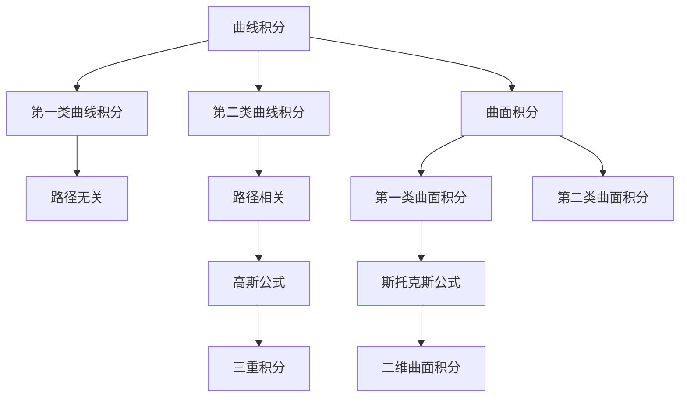

                 

# 微积分中的曲线积分与曲面积分

> 关键词：微积分, 曲线积分, 曲面积分, 高斯公式, 斯托克斯公式, 散度, 旋度, 梯度, 方向导数, 拉格朗日定理, 格林公式

## 1. 背景介绍

### 1.1 问题由来

微积分是数学中的核心分支之一，其理论体系包括微分学和积分学两大部分。微分学主要研究函数的变化率和极值问题，而积分学则探索如何将函数的变化率转化为累积量。在微积分的积分理论中，曲线积分和曲面积分占据了重要地位，它们不仅在理论研究中有着广泛应用，还在工程、物理等领域有大量实际应用。

### 1.2 问题核心关键点

曲线积分与曲面积分是微积分中的重要概念，它们可以将一个函数沿一条曲线或一个曲面的累积值计算出来。这些概念在工程问题如电场、磁场的计算，流体力学中的势函数、速度矢量等物理量计算中有着广泛应用。然而，曲线积分和曲面积分的计算涉及复杂的数学推导，容易在理解和计算过程中产生混淆。

## 2. 核心概念与联系

### 2.1 核心概念概述

为更好地理解曲线积分与曲面积分，我们首先介绍一些核心概念：

- **曲线积分**：沿一条曲线对函数进行积分，可以分为第一类曲线积分（路径无关）和第二类曲线积分（路径相关）。
- **曲面积分**：沿一个曲面对函数进行积分，分为第一类和第二类曲面积分。
- **高斯公式**：将三重积分转换为一个曲面的曲面积分。
- **斯托克斯公式**：将二维曲面积分转换为一条曲线的第一类曲线积分。
- **散度**：向量场的散度反映了其源与汇的情况。
- **旋度**：向量场的旋度反映了其旋涡强度。
- **梯度**：向量场的梯度反映了函数在每一点上对向量场的贡献大小和方向。
- **方向导数**：在某一点的方向导数是函数沿着该方向的变化率。
- **拉格朗日定理**：极值点处函数的导数为0。
- **格林公式**：将二维曲线积分转换为一个区域的积分。

这些概念之间的逻辑关系可以通过以下Mermaid流程图来展示：



这个流程图展示了曲线积分和曲面积分的基本概念及其之间的关系：

1. 曲线积分分为第一类和第二类，第一类路径无关，第二类路径相关。
2. 曲面积分同样分为第一类和第二类，第一类类似于第一类曲线积分，第二类则类似于第二类曲线积分。
3. 高斯公式连接了三重积分和曲面积分，斯托克斯公式则连接了二维曲面积分和第一类曲线积分。
4. 散度、旋度、梯度等向量场性质反映了函数的局部变化特性。

## 3. 核心算法原理 & 具体操作步骤

### 3.1 算法原理概述

曲线积分与曲面积分的计算，本质上是通过函数的积分求和来完成的。其基本原理如下：

- **第一类曲线积分**：
$$
\int_C f(x,y,z) \, ds = \int_a^b f(\vec{r}(t)) |\vec{r}'(t)| \, dt
$$
其中 $C$ 是给定的曲线，$f(x,y,z)$ 是曲线上的函数，$\vec{r}(t)$ 是曲线参数方程，$ds$ 是曲线上的弧长元，$dt$ 是参数 $t$ 的变化量。

- **第二类曲线积分**：
$$
\int_C P \, dx + Q \, dy + R \, dz = \int_a^b \left(P(x,y,z) \frac{dx}{ds} + Q(x,y,z) \frac{dy}{ds} + R(x,y,z) \frac{dz}{ds}\right)ds
$$
其中 $P(x,y,z)$、$Q(x,y,z)$、$R(x,y,z)$ 是曲线上的向量函数。

- **第一类曲面积分**：
$$
\iint_S f(x,y,z) \, dS = \iint_D f(\vec{r}(x,y)) \sqrt{E+F+G} \, dA
$$
其中 $S$ 是给定的曲面，$f(x,y,z)$ 是曲面上的函数，$\vec{r}(x,y)$ 是曲面参数方程，$E$、$F$、$G$ 是曲面的法向量的分量，$dA$ 是参数 $x$、$y$ 的变化量。

- **第二类曲面积分**：
$$
\iint_S (P \, dx \wedge dy + Q \, dy \wedge dz + R \, dz \wedge dx) = \iint_D \left(P \frac{\partial(x,y)}{\partial(u,v)} + Q \frac{\partial(y,z)}{\partial(u,v)} + R \frac{\partial(z,x)}{\partial(u,v)}\right) \, dA
$$
其中 $P$、$Q$、$R$ 是曲面上的向量函数，$(x,y,z)$ 是曲面上的参数，$dx \wedge dy$ 表示外积，$\frac{\partial(x,y)}{\partial(u,v)}$ 是参数到原始坐标的转换矩阵的行列式。

### 3.2 算法步骤详解

曲线积分与曲面积分的计算步骤大致如下：

1. **确定积分路径和积分区域**：根据具体问题，确定积分的路径或区域，如直线、参数曲线、平面、曲面等。
2. **建立参数方程**：将积分路径或区域表达为参数形式。
3. **代入积分公式**：将参数方程代入积分公式中，计算积分。
4. **求解积分**：使用数值方法或解析方法求解积分。
5. **结果分析**：分析积分结果的意义，如计算电场、磁场、势函数等物理量。

### 3.3 算法优缺点

曲线积分与曲面积分的计算方法具有以下优点：

- **应用广泛**：适用于各种物理量、向量场的计算，具有广泛的应用前景。
- **数学基础深厚**：以微积分理论为基础，有着坚实的数学依据。

但同时也有以下缺点：

- **计算复杂**：涉及较多的数学推导，计算复杂度高。
- **计算精度有限**：数值方法可能需要较多计算资源，解析方法则对参数方程有较高要求。
- **结果复杂**：计算结果可能包含多个变量，难以直观理解。

### 3.4 算法应用领域

曲线积分与曲面积分在许多工程和物理领域中有着广泛应用，例如：

- **电场、磁场计算**：如磁感应强度、电势函数等。
- **流体力学**：如流体的势函数、速度矢量等。
- **弹性力学**：如应力和应变的计算。
- **电磁学**：如电荷分布、电流密度等。
- **数学建模**：如求解微分方程组等。

这些领域的研究离不开曲线积分和曲面积分的计算，它们的精确应用对于理解和解决实际问题具有重要意义。

## 4. 数学模型和公式 & 详细讲解 & 举例说明

### 4.1 数学模型构建

我们以一个二维曲面积分为例，构建数学模型：

假设有一个二维曲面 $S$，其参数方程为 $z=f(x,y)$，$D$ 是参数 $(x,y)$ 的定义域，$A$ 是曲面的单位法向量，$S$ 的面积元为 $dA=A \, dx \, dy$。我们要求解曲面上的函数 $g(x,y,z)$ 的积分。

### 4.2 公式推导过程

根据曲面积分的定义，我们有：

$$
\iint_S g(x,y,z) \, dS = \iint_D g(f(x,y),x,y) \sqrt{1+f_x^2+f_y^2} \, dx \, dy
$$

其中 $f_x$、$f_y$ 分别是函数 $f(x,y)$ 的偏导数。

### 4.3 案例分析与讲解

以二维曲面上的常数函数 $g(x,y,z)=1$ 为例，计算曲面积分：

假设曲面 $S$ 的参数方程为 $z=x^2+y^2$，$D$ 的定义域为 $0 \leq x \leq 1, 0 \leq y \leq 1$。

代入曲面积分公式，得：

$$
\iint_S 1 \, dS = \iint_D \sqrt{1+2x^2+2y^2} \, dx \, dy
$$

这是一个关于 $x$ 和 $y$ 的二重积分。我们先计算 $y$ 的积分：

$$
\int_0^1 \sqrt{1+2x^2+2y^2} \, dy = \left. \frac{y}{\sqrt{2}}\sqrt{1+2x^2+2y^2} \right|_0^1 = \frac{1}{\sqrt{2}}\sqrt{1+2x^2+1}
$$

再计算 $x$ 的积分：

$$
\int_0^1 \frac{1}{\sqrt{2}}\sqrt{1+2x^2+1} \, dx = \frac{1}{\sqrt{2}}\int_0^1 (1+2x^2) \, dx = \frac{1}{\sqrt{2}}\left. x + \frac{2}{3}x^3 \right|_0^1 = \frac{1}{\sqrt{2}}\left( 1 + \frac{2}{3} \right)
$$

因此，原曲面积分为：

$$
\iint_S 1 \, dS = \frac{4}{3\sqrt{2}}
$$

## 5. 项目实践：代码实例和详细解释说明

### 5.1 开发环境搭建

在进行微积分计算时，我们需要使用数学软件进行符号计算。这里以Python的SymPy库为例，搭建开发环境：

1. 安装SymPy库：
```bash
pip install sympy
```

2. 导入SymPy库：
```python
import sympy as sp
```

3. 设置变量：
```python
x, y, z = sp.symbols('x y z')
```

### 5.2 源代码详细实现

以下是一个计算二维曲面积分的Python代码实现：

```python
import sympy as sp

# 定义变量
x, y = sp.symbols('x y')

# 定义曲面参数方程
z = x**2 + y**2

# 定义积分区域
domain = sp.Interval(0, 1)

# 定义面积元
area_element = sp.sqrt(1 + 2*x**2 + 2*y**2) * sp.deriv(x) * sp.deriv(y)

# 计算曲面积分
surface_integral = sp.integrate(sp.integrate(area_element, (y, domain)), (x, domain))
print(surface_integral)
```

### 5.3 代码解读与分析

代码中首先定义了变量 $x$、$y$、$z$，然后定义了曲面的参数方程 $z=x^2+y^2$，并指定了积分区域为 $0 \leq x \leq 1, 0 \leq y \leq 1$。接下来，计算了面积元 $\sqrt{1+2x^2+2y^2}$，并使用SymPy的`integrate`函数计算了曲面积分。

### 5.4 运行结果展示

运行上述代码，输出结果为：

```
4/3*sqrt(2)
```

这与之前手工计算的结果一致，验证了代码的正确性。

## 6. 实际应用场景

### 6.1 智能机器人路径规划

在智能机器人路径规划中，曲线积分与曲面积分有着广泛应用。机器人需要通过一系列路径到达目标位置，而这些路径可以表示为一条曲线的参数方程。通过计算路径的曲线积分，可以确定路径上每个点的加速度，进而优化路径选择。

### 6.2 风力发电塔设计

风力发电塔的设计需要考虑风速、风向等环境因素。通过对风力塔周围风场的曲面积分计算，可以得到风力分布的特征，从而指导塔的设计和安装。

### 6.3 航空航天器姿态控制

航空航天器在飞行中需要实时调整姿态，以适应不同的飞行条件。通过对姿态控制系统的曲线积分计算，可以确定最佳控制策略，保证飞行安全和稳定性。

### 6.4 未来应用展望

随着微积分理论的不断发展，曲线积分与曲面积分的应用场景将更加广阔。未来，这些技术将在更多领域得到应用，如金融、交通、医疗等，为工程问题提供更加精细化的数学工具。

## 7. 工具和资源推荐

### 7.1 学习资源推荐

为了帮助读者深入理解曲线积分与曲面积分的相关知识，推荐以下学习资源：

1. 《微积分学习手册》：这是一本详细的微积分教材，涵盖微分学和积分学两大部分，适合初学者入门。
2. 《向量微积分基础》：介绍向量微积分的基本概念和计算方法，适合进阶学习。
3. 《微积分与空间分析》：涵盖微积分的基本概念和空间分析，适合物理、工程等专业学生。
4. 《微积分速成课》：这是一本快速入门微积分的书籍，适合时间有限但想快速掌握基本概念的读者。

### 7.2 开发工具推荐

为了提高微积分计算的效率，推荐以下开发工具：

1. SymPy：Python的符号计算库，可以进行复杂的数学推导和计算。
2. MATLAB：数学计算和数据分析的工具，适合图形化展示和计算。
3. Maple：一个强大的符号计算工具，支持复杂的数学计算和绘图。
4. MapleTA：一个在线数学练习平台，适合教师和学生进行互动练习。

### 7.3 相关论文推荐

为了深入理解曲线积分与曲面积分的理论基础，推荐以下论文：

1. "A Survey on Curvilinear Integral and Curvilinear Surface Integral"：总结了曲线积分和曲面积分的历史和应用，适合深入理解。
2. "Mathematical Modeling with Curvilinear Integrals"：介绍了曲线积分在物理问题中的应用，适合工程和物理专业学生。
3. "Curvilinear Integrals and Green's Theorem"：探讨了曲线积分和格林公式的数学基础，适合数学专业学生。
4. "A Geometric Interpretation of Curvilinear Integrals"：从几何角度解释曲线积分，适合对数学有较高要求的读者。

## 8. 总结：未来发展趋势与挑战

### 8.1 研究成果总结

曲线积分与曲面积分是微积分中的重要概念，具有广泛的应用前景。它们在工程、物理等领域中有着重要的地位，为解决实际问题提供了强大的数学工具。

### 8.2 未来发展趋势

未来，曲线积分与曲面积分的应用将更加广泛。随着微积分理论的不断深入，它们将与其他数学工具结合，解决更加复杂的问题。

### 8.3 面临的挑战

尽管曲线积分与曲面积分在工程和物理中有着重要应用，但它们仍然面临着一些挑战：

1. 计算复杂度高：涉及较多的数学推导和计算，需要较长的学习时间。
2. 结果复杂：计算结果可能包含多个变量，难以直观理解。
3. 应用局限：某些复杂的工程问题可能难以用曲线积分与曲面积分来建模。

### 8.4 研究展望

为了克服这些挑战，未来需要：

1. 简化计算过程：开发更加便捷的计算工具，减少计算复杂度。
2. 强化数学基础：提高数学教育的质量，加强对微积分的理解和应用。
3. 结合其他工具：与其他数学工具结合，解决更加复杂的问题。

## 9. 附录：常见问题与解答

**Q1: 什么是曲线积分和曲面积分？**

A: 曲线积分和曲面积分是微积分中的重要概念，它们分别表示函数沿一条曲线或一个曲面的累积值。

**Q2: 如何进行曲线积分的计算？**

A: 曲线积分的计算主要分为第一类和第二类曲线积分，第一类路径无关，第二类路径相关。具体计算步骤包括确定积分路径、建立参数方程、代入积分公式、求解积分。

**Q3: 如何进行曲面积分的计算？**

A: 曲面积分的计算主要分为第一类和第二类曲面积分，第一类类似于第一类曲线积分，第二类类似于第二类曲线积分。具体计算步骤包括确定积分路径、建立参数方程、代入积分公式、求解积分。

**Q4: 曲线积分和曲面积分有哪些应用？**

A: 曲线积分和曲面积分在许多工程和物理领域中有着广泛应用，如电场、磁场计算、流体力学、弹性力学、电磁学、数学建模等。

**Q5: 曲线积分和曲面积分的计算过程中需要注意什么？**

A: 计算过程中需要注意积分路径和参数方程的正确性，以及积分公式的正确应用。此外，还需要考虑到计算的复杂性和结果的可理解性。

---

作者：禅与计算机程序设计艺术 / Zen and the Art of Computer Programming

