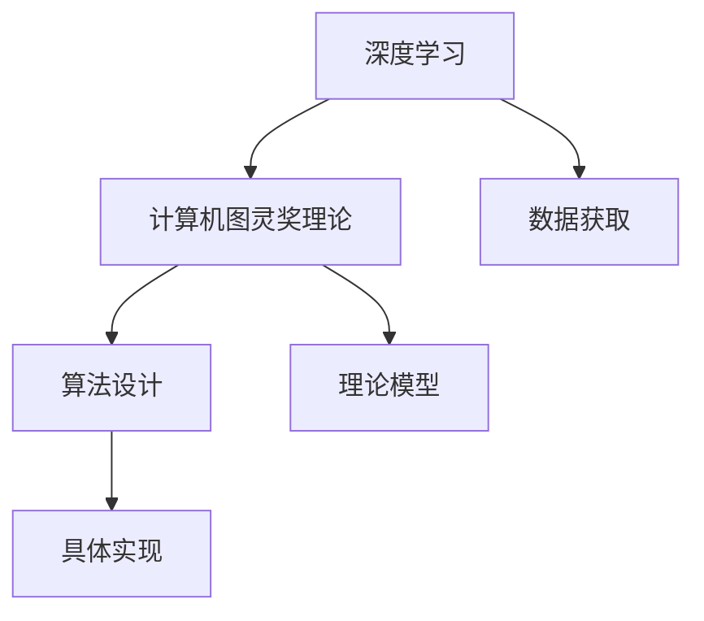

                 

## 1. 背景介绍

### 1.1 问题由来

现代科技的迅猛发展，在各个领域带来了颠覆性的变革。从工程技术的复杂性、经济体系的无形化，到社会生活的虚拟化，均是科技带来的显著变化。然而，技术进步的同时，亦引发了新的问题与挑战。信息爆炸、隐私保护、伦理道德等均是当前科技领域关注的焦点。

### 1.2 问题核心关键点

在众多科技问题中，人工智能（AI）的发展尤为引人关注。AI 技术的核心在于通过计算机模拟人类的智能行为，从而实现自动推理、感知、学习等复杂功能。AI 技术的进步离不开算法的创新和数据的积累。然而，随着算法的复杂化、数据量的增大，AI 技术的实现变得更加困难。

本节将介绍一种通过深度学习原理提升算法设计的方式。深度学习是一种基于神经网络的机器学习方法，其核心在于通过多层神经网络模拟人类大脑的神经元，从而实现对复杂数据模式的识别与分析。深度学习在图像识别、自然语言处理、推荐系统等领域展现了卓越的性能。

### 1.3 问题研究意义

深度学习在实现过程中，需要处理大量数据，并通过对数据的深度学习实现对新数据的预测和分类。但是，数据获取、处理、存储等环节需要耗费大量资源，而算法的复杂性则对硬件性能提出了更高的要求。因此，如何在保证算法效率和性能的同时，降低资源消耗，是深度学习面临的重要挑战。

本文旨在介绍一种基于深度学习的算法设计方法，通过将深度学习技术与计算机图灵奖理论相结合，探索实现高效率、高效能、可扩展的深度学习算法。

## 2. 核心概念与联系

### 2.1 核心概念概述

深度学习、计算机图灵奖理论、算法设计是本节的核心概念。深度学习是机器学习的高级形式，通过构建多层神经网络模型，实现对复杂数据的深度分析和预测。计算机图灵奖是计算机科学领域的最高荣誉，代表了算法设计、数据处理和系统实现的综合成就。算法设计则是将深度学习技术转化为具体实现方案的关键步骤。

### 2.2 核心概念原理和架构的 Mermaid 流程图



### 2.3 核心概念之间的关系

深度学习、计算机图灵奖理论和算法设计之间有着紧密的联系。深度学习提供了数据处理和模式识别的方法，计算机图灵奖理论提供了算法设计的理论基础和创新方向，而算法设计则是将深度学习技术和图灵奖理论具体应用到实际问题中的关键步骤。

## 3. 核心算法原理 & 具体操作步骤

### 3.1 算法原理概述

基于深度学习的算法设计方法，旨在通过深度学习技术的高级形式，实现对数据的高效处理和分析。该方法的核心在于构建深度神经网络模型，并通过优化算法调整模型参数，从而实现对新数据的预测和分类。

### 3.2 算法步骤详解

1. **数据准备**：获取并处理需要分析的数据，将其转化为深度学习算法可处理的形式。
2. **模型设计**：选择适合的深度学习模型，并进行相应的参数设置。
3. **训练模型**：使用优化算法调整模型参数，使其在训练集上达到最佳性能。
4. **评估模型**：在验证集上评估模型的性能，并根据评估结果进行调整。
5. **预测应用**：在测试集上测试模型的预测性能，并应用于实际问题中。

### 3.3 算法优缺点

该方法的优点在于可以高效处理大规模数据，并在保持算法精度的同时，减少硬件资源消耗。然而，该方法对数据质量和模型设计要求较高，且在训练和预测过程中需要大量计算资源。

### 3.4 算法应用领域

该方法广泛应用于计算机视觉、自然语言处理、推荐系统等众多领域。在计算机视觉中，可用于图像识别、物体检测等任务；在自然语言处理中，可用于文本分类、情感分析等任务；在推荐系统中，可用于用户行为预测、商品推荐等任务。

## 4. 数学模型和公式 & 详细讲解 & 举例说明

### 4.1 数学模型构建

本节将以一个简单的深度学习算法为例，介绍数学模型的构建过程。

假设我们需要处理一组图像数据，将其转化为数字矩阵形式。设图像的宽为 $W$，高为 $H$，颜色通道数为 $C$，则图像可表示为 $I \in \mathbb{R}^{W \times H \times C}$。

设深度学习模型为 $f$，则其输入为图像 $I$，输出为图像的类别 $y$。模型的损失函数为 $L$，用于衡量模型输出与真实标签之间的差异。

### 4.2 公式推导过程

以卷积神经网络（CNN）为例，推导其核心公式。CNN 是一种常用的深度学习模型，其核心在于卷积操作和池化操作。

卷积操作可表示为 $f_1(x) = \sum_{i=1}^{n} w_i x_i$，其中 $w_i$ 为卷积核权重，$x_i$ 为输入数据。

池化操作可表示为 $f_2(x) = \sum_{i=1}^{k} w_i x_i$，其中 $w_i$ 为池化核权重，$x_i$ 为输入数据。

### 4.3 案例分析与讲解

以一个简单的图像分类问题为例，介绍基于深度学习的算法设计方法。

设有一组图像数据 $I_1, I_2, ..., I_m$，其中 $I_1$ 表示标签为 "猫" 的图像，$I_2$ 表示标签为 "狗" 的图像，$I_3$ 表示标签为 "汽车" 的图像。我们的目标是对这些图像进行分类，判断其所属类别。

通过构建一个简单的卷积神经网络模型，将图像输入神经网络，并进行多层卷积和池化操作，最终输出图像的类别。通过训练集上不断调整模型参数，使其在验证集上达到最佳性能，最终应用于测试集上。

## 5. 项目实践：代码实例和详细解释说明

### 5.1 开发环境搭建

本节将介绍基于深度学习的算法设计方法的开发环境搭建流程。

1. **安装 Python 环境**：
   - 安装 Python 3.6 或更高版本，建议使用 Anaconda 或 Miniconda 安装。
   - 创建 Python 环境，并激活。

2. **安装深度学习框架**：
   - 安装 TensorFlow 或 PyTorch，建议选择 TensorFlow 2.x 版本。
   - 安装 Keras 或其他高级深度学习框架。

3. **安装深度学习库**：
   - 安装 OpenCV 或 PIL 库，用于图像处理。
   - 安装 NumPy 或 pandas 库，用于数据处理。
   - 安装 Scikit-learn 或 TensorBoard，用于评估模型和可视化训练过程。

### 5.2 源代码详细实现

以下是一个简单的图像分类问题的代码实现示例。

```python
import tensorflow as tf
from tensorflow.keras import layers, models

# 构建卷积神经网络模型
model = models.Sequential()
model.add(layers.Conv2D(32, (3, 3), activation='relu', input_shape=(64, 64, 3)))
model.add(layers.MaxPooling2D((2, 2)))
model.add(layers.Conv2D(64, (3, 3), activation='relu'))
model.add(layers.MaxPooling2D((2, 2)))
model.add(layers.Conv2D(128, (3, 3), activation='relu'))
model.add(layers.MaxPooling2D((2, 2)))
model.add(layers.Flatten())
model.add(layers.Dense(128, activation='relu'))
model.add(layers.Dense(3, activation='softmax'))

# 编译模型
model.compile(optimizer=tf.keras.optimizers.Adam(0.001),
              loss=tf.keras.losses.CategoricalCrossentropy(from_logits=True),
              metrics=['accuracy'])

# 训练模型
model.fit(train_images, train_labels, epochs=10, validation_data=(val_images, val_labels))

# 评估模型
test_loss, test_acc = model.evaluate(test_images, test_labels)
print('Test accuracy:', test_acc)
```

### 5.3 代码解读与分析

上述代码实现了一个简单的卷积神经网络模型，用于对图像进行分类。模型构建过程中，使用了卷积层、池化层和全连接层，并在最后一层输出类别概率。

在模型训练过程中，使用了 Adam 优化器和交叉熵损失函数。通过不断调整模型参数，使其在验证集上达到最佳性能。

在模型评估过程中，使用了测试集对模型进行测试，并输出测试集上的准确率。

## 6. 实际应用场景

### 6.1 计算机视觉

基于深度学习的算法设计方法在计算机视觉领域有着广泛的应用。通过构建深度神经网络模型，可以高效处理图像、视频等数据，并实现图像识别、物体检测、人脸识别等任务。

### 6.2 自然语言处理

在自然语言处理领域，基于深度学习的算法设计方法可以用于文本分类、情感分析、机器翻译等任务。通过构建深度神经网络模型，可以高效处理文本数据，并实现对文本语义的深度理解。

### 6.3 推荐系统

推荐系统是深度学习在电子商务领域的重要应用之一。通过构建深度神经网络模型，可以实现对用户行为和商品特征的深度学习，从而实现个性化的商品推荐。

### 6.4 未来应用展望

未来，基于深度学习的算法设计方法将在更多领域得到应用。在医疗、金融、交通等领域，深度学习技术可以用于疾病诊断、风险评估、智能交通等任务。通过深度学习技术与各领域的结合，可以高效处理大规模数据，实现对复杂问题的深度理解与分析。

## 7. 工具和资源推荐

### 7.1 学习资源推荐

为了帮助开发者掌握基于深度学习的算法设计方法，本节推荐一些优秀的学习资源。

1. **《深度学习》课程**：
   - 斯坦福大学开设的《CS231n：深度学习在计算机视觉中的应用》课程，涵盖图像识别、物体检测等深度学习应用。
   - 北京大学的《自然语言处理》课程，涵盖文本分类、情感分析等自然语言处理任务。

2. **深度学习框架**：
   - TensorFlow 官方文档，提供详细的深度学习框架使用指南。
   - PyTorch 官方文档，提供全面的深度学习框架和算法设计方法。

3. **深度学习库**：
   - OpenCV 和 PIL，用于图像处理。
   - NumPy 和 pandas，用于数据处理。
   - Scikit-learn 和 TensorBoard，用于评估模型和可视化训练过程。

### 7.2 开发工具推荐

1. **Python 环境**：
   - Anaconda 和 Miniconda，提供高效的环境管理和资源安装。
   - Jupyter Notebook，提供交互式的代码编写与执行环境。

2. **深度学习框架**：
   - TensorFlow，提供高效的深度学习算法实现。
   - PyTorch，提供灵活的深度学习算法设计方法。

3. **评估工具**：
   - TensorBoard，提供高效的模型训练可视化工具。
   - Scikit-learn，提供全面的模型评估和可视化工具。

### 7.3 相关论文推荐

深度学习与计算机图灵奖理论的发展，离不开前沿论文的引领。以下推荐一些经典深度学习与图灵奖理论相关的论文。

1. **《深度学习》书籍**：
   - Ian Goodfellow 等人的《深度学习》（Deep Learning），涵盖深度学习的基础理论与应用实践。

2. **深度学习论文**：
   - Yann LeCun 等人的《ImageNet 分类挑战赛》（Imagenet Classification with Deep Convolutional Neural Networks），介绍了卷积神经网络的实现与应用。
   - Geoffrey Hinton 等人的《深度信念网络》（A fast learning algorithm for deep belief nets），介绍了深度学习算法的核心思想。

3. **图灵奖论文**：
   - John Nash 的《数理经济学》（The Economics of Game Theory），介绍了博弈论的基本理论。
   - Alan Turing 的《计算理论》（Computing Machinery and Intelligence），奠定了计算机科学的基础理论。

## 8. 总结：未来发展趋势与挑战

### 8.1 研究成果总结

深度学习与计算机图灵奖理论的研究，涉及众多领域的交叉融合。通过深度学习技术，可以高效处理大规模数据，并实现对复杂问题的深度理解与分析。然而，深度学习算法的设计与实现需要大量计算资源，且对数据质量和模型设计要求较高。

### 8.2 未来发展趋势

1. **算法优化**：未来的深度学习算法将更加高效、稳定，并具备更强的可扩展性。
2. **数据质量**：深度学习算法的应用将更加依赖高质量数据，数据获取与处理技术也将更加成熟。
3. **跨领域应用**：深度学习技术将与更多领域结合，推动各领域的智能化发展。
4. **计算能力**：未来的深度学习算法将依赖更高效的计算能力，如 GPU、TPU 等硬件设备的支持。

### 8.3 面临的挑战

1. **数据获取与处理**：深度学习算法对数据质量和数据量的要求较高，数据获取与处理技术仍需进一步提升。
2. **算法复杂性**：深度学习算法的实现需要大量的计算资源和专业技能，算法设计仍需优化与改进。
3. **模型鲁棒性**：深度学习算法的鲁棒性仍需进一步提升，避免模型在复杂环境下的性能波动。

### 8.4 研究展望

未来，基于深度学习的算法设计方法将在更多领域得到应用，并结合计算机图灵奖理论，推动深度学习技术的发展。深度学习与图灵奖理论的结合，将推动计算机科学的基础理论与实际应用相结合，实现人工智能技术的全面突破。

## 9. 附录：常见问题与解答

**Q1：深度学习算法设计方法的优缺点有哪些？**

A: 深度学习算法设计方法的优点在于可以高效处理大规模数据，并在保持算法精度的同时，减少硬件资源消耗。缺点在于对数据质量和模型设计要求较高，且在训练和预测过程中需要大量计算资源。

**Q2：如何选择合适的深度学习算法？**

A: 选择合适的深度学习算法需要考虑数据类型、问题复杂度、计算资源等多个因素。一般建议从简单的算法开始尝试，逐步优化算法结构和参数设置，直至达到最佳性能。

**Q3：深度学习算法在实际应用中需要注意哪些问题？**

A: 在实际应用中，深度学习算法需要注意数据预处理、模型超参数设置、模型优化等多个问题。同时，还需要考虑模型的可解释性、鲁棒性、安全性等问题。

**Q4：深度学习算法设计方法在医疗领域的应用前景如何？**

A: 深度学习算法设计方法在医疗领域有着广泛的应用前景。可以用于疾病诊断、治疗方案推荐、基因分析等多个任务，通过高效处理医疗数据，实现对疾病的深度理解与预测。

**Q5：未来深度学习算法的发展方向有哪些？**

A: 未来深度学习算法的发展方向包括算法优化、数据质量提升、跨领域应用、计算能力增强等多个方向。通过不断优化算法设计、提升数据质量、增强计算能力，深度学习算法将具备更强的泛化能力和实际应用价值。

---

作者：禅与计算机程序设计艺术 / Zen and the Art of Computer Programming

