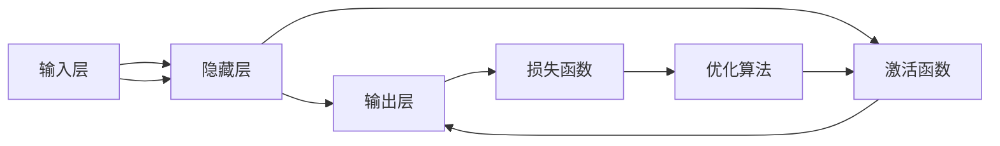

                 

# 思想的深度：从概念到洞见

> 关键词：深度学习,机器学习,人工智能,理论研究,应用实践

## 1. 背景介绍

### 1.1 问题由来
随着人工智能(AI)技术的迅猛发展，深度学习(Deep Learning)在图像识别、语音识别、自然语言处理等领域取得了卓越的成果。其中，深度学习模型凭借其强大的特征学习能力和泛化能力，极大地推动了AI技术的发展。

然而，深度学习模型的成功离不开理论研究的支撑。只有深刻理解其背后原理和算法，才能在实际应用中更好地运用和优化这些模型。正因如此，深度学习理论研究成为了推动AI技术进步的重要驱动力。

### 1.2 问题核心关键点
本文聚焦于深度学习理论研究，将从概念出发，深入探讨其原理和算法，并给出实际应用的详细操作指南。以下将详细介绍深度学习的核心概念、算法原理、操作步骤，并通过具体的数学模型和公式，详细讲解其在实际项目中的应用。

## 2. 核心概念与联系

### 2.1 核心概念概述

深度学习是机器学习的一种特殊形式，主要利用多层神经网络对复杂数据进行建模和分析。其核心概念包括但不限于：

- 神经网络(Neural Network)：由多个神经元组成的网络结构，通过前向传播和反向传播算法进行参数优化。
- 前向传播(Forward Propagation)：通过网络结构将输入数据转换为输出。
- 反向传播(Backpropagation)：根据输出误差，反向更新网络参数。
- 损失函数(Loss Function)：用于衡量模型预测与真实标签之间的差异。
- 优化算法(Optimizer)：用于更新模型参数，使损失函数最小化。
- 激活函数(Activation Function)：引入非线性因素，增强模型表达能力。

这些核心概念通过特定的架构连接起来，形成了深度学习的理论基础。在实际应用中，通过调整网络结构、选择优化算法、设计激活函数等手段，可以实现对不同类型数据的深度学习和分析。

### 2.2 核心概念原理和架构的 Mermaid 流程图



这个流程图展示了深度学习模型的一般架构，从输入到输出，中间通过多个隐藏层和激活函数进行特征提取和变换，最终通过优化算法最小化损失函数，完成模型的训练。

## 3. 核心算法原理 & 具体操作步骤

### 3.1 算法原理概述

深度学习模型的核心是多层神经网络，其原理是通过多层非线性变换对数据进行学习和表示。具体来说，深度学习模型由多个神经元组成，每一层神经元将前一层的输出作为输入，并经过非线性激活函数处理后输出。这种非线性变换使得模型能够学习到数据的复杂结构和关系。

### 3.2 算法步骤详解

深度学习模型的训练一般分为以下几步：

**Step 1: 模型初始化**
- 随机初始化神经网络的权重和偏置。

**Step 2: 前向传播**
- 将输入数据输入网络，通过各层神经元的前向传播计算输出。

**Step 3: 损失计算**
- 使用损失函数计算模型输出与真实标签之间的误差。

**Step 4: 反向传播**
- 通过链式法则计算损失函数对每层参数的梯度。

**Step 5: 参数更新**
- 使用优化算法根据梯度更新参数，使损失函数最小化。

**Step 6: 重复训练**
- 重复进行前向传播、损失计算、反向传播和参数更新，直到损失函数收敛或达到预设轮数。

### 3.3 算法优缺点

深度学习模型具有以下优点：
1. 强大的特征提取能力：通过多层非线性变换，能够学习到数据的复杂结构和关系。
2. 泛化能力强：在大量数据上进行训练，能够推广到未见过的数据上。
3. 灵活性高：不同结构、不同激活函数、不同优化算法的选择，能够适应各种类型的数据和任务。

同时，深度学习模型也存在一些缺点：
1. 模型复杂度高：随着网络层数和参数数量的增加，模型复杂度呈指数级增长，训练和推理速度变慢。
2. 数据依赖性强：需要大量标注数据进行训练，对数据质量要求高。
3. 局部最优风险：优化算法可能陷入局部最优，难以找到全局最优解。
4. 模型可解释性差：深度学习模型通常被视为"黑盒"，难以解释其内部工作机制和决策过程。

### 3.4 算法应用领域

深度学习模型已经在计算机视觉、自然语言处理、语音识别、游戏AI等多个领域取得了重大突破，广泛应用于实际生产生活中。以下是几个典型应用场景：

- 图像识别：如物体识别、人脸识别、医学影像分析等。
- 语音识别：如语音命令识别、语音翻译、语音情感分析等。
- 自然语言处理：如文本分类、机器翻译、对话系统等。
- 游戏AI：如自动游戏策略生成、智能对手对战等。

## 4. 数学模型和公式 & 详细讲解 & 举例说明

### 4.1 数学模型构建

我们以一个简单的全连接神经网络为例，构建数学模型并进行分析。

假设输入层有 $n$ 个神经元，隐藏层有 $m$ 个神经元，输出层有 $k$ 个神经元。神经元的激活函数为 $f(x)=\sigma(x)$，其中 $\sigma$ 为激活函数。模型的输入为 $\mathbf{x} \in \mathbb{R}^n$，隐藏层的权重矩阵为 $\mathbf{W}_h \in \mathbb{R}^{m \times n}$，隐藏层的偏置向量为 $\mathbf{b}_h \in \mathbb{R}^m$，输出层的权重矩阵为 $\mathbf{W}_o \in \mathbb{R}^{k \times m}$，输出层的偏置向量为 $\mathbf{b}_o \in \mathbb{R}^k$。

模型的前向传播过程如下：

$$
\begin{aligned}
&\mathbf{h} = f(\mathbf{W}_h \mathbf{x} + \mathbf{b}_h) \\
&\mathbf{y} = f(\mathbf{W}_o \mathbf{h} + \mathbf{b}_o)
\end{aligned}
$$

其中 $\mathbf{h} \in \mathbb{R}^m$ 为隐藏层输出，$\mathbf{y} \in \mathbb{R}^k$ 为最终输出。

### 4.2 公式推导过程

模型的损失函数通常使用均方误差损失(MSE)或交叉熵损失(Cross-Entropy Loss)。以交叉熵损失为例，设输出层的真实标签为 $\mathbf{y}^{*} \in \{0,1\}^k$，模型的预测输出为 $\mathbf{y} \in [0,1]^k$，则交叉熵损失函数为：

$$
\mathcal{L}(\mathbf{y},\mathbf{y}^{*}) = -\frac{1}{N} \sum_{i=1}^N \sum_{j=1}^k y_j^{*} \log y_j
$$

其中 $N$ 为样本数量。

损失函数对参数的梯度可以通过反向传播算法计算。以损失函数对输出层的权重矩阵 $\mathbf{W}_o$ 的梯度为例：

$$
\frac{\partial \mathcal{L}}{\partial \mathbf{W}_o} = -\frac{1}{N} \sum_{i=1}^N (\mathbf{y}^{*} - \mathbf{y}) \cdot \frac{\partial \mathbf{y}}{\partial \mathbf{W}_o}
$$

其中 $\cdot$ 表示矩阵乘法。

### 4.3 案例分析与讲解

以一个简单的手写数字识别任务为例，分析深度学习模型的应用。

假设数据集包含 $N$ 个手写数字图片，每个图片大小为 $n \times n$ 像素，输出标签为数字 $0-9$。将每个图片转换为 $n \times n \times 1$ 的灰度图像，归一化到 $[0,1]$ 范围内。

**Step 1: 模型初始化**

使用随机数生成器初始化隐藏层权重矩阵 $\mathbf{W}_h$ 和偏置向量 $\mathbf{b}_h$，输出层权重矩阵 $\mathbf{W}_o$ 和偏置向量 $\mathbf{b}_o$。

**Step 2: 前向传播**

输入每个手写数字图片，通过隐藏层进行非线性变换，得到隐藏层输出 $\mathbf{h} \in \mathbb{R}^m$。再将 $\mathbf{h}$ 输入到输出层，得到最终输出 $\mathbf{y} \in [0,1]^k$。

**Step 3: 损失计算**

使用交叉熵损失函数计算模型输出与真实标签之间的误差。

**Step 4: 反向传播**

计算损失函数对每个参数的梯度，使用梯度下降等优化算法更新参数。

**Step 5: 重复训练**

重复进行前向传播、损失计算、反向传播和参数更新，直到损失函数收敛或达到预设轮数。

## 5. 项目实践：代码实例和详细解释说明

### 5.1 开发环境搭建

在进行深度学习项目实践时，需要安装相关软件工具，如Python、PyTorch、TensorFlow等。

**Step 1: 安装Python**

安装最新版本的Python，建议使用Anaconda或Miniconda。

**Step 2: 安装PyTorch**

使用conda命令安装PyTorch，或直接从官网下载安装包。

**Step 3: 安装TensorFlow**

安装最新版本的TensorFlow，同样可以使用conda命令或官网下载安装包。

**Step 4: 安装相关库**

安装常用的深度学习库，如numpy、scipy、pandas等。

**Step 5: 搭建开发环境**

在Python环境中，安装所需的库和工具，搭建开发环境。

### 5.2 源代码详细实现

以下是一个简单的手写数字识别项目的完整代码实现。

```python
import torch
import torch.nn as nn
import torch.optim as optim
import torchvision.transforms as transforms
import torchvision.datasets as datasets
from torch.utils.data import DataLoader

# 定义神经网络模型
class Net(nn.Module):
    def __init__(self):
        super(Net, self).__init__()
        self.fc1 = nn.Linear(28*28, 256)
        self.fc2 = nn.Linear(256, 10)
    
    def forward(self, x):
        x = x.view(-1, 28*28)
        x = nn.functional.relu(self.fc1(x))
        x = nn.functional.softmax(self.fc2(x), dim=1)
        return x

# 加载数据集
transform = transforms.Compose([
    transforms.ToTensor(),
    transforms.Normalize((0.5,), (0.5,))
])
train_dataset = datasets.MNIST('data', train=True, transform=transform, download=True)
test_dataset = datasets.MNIST('data', train=False, transform=transform, download=True)

train_loader = DataLoader(train_dataset, batch_size=64, shuffle=True)
test_loader = DataLoader(test_dataset, batch_size=64, shuffle=False)

# 定义模型、损失函数和优化器
model = Net()
criterion = nn.CrossEntropyLoss()
optimizer = optim.SGD(model.parameters(), lr=0.001, momentum=0.9)

# 训练模型
for epoch in range(10):
    for i, (images, labels) in enumerate(train_loader):
        images, labels = images.to(device), labels.to(device)
        optimizer.zero_grad()
        outputs = model(images)
        loss = criterion(outputs, labels)
        loss.backward()
        optimizer.step()
    
    print('Epoch [%d/%d], Loss: %.4f' % (epoch+1, 10, loss.item()))

# 测试模型
model.eval()
with torch.no_grad():
    correct = 0
    total = 0
    for images, labels in test_loader:
        images, labels = images.to(device), labels.to(device)
        outputs = model(images)
        _, predicted = torch.max(outputs.data, 1)
        total += labels.size(0)
        correct += (predicted == labels).sum().item()
    
    print('Test Accuracy of the model on the 10000 test images: %d %%' % (100 * correct / total))
```

### 5.3 代码解读与分析

在上述代码中，我们定义了一个简单的全连接神经网络，用于手写数字识别任务。

**Step 1: 模型定义**

使用PyTorch定义神经网络模型，包括输入层、隐藏层和输出层。

**Step 2: 数据加载**

使用torchvision库加载MNIST数据集，并进行归一化处理。

**Step 3: 模型训练**

定义损失函数和优化器，并使用训练数据集对模型进行训练。

**Step 4: 模型测试**

使用测试数据集对模型进行测试，计算测试集准确率。

通过这段代码，我们可以看到，使用PyTorch进行深度学习项目的开发，只需编写简单几行代码即可实现模型的训练和测试。

## 6. 实际应用场景

### 6.1 计算机视觉

深度学习在计算机视觉领域取得了显著成果，广泛应用于图像分类、目标检测、人脸识别、医学影像分析等任务。例如，卷积神经网络(CNN)在图像分类任务上，通过多层次卷积和池化操作，可以自动提取图像特征，并实现高效分类。

### 6.2 自然语言处理

深度学习在自然语言处理领域也表现出色，广泛应用于文本分类、机器翻译、对话系统等任务。例如，使用循环神经网络(RNN)或Transformer模型，可以实现序列数据的处理和分析。

### 6.3 语音识别

深度学习在语音识别领域同样有着广泛应用，包括语音识别、语音情感分析、语音合成等任务。例如，使用卷积神经网络或循环神经网络，可以高效处理语音信号，并实现语音识别和情感分析。

## 7. 工具和资源推荐

### 7.1 学习资源推荐

以下是几本深度学习领域的经典书籍，推荐阅读：

1. 《深度学习》：Ian Goodfellow, Yoshua Bengio, Aaron Courville著。系统全面地介绍了深度学习的理论和实践。

2. 《神经网络与深度学习》：Michael Nielsen著。通过简单的例子和代码实现，介绍了深度学习的核心概念和算法。

3. 《Python深度学习》：François Chollet著。介绍了使用Keras和TensorFlow进行深度学习的实践方法。

4. 《机器学习》：Tom Mitchell著。经典机器学习教材，包含深度学习相关章节。

5. 《动手学深度学习》：李沐等著。集理论介绍、代码实践和动手实验于一体，适合初学者学习。

### 7.2 开发工具推荐

以下是一些常用的深度学习开发工具，推荐使用：

1. PyTorch：灵活高效的深度学习框架，支持动态图和静态图两种计算图模式。

2. TensorFlow：由Google主导的深度学习框架，支持分布式计算和自动微分。

3. Keras：基于TensorFlow和Theano的高层API，易于使用。

4. Caffe：由Berkeley Vision and Learning Center开发的深度学习框架，适用于图像处理。

5. MXNet：由亚马逊开发的深度学习框架，支持多种编程语言和平台。

### 7.3 相关论文推荐

以下是几篇深度学习领域的经典论文，推荐阅读：

1. AlexNet：ImageNet Large Scale Visual Recognition Challenge，2012。

2. VGGNet：Visual Geometry Group，2014。

3. ResNet：Deep Residual Learning for Image Recognition，2015。

4. InceptionNet：Going Deeper with Convolutions，2014。

5. Transformer：Attention Is All You Need，2017。

6. BERT：Bidirectional Encoder Representations from Transformers，2018。

## 8. 总结：未来发展趋势与挑战

### 8.1 研究成果总结

深度学习技术在各个领域取得了显著成果，推动了AI技术的广泛应用。然而，深度学习仍然面临许多挑战，如数据依赖性、模型可解释性、泛化能力等。这些挑战需要未来的研究进一步解决。

### 8.2 未来发展趋势

深度学习技术的未来发展趋势包括：

1. 自监督学习：利用无标签数据进行预训练，提升模型的泛化能力。

2. 零样本学习：无需标注数据，利用已有知识进行推理和生成。

3. 可解释性：增强模型的可解释性，提高人类对模型的信任。

4. 迁移学习：通过迁移已有知识，加速新任务的学习。

5. 多模态学习：融合多种数据模态，提升模型的表示能力。

6. 端到端学习：集成多种学习技术，实现端到端训练。

### 8.3 面临的挑战

深度学习技术在发展过程中仍面临诸多挑战：

1. 数据获取：深度学习依赖大量标注数据，数据获取成本高。

2. 模型复杂度：随着模型层数和参数数量的增加，模型复杂度呈指数级增长。

3. 可解释性：深度学习模型通常被视为"黑盒"，难以解释其内部工作机制。

4. 过拟合问题：模型复杂度高，容易过拟合。

5. 计算资源：深度学习需要大量的计算资源，硬件成本高。

### 8.4 研究展望

未来，深度学习技术的研究将围绕以下几个方向展开：

1. 自监督学习：利用无标签数据进行预训练，提升模型的泛化能力。

2. 零样本学习：无需标注数据，利用已有知识进行推理和生成。

3. 可解释性：增强模型的可解释性，提高人类对模型的信任。

4. 迁移学习：通过迁移已有知识，加速新任务的学习。

5. 多模态学习：融合多种数据模态，提升模型的表示能力。

6. 端到端学习：集成多种学习技术，实现端到端训练。

总之，深度学习技术在各个领域有着广泛的应用前景，未来将不断拓展其应用边界，提升人类社会的智能化水平。同时，深度学习也面临着诸多挑战，需要未来的研究进一步解决。

## 9. 附录：常见问题与解答

**Q1：深度学习模型如何处理缺失数据？**

A: 深度学习模型通常依赖完整数据进行训练，缺失数据会影响模型的性能。常见的方法包括：

1. 数据增强：通过数据增强技术，生成新的数据样本。

2. 数据补全：通过数据补全技术，填补缺失数据。

3. 自编码器：使用自编码器模型，重构缺失数据。

**Q2：深度学习模型如何进行迁移学习？**

A: 迁移学习是利用已有知识，加速新任务学习的一种方法。常见的迁移学习方法包括：

1. 特征提取：使用预训练模型提取特征，再在新任务上进行微调。

2. 微调：在预训练模型的基础上，进行任务特定的微调。

3. 自适应学习：在新任务上进行自适应学习，调整模型参数。

**Q3：深度学习模型如何进行正则化？**

A: 正则化是避免模型过拟合的一种方法。常见的正则化方法包括：

1. L2正则化：对模型参数添加L2范数惩罚项。

2. Dropout：在模型中随机丢弃部分神经元。

3. Early Stopping：在训练过程中，提前停止训练以避免过拟合。

**Q4：深度学习模型如何进行多任务学习？**

A: 多任务学习是同时解决多个相关任务的方法。常见的多任务学习方法包括：

1. 联合训练：联合训练多个任务，共享权重。

2. 自适应多任务学习：在新任务上进行自适应学习，调整模型参数。

3. 元学习：利用已有知识，加速新任务学习。

**Q5：深度学习模型如何进行模型压缩？**

A: 模型压缩是减小模型大小、提高计算效率的一种方法。常见的模型压缩方法包括：

1. 剪枝：删除冗余的参数和连接。

2. 量化：将浮点数模型转换为定点模型，减小存储空间。

3. 知识蒸馏：通过知识蒸馏技术，将大型模型转换为小型模型。

---

作者：禅与计算机程序设计艺术 / Zen and the Art of Computer Programming

