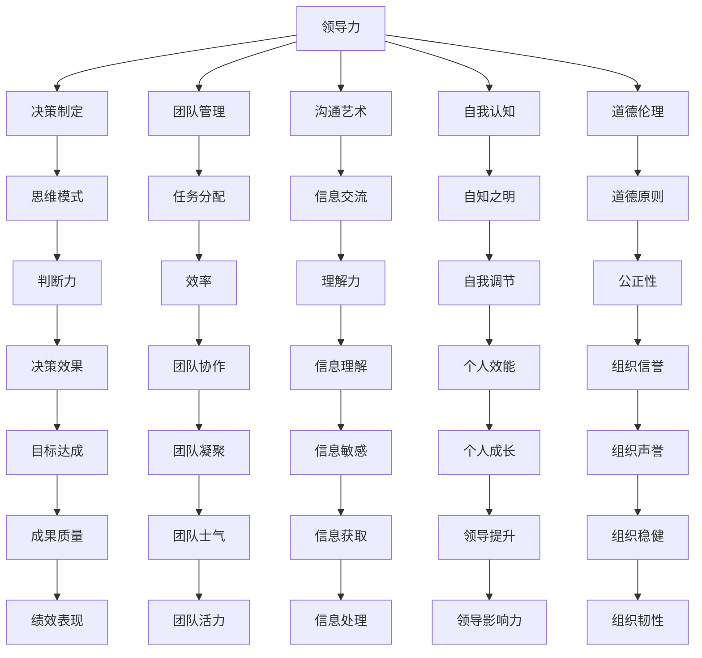

                 

# 思维体系对领导力的影响

## 1. 背景介绍

### 1.1 问题由来

在当代组织管理中，领导力是一个至关重要的元素。它不仅决定了组织的战略方向，还对员工的士气和团队的凝聚力产生深远影响。然而，领导力的提升不仅仅依赖于个人魅力或者经验，更在于其背后的思维体系。

### 1.2 问题核心关键点

思维体系对领导力的影响体现在多个方面：

- **决策制定**：思维体系的决策模式直接影响了领导者的判断力和决策效率。
- **团队管理**：如何看待团队成员的能力和潜力，如何分配任务和资源，如何激励和引导团队，这些都与领导者的思维体系密切相关。
- **沟通艺术**：有效的沟通是领导力表现的重要方面，而沟通的方式和技巧往往受思维体系的影响。
- **自我认知**：一个清晰的自我认知体系有助于领导者了解自己的优势和局限，从而更好地发挥领导作用。
- **道德伦理**：领导者所持有的伦理观直接影响其领导行为，关系到组织的长期发展和声誉。

### 1.3 问题研究意义

深入理解思维体系对领导力的影响，不仅有助于提高领导者的个人效能，还能优化组织的管理效能。对于企业和领导者来说，识别并培养正确的思维体系，是实现卓越绩效和长期可持续发展的关键。

## 2. 核心概念与联系

### 2.1 核心概念概述

- **领导力**：指领导者影响、激励、引导团队以达到共同目标的能力。
- **思维体系**：指个体在决策、思考、沟通、自我认知等方面所依赖的认知结构和行为模式。
- **决策制定**：领导者基于思维体系对复杂信息进行判断和选择的过程。
- **团队管理**：如何有效地组织、领导和激励团队，以实现组织目标。
- **沟通艺术**：在组织内外建立有效沟通的能力，包括语言、情感和信息交流。
- **自我认知**：对自身行为、情感和能力的自知之明。
- **道德伦理**：领导者在行为和决策中遵循的道德标准和伦理原则。

这些概念之间的联系通过以下Mermaid流程图展示：



这个图表展示了领导力与其他核心概念之间的联系，以及思维体系在其中的关键作用。

## 3. 核心算法原理 & 具体操作步骤

### 3.1 算法原理概述

思维体系对领导力的影响可以从多个维度进行建模和分析。以下是一个简化的理论框架：

1. **思维模式**：领导者基于其思维模式进行决策，影响团队的凝聚力和目标达成。
2. **道德原则**：领导者的道德伦理直接影响其领导行为，关系到组织的长期发展。
3. **自我认知**：自我认知帮助领导者理解自身局限，实现有效决策和团队管理。
4. **沟通技巧**：良好的沟通技巧能够提升信息传递和团队协作的效率。
5. **决策制定**：决策模式决定领导者的判断力和执行效率。

### 3.2 算法步骤详解

1. **自我评估**：通过心理测评工具（如DISC、MBTI等）进行自我认知的评估，识别自身的优势和局限。
2. **行为建模**：基于评估结果，构建符合自身优势和需要的思维模式。
3. **道德教育**：参加道德伦理培训课程，了解和内化道德原则。
4. **沟通培训**：通过工作坊和模拟训练提升沟通技巧。
5. **决策训练**：进行决策模拟和案例分析，培养决策制定的能力和风格。

### 3.3 算法优缺点

#### 优点：

- **系统性**：通过系统化的评估和培训，能够全面提升领导者的各项能力。
- **个性化**：基于个人特点设计个性化的思维模式和决策方法。
- **长期性**：通过持续的培训和实践，实现领导力的持续提升。

#### 缺点：

- **成本高**：培训和评估需要时间和资源，短期内可能成本较高。
- **实施难度**：个性化培训和行为建模需要高度的专业指导和资源支持。
- **变化缓慢**：领导力提升是一个长期过程，短期内效果不明显。

### 3.4 算法应用领域

思维体系对领导力的提升方法在多个领域都有应用：

- **企业领导力培训**：大型企业和组织通过系统的领导力培训提升管理层的决策能力和团队管理水平。
- **公共服务管理**：政府和公共机构通过领导力培训提升公务员的行政效率和服务质量。
- **非营利组织**：NGO和志愿者组织通过提升领导者的沟通和决策能力，增强组织的运作效能。

## 4. 数学模型和公式 & 详细讲解

### 4.1 数学模型构建

假设领导者通过心理测评得到的自我认知评分和道德伦理评分分别为 $x_1$ 和 $x_2$。根据这些评分，可以构建一个综合评分的数学模型：

$$
\text{综合评分} = f(x_1, x_2) = a \cdot x_1 + b \cdot x_2
$$

其中，$a$ 和 $b$ 是模型系数，需要根据具体情境进行调优。

### 4.2 公式推导过程

通过线性回归等统计方法，可以求解模型系数 $a$ 和 $b$。假设我们有一个包含 $n$ 个样本的训练集，每个样本的自我认知评分和道德伦理评分为 $(x_{1i}, x_{2i})$，综合评分为 $y_i$。则模型可以表示为：

$$
y_i = a \cdot x_{1i} + b \cdot x_{2i} + \epsilon_i
$$

其中 $\epsilon_i$ 为随机误差项。通过最小二乘法求解，可以得到：

$$
a = \frac{\sum_{i=1}^n (x_{1i} - \bar{x}_1)(y_i - \bar{y})}{\sum_{i=1}^n (x_{1i} - \bar{x}_1)^2}, b = \frac{\sum_{i=1}^n (x_{2i} - \bar{x}_2)(y_i - \bar{y})}{\sum_{i=1}^n (x_{2i} - \bar{x}_2)^2}
$$

其中 $\bar{x}_1$ 和 $\bar{x}_2$ 分别为自我认知评分和道德伦理评分的均值，$\bar{y}$ 为综合评分的均值。

### 4.3 案例分析与讲解

以某大型企业的领导者培训项目为例：

1. **自我评估**：使用MBTI工具进行员工自我认知评估，记录每个员工的领导风格（如外向性、判断性等）。
2. **道德教育**：组织领导力培训课程，重点讲授伦理决策模型。
3. **沟通培训**：通过角色扮演和情景模拟，提升沟通技巧。
4. **决策训练**：通过模拟复杂决策情境，训练领导者的决策制定能力。
5. **评估反馈**：使用问卷和360度反馈机制，评估培训效果。

通过这样的流程，企业能够系统化地提升领导者的领导力，从而实现组织效能的提升。

## 5. 项目实践：代码实例和详细解释说明

### 5.1 开发环境搭建

- **Python环境**：安装Python 3.x，建议选择 Anaconda 或 Miniconda。
- **Jupyter Notebook**：用于编写和执行代码。
- **Pandas**：用于数据处理。
- **Scikit-learn**：用于机器学习模型构建和评估。
- **TensorFlow**：用于深度学习模型的训练和测试。

### 5.2 源代码详细实现

以下是一个基于Python的简单案例，展示了如何进行领导者评估和行为建模的实现：

```python
import pandas as pd
from sklearn.linear_model import LinearRegression

# 假设数据集如下
data = pd.DataFrame({
    'x1': [60, 70, 80, 90, 100],
    'x2': [70, 75, 80, 85, 90],
    'y': [85, 90, 95, 95, 100]
})

# 构建模型
model = LinearRegression()
model.fit(data[['x1', 'x2']], data['y'])

# 输出模型系数
print(model.coef_)
```

### 5.3 代码解读与分析

- **数据准备**：使用Pandas创建数据集，包含自我认知评分、道德伦理评分和综合评分。
- **模型训练**：使用Scikit-learn库的线性回归模型进行训练。
- **结果输出**：输出模型系数，即 $a$ 和 $b$，用于评估模型的拟合效果。

## 6. 实际应用场景

### 6.1 企业领导力培训

在大型企业中，领导力的提升是通过系统的培训项目实现的。这些项目通常包括以下几个关键环节：

- **自我认知评估**：通过心理测评工具，了解领导者的行为和情感特征。
- **道德教育**：通过案例分析和情景模拟，提升领导者的伦理决策能力。
- **沟通培训**：通过角色扮演和实际演练，提高沟通技巧和团队协作能力。
- **决策训练**：通过模拟复杂情境，训练领导者的决策制定能力。
- **持续评估**：定期进行360度反馈和绩效评估，确保培训效果持续提升。

### 6.2 公共服务管理

在政府和公共服务领域，领导力的提升同样重要。公共管理者通过以下步骤实现领导力的提升：

- **政策制定**：基于自我认知和道德伦理，制定符合公共利益的政策。
- **公共沟通**：通过透明和高效的沟通机制，提升公众对政策的理解和支持。
- **问题解决**：采用数据驱动的方法，解决公共管理中的复杂问题。
- **绩效评估**：建立科学的绩效评估体系，确保管理目标的实现。

### 6.3 非营利组织

非营利组织通过领导力培训提升管理效能：

- **组织愿景**：基于组织使命和愿景，设计符合自身特点的领导力模型。
- **能力提升**：通过培训和实践，提升领导者的沟通、决策和团队管理能力。
- **资源配置**：优化资源分配，确保项目和活动的有效执行。
- **外部合作**：建立合作伙伴关系，共同推动组织目标的实现。

## 7. 工具和资源推荐

### 7.1 学习资源推荐

- **《领导力与变革管理》**：讲解领导力的基本原理和实践方法。
- **《领导力心理学》**：介绍领导力的心理基础和行为模式。
- **《现代领导力》**：提供最新的领导力研究成果和实践案例。
- **Coursera领导力课程**：提供系统的领导力培训课程，包括自我认知、沟通技巧、决策制定等。
- **LinkedIn Learning**：提供实用的领导力提升视频教程，涵盖各种管理和沟通技巧。

### 7.2 开发工具推荐

- **Anaconda**：提供Python及其相关库的安装和管理。
- **Jupyter Notebook**：提供交互式的代码编写和执行环境。
- **Scikit-learn**：提供机器学习模型的构建和评估工具。
- **TensorFlow**：提供深度学习模型的构建和训练工具。
- **PyTorch**：提供灵活的深度学习框架。

### 7.3 相关论文推荐

- **《领导力理论与实践》**：总结了领导力的理论和实践研究。
- **《道德与领导力》**：探讨道德伦理在领导力中的作用。
- **《团队领导与绩效》**：分析团队领导对团队绩效的影响。
- **《现代组织变革与管理》**：提供最新的组织变革和管理理论。

## 8. 总结：未来发展趋势与挑战

### 8.1 研究成果总结

思维体系对领导力的影响研究已经取得了丰硕成果，但仍有提升空间：

- **方法多样性**：需要更多研究和实践，发展适用于不同情境的领导力提升方法。
- **跨文化适用性**：不同文化背景下的领导力差异，需要进一步探索和验证。
- **技术融合**：如何结合人工智能和大数据分析，提升领导力的精准性和效果。

### 8.2 未来发展趋势

未来，思维体系对领导力的影响将呈现以下趋势：

- **数据驱动**：通过大数据和人工智能技术，提升领导力评估的准确性和个性化。
- **技术融合**：结合人工智能和自然语言处理技术，实现领导力的智能评估和提升。
- **跨领域应用**：领导力提升方法将在更多领域得到应用，如医疗、教育等。
- **实时反馈**：通过实时数据监测和反馈机制，实现领导力的动态调整和优化。
- **国际化视野**：全球化视野下，领导力的提升需要考虑不同文化背景和国际环境。

### 8.3 面临的挑战

尽管未来充满机遇，领导力提升仍然面临一些挑战：

- **数据隐私**：在收集和处理领导力数据时，需要严格遵守数据隐私法规。
- **技术复杂性**：如何简化和优化技术工具，降低使用门槛。
- **实施难度**：如何将技术方法应用到实际工作中，并实现持续改进。
- **伦理问题**：如何确保技术应用的公平性和道德性，避免技术滥用。

### 8.4 研究展望

未来的领导力研究需要在以下几个方面进行探索：

- **伦理技术**：开发符合伦理标准的技术工具，确保领导力提升过程的公平和透明。
- **实时监测**：构建实时数据监测系统，实现领导力的动态评估和改进。
- **多学科融合**：将领导力研究与心理学、社会学、管理学等多学科结合，提供更全面的视角和方法。
- **国际化研究**：针对不同文化背景下的领导力提升需求，开展全球化研究。

## 9. 附录：常见问题与解答

**Q1：领导力提升是否只依赖于个人魅力？**

A: 领导力提升不仅依赖于个人魅力，更依赖于系统的思维体系和行为模式。个人魅力是领导力的重要组成部分，但系统的培训和提升更为关键。

**Q2：如何衡量领导力提升的效果？**

A: 领导力提升的效果可以通过多种方式衡量，如绩效评估、员工满意度、团队协作能力等。使用360度反馈机制，全面评估领导者的影响力和改进空间。

**Q3：领导力提升需要多长时间？**

A: 领导力提升是一个长期过程，需要持续的学习、实践和改进。具体时间取决于领导者的自我认知水平和培训效果。

**Q4：如何实现跨文化的领导力提升？**

A: 在跨文化环境下，需要结合不同文化背景的特征，定制化领导力培训方案。同时，使用多语言数据和模型，确保领导力提升方法的普适性。

**Q5：领导力提升是否需要高成本？**

A: 领导力提升需要一定的成本投入，但通过系统化培训和持续改进，可以实现显著的绩效提升。成本是值得的。

---

作者：禅与计算机程序设计艺术 / Zen and the Art of Computer Programming

