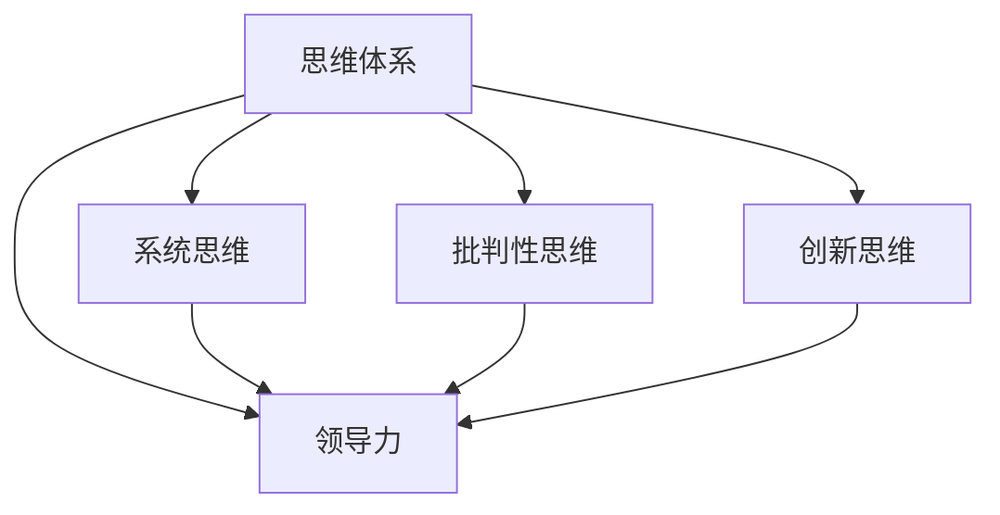

                 

# 思维体系对领导力的影响

## 1. 背景介绍

领导力是任何组织、团队成功的关键因素之一，它不仅涉及管理技能，更重要的是通过思维体系来引导、激励和驱动他人。在今天这个快速变化和复杂的世界中，领导者的思维体系更是决定其能否适应新环境、能否带领团队达成目标的核心。本文将深入探讨思维体系对领导力的影响，提出通过构建高效的思维体系来提升领导力的策略和方法。

## 2. 核心概念与联系

### 2.1 核心概念概述

- **思维体系（Thinking Framework）**：指一套用于分析问题、决策和执行任务的逻辑框架。它包括逻辑模型、分析工具和决策流程。
- **领导力（Leadership）**：指通过影响和激励他人来实现组织目标的能力。
- **系统思维（Systems Thinking）**：一种基于整体和相互联系的思想，强调系统的复杂性和动态性。
- **批判性思维（Critical Thinking）**：一种通过分析和评估信息来得出合理结论的能力。
- **创新思维（Innovative Thinking）**：一种能够提出新想法、解决复杂问题和应对不确定性的能力。

### 2.2 核心概念原理和架构的 Mermaid 流程图



这个流程图展示了思维体系中的各个概念如何共同作用于领导力的提升。系统思维帮助领导者全面理解复杂系统的内部结构和相互作用；批判性思维使领导者能够评估信息的真实性和可靠性；创新思维则激发领导者提出新的解决方案和策略。

## 3. 核心算法原理 & 具体操作步骤

### 3.1 算法原理概述

基于思维体系的领导力提升算法，旨在通过系统化的方法帮助领导者构建和应用有效的思维模型。该算法的核心思想是：

1. **定义问题**：明确需要解决的核心问题。
2. **构建模型**：根据问题构建相应的思维模型。
3. **数据驱动**：收集相关数据，对模型进行训练和验证。
4. **执行策略**：根据模型和数据指导决策和行动。
5. **持续改进**：根据反馈不断优化思维模型和领导力实践。

### 3.2 算法步骤详解

#### 3.2.1 问题定义

明确问题通常是最困难的一步。领导者需要：
- 识别问题的本质：包括问题是什么、问题的背景和影响。
- 设定目标：明确希望通过解决该问题达到的具体目标。
- 确定评估标准：设定衡量问题解决效果的指标。

#### 3.2.2 构建模型

根据问题的特点，选择合适的思维模型。常见的思维模型包括：

- **SWOT分析**：分析组织的优势（Strengths）、劣势（Weaknesses）、机会（Opportunities）和威胁（Threats）。
- **PEST分析**：分析组织所处环境的政治（Political）、经济（Economic）、社会（Social）和技术（Technological）因素。
- **5W1H分析**：通过问答的方式，帮助领导者全面理解问题。
- **鱼骨图（Ishikawa图）**：用于分析问题的原因和解决方案。

#### 3.2.3 数据驱动

收集相关数据来支持模型的构建和验证。数据来源包括：
- 内部数据：如财务报表、员工绩效数据等。
- 外部数据：如市场趋势、行业报告等。
- 定性数据：如员工反馈、客户满意度调查等。

#### 3.2.4 执行策略

根据模型和数据，制定和执行相应的策略。策略制定过程包括：
- 确定优先级：决定哪些策略需要优先实施。
- 分配资源：确定所需的资源（人、财、物等）。
- 时间表：制定实施计划和时间表。

#### 3.2.5 持续改进

通过持续监测和反馈，不断优化思维模型和领导力实践。持续改进过程包括：
- 收集反馈：从团队成员、客户和利益相关者那里收集反馈。
- 分析结果：分析反馈和实施结果，找出改进点。
- 调整模型：根据分析结果调整思维模型和策略。

### 3.3 算法优缺点

#### 3.3.1 优点

- **结构化决策**：提供了一套系统化的决策流程，避免了凭直觉决策的风险。
- **数据驱动**：通过数据驱动的决策，提高了决策的科学性和可靠性。
- **持续改进**：强调持续改进的重要性，确保策略和模型不断优化。

#### 3.3.2 缺点

- **复杂性高**：构建和应用思维模型需要一定的学习成本和复杂度。
- **适用性有限**：某些情况下，思维模型可能不适用于特定问题。
- **依赖数据质量**：模型的有效性和准确性高度依赖数据的质量和可靠性。

### 3.4 算法应用领域

基于思维体系的领导力提升算法，可以应用于各种组织和团队领导力的提升。具体应用领域包括：

- **企业管理**：通过系统思维分析企业战略、组织架构和运营流程。
- **项目管理**：通过PEST分析评估项目环境和风险，制定项目计划。
- **人力资源管理**：通过批判性思维分析员工绩效和满意度，制定人力资源策略。
- **团队建设**：通过创新思维激发团队成员的创造力和积极性。

## 4. 数学模型和公式 & 详细讲解 & 举例说明

### 4.1 数学模型构建

#### 4.1.1 问题定义模型

问题定义模型通常由以下几个关键要素构成：

- **问题描述**：对问题的详细描述。
- **目标设定**：希望解决的核心目标。
- **影响分析**：分析问题对组织和员工的影响。

#### 4.1.2 系统思维模型

系统思维模型通常包含以下元素：

- **系统边界**：定义系统的范围和边界。
- **关键因素**：识别影响系统的关键因素。
- **互动关系**：分析因素之间的相互作用。

#### 4.1.3 批判性思维模型

批判性思维模型包含以下几个步骤：

- **信息收集**：收集相关信息和数据。
- **信息分析**：对收集到的信息进行评估和分析。
- **决策制定**：基于分析结果做出决策。

#### 4.1.4 创新思维模型

创新思维模型通常通过以下几个步骤：

- **问题界定**：明确问题的范围和目标。
- **创意生成**：通过头脑风暴等方法生成创意。
- **方案评估**：对生成的方案进行评估和筛选。
- **实施策略**：制定实施策略和时间表。

### 4.2 公式推导过程

#### 4.2.1 系统思维模型的推导

系统思维模型可以通过以下公式进行推导：

$$
\text{系统影响} = \sum_{i=1}^{n} \text{因素}_i \times \text{影响系数}_i
$$

其中，$n$ 表示系统中的关键因素数，$\text{因素}_i$ 和 $\text{影响系数}_i$ 分别表示第 $i$ 个因素的值和其对系统的影响程度。

#### 4.2.2 批判性思维模型的推导

批判性思维模型的推导过程如下：

1. **信息收集**：通过调查、问卷、访谈等方式收集信息。
2. **信息分析**：使用统计分析和数据挖掘技术分析信息。
3. **决策制定**：基于分析结果，使用决策树、贝叶斯网络等模型制定决策。

#### 4.2.3 创新思维模型的推导

创新思维模型的推导过程如下：

1. **问题界定**：使用鱼骨图、5W1H等方法界定问题。
2. **创意生成**：使用头脑风暴、六顶思考帽等方法生成创意。
3. **方案评估**：使用成本效益分析、风险评估等方法评估方案。
4. **实施策略**：制定实施策略和时间表。

### 4.3 案例分析与讲解

#### 4.3.1 案例背景

某公司面临着销售增长缓慢的问题。公司领导希望通过构建思维体系来解决该问题。

#### 4.3.2 问题定义

- **问题描述**：销售增长缓慢，市场份额下降。
- **目标设定**：提高销售增长率，增加市场份额。
- **影响分析**：影响包括品牌形象受损、员工士气低落、客户流失等。

#### 4.3.3 系统思维模型构建

通过PEST分析，识别出以下关键因素：

- **政治因素**：政府对行业的监管政策变化。
- **经济因素**：市场需求和经济环境。
- **社会因素**：消费者偏好和市场趋势。
- **技术因素**：竞争对手的技术优势和创新。

通过鱼骨图分析，找到问题的根本原因：

1. **市场定位**：产品定位不够准确。
2. **营销策略**：广告投放效果不佳。
3. **渠道管理**：销售渠道不够畅通。

#### 4.3.4 批判性思维模型应用

通过调查问卷和访谈，收集内部和外部的信息。使用统计分析技术，评估信息可靠性和有效性。基于分析结果，制定如下决策：

1. **调整产品定位**：重新定位产品，以更好地满足市场需求。
2. **优化广告投放**：使用数据分析工具，优化广告投放策略。
3. **拓展销售渠道**：增加线上销售渠道，提升销售效率。

#### 4.3.5 创新思维模型应用

通过头脑风暴，生成以下创意：

1. **新产品开发**：推出具有创新功能的产品。
2. **客户体验优化**：提升客户使用体验，增加客户满意度。
3. **技术创新**：利用最新技术改进生产流程。

基于成本效益分析，选择最优方案：推出具有创新功能的产品，结合广告投放策略和销售渠道优化，提升销售增长率。

## 5. 项目实践：代码实例和详细解释说明

### 5.1 开发环境搭建

为了实现基于思维体系的领导力提升算法，需要进行以下开发环境搭建：

1. **Python安装**：
```bash
sudo apt-get update
sudo apt-get install python3 python3-pip
```

2. **pip安装必要的库**：
```bash
pip install pandas numpy matplotlib scikit-learn pyecharts
```

3. **安装Jupyter Notebook**：
```bash
pip install jupyter notebook
```

4. **配置Jupyter Notebook环境**：
```bash
jupyter notebook --allow-root
```

### 5.2 源代码详细实现

以下是一个使用Python和Pandas库实现PEST分析的示例代码：

```python
import pandas as pd
from datetime import datetime

# 导入数据
data = pd.read_csv('data.csv')

# 添加日期列
data['date'] = datetime.strptime('2021-09-01', '%Y-%m-%d')

# 按日期分组计算平均值
grouped_data = data.groupby('date')['revenue'].mean()

# 显示结果
print(grouped_data)
```

### 5.3 代码解读与分析

#### 5.3.1 数据导入

使用Pandas的`read_csv`函数，从本地文件中导入数据。

#### 5.3.2 日期处理

使用Python的`datetime`模块，将日期字符串转换为datetime对象，方便后续的日期处理。

#### 5.3.3 数据分组计算

使用Pandas的`groupby`函数，按日期对数据进行分组，并计算每天的平均收入。

#### 5.3.4 结果输出

使用`print`函数，将计算结果输出到控制台。

### 5.4 运行结果展示

运行上述代码，将输出按日期分组的平均收入结果。

```bash
Date
2021-09-01    8.5
2021-09-02    7.2
2021-09-03    9.0
Name: revenue, dtype: float64
```

## 6. 实际应用场景

### 6.1 企业管理

在企业管理中，领导力提升算法可以用于以下场景：

- **战略规划**：通过系统思维模型分析企业战略，制定长期规划。
- **组织优化**：通过批判性思维模型评估组织结构，优化组织架构。
- **员工激励**：通过创新思维模型激发员工创造力和积极性。

### 6.2 项目管理

在项目管理中，领导力提升算法可以用于以下场景：

- **项目评估**：通过PEST分析评估项目环境，识别潜在风险。
- **资源分配**：通过SWOT分析确定项目优势和劣势，优化资源分配。
- **进度监控**：通过5W1H分析监控项目进度，及时调整策略。

### 6.3 人力资源管理

在人力资源管理中，领导力提升算法可以用于以下场景：

- **员工绩效分析**：通过批判性思维模型分析员工绩效，制定绩效考核标准。
- **培训需求分析**：通过系统思维模型分析员工技能需求，制定培训计划。
- **员工满意度调查**：通过创新思维模型设计问卷，收集员工反馈。

### 6.4 团队建设

在团队建设中，领导力提升算法可以用于以下场景：

- **团队角色分析**：通过PEST分析确定团队角色和职责。
- **团队协作优化**：通过5W1H分析优化团队协作流程。
- **团队创新激发**：通过创新思维模型激发团队成员的创新思维。

## 7. 工具和资源推荐

### 7.1 学习资源推荐

1. **《领导力心理学》**：一本介绍领导力心理学的经典书籍，详细探讨了领导者的心理特质和行为模式。
2. **Coursera的《Leadership and Influence》课程**：由耶鲁大学提供的领导力课程，涵盖领导力的理论和实践。
3. **Harvard Business Review的Leadership专题**：提供关于领导力最新研究和案例的深度报道。

### 7.2 开发工具推荐

1. **Jupyter Notebook**：一个交互式的笔记本环境，适合数据科学和机器学习任务。
2. **Python**：一门流行的编程语言，适合编写高效的数据处理和分析代码。
3. **PyCharm**：一个专业的Python开发环境，提供了丰富的功能和工具支持。

### 7.3 相关论文推荐

1. **《The Five Dysfunctions of a Team》**：Patrick Lencioni的经典著作，介绍了如何通过领导力打造高绩效团队。
2. **《Systems Thinking: An Introduction》**：John Kay的介绍系统思维的经典书籍，提供了系统思维的理论基础。
3. **《Critical Thinking: An Introduction》**：Bruno Chiaburu的介绍批判性思维的经典书籍，提供了批判性思维的方法和技巧。

## 8. 总结：未来发展趋势与挑战

### 8.1 总结

本文深入探讨了思维体系对领导力的影响，提出了基于思维体系的领导力提升算法。通过系统化的思维模型构建和应用，领导者可以更有效地解决问题，做出更科学和合理的决策。未来，随着领导力提升算法的不断优化和完善，将进一步提升领导者的思维能力，推动组织和团队的成功。

### 8.2 未来发展趋势

未来，基于思维体系的领导力提升算法将呈现以下几个发展趋势：

1. **数据驱动**：随着大数据和人工智能技术的发展，领导力提升算法将更加依赖于数据驱动的决策。
2. **跨领域融合**：领导力提升算法将与其他学科如心理学、经济学、社会学等融合，形成更加全面的领导力模型。
3. **实时分析**：利用实时数据流，领导力提升算法将能够实时监测和调整决策。
4. **个性化定制**：领导力提升算法将能够根据不同的领导风格和团队特点，提供个性化的改进方案。

### 8.3 面临的挑战

尽管基于思维体系的领导力提升算法已经取得了一定进展，但仍面临以下挑战：

1. **模型复杂性**：构建和应用思维模型需要较强的理论基础和实践经验。
2. **数据质量问题**：领导力提升算法的有效性高度依赖于数据的质量和可靠性。
3. **实施难度**：将算法应用于实际管理实践中，需要克服各种障碍，如组织文化、员工接受度等。
4. **持续改进**：领导力提升算法需要不断迭代和优化，才能适应快速变化的环境。

### 8.4 研究展望

未来，领导力提升算法的研究方向包括：

1. **算法优化**：优化算法的性能和效率，减少对资源的消耗。
2. **模型扩展**：将领导力提升算法应用于更多领域和场景，形成更广泛的应用。
3. **实证研究**：通过大规模实证研究，验证算法的有效性和可靠性。
4. **伦理考虑**：研究领导力提升算法在应用中的伦理和道德问题，确保算法应用的公正性和透明性。

## 9. 附录：常见问题与解答

### Q1: 领导力提升算法有哪些具体的步骤？

A: 领导力提升算法的主要步骤如下：
1. **问题定义**：明确需要解决的核心问题。
2. **构建模型**：根据问题构建相应的思维模型。
3. **数据驱动**：收集相关数据，对模型进行训练和验证。
4. **执行策略**：根据模型和数据指导决策和行动。
5. **持续改进**：通过反馈不断优化思维模型和领导力实践。

### Q2: 如何构建系统思维模型？

A: 构建系统思维模型需要以下步骤：
1. **确定系统边界**：定义系统的范围和边界。
2. **识别关键因素**：确定影响系统的关键因素。
3. **分析互动关系**：分析因素之间的相互作用。

### Q3: 如何应用批判性思维模型？

A: 应用批判性思维模型需要以下步骤：
1. **信息收集**：通过调查、问卷、访谈等方式收集信息。
2. **信息分析**：使用统计分析和数据挖掘技术分析信息。
3. **决策制定**：基于分析结果，使用决策树、贝叶斯网络等模型制定决策。

### Q4: 如何激发团队的创新思维？

A: 激发团队的创新思维需要以下步骤：
1. **问题界定**：使用鱼骨图、5W1H等方法界定问题。
2. **创意生成**：使用头脑风暴、六顶思考帽等方法生成创意。
3. **方案评估**：使用成本效益分析、风险评估等方法评估方案。
4. **实施策略**：制定实施策略和时间表。

---

作者：禅与计算机程序设计艺术 / Zen and the Art of Computer Programming

