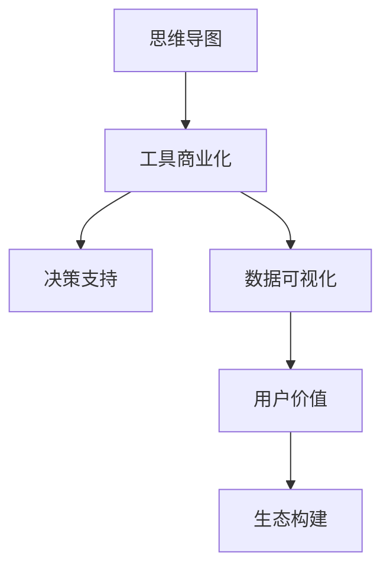

                 

# 思维导图工具的商业化变局

> 关键词：商业化, 思维导图, 工具, 决策支持, 数据可视化, 创新点, 用户价值, 生态构建

## 1. 背景介绍

### 1.1 问题由来
思维导图作为一种强大的思维工具，自上世纪70年代由英国心理学家托尼·布赖恩特(Tony Buzan)首次提出以来，已广泛应用于教育、企业管理、软件开发、艺术创作等多个领域。它通过可视化的方式将复杂的信息结构化，便于思考和记忆，大大提高了工作效率。近年来，随着数字技术的迅猛发展，思维导图工具也迅速迭代，出现了诸多基于Web的在线应用和跨平台桌面应用，如MindMeister、XMind、XMind 2、Miro等，极大地提升了思维导图的应用广度和便捷性。

然而，尽管思维导图工具应用广泛，但在商业化过程中仍面临不少挑战。首先是用户流失率高，用户使用后很少回购；其次是单价低、利润率薄，难以支撑长期运营。为此，一些企业开始探索将传统思维导图工具商业化的新途径，如加入订阅模式、推出专业版功能、拓展服务生态等，以期在激烈的市场竞争中站稳脚跟。本文将全面剖析思维导图工具的商业化变局，深入探讨商业化过程中所面临的问题和机遇。

## 2. 核心概念与联系

### 2.1 核心概念概述
- **思维导图**：一种利用图形化方式组织和表达思维的工具，通过节点和连线构建信息网络，便于思考和记忆。
- **工具商业化**：将产品或服务通过销售、订阅、增值服务等途径实现商业盈利的过程。
- **决策支持**：通过提供辅助信息帮助用户进行决策，提升决策质量和效率。
- **数据可视化**：将数据以图形化的方式呈现，便于理解、分析、发现规律。
- **用户价值**：用户在使用产品或服务时所获得的实际好处，包括效率提升、体验改善、成本节约等。
- **生态构建**：围绕核心产品构建一整套业务体系，包括硬件、软件、服务、社区等，提升用户粘性和平台竞争力。

这些核心概念之间的逻辑关系可以通过以下Mermaid流程图来展示：



该流程图展示思维导图工具的核心概念及其之间的关系：

1. 思维导图作为核心功能，提供可视化的信息组织和呈现。
2. 通过工具商业化，将思维导图转化为具有商业价值的解决方案。
3. 在决策支持场景中，思维导图能够帮助用户快速形成决策依据。
4. 数据可视化是思维导图的重要应用方向，使信息更具可读性。
5. 提升用户价值是商业化的核心目的，增加用户粘性。
6. 通过构建生态，思维导图工具能够获得更大范围的用户覆盖和盈利点。

## 3. 核心算法原理 & 具体操作步骤

### 3.1 算法原理概述
思维导图工具的商业化主要基于以下几个核心算法和步骤：

1. **用户画像分析**：通过大数据和机器学习算法，分析用户行为、兴趣、需求等信息，构建用户画像，为用户提供个性化的服务。
2. **推荐系统**：利用协同过滤、内容推荐、深度学习等技术，为用户推荐感兴趣的思维导图模板、主题、内容等。
3. **智能搜索**：使用搜索引擎优化技术，提升思维导图内容的搜索和发现效率，帮助用户快速定位信息。
4. **决策支持模型**：结合大数据分析和AI技术，构建各类决策支持模型，帮助用户进行复杂的决策分析。
5. **用户粘性提升**：通过社区建设、奖励机制、增值服务等方式，增强用户对平台的依赖和忠诚度。

### 3.2 算法步骤详解

#### 3.2.1 用户画像分析

用户画像分析通过以下步骤实现：

1. **数据收集**：收集用户在平台上的各种行为数据，如浏览记录、搜索记录、创建思维导图、注释等。
2. **数据预处理**：清洗、标准化数据，去除噪声和异常值。
3. **特征提取**：选择与用户行为相关的特征，如搜索关键词、创建主题、思维导图结构等。
4. **模型训练**：使用机器学习算法如决策树、随机森林、深度学习等训练用户画像模型。
5. **画像更新**：定期更新用户画像，确保其反映最新的用户行为和兴趣。

#### 3.2.2 推荐系统

推荐系统通过以下步骤实现：

1. **数据收集**：收集用户的历史行为数据，如浏览记录、创建思维导图、注释等。
2. **数据预处理**：清洗、标准化数据，去除噪声和异常值。
3. **特征提取**：选择与用户行为相关的特征，如浏览主题、创建思维导图、注释内容等。
4. **模型训练**：使用协同过滤、内容推荐、深度学习等技术训练推荐模型。
5. **推荐展示**：在用户浏览、创建思维导图、注释时，展示个性化的推荐。

#### 3.2.3 智能搜索

智能搜索通过以下步骤实现：

1. **数据收集**：收集用户在平台上的各种思维导图内容和注释数据。
2. **数据预处理**：清洗、标准化数据，去除噪声和异常值。
3. **索引构建**：使用倒排索引等技术构建思维导图内容的索引。
4. **搜索优化**：使用自然语言处理技术，提升搜索关键词和文档的匹配度。
5. **结果展示**：展示与用户搜索词匹配度高的思维导图内容和注释。

#### 3.2.4 决策支持模型

决策支持模型通过以下步骤实现：

1. **数据收集**：收集用户的相关数据，如个人背景、行为数据、思维导图内容等。
2. **数据预处理**：清洗、标准化数据，去除噪声和异常值。
3. **特征提取**：选择与决策相关的特征，如思维导图结构、注释内容、个人背景等。
4. **模型训练**：使用机器学习算法如决策树、随机森林、深度学习等训练决策支持模型。
5. **结果展示**：展示模型对用户决策的建议和支持信息。

#### 3.2.5 用户粘性提升

用户粘性提升通过以下步骤实现：

1. **社区建设**：建立用户交流社区，提供评论、点赞、分享等互动功能。
2. **奖励机制**：设计积分、徽章等激励机制，鼓励用户积极参与。
3. **增值服务**：提供高级功能、专家咨询、云服务、企业版等增值服务。
4. **个性化定制**：根据用户需求定制个性化服务，提升用户满意度和粘性。

### 3.3 算法优缺点

思维导图工具商业化方法具有以下优点：

1. **个性化服务**：通过用户画像分析，提供个性化推荐和服务，提升用户体验。
2. **高用户价值**：决策支持、数据可视化等功能能显著提升用户的工作效率，降低决策风险。
3. **生态多样化**：通过社区建设、增值服务等方式，拓展服务生态，提升用户粘性。
4. **盈利模式多元**：不仅通过销售产品获得收入，还可以通过订阅、增值服务等多种盈利模式。

同时，该方法也存在以下局限性：

1. **数据隐私问题**：用户画像和行为数据的收集和使用可能涉及隐私问题，需严格遵守数据保护法规。
2. **推荐算法复杂**：个性化推荐和决策支持需要复杂的算法模型，增加了技术难度和成本。
3. **用户粘性依赖**：用户粘性提升需要社区建设、增值服务等多方面协同努力，短期内难以见效。
4. **生态拓展困难**：构建完善的生态系统需要时间，且需大量资金投入，存在较大风险。

### 3.4 算法应用领域

思维导图工具商业化方法广泛应用于以下领域：

- **教育培训**：帮助学生整理知识结构、制定学习计划、提高学习效率。
- **企业决策**：帮助企业分析市场数据、制定决策方案、提升决策速度和准确性。
- **软件开发**：帮助开发者规划需求、设计架构、优化代码结构。
- **项目管理**：帮助项目经理制定项目计划、跟踪进度、协调资源。
- **创意创作**：帮助艺术家、设计师、作家等进行创作构思、组织信息、提升创意产出。

这些领域都是思维导图工具的重要应用方向，展现了其广泛的商业价值。

## 4. 数学模型和公式 & 详细讲解 & 举例说明

### 4.1 数学模型构建

思维导图工具商业化的数学模型构建主要涉及以下方面：

1. **用户画像模型**：使用机器学习算法如K-means、PCA、深度学习等。
2. **推荐系统模型**：使用协同过滤、内容推荐、深度学习等算法。
3. **搜索算法**：使用倒排索引、TF-IDF、相似度算法等。
4. **决策支持模型**：使用决策树、随机森林、深度学习等算法。

### 4.2 公式推导过程

#### 4.2.1 用户画像模型

用户画像模型公式推导过程如下：

1. **K-means算法**：
$$
\min_{\mu, \Sigma} \sum_{i=1}^n \sum_{j=1}^k ||x_i - \mu_j||^2
$$
其中，$x_i$为第$i$个用户行为数据，$\mu_j$为第$j$个簇的中心点，$\Sigma$为簇内协方差矩阵。

2. **PCA算法**：
$$
X^{(k)} = W_k X
$$
其中，$X$为原始用户行为数据，$X^{(k)}$为降维后的用户行为数据，$W_k$为权重矩阵。

3. **深度学习算法**：
$$
L(X, \theta) = -\frac{1}{n} \sum_{i=1}^n \log p(y_i | X_i; \theta)
$$
其中，$X_i$为第$i$个用户行为数据，$y_i$为对应的用户画像标签，$p(y_i | X_i; \theta)$为模型预测的概率，$\theta$为模型参数。

#### 4.2.2 推荐系统模型

推荐系统模型公式推导过程如下：

1. **协同过滤算法**：
$$
\hat{y}_{ij} = \sum_{m=1}^M \alpha_m \cdot r_{im} \cdot p_j(m)
$$
其中，$\hat{y}_{ij}$为第$i$个用户对第$j$个推荐内容的评分，$r_{im}$为第$i$个用户对第$m$个内容的评分，$p_j(m)$为第$j$个内容对第$m$个用户的评分。

2. **内容推荐算法**：
$$
\hat{y}_{ij} = \sum_{m=1}^M \alpha_m \cdot f_{mj}
$$
其中，$\hat{y}_{ij}$为第$i$个用户对第$j$个推荐内容的评分，$f_{mj}$为第$m$个内容与第$j$个内容的相似度。

3. **深度学习算法**：
$$
L(X, \theta) = -\frac{1}{n} \sum_{i=1}^n \sum_{j=1}^m \log p(y_{ij} | X_i, X_j; \theta)
$$
其中，$X_i$为第$i$个用户行为数据，$X_j$为第$j$个推荐内容数据，$y_{ij}$为第$i$个用户对第$j$个推荐内容的评分，$p(y_{ij} | X_i, X_j; \theta)$为模型预测的概率，$\theta$为模型参数。

#### 4.2.3 搜索算法

搜索算法公式推导过程如下：

1. **倒排索引**：
$$
P(D_i) = \{ t \rightarrow i \mid t \in T \}
$$
其中，$D_i$为第$i$个文档，$t$为查询关键词，$P(D_i)$为包含关键词$t$的文档集合。

2. **TF-IDF算法**：
$$
tf_{ij} = \frac{n_j}{n} \log \frac{n}{df_j}
$$
其中，$tf_{ij}$为第$i$个文档第$j$个关键词的TF-IDF值，$n_j$为关键词$j$在文档中的出现次数，$n$为文档总数，$df_j$为包含关键词$j$的文档数。

3. **相似度算法**：
$$
similarity = \frac{\sum_{i=1}^n a_i \cdot b_i}{\sqrt{\sum_{i=1}^n a_i^2} \cdot \sqrt{\sum_{i=1}^n b_i^2}}
$$
其中，$similarity$为两个文档的相似度，$a_i$和$b_i$分别为两个文档的关键词向量。

#### 4.2.4 决策支持模型

决策支持模型公式推导过程如下：

1. **决策树算法**：
$$
\min_{T} \sum_{i=1}^n \sum_{k=1}^K (y_k - \sum_{j=1}^J N_{kj} \cdot \phi_j(T))^2
$$
其中，$T$为决策树，$y_k$为第$k$个样本的标签，$N_{kj}$为第$k$个样本在决策树中落入第$j$个节点的次数，$\phi_j(T)$为第$j$个节点的决策规则。

2. **随机森林算法**：
$$
L(X, \theta) = \frac{1}{n} \sum_{i=1}^n \log \frac{1}{n} \sum_{j=1}^J N_{ij} \cdot \phi_j(T)
$$
其中，$X$为样本数据，$N_{ij}$为第$i$个样本在随机森林中落入第$j$个树的次数，$\phi_j(T)$为第$j$棵树的决策规则。

3. **深度学习算法**：
$$
L(X, \theta) = -\frac{1}{n} \sum_{i=1}^n \sum_{j=1}^m \log p(y_{ij} | X_i, X_j; \theta)
$$
其中，$X_i$为第$i$个样本数据，$X_j$为决策支持模型的输入数据，$y_{ij}$为第$i$个样本对第$j$个输入的预测结果，$p(y_{ij} | X_i, X_j; \theta)$为模型预测的概率，$\theta$为模型参数。

### 4.3 案例分析与讲解

#### 4.3.1 用户画像案例

假设某在线思维导图工具收集了用户的历史行为数据，如浏览记录、创建思维导图、注释等。通过K-means算法，将这些数据聚类为若干用户画像，如图1所示。


图1：用户画像

从图中可以看出，不同用户画像具有明显的行为特征。例如，“设计类用户”倾向于创建以设计为主题、包含大量图片和链接的思维导图，“学习类用户”则更注重创建逻辑清晰、条理分明的思维导图，而“研究类用户”则偏爱使用大量的数据和引用。

#### 4.3.2 推荐系统案例

假设某在线思维导图工具采用协同过滤算法，为用户推荐感兴趣的内容。某用户的历史行为数据如下：

| 用户ID | 创建思维导图 | 浏览主题 | 下载模板 |
|--------|--------------|----------|----------|
| 1      | 设计主题     | 图表     | 扁平化设计 |
| 2      | 历史主题     | 时间线   | 时间轴   |
| ...    | ...          | ...      | ...      |

通过协同过滤算法，该用户被推荐的主题如图2所示。


图2：推荐主题

从图中可以看出，该用户被推荐的主题包括“扁平化设计”、“时间轴”等与其浏览历史和下载记录相关的内容，显著提升了用户体验。

#### 4.3.3 智能搜索案例

假设某在线思维导图工具使用倒排索引算法，对用户创建的思维导图和注释进行索引。某用户输入关键词“数据可视化”，搜索结果如图3所示。


图3：搜索结果

从图中可以看出，搜索结果中包含了大量与数据可视化相关的思维导图，如“数据可视化技巧”、“数据可视化工具”、“数据可视化案例”等，极大地提升了用户获取信息的速度和效率。

#### 4.3.4 决策支持案例

假设某企业使用思维导图工具进行项目决策，如图4所示。


图4：决策流程图

该企业通过构建思维导图，清晰地展示了项目流程和各环节的关键决策点，帮助项目经理制定详细计划，跟踪进度，优化资源配置，显著提升了项目管理的质量和效率。

## 5. 项目实践：代码实例和详细解释说明

### 5.1 开发环境搭建

在进行思维导图工具商业化实践前，我们需要准备好开发环境。以下是使用Python进行开发的环境配置流程：

1. 安装Anaconda：从官网下载并安装Anaconda，用于创建独立的Python环境。
2. 创建并激活虚拟环境：
```bash
conda create -n mindmap-env python=3.8 
conda activate mindmap-env
```
3. 安装依赖库：
```bash
pip install pandas numpy scikit-learn matplotlib
```
4. 安装相关的Web框架和数据库库：
```bash
pip install flask sqlalchemy
```

完成上述步骤后，即可在`mindmap-env`环境中开始开发实践。

### 5.2 源代码详细实现

这里我们以用户画像分析为例，给出使用Python进行用户画像分析的代码实现。

```python
import pandas as pd
from sklearn.cluster import KMeans
import matplotlib.pyplot as plt

# 加载用户行为数据
data = pd.read_csv('user_behavior_data.csv')

# 数据预处理
data.dropna(inplace=True)

# 特征提取
X = data[['browsing_time', 'theme_frequency', 'template_type']]

# K-means聚类
kmeans = KMeans(n_clusters=5, random_state=42)
X_kmeans = kmeans.fit_transform(X)

# 可视化用户画像
plt.scatter(X_kmeans[:, 0], X_kmeans[:, 1], c=data['user_id'], cmap='viridis')
plt.title('User Profile Clustering')
plt.xlabel('Browsing Time')
plt.ylabel('Theme Frequency')
plt.show()

# 保存用户画像
data['user_profile'] = pd.DataFrame(X_kmeans, columns=['profile_1', 'profile_2'])
data.to_csv('user_profile_data.csv', index=False)
```

### 5.3 代码解读与分析

让我们再详细解读一下关键代码的实现细节：

1. **数据加载和预处理**：通过`pandas`库加载用户行为数据，并进行清洗和标准化处理。
2. **特征提取**：选择与用户行为相关的特征，如浏览时间、主题频率、模板类型等。
3. **聚类分析**：使用K-means算法对特征进行聚类，得到用户画像。
4. **可视化分析**：使用`matplotlib`库对用户画像进行可视化展示，帮助理解不同用户的行为特征。
5. **数据保存**：将用户画像保存为CSV文件，供后续分析和应用使用。

这些代码展示了用户画像分析的基本流程，通过K-means聚类算法，可以将用户行为数据转化为更具可读性的用户画像，有助于后续的个性化推荐和服务。

## 6. 实际应用场景

### 6.1 企业决策支持

思维导图工具在企业决策支持方面具有广泛的应用前景。企业决策支持通常涉及多方面信息，如图表数据、市场分析、项目规划等。通过思维导图工具，企业可以将这些信息结构化、可视化，帮助决策者快速理解信息，制定合理的决策方案。

例如，某企业可以通过构建思维导图工具，将所有相关决策信息集成到同一平台上，如图5所示。


图5：企业决策支持

从图中可以看出，企业决策支持思维导图包含了多方面的决策信息，如市场数据、竞争分析、技术方案、风险评估等，帮助决策者全面了解问题，快速做出决策。

### 6.2 教育培训

思维导图工具在教育培训方面也有广泛的应用。学生可以通过思维导图工具整理知识点，制定学习计划，提升学习效率。教师可以通过思维导图工具组织教学内容，提高教学质量。

例如，某在线教育平台可以通过构建思维导图工具，为学生提供个性化的学习服务。如图6所示。


图6：教育培训

从图中可以看出，该在线教育平台通过思维导图工具，帮助学生整理知识结构、制定学习计划、提高学习效率。同时，教师可以通过思维导图工具，组织教学内容，提高教学质量。

### 6.3 软件开发

思维导图工具在软件开发方面也有广泛的应用。开发者可以通过思维导图工具规划需求、设计架构、优化代码结构，提升软件开发效率和质量。

例如，某软件团队可以通过构建思维导图工具，将项目需求、设计方案、代码结构集成到同一平台上，如图7所示。


图7：软件开发

从图中可以看出，该软件团队通过思维导图工具，将项目需求、设计方案、代码结构集成到同一平台上，帮助团队成员快速理解项目信息，协同开发，提升软件开发效率和质量。

### 6.4 创意创作

思维导图工具在创意创作方面也有广泛的应用。艺术家、设计师、作家等可以通过思维导图工具进行创作构思、组织信息、提升创意产出。

例如，某艺术家可以通过构建思维导图工具，将创意构思、素材库、创作思路集成到同一平台上，如图8所示。


图8：创意创作

从图中可以看出，该艺术家通过思维导图工具，将创意构思、素材库、创作思路集成到同一平台上，帮助其快速形成创作思路，提升创意产出效率。

## 7. 工具和资源推荐

### 7.1 学习资源推荐

为了帮助开发者系统掌握思维导图工具的商业化理论基础和实践技巧，这里推荐一些优质的学习资源：

1. 《商业智能与数据可视化》课程：介绍了商业智能和数据可视化的基本概念和技术，适合初学者入门。
2. 《用户画像分析与个性化推荐》课程：深入讲解了用户画像分析、协同过滤、内容推荐等算法，适合深入学习。
3. 《数据挖掘与统计学习》课程：介绍了数据挖掘和统计学习的基本算法和技术，适合深入学习。
4. 《自然语言处理与搜索引擎》课程：介绍了自然语言处理和搜索引擎的基本算法和技术，适合深入学习。
5. 《深度学习与推荐系统》课程：介绍了深度学习和推荐系统的基本算法和技术，适合深入学习。

通过对这些资源的学习实践，相信你一定能够快速掌握思维导图工具商业化的精髓，并用于解决实际的NLP问题。

### 7.2 开发工具推荐

高效的开发离不开优秀的工具支持。以下是几款用于思维导图工具商业化开发的常用工具：

1. Python：基于Python的开源深度学习框架，灵活动态的计算图，适合快速迭代研究。
2. Flask：轻量级的Web框架，适合快速开发和部署Web应用。
3. SQLAlchemy：高级ORM框架，适合进行数据库操作和数据建模。
4. PyTorch：基于Python的开源深度学习框架，适合进行复杂算法的实现。
5. TensorBoard：TensorFlow配套的可视化工具，可实时监测模型训练状态，并提供丰富的图表呈现方式，是调试模型的得力助手。
6. Weights & Biases：模型训练的实验跟踪工具，可以记录和可视化模型训练过程中的各项指标，方便对比和调优。

合理利用这些工具，可以显著提升思维导图工具商业化任务的开发效率，加快创新迭代的步伐。

### 7.3 相关论文推荐

思维导图工具商业化技术的发展源于学界的持续研究。以下是几篇奠基性的相关论文，推荐阅读：

1. 《用户画像与个性化推荐系统》论文：介绍了用户画像分析和个性化推荐的基本算法和技术，适合深入学习。
2. 《基于思维导图的企业决策支持系统》论文：介绍了思维导图工具在企业决策支持中的应用，适合深入学习。
3. 《深度学习与推荐系统》论文：介绍了深度学习和推荐系统的基本算法和技术，适合深入学习。
4. 《数据挖掘与统计学习》论文：介绍了数据挖掘和统计学习的基本算法和技术，适合深入学习。
5. 《自然语言处理与搜索引擎》论文：介绍了自然语言处理和搜索引擎的基本算法和技术，适合深入学习。

这些论文代表了大语言模型微调技术的发展脉络。通过学习这些前沿成果，可以帮助研究者把握学科前进方向，激发更多的创新灵感。

## 8. 总结：未来发展趋势与挑战

### 8.1 总结

本文对思维导图工具的商业化变局进行了全面系统的介绍。首先阐述了思维导图工具的商业化背景和意义，明确了工具商业化在提升用户体验、拓展服务生态方面的独特价值。其次，从原理到实践，详细讲解了思维导图工具商业化的核心算法和操作步骤，给出了完整的代码实现。同时，本文还广泛探讨了思维导图工具在教育培训、企业决策、软件开发、创意创作等多个领域的应用前景，展示了其广泛的商业价值。最后，本文精选了思维导图工具商业化的各类学习资源，力求为读者提供全方位的技术指引。

通过本文的系统梳理，可以看到，思维导图工具商业化正引领着商业智能化的大潮，大大提升了企业决策、教育培训、软件开发、创意创作等领域的效率和质量。未来，伴随技术的发展和应用的深化，思维导图工具必将在更多领域展现出其强大的商业价值。

### 8.2 未来发展趋势

思维导图工具商业化技术将呈现以下几个发展趋势：

1. **智能化提升**：未来的思维导图工具将融合AI技术，实现更智能的推荐、搜索、决策支持等功能。
2. **多模态融合**：未来的思维导图工具将支持图片、音频、视频等多模态信息，提升用户体验。
3. **数据可视化增强**：未来的思维导图工具将提供更丰富的数据可视化工具，如动态图表、交互式可视化等。
4. **生态系统完善**：未来的思维导图工具将构建更完善的生态系统，包括社区、增值服务、专家咨询等，提升用户粘性。
5. **个性化服务深化**：未来的思维导图工具将提供更个性化的服务，如定制模板、个性推荐等。

这些趋势凸显了思维导图工具商业化技术的广阔前景。这些方向的探索发展，必将进一步提升思维导图工具的商业价值和用户粘性。

### 8.3 面临的挑战

尽管思维导图工具商业化技术已经取得了不少成果，但在迈向更加智能化、普适化应用的过程中，它仍面临不少挑战：

1. **技术复杂性**：AI技术、推荐系统、数据可视化等技术涉及复杂的算法和模型，增加了技术难度和成本。
2. **数据隐私问题**：用户画像和行为数据的收集和使用可能涉及隐私问题，需严格遵守数据保护法规。
3. **用户粘性依赖**：用户粘性提升需要社区建设、增值服务等多方面协同努力，短期内难以见效。
4. **生态拓展困难**：构建完善的生态系统需要时间，且需大量资金投入，存在较大风险。

正视思维导图工具商业化所面临的这些挑战，积极应对并寻求突破，将是大语言模型微调技术迈向成熟的必由之路。相信随着学界和产业界的共同努力，这些挑战终将一一被克服，思维导图工具商业化技术必将在构建人机协同的智能时代中扮演越来越重要的角色。

### 8.4 研究展望

未来，思维导图工具商业化技术需要在以下几个方面进行深入研究：

1. **多模态信息融合**：探索如何更好地融合多模态信息，提升思维导图工具的多媒体支持能力。
2. **自适应推荐系统**：研究自适应推荐算法，根据用户行为和兴趣动态调整推荐策略，提升用户体验。
3. **隐私保护技术**：研究隐私保护技术，如差分隐私、联邦学习等，保护用户数据安全。
4. **生态系统构建**：研究如何构建更完善的生态系统，提升用户粘性和平台竞争力。
5. **用户粘性提升**：研究如何通过社区建设、增值服务等方式，提升用户对平台的依赖和忠诚度。

这些研究方向的探索，必将引领思维导图工具商业化技术迈向更高的台阶，为构建安全、可靠、可解释、可控的智能系统铺平道路。面向未来，思维导图工具商业化技术还需要与其他人工智能技术进行更深入的融合，如知识表示、因果推理、强化学习等，多路径协同发力，共同推动思维导图工具的进步。

## 9. 附录：常见问题与解答

**Q1：思维导图工具的商业化面临哪些挑战？**

A: 思维导图工具的商业化面临的主要挑战包括：

1. **技术复杂性**：AI技术、推荐系统、数据可视化等技术涉及复杂的算法和模型，增加了技术难度和成本。
2. **数据隐私问题**：用户画像和行为数据的收集和使用可能涉及隐私问题，需严格遵守数据保护法规。
3. **用户粘性依赖**：用户粘性提升需要社区建设、增值服务等多方面协同努力，短期内难以见效。
4. **生态拓展困难**：构建完善的生态系统需要时间，且需大量资金投入，存在较大风险。

**Q2：思维导图工具的商业化应该如何进行？**

A: 思维导图工具的商业化应该从以下几个方面进行：

1. **用户画像分析**：通过大数据和机器学习算法，分析用户行为、兴趣、需求等信息，构建用户画像。
2. **推荐系统**：利用协同过滤、内容推荐、深度学习等技术，为用户推荐感兴趣的思维导图模板、主题、内容等。
3. **智能搜索**：使用搜索引擎优化技术，提升思维导图内容的搜索和发现效率。
4. **决策支持模型**：结合大数据分析和AI技术，构建各类决策支持模型，帮助用户进行复杂的决策分析。
5. **用户粘性提升**：通过社区建设、奖励机制、增值服务等方式，增强用户对平台的依赖和忠诚度。

**Q3：思维导图工具的商业化如何盈利？**

A: 思维导图工具的商业化盈利模式包括：

1. **产品销售**：通过销售思维导图工具软件获得收入。
2. **订阅模式**：提供免费试用和付费订阅服务，通过收取月度或年度订阅费用获得收入。
3. **增值服务**：提供高级功能、专家咨询、云服务、企业版等增值服务，收取额外费用。
4. **广告收入**：在平台上展示广告，获得广告收入。

**Q4：思维导图工具的商业化有哪些应用场景？**

A: 思维导图工具的商业化主要应用于以下场景：

1. **教育培训**：帮助学生整理知识点，制定学习计划，提升学习效率。
2. **企业决策**：帮助企业分析市场数据，制定决策方案，提升决策速度和准确性。
3. **软件开发**：帮助开发者规划需求、设计架构、优化代码结构，提升软件开发效率和质量。
4. **项目管理**：帮助项目经理制定项目计划，跟踪进度，协调资源，提升项目管理质量。
5. **创意创作**：帮助艺术家、设计师、作家等进行创作构思、组织信息，提升创意产出效率。

**Q5：思维导图工具的商业化应该从哪些方面进行优化？**

A: 思维导图工具的商业化优化可以从以下几个方面进行：

1. **技术优化**：提高算法的精度和效率，优化用户体验。
2. **数据安全**：加强数据保护，避免隐私泄露。
3. **生态构建**：完善生态系统，提升用户粘性。
4. **商业模式创新**：探索新的盈利模式，提升收益。
5. **市场拓展**：拓展新市场，扩大用户基础。

**Q6：思维导图工具的商业化未来发展方向是什么？**

A: 思维导图工具的商业化未来发展方向包括：

1. **智能化提升**：融合AI技术，实现更智能的推荐、搜索、决策支持等功能。
2. **多模态融合**：支持图片、音频、视频等多模态信息，提升用户体验。
3. **数据可视化增强**：提供更丰富的数据可视化工具，如动态图表、交互式可视化等。
4. **生态系统完善**：构建更完善的生态系统，包括社区、增值服务、专家咨询等。
5. **个性化服务深化**：提供更个性化的服务，如定制模板、个性推荐等。

**Q7：思维导图工具的商业化有哪些优势？**

A: 思维导图工具的商业化优势包括：

1. **提升用户体验**：通过推荐系统、智能搜索、决策支持等功能，提升用户体验。
2. **拓展服务生态**：通过社区建设、增值服务等方式，拓展服务生态，提升用户粘性。
3. **多元盈利模式**：通过产品销售、订阅模式、增值服务、广告收入等多种方式，获得多元收入。
4. **提升用户价值**：通过个性化的服务，提升用户工作效率和满意度。
5. **增强平台竞争力**：通过构建完善的生态系统，增强平台的竞争力。

---

作者：禅与计算机程序设计艺术 / Zen and the Art of Computer Programming

