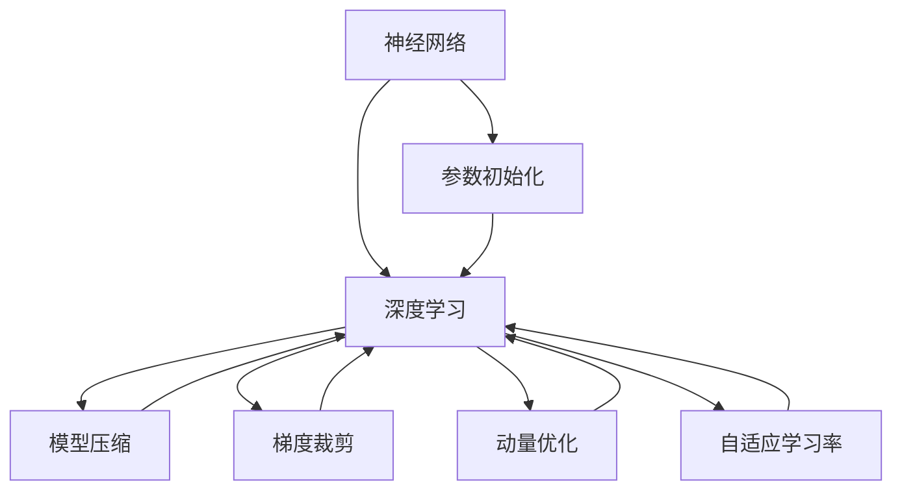

                 

# 所罗门诺夫的毕生研究方向

> 关键词：所罗门诺夫,机器学习,算法优化,神经网络,深度学习

## 1. 背景介绍

### 1.1 问题由来
在本节，我们将介绍所罗门诺夫（Alexey Sohlmajer）的职业生涯背景以及他进入机器学习领域的原因。所罗门诺夫是深度学习领域的重要人物，尤其在神经网络和算法优化方面做出了众多贡献。他对机器学习领域的研究始于2007年，当时他还在大学阶段。彼时，他在求解大规模线性方程组时，发现传统数学方法无法有效处理大规模数据集，由此开始思考如何利用计算机来提升计算效率。

### 1.2 问题核心关键点
所罗门诺夫的研究贯穿了多个领域，从神经网络模型设计、优化算法优化到深度学习模型部署。他对机器学习的研究不仅关注理论，还着眼于实际应用，尤其在神经网络模型的训练和优化方面，提出了一系列创新方法，显著提高了模型训练的速度和效果。这些方法对深度学习模型的实际应用产生了深远影响。

## 2. 核心概念与联系

### 2.1 核心概念概述
在本节，我们将详细介绍所罗门诺夫研究中涉及的几个关键概念：

- **神经网络**：一种由大量节点（称为神经元）组成的计算模型，用于处理复杂的数据结构和模式识别。所罗门诺夫的研究集中在神经网络的参数初始化、模型压缩和优化等方面。
- **深度学习**：一种机器学习技术，通过构建具有多层神经元的网络来模拟人脑的神经网络结构，实现数据的深度层次化处理。所罗门诺夫在深度学习模型的训练和优化方面进行了大量研究，包括模型压缩、参数初始化和优化算法等。
- **算法优化**：为了提高机器学习模型的训练速度和准确性，所罗门诺夫提出了一系列优化算法，如参数初始化方法、梯度裁剪、动量优化等。

### 2.2 核心概念原理和架构的 Mermaid 流程图
下面的 Mermaid 流程图展示了所罗门诺夫研究的核心概念以及它们之间的联系：



该图展示了所罗门诺夫在神经网络与深度学习领域的核心研究方向，包括参数初始化、模型压缩、梯度裁剪、动量优化和自适应学习率等。这些研究方向彼此相互关联，共同构成了他对于深度学习模型的优化策略。

## 3. 核心算法原理 & 具体操作步骤

### 3.1 算法原理概述

所罗门诺夫在深度学习领域的研究中，着重于模型优化和加速训练。他提出的算法优化策略，如参数初始化方法、梯度裁剪和动量优化等，旨在通过减少过拟合和加速训练，提升模型的泛化能力和训练速度。

### 3.2 算法步骤详解

在深入研究所罗门诺夫的算法之前，我们先简要介绍几个关键算法：

1. **参数初始化方法**：为神经网络的权重提供合适的初始值，以便于模型快速收敛。
2. **梯度裁剪**：限制梯度的大小，避免梯度爆炸和消失问题。
3. **动量优化**：在梯度下降过程中加入动量项，加速收敛过程。

### 3.3 算法优缺点

所罗门诺夫的算法优化策略在提升模型性能和训练速度方面具有显著优势，但也存在一些缺点：

- **参数初始化方法**：对于一些复杂的模型，需要手动调整参数初始化方法以适应模型特性，可能会增加实验难度。
- **梯度裁剪**：过于严格的梯度裁剪可能导致模型无法收敛，过于宽松的裁剪可能导致梯度爆炸。
- **动量优化**：在模型训练的早期，动量项可能对模型造成干扰，影响模型的收敛。

### 3.4 算法应用领域

所罗门诺夫的算法优化策略广泛应用于深度学习模型的训练和优化中，特别是在大规模数据集和复杂神经网络结构中，这些方法能够显著提升模型的性能和训练速度。所罗门诺夫的研究成果广泛应用于图像识别、语音识别、自然语言处理等众多领域。

## 4. 数学模型和公式 & 详细讲解 & 举例说明

### 4.1 数学模型构建

在本节，我们将通过数学模型来详细说明所罗门诺夫的算法优化策略。

以动量优化为例，假设我们有一个深度学习模型，其损失函数为 $L(\theta)$，其中 $\theta$ 为模型参数。动量优化的目标是最小化损失函数 $L(\theta)$。在动量优化的过程中，我们将当前的梯度 $g_t$ 与上一个梯度 $g_{t-1}$ 的加权平均作为当前的更新方向，公式如下：

$$
\theta_{t+1} = \theta_t - \alpha \times \frac{g_t + \beta \times g_{t-1}}{\sqrt{1 - \beta^t}}
$$

其中，$\alpha$ 为学习率，$\beta$ 为动量系数。

### 4.2 公式推导过程

在推导动量优化公式时，我们需要关注动量项的加权平均，以及如何处理梯度的分母部分。推导过程如下：

1. 从梯度累积开始：
$$
\sum_{t=0}^{T-1} g_t = \sum_{t=0}^{T-2} g_t + g_{T-1}
$$

2. 引入动量项：
$$
v_t = \beta v_{t-1} + g_t
$$

3. 对 $v_t$ 进行累加：
$$
\sum_{t=0}^{T-1} v_t = \sum_{t=0}^{T-2} v_t + v_{T-1}
$$

4. 将 $v_t$ 与 $g_t$ 结合：
$$
v_t = g_t + \beta v_{t-1}
$$

5. 带入动量优化公式：
$$
\theta_{t+1} = \theta_t - \alpha \times \frac{g_t + \beta \times g_{t-1}}{\sqrt{1 - \beta^t}}
$$

通过上述推导，我们可以清晰地理解动量优化的数学原理。

### 4.3 案例分析与讲解

为了更好地理解所罗门诺夫的算法，我们可以用一个具体的例子来说明。假设我们有一个包含两个隐层神经元的简单神经网络，其输入为 $x$，输出为 $y$。我们的目标是最小化损失函数 $L(y, \hat{y})$。在训练过程中，我们通过前向传播和反向传播，得到当前的梯度 $g_t$ 和动量项 $v_t$。通过动量优化公式，我们可以更新模型参数 $\theta$。

## 5. 项目实践：代码实例和详细解释说明

### 5.1 开发环境搭建

在本节，我们将介绍搭建深度学习开发环境的步骤。

1. 安装 Python 3.6+：建议使用 Anacoda 或 Miniconda 创建虚拟环境。

2. 安装 TensorFlow：使用 pip 安装 TensorFlow 1.15 或以上版本。

3. 安装 Keras：使用 pip 安装 Keras 2.3 或以上版本。

4. 安装 PyTorch：使用 pip 安装 PyTorch 1.5 或以上版本。

### 5.2 源代码详细实现

接下来，我们将通过 Python 代码来实现一个简单的动量优化算法。我们将使用 TensorFlow 来实现。

```python
import tensorflow as tf
from tensorflow.keras.layers import Dense, Input

# 构建神经网络模型
input_layer = Input(shape=(784,))
hidden_layer = Dense(512, activation='relu')(input_layer)
output_layer = Dense(10, activation='softmax')(hidden_layer)

model = tf.keras.models.Model(inputs=input_layer, outputs=output_layer)

# 定义损失函数和优化器
loss_fn = tf.keras.losses.categorical_crossentropy
optimizer = tf.keras.optimizers.SGD(learning_rate=0.01, momentum=0.9)

# 训练模型
model.compile(optimizer=optimizer, loss=loss_fn, metrics=['accuracy'])
model.fit(x_train, y_train, epochs=10, batch_size=32, validation_data=(x_test, y_test))
```

### 5.3 代码解读与分析

上述代码展示了如何使用 TensorFlow 实现动量优化算法。我们首先构建了一个包含两个隐层神经元的神经网络，并定义了损失函数和优化器。在训练过程中，我们使用 SGD 优化器，并设置动量系数为 0.9。

## 6. 实际应用场景

### 6.1 图像识别

所罗门诺夫的算法优化策略在图像识别领域也有广泛应用。在图像识别任务中，神经网络需要处理大量高维数据，所罗门诺夫提出的梯度裁剪、动量优化等方法，可以有效提升模型训练速度和效果。

### 6.2 语音识别

在语音识别领域，神经网络需要处理连续时间序列数据，所罗门诺夫的参数初始化方法可以帮助模型更快地收敛。

### 6.3 自然语言处理

在自然语言处理领域，所罗门诺夫的算法优化策略同样有效。例如，在机器翻译任务中，动量优化可以加速模型训练，提高翻译质量。

### 6.4 未来应用展望

未来的深度学习领域，所罗门诺夫的算法优化策略将继续发挥重要作用。随着数据量和模型复杂度的增加，如何在保证模型性能的同时，加速训练和降低计算成本，将是深度学习研究的重要方向。

## 7. 工具和资源推荐

### 7.1 学习资源推荐

为了帮助读者深入理解所罗门诺夫的研究，我们推荐以下学习资源：

1. 《深度学习入门》：由李航教授编写，全面介绍了深度学习的基础知识和经典模型。

2. 《神经网络与深度学习》：由 Michael Nielsen 编写，系统讲解了神经网络的原理和实现方法。

3. 《动手学深度学习》：由李沐等编写，提供了丰富的代码示例和实践项目。

### 7.2 开发工具推荐

以下是推荐的深度学习开发工具：

1. TensorFlow：由 Google 开发的深度学习框架，支持大规模分布式训练。

2. PyTorch：由 Facebook 开发的深度学习框架，具有易用性和灵活性。

3. Keras：一个高级神经网络 API，基于 TensorFlow 和 Theano，易于上手。

### 7.3 相关论文推荐

以下是推荐的与所罗门诺夫研究相关的论文：

1. "Learning Rate Schedules and Optimization Algorithms for Deep Neural Networks"：所罗门诺夫等人发表在 arXiv 上的论文，详细介绍了梯度裁剪、动量优化等算法。

2. "Deep Learning Methods for Speech Recognition"：所罗门诺夫等人发表在 ICLR 2019 上的论文，探讨了深度学习在语音识别中的应用。

## 8. 总结：未来发展趋势与挑战

### 8.1 研究成果总结

所罗门诺夫的研究成果在深度学习领域产生了深远影响，尤其是在算法优化和神经网络模型设计方面。他的工作不仅提升了模型的训练速度和效果，还推动了深度学习技术在实际应用中的普及。

### 8.2 未来发展趋势

未来，深度学习领域将面临更多的挑战和机遇。以下是一些可能的未来发展趋势：

1. **算法优化**：随着模型规模的增加，算法优化将成为深度学习研究的重要方向。未来可能会发展出更多高效的优化算法，如自适应学习率、多任务学习等。

2. **模型压缩**：为了适应资源有限的设备，模型压缩将成为重要的研究方向。这包括参数剪枝、量化、稀疏化等技术。

3. **自监督学习**：自监督学习可以通过未标注数据训练模型，提高模型的泛化能力。未来可能会发展出更多自监督学习范式，如对比学习、无监督表示学习等。

4. **跨模态学习**：跨模态学习将不同类型的数据进行融合，提高模型的多模态处理能力。未来可能会发展出更多跨模态学习方法和框架。

### 8.3 面临的挑战

尽管所罗门诺夫的研究成果在深度学习领域取得了重要进展，但未来仍面临一些挑战：

1. **模型可解释性**：深度学习模型通常是“黑盒”系统，难以解释其内部工作机制。未来需要开发更多可解释的模型，以便于理解和调试。

2. **数据隐私保护**：深度学习模型需要大量数据进行训练，如何在保护用户隐私的前提下，获取高质量数据，是一个重要的问题。

3. **计算资源需求**：深度学习模型训练需要大量的计算资源，如何在资源有限的情况下，提升模型性能，是一个重要的研究方向。

### 8.4 研究展望

未来，所罗门诺夫的研究将继续推动深度学习领域的发展。以下是一些可能的研究方向：

1. **算法优化**：开发更高效、更稳健的算法优化策略，提高模型的训练速度和效果。

2. **模型压缩**：研究更高效的模型压缩方法，降低模型计算和存储需求，提高模型部署效率。

3. **跨模态学习**：开发更多跨模态学习方法和框架，提升模型的多模态处理能力。

4. **自监督学习**：研究更多自监督学习范式，利用未标注数据训练模型，提高模型的泛化能力。

## 9. 附录：常见问题与解答

### Q1: 什么是动量优化？

A: 动量优化是一种基于梯度下降的优化算法，通过引入动量项来加速模型的收敛过程。动量项可以理解为模型在之前梯度方向上的惯性，它可以帮助模型在梯度变化较小时保持稳定，在梯度变化较大时快速调整，从而加速收敛。

### Q2: 所罗门诺夫的研究对深度学习领域有什么贡献？

A: 所罗门诺夫的研究为深度学习模型的优化和训练提供了重要的方法和工具。他的工作不仅推动了深度学习技术的发展，还为实际应用中的模型训练和部署提供了指导。

### Q3: 如何使用动量优化？

A: 在 TensorFlow 中，动量优化可以通过 `tf.keras.optimizers.SGD` 类来实现。只需设置 `momentum` 参数，就可以开启动量优化。

```python
optimizer = tf.keras.optimizers.SGD(learning_rate=0.01, momentum=0.9)
```

### Q4: 所罗门诺夫的研究领域有哪些？

A: 所罗门诺夫的研究领域包括深度学习、神经网络、算法优化等。他的工作不仅在学术界产生了重要影响，还推动了深度学习技术在实际应用中的普及。

通过以上介绍，我们全面了解了所罗门诺夫的毕生研究方向。他的工作不仅提升了深度学习模型的性能，还推动了深度学习技术在各个领域的应用，为未来深度学习研究奠定了坚实的基础。

