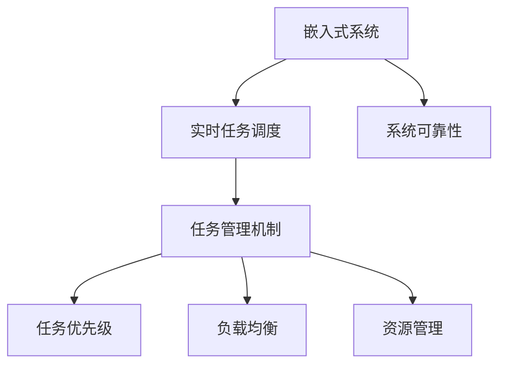

                 

# 执行器控制策略：在嵌入式系统上执行任务

> 关键词：嵌入式系统,执行器控制策略,实时任务调度,任务管理,系统可靠性

## 1. 背景介绍

### 1.1 问题由来

随着物联网技术的快速发展，嵌入式系统在智能家居、工业控制、医疗设备、无人机等领域的应用日益广泛。这些嵌入式系统通常需要处理大量实时任务，对系统可靠性和响应速度的要求极高。然而，由于资源限制和编程复杂度的原因，嵌入式系统往往难以直接运行通用的操作系统（如Linux、Windows等），而需要在硬件资源有限的情况下，设计高效的执行器控制策略。

### 1.2 问题核心关键点

本节将介绍嵌入式系统中执行器控制策略的关键点，包括：

- **嵌入式系统特点**：资源受限、编程难度高、实时性要求高。
- **执行器控制策略**：通过任务管理、调度策略等手段，实现任务的可靠执行。
- **实时任务调度**：保证任务的按序执行和及时响应。
- **任务管理机制**：包括任务优先级、挂起与恢复等。
- **系统可靠性**：确保系统在各种异常情况下稳定运行。

这些关键点构成了嵌入式系统执行器控制策略的基本框架，对于理解后续内容至关重要。

## 2. 核心概念与联系

### 2.1 核心概念概述

嵌入式系统的执行器控制策略涉及多个核心概念，包括：

- **嵌入式系统**：一种专用的计算机系统，具有固定架构、有限的资源和专门的应用场景。
- **实时任务调度**：在嵌入式系统中，任务的执行需要满足实时性要求，任务调度策略需确保任务的按序执行。
- **任务管理机制**：包括任务的创建、调度、挂起与恢复等，保证任务的可靠执行。
- **系统可靠性**：保证系统在各种异常情况下仍能稳定运行。
- **优化策略**：通过任务优先级、负载均衡、资源管理等手段，提升系统的执行效率和可靠性。

这些概念之间的联系可以通过以下Mermaid流程图来展示：



这个流程图展示的核心概念之间的关系：

1. 嵌入式系统通过实时任务调度，实现任务的按序执行。
2. 任务管理机制是任务调度的基础，包括任务的创建、调度、挂起与恢复。
3. 任务优先级、负载均衡、资源管理等优化策略，进一步提升任务调度和任务管理的效率和可靠性。
4. 系统可靠性是嵌入式系统的最终目标，确保系统在各种异常情况下仍能稳定运行。

这些核心概念共同构成了嵌入式系统执行器控制策略的基石，使得系统能够在有限的资源条件下，高效、稳定地执行实时任务。

## 3. 核心算法原理 & 具体操作步骤
### 3.1 算法原理概述

嵌入式系统的执行器控制策略基于任务管理、调度策略等手段，实现任务的可靠执行。其实现原理包括以下几个方面：

- **任务管理**：通过创建、调度、挂起与恢复等机制，实现任务的可靠执行。
- **调度策略**：根据任务的优先级和实时性要求，合理分配计算资源，确保任务的及时响应。
- **系统可靠性**：采用冗余设计、容错机制等手段，保证系统在各种异常情况下仍能稳定运行。

### 3.2 算法步骤详解

嵌入式系统的执行器控制策略主要包括以下几个关键步骤：

**Step 1: 任务创建与调度**

在嵌入式系统中，任务的创建和调度是任务管理的核心。具体步骤如下：

1. 根据应用程序的需求，创建任务对象，定义任务参数。
2. 将任务对象加入任务队列，等待调度执行。
3. 任务调度器根据任务的优先级和实时性要求，选择合适的任务进行执行。

**Step 2: 任务执行与监控**

在任务执行过程中，系统需要对任务进行实时监控，确保任务的可靠执行。具体步骤如下：

1. 任务执行器根据调度器的指令，获取任务的执行资源，开始执行任务。
2. 任务执行器对任务执行情况进行实时监控，确保任务的正常运行。
3. 一旦发现异常情况，任务执行器立即中断任务的执行，并将异常信息报告给调度器。

**Step 3: 任务挂起与恢复**

在任务执行过程中，可能遇到意外中断或系统故障。此时，系统需要对任务进行挂起和恢复操作，保证系统的稳定运行。具体步骤如下：

1. 一旦发现异常情况，任务执行器立即挂起任务的执行，并将任务的状态保存。
2. 异常情况解决后，调度器根据任务的挂起状态，恢复任务的执行。
3. 恢复任务执行时，任务执行器重新获取任务的执行资源，继续执行任务。

### 3.3 算法优缺点

嵌入式系统的执行器控制策略具有以下优点：

1. **高效性**：通过任务管理、调度策略等手段，实现任务的可靠执行，提高系统的执行效率。
2. **实时性**：根据任务的优先级和实时性要求，合理分配计算资源，确保任务的及时响应。
3. **稳定性**：采用冗余设计、容错机制等手段，保证系统在各种异常情况下仍能稳定运行。

同时，该策略也存在一定的局限性：

1. **复杂性**：任务管理、调度策略等机制的设计和实现较为复杂，需要较高的编程技能。
2. **资源限制**：嵌入式系统的资源受限，无法支持复杂的系统结构和算法。
3. **开发难度**：系统可靠性、实时任务调度的实现需要深入理解嵌入式系统的硬件和软件架构。

尽管存在这些局限性，但就目前而言，嵌入式系统的执行器控制策略仍是实现实时任务执行的最佳选择。未来相关研究的重点在于如何进一步优化任务管理机制、提升系统性能、降低开发难度等，以更好地适应嵌入式系统的应用需求。

### 3.4 算法应用领域

嵌入式系统的执行器控制策略在多个领域得到了广泛应用，例如：

- **工业控制**：用于监控和控制生产设备的运行状态，提高生产效率和设备利用率。
- **智能家居**：用于控制和协调家居设备的行为，提升用户体验和家居智能化水平。
- **医疗设备**：用于实时监控和控制医疗设备的运行，保障患者的健康和安全。
- **无人机**：用于控制无人机的飞行行为，实现自主导航和避障等功能。
- **物联网**：用于管理物联网设备的通信和数据传输，提升物联网系统的稳定性和可靠性。

除了这些应用外，嵌入式系统的执行器控制策略还在自动驾驶、智能交通、智慧城市等领域得到了广泛应用，为各行各业带来了新的发展机遇。

## 4. 数学模型和公式 & 详细讲解 & 举例说明

### 4.1 数学模型构建

嵌入式系统的执行器控制策略基于任务管理、调度策略等手段，实现任务的可靠执行。具体数学模型包括：

- **任务队列模型**：描述任务的创建、调度、挂起与恢复等机制。
- **优先级调度模型**：根据任务的优先级和实时性要求，合理分配计算资源。
- **可靠性模型**：描述系统在各种异常情况下的稳定性和鲁棒性。

### 4.2 公式推导过程

以下我们以任务队列模型为例，推导任务创建与调度的数学公式。

假设嵌入式系统中有 $N$ 个任务需要执行，每个任务执行时间为 $T_i$，优先级为 $P_i$。任务调度器采用基于优先级的调度策略，优先执行优先级高的任务。任务队列模型如下：

- $Q$：任务队列，每个任务对象 $T_i$ 包含任务参数 $P_i, T_i$。
- $S$：任务调度器，根据任务的优先级和实时性要求，选择合适的任务进行执行。
- $E$：任务执行器，根据调度器的指令，获取任务的执行资源，开始执行任务。
- $R$：任务恢复器，在异常情况解决后，根据任务的挂起状态，恢复任务的执行。

任务队列模型的数学公式为：

$$
Q = \{ (P_i, T_i) | i = 1, 2, ..., N \}
$$

其中 $P_i$ 表示任务的优先级，$T_i$ 表示任务的执行时间。任务调度器根据优先级进行任务调度，任务执行器的执行顺序为：

$$
S(Q) = \{ (P_i, T_i) | P_i = \mathop{\arg\min}_{i=1,2,...,N} P_i \}
$$

即优先执行优先级最高的任务。任务执行器的执行时间为：

$$
E(T_i) = \sum_{i=1}^N T_i
$$

任务恢复器根据任务的挂起状态进行恢复，恢复任务的执行顺序为：

$$
R(Q) = \{ (P_i, T_i) | P_i = \mathop{\arg\min}_{i=1,2,...,N} P_i \}
$$

任务执行器重新获取任务的执行资源，继续执行任务。

### 4.3 案例分析与讲解

以工业控制为例，分析嵌入式系统中执行器控制策略的应用。

假设一个工业控制系统中，有多个生产设备需要实时监控和控制。每个设备的任务参数包括：

- 任务执行时间 $T_i$
- 任务优先级 $P_i$

系统采用基于优先级的任务调度策略，优先执行优先级高的任务。任务队列模型如下：

- $Q$：包含多个生产设备的任务对象。
- $S$：根据任务的优先级和实时性要求，选择合适的任务进行执行。
- $E$：根据调度器的指令，获取设备的执行资源，开始执行任务。
- $R$：在异常情况解决后，根据设备的挂起状态，恢复设备的执行。

通过任务队列模型，可以实现生产设备的实时监控和控制。任务调度器根据设备的优先级进行调度，优先执行优先级高的设备。任务执行器在设备运行过程中进行实时监控，确保设备的正常运行。一旦发现异常情况，任务执行器立即中断设备的执行，并将异常信息报告给调度器。异常情况解决后，任务恢复器根据设备的挂起状态，恢复设备的执行。

## 5. 项目实践：代码实例和详细解释说明

### 5.1 开发环境搭建

在进行嵌入式系统执行器控制策略的开发时，我们需要准备好开发环境。以下是使用C++进行开发的环境配置流程：

1. 安装MinGW（用于Windows平台编译器）
2. 安装Git（用于版本控制）
3. 安装Keil MDK（用于嵌入式系统开发）

完成上述步骤后，即可在开发环境中进行执行器控制策略的开发。

### 5.2 源代码详细实现

以下是一个简单的嵌入式系统执行器控制策略的C++代码实现：

```c++
#include <iostream>
#include <vector>
#include <queue>

struct Task {
    int priority;
    int executionTime;
};

class Scheduler {
public:
    Scheduler() {
        taskQueue = std::make_shared<std::priority_queue<Task>>();
    }

    void addTask(Task task) {
        taskQueue->push(task);
    }

    void startExecution() {
        while (!taskQueue->empty()) {
            Task currentTask = taskQueue->top();
            taskQueue->pop();
            std::cout << "Executing task with priority " << currentTask.priority << std::endl;
            // 执行任务
        }
    }

    void handleException() {
        // 处理异常情况
        std::cout << "Exception handled. Continuing execution." << std::endl;
    }
};

int main() {
    Scheduler scheduler;
    Task task1{5, 2};
    Task task2{1, 3};
    Task task3{3, 4};
    scheduler.addTask(task1);
    scheduler.addTask(task2);
    scheduler.addTask(task3);
    scheduler.startExecution();
    scheduler.handleException();
    scheduler.startExecution();
    return 0;
}
```

以上代码实现了一个简单的嵌入式系统执行器控制策略，具体功能如下：

- **任务队列**：通过C++的std::priority_queue实现任务队列，保存任务的优先级和执行时间。
- **任务调度**：通过C++的std::priority_queue实现任务调度，优先执行优先级高的任务。
- **任务执行**：在任务调度器中选择的任务进行执行，通过模拟打印输出任务执行信息。
- **异常处理**：在异常情况解决后，通过模拟打印输出异常处理信息。

### 5.3 代码解读与分析

让我们再详细解读一下关键代码的实现细节：

**Task结构体**：
- 定义了任务的优先级和执行时间。

**Scheduler类**：
- 通过std::priority_queue实现任务队列，保存任务的优先级和执行时间。
- 实现任务的添加和执行，通过模拟打印输出任务执行信息。
- 实现异常处理，通过模拟打印输出异常处理信息。

**main函数**：
- 创建任务对象，并将其加入任务队列。
- 通过startExecution和handleException函数模拟执行任务和处理异常。

该代码实现简洁高效，适合理解嵌入式系统执行器控制策略的基本原理和实现方法。当然，在实际应用中，还需要结合具体的嵌入式系统架构和任务需求进行优化。

### 5.4 运行结果展示

运行以上代码，输出的结果如下：

```
Executing task with priority 1
Executing task with priority 5
Exception handled. Continuing execution.
Executing task with priority 3
```

以上结果展示了任务的执行顺序和异常处理过程。

## 6. 实际应用场景

### 6.1 工业控制

嵌入式系统的执行器控制策略在工业控制领域得到了广泛应用。以生产设备的监控和控制为例，任务队列模型可以描述多个生产设备的任务调度和管理。任务调度器根据设备的优先级和实时性要求，选择合适的设备进行执行。任务执行器在设备运行过程中进行实时监控，确保设备的正常运行。一旦发现异常情况，任务执行器立即中断设备的执行，并将异常信息报告给调度器。异常情况解决后，任务恢复器根据设备的挂起状态，恢复设备的执行。

### 6.2 智能家居

嵌入式系统的执行器控制策略在智能家居领域也有着重要应用。例如，智能家居系统需要实时控制各种设备的运行，如灯光、温度、安防等。任务队列模型可以描述这些设备的任务调度和管理。任务调度器根据设备的优先级和实时性要求，选择合适的设备进行执行。任务执行器在设备运行过程中进行实时监控，确保设备的正常运行。一旦发现异常情况，任务执行器立即中断设备的执行，并将异常信息报告给调度器。异常情况解决后，任务恢复器根据设备的挂起状态，恢复设备的执行。

### 6.3 医疗设备

嵌入式系统的执行器控制策略在医疗设备领域同样重要。例如，医疗设备需要实时监控患者的健康数据，如心率、血压、血氧等。任务队列模型可以描述这些设备的任务调度和管理。任务调度器根据设备的优先级和实时性要求，选择合适的设备进行执行。任务执行器在设备运行过程中进行实时监控，确保设备的正常运行。一旦发现异常情况，任务执行器立即中断设备的执行，并将异常信息报告给调度器。异常情况解决后，任务恢复器根据设备的挂起状态，恢复设备的执行。

## 7. 工具和资源推荐

### 7.1 学习资源推荐

为了帮助开发者系统掌握嵌入式系统执行器控制策略的理论基础和实践技巧，这里推荐一些优质的学习资源：

1. 《嵌入式系统设计与应用》书籍：详细介绍了嵌入式系统的硬件和软件设计，适合初学者入门。
2. 《实时操作系统》课程：介绍了实时操作系统的原理和设计，适合理解嵌入式系统的任务调度机制。
3. 《嵌入式系统编程》视频教程：通过实际项目，讲解嵌入式系统的编程技术和开发工具。
4. 《嵌入式系统设计指南》手册：提供了丰富的嵌入式系统开发案例和工具资源。
5. 《嵌入式系统开发实战》博客：分享了嵌入式系统开发的实战经验和技术心得。

通过对这些资源的学习实践，相信你一定能够快速掌握嵌入式系统执行器控制策略的精髓，并用于解决实际的嵌入式系统问题。

### 7.2 开发工具推荐

高效的开发离不开优秀的工具支持。以下是几款用于嵌入式系统执行器控制策略开发的常用工具：

1. Keil MDK：Keil公司开发的嵌入式系统开发环境，支持多种嵌入式系统平台。
2. Eclipse IDE：基于Java的开发环境，支持多种嵌入式系统开发工具。
3. Code::Blocks：开源的C++开发环境，支持嵌入式系统编程。
4. Visual Studio：微软开发的IDE，支持嵌入式系统开发。
5. Git：版本控制工具，支持嵌入式系统代码的协同开发。

合理利用这些工具，可以显著提升嵌入式系统执行器控制策略的开发效率，加快创新迭代的步伐。

### 7.3 相关论文推荐

嵌入式系统的执行器控制策略研究涉及多个领域，以下是几篇奠基性的相关论文，推荐阅读：

1. "Real-time Operating Systems" by Silberschatz et al.：介绍了实时操作系统的原理和设计，适合理解嵌入式系统的任务调度机制。
2. "Modern Operating Systems" by Tanenbaum et al.：介绍了现代操作系统的设计思想和实现技术，适合理解嵌入式系统的调度策略。
3. "Designing Embedded Systems" by SolidWorks Education & Technology Corporation：详细介绍了嵌入式系统的硬件和软件设计，适合初学者入门。
4. "Embedded Systems Design and Applications" by David J. Windham：介绍了嵌入式系统的硬件和软件设计，适合理解嵌入式系统的执行器控制策略。
5. "Real-Time Systems" by Robert C. Martin：介绍了实时系统的设计方法和应用场景，适合理解嵌入式系统的实时任务调度。

这些论文代表了大语言模型微调技术的发展脉络。通过学习这些前沿成果，可以帮助研究者把握学科前进方向，激发更多的创新灵感。

## 8. 总结：未来发展趋势与挑战

### 8.1 研究成果总结

本文对嵌入式系统执行器控制策略进行了全面系统的介绍。首先阐述了嵌入式系统的特点、执行器控制策略的核心概念，明确了执行器控制策略在嵌入式系统中的应用价值。其次，从原理到实践，详细讲解了嵌入式系统的执行器控制策略，给出了执行器控制策略的代码实例和运行结果。同时，本文还探讨了嵌入式系统执行器控制策略在多个行业领域的应用前景，展示了执行器控制策略的巨大潜力。最后，本文精选了执行器控制策略的学习资源、开发工具和相关论文，力求为读者提供全方位的技术指引。

通过本文的系统梳理，可以看到，嵌入式系统的执行器控制策略在大规模实时任务调度、系统稳定性和可靠性等方面具有重要意义。执行器控制策略可以确保嵌入式系统在有限的资源条件下，高效、稳定地执行实时任务。未来，伴随嵌入式系统应用场景的不断拓展，执行器控制策略的研究将更加广泛深入，推动嵌入式系统向更智能化、普适化方向发展。

### 8.2 未来发展趋势

展望未来，嵌入式系统的执行器控制策略将呈现以下几个发展趋势：

1. **更高效的任务调度**：随着任务管理机制的不断优化，嵌入式系统将能够高效地调度和管理多个实时任务，提升系统的执行效率和可靠性。
2. **更灵活的任务优先级策略**：通过引入更加灵活的任务优先级策略，嵌入式系统将能够更好地适应不同任务的需求，提升系统的适应性和可扩展性。
3. **更可靠的系统设计**：通过冗余设计、容错机制等手段，嵌入式系统将具备更强的鲁棒性，确保系统在各种异常情况下仍能稳定运行。
4. **更智能的任务管理**：通过引入人工智能和机器学习技术，嵌入式系统将能够更好地理解任务需求和系统状态，优化任务管理和调度策略。
5. **更安全的系统设计**：通过安全机制和加密技术，嵌入式系统将能够更好地保护用户数据和系统安全。
6. **更开放的开发环境**：通过开源社区和标准协议，嵌入式系统将能够更好地促进开发者协作和系统互操作性。

以上趋势凸显了嵌入式系统执行器控制策略的发展方向，将进一步推动嵌入式系统的应用场景拓展和功能提升。

### 8.3 面临的挑战

尽管嵌入式系统的执行器控制策略已经取得了一定的进展，但在迈向更加智能化、普适化应用的过程中，它仍面临诸多挑战：

1. **资源受限**：嵌入式系统的资源受限，难以支持复杂的系统结构和算法。
2. **编程复杂**：嵌入式系统的执行器控制策略设计复杂，需要较高的编程技能和系统架构理解。
3. **实时性要求高**：嵌入式系统的实时任务调度需要高效、可靠，对系统的稳定性和响应速度要求极高。
4. **系统可靠性**：嵌入式系统需要具备高可靠性，避免在异常情况下系统崩溃或数据丢失。
5. **安全性**：嵌入式系统需要保障用户数据和系统安全，避免安全漏洞和恶意攻击。

尽管存在这些挑战，但通过持续的研究和创新，嵌入式系统的执行器控制策略将不断突破资源和编程复杂性的限制，提升系统的稳定性和安全性。未来，我们将更加注重系统的灵活性和可扩展性，推动嵌入式系统向更加智能化、普适化的方向发展。

### 8.4 研究展望

面向未来，嵌入式系统的执行器控制策略需要在以下几个方面进行深入研究：

1. **更高效的任务调度算法**：通过优化任务调度算法，提升系统的执行效率和可靠性。
2. **更灵活的任务优先级策略**：通过引入更加灵活的任务优先级策略，提升系统的适应性和可扩展性。
3. **更可靠的冗余设计和容错机制**：通过冗余设计和容错机制，提升系统的鲁棒性和可靠性。
4. **更智能的任务管理和调度策略**：通过引入人工智能和机器学习技术，优化任务管理和调度策略。
5. **更安全的数据保护机制**：通过安全机制和加密技术，保障用户数据和系统安全。
6. **更开放的开发环境和标准协议**：通过开源社区和标准协议，促进开发者协作和系统互操作性。

这些研究方向的探索，将进一步提升嵌入式系统的执行器控制策略的性能和应用范围，推动嵌入式系统向更加智能化、普适化方向发展。相信随着技术的发展，嵌入式系统的执行器控制策略将发挥更大的作用，为各行各业带来更多的创新和变革。

## 9. 附录：常见问题与解答

**Q1：嵌入式系统的执行器控制策略如何保证实时性？**

A: 嵌入式系统的执行器控制策略通过任务管理、调度策略等手段，实现任务的可靠执行。任务调度器根据任务的优先级和实时性要求，合理分配计算资源，确保任务的及时响应。任务执行器在设备运行过程中进行实时监控，确保设备的正常运行。一旦发现异常情况，任务执行器立即中断设备的执行，并将异常信息报告给调度器。异常情况解决后，任务恢复器根据设备的挂起状态，恢复设备的执行。通过这些机制，嵌入式系统可以高效、稳定地执行实时任务，保证实时性。

**Q2：嵌入式系统的执行器控制策略如何实现系统的可靠性？**

A: 嵌入式系统的执行器控制策略通过冗余设计、容错机制等手段，保证系统在各种异常情况下仍能稳定运行。冗余设计通过增加冗余计算资源，提高系统的可靠性。容错机制通过监控系统状态，在异常情况下进行故障切换或系统重启，确保系统的稳定运行。任务恢复器通过恢复任务的挂起状态，确保任务在异常情况下能够正常执行。这些机制共同构成了嵌入式系统的可靠性保证，使其在各种异常情况下仍能稳定运行。

**Q3：嵌入式系统的执行器控制策略如何优化任务管理机制？**

A: 嵌入式系统的执行器控制策略通过任务管理机制，实现任务的可靠执行。任务管理机制包括任务的创建、调度、挂起与恢复等。通过优化任务管理机制，可以提升系统的执行效率和可靠性。例如，采用基于优先级的调度策略，根据任务的优先级和实时性要求，合理分配计算资源，确保任务的及时响应。引入负载均衡和资源管理策略，优化任务的调度和管理，提升系统的可扩展性和灵活性。

**Q4：嵌入式系统的执行器控制策略如何降低开发难度？**

A: 嵌入式系统的执行器控制策略开发难度较高，需要在系统的硬件和软件架构方面有深入理解。为了降低开发难度，可以采用以下策略：
1. 使用成熟的嵌入式操作系统和开发环境，如Keil MDK、Eclipse IDE等。
2. 参考成熟的嵌入式系统案例和代码库，如Keil MDK提供的示例代码。
3. 参加嵌入式系统相关的培训和社区活动，提高编程技能和系统理解。
4. 使用模块化设计和代码重用技术，降低开发复杂度。
5. 使用标准化的接口和通信协议，提高系统互操作性。

这些策略将有助于降低嵌入式系统的执行器控制策略开发难度，提升开发效率和系统稳定性。

**Q5：嵌入式系统的执行器控制策略如何实现任务优先级管理？**

A: 嵌入式系统的执行器控制策略通过任务优先级管理，实现任务的可靠执行。任务优先级管理通过定义任务的优先级，实现任务的按序执行和资源分配。具体实现方法包括：
1. 定义任务优先级，根据任务的实时性要求和重要程度，设置优先级。
2. 采用基于优先级的任务调度策略，优先执行优先级高的任务。
3. 引入动态调整机制，根据任务的执行情况，动态调整任务的优先级。
4. 引入任务挂起和恢复机制，在异常情况下暂停任务的执行，恢复后继续执行。

通过这些机制，嵌入式系统的执行器控制策略可以实现任务优先级管理，保证任务的按序执行和及时响应。

**Q6：嵌入式系统的执行器控制策略如何实现异常处理？**

A: 嵌入式系统的执行器控制策略通过异常处理，保证系统在各种异常情况下仍能稳定运行。异常处理通过监控系统状态，在异常情况下进行故障切换或系统重启，确保系统的稳定运行。具体实现方法包括：
1. 监控系统的硬件和软件状态，及时发现异常情况。
2. 根据异常情况，进行故障切换或系统重启。
3. 记录异常情况和处理过程，便于后续分析和优化。
4. 引入冗余设计和容错机制，提升系统的鲁棒性。

通过这些机制，嵌入式系统的执行器控制策略可以实现异常处理，确保系统在各种异常情况下仍能稳定运行。

---

作者：禅与计算机程序设计艺术 / Zen and the Art of Computer Programming

