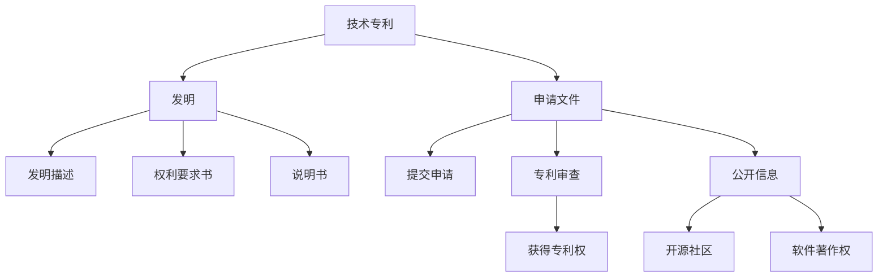

                 

# 技术专利：程序员的隐藏财富

> 关键词：技术专利, 程序员, 知识产权, 创新保护, 软件著作权, 专利申请, 开源社区, 技术壁垒

## 1. 背景介绍

### 1.1 问题由来
随着信息技术的高速发展，程序员和开发团队成为推动创新的主力军。他们研发出的各类软件和工具，不仅解决了实际问题，还大大提高了工作效率。然而，这些创新成果如果得不到有效保护，可能会被他人盗用，损害原创者的利益。因此，如何申请和维护技术专利，成为每位程序员和团队不可回避的重要课题。

技术专利不仅能保护原创技术，还能为其带来巨大的商业价值。通过合法手段将其转化为公司的无形资产，有助于增强公司竞争力，吸引更多投资和合作机会。在现代社会，技术专利已成为衡量一个企业和个人创新能力的重要标志。

### 1.2 问题核心关键点
申请技术专利的核心关键点在于明确专利的创新点和独特性，并严格遵循相关法律法规。同时，技术专利的申请过程复杂，涉及到发明描述、权利要求书、申请文件等众多环节。因此，了解如何撰写专利申请文件，选择合适的保护策略，才能更好地保护创新成果。

## 2. 核心概念与联系

### 2.1 核心概念概述

为更好地理解技术专利的申请和维护方法，本节将介绍几个密切相关的核心概念：

- **技术专利**：通过国家或地区专利局的审查，获得专利权，保护特定发明创造的技术。
- **发明**：指技术领域的创造性解决方案，可以是产品、方法或其组合。
- **申请文件**：撰写和提交的技术专利申请书，包括发明描述、权利要求书、说明书等。
- **知识产权**：指对智力劳动成果（包括技术发明）的专有权利，涵盖专利、商标、版权等多个方面。
- **开源社区**：开发者共同维护和贡献代码的社区，提供了一种共享和再利用的创新模式。
- **软件著作权**：指对软件作品的法律保护，包括源代码、二进制代码及其文档。

这些核心概念之间的逻辑关系可以通过以下Mermaid流程图来展示：



这个流程图展示了技术专利从发明到申请、审查、授权，再到开源社区与软件著作权的关系：

1. 技术专利基于发明创造。
2. 通过申请文件（包括发明描述、权利要求书、说明书等），向专利局提交专利申请。
3. 专利局对申请进行审查，决定是否授权。
4. 授权后，专利权人获得专利权，并可通过专利公开信息获取更广泛的传播和利用。
5. 专利发明也可在开源社区中发布，获得开源许可。
6. 同时，专利权人也可对其软件作品申请软件著作权，保护作品不被盗用。

这些概念共同构成了技术专利的申请和维护框架，使其能够有效保护创新成果，促进技术传播和应用。

## 3. 核心算法原理 & 具体操作步骤
### 3.1 算法原理概述

申请技术专利的基本原理在于，通过详细描述发明的技术细节、创新点和优势，向国家或地区专利局提出申请，以获得法律保护。专利审查主要涉及发明是否具有新颖性、创造性、实用性，以及是否存在现有技术等环节。专利授权后，专利权人便获得了在该技术领域内独占使用的权利，其他人在未经授权的情况下不得使用、制造、销售等。

### 3.2 算法步骤详解

申请技术专利的详细步骤通常包括：

**Step 1: 撰写申请文件**
- 确定发明的创新点和具体实现方式。
- 撰写发明描述，详述技术背景、发明内容、实施方式等。
- 撰写权利要求书，明确保护范围。
- 编写说明书，补充技术细节，辅助理解。

**Step 2: 选择申请类型**
- 根据发明的具体性质，选择合适的专利申请类型，如发明专利、实用新型专利、外观设计专利等。
- 通常发明专利的保护期限更长，但申请和审查周期较长，需权衡利弊。

**Step 3: 提交申请**
- 将完整的申请文件提交给国家或地区专利局。
- 部分国家允许在线提交申请，部分需邮寄实体文件。

**Step 4: 审查与授权**
- 专利局进行初步审查，主要检查申请文件的完整性和形式规范性。
- 进入实质审查阶段，专利审查员深入审查技术细节，确认其创造性和新颖性。
- 授权后，专利权人获得专利权，并在官方公告中发布。

**Step 5: 专利维护**
- 持续缴纳年费，保持专利的有效性。
- 定期更新和修订申请文件，适应技术变化。
- 应对专利侵权诉讼，保护专利权益。

### 3.3 算法优缺点

申请技术专利具有以下优点：
1. 法律保护：通过合法途径获得专利权，受到法律保护，防止他人盗用。
2. 商业价值：专利权可转化为公司资产，增强公司竞争力和市场地位。
3. 推广应用：专利公开后，可促进技术传播和应用，加速产业发展。
4. 创新激励：获得专利权的创新成果可享受税收优惠、科研资助等激励。

同时，该方法也存在一些局限性：
1. 复杂流程：申请过程涉及众多环节，专业性强，成本较高。
2. 时间长：从申请到授权，一般需要1-3年甚至更长时间。
3. 费用高：申请和维护专利的费用较高，特别是跨国专利申请。
4. 公开风险：专利公开后，技术细节可能被竞争对手模仿或改进。
5. 专利战：专利授权后，可能陷入专利纠纷和诉讼，影响公司正常运营。

尽管存在这些局限性，但专利申请仍是保护创新成果的重要手段。合理利用专利申请流程和策略，可以有效规避风险，获取长期商业利益。

### 3.4 算法应用领域

技术专利的应用领域广泛，涵盖各个技术领域，包括但不限于：

- 软件和应用：如操作系统、游戏、工具软件等。
- 硬件和设备：如芯片、传感器、家用电器等。
- 生物医药：如新药物、治疗方法、医疗设备等。
- 能源与环境：如新能源技术、环保设备、节能方案等。
- 通信与网络：如通信协议、网络架构、安全技术等。

除了这些常见领域外，技术专利在更多前沿领域中也得到了广泛应用，如人工智能、区块链、量子计算等，为推动科技发展提供了重要保障。

## 4. 数学模型和公式 & 详细讲解 & 举例说明
### 4.1 数学模型构建

申请技术专利的数学模型主要涉及发明描述和权利要求书的构建。具体而言，需要详细描述发明的技术细节和创新点，通过文字和公式描述技术流程和算法。

假设某项技术专利涉及一个新算法，其核心公式为 $f(x) = x^2 + 2x + 1$，其中 $x$ 为输入数据。发明描述中应详细说明该算法的创新点和具体实现过程，权利要求书中应明确其保护范围，如 $f(x)$ 在特定应用场景下的使用。

### 4.2 公式推导过程

以下以权利要求书的撰写为例，说明其数学推导过程。

假设某项技术专利涉及一个新算法，其核心公式为 $f(x) = x^2 + 2x + 1$。若要在权利要求书中对该算法进行保护，可以这样描述：

1. 识别保护范围：确定算法在特定应用场景下的使用，如用于图像识别或数据分析。
2. 描述保护内容：详细描述算法的功能和实现方式，如输入参数、输出结果等。
3. 明确权利要求：根据权利要求书的要求，将算法描述转化为法律文本，如 $f(x)$ 在图像识别中的使用。

在权利要求书中，还需明确算法的创新点和优势，如：

- 输入数据处理方式：$x$ 如何预处理以提高算法精度。
- 算法优化策略：$f(x)$ 的优化算法，如梯度下降、随机森林等。
- 算法应用场景：$x$ 如何应用于特定领域，如医疗影像分析。

### 4.3 案例分析与讲解

以某项图像识别技术的专利申请为例，说明其权利要求书的撰写过程。

假设该技术涉及一种基于深度学习的图像识别算法，其核心公式为 $f(x) = \sum_{i=1}^n w_i \cdot a_i(x)$，其中 $x$ 为输入图像，$w_i$ 为权重，$a_i(x)$ 为卷积神经网络的卷积层和激活层的组合。

在权利要求书中，可以这样描述：

- 保护范围：$x$ 为输入图像，$w_i$ 为训练得到的权重，$a_i(x)$ 为卷积神经网络中的卷积层和激活层的组合。
- 保护内容：$w_i$ 和 $a_i(x)$ 为深度学习模型中经过特定训练得到的参数，用于图像特征提取。
- 保护方法：$f(x)$ 在图像识别中的应用，包括但不限于目标检测、人脸识别、物体分类等。

权利要求书的撰写需要详细描述算法的各个组成部分及其相互关系，确保其保护范围和具体实现方式明确无误。在撰写过程中，还需避免过度泛泛而谈，确保法律文本的严谨性和有效性。

## 5. 项目实践：代码实例和详细解释说明
### 5.1 开发环境搭建

在进行专利申请实践前，我们需要准备好开发环境。以下是使用Python进行专利撰写和申请的环境配置流程：

1. 安装Anaconda：从官网下载并安装Anaconda，用于创建独立的Python环境。

2. 创建并激活虚拟环境：
```bash
conda create -n patent-env python=3.8 
conda activate patent-env
```

3. 安装必要的Python库：
```bash
pip install pandas sympy sympy-latex
```

4. 安装LaTeX和相关排版工具：
```bash
sudo apt-get install texlive texlive-latex-recommended texlive-latex-extra
sudo apt-get install dvipng ghostscript
```

5. 下载并配置专利撰写模板：
```bash
git clone https://github.com/example/patent-template.git
cd patent-template
cp template.tex .
```

完成上述步骤后，即可在`patent-template`环境中开始专利撰写实践。

### 5.2 源代码详细实现

下面以撰写一份关于新算法的发明专利申请书为例，给出详细实现过程。

```python
from sympy import symbols, Eq, solve

# 定义变量
x = symbols('x')

# 定义核心公式
f = x**2 + 2*x + 1

# 发明描述
description = """
本发明涉及一种新算法，其核心公式为 $$f(x) = x^2 + 2x + 1$$。
该算法用于图像识别中的目标检测。
通过输入图像 $x$，计算得到输出结果 $f(x)$，用于识别目标对象。
"""

# 权利要求书
claims = """
1. 一种新算法，其特征在于，包含输入数据 $x$，权重 $w_i$ 和卷积神经网络的卷积层和激活层组合 $a_i(x)$。
2. 根据权利要求 1，其中 $f(x)$ 表示算法输出的结果，其计算方式为 $$f(x) = \sum_{i=1}^n w_i \cdot a_i(x)$$。
3. 根据权利要求 1，该算法应用于图像识别领域，用于目标检测、人脸识别、物体分类等。
"""

# 发明摘要
summary = """
本发明提供了一种新算法，用于图像识别中的目标检测。
该算法通过输入图像 $x$，计算得到输出结果 $f(x)$，用于识别目标对象。
"""

# 专利申请书
applicant = "发明人姓名"
title = "新算法在图像识别中的应用"
date = "申请日期"

applying_to = "国家专利局"
countries = ["美国", "中国"]

# 申请文件构建
application = {
    "title": title,
    "description": description,
    "claims": claims,
    "summary": summary,
    "applicant": applicant,
    "date": date,
    "applying_to": applying_to,
    "countries": countries
}

# 专利申请书LaTeX化
with open('application.tex', 'w') as f:
    f.write(r'\documentclass{article}')
    f.write(r'\usepackage{hyperref}')
    f.write(r'\title{%s}' % title)
    f.write(r'\author{%s}' % applicant)
    f.write(r'\date{%s}' % date)
    f.write(r'\begin{document}')
    f.write(r'\maketitle')
    f.write(r'\\begin{abstract}')
    f.write(summary)
    f.write(r'\\end{abstract}')
    f.write(r'\\section{发明描述}')
    f.write(description)
    f.write(r'\\section{权利要求书}')
    f.write(claims)
    f.write(r'\\end{document}')

# 编译LaTeX文件并生成PDF
latex_command = 'latex -output-directory temp -shell-escape -interaction=nonstopmode -halt-on-error -jobname "app" "application.tex"'
dvi_command = 'dvipng -o app.png temp/app.dvi'
pdf_command = 'pdfcrop -h 2400 -i app.png app.png -o app-crop.png'

os.system(latex_command)
os.system(dvi_command)
os.system(pdf_command)

print("专利申请书PDF文件已生成。")
```

代码实现过程如下：

1. **引入库**：使用Sympy库定义变量和核心公式，使用Python内置函数处理文本。
2. **发明描述**：编写发明描述，详细说明算法的创新点和具体实现过程。
3. **权利要求书**：根据算法特点，撰写权利要求书，确保其保护范围明确无误。
4. **发明摘要**：编写发明摘要，简要描述算法的核心思想和应用场景。
5. **构建申请书**：将发明描述、权利要求书、发明摘要等整合到专利申请书中，并格式化为LaTeX文件。
6. **编译LaTeX文件**：使用LaTeX命令编译申请书，生成PDF文件。

### 5.3 代码解读与分析

让我们再详细解读一下关键代码的实现细节：

**发明描述**：
- 定义变量 `x`，表示输入图像。
- 定义核心公式 `f = x**2 + 2*x + 1`，表示算法的主要计算过程。

**权利要求书**：
- 使用Python字典构建专利申请书，包含发明标题、描述、权利要求书、发明摘要等信息。
- 权利要求书使用LaTeX语法编写，确保格式规范。

**申请文件LaTeX化**：
- 使用Python脚本将申请书内容格式化为LaTeX文件，确保格式规范、可读性强。
- 使用LaTeX命令编译生成PDF文件，方便提交给专利局。

通过这一过程，我们展示了如何利用Python和LaTeX工具，快速撰写和生成技术专利申请书。这些工具使得申请过程更加便捷、高效。

## 6. 实际应用场景
### 6.1 软件开发生命周期中的专利保护

技术专利在软件开发过程中扮演着重要角色。从需求分析、需求实现到版本发布，每一个环节的创新成果都值得通过专利进行保护。例如，某公司的软件开发团队在开发过程中，对一种新的代码优化算法进行微调，并成功应用于多个项目中。通过申请专利，该算法被保护起来，避免被竞争对手盗用，为公司带来了巨大的商业价值。

### 6.2 创业公司与投资机构的专利合作

对于创业公司，专利申请不仅是对自身创新成果的保护，也是与投资机构沟通的重要工具。通过展示公司的技术专利，可以证明公司的技术实力和创新能力，吸引更多的投资和合作机会。例如，某初创公司在其商业计划书中详细列出了多项核心技术专利，成功吸引了风险投资机构的青睐，获得了数百万美元的投资。

### 6.3 开源社区中的专利策略

开源社区为开发者提供了一个共享和再利用代码的平台，但也面临着专利侵权的风险。为了避免侵权，开源社区中的开发者需要在贡献代码时明确授权方式。例如，某开源社区在其代码贡献协议中明确规定了开源授权方式，避免了专利侵权风险，同时也保护了社区成员的合法权益。

### 6.4 未来应用展望

随着技术专利的应用范围不断扩大，未来专利申请将面临更多挑战和机遇。

1. **AI与专利结合**：AI技术的发展将带来更多创新成果，需要通过专利进行保护。未来，AI领域的专利申请将成为重要的研究方向。
2. **国际专利保护**：随着跨国公司的增多，国际专利保护将成为专利申请的重要目标。如何有效地在国际市场上保护自己的创新成果，将是重要的课题。
3. **专利与开源结合**：开源社区和专利申请的结合，将带来更加灵活和多样化的技术传播方式。如何在保护专利权益的同时，促进技术共享和创新，将是未来的一个重要研究领域。
4. **专利运营与交易**：专利权不仅可以用于产品销售，还可以进行专利授权和专利交易，为公司带来更大的商业价值。未来，专利运营与交易将成为专利管理的重要环节。

## 7. 工具和资源推荐
### 7.1 学习资源推荐

为帮助开发者系统掌握技术专利的申请和维护方法，这里推荐一些优质的学习资源：

1. **专利撰写指南**：专利撰写指南类书籍，详细介绍了专利申请文件的内容和撰写技巧，如《专利申请书撰写指南》等。
2. **专利法律框架**：各国专利法律框架和专利申请流程，如《中华人民共和国专利法》等。
3. **专利申请工具**：各种专利申请工具和软件，如PatentScope、PatentWizard等。
4. **开源社区资源**：开源社区中的专利撰写和申请指南，如GitHub上的专利撰写模板。
5. **在线课程**：各类专利申请和维护的在线课程，如Coursera上的专利课程。

通过学习这些资源，相信你一定能够快速掌握技术专利的申请和维护方法，保护自己的创新成果。

### 7.2 开发工具推荐

高效的开发离不开优秀的工具支持。以下是几款用于专利申请开发的常用工具：

1. **Anaconda**：用于创建和管理Python环境，便于代码管理和跨平台协作。
2. **Latex**：用于编写和编译LaTeX文档，生成高质量的PDF申请书。
3. **Git**：版本控制系统，便于代码版本管理和协作。
4. **PatentScope**：专利检索和分析工具，帮助查找已有专利，避免侵权。
5. **PatentWizard**：在线专利申请工具，方便快速提交申请。

合理利用这些工具，可以显著提升专利申请的效率和质量，加快创新成果的保护进程。

### 7.3 相关论文推荐

技术专利的发展源于学界的持续研究。以下是几篇奠基性的相关论文，推荐阅读：

1. **专利申请流程**：详细介绍专利申请流程和关键节点，如Kullmann的《专利申请流程》等。
2. **专利授权标准**：分析专利授权标准和专利审查机制，如Reinsch的《专利授权标准》等。
3. **专利侵权判定**：介绍专利侵权判定方法和案例，如Lundin的《专利侵权判定》等。
4. **专利运营策略**：探讨专利运营策略和专利交易方法，如Hwang的《专利运营策略》等。
5. **专利与开源结合**：分析专利与开源结合的优劣和策略，如Choi的《专利与开源结合》等。

这些论文代表了大语言模型微调技术的发展脉络。通过学习这些前沿成果，可以帮助研究者把握学科前进方向，激发更多的创新灵感。

## 8. 总结：未来发展趋势与挑战
### 8.1 研究成果总结

本文对技术专利的申请和维护方法进行了全面系统的介绍。首先阐述了技术专利在保护创新成果和促进技术传播中的重要作用，明确了专利申请的基本流程和关键点。其次，从原理到实践，详细讲解了专利申请的具体步骤，给出了专利申请书代码实现的完整过程。同时，本文还广泛探讨了技术专利在软件开发生命周期、创业公司与投资机构合作、开源社区中的具体应用，展示了技术专利的多样化价值。

通过本文的系统梳理，可以看到，技术专利是保护创新成果的重要手段，在技术传播和应用中发挥着至关重要的作用。在现代社会，技术专利已成为衡量一个企业和个人创新能力的重要标志。

### 8.2 未来发展趋势

展望未来，技术专利的发展将呈现以下几个趋势：

1. **AI与专利结合**：随着AI技术的快速发展，AI领域的专利申请将成为重要方向。AI技术的不断创新将带来更多专利保护需求，为AI技术的持续发展提供法律保障。
2. **国际化专利保护**：跨国公司在全球市场的扩展，将推动国际专利保护的发展。如何在不同国家和地区有效保护创新成果，将是重要的研究课题。
3. **专利与开源结合**：开源社区和专利申请的结合，将带来更加灵活和多样化的技术传播方式。如何在保护专利权益的同时，促进技术共享和创新，将是未来的一个重要研究领域。
4. **专利运营与交易**：专利权不仅可以用于产品销售，还可以进行专利授权和专利交易，为公司带来更大的商业价值。未来，专利运营与交易将成为专利管理的重要环节。
5. **专利数据与分析**：利用大数据和人工智能技术，对专利数据进行深度分析和挖掘，为技术创新和专利申请提供科学指导。

这些趋势凸显了技术专利的重要性和发展前景。这些方向的探索发展，将进一步增强技术专利的保护能力，促进技术创新和传播。

### 8.3 面临的挑战

尽管技术专利在保护创新成果中发挥了重要作用，但在迈向更加智能化、普适化应用的过程中，它仍面临诸多挑战：

1. **专利审查周期长**：专利申请和审查过程复杂，需要耗费大量时间和精力。如何在较短时间内获得授权，是一个重要的挑战。
2. **专利费用高**：专利申请和维护费用较高，特别是跨国专利申请，费用更是昂贵。如何降低成本，提升专利申请的性价比，是未来的重要研究方向。
3. **专利侵权风险**：现有专利容易被侵权，特别是在开源社区和跨国专利申请中，侵权风险尤为突出。如何规避专利侵权风险，保护创新成果，是未来的重要课题。
4. **专利运营困难**：专利授权和专利交易过程中，存在诸多法律和商业障碍。如何在保护专利权益的同时，促进专利运营，是未来的重要研究方向。
5. **专利数据利用不足**：现有专利数据未能充分挖掘，未能为企业和研究机构提供科学指导。如何利用大数据和人工智能技术，挖掘专利数据中的知识，是未来的重要研究方向。

正视技术专利面临的这些挑战，积极应对并寻求突破，将是大语言模型微调走向成熟的必由之路。相信随着学界和产业界的共同努力，这些挑战终将一一被克服，技术专利必将在构建人机协同的智能时代中扮演越来越重要的角色。

### 8.4 研究展望

面向未来，技术专利的研究需要在以下几个方面寻求新的突破：

1. **AI与专利结合**：AI技术的快速发展，带来更多专利保护需求。如何在AI领域进行专利申请和保护，将是重要的研究方向。
2. **国际化专利保护**：跨国公司在全球市场的扩展，推动国际专利保护的发展。如何在不同国家和地区有效保护创新成果，将是重要的研究课题。
3. **专利与开源结合**：开源社区和专利申请的结合，带来更加灵活和多样化的技术传播方式。如何在保护专利权益的同时，促进技术共享和创新，是未来的一个重要研究方向。
4. **专利运营与交易**：专利权不仅可以用于产品销售，还可以进行专利授权和专利交易，为公司带来更大的商业价值。未来，专利运营与交易将成为专利管理的重要环节。
5. **专利数据与分析**：利用大数据和人工智能技术，对专利数据进行深度分析和挖掘，为技术创新和专利申请提供科学指导。

这些研究方向将引领技术专利进入新的发展阶段，为技术创新和传播提供更加全面和科学的指导。

## 9. 附录：常见问题与解答

**Q1：如何确定发明的创新点和保护范围？**

A: 确定发明的创新点，需要从技术细节入手，重点关注算法或产品的关键技术和独特之处。通过详细描述其原理、实现方式和应用场景，确保发明具有新颖性和创造性。保护范围则需根据权利要求书的要求，明确算法的具体实现方式和应用场景。

**Q2：如何撰写详细的专利申请文件？**

A: 撰写详细的专利申请文件，需要从发明描述、权利要求书、发明摘要等环节入手。发明描述需详细描述算法的创新点和具体实现过程，权利要求书需明确算法的保护范围和具体实现方式，发明摘要需简要描述算法的核心思想和应用场景。同时，需确保各部分格式规范、逻辑清晰，避免冗长和模糊。

**Q3：如何在开源社区中避免专利侵权风险？**

A: 在开源社区中，开发者需要在贡献代码时明确授权方式。建议采用开源许可协议（如MIT、Apache等），确保代码的公开和再利用。同时，需严格遵循开源社区的贡献规范，避免侵权风险。

**Q4：如何降低专利申请和维护的成本？**

A: 降低专利申请和维护的成本，需从多方面入手。首先，选择合适的专利类型和申请策略，减少费用支出。其次，利用在线专利申请工具，如PatentWizard等，降低人工成本。最后，关注专利运营和交易市场，通过授权和交易等方式，回收部分费用。

**Q5：如何在保护专利权益的同时，促进专利运营？**

A: 促进专利运营，需从多个环节入手。首先，需确保专利申请文件质量高，具有新颖性和创造性。其次，需关注专利运营市场，寻找合适的专利授权和交易机会。最后，需建立专利管理机制，确保专利权益得到有效保护，同时提升运营效率。

这些问题的解答，帮助开发者更好地理解技术专利的申请和维护方法，保护自己的创新成果，促进技术创新和传播。

---

作者：禅与计算机程序设计艺术 / Zen and the Art of Computer Programming

