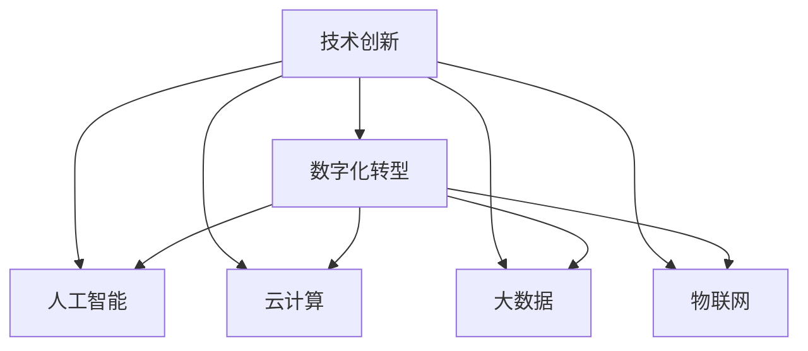

                 

## 1. 背景介绍

### 1.1 问题由来

在过去的几十年里，信息技术的发展和应用极大地推动了全球的经济发展和社会进步。从最初的电子数据处理（EDP）到今天的云计算和大数据，技术的每一次革新都带来了产业结构和经济模式的深刻变革。随着人工智能（AI）和物联网（IoT）的兴起，企业数字化转型的浪潮席卷全球，各行各业都在探索如何利用技术创新驱动业务发展。

然而，尽管数字化转型带来了种种机遇，也存在诸多挑战。例如，数据孤岛、隐私安全、技术兼容等问题依然困扰着企业。如何高效利用技术，实现真正的创新，成为企业数字化转型的关键。本文将探讨技术创新与数字化转型的结合，通过案例和分析，帮助读者理解如何在技术创新的背景下，有效推进数字化转型。

### 1.2 问题核心关键点

本文将围绕以下几个核心问题展开探讨：

1. **技术创新与数字化转型的关系**：技术创新是数字化转型的重要驱动力，但只有通过系统性的变革，才能真正实现业务模式的转变。
2. **数字化转型的关键要素**：从组织文化、人才培训、技术选型等方面，分析数字化转型成功的重要因素。
3. **实际案例分析**：通过分析多个成功案例，展示技术创新如何推动企业数字化转型。
4. **未来趋势和挑战**：预测未来技术趋势，分析企业面临的挑战和应对策略。

## 2. 核心概念与联系

### 2.1 核心概念概述

为了更好地理解技术创新与数字化转型的结合，本节将介绍几个关键概念及其之间的关系：

- **技术创新（Technological Innovation）**：指通过新技术、新方法和新产品，改善现有的产品或服务，创造新的商业模式或业务模式。
- **数字化转型（Digital Transformation）**：指企业利用数字技术，通过重新设计业务流程和优化组织结构，提高效率和竞争力，实现业务模式的根本性变革。
- **人工智能（Artificial Intelligence）**：指通过算法和模型，使机器能够执行人类智能任务，如图像识别、自然语言处理、智能推荐等。
- **云计算（Cloud Computing）**：指通过互联网提供按需计算资源和服务，支持企业的灵活扩展和创新。
- **大数据（Big Data）**：指海量的、高速增长的、多源异构的数据，通过分析和挖掘，为决策提供支持。
- **物联网（Internet of Things, IoT）**：指通过网络将各种物理设备连接起来，实现智能化的数据采集和处理。

这些概念之间的联系可以通过以下Mermaid流程图来展示：



这个流程图展示了大语言模型的核心概念及其之间的关系：

1. 技术创新为数字化转型提供了动力和手段。
2. 数字化转型需要人工智能、云计算、大数据、物联网等技术的支持。
3. 人工智能、云计算、大数据、物联网等技术在数字化转型中相互配合，共同推动业务模式的转变。

## 3. 核心算法原理 & 具体操作步骤
### 3.1 算法原理概述

技术创新与数字化转型的结合，本质上是一个系统的、迭代的过程。技术创新驱动业务模式的改变，而数字化转型则是将技术创新落地实施，实现业务流程和组织结构的优化。

在这一过程中，算法和模型的应用起着至关重要的作用。以下是核心算法原理概述：

- **数据驱动决策**：通过大数据分析和机器学习算法，企业可以基于历史数据和实时数据进行决策，提升决策的科学性和准确性。
- **自动化流程优化**：通过人工智能算法，企业可以实现业务流程的自动化和优化，减少人力成本，提高效率。
- **智能推荐系统**：通过推荐算法，企业可以实现个性化推荐，提升用户体验和满意度。
- **智能监控与分析**：通过实时监控和数据分析，企业可以实现业务的实时反馈和优化，快速响应市场变化。

### 3.2 算法步骤详解

数字化转型的实现，通常包括以下几个关键步骤：

**Step 1: 需求分析与业务规划**

- 明确企业的数字化转型目标，包括业务流程优化、效率提升、客户体验改善等。
- 分析现有业务流程中的痛点和瓶颈，确定数字化转型的重点领域。
- 制定详细的业务规划，包括技术选型、数据采集、流程改造等。

**Step 2: 技术选型与系统集成**

- 根据业务需求和技术趋势，选择合适的技术平台和工具。例如，使用人工智能算法优化推荐系统，使用云计算平台提供弹性计算资源。
- 设计系统架构，实现各系统间的互联互通。例如，通过API接口，将大数据分析和人工智能算法集成到业务系统中。

**Step 3: 数据采集与清洗**

- 采集业务数据和外部数据，建立统一的数据湖。例如，通过ETL（Extract, Transform, Load）工具，将数据从多个来源收集并清洗。
- 实施数据治理，确保数据的质量和安全性。例如，建立数据标准和隐私保护措施。

**Step 4: 算法模型训练与优化**

- 根据业务需求，选择或开发合适的算法模型。例如，使用深度学习模型进行图像识别，使用决策树算法进行客户细分。
- 通过训练和调优，提升模型性能。例如，使用GPU加速模型训练，使用交叉验证优化模型参数。

**Step 5: 系统部署与监控**

- 将训练好的模型部署到生产环境中，确保其稳定运行。例如，使用容器化技术实现模型服务化。
- 实时监控系统性能和数据变化，及时发现和解决问题。例如，使用日志分析和异常检测工具，实现系统故障的快速定位和修复。

### 3.3 算法优缺点

数字化转型中的算法和模型，具有以下优点：

1. **提高效率**：通过自动化和智能化，减少人力成本，提高业务效率。
2. **增强决策科学性**：基于数据和算法，进行科学决策，提升决策的准确性和及时性。
3. **改善用户体验**：通过个性化推荐和智能监控，提升用户体验和满意度。
4. **优化资源利用**：通过资源优化算法，实现资源的高效利用和成本节约。

然而，也存在一些缺点：

1. **数据质量要求高**：算法模型的准确性高度依赖于数据的质量，数据的不完整性和噪声可能影响模型性能。
2. **技术门槛高**：算法模型的开发和优化需要较高的技术门槛，可能对非技术背景的员工构成挑战。
3. **需要持续迭代**：随着业务的变化和市场的更新，算法模型需要不断迭代和优化，以保持其有效性。
4. **隐私和安全风险**：在处理敏感数据时，需要考虑隐私保护和数据安全问题。

## 4. 数学模型和公式 & 详细讲解 & 举例说明

### 4.1 数学模型构建

为了更具体地展示技术创新与数字化转型的结合，本节将构建一个简单的数学模型。假设企业需要优化其产品推荐系统，可以使用以下数学模型来描述这一过程：

设企业有 $N$ 个客户，每个客户对 $M$ 个产品的评分 $r_{ij}$，其中 $i$ 表示客户，$j$ 表示产品。企业的目标是最小化客户与推荐系统的平均评分差异：

$$
\min_{\theta} \frac{1}{N} \sum_{i=1}^N \sum_{j=1}^M (r_{ij} - \hat{r}_{ij})^2
$$

其中 $\hat{r}_{ij}$ 为模型预测的评分，$\theta$ 为模型参数。

### 4.2 公式推导过程

使用线性回归模型，可以将上述问题转化为最小二乘问题：

$$
\hat{r}_{ij} = \theta_0 + \theta_1 x_{i1} + \theta_2 x_{i2} + \cdots + \theta_M x_{iM}
$$

其中 $x_{ik}$ 表示客户 $i$ 在产品 $j$ 上的特征，$\theta_k$ 为模型参数。

最小化均方误差，可以得到：

$$
\min_{\theta} \frac{1}{N} \sum_{i=1}^N \sum_{j=1}^M (r_{ij} - \hat{r}_{ij})^2
$$

通过求解，可以得到模型参数 $\theta$：

$$
\theta = (X^TX)^{-1}X^Ty
$$

其中 $X$ 为特征矩阵，$y$ 为标签向量。

### 4.3 案例分析与讲解

以某电商平台的产品推荐系统为例，使用上述数学模型进行优化。假设企业有1000个客户，每个客户对500个产品的评分，使用线性回归模型进行优化，具体步骤如下：

1. **数据采集与预处理**：从电商平台采集用户行为数据，包括点击、浏览、购买等行为，将这些数据作为模型训练的输入。
2. **特征工程**：将用户行为数据转化为模型可以处理的特征，例如用户年龄、浏览时长、购买频率等。
3. **模型训练与优化**：使用训练数据对模型进行训练，并使用交叉验证进行参数调优。
4. **部署与监控**：将训练好的模型部署到推荐系统中，实时监控推荐效果，根据反馈进行调整。

## 5. 项目实践：代码实例和详细解释说明

### 5.1 开发环境搭建

在进行项目实践前，我们需要准备好开发环境。以下是使用Python进行TensorFlow开发的环境配置流程：

1. 安装Anaconda：从官网下载并安装Anaconda，用于创建独立的Python环境。

2. 创建并激活虚拟环境：
```bash
conda create -n tensorflow-env python=3.8 
conda activate tensorflow-env
```

3. 安装TensorFlow：根据CUDA版本，从官网获取对应的安装命令。例如：
```bash
conda install tensorflow -c conda-forge
```

4. 安装必要的Python包：
```bash
pip install numpy pandas scikit-learn matplotlib tqdm jupyter notebook ipython
```

完成上述步骤后，即可在`tensorflow-env`环境中开始项目实践。

### 5.2 源代码详细实现

这里我们以电商平台产品推荐系统为例，给出使用TensorFlow进行模型训练的PyTorch代码实现。

首先，定义模型：

```python
import tensorflow as tf
from tensorflow.keras import layers, models

model = models.Sequential()
model.add(layers.Dense(64, activation='relu', input_shape=(10,)))
model.add(layers.Dense(1))
```

然后，定义损失函数和优化器：

```python
loss_fn = tf.keras.losses.MeanSquaredError()
optimizer = tf.keras.optimizers.Adam()
```

接着，定义训练函数：

```python
def train_epoch(model, dataset, batch_size, optimizer):
    for batch in dataset:
        features, labels = batch
        with tf.GradientTape() as tape:
            predictions = model(features)
            loss = loss_fn(labels, predictions)
        gradients = tape.gradient(loss, model.trainable_variables)
        optimizer.apply_gradients(zip(gradients, model.trainable_variables))
    return loss
```

最后，启动训练流程：

```python
epochs = 10
batch_size = 32

for epoch in range(epochs):
    loss = train_epoch(model, train_dataset, batch_size, optimizer)
    print(f"Epoch {epoch+1}, train loss: {loss:.3f}")
    
print("Model trained.")
```

### 5.3 代码解读与分析

让我们再详细解读一下关键代码的实现细节：

**模型定义**：
- `Sequential`模型：定义了一个顺序的神经网络模型，由多个层组成。
- `Dense`层：定义了全连接层，使用ReLU激活函数。
- `input_shape`：指定了输入数据的维度。

**损失函数和优化器**：
- `MeanSquaredError`：均方误差损失函数，用于回归任务。
- `Adam`：Adam优化器，结合了梯度的一阶矩估计和二阶矩估计，具有较好的收敛性和稳定性。

**训练函数**：
- `tf.GradientTape`：自动求导梯度，用于计算参数更新。
- `apply_gradients`：应用梯度更新模型参数。

**训练流程**：
- `for`循环：遍历每个epoch，每个batch。
- `with`语句：使用梯度带，记录梯度计算过程。
- `print`语句：输出每个epoch的平均损失。

可以看到，TensorFlow提供了强大的工具支持，使得模型训练过程变得高效便捷。开发者可以将更多精力放在数据处理、模型设计等高层逻辑上，而不必过多关注底层的实现细节。

## 6. 实际应用场景

### 6.1 智慧医疗

智慧医疗是技术创新与数字化转型结合的典型场景。通过人工智能和大数据技术，可以实现疾病诊断、患者管理、医疗资源优化等多个方面的创新。

例如，使用深度学习模型对医学影像进行自动诊断，可以有效提升诊断效率和准确性。使用机器学习算法对患者数据进行分析，可以制定个性化的治疗方案。使用大数据分析，可以优化医院的资源分配，提高医疗服务的效率。

### 6.2 智能制造

智能制造是技术创新与数字化转型结合的另一个重要领域。通过物联网和云计算技术，可以实现生产设备的智能化管理，提升生产效率和质量。

例如，使用传感器收集生产设备的运行数据，实时监控设备的健康状况和维护需求。使用机器学习算法对生产数据进行分析，优化生产工艺和流程。使用人工智能算法对生产预测和库存管理进行优化，提升供应链的响应速度和灵活性。

### 6.3 智慧交通

智慧交通是数字化转型的前沿领域，通过人工智能和大数据技术，可以实现交通管理的智能化和高效化。

例如，使用智能监控系统实时监测交通流量，优化交通信号灯的调整策略。使用机器学习算法对交通事故数据进行分析，预测潜在的安全风险。使用大数据分析，优化交通管理和规划，提升交通的流畅度和安全性。

### 6.4 未来应用展望

随着技术的发展，数字化转型的应用场景将不断扩展，带来更多的创新机遇：

1. **5G通信**：5G技术的普及将进一步推动物联网的发展，实现设备间的实时连接和数据交换，为智慧城市、智慧医疗、智能制造等领域提供更强的技术支撑。
2. **量子计算**：量子计算技术的突破将大幅提升数据处理和计算能力，带来更高效的算法和更强的模型性能，为人工智能应用带来新的突破。
3. **边缘计算**：边缘计算技术的应用将使得数据处理更加分布化，减少数据传输的延迟和带宽需求，提升实时性和响应速度。
4. **人工智能伦理**：随着人工智能技术的广泛应用，伦理和隐私问题将逐渐成为焦点，企业需要在技术创新中注重伦理和隐私保护，确保技术的可持续发展。

## 7. 工具和资源推荐

### 7.1 学习资源推荐

为了帮助开发者系统掌握技术创新与数字化转型的相关知识，这里推荐一些优质的学习资源：

1. **《深度学习入门》**：李沐著，介绍深度学习的基本概念和常用算法。
2. **《Python深度学习》**：Francois Chollet著，介绍使用TensorFlow和Keras进行深度学习开发的实践技巧。
3. **《大数据之路：认知、实践与架构》**：周志华著，介绍大数据技术的应用和架构设计。
4. **《智慧医疗》**：徐雁北著，介绍智慧医疗的架构和应用案例。
5. **《物联网技术与应用》**：李欣宇著，介绍物联网技术的基本概念和应用场景。

通过对这些资源的学习实践，相信你一定能够快速掌握技术创新与数字化转型的精髓，并用于解决实际的业务问题。

### 7.2 开发工具推荐

高效的开发离不开优秀的工具支持。以下是几款用于技术创新与数字化转型开发的常用工具：

1. **PyTorch**：基于Python的开源深度学习框架，灵活动态的计算图，适合快速迭代研究。
2. **TensorFlow**：由Google主导开发的开源深度学习框架，生产部署方便，适合大规模工程应用。
3. **Jupyter Notebook**：用于编写和分享Python代码，支持代码高亮和实时执行。
4. **GitHub**：用于代码托管和协作，支持版本控制和持续集成。
5. **Docker**：用于容器化技术，方便部署和管理多服务系统。

合理利用这些工具，可以显著提升技术创新与数字化转型的开发效率，加快创新迭代的步伐。

### 7.3 相关论文推荐

技术创新与数字化转型的研究源于学界的持续研究。以下是几篇奠基性的相关论文，推荐阅读：

1. **《Deep Learning》**：Ian Goodfellow, Yoshua Bengio, Aaron Courville著，介绍深度学习的基本概念和算法。
2. **《Machine Learning Yearning》**：Andrew Ng著，介绍机器学习实践中的常见问题和解决方案。
3. **《Big Data: Principles and Best Practices of Scalable Real-time Data Systems》**：Jeff Dean等著，介绍大数据技术的架构设计和最佳实践。
4. **《A Survey on Multi-Modal Learning》**：Xia Liang等著，介绍多模态学习技术的基本概念和应用。
5. **《AI: A Challenge to Ethical Theory?》**：Simon J. Bowden著，讨论人工智能伦理和隐私保护的问题。

这些论文代表了大语言模型微调技术的发展脉络。通过学习这些前沿成果，可以帮助研究者把握学科前进方向，激发更多的创新灵感。

## 8. 总结：未来发展趋势与挑战

### 8.1 总结

本文对技术创新与数字化转型的结合进行了全面系统的介绍。首先阐述了技术创新与数字化转型的关系和核心要素，明确了数字化转型成功的重要因素。其次，通过案例和分析，展示了技术创新在各个行业中的应用，展示了技术创新对数字化转型的驱动作用。最后，预测了未来技术趋势，分析了企业面临的挑战和应对策略。

通过本文的系统梳理，可以看到，技术创新与数字化转型在当前和未来的发展中扮演着至关重要的角色。技术的持续创新推动着数字化转型的不断深入，数字化转型的不断推进也推动着技术的不断进步。只有技术创新和数字化转型相结合，才能实现业务的持续发展和竞争力提升。

### 8.2 未来发展趋势

展望未来，技术创新与数字化转型的结合将呈现以下几个发展趋势：

1. **智能化**：随着人工智能技术的不断发展，智能化的解决方案将更加普及。智能化可以提升企业的运营效率和决策水平，实现业务模式的根本性变革。
2. **自动化**：自动化技术将进一步发展，通过机器人和智能系统，实现生产、服务和管理等领域的自动化，提升效率和质量。
3. **实时化**：实时数据和实时分析将成为企业运营的重要支撑，通过实时反馈和实时优化，提升企业的响应速度和竞争力。
4. **协同化**：企业内部和外部的协同将更加紧密，通过协同创新和合作，实现资源的共享和价值的最大化。
5. **可持续发展**：企业在数字化转型的过程中，将更加注重可持续发展和环保，通过技术创新实现绿色转型。

### 8.3 面临的挑战

尽管技术创新与数字化转型的结合带来了诸多机遇，但也面临诸多挑战：

1. **技术复杂性**：技术创新涉及多种技术，如大数据、人工智能、物联网等，需要综合技术能力和跨学科知识。
2. **数据隐私和安全**：在数字化转型的过程中，数据隐私和安全问题将更加突出，需要制定严格的数据治理和隐私保护措施。
3. **组织变革**：数字化转型需要企业内部进行组织变革，包括文化、流程和组织结构的优化，这将是一个长期的、复杂的过程。
4. **技术兼容性**：不同的技术平台和技术标准之间存在兼容性问题，需要制定统一的标准和接口，实现系统间的互联互通。
5. **人才短缺**：数字化转型需要大量的技术人才，但当前市场上的技术人才仍然短缺，需要加强人才培训和引进。

### 8.4 研究展望

为了应对未来挑战，需要从以下几个方面进行研究：

1. **技术融合**：探索不同技术之间的融合和协同，实现技术的互利共赢。
2. **数据治理**：制定数据治理标准和规范，确保数据质量和安全。
3. **组织变革**：推动企业内部的组织变革，提升数字化转型的适应性和灵活性。
4. **技术共享**：建立技术共享平台，促进技术的传播和应用。
5. **人才培训**：加强技术人才的培训和引进，提升企业的技术能力和竞争力。

总之，技术创新与数字化转型的结合是未来发展的必然趋势，只有不断探索和创新，才能实现业务的持续发展和竞争力的提升。未来，伴随着技术的不断进步和市场的不断变化，技术创新与数字化转型的结合将更加紧密，推动企业迈向更高的发展层次。

## 9. 附录：常见问题与解答

**Q1：技术创新与数字化转型的关系是什么？**

A: 技术创新是数字化转型的重要驱动力，而数字化转型则是技术创新的落地实施。技术创新通过提供新技术和新方法，推动企业进行业务模式的变革；数字化转型则是将技术创新应用于业务流程和组织结构，实现业务的根本性变革。

**Q2：数字化转型的关键要素有哪些？**

A: 数字化转型的关键要素包括：
1. **组织文化**：企业需要建立开放、创新和协作的文化氛围，激发员工的创新意识。
2. **人才培训**：企业需要加强技术人才的培训和引进，提升技术能力和创新能力。
3. **技术选型**：企业需要选择合适的技术平台和工具，实现系统的互联互通。
4. **数据治理**：企业需要建立数据治理标准和规范，确保数据的质量和安全。
5. **流程优化**：企业需要优化业务流程，提高效率和灵活性。

**Q3：数字化转型的难点有哪些？**

A: 数字化转型的难点包括：
1. **技术复杂性**：涉及多种技术，需要综合技术能力和跨学科知识。
2. **数据隐私和安全**：数据隐私和安全问题需要严格治理和保护。
3. **组织变革**：需要企业内部进行组织变革，提升适应性和灵活性。
4. **技术兼容性**：不同的技术平台和技术标准之间存在兼容性问题。
5. **人才短缺**：技术人才短缺，需要加强人才培训和引进。

**Q4：如何评估数字化转型的效果？**

A: 数字化转型的效果评估可以从以下几个方面进行：
1. **业务效率**：评估业务流程的优化程度，提升效率和生产力。
2. **客户满意度**：评估用户体验和满意度，提升客户忠诚度。
3. **成本控制**：评估成本控制和资源利用效率，提升经济效益。
4. **创新能力**：评估技术创新和产品创新能力，提升市场竞争力。

**Q5：企业如何进行数字化转型？**

A: 企业进行数字化转型的主要步骤包括：
1. **需求分析**：明确数字化转型的目标和需求，制定详细的业务规划。
2. **技术选型**：选择合适的技术平台和工具，实现系统的互联互通。
3. **数据治理**：建立数据治理标准和规范，确保数据的质量和安全。
4. **流程优化**：优化业务流程，提高效率和灵活性。
5. **试点应用**：选择试点应用，验证数字化转型的效果，进行持续优化和改进。

总之，技术创新与数字化转型的结合是企业实现可持续发展的重要途径，只有不断探索和创新，才能在激烈的竞争中立于不败之地。通过系统化的理论研究和实践应用，相信企业能够更好地把握技术创新与数字化转型的趋势，实现业务的持续发展和竞争力的提升。

---

作者：禅与计算机程序设计艺术 / Zen and the Art of Computer Programming

