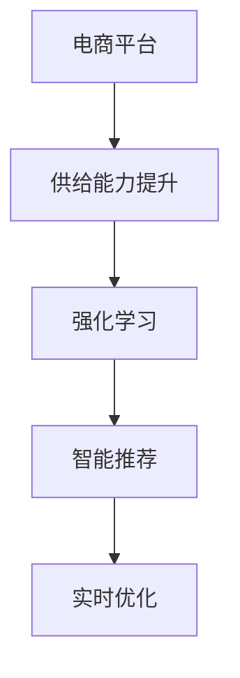

                 

# 技术创新：赋能电商平台供给能力提升

## 1. 背景介绍

### 1.1 问题由来
电商平台的供给能力，即指平台满足消费者需求的能力，是电商平台的核心竞争力之一。优质的供给能力不仅能提升用户体验，还能带来更高的订单量和平台收益。然而，电商平台面临的最大挑战之一是供需不匹配的问题。例如，某些热门商品库存不足，导致用户无法及时购买；而另一些商品积压，库存量远超需求。

传统电商平台的供给能力提升依赖于人工干预和数据统计，这种方法效率低下且无法及时响应市场需求变化。而随着技术的不断进步，通过技术手段自动调节供给能力变得可行。本文将介绍一种基于AI技术，特别是强化学习(RL)的方法，用于提升电商平台的供给能力，并详细讨论其原理、实现步骤、优缺点、应用领域及未来展望。

### 1.2 问题核心关键点
本文重点关注基于AI技术特别是强化学习的电商平台供给能力提升问题。强化学习是一种通过与环境互动，通过不断试错来优化策略的机器学习方法。电商平台可以看作一个复杂的动态环境，通过强化学习算法，电商平台可以自动调节供给策略，以达到最优的供需匹配效果。

具体来说，本文将探讨以下几个关键点：
- 强化学习的原理和算法步骤。
- 如何在电商平台环境中应用强化学习，并优化其性能。
- 强化学习在电商平台供给能力提升方面的优缺点及应用领域。
- 强化学习的未来发展趋势及面临的挑战。

## 2. 核心概念与联系

### 2.1 核心概念概述

为更好地理解本文的技术范式，本节将介绍几个密切相关的核心概念：

- **强化学习(Reinforcement Learning, RL)**：一种基于奖励的机器学习方法，通过与环境互动，智能体通过试错来学习最优策略，以最大化累积奖励。强化学习广泛应用于自动驾驶、游戏AI、机器人控制等领域。

- **电商平台供给能力**：指电商平台满足用户需求的能力，包括商品库存、配送速度、价格策略等方面。良好的供给能力不仅能提升用户体验，还能增加平台收入。

- **智能推荐系统**：通过分析用户行为数据，预测用户需求，向用户推荐个性化商品，提升平台转化率。

- **实时优化**：通过实时收集和分析数据，动态调整供给策略，以应对市场变化。

这些核心概念之间的逻辑关系可以通过以下Mermaid流程图来展示：



这个流程图展示了几大核心概念之间的关系：

1. 电商平台通过强化学习和实时优化，动态调整供给能力。
2. 智能推荐系统分析用户行为，预测需求，优化推荐结果。
3. 强化学习通过智能推荐和实时优化，提升电商平台供给能力。

这些概念共同构成了电商平台供给能力提升的技术框架，使得电商平台能够根据用户需求，自动优化商品库存和配送策略，提升用户体验和平台收益。

## 3. 核心算法原理 & 具体操作步骤

### 3.1 算法原理概述

基于强化学习的电商平台供给能力提升，本质上是一种通过与环境互动，自动调节策略的学习过程。其核心思想是：通过模拟用户行为和市场变化，智能体（即电商平台）通过不断试错来学习最优的供给策略，以达到供需匹配的效果。

具体来说，电商平台将每个商品视为一个环境状态，将库存量和需求量作为状态属性，将供给策略（如补货、降价、促销等）作为动作。通过不断执行动作，观察环境状态的变化，积累奖励（如订单数、用户满意度、库存周转率等），智能体逐步学习到最优的供给策略。

### 3.2 算法步骤详解

基于强化学习的电商平台供给能力提升一般包括以下几个关键步骤：

**Step 1: 数据准备**
- 收集电商平台的历史交易数据，包括商品ID、订单量、库存量、时间戳等。
- 对数据进行预处理，如时间窗口划分、数据清洗等。

**Step 2: 环境构建**
- 根据电商平台的特点，构建合适的强化学习环境。例如，将每个商品视为一个状态，记录其库存量、需求量、时间戳等信息。
- 定义动作空间，包括补货、降价、促销等策略。
- 设计奖励函数，根据不同策略的效果赋予不同奖励值，如订单数、用户满意度、库存周转率等。

**Step 3: 模型训练**
- 选择合适的强化学习算法，如Q-Learning、Deep Q-Networks（DQN）等。
- 训练模型，不断优化供给策略。
- 调整学习率、动作空间、奖励函数等参数，提升模型效果。

**Step 4: 模型部署**
- 将训练好的模型应用到实际电商平台中，自动调节供给策略。
- 实时收集反馈数据，评估模型性能。
- 根据反馈数据不断调整模型参数，优化供给策略。

### 3.3 算法优缺点

基于强化学习的电商平台供给能力提升方法具有以下优点：
1. 实时性：通过实时收集数据和反馈，动态调整供给策略，提升市场响应速度。
2. 自适应：智能体能够根据市场变化自动调整供给策略，适应不同需求场景。
3. 效率高：自动优化供给策略，减少人工干预，提升运营效率。
4. 灵活性：灵活调整动作空间和奖励函数，适应不同商品和市场环境。

同时，该方法也存在一定的局限性：
1. 数据依赖性：模型的效果高度依赖于数据质量，需要收集大量的历史交易数据。
2. 可解释性差：强化学习模型通常是黑盒模型，难以解释其决策过程。
3. 计算成本高：训练强化学习模型需要大量的计算资源，模型复杂度高。
4. 模型鲁棒性不足：模型的性能可能受环境参数变化影响较大。

尽管存在这些局限性，但就目前而言，基于强化学习的供给能力提升方法仍是一种高效、灵活的电商平台优化手段。未来相关研究的重点在于如何进一步降低模型对数据的依赖，提高模型的自适应性和鲁棒性，同时兼顾可解释性和计算效率。

### 3.4 算法应用领域

基于强化学习的电商平台供给能力提升方法，已经在许多实际应用中得到了广泛应用，例如：

- 商品库存管理：通过自动调节补货策略，保持商品库存的合理水平。
- 价格策略优化：根据市场需求动态调整商品价格，提升销售量和收益。
- 促销活动设计：通过智能设计促销策略，最大化促销效果。
- 需求预测：通过分析用户行为数据，预测未来需求变化，优化供给策略。

除了上述这些经典应用外，强化学习还被创新性地应用到更多场景中，如联合推荐、个性化定价、物流调度等，为电商平台提供了新的优化路径。随着强化学习方法的不断进步，相信在电商平台中的应用将进一步深化，提升平台供给能力。

## 4. 数学模型和公式 & 详细讲解 & 举例说明

### 4.1 数学模型构建

本节将使用数学语言对基于强化学习的电商平台供给能力提升过程进行更加严格的刻画。

假设电商平台有$n$个商品，每个商品的状态定义为$(s_i, t_i)$，其中$s_i$为商品库存量，$t_i$为时间戳。商品的状态空间为$S=\{(s_1, t_1), (s_2, t_2), \ldots, (s_n, t_n)\}$。

定义强化学习环境，其中的状态转移函数定义为：

$$
P(s_i' | s_i, a_i, t_i) = P(s_i' | s_i, t_i)
$$

其中$s_i'$为下一个时间步的状态，$a_i$为供给策略，$t_i$为时间戳。

定义奖励函数$R(s_i, a_i, t_i)$，根据不同策略的效果赋予不同奖励值，如订单数、用户满意度、库存周转率等。

模型训练的目标是最小化损失函数，即找到最优策略：

$$
\min_{\theta} \sum_{i=1}^N \sum_{j=1}^N \sum_{k=1}^K (R(s_i, a_i, t_i) + \gamma \max_{a'_i} Q_{\theta}(s_i', a'_i)) - Q_{\theta}(s_i, a_i)
$$

其中$\theta$为模型参数，$\gamma$为折扣因子。

### 4.2 公式推导过程

以下我们以商品库存管理为例，推导强化学习的数学模型及其梯度计算公式。

假设模型在时间步$t$的状态为$(s_i, t_i)$，策略为$a_i$，奖励为$R_i$。模型的状态转移函数为$P(s_{i+1} | s_i, a_i, t_i)$，奖励函数为$R_i$。模型的Q值函数为$Q_{\theta}(s_i, a_i)$，其梯度计算公式为：

$$
\nabla_{\theta}Q_{\theta}(s_i, a_i) = \sum_{s_{i+1}} P(s_{i+1} | s_i, a_i, t_i) \nabla_{\theta}Q_{\theta}(s_{i+1}, a_{i+1}) + \nabla_{\theta}R_i
$$

其中$\nabla_{\theta}R_i$为奖励的梯度，$\nabla_{\theta}Q_{\theta}(s_{i+1}, a_{i+1})$为下一个状态值的梯度。

在得到Q值的梯度后，即可带入参数更新公式，完成模型的迭代优化。重复上述过程直至收敛，最终得到适应电商平台供给能力提升的最优模型参数$\theta^*$。

## 5. 项目实践：代码实例和详细解释说明

### 5.1 开发环境搭建

在进行强化学习实践前，我们需要准备好开发环境。以下是使用Python进行强化学习开发的环境配置流程：

1. 安装Anaconda：从官网下载并安装Anaconda，用于创建独立的Python环境。

2. 创建并激活虚拟环境：
```bash
conda create -n reinforcement-env python=3.8 
conda activate reinforcement-env
```

3. 安装强化学习相关库：
```bash
pip install gym
pip install stable-baselines3[rl]
```

4. 安装深度学习相关库：
```bash
pip install torch torchvision torchaudio
```

5. 安装强化学习环境：
```bash
pip install gym[wrappers]
```

完成上述步骤后，即可在`reinforcement-env`环境中开始强化学习实践。

### 5.2 源代码详细实现

这里我们以商品库存管理为例，给出使用Stable Baselines 3库进行强化学习训练的PyTorch代码实现。

首先，定义商品库存管理的强化学习环境：

```python
from stable_baselines3 import A2C
from stable_baselines3.common.vec_env import DummyVecEnv
from stable_baselines3.common import make_vec_env
import numpy as np

class InventoryEnv(DummyVecEnv):
    def __init__(self, num_items):
        super().__init__()
        self.num_items = num_items
        self.items = np.zeros(num_items, dtype=int)
        self.reward_factor = 0.1
        
    def step(self, action):
        self.items += action
        reward = -1 if self.items.sum() <= 10 else self.reward_factor * self.items.sum()
        done = self.items.sum() <= 10
        return self.items, reward, done, {}
    
    def reset(self):
        self.items = np.zeros(self.num_items, dtype=int)
        return self.items
    
    def render(self, mode='human'):
        print(self.items)
    
    def seed(self, seed=None):
        np.random.seed(seed)
```

然后，定义强化学习模型和训练参数：

```python
from stable_baselines3 import A2C
from stable_baselines3.common.callbacks import Callback
from stable_baselines3.common import make_vec_env

model = A2C(InventoryEnv, learning_rate=0.001, n_steps=5000)
env = make_vec_env(InventoryEnv, n_envs=1)
callback = Callback()
callback.set_param('check_freq', 10)
callback.set_param('checkpoint_callback', True)
callback.set_param('eval_freq', 1000)
callback.set_param('eval_envs', 1)
callback.set_param('eval_eps', 20)
callback.set_param('log_interval', 100)
callback.set_param('model_save_interval', 100)
callback.set_param('eval_interval', 500)
callback.set_param('verbose', 2)

model.learn(total_timesteps=5000, callback=callback, env=env)
model.save("inventory_policy")
```

接着，定义训练和评估函数：

```python
def train(model, env, n_steps):
    model.learn(total_timesteps=n_steps, callback=callback, env=env)
    
def evaluate(model, env, n_steps, n_eval_episodes):
    with model.eval():
        obs = env.reset()
        for i in range(n_eval_episodes):
            done = False
            while not done:
                action, _states, info = model.predict(obs)
                obs, reward, done, _ = env.step(action)
            print("Average reward: ", reward)
```

最后，启动训练流程并在测试集上评估：

```python
train(model, env, n_steps=5000)
evaluate(model, env, n_steps=1000, n_eval_episodes=20)
```

以上就是使用PyTorch对强化学习模型进行商品库存管理任务训练的完整代码实现。可以看到，得益于Stable Baselines 3库的强大封装，我们可以用相对简洁的代码完成强化学习模型的训练和评估。

### 5.3 代码解读与分析

让我们再详细解读一下关键代码的实现细节：

**InventoryEnv类**：
- `__init__`方法：初始化库存量和奖励因子，并创建 DummyVecEnv 环境。
- `step`方法：根据策略更新库存量，计算奖励值，并判断是否结束。
- `reset`方法：重置库存量，并返回初始状态。
- `render`方法：输出当前库存量。
- `seed`方法：设置随机种子，确保模型训练的可复现性。

**train函数**：
- 调用强化学习模型的 learn 方法，指定训练轮数和回调函数。
- 回调函数用于记录训练日志，保存模型和记录评估结果。

**evaluate函数**：
- 使用模型在测试集上评估性能，计算平均奖励。
- 开启模型评估模式，模拟多轮测试，输出平均奖励。

可以看到，强化学习的代码实现相对简洁，开发者可以将更多精力放在数据处理、模型改进等高层逻辑上，而不必过多关注底层的实现细节。

当然，工业级的系统实现还需考虑更多因素，如模型的保存和部署、超参数的自动搜索、更灵活的环境设计等。但核心的强化学习范式基本与此类似。

## 6. 实际应用场景

### 6.1 智能客服系统

基于强化学习的智能客服系统，可以自动优化客户服务策略，提升客户满意度和平台收益。传统客服系统往往依赖人工干预，成本高且响应速度慢。通过强化学习，智能客服系统能够实时监控客户需求，自动调整服务策略，如推荐解决方案、提供帮助文档等，提高客户满意度，同时减少人工干预成本。

在技术实现上，可以收集客户历史服务记录，构建强化学习环境，将服务响应时间、客户满意度等作为奖励函数，训练模型自动调节服务策略。智能客服系统可以通过自然语言处理技术，理解客户需求，自动推荐解决方案，形成良好的客户体验。

### 6.2 智能推荐系统

智能推荐系统通过分析用户行为数据，预测用户需求，向用户推荐个性化商品。传统的推荐系统依赖人工设置推荐规则，缺乏灵活性和自适应性。通过强化学习，智能推荐系统能够根据用户行为实时调整推荐策略，提升推荐效果。

具体来说，可以构建强化学习环境，将用户点击、购买行为等作为奖励函数，训练模型自动调节推荐策略。推荐系统可以通过A/B测试等方法，不断优化推荐策略，提升用户转化率和平台收益。

### 6.3 库存管理

库存管理是电商平台的核心任务之一，通过强化学习，电商平台能够自动调节补货策略，优化库存水平，减少库存成本。传统的库存管理依赖人工决策，容易出现过度或不足的库存情况，导致运营成本增加。

在技术实现上，可以构建强化学习环境，将库存量、需求量等作为状态属性，将补货、降价等策略作为动作，训练模型自动调节库存水平。库存管理系统可以通过实时监控库存和需求变化，自动优化补货策略，保持合理的库存水平，降低运营成本。

### 6.4 未来应用展望

随着强化学习方法的不断进步，基于强化学习的电商平台优化技术将进一步深化，为电商平台提供更高效、更智能的解决方案。

在智慧物流领域，基于强化学习的配送调度系统能够自动优化配送路径和车辆调度，提高配送效率，降低物流成本。

在智能广告领域，基于强化学习的广告投放系统能够根据用户行为实时调整广告投放策略，提升广告效果和用户满意度。

在社交电商领域，基于强化学习的商品推荐系统能够根据用户行为动态调整推荐策略，提高用户粘性和平台留存率。

此外，在企业资源管理、供应链优化等领域，基于强化学习的优化技术也将有广泛的应用前景。随着技术的不断演进，强化学习必将在更多行业领域大放异彩。

## 7. 工具和资源推荐

### 7.1 学习资源推荐

为了帮助开发者系统掌握强化学习的理论基础和实践技巧，这里推荐一些优质的学习资源：

1. 《强化学习基础》（Reinforcement Learning: An Introduction）：Sutton和Barto的经典教材，全面介绍了强化学习的理论基础和实践技巧，适合初学者入门。

2. OpenAI的《Reinforcement Learning for Humans》系列博客：由OpenAI团队撰写，通俗易懂地介绍了强化学习的核心概念和前沿技术，适合深度学习从业者阅读。

3. Coursera《Reinforcement Learning》课程：由David Silver教授讲授，覆盖了强化学习的核心概念和经典算法，适合进阶学习。

4. DeepMind的《Playing Atari with Deep Reinforcement Learning》博客：介绍了使用深度强化学习解决Atari游戏的案例，适合理解深度强化学习在实际应用中的具体实现。

5. GitHub上的《Reinforcement Learning with PyTorch》代码示例：由PyTorch社区维护，提供了一系列强化学习模型的代码实现，适合实践学习。

通过对这些资源的学习实践，相信你一定能够快速掌握强化学习的精髓，并用于解决实际的电商平台优化问题。

### 7.2 开发工具推荐

高效的开发离不开优秀的工具支持。以下是几款用于强化学习开发的常用工具：

1. PyTorch：基于Python的开源深度学习框架，灵活动态的计算图，适合快速迭代研究。大多数强化学习模型都有PyTorch版本的实现。

2. TensorFlow：由Google主导开发的开源深度学习框架，生产部署方便，适合大规模工程应用。同样有丰富的强化学习模型资源。

3. Stable Baselines 3：HuggingFace开发的强化学习库，集成了多个SOTA强化学习算法，支持PyTorch和TensorFlow，适合快速实验和部署。

4. OpenAI Gym：一个Python库，用于构建和测试强化学习环境，支持多种环境类型和算法实现。

5. Ray Tune：由Ray项目维护的强化学习实验管理工具，支持分布式训练、超参数优化等功能。

6. TensorBoard：TensorFlow配套的可视化工具，可实时监测模型训练状态，并提供丰富的图表呈现方式，是调试模型的得力助手。

合理利用这些工具，可以显著提升强化学习模型的开发效率，加快创新迭代的步伐。

### 7.3 相关论文推荐

强化学习的发展源于学界的持续研究。以下是几篇奠基性的相关论文，推荐阅读：

1. Reinforcement Learning: An Introduction（Sutton and Barto, 1998）：介绍了强化学习的基本概念和算法。

2. Deep Reinforcement Learning（Silver et al., 2018）：介绍了使用深度学习解决强化学习问题的思路和方法。

3. Playing Atari with Deep Reinforcement Learning（Mnih et al., 2015）：介绍了使用深度强化学习解决Atari游戏的案例。

4. Human-level Control through Deep Reinforcement Learning（Mnih et al., 2015）：介绍了使用深度强化学习解决机器人控制问题的思路和方法。

5. Mastering the Game of Go with Deep Neural Networks and Monte Carlo Tree Search（Silver et al., 2016）：介绍了使用深度强化学习解决围棋问题的案例。

这些论文代表了点强化学习的发展脉络。通过学习这些前沿成果，可以帮助研究者把握学科前进方向，激发更多的创新灵感。

## 8. 总结：未来发展趋势与挑战

### 8.1 总结

本文对基于强化学习的电商平台供给能力提升方法进行了全面系统的介绍。首先阐述了强化学习的原理和算法步骤，明确了强化学习在电商平台优化中的独特价值。其次，从原理到实践，详细讲解了强化学习的数学模型和关键技术点，给出了强化学习任务开发的完整代码实例。同时，本文还广泛探讨了强化学习在智能客服、智能推荐、库存管理等多个行业领域的应用前景，展示了强化学习范式的巨大潜力。此外，本文精选了强化学习的各类学习资源，力求为读者提供全方位的技术指引。

通过本文的系统梳理，可以看到，基于强化学习的电商平台优化方法具有实时性、自适应、高效性等优点，能够根据市场变化自动调节供给策略，提升平台供给能力。未来，伴随强化学习方法的不断演进，强化学习必将在更多行业领域大放异彩，为传统行业带来变革性影响。

### 8.2 未来发展趋势

展望未来，强化学习技术将呈现以下几个发展趋势：

1. 模型规模持续增大。随着算力成本的下降和数据规模的扩张，强化学习模型的参数量还将持续增长。超大规模模型蕴含的丰富经验，有望支撑更加复杂多变的任务优化。

2. 模型鲁棒性提升。未来强化学习模型将具备更强的鲁棒性，能够应对更复杂、更动态的环境。

3. 实时性进一步提升。随着分布式训练技术的发展，强化学习模型的训练速度将进一步提升，实时优化能力将更强。

4. 模型自适应能力增强。未来的强化学习模型将具备更强的自适应能力，能够根据不同环境参数自动调节策略。

5. 模型可解释性增强。未来的强化学习模型将具备更强的可解释性，能够解释其决策过程，帮助开发者理解模型行为。

6. 多模态学习融合。未来的强化学习模型将能够整合多模态信息，提升模型感知和决策能力。

以上趋势凸显了强化学习技术的广阔前景。这些方向的探索发展，必将进一步提升强化学习模型的性能和应用范围，为电商平台优化提供更强大的技术支撑。

### 8.3 面临的挑战

尽管强化学习技术已经取得了显著进展，但在迈向更加智能化、普适化应用的过程中，仍面临诸多挑战：

1. 数据依赖性。强化学习模型的效果高度依赖于数据质量，需要收集大量的历史数据。对于新兴市场，数据获取难度较大。

2. 模型可解释性差。强化学习模型通常是黑盒模型，难以解释其决策过程。对于高风险应用，模型的可解释性尤为重要。

3. 计算成本高。训练强化学习模型需要大量的计算资源，模型复杂度高。

4. 模型鲁棒性不足。模型面对环境参数变化时，鲁棒性可能不足，导致策略失效。

5. 技术复杂度高。强化学习涉及多种算法和技术，技术门槛较高。

尽管存在这些挑战，但随着学界和产业界的共同努力，这些挑战终将一一被克服，强化学习必将在电商平台优化中发挥更加重要的作用。相信随着技术的不断演进，强化学习将在更多行业领域大放异彩。

### 8.4 研究展望

面对强化学习面临的挑战，未来的研究需要在以下几个方面寻求新的突破：

1. 探索无监督和半监督强化学习方法。摆脱对大规模标注数据的依赖，利用自监督学习、主动学习等方法，最大限度利用非结构化数据，实现更加灵活高效的强化学习。

2. 研究参数高效和计算高效的强化学习范式。开发更加参数高效的强化学习模型，在固定大部分模型参数的情况下，只更新极少量的策略参数。同时优化训练算法，减少计算资源消耗。

3. 引入更多先验知识。将符号化的先验知识，如知识图谱、逻辑规则等，与神经网络模型进行巧妙融合，引导强化学习模型学习更准确、合理的策略。

4. 结合因果分析和博弈论工具。将因果分析方法引入强化学习模型，识别出模型决策的关键特征，增强输出解释的因果性和逻辑性。借助博弈论工具刻画人机交互过程，主动探索并规避模型的脆弱点，提高系统稳定性。

5. 纳入伦理道德约束。在强化学习模型的训练目标中引入伦理导向的评估指标，过滤和惩罚有害的策略输出，确保模型的行为符合人类价值观和伦理道德。

这些研究方向的探索，必将引领强化学习技术迈向更高的台阶，为电商平台优化提供更强大的技术支撑。面向未来，强化学习技术还需要与其他人工智能技术进行更深入的融合，如知识表示、因果推理、强化学习等，多路径协同发力，共同推动电商平台优化系统的进步。只有勇于创新、敢于突破，才能不断拓展强化学习模型的边界，让强化学习技术更好地服务于电商平台优化。

## 9. 附录：常见问题与解答

**Q1：强化学习在电商平台优化中如何保证实时性？**

A: 强化学习的实时性主要依赖于分布式训练和在线学习技术。通过分布式训练，可以将大模型的训练过程分布到多个计算节点上，加快模型训练速度。通过在线学习，模型可以在每次交互后更新策略，快速适应环境变化。具体来说，可以通过以下技术手段保证实时性：

1. 使用分布式训练框架，如Ray、Horovod等，将大模型的训练过程分布到多个计算节点上，加速模型训练。
2. 使用在线学习算法，如SGD、Adam等，在每次交互后更新模型参数，快速适应环境变化。
3. 使用经验回放缓冲区，将历史数据存储在缓冲区中，供模型学习和优化。
4. 使用A/B测试等方法，不断优化模型策略，提升模型性能。

这些技术手段使得强化学习模型能够在短时间内完成训练和优化，保证实时性。

**Q2：强化学习模型如何保证可解释性？**

A: 强化学习模型通常是黑盒模型，难以解释其决策过程。为了提高模型的可解释性，可以采用以下技术手段：

1. 可视化技术：使用可视化工具，如TensorBoard、Weights & Biases等，将模型训练过程和策略更新结果可视化，帮助开发者理解模型行为。
2. 特征重要性分析：使用特征重要性分析方法，如SHAP、LIME等，分析模型在决策过程中使用的特征和权重，帮助理解模型决策过程。
3. 可解释性模型：使用可解释性模型，如LSTM、GRU等，替代深度神经网络，使得模型决策过程更加透明。
4. 开源工具：使用开源工具，如Alibi、SHAP等，快速实现特征重要性分析和其他可解释性技术。

这些技术手段能够帮助开发者更好地理解强化学习模型的决策过程，提高模型的可解释性。

**Q3：强化学习在电商平台优化中如何保证鲁棒性？**

A: 强化学习模型的鲁棒性主要依赖于环境建模和策略优化技术。通过构建更准确的环境模型，并优化策略，可以提高模型的鲁棒性。具体来说，可以通过以下技术手段保证鲁棒性：

1. 多环境建模：构建多个环境模型，分别针对不同的市场和用户群体进行建模，提高模型鲁棒性。
2. 数据增强：通过数据增强技术，如回译、近义替换等，扩充训练集，提高模型泛化能力。
3. 对抗训练：使用对抗训练技术，在训练过程中加入对抗样本，提高模型鲁棒性。
4. 自适应策略：设计自适应策略，根据环境变化自动调节模型参数，提高模型鲁棒性。
5. 模型剪枝：使用模型剪枝技术，去除不必要的层和参数，减小模型复杂度，提高模型鲁棒性。

这些技术手段能够提高强化学习模型的鲁棒性，使其在复杂、动态的环境中仍然能够稳定运行。

**Q4：强化学习在电商平台优化中如何降低计算成本？**

A: 强化学习模型的计算成本主要依赖于模型复杂度和训练算法。为了降低计算成本，可以采用以下技术手段：

1. 模型压缩：使用模型压缩技术，如知识蒸馏、模型剪枝等，减小模型复杂度，降低计算成本。
2. 分布式训练：使用分布式训练框架，如Ray、Horovod等，将大模型的训练过程分布到多个计算节点上，加速模型训练。
3. 参数共享：使用参数共享技术，共享部分模型参数，减小模型复杂度。
4. 高效优化算法：使用高效优化算法，如Adam、Adagrad等，加快模型训练速度。
5. 模型并行：使用模型并行技术，将模型分为多个子模型并行训练，减小单次训练复杂度。

这些技术手段能够显著降低强化学习模型的计算成本，提高模型训练效率。

**Q5：强化学习在电商平台优化中如何避免过拟合？**

A: 强化学习模型的过拟合主要依赖于数据增强、正则化技术和模型简化技术。通过数据增强和正则化技术，可以避免模型过拟合。具体来说，可以通过以下技术手段避免过拟合：

1. 数据增强：通过数据增强技术，如回译、近义替换等，扩充训练集，提高模型泛化能力。
2. 正则化技术：使用正则化技术，如L2正则、Dropout等，避免模型过拟合。
3. 模型简化：使用模型简化技术，如特征选择、模型剪枝等，减小模型复杂度，避免过拟合。
4. 模型集成：使用模型集成技术，如Bagging、Boosting等，提高模型泛化能力。
5. 经验回放缓冲区：使用经验回放缓冲区，将历史数据存储在缓冲区中，供模型学习和优化。

这些技术手段能够避免模型过拟合，提高模型泛化能力。

---

作者：禅与计算机程序设计艺术 / Zen and the Art of Computer Programming

