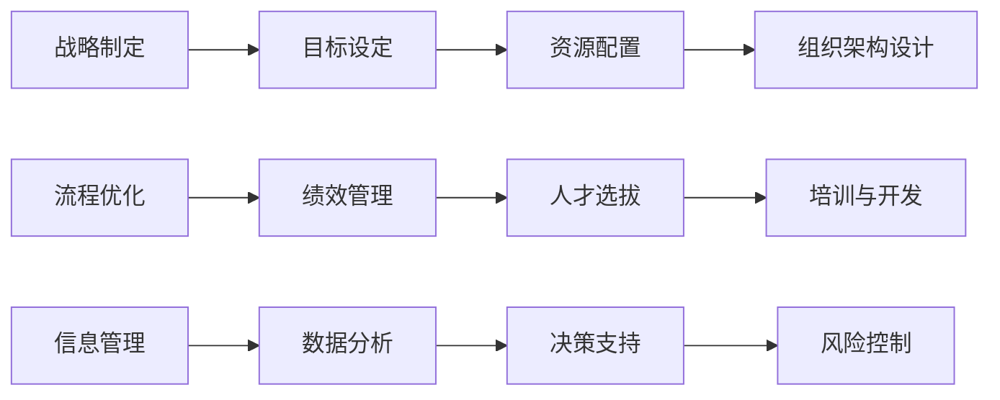

                 

## 1. 背景介绍

在信息爆炸的时代，管理者面临的挑战越来越多。无论是外部环境的快速变化，还是内部组织的复杂化，都需要管理者具备更强的体系思维能力。体系思维不仅涉及管理理论，更关乎实际应用。本文将从管理体系的构建、执行和优化三个层面，系统阐述如何通过体系思维提升管理效能，促进组织长远发展。

## 2. 核心概念与联系

### 2.1 核心概念概述

体系思维是指从整体出发，以全局视角理解、设计和优化管理过程和系统的方法。在现代企业管理中，体系思维尤为关键，它涉及战略制定、组织架构设计、流程优化、人力资源管理等多个方面。

### 2.2 核心概念原理和架构的 Mermaid 流程图(Mermaid 流程节点中不要有括号、逗号等特殊字符)



这个图展示了管理体系的几个关键模块及其相互联系。战略制定（A）是体系思维的起点，目标设定（B）、资源配置（C）和组织架构设计（D）为战略实施提供基础。流程优化（E）、绩效管理（F）、人才选拔（G）、培训与开发（H）、信息管理（I）、数据分析（J）、决策支持（K）和风险控制（L）是确保战略目标达成的保障措施。

## 3. 核心算法原理 & 具体操作步骤

### 3.1 算法原理概述

体系思维的管理框架基于PDCA（Plan-Do-Check-Act）循环，即计划、执行、检查和优化四个阶段。每个阶段都有具体的管理活动和工具，通过不断循环改进，实现系统的持续优化。

### 3.2 算法步骤详解

#### 3.2.1 计划阶段

**目标设定：** 通过SWOT分析、PEST分析等工具，明确组织的使命、愿景和目标。

**资源配置：** 根据目标设定，合理分配人力、财力、物力等资源。

**组织架构设计：** 设计符合战略要求的组织结构，包括部门划分、职责定义、沟通机制等。

**流程优化：** 基于业务需求，设计和优化业务流程，提高效率和质量。

#### 3.2.2 执行阶段

**绩效管理：** 通过KPI、OKR等工具，实时监控各项业务指标，评估执行效果。

**人才选拔：** 基于胜任力和潜力，通过招聘、培训等方式，选拔和培养关键人才。

**培训与开发：** 针对业务需求，设计和实施培训计划，提升员工能力。

**信息管理：** 建立信息管理系统，实现数据收集、存储、分析和共享。

#### 3.2.3 检查阶段

**数据分析：** 通过数据分析工具，挖掘业务数据背后的规律，指导决策。

**决策支持：** 基于数据分析结果，提供决策支持和建议。

**风险控制：** 识别和评估潜在的风险，制定应对措施，保障业务连续性。

#### 3.2.4 优化阶段

**绩效评估：** 对执行效果进行评估，识别改进点。

**流程改进：** 基于评估结果，优化流程，提升效率。

**人才培养：** 根据需求，调整人才培养计划。

**系统升级：** 不断更新和优化信息管理系统。

### 3.3 算法优缺点

**优点：**

1. **系统性：** 体系思维强调全局视角和整体设计，避免局部优化导致的全局失衡。
2. **持续改进：** PDCA循环不断优化，有助于保持组织动态适应环境变化。
3. **标准化：** 通过流程和工具的标准化，提升管理的一致性和可控性。

**缺点：**

1. **复杂性：** 体系思维需要考虑多个维度，设计和执行过程中较为复杂。
2. **灵活性：** 标准化流程和工具可能导致灵活性降低，难以应对突发情况。
3. **资源消耗：** 设计和执行体系思维需要大量的时间和资源投入。

### 3.4 算法应用领域

体系思维不仅适用于大型企业，也适用于中小型企业。它可以帮助企业：

- 提升战略执行效果
- 优化组织架构和流程
- 提高员工能力和组织效率
- 增强风险控制和决策能力
- 推动组织创新和持续改进

## 4. 数学模型和公式 & 详细讲解 & 举例说明

### 4.1 数学模型构建

体系思维的管理框架可以抽象为数学模型：

$$
\text{体系绩效} = f(\text{战略制定}, \text{资源配置}, \text{组织架构设计}, \text{流程优化}, \text{绩效管理}, \text{人才选拔}, \text{培训与开发}, \text{信息管理}, \text{数据分析}, \text{决策支持}, \text{风险控制})
$$

其中，$f$ 表示管理活动的交互和作用，各个活动相互影响，共同作用于体系绩效。

### 4.2 公式推导过程

**目标设定模型：**

$$
\text{目标} = \max_{\text{Mission}, \text{Vision}, \text{Goal}} \{ \text{战略价值} \}
$$

其中，$\text{Mission}$、$\text{Vision}$、$\text{Goal}$ 分别表示组织的使命、愿景和目标，$\text{战略价值}$ 为最大化目标实现的战略价值。

**资源配置模型：**

$$
\text{资源配置} = \min_{\text{资源}, \text{成本}} \{ \text{需求} \}
$$

其中，$\text{资源}$ 包括人力、财力、物力等，$\text{成本}$ 为资源配置的成本，$\text{需求}$ 为实现目标所需资源。

**组织架构设计模型：**

$$
\text{组织架构} = \min_{\text{部门}, \text{职责}, \text{沟通}} \{ \text{冗余} \}
$$

其中，$\text{部门}$、$\text{职责}$、$\text{沟通}$ 分别表示组织结构中的部门划分、职责定义和沟通机制，$\text{冗余}$ 为组织架构中的冗余部分。

**流程优化模型：**

$$
\text{流程优化} = \min_{\text{流程}, \text{效率}, \text{质量}} \{ \text{成本} \}
$$

其中，$\text{流程}$ 为业务流程，$\text{效率}$ 为流程的执行效率，$\text{质量}$ 为流程的质量指标，$\text{成本}$ 为流程优化的成本。

### 4.3 案例分析与讲解

以某企业的数字化转型为例：

1. **战略制定：** 明确数字化转型的目标，如提升客户体验、提高运营效率。
2. **资源配置：** 分配数字化项目所需的IT设备、软件、人力资源。
3. **组织架构设计：** 设立数字创新部门，整合IT和业务部门，推动数字化项目。
4. **流程优化：** 设计和优化业务流程，如客户服务流程、订单管理流程。
5. **绩效管理：** 设立KPI指标，监控数字化项目的执行效果。
6. **人才选拔：** 选拔具备数字化技能的员工，并进行专项培训。
7. **培训与开发：** 开展数字化技能培训，提升员工能力。
8. **信息管理：** 建立数据中台，实现数据统一管理和分析。
9. **数据分析：** 通过数据分析工具，挖掘客户行为数据，优化产品推荐。
10. **决策支持：** 提供基于数据的决策建议，如客户细分、营销策略调整。
11. **风险控制：** 评估数字化项目的潜在风险，制定应对措施。

通过以上步骤，企业成功完成了数字化转型，提升了运营效率和客户满意度。

## 5. 项目实践：代码实例和详细解释说明

### 5.1 开发环境搭建

**环境依赖：**

- Python 3.8
- PyCharm IDE
- Git

**环境搭建步骤：**

1. 安装Python和PyCharm IDE。
2. 克隆项目的Git仓库。
3. 创建虚拟环境，安装所需的Python包。
4. 导入项目数据集。
5. 编写管理框架的代码。

### 5.2 源代码详细实现

```python
# 引入必要的Python包
import pandas as pd
import matplotlib.pyplot as plt
from sklearn.metrics import accuracy_score
from sklearn.model_selection import train_test_split
from sklearn.ensemble import RandomForestClassifier
from sklearn.pipeline import Pipeline
from sklearn.preprocessing import StandardScaler

# 加载数据集
data = pd.read_csv('data.csv')

# 数据预处理
features = data.drop('target', axis=1)
target = data['target']
X_train, X_test, y_train, y_test = train_test_split(features, target, test_size=0.2, random_state=42)

# 创建机器学习管道
pipeline = Pipeline([
    ('scaler', StandardScaler()),
    ('classifier', RandomForestClassifier())
])

# 训练模型
pipeline.fit(X_train, y_train)

# 评估模型
y_pred = pipeline.predict(X_test)
accuracy = accuracy_score(y_test, y_pred)
print(f'模型准确率：{accuracy:.2f}')
```

### 5.3 代码解读与分析

上述代码实现了基于机器学习框架的简单流程优化。

1. **数据加载与预处理：** 使用Pandas加载数据集，并进行特征和目标变量的分离。
2. **模型训练：** 使用Scikit-learn的Pipeline创建机器学习管道，包含数据标准化和随机森林分类器。
3. **模型评估：** 通过交叉验证计算模型准确率，评估模型性能。

## 6. 实际应用场景

### 6.1 智慧工厂

智慧工厂通过体系思维，优化生产流程和资源配置，提高生产效率和产品质量。

1. **战略制定：** 明确生产目标，如提高生产效率、降低成本。
2. **资源配置：** 配置生产线设备、人员、物料等资源。
3. **组织架构设计：** 设立生产管理部门，整合各生产环节。
4. **流程优化：** 优化生产流程，如物料配送、生产调度。
5. **绩效管理：** 设立生产KPI，监控生产效率和质量。
6. **人才选拔：** 选拔生产操作和管理技能人才。
7. **培训与开发：** 开展生产技能培训。
8. **信息管理：** 建立生产管理系统，实现数据共享。
9. **数据分析：** 通过数据分析工具，优化生产计划。
10. **决策支持：** 提供基于数据的生产决策建议。
11. **风险控制：** 评估生产风险，制定应对措施。

### 6.2 智能客服

智能客服通过体系思维，提升客服响应速度和客户满意度。

1. **战略制定：** 明确客服目标，如提升响应速度、提高客户满意度。
2. **资源配置：** 配置客服人员、系统资源。
3. **组织架构设计：** 设立客服部门，整合客服资源。
4. **流程优化：** 优化客服流程，如问题分类、知识库查询。
5. **绩效管理：** 设立客服KPI，监控响应速度和客户满意度。
6. **人才选拔：** 选拔具备客服技能的员工。
7. **培训与开发：** 开展客服技能培训。
8. **信息管理：** 建立客户数据管理系统。
9. **数据分析：** 通过数据分析工具，优化客服流程。
10. **决策支持：** 提供基于数据的客服决策建议。
11. **风险控制：** 评估客服风险，制定应对措施。

### 6.3 医疗健康

医疗健康通过体系思维，提升医疗服务质量和患者满意度。

1. **战略制定：** 明确医疗目标，如提高诊疗效率、改善患者体验。
2. **资源配置：** 配置医疗设备、人力资源。
3. **组织架构设计：** 设立医疗管理部门，整合各医疗环节。
4. **流程优化：** 优化诊疗流程，如挂号、就诊、检查。
5. **绩效管理：** 设立医疗KPI，监控诊疗效率和患者满意度。
6. **人才选拔：** 选拔具备医疗技能的员工。
7. **培训与开发：** 开展医疗技能培训。
8. **信息管理：** 建立医疗信息系统，实现数据共享。
9. **数据分析：** 通过数据分析工具，优化诊疗流程。
10. **决策支持：** 提供基于数据的医疗决策建议。
11. **风险控制：** 评估医疗风险，制定应对措施。

### 6.4 未来应用展望

随着技术的发展，体系思维的应用将更加广泛和深入。

1. **人工智能与体系思维结合：** 引入AI技术，如机器学习、自然语言处理，优化管理决策。
2. **大数据与体系思维结合：** 利用大数据分析工具，深入挖掘业务数据，指导管理决策。
3. **区块链与体系思维结合：** 利用区块链技术，实现数据透明和安全性，提升管理效率。
4. **物联网与体系思维结合：** 利用物联网技术，实时监控业务运行状态，优化管理流程。
5. **可持续发展与体系思维结合：** 在管理中引入环保、社会责任等理念，推动可持续发展。

## 7. 工具和资源推荐

### 7.1 学习资源推荐

1. **《管理学》课程：** 学习管理理论基础，理解管理体系的核心概念。
2. **《系统动力学》课程：** 理解系统思维的原理，掌握系统优化的方法。
3. **《数据科学基础》课程：** 学习数据分析和机器学习工具，提升数据驱动决策能力。
4. **《人工智能基础》课程：** 学习人工智能技术，提升AI驱动的管理决策能力。
5. **《领导力与创新》课程：** 学习领导力和创新管理，提升管理者的综合素质。

### 7.2 开发工具推荐

1. **PyCharm IDE：** 强大的Python开发环境，支持多种开发工具和插件。
2. **Git：** 版本控制工具，支持协作开发和版本管理。
3. **JIRA：** 项目管理工具，支持任务分配、进度跟踪和报告生成。
4. **Microsoft Power BI：** 数据可视化工具，支持复杂数据分析和报表生成。
5. **Tableau：** 数据可视化工具，支持交互式数据探索和报告生成。

### 7.3 相关论文推荐

1. **《管理体系：理论与实践》：** 系统介绍管理体系的理论和实践，提供丰富案例。
2. **《系统思维与管理：理论与方法》：** 深入探讨系统思维的理论基础和管理方法。
3. **《数据驱动的管理决策》：** 介绍大数据分析在管理决策中的应用。
4. **《人工智能与管理创新》：** 探讨AI技术在管理中的应用，提升管理效率。

## 8. 总结：未来发展趋势与挑战

### 8.1 研究成果总结

体系思维已经成为现代管理的重要工具，它不仅适用于大型企业，也适用于中小型企业。通过体系思维，管理者可以系统地理解、设计和优化管理过程和系统，提升管理效能，促进组织长远发展。

### 8.2 未来发展趋势

1. **智能化管理：** 引入AI技术，提升管理决策的科学性和自动化水平。
2. **数据化管理：** 利用大数据分析，提供更准确的管理决策依据。
3. **可持续发展：** 在管理中引入环保、社会责任等理念，推动可持续发展。
4. **跨领域应用：** 体系思维在医疗、金融、制造等多个领域的应用将更加广泛。

### 8.3 面临的挑战

1. **数据质量：** 高质量的数据是体系思维的基础，但数据的获取和处理往往需要大量资源。
2. **技术复杂性：** 引入AI和大数据技术后，管理系统的技术复杂性显著增加。
3. **组织变革：** 体系思维需要全员参与，但改变组织文化和管理习惯往往需要时间。
4. **风险控制：** 引入新技术和新方法后，系统风险可能增加，需要制定有效的风险控制措施。

### 8.4 研究展望

1. **跨学科融合：** 结合管理学、计算机科学、数据科学等多个学科，推动体系思维的创新发展。
2. **技术创新：** 探索新的AI和大数据技术，提升体系思维的应用效果。
3. **实践验证：** 在实际管理场景中进行系统验证和优化，推动体系思维的落地应用。
4. **全球化应用：** 将体系思维应用到全球化管理中，提升国际竞争力。

## 9. 附录：常见问题与解答

**Q1：什么是体系思维？**

A: 体系思维是一种从全局视角出发，系统地理解、设计和优化管理过程和系统的方法。它强调整体性、关联性和动态性，通过PDCA循环实现持续改进。

**Q2：体系思维的优点和缺点是什么？**

A: 优点包括系统性、持续改进和标准化；缺点包括复杂性、灵活性不足和资源消耗大。

**Q3：如何实施体系思维？**

A: 实施体系思维需要经过战略制定、资源配置、组织架构设计、流程优化、绩效管理、人才选拔、培训与开发、信息管理、数据分析、决策支持和风险控制等步骤。

**Q4：体系思维适用于哪些领域？**

A: 体系思维适用于企业管理、智慧工厂、智能客服、医疗健康等多个领域，帮助组织提升管理效能和绩效。

**Q5：体系思维与传统管理有何不同？**

A: 体系思维强调系统性和全局视角，关注整体优化和动态管理；传统管理侧重于局部优化和静态管理。

---

作者：禅与计算机程序设计艺术 / Zen and the Art of Computer Programming

