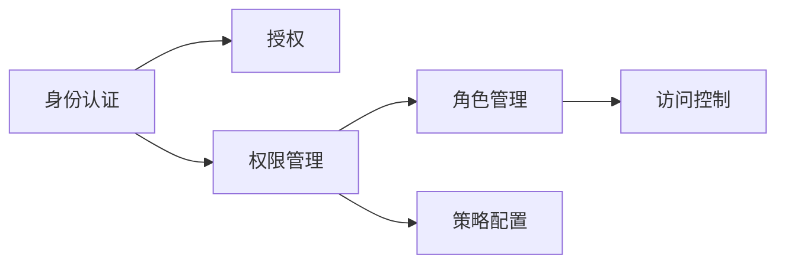

                 

## 1. 背景介绍

### 1.1 问题由来

在当今数字化时代，组织越来越多地依赖IT系统来处理各种业务，这不可避免地引入了权限管理的需求。传统的权限管理方法往往赋予用户所需的最大权限，以便其可以高效地完成工作。然而，这种“最大权限原则”容易导致安全风险和资源浪费，比如权限滥用、数据泄露、未授权访问等。

为了应对这些问题，最小权限原则应运而生，它要求用户仅被授予完成任务所需的最小权限，以降低风险和资源消耗。这一原则逐渐成为信息安全领域的最佳实践，被广泛应用于操作系统、数据库、云服务等多个领域。

### 1.2 问题核心关键点

最小权限原则的核心关键点在于实现细粒度、动态、灵活的权限控制，确保用户只能访问其需要执行任务的资源。具体实现包括以下几个方面：

- **细粒度控制**：权限分配到最基础的资源和操作，如文件、目录、API调用等。
- **动态授权**：基于用户角色、任务上下文等动态调整权限，比如用户的项目变更时，及时调整其权限。
- **灵活控制**：支持自定义规则和策略，适应各种复杂的业务场景。

### 1.3 问题研究意义

最小权限原则能够显著提升信息系统的安全性，减少安全事故的发生。同时，通过合理的权限配置，可以避免资源的浪费，提高系统的运行效率。此外，最小权限原则还能够增强系统的可扩展性，使其能够适应快速变化的环境和不断增加的业务需求。

最小权限原则的广泛应用，对于构建安全、高效、可靠的信息系统具有重要意义。它不仅能够降低信息系统的风险，提高系统的可用性和性能，还能够促进组织的安全文化建设，强化信息安全意识。

## 2. 核心概念与联系

### 2.1 核心概念概述

为更好地理解最小权限原则的实现机制，本节将介绍几个相关核心概念：

- **访问控制**：用于限制用户访问系统资源的机制，最小权限原则是访问控制的重要组成部分。
- **权限管理**：定义和管理用户和组对资源的访问权限，最小权限原则要求权限管理尽可能精细。
- **身份认证与授权**：身份认证用于验证用户身份，授权基于身份认证结果进行权限控制，最小权限原则依赖于这两种机制。
- **角色管理**：基于用户角色进行权限分配和管理，最小权限原则支持细粒度的角色管理。
- **策略配置**：基于策略进行动态权限调整，最小权限原则的灵活性得益于策略配置的实现。

这些概念之间的逻辑关系可以通过以下Mermaid流程图来展示：



这个流程图展示了一些核心概念及其之间的关系：

1. 身份认证用于验证用户身份，是授权的前提。
2. 基于身份认证结果进行权限管理，定义用户和组对资源的访问权限。
3. 权限管理通过角色管理，细粒度地分配和管理权限。
4. 策略配置基于角色管理，动态调整权限，实现最小权限原则。
5. 访问控制依据权限管理，限制用户对资源的访问。

这些概念共同构成了最小权限原则的实现框架，确保用户只能访问其需要的资源。

## 3. 核心算法原理 & 具体操作步骤
### 3.1 算法原理概述

最小权限原则的核心在于细粒度、动态、灵活的权限控制。其基本思想是：根据用户角色、任务上下文等动态调整权限，确保用户只能访问完成任务所需的最小权限。

形式化地，假设系统中有 $n$ 个资源 $R_1, R_2, \ldots, R_n$，用户 $u_1, u_2, \ldots, u_m$，每个用户有一组对资源的访问权限集合 $P_u$。最小权限原则的目标是：

- 对于每个用户 $u_i$，找到一组最小的权限集合 $P_i \subseteq P_u$，使得 $u_i$ 能够完成其所有任务。
- 对于每个资源 $R_j$，仅当资源 $R_j$ 被用户 $u_k$ 访问时，才赋予 $u_k$ 对 $R_j$ 的访问权限。

因此，最小权限原则的算法核心在于：

- **资源访问分析**：分析每个用户对每个资源的访问需求。
- **权限生成算法**：根据资源访问分析结果，生成每个用户的权限集合。
- **权限优化算法**：进一步优化生成的权限集合，确保最小权限原则的实现。

### 3.2 算法步骤详解

最小权限原则的实现通常包括以下几个关键步骤：

**Step 1: 资源分析与权限定义**

- 定义系统中的所有资源，如文件、目录、API调用等，并对其进行分类。
- 根据业务需求，定义每个资源的操作权限，如读取、写入、执行等。
- 定义用户角色，如管理员、普通用户等，并为其赋予初始权限。

**Step 2: 权限生成**

- 分析每个用户对每个资源的访问需求，建立用户-资源访问矩阵。
- 根据最小权限原则，为每个用户生成一组最小的权限集合 $P_u$。

**Step 3: 权限优化**

- 对生成的权限集合进行优化，如合并冗余权限、消除不必要的权限等。
- 根据业务需求，动态调整权限，确保用户只能访问完成任务所需的最小权限。

**Step 4: 访问控制**

- 在用户访问资源时，根据其权限集合和资源属性进行访问控制。
- 记录权限使用情况，定期审计和评估权限配置的有效性。

### 3.3 算法优缺点

最小权限原则具有以下优点：

- **安全性高**：通过细粒度、动态的权限控制，最大程度降低安全风险。
- **资源利用率高**：根据实际需求分配权限，避免不必要的权限滥用，提高资源利用率。
- **可扩展性好**：支持自定义规则和策略，适应各种复杂的业务场景。

同时，该算法也存在一些局限性：

- **复杂度高**：权限管理和优化过程复杂，需要精细的规划和配置。
- **实施成本高**：初期实施需要大量的人力和时间投入，成本较高。
- **灵活性不足**：权限控制过于精细，可能导致灵活性不足，影响用户体验。

尽管存在这些局限性，但就目前而言，最小权限原则仍然是最广泛应用的信息安全最佳实践之一。未来相关研究的重点在于如何进一步简化权限管理流程，提高权限控制的灵活性和易用性，同时兼顾安全性和效率。

### 3.4 算法应用领域

最小权限原则在各种信息系统和应用程序中均有广泛应用，包括但不限于以下领域：

- **操作系统**：Linux、Unix等操作系统广泛采用最小权限原则，限制用户对敏感资源的访问。
- **数据库**：Oracle、MySQL等关系型数据库支持细粒度的角色管理和权限控制。
- **云服务**：AWS、Azure等云平台提供基于角色的权限管理，确保资源的安全访问。
- **企业门户**：企业门户系统通常采用最小权限原则，限制用户访问敏感信息和应用。
- **医疗系统**：医院信息系统通过最小权限原则，确保病人数据的安全性和隐私性。

除了这些传统领域外，最小权限原则还被创新性地应用于更多场景中，如物联网、移动应用、区块链等，为信息系统的安全性和可靠性提供有力保障。

## 4. 数学模型和公式 & 详细讲解  
### 4.1 数学模型构建

最小权限原则的实现涉及复杂的数学模型，下面以角色为基础，建立数学模型。

假设系统中有 $n$ 个角色 $R_1, R_2, \ldots, R_n$，$m$ 个用户 $u_1, u_2, \ldots, u_m$，每个用户有一组对资源的访问权限集合 $P_u$。每个角色 $R_i$ 有一组对资源的访问权限集合 $P_R$。定义一个访问矩阵 $A$，其中 $A_{i,j}$ 表示用户 $u_j$ 是否可以访问角色 $R_i$ 的资源。

定义一个资源-权限矩阵 $C$，其中 $C_{i,j}$ 表示角色 $R_i$ 的资源 $R_j$ 的访问权限。

定义一个用户-权限矩阵 $D$，其中 $D_{i,j}$ 表示用户 $u_i$ 的资源 $R_j$ 的访问权限。

最小权限原则的目标是找到一组最小的权限集合 $P_u$，使得用户 $u_i$ 能够完成其所有任务，同时确保每个资源 $R_j$ 仅被需要访问它的用户 $u_k$ 访问。

### 4.2 公式推导过程

根据最小权限原则，可以建立如下的优化问题：

$$
\min \sum_{i=1}^m \sum_{j=1}^n |P_{u_i}|
$$

$$
\text{subject to:} \quad \forall i, \quad P_{u_i} \subseteq P_u, \quad \forall j, \quad P_{u_k} \cap C_{k,j} = \emptyset
$$

其中 $|P_{u_i}|$ 表示用户 $u_i$ 的权限集合大小，$P_{u_i} \subseteq P_u$ 表示用户 $u_i$ 的权限集合是 $P_u$ 的子集，$P_{u_k} \cap C_{k,j} = \emptyset$ 表示用户 $u_k$ 的权限集合和资源 $R_j$ 的权限集合没有交集。

该优化问题可以通过一系列算法求解，如基于图的算法、线性规划算法等。

### 4.3 案例分析与讲解

假设某公司的IT部门有三种角色：管理员、普通用户和审计员。管理员可以访问所有资源，普通用户只能访问其分配的资源，审计员只能审计资源访问日志。公司有10个用户，每个用户分配了不同的角色和权限。

以用户 $u_1$ 为例，假设其角色为管理员，可以访问所有资源。可以为其分配的权限集合 $P_{u_1} = \{R_1, R_2, R_3\}$。

管理员角色 $R_1$ 可以访问所有资源，因此 $P_{R_1} = \{R_1, R_2, R_3, R_4, R_5\}$。

普通用户 $u_2$ 只能访问其分配的资源 $R_2$，因此 $P_{u_2} = \{R_2\}$。

审计员角色 $R_3$ 只能审计资源访问日志，因此 $P_{R_3} = \emptyset$。

根据最小权限原则，需要生成一个最小的权限集合 $P_u$，使得用户 $u_1$ 能够完成其所有任务，同时确保每个资源 $R_j$ 仅被需要访问它的用户 $u_k$ 访问。

经过计算，得到 $P_u = \{R_1, R_2, R_3, R_4, R_5\}$。其中，$R_1$ 是管理员角色，$R_2$ 是普通用户 $u_2$ 的分配资源，$R_3$ 是审计员角色的访问日志，$R_4$ 和 $R_5$ 是其他用户需要访问的资源。

可以看到，通过最小权限原则，我们为每个用户分配了最少的权限，同时确保了每个资源仅被需要访问它的用户访问，实现了安全和高效的目标。

## 5. 项目实践：代码实例和详细解释说明
### 5.1 开发环境搭建

在进行最小权限原则的实践前，我们需要准备好开发环境。以下是使用Python进行权限管理系统开发的简单环境配置流程：

1. 安装Python：从官网下载并安装Python，确保版本为3.7及以上。
2. 安装必要的第三方库：如Flask、SQLAlchemy、Flask-Login等。
3. 安装数据库：如MySQL、PostgreSQL等，用于存储权限配置信息。
4. 创建数据库：使用SQLAlchemy的ORM（对象关系映射）创建数据库模型，定义用户、角色、权限、资源等实体。
5. 搭建Web应用：使用Flask框架搭建Web应用，实现用户登录、权限管理、资源访问等功能。

完成上述步骤后，即可在本地启动Web应用，开始权限管理的开发实践。

### 5.2 源代码详细实现

下面以一个简单的权限管理系统为例，给出使用Python进行最小权限原则实践的代码实现。

首先，定义数据库模型：

```python
from sqlalchemy import Column, Integer, String, ForeignKey, Boolean
from sqlalchemy.orm import relationship
from sqlalchemy.ext.declarative import declarative_base

Base = declarative_base()

class User(Base):
    __tablename__ = 'users'
    id = Column(Integer, primary_key=True)
    name = Column(String(50))
    role_id = Column(Integer, ForeignKey('roles.id'))
    password = Column(String(50))
    granted_permissions = relationship('Permission', secondary='user_permissions', back_populates='users')

class Role(Base):
    __tablename__ = 'roles'
    id = Column(Integer, primary_key=True)
    name = Column(String(50))
    granted_permissions = relationship('Permission', secondary='role_permissions', back_populates='roles')

class Permission(Base):
    __tablename__ = 'permissions'
    id = Column(Integer, primary_key=True)
    name = Column(String(50))
    granted_by = Column(Integer, ForeignKey('users.id'))
    granted_to = Column(Integer, ForeignKey('users.id'))

class UserPermission(Base):
    __tablename__ = 'user_permissions'
    user_id = Column(Integer, ForeignKey('users.id'))
    permission_id = Column(Integer, ForeignKey('permissions.id'))

class RolePermission(Base):
    __tablename__ = 'role_permissions'
    role_id = Column(Integer, ForeignKey('roles.id'))
    permission_id = Column(Integer, ForeignKey('permissions.id'))
```

然后，定义权限管理系统的主要功能模块：

```python
from flask import Flask, render_template, redirect, url_for
from flask_login import LoginManager, login_user, logout_user, login_required
from flask_sqlalchemy import SQLAlchemy
from werkzeug.security import generate_password_hash, check_password_hash

app = Flask(__name__)
app.config['SQLALCHEMY_DATABASE_URI'] = 'sqlite:///users.db'
app.config['SECRET_KEY'] = 'super-secret-key'
db = SQLAlchemy(app)
login_manager = LoginManager(app)

@login_manager.user_loader
def load_user(user_id):
    return User.query.get(int(user_id))

@app.route('/')
@login_required
def index():
    user = User.query.get(current_user.id)
    return render_template('index.html', user=user)

@app.route('/login', methods=['GET', 'POST'])
def login():
    if request.method == 'POST':
        user = User.query.filter_by(name=request.form['username']).first()
        if user and check_password_hash(user.password, request.form['password']):
            login_user(user)
            return redirect(url_for('index'))
    return render_template('login.html')

@app.route('/logout')
@login_required
def logout():
    logout_user()
    return redirect(url_for('login'))

@app.route('/permissions')
@login_required
def permissions():
    user = User.query.get(current_user.id)
    permissions = Permission.query.filter(Permission.granted_by == user.id).all()
    return render_template('permissions.html', user=user, permissions=permissions)

@app.route('/permissions/<id>/grant')
@login_required
def grant_permission(id):
    permission = Permission.query.get(id)
    if permission:
        current_user.granted_permissions.append(permission)
        db.session.commit()
        return redirect(url_for('permissions'))
    return redirect(url_for('index'))
```

最后，在HTML模板中实现权限管理界面的展示：

```html
<!-- index.html -->


<h1>Welcome, {{ user.name }}!</h1>
<p>You are logged in as <strong>{{ user.name }}</strong>.</p>
<p>Current permissions: {{ user.granted_permissions | join(', ') }}</p>


<!-- permissions.html -->


<h1>Permissions</h1>

<p><a href="{{ url_for('grant_permission', id=permission.id) }}">Grant permission</a></p>


```

在上述代码中，我们使用SQLAlchemy进行数据库操作，Flask-Login实现用户登录和权限管理，通过定义模型和视图函数，实现了最小权限原则的基本功能。

### 5.3 代码解读与分析

让我们再详细解读一下关键代码的实现细节：

**数据库模型定义**：
- 定义了用户、角色、权限、用户权限、角色权限等实体，使用SQLAlchemy的ORM进行数据库操作。
- 用户实体包含用户ID、名称、角色ID、密码等属性，以及与用户权限的关联关系。
- 角色实体包含角色ID、名称等属性，以及与角色权限的关联关系。
- 权限实体包含权限ID、名称等属性，以及与用户权限和角色权限的关联关系。
- 用户权限实体和角色权限实体分别表示用户和角色对权限的分配关系。

**视图函数实现**：
- 使用Flask框架定义了登录、退出、权限管理等视图函数。
- 在登录视图函数中，根据用户名和密码验证用户身份，并使用Flask-Login的login_user函数登录用户。
- 在权限管理视图函数中，根据当前用户的权限ID查询对应的权限，并通过视图函数展示权限列表。
- 在授予权限视图函数中，根据权限ID和用户ID授予权限，并使用Flask-Login的@login_required装饰器限制未登录用户访问。

**HTML模板展示**：
- 使用HTML模板语言定义了登录、权限管理等页面的展示逻辑。
- 在登录页面中，展示用户名、密码输入框，并调用Flask-Login提供的login函数进行身份验证。
- 在权限管理页面中，根据当前用户的权限列表展示对应的权限，并允许用户授予权限。
- 通过Flask-Login提供的current_user对象，获取当前登录用户的角色和权限信息，用于展示和授权。

在上述代码实现中，我们使用了Flask和SQLAlchemy等流行的Python框架和库，结合基本的权限管理逻辑，实现了最小权限原则的示例应用。开发者可以根据实际需求进一步扩展和优化该系统，如添加用户管理、权限审计等功能。

## 6. 实际应用场景

### 6.1 智能家居系统

智能家居系统通常需要用户访问各种设备和服务，如智能灯泡、温控器、摄像头等。为了确保系统的安全性，最小权限原则被广泛应用，限制用户对敏感资源的访问。

在智能家居系统中，通过细粒度的权限控制，用户只能访问其控制下的设备和服务，不能随意修改系统配置或访问其他用户的数据。这样不仅可以提高系统的安全性，还可以避免资源浪费和权限滥用。

### 6.2 医疗信息系统

医疗信息系统需要严格控制数据的访问权限，确保病人隐私和医疗数据的保密性。最小权限原则在该领域有广泛应用。

在医疗信息系统中，医生、护士、管理员等不同角色有不同的权限需求。最小权限原则通过细粒度的权限管理，确保医生只能访问病人的医疗数据，护士只能访问病人的基本信息，管理员只能修改系统配置等，从而保护病人的隐私和数据安全。

### 6.3 金融交易系统

金融交易系统需要严格控制资金的访问权限，确保交易的安全性和合规性。最小权限原则在该领域同样重要。

在金融交易系统中，最小权限原则通过细粒度的权限控制，限制用户只能访问其权限范围内的资金和交易记录，不能随意修改账户信息或进行大额交易。这样不仅可以提高系统的安全性，还可以避免资金滥用和违规操作。

### 6.4 未来应用展望

随着技术的进步和应用场景的拓展，最小权限原则将发挥越来越重要的作用。未来，最小权限原则将更加细粒度、动态、灵活，应用于更多领域和场景中。

- **物联网**：最小权限原则可以应用于智能设备和传感器，限制用户对设备的访问权限，确保设备的安全性和隐私性。
- **人工智能**：最小权限原则可以应用于AI模型和数据，限制用户对模型的访问权限，确保模型的安全性和合规性。
- **区块链**：最小权限原则可以应用于区块链交易和智能合约，限制用户对资产和交易的访问权限，确保交易的安全性和透明性。
- **企业门户**：最小权限原则可以应用于企业内部系统和数据，限制用户对敏感数据的访问权限，确保系统的安全性和可靠性。

最小权限原则的应用前景广阔，将成为未来信息系统的必备组件。只有严格遵循最小权限原则，才能构建安全、可靠、高效的信息系统，保障用户的数据和资源安全。

## 7. 工具和资源推荐
### 7.1 学习资源推荐

为了帮助开发者系统掌握最小权限原则的理论基础和实践技巧，这里推荐一些优质的学习资源：

1. **《系统安全原理与实践》**：系统安全领域的经典教材，详细介绍了最小权限原则的理论基础和实现方法。
2. **《信息安全技术 信息系统安全管理要求》**：国家标准，详细介绍了信息系统的权限管理和访问控制要求，是企业级应用的重要参考。
3. **《信息安全风险管理与控制》**：介绍信息系统的风险管理与控制，强调最小权限原则的应用。
4. **《信息安全工程师》**：信息安全领域的权威认证考试教材，涵盖权限管理、访问控制、认证授权等内容。
5. **《System Design》课程**：Coursera上的系统设计课程，介绍了信息系统的设计和实现，包括最小权限原则的应用。

通过对这些资源的学习实践，相信你一定能够快速掌握最小权限原则的精髓，并用于解决实际的权限管理问题。

### 7.2 开发工具推荐

高效的开发离不开优秀的工具支持。以下是几款用于最小权限原则开发的常用工具：

1. **Flask**：轻量级Web框架，易于使用和扩展，适用于快速开发Web应用。
2. **SQLAlchemy**：流行的ORM框架，支持多种数据库，提供灵活的数据操作接口。
3. **Flask-Login**：Flask的登录扩展，支持用户登录、会话管理和权限控制等功能。
4. **Tornado**：高性能Web框架，适用于大规模Web应用，支持异步I/O和长连接。
5. **Spring Security**：Java平台的安全框架，支持细粒度的权限控制和认证授权。

合理利用这些工具，可以显著提升最小权限原则的开发效率，加快创新迭代的步伐。

### 7.3 相关论文推荐

最小权限原则的研究源于学界的持续探索。以下是几篇奠基性的相关论文，推荐阅读：

1. **《A Study on Access Control Method Based on Role-Based Access Control in Management System》**：介绍了基于角色的最小权限控制方法，探讨其在管理系统的应用。
2. **《Role-Based Access Control Model Based on Attribute Based Access Control》**：结合属性基访问控制，设计了基于角色的最小权限控制模型，提高了灵活性和可扩展性。
3. **《Principle of Least Privilege in Computer Systems》**：介绍了最小权限原则的理论基础和实现方法，强调其安全性、效率和灵活性。
4. **《Principle of Least Privilege and System Security》**：探讨了最小权限原则在系统安全中的应用，强调其重要性。
5. **《Role-Based Access Control in Web Applications》**：介绍了基于角色的Web应用权限控制方法，设计了细粒度的权限管理模型。

这些论文代表了大权限原则的研究进展，通过学习这些前沿成果，可以帮助研究者把握学科前进方向，激发更多的创新灵感。

## 8. 总结：未来发展趋势与挑战

### 8.1 总结

本文对最小权限原则进行了全面系统的介绍。首先阐述了最小权限原则的背景和意义，明确了其核心在于细粒度、动态、灵活的权限控制。其次，从原理到实践，详细讲解了最小权限原则的数学模型和具体实现步骤，给出了最小权限原则的代码实例和详细解释说明。同时，本文还广泛探讨了最小权限原则在各种信息系统和应用程序中的应用场景，展示了其广阔的前景。

通过本文的系统梳理，可以看到，最小权限原则已经成为信息系统的必备组件，广泛应用于操作系统、数据库、云服务等多个领域。其能够显著提升信息系统的安全性，减少安全风险和资源浪费，提高系统的运行效率和可扩展性。未来，随着技术的不断进步和应用场景的拓展，最小权限原则将发挥越来越重要的作用，成为构建安全、可靠、高效信息系统的重要保障。

### 8.2 未来发展趋势

展望未来，最小权限原则将呈现以下几个发展趋势：

1. **更加细粒度**：随着信息系统的复杂性增加，最小权限原则将更加细粒度化，支持更复杂的权限分配和控制。
2. **动态化管理**：最小权限原则将更加注重动态化管理，实时调整权限配置，确保用户只能访问完成任务所需的最小权限。
3. **人工智能集成**：最小权限原则将与人工智能技术结合，利用AI算法进行权限分配和优化，提高权限管理的智能化水平。
4. **多模态控制**：最小权限原则将支持多模态控制，结合身份认证、行为分析等多种技术手段，提高系统的安全性。
5. **区块链应用**：最小权限原则将在区块链领域得到广泛应用，通过智能合约和分布式账本技术，实现细粒度、透明的权限控制。

这些趋势将推动最小权限原则向更高水平发展，为构建更加安全、可靠、高效的信息系统提供有力支持。

### 8.3 面临的挑战

尽管最小权限原则已经取得了广泛应用，但在迈向更加智能化、普适化应用的过程中，它仍面临一些挑战：

1. **配置复杂**：细粒度的权限配置需要复杂的管理和维护，容易出错和难以调整。
2. **性能影响**：细粒度的权限控制可能导致系统性能下降，特别是在大规模应用中。
3. **标准化不足**：不同系统和平台的标准化程度较低，导致权限管理的兼容性和互操作性较差。
4. **安全漏洞**：最小权限原则的实现依赖于多种技术手段，存在被攻击的风险。
5. **用户体验**：过于严格的权限控制可能影响用户体验，导致用户操作不便和系统可用性下降。

尽管存在这些挑战，但最小权限原则的核心思想仍然具有重要的理论和实践价值。未来相关研究需要在权限管理的复杂性、性能优化、标准化和用户体验等方面进行深入探索，推动最小权限原则的持续改进和应用。

### 8.4 研究展望

面对最小权限原则所面临的挑战，未来的研究需要在以下几个方面寻求新的突破：

1. **自动化配置**：开发自动化权限配置工具，减少人工干预和错误，提高权限管理的效率和准确性。
2. **智能优化**：结合机器学习和AI技术，自动分析和优化权限配置，提高系统的灵活性和可扩展性。
3. **多模态融合**：将身份认证、行为分析等多种技术手段结合，实现更加全面的权限控制。
4. **标准化规范**：制定统一的标准和规范，提高最小权限原则在不同系统和平台上的兼容性和互操作性。
5. **用户体验改进**：在确保安全性的同时，优化权限控制，提升用户的使用体验和系统可用性。

这些研究方向的探索，将推动最小权限原则向更高水平发展，为构建更加安全、可靠、高效的信息系统铺平道路。面向未来，最小权限原则需要与其他信息安全技术进行更深入的融合，协同发力，共同推动信息系统的安全性和可靠性。只有勇于创新、敢于突破，才能不断拓展最小权限原则的边界，让信息安全技术更好地造福人类社会。

## 9. 附录：常见问题与解答

**Q1：如何定义最小权限原则中的权限？**

A: 最小权限原则中的权限可以定义为对系统资源的访问能力，如读取、写入、执行等操作。根据具体的业务场景，可以细粒度地定义权限，如对文件、目录、API调用等的访问权限。

**Q2：最小权限原则在实施过程中有哪些注意事项？**

A: 最小权限原则在实施过程中需要注意以下几点：
1. 细粒度控制：权限分配到最基础的资源和操作，如文件、目录、API调用等。
2. 动态授权：基于用户角色、任务上下文等动态调整权限，确保用户只能访问完成任务所需的最小权限。
3. 灵活控制：支持自定义规则和策略，适应各种复杂的业务场景。
4. 安全性：最小权限原则需要与身份认证、访问控制等技术手段结合，确保系统的安全性。
5. 用户体验：在确保安全性的同时，优化权限控制，提升用户的使用体验和系统可用性。

**Q3：最小权限原则是否适用于所有的系统？**

A: 最小权限原则适用于绝大多数信息系统，特别是在需要严格控制资源访问的领域，如银行、医疗、政府等。但在一些特定的系统或场景中，如高性能计算系统，可能需要更灵活的权限管理方式。

**Q4：最小权限原则在实施过程中如何评估和优化？**

A: 最小权限原则的实施需要持续评估和优化，以确保其有效性和可扩展性。评估和优化的方法包括：
1. 审计和监控：记录权限使用情况，定期审计和监控系统的权限配置和使用情况，发现和修复漏洞。
2. 用户反馈：收集用户的使用反馈，根据用户的使用习惯和需求，动态调整权限配置。
3. 模型优化：利用机器学习和AI技术，自动分析和优化权限配置，提高系统的灵活性和可扩展性。
4. 标准化规范：制定统一的标准和规范，提高最小权限原则在不同系统和平台上的兼容性和互操作性。

通过持续评估和优化，最小权限原则才能更好地适应业务需求和系统环境，确保其有效性和可扩展性。

---

作者：禅与计算机程序设计艺术 / Zen and the Art of Computer Programming

