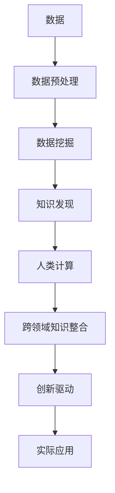

                 

# 推动知识发现与创新：人类计算的智力贡献

> 关键词：知识发现, 人类计算, 数据挖掘, 人工智能, 创新驱动

## 1. 背景介绍

### 1.1 问题由来
随着信息化时代的到来，数据的海量增长和智能技术的迅猛发展，人类面临前所未有的知识挖掘和创新需求。然而，在数据量和复杂度的双重压力下，仅靠人工分析和经验积累已无法满足日益增长的知识发现和创新要求。为此，人工智能领域学者们提出了“人类计算”的概念，即借助计算技术和智能算法，将人类智力和计算能力相结合，以实现更高效的的知识发现和创新。

### 1.2 问题核心关键点
人类计算的核心在于充分利用人类的逻辑思维、创造力和计算技术的自动处理能力，构建一个既有人工智能的逻辑推理能力，又有人类直观体验的智能系统。其关键点包括：
1. 数据的处理和分析。通过算法挖掘和优化，高效地处理海量数据，提取出有用的信息。
2. 知识的表达和存储。将复杂的信息结构化，便于人类的理解和利用。
3. 模型的训练和优化。利用机器学习和深度学习技术，构建可适应新任务的智能模型。
4. 跨领域知识整合。将不同领域的知识进行融合，产生新的知识理解和应用。

### 1.3 问题研究意义
1. 提升知识发现的效率和精度。
2. 促进创新驱动的发展模式。
3. 推动科学研究和技术进步。
4. 助力经济转型和产业发展。
5. 构建智能社会，提升人类生活质量。

## 2. 核心概念与联系

### 2.1 核心概念概述
#### 2.1.1 知识发现
知识发现是指从数据中自动或半自动地发现和提取有用的知识和模式的过程。它涉及数据挖掘、机器学习、统计学等多个领域。

#### 2.1.2 人类计算
人类计算将人类智力与计算技术结合，旨在通过智能算法和计算能力，提升知识发现和创新能力。它强调在自动化处理中融入人类的创造力和直觉。

#### 2.1.3 数据挖掘
数据挖掘是使用统计和人工智能方法，从大规模数据集中提取模式和知识的过程。它包括分类、聚类、关联规则等任务。

#### 2.1.4 人工智能
人工智能（AI）是一种模拟人类智能的技术，包括机器学习、深度学习、自然语言处理等子领域，旨在使计算机系统能够模拟人类的感知、理解和决策能力。

#### 2.1.5 创新驱动
创新驱动是指通过技术创新驱动经济和社会的发展模式。人类计算在知识和技术的结合下，为创新驱动提供强有力的技术支持。

### 2.2 核心概念原理和架构的 Mermaid 流程图



这个流程图展示了大规模数据从原始形式到知识发现，再到跨领域知识整合，最终应用于实际创新的全过程。

## 3. 核心算法原理 & 具体操作步骤
### 3.1 算法原理概述

人类计算的核心算法是知识发现和跨领域知识整合。知识发现包括数据预处理、特征提取、模型训练和评估等多个步骤。下面以机器学习算法中的支持向量机（SVM）为例，详细讲解其算法原理和操作步骤。

### 3.2 算法步骤详解

**Step 1: 数据预处理**
数据预处理是知识发现的首要步骤，主要包括数据清洗、特征选择、归一化等操作。

**Step 2: 特征提取**
通过选择合适的特征提取算法，如PCA、LDA等，将原始数据转换为更具代表性的特征向量，供后续建模使用。

**Step 3: 模型训练**
在预处理和特征提取的基础上，选择合适的机器学习算法，如支持向量机、随机森林等，训练模型并优化参数。

**Step 4: 模型评估**
通过交叉验证等方法，评估模型的性能，选择最优模型。

**Step 5: 知识发现**
将模型应用于实际数据，进行知识发现和模式识别，提取有用的信息。

### 3.3 算法优缺点

#### 3.3.1 优点
1. 高效性：自动化处理和优化，提升了知识发现的效率。
2. 准确性：在大量数据和复杂模型中，可以发现较为精准的知识模式。
3. 可解释性：通过统计学方法和可视化工具，揭示知识发现的过程和结果。

#### 3.3.2 缺点
1. 数据依赖：依赖于数据的质量和数量，对噪声和异常值敏感。
2. 算法限制：受限于特定算法和模型，无法覆盖所有复杂情况。
3. 人类经验缺失：在复杂问题中，缺乏人类直观的判断和直觉。

### 3.4 算法应用领域

人类计算在多个领域都有广泛的应用，例如：

1. 金融分析：利用机器学习算法对金融数据进行分析和预测，提供决策支持。
2. 医疗诊断：利用数据挖掘技术提取医疗记录中的有用信息，辅助医生诊断。
3. 社会网络分析：通过知识发现技术，分析社交网络中的关系和模式。
4. 产品推荐：利用推荐系统算法，根据用户行为和偏好，提供个性化的产品推荐。
5. 市场营销：通过客户行为分析，优化市场营销策略，提升销售效果。
6. 智能制造：通过数据分析和优化，提高生产效率和产品质量。

## 4. 数学模型和公式 & 详细讲解 & 举例说明

### 4.1 数学模型构建
在知识发现过程中，经常需要使用各种数学模型进行表达和计算。以线性回归模型为例，其数学模型为：
$$
y = \beta_0 + \beta_1 x_1 + \beta_2 x_2 + \ldots + \beta_n x_n
$$

其中，$y$ 为预测值，$x_1, x_2, \ldots, x_n$ 为特征变量，$\beta_0, \beta_1, \beta_2, \ldots, \beta_n$ 为模型参数。

### 4.2 公式推导过程

以线性回归模型为例，其最小二乘法的推导如下：
1. 给定数据集 $D=\{(x_i, y_i)\}_{i=1}^n$。
2. 求得模型参数 $\beta = ( \beta_0, \beta_1, \beta_2, \ldots, \beta_n)$。
3. 目标函数为：
$$
\min_{\beta} \sum_{i=1}^n (y_i - \beta_0 - \beta_1 x_{i1} - \beta_2 x_{i2} - \ldots - \beta_n x_{in})^2
$$
4. 对目标函数求导，得到：
$$
\frac{\partial}{\partial \beta} = -2 \sum_{i=1}^n (y_i - \beta_0 - \beta_1 x_{i1} - \beta_2 x_{i2} - \ldots - \beta_n x_{in})
$$
5. 将导数为零，解得：
$$
\beta = (X^TX)^{-1}X^Ty
$$

### 4.3 案例分析与讲解
假设某电商平台拥有大量用户购买记录数据，目标是预测用户的购买概率。通过选择合适的特征（如年龄、性别、购买频率等），构建线性回归模型。训练模型后，可以将其应用于新用户数据，预测其购买概率。

## 5. 项目实践：代码实例和详细解释说明

### 5.1 开发环境搭建

在项目实践中，需要搭建合适的开发环境。这里以Python为例，搭建一个基于Scikit-learn的线性回归模型。

1. 安装Scikit-learn库：
```
pip install scikit-learn
```

2. 准备数据集：
```python
import pandas as pd
data = pd.read_csv('data.csv')
X = data.drop(['y'], axis=1)
y = data['y']
```

3. 分割数据集：
```python
from sklearn.model_selection import train_test_split
X_train, X_test, y_train, y_test = train_test_split(X, y, test_size=0.3, random_state=42)
```

### 5.2 源代码详细实现

下面以线性回归为例，给出完整的代码实现：

```python
import numpy as np
from sklearn.linear_model import LinearRegression

# 数据准备
X = np.array(X_train)
y = np.array(y_train)

# 训练模型
model = LinearRegression()
model.fit(X, y)

# 预测新数据
new_data = np.array([[18, 1, 0.5]])
prediction = model.predict(new_data)
print(prediction)
```

### 5.3 代码解读与分析

**数据预处理**：
- 读取数据集，并将其分为特征和标签。
- 通过`train_test_split`函数将数据集划分为训练集和测试集。

**模型训练**：
- 定义线性回归模型，并使用训练集数据拟合模型。

**预测新数据**：
- 定义新数据，并进行预测。

### 5.4 运行结果展示
模型训练后，可以在测试集上评估预测效果，例如：
```python
from sklearn.metrics import r2_score
score = r2_score(y_test, model.predict(X_test))
print(f"R^2 Score: {score}")
```

## 6. 实际应用场景

### 6.1 金融分析

在金融领域，利用人类计算技术可以分析历史数据，预测市场走势，优化投资策略。例如，通过数据挖掘技术分析金融市场的历史数据，提取重要的市场特征和规律，构建机器学习模型进行预测和分析，帮助投资者做出更加明智的决策。

### 6.2 医疗诊断

在医疗领域，通过数据挖掘技术提取患者的病历数据，构建医疗诊断模型，进行疾病预测和诊断，辅助医生进行精准治疗。例如，通过分析病人的CT图像数据，利用卷积神经网络（CNN）进行疾病识别，提升诊断准确性。

### 6.3 社会网络分析

在社会网络分析领域，通过知识发现技术分析社交网络的数据，提取网络中的关键关系和模式，揭示社会结构。例如，通过分析社交网络中的互动关系，构建社区网络模型，进行用户行为分析和趋势预测。

### 6.4 产品推荐

在产品推荐领域，通过知识发现技术分析用户的购买行为数据，构建推荐系统模型，进行个性化推荐。例如，通过分析用户的浏览记录和购买历史，利用协同过滤算法推荐相关商品，提升用户体验。

### 6.5 市场营销

在市场营销领域，通过数据挖掘技术分析客户行为数据，构建市场分析模型，进行客户分群和市场细分。例如，通过分析客户购买历史和反馈信息，利用聚类算法进行客户分群，进行精准营销。

### 6.6 智能制造

在智能制造领域，通过数据分析和优化技术，提高生产效率和产品质量。例如，通过分析生产过程中的设备数据和操作数据，利用预测模型进行故障预测和维护，提升生产效率。

## 7. 工具和资源推荐

### 7.1 学习资源推荐

#### 7.1.1 书籍推荐
1. 《机器学习实战》（Peter Harrington著）
2. 《深度学习》（Ian Goodfellow著）
3. 《数据挖掘导论》（Jerry Kepner著）
4. 《统计学习方法》（李航著）
5. 《Python数据科学手册》（Jake VanderPlas著）

#### 7.1.2 在线课程推荐
1. Coursera上的《机器学习》（Andrew Ng讲授）
2. edX上的《数据科学基础》（Holger Hulme讲授）
3. Udacity上的《深度学习》（Deeplearning.ai）
4. Kaggle上的各种数据科学和机器学习竞赛

### 7.2 开发工具推荐

#### 7.2.1 Python环境
1. Anaconda：免费提供多种Python环境，安装和管理方便。
2. Jupyter Notebook：免费、开源的交互式编程环境，支持多种编程语言和库。

#### 7.2.2 数据处理工具
1. Pandas：用于数据清洗、处理和分析。
2. NumPy：用于高效的多维数组和矩阵运算。
3. Scikit-learn：用于机器学习和数据挖掘任务。

#### 7.2.3 模型训练工具
1. TensorFlow：由Google开发的深度学习框架，功能强大、支持分布式训练。
2. PyTorch：由Facebook开发的深度学习框架，灵活性高、易于上手。
3. Keras：高级神经网络API，基于TensorFlow或Theano。

#### 7.2.4 数据可视化工具
1. Matplotlib：基于Python的绘图库，功能强大、可定制化高。
2. Seaborn：基于Matplotlib的高级绘图库，适合统计可视化。
3. Plotly：交互式绘图库，支持多种图表类型和动画效果。

### 7.3 相关论文推荐

#### 7.3.1 经典论文
1. 《机器学习》（Tom Mitchell著）
2. 《深度学习》（Ian Goodfellow、Yoshua Bengio和Aaron Courville著）
3. 《数据挖掘：概念与技术》（Jerry Kepner著）
4. 《统计学习方法》（李航著）
5. 《Python数据科学手册》（Jake VanderPlas著）

#### 7.3.2 前沿论文
1. 《注意力机制》（Andrej Karpathy、Kaiming He、Aaron van den Oord和Karen Simonyan著）
2. 《图像生成对抗网络》（Ian Goodfellow、Jean Pouget-Abadie、Meixia Chen、Aaron Courville和Yoshua Bengio著）
3. 《自然语言处理综述》（Yoav Goldberg著）
4. 《序列到序列学习》（Ian Goodfellow、Darcy lithium和Yoshua Bengio著）
5. 《知识图谱与语义搜索》（Elena Tronidou、Patrick Stuckey、Michael J. Ringgaard和Ian A. Murdoch著）

## 8. 总结：未来发展趋势与挑战

### 8.1 研究成果总结

人类计算在多个领域的应用已经取得了显著进展，但仍面临一些挑战。未来，需要进一步提升知识发现的效率和精度，推动跨领域知识的整合和应用。

### 8.2 未来发展趋势

#### 8.2.1 自动化程度提升
未来，人类计算将更加自动化，通过高级算法和智能工具，提升知识发现和创新的效率和精度。

#### 8.2.2 跨领域知识整合
未来，跨领域知识整合将成为关键，通过将不同领域的数据和知识进行融合，产生新的知识和应用。

#### 8.2.3 数据驱动与智能驱动结合
未来，数据驱动与智能驱动相结合，将进一步提升知识发现的深度和广度。

#### 8.2.4 多模态数据的融合
未来，多模态数据的融合将成为趋势，通过将文本、图像、声音等多种数据类型进行综合分析，提升知识发现的全面性和准确性。

#### 8.2.5 智能算法的发展
未来，智能算法的发展将推动知识发现的进步，通过先进的算法和模型，提升知识发现的精度和效率。

### 8.3 面临的挑战

#### 8.3.1 数据质量问题
数据质量不高、噪声和异常值影响知识发现的精度和可靠性。

#### 8.3.2 算法复杂度
算法复杂度高，难以处理大规模、复杂的数据集。

#### 8.3.3 数据隐私和安全
数据隐私和安全问题日益突出，如何保护用户隐私和数据安全成为重要挑战。

#### 8.3.4 模型可解释性
复杂模型的可解释性不足，难以理解其内部的决策逻辑和推理过程。

#### 8.3.5 计算资源限制
大规模数据和复杂算法的计算资源需求高，如何降低计算成本和提高计算效率是重要挑战。

### 8.4 研究展望

未来，人类计算将需要解决上述挑战，提升知识发现的效率和精度，推动跨领域知识的整合和应用，为创新驱动的发展模式提供强有力的技术支持。

## 9. 附录：常见问题与解答

### 9.1 问题1：什么是人类计算？

答：人类计算是将人类智力和计算能力相结合，通过智能算法和计算技术，提升知识发现和创新的过程。

### 9.2 问题2：人类计算与人工智能有什么区别？

答：人工智能是一种模拟人类智能的技术，侧重于机器学习和深度学习；而人类计算是将人类智力和计算能力相结合，更加注重跨领域知识的整合和应用。

### 9.3 问题3：人类计算的核心算法有哪些？

答：人类计算的核心算法包括数据挖掘、机器学习、深度学习、知识图谱等，通过这些算法处理和分析大规模数据，提取有用的知识和模式。

### 9.4 问题4：人类计算的实际应用有哪些？

答：人类计算在金融分析、医疗诊断、社会网络分析、产品推荐、市场营销、智能制造等多个领域都有广泛应用。

### 9.5 问题5：人类计算的挑战有哪些？

答：数据质量问题、算法复杂度、数据隐私和安全、模型可解释性、计算资源限制等问题，都是人类计算面临的主要挑战。

---

作者：禅与计算机程序设计艺术 / Zen and the Art of Computer Programming

