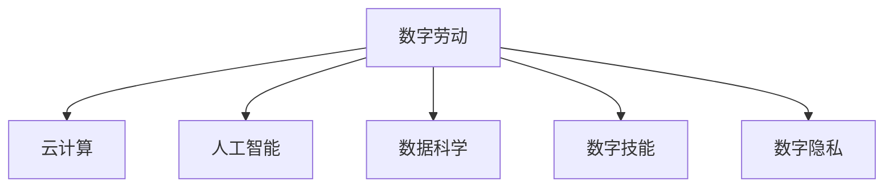

                 

# 数字劳动：人类计算的社会和经济影响

在当今数字化时代，数字劳动成为驱动经济发展的重要力量。作为人类计算的高级形态，数字劳动涵盖了从编程、数据分析到内容创作等各个方面。它不仅是技术发展的产物，更是社会经济结构深刻变革的推手。本文将深入探讨数字劳动的概念、原理及其对社会经济的影响，为理解这一新兴劳动形式提供框架和视角。

## 1. 背景介绍

### 1.1 问题由来
随着信息技术的迅猛发展，人类的计算模式经历了从机械化到自动化再到智能化的过程。在机械化计算时代，计算工作主要由机器完成，人类仅需监督和维护。随着自动化计算的普及，机器开始承担更复杂的计算任务，人类主要负责数据分析和策略规划。进入智能化计算时代，计算机不仅能进行复杂的数据处理，还能自主学习和决策，显著提升了计算效率。

然而，智能化计算的普及也带来了新的挑战。如何在这一进程中平衡技术发展与人的福祉，成为亟待解决的问题。数字劳动的概念应运而生，旨在揭示人类在计算过程中的角色和价值，为智能时代的劳动伦理提供指引。

### 1.2 问题核心关键点
数字劳动的核心关键点在于其对人类计算方式的根本变革。它不仅改变了劳动的形式，也重塑了劳动的社会经济结构。其影响包括：
1. **劳动形式的演变**：从体力劳动转向脑力劳动，需要更高级的计算技能和知识。
2. **劳动组织的变革**：从集中到分散，劳动越来越灵活化和个性化。
3. **劳动价值的重估**：知识和技术成为新的劳动要素，对经济结构和社会关系产生深远影响。

## 2. 核心概念与联系

### 2.1 核心概念概述

为更好地理解数字劳动，本节将介绍几个密切相关的核心概念：

- **数字劳动**：指在数字技术和信息化环境下，人类从事的计算和信息处理活动。它涵盖了从编程、数据分析到内容创作等各个方面。

- **云计算**：指将计算资源通过互联网提供给用户，用户按需使用，按量付费的计算模式。云计算大大降低了计算成本，提高了计算效率。

- **人工智能**：指通过算法和数据训练，使计算机具备人类智能的计算模式。人工智能在数据处理、决策支持等方面展现出巨大潜力。

- **数据科学**：指运用统计学、计算技术和人工智能方法，从数据中提取知识和洞见的科学。数据科学已成为新时代的重要劳动形式。

- **数字技能**：指在数字化背景下，人类从事数字劳动所需具备的技能，包括编程、数据分析、机器学习等。

- **数字隐私**：指在数字化环境下，个人数据被收集、存储和分析时所面临的隐私保护问题。

这些核心概念之间的逻辑关系可以通过以下Mermaid流程图来展示：



这个流程图展示了大规模计算与人类劳动方式的演进过程：

1. 数字劳动依托于云计算平台，通过人工智能和数据科学方法，获得强大的计算能力。
2. 数字劳动所需的技能和隐私保护成为关键点，对劳动的性质和价值产生深远影响。

## 3. 核心算法原理 & 具体操作步骤

### 3.1 算法原理概述

数字劳动的计算过程可以分为数据收集、预处理、模型训练和应用部署等几个步骤。其核心算法包括：

- **数据收集**：通过爬虫、API接口等方式，从互联网、社交媒体等渠道获取数据。
- **预处理**：对原始数据进行清洗、归一化、特征提取等处理，为后续建模做准备。
- **模型训练**：选择适合的算法和模型，利用处理好的数据进行训练，优化模型参数。
- **应用部署**：将训练好的模型部署到生产环境中，实现实际应用。

### 3.2 算法步骤详解

以下是数字劳动中数据预处理和模型训练的具体操作步骤：

**数据预处理**：
1. **数据清洗**：去除噪音、重复、不完整的数据，确保数据质量。
2. **数据归一化**：将不同来源的数据进行标准化，便于模型处理。
3. **特征提取**：从数据中提取有意义的特征，如文本中的关键词、时间序列中的趋势等。
4. **数据增强**：通过数据扩充、合成等方式，增加训练数据量，提升模型泛化能力。

**模型训练**：
1. **选择模型**：根据任务性质选择合适的模型，如线性回归、决策树、深度学习等。
2. **划分数据集**：将数据分为训练集、验证集和测试集，用于模型训练、调优和评估。
3. **模型训练**：利用训练集对模型进行迭代优化，最小化损失函数。
4. **模型评估**：在验证集上评估模型性能，调整超参数，避免过拟合。
5. **模型部署**：将训练好的模型部署到生产环境，实现实际应用。

### 3.3 算法优缺点

数字劳动在提高计算效率、优化决策支持等方面具有显著优势，但也存在一些局限：

**优点**：
1. **高效性**：通过云计算和大规模计算，显著提高了数据处理和模型训练的效率。
2. **灵活性**：数字劳动形式多样，可以适应不同任务和场景的需求。
3. **泛化能力**：训练好的模型具备较强的泛化能力，可以在新场景中快速应用。

**缺点**：
1. **依赖数据**：数字劳动高度依赖数据质量，数据偏差可能导致模型错误。
2. **隐私风险**：数据收集和存储过程中，个人隐私面临泄露风险。
3. **算法黑箱**：复杂的模型难以解释，缺乏透明度和可解释性。
4. **技能要求高**：数字劳动需要掌握复杂的计算技能和知识，门槛较高。

### 3.4 算法应用领域

数字劳动在各个领域都有广泛应用，以下是几个典型场景：

- **金融科技**：利用数据分析和机器学习，进行风险评估、投资决策、欺诈检测等。
- **医疗健康**：通过电子病历、基因数据等，进行疾病预测、个性化治疗、药物研发等。
- **智能制造**：运用物联网、云计算、大数据等技术，实现生产过程的智能化、自动化。
- **智慧城市**：利用城市数据，进行交通管理、公共安全、环境监测等。
- **内容创作**：通过人工智能和数据科学，生成新闻、广告、推荐内容等。

这些应用领域展示了数字劳动的广泛影响，推动了各行各业的数字化转型。

## 4. 数学模型和公式 & 详细讲解 & 举例说明

### 4.1 数学模型构建

数字劳动的计算过程通常涉及大量数据和复杂算法，以下以线性回归模型为例，展示数学模型的构建过程。

设数据集为 $(x_i, y_i), i=1,...,N$，其中 $x_i$ 为自变量，$y_i$ 为因变量。假设模型为线性函数：

$$
y_i = \theta_0 + \theta_1 x_i + \epsilon_i
$$

其中 $\theta_0, \theta_1$ 为模型参数，$\epsilon_i$ 为误差项。

目标是最小化残差平方和，即：

$$
\hat{\theta} = \mathop{\arg\min}_{\theta} \sum_{i=1}^N (y_i - \hat{y}_i)^2
$$

### 4.2 公式推导过程

线性回归模型的最小二乘法解为：

$$
\hat{\theta} = \left( \frac{1}{N} \sum_{i=1}^N x_i x_i + \sum_{i=1}^N \frac{x_i y_i}{N} \right)^{-1} \left( \sum_{i=1}^N x_i y_i - \sum_{i=1}^N x_i \frac{1}{N} \sum_{i=1}^N y_i \right)
$$

### 4.3 案例分析与讲解

考虑房价预测问题，设 $x$ 为房屋面积，$y$ 为房价，使用上述公式计算线性回归模型的参数 $\hat{\theta}$。

首先收集历史房价数据，进行数据清洗和特征提取。然后利用训练集对模型进行训练，得到参数 $\hat{\theta}$。最后使用测试集对模型进行评估，计算预测误差。

## 5. 项目实践：代码实例和详细解释说明

### 5.1 开发环境搭建

在进行数字劳动的实践时，我们需要准备好开发环境。以下是使用Python进行Scikit-learn开发的环境配置流程：

1. 安装Anaconda：从官网下载并安装Anaconda，用于创建独立的Python环境。

2. 创建并激活虚拟环境：
```bash
conda create -n sklearn-env python=3.8 
conda activate sklearn-env
```

3. 安装Scikit-learn：
```bash
conda install scikit-learn
```

4. 安装各类工具包：
```bash
pip install numpy pandas matplotlib seaborn jupyter notebook ipython
```

完成上述步骤后，即可在`sklearn-env`环境中开始数字劳动的实践。

### 5.2 源代码详细实现

下面我们以房价预测问题为例，给出使用Scikit-learn进行线性回归模型的Python代码实现。

首先，定义数据集：

```python
import pandas as pd
from sklearn.model_selection import train_test_split
from sklearn.linear_model import LinearRegression

# 读取房价数据集
data = pd.read_csv('house_prices.csv')

# 定义自变量和因变量
X = data[['area']]
y = data['price']

# 划分训练集和测试集
X_train, X_test, y_train, y_test = train_test_split(X, y, test_size=0.2, random_state=42)
```

然后，定义模型并进行训练：

```python
# 创建线性回归模型
model = LinearRegression()

# 拟合模型
model.fit(X_train, y_train)
```

最后，进行模型评估：

```python
# 计算测试集上的均方误差
mse = mean_squared_error(y_test, model.predict(X_test))

# 输出结果
print(f"Mean Squared Error: {mse:.2f}")
```

以上代码展示了使用Scikit-learn进行线性回归模型训练和评估的完整流程。

### 5.3 代码解读与分析

让我们再详细解读一下关键代码的实现细节：

**数据读取和处理**：
- `pandas`库用于读取和处理数据，方便数据的清洗和转换。
- `train_test_split`函数用于将数据集划分为训练集和测试集，便于模型训练和评估。

**模型定义与训练**：
- `LinearRegression`类用于定义线性回归模型。
- `fit`方法用于训练模型，最小化残差平方和。

**模型评估**：
- `mean_squared_error`函数用于计算均方误差，评估模型性能。

通过以上代码的解读，可以看到，Scikit-learn库提供了简单易用的接口，可以快速构建和训练各种机器学习模型。

## 6. 实际应用场景

### 6.1 金融科技

数字劳动在金融科技领域的应用极为广泛。通过数据分析和机器学习，金融机构可以高效处理大量金融数据，进行风险评估、投资决策、欺诈检测等。例如，利用线性回归模型对信用评分进行预测，评估客户的信用风险，从而决定贷款审批和额度。这种基于数据的决策模式，提高了金融机构的效率和精准度，减少了人为操作和风险。

### 6.2 医疗健康

在医疗健康领域，数字劳动同样发挥了重要作用。通过电子病历、基因数据等，医生和研究人员可以更好地理解疾病规律，进行疾病预测、个性化治疗、药物研发等。例如，利用深度学习模型对患者影像数据进行分析，辅助医生进行疾病诊断和治疗。这种基于数据的诊断模式，提高了医疗服务的质量和效率，改善了患者的健康状况。

### 6.3 智能制造

智能制造是数字劳动在工业领域的重要应用之一。通过物联网、云计算、大数据等技术，生产过程实现了智能化、自动化。例如，利用传感器和数据采集设备，实时监测生产设备的运行状态，通过预测性维护，减少故障停机时间，提升生产效率。这种基于数据的生产模式，提高了制造企业的竞争力，促进了产业升级。

### 6.4 未来应用展望

随着数字劳动技术的发展，未来的应用场景将更加广泛和深入。可以预见，数字劳动将在以下几个方面发挥重要作用：

- **智慧城市**：利用城市数据，进行交通管理、公共安全、环境监测等，提升城市管理水平，改善居民生活质量。
- **内容创作**：通过人工智能和数据科学，生成新闻、广告、推荐内容等，丰富文化娱乐，促进信息传播。
- **教育培训**：利用数据分析和个性化推荐，提供定制化的学习资源和教学方案，提高教育效果和效率。
- **环境保护**：利用传感器和大数据分析，进行环境监测和预测，制定科学合理的环保政策，改善环境质量。

这些应用场景展示了数字劳动的巨大潜力，推动了各行业的数字化转型和智能化升级。

## 7. 工具和资源推荐

### 7.1 学习资源推荐

为了帮助开发者系统掌握数字劳动的理论基础和实践技巧，这里推荐一些优质的学习资源：

1. **《Python数据科学手册》**：介绍Python在数据科学中的应用，涵盖数据处理、机器学习、数据可视化等内容。
2. **《深度学习》**：斯坦福大学吴恩达教授主讲的深度学习课程，详细讲解深度学习原理和应用。
3. **Kaggle平台**：提供大量公开数据集和竞赛任务，帮助开发者实践和提升数据处理和机器学习技能。
4. **GitHub开源项目**：汇集全球开发者贡献的开源项目，提供了丰富的代码和工具支持。
5. **Coursera平台**：提供多种计算机科学和数据科学的课程，帮助开发者学习前沿技术和理论。

通过学习这些资源，相信你一定能够快速掌握数字劳动的理论基础和实践技巧。

### 7.2 开发工具推荐

高效的开发离不开优秀的工具支持。以下是几款用于数字劳动开发的常用工具：

1. **Python**：作为目前最流行的编程语言之一，Python在数据科学和机器学习领域具有广泛应用。
2. **R语言**：擅长数据统计和可视化，是数据科学中不可或缺的工具。
3. **Scikit-learn**：开源的Python机器学习库，提供了多种机器学习算法和工具。
4. **TensorFlow**：谷歌开源的深度学习框架，支持分布式计算和GPU加速。
5. **PyTorch**：Facebook开源的深度学习框架，易于使用，支持动态计算图。
6. **Jupyter Notebook**：基于Web的交互式开发环境，支持Python、R等多种语言，方便代码编写和调试。

合理利用这些工具，可以显著提升数字劳动任务的开发效率，加快创新迭代的步伐。

### 7.3 相关论文推荐

数字劳动和数据科学的发展得益于学界的持续研究。以下是几篇奠基性的相关论文，推荐阅读：

1. **《大数据时代：管理决策与商业智能》**：详细讨论了大数据在商业决策中的应用，展示了数据科学的重要价值。
2. **《深度学习》**：吴恩达教授和Andrew Ng合著的深度学习经典教材，全面介绍了深度学习原理和应用。
3. **《算法导论》**：由Thomas H. Cormen等人合著的计算机科学经典教材，详细讲解了算法设计和分析。
4. **《机器学习实战》**：Peter Harrington所著的实用机器学习教程，通过代码实例讲解了机器学习算法和应用。

这些论文代表了大规模计算与人类劳动方式的演进过程：

1. 数字劳动依托于云计算平台，通过人工智能和数据科学方法，获得强大的计算能力。
2. 数字劳动所需的技能和隐私保护成为关键点，对劳动的性质和价值产生深远影响。

## 8. 总结：未来发展趋势与挑战

### 8.1 总结

本文对数字劳动的概念、原理及其对社会经济的影响进行了全面系统的介绍。首先阐述了数字劳动的定义和核心概念，揭示了其在计算劳动方式演进中的重要作用。其次，从原理到实践，详细讲解了数字劳动的数学模型和实现步骤，提供了完整的代码实例。同时，本文还广泛探讨了数字劳动在金融科技、医疗健康、智能制造等多个行业领域的应用前景，展示了数字劳动的巨大潜力。此外，本文精选了数字劳动技术的各类学习资源，力求为读者提供全方位的技术指引。

通过本文的系统梳理，可以看到，数字劳动作为新兴的劳动形式，正在深刻改变人类的计算方式和劳动结构。它不仅提高了计算效率，也带来了新的社会经济关系。未来，随着技术的不断进步，数字劳动将在更多领域得到应用，为社会经济发展注入新的动力。

### 8.2 未来发展趋势

展望未来，数字劳动将呈现以下几个发展趋势：

1. **计算能力提升**：随着计算技术的进步，数字劳动的计算能力将进一步提升，能够处理更大规模、更复杂的数据。
2. **自动化程度提高**：通过人工智能和自动化技术，数字劳动将逐步实现全自动化，减少人为操作，提高效率和准确性。
3. **跨学科融合**：数字劳动将与其他学科如心理学、社会学等进行更深入的融合，形成新的交叉学科。
4. **伦理与安全重视**：数字劳动的发展将更加注重伦理与安全问题，确保数据的隐私保护和公平使用。
5. **全球化应用**：数字劳动的应用将突破地域限制，在全球范围内实现资源的共享与协同。

以上趋势凸显了数字劳动的广阔前景。这些方向的探索发展，必将进一步提升数字劳动的计算效率和应用范围，为社会经济发展提供新的动力。

### 8.3 面临的挑战

尽管数字劳动在提高计算效率、优化决策支持等方面具有显著优势，但在迈向更加智能化、普适化应用的过程中，它仍面临诸多挑战：

1. **数据质量问题**：数字劳动高度依赖数据质量，数据偏差可能导致模型错误。
2. **隐私保护问题**：数据收集和存储过程中，个人隐私面临泄露风险。
3. **模型透明性不足**：复杂的模型难以解释，缺乏透明度和可解释性。
4. **技能要求高**：数字劳动需要掌握复杂的计算技能和知识，门槛较高。
5. **伦理与安全问题**：数字劳动的发展将更加注重伦理与安全问题，确保数据的隐私保护和公平使用。

这些挑战需要技术界和产业界共同努力，才能实现数字劳动的可持续发展。

### 8.4 研究展望

面对数字劳动所面临的种种挑战，未来的研究需要在以下几个方面寻求新的突破：

1. **数据质量提升**：开发更高效的数据清洗和预处理算法，提升数据质量，降低模型误差。
2. **隐私保护技术**：研究数据加密和匿名化技术，确保数据在传输和存储过程中的安全。
3. **模型透明性提升**：开发更可解释的模型，增强模型的透明性和可解释性。
4. **技能教育普及**：推广数字劳动技能的教育培训，降低数字劳动的门槛，提高人才供给。
5. **伦理与安全研究**：深入研究数字劳动的伦理与安全问题，制定相关规范和标准。

这些研究方向将推动数字劳动技术的持续进步，为构建安全、可靠、可解释、可控的智能系统铺平道路。

## 9. 附录：常见问题与解答

**Q1: 数字劳动与传统劳动的区别是什么？**

A: 数字劳动与传统劳动的主要区别在于计算和信息处理的角色不同。传统劳动主要以体力劳动为主，而数字劳动则以脑力劳动为主，强调计算和信息处理能力。数字劳动能够处理复杂的数据和算法，而传统劳动通常只能进行简单的重复性操作。

**Q2: 数字劳动的计算能力提升有哪些方式？**

A: 数字劳动的计算能力提升主要依赖以下几个方面：
1. **计算硬件升级**：随着CPU、GPU、FPGA等计算硬件的不断进步，数字劳动的计算能力将大幅提升。
2. **分布式计算**：通过云计算、大数据等技术，实现多节点、多任务的分布式计算，提升计算效率。
3. **算法优化**：不断优化和改进算法，提升算法的执行速度和精度。

**Q3: 数字劳动的应用前景有哪些？**

A: 数字劳动的应用前景非常广泛，涵盖金融科技、医疗健康、智能制造等多个领域。未来，数字劳动将在智慧城市、内容创作、教育培训、环境保护等领域发挥重要作用，推动各行业的数字化转型和智能化升级。

**Q4: 数字劳动对社会经济的影响有哪些？**

A: 数字劳动对社会经济的影响主要体现在以下几个方面：
1. **生产效率提升**：数字劳动提高了生产过程的自动化水平，减少了人工操作和错误，提高了生产效率。
2. **服务质量改善**：通过数据分析和机器学习，提升服务质量和客户体验，推动服务产业的升级。
3. **就业结构变化**：数字劳动的普及将改变就业结构，增加对数字技能人才的需求，同时可能导致部分传统劳动岗位的消失。
4. **经济结构调整**：数字劳动推动了数字经济的发展，促使经济结构向服务化和智能化方向调整。

通过以上问题的回答，希望读者能够对数字劳动的概念、原理及其对社会经济的影响有更全面的认识，为未来的数字化转型做好准备。

---

作者：禅与计算机程序设计艺术 / Zen and the Art of Computer Programming

