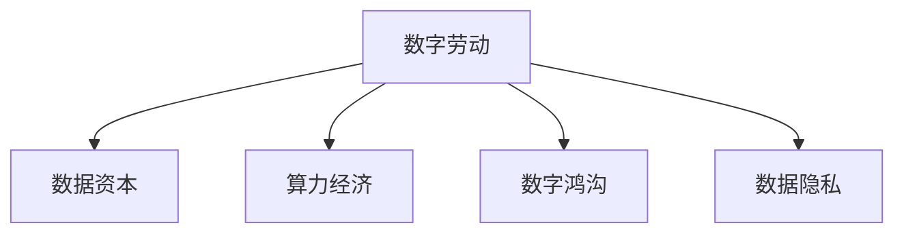

                 

# 数字劳动：人类计算的社会和经济影响

## 1. 背景介绍

### 1.1 问题由来
随着信息技术的发展，计算资源正以前所未有的速度普及和扩展。从个人计算机到数据中心，从云计算到边缘计算，计算力正成为现代社会的重要基础设施。然而，这种计算力的普及和扩展也带来了一系列社会和经济问题。数字劳动，即利用计算机资源进行计算、分析和决策的行为，逐渐成为现代社会的重要组成部分。

### 1.2 问题核心关键点
数字劳动的核心在于利用计算机资源进行各种计算任务，包括数据处理、算法优化、模型训练等。这种劳动形式的特点是高度依赖于计算机资源，能够大规模、高效地处理复杂的数据和任务。数字劳动的影响广泛且深远，涉及到经济、社会、政治等多个领域。

### 1.3 问题研究意义
研究数字劳动的社会和经济影响，对于理解现代社会的发展趋势，优化计算资源的利用，提高经济和社会的整体效益具有重要意义。通过深入研究数字劳动，可以探索如何更好地利用计算资源，推动经济和社会的可持续发展，提高公民的生活质量。

## 2. 核心概念与联系

### 2.1 核心概念概述

为更好地理解数字劳动的社会和经济影响，本节将介绍几个密切相关的核心概念：

- 数字劳动(Digital Labor)：指利用计算机资源进行的各种计算任务，包括数据处理、算法优化、模型训练等。数字劳动具有高度自动化、规模化和高效化的特点。

- 数据资本(Capital of Data)：指用于数字劳动的数据资源，包括大数据、云计算等。数据资本的获取和利用是数字劳动的重要基础。

- 算力经济(Computational Economy)：指利用计算资源进行各种经济活动，如金融计算、供应链管理、智能制造等。算力经济推动了经济活动的数字化转型。

- 数字鸿沟(Digital Divide)：指不同地区、不同群体在获取和使用数字劳动资源方面的差距。数字鸿沟影响着社会的公平性和包容性。

- 数据隐私(Data Privacy)：指数据资源在使用过程中的保护措施。数据隐私保护是数字劳动中需要关注的重要问题。

这些核心概念之间的逻辑关系可以通过以下Mermaid流程图来展示：



这个流程图展示了几大核心概念及其之间的关系：

1. 数字劳动依赖于数据资本和算力资源。
2. 数字劳动推动了算力经济的发展，带来了经济活动的数字化转型。
3. 数字劳动可能加剧数字鸿沟，影响社会的公平性和包容性。
4. 数据隐私保护是数字劳动中需要重点关注的问题。

这些概念共同构成了数字劳动的研究框架，为我们理解数字劳动的社会和经济影响提供了重要视角。

## 3. 核心算法原理 & 具体操作步骤
### 3.1 算法原理概述

数字劳动的核心在于利用计算资源进行各种计算任务。其算法原理通常包括数据预处理、特征工程、模型训练和评估等步骤。这些步骤通过计算机程序的自动执行，实现了高度自动化和规模化的计算过程。

- 数据预处理：包括数据清洗、数据标准化、特征提取等，确保输入数据的质量和一致性。
- 特征工程：根据任务需求，设计和提取对模型有帮助的特征。
- 模型训练：选择合适的算法和模型，在数据集上进行训练，优化模型参数。
- 模型评估：使用评估指标（如准确率、召回率、F1-score等）对模型进行评估，确保模型性能。

### 3.2 算法步骤详解

数字劳动的具体操作步骤如下：

1. **数据准备**：收集和清洗用于数字劳动的数据，包括原始数据、标签和元数据。数据准备是数字劳动的第一步，对后续计算任务的成功至关重要。

2. **模型选择**：根据任务类型选择合适的算法和模型。如回归问题通常使用线性回归、决策树等算法；分类问题通常使用SVM、随机森林等算法。

3. **特征选择和提取**：根据任务需求，从原始数据中提取有意义的特征。特征选择和提取的目的是提高模型的准确性和泛化能力。

4. **模型训练**：将准备好的数据输入模型进行训练，优化模型参数。训练过程可以使用各种优化算法，如梯度下降、Adam等。

5. **模型评估**：使用评估指标对训练好的模型进行评估，确保其满足任务需求。评估指标的选择应与任务类型和应用场景相匹配。

6. **模型部署**：将训练好的模型部署到实际应用场景中，进行生产使用。部署过程需要考虑计算资源的优化和系统性能的保证。

7. **模型监控和维护**：持续监控模型的性能，根据实际情况进行调整和优化。维护过程包括数据更新、模型迭代和异常处理等。

### 3.3 算法优缺点

数字劳动的优势在于其高度自动化和规模化，能够高效处理大规模数据和复杂任务。然而，数字劳动也存在一些缺点：

1. **依赖性强**：数字劳动高度依赖于计算机资源，对硬件设备和网络环境有较高的要求。
2. **数据依赖性**：数字劳动的效果很大程度上依赖于数据的质量和数量，数据获取和处理成本较高。
3. **算法复杂性**：复杂的算法和模型需要较强的专业知识，普通用户难以理解和操作。
4. **隐私风险**：数字劳动过程中涉及大量数据，数据隐私和安全问题不容忽视。
5. **公平性问题**：数字劳动可能加剧数字鸿沟，不同群体在获取和使用数字劳动资源方面存在差距。

尽管存在这些缺点，数字劳动仍因其高效、规模化的特点，在现代社会中得到了广泛应用。未来，需要在优化计算资源利用、保障数据隐私和公平性等方面进一步研究，以充分发挥数字劳动的优势。

### 3.4 算法应用领域

数字劳动的应用领域广泛，涵盖经济、社会、科技等多个领域：

- 金融计算：包括风险管理、金融分析、投资决策等。利用数字劳动可以高效处理海量金融数据，提高金融决策的准确性和效率。
- 医疗计算：包括疾病诊断、药物研发、健康管理等。数字劳动可以处理复杂的医疗数据，辅助医生进行精准诊断和治疗。
- 智能制造：包括供应链管理、生产调度、质量控制等。数字劳动可以优化生产流程，提高制造效率和质量。
- 社交网络：包括用户行为分析、内容推荐、广告投放等。数字劳动可以分析海量用户数据，提高社交网络平台的个性化服务和用户体验。
- 环境保护：包括环境监测、污染治理、资源管理等。数字劳动可以处理环境数据，为环境保护提供科学决策支持。

这些应用领域展示了数字劳动在推动社会进步和经济发展方面的重要作用。随着数字劳动技术的不断发展，其在更多领域的应用前景将更加广阔。

## 4. 数学模型和公式 & 详细讲解 & 举例说明
### 4.1 数学模型构建

本节将使用数学语言对数字劳动的算法原理进行更加严格的刻画。

假设数字劳动任务为分类问题，给定训练数据集 $D=\{(x_i,y_i)\}_{i=1}^N$，其中 $x_i$ 为输入特征，$y_i$ 为输出标签。假设选择的模型为线性回归模型，其形式为：

$$
\hat{y} = \theta_0 + \theta_1x_1 + \theta_2x_2 + \cdots + \theta_nx_n
$$

其中 $\theta_0, \theta_1, \theta_2, \cdots, \theta_n$ 为模型参数。

定义模型在训练数据集上的损失函数为均方误差损失函数：

$$
\mathcal{L}(\theta) = \frac{1}{N}\sum_{i=1}^N (y_i - \hat{y}_i)^2
$$

其中 $\hat{y}_i = \theta_0 + \theta_1x_{i1} + \theta_2x_{i2} + \cdots + \theta_nx_{in}$。

最小化损失函数即为数字劳动模型的训练过程。在实践中，我们通常使用梯度下降等优化算法来求解上述最优化问题。设 $\eta$ 为学习率，则参数的更新公式为：

$$
\theta_k \leftarrow \theta_k - \eta \frac{\partial \mathcal{L}(\theta)}{\partial \theta_k}
$$

其中 $\frac{\partial \mathcal{L}(\theta)}{\partial \theta_k}$ 为损失函数对参数 $\theta_k$ 的梯度，可通过反向传播算法高效计算。

### 4.2 公式推导过程

以下我们以二分类任务为例，推导均方误差损失函数的梯度计算公式。

假设模型在输入 $x$ 上的输出为 $\hat{y}=M_{\theta}(x)$，表示样本属于正类的概率。真实标签 $y \in \{0,1\}$。则均方误差损失函数定义为：

$$
\mathcal{L}(\theta) = \frac{1}{N}\sum_{i=1}^N (y_i - \hat{y}_i)^2
$$

根据链式法则，损失函数对参数 $\theta_k$ 的梯度为：

$$
\frac{\partial \mathcal{L}(\theta)}{\partial \theta_k} = -2\frac{1}{N}\sum_{i=1}^N (y_i - \hat{y}_i)x_{ik}
$$

其中 $x_{ik}$ 为输入 $x_i$ 的第 $k$ 个特征。

在得到损失函数的梯度后，即可带入参数更新公式，完成模型的迭代优化。重复上述过程直至收敛，最终得到适应训练数据集的最优模型参数 $\theta^*$。

### 4.3 案例分析与讲解

以二分类任务为例，假设训练数据集 $D=\{(x_i,y_i)\}_{i=1}^5$，其中 $x_i$ 为输入特征，$y_i$ 为输出标签。模型 $M_{\theta}$ 在输入 $x$ 上的输出为 $\hat{y}=M_{\theta}(x)$，表示样本属于正类的概率。真实标签 $y \in \{0,1\}$。则均方误差损失函数定义为：

$$
\mathcal{L}(\theta) = \frac{1}{5}\sum_{i=1}^5 (y_i - \hat{y}_i)^2
$$

假设模型参数 $\theta_k$ 的初始值为 $k=1$。则损失函数的梯度为：

$$
\frac{\partial \mathcal{L}(\theta)}{\partial \theta_1} = -2\frac{1}{5}\sum_{i=1}^5 (y_i - \hat{y}_i)x_{i1}
$$

通过反向传播算法计算梯度，即可带入参数更新公式，完成模型的迭代优化。重复上述过程直至收敛，最终得到适应训练数据集的最优模型参数 $\theta^*$。

## 5. 项目实践：代码实例和详细解释说明
### 5.1 开发环境搭建

在进行数字劳动实践前，我们需要准备好开发环境。以下是使用Python进行Scikit-Learn开发的环境配置流程：

1. 安装Anaconda：从官网下载并安装Anaconda，用于创建独立的Python环境。

2. 创建并激活虚拟环境：
```bash
conda create -n sklearn-env python=3.8 
conda activate sklearn-env
```

3. 安装Scikit-Learn：从官网获取对应的安装命令，例如：
```bash
pip install scikit-learn
```

4. 安装各类工具包：
```bash
pip install numpy pandas scikit-learn matplotlib tqdm jupyter notebook ipython
```

完成上述步骤后，即可在`sklearn-env`环境中开始数字劳动实践。

### 5.2 源代码详细实现

下面我们以线性回归任务为例，给出使用Scikit-Learn进行数字劳动的Python代码实现。

首先，定义数据集：

```python
from sklearn.datasets import make_regression
from sklearn.model_selection import train_test_split

X, y = make_regression(n_samples=100, n_features=2, noise=0.1)
X_train, X_test, y_train, y_test = train_test_split(X, y, test_size=0.2, random_state=42)
```

然后，定义模型和优化器：

```python
from sklearn.linear_model import LinearRegression
from sklearn.metrics import mean_squared_error
from sklearn.model_selection import cross_val_score

model = LinearRegression()
```

接着，定义训练和评估函数：

```python
def train_model(model, X_train, y_train, X_test, y_test):
    model.fit(X_train, y_train)
    y_pred = model.predict(X_test)
    mse = mean_squared_error(y_test, y_pred)
    return mse

def evaluate_model(model, X_train, y_train, X_test, y_test):
    mse = mean_squared_error(y_test, model.predict(X_test))
    print("Mean Squared Error: {:.4f}".format(mse))
```

最后，启动训练流程并在测试集上评估：

```python
epochs = 100
learning_rate = 0.001

for epoch in range(epochs):
    mse = train_model(model, X_train, y_train, X_test, y_test)
    evaluate_model(model, X_train, y_train, X_test, y_test)
```

以上就是使用Scikit-Learn进行线性回归任务数字劳动的完整代码实现。可以看到，Scikit-Learn提供了简单易用的接口，可以轻松进行线性回归模型的训练和评估。

### 5.3 代码解读与分析

让我们再详细解读一下关键代码的实现细节：

**make_regression函数**：
- 生成一个具有指定特征数和样本数的随机回归数据集。

**train_test_split函数**：
- 将数据集划分为训练集和测试集，设定随机种子为42。

**LinearRegression模型**：
- 定义线性回归模型，使用Scikit-Learn自带的实现。

**train_model函数**：
- 训练模型，使用均方误差作为损失函数，计算并返回测试集上的均方误差。

**evaluate_model函数**：
- 评估模型性能，输出均方误差。

**训练流程**：
- 设置迭代轮数和初始学习率，循环迭代
- 在每个epoch内，先训练模型，再评估模型性能
- 打印输出均方误差

可以看到，Scikit-Learn提供了方便易用的接口，使得数字劳动任务的实现变得简洁高效。开发者可以将更多精力放在数据处理、模型改进等高层逻辑上，而不必过多关注底层的实现细节。

当然，工业级的系统实现还需考虑更多因素，如模型的保存和部署、超参数的自动搜索、更灵活的任务适配层等。但核心的数字劳动流程基本与此类似。

## 6. 实际应用场景
### 6.1 智能制造

数字劳动在智能制造领域的应用非常广泛。传统制造流程依赖人工操作和经验积累，效率低、成本高、质量不稳定。通过数字劳动，可以实现制造流程的自动化、智能化和精细化管理，大幅提升生产效率和产品质量。

具体而言，可以将历史生产数据和工人操作数据输入数字劳动平台，进行数据分析和建模。平台通过训练机器学习模型，可以实现生产过程的预测和优化，例如：

- 预测生产线的运行状态，提前进行故障预警和维护。
- 优化生产流程，提高生产效率和资源利用率。
- 提升产品质量，降低次品率。

通过数字劳动，智能制造可以实现生产过程的精细化和智能化管理，推动制造业的数字化转型。

### 6.2 医疗健康

数字劳动在医疗健康领域的应用同样广泛。医疗行业数据量大、复杂度高，传统医疗决策依赖医生经验和人工处理，效率低、精度不高。通过数字劳动，可以实现医疗数据的自动分析和处理，辅助医生进行精准诊断和治疗。

具体而言，可以将历史医疗数据和医生诊断结果输入数字劳动平台，进行数据分析和建模。平台通过训练机器学习模型，可以实现医疗数据的自动分析和处理，例如：

- 预测疾病的发生和发展趋势，提前进行干预和治疗。
- 辅助医生进行疾病诊断和病情评估，提高诊断精度。
- 优化药物配方和剂量，提高治疗效果。

通过数字劳动，医疗行业可以实现医疗数据的自动分析和处理，提高医疗决策的精度和效率，推动医疗健康行业的数字化转型。

### 6.3 金融服务

数字劳动在金融服务领域的应用也非常广泛。金融行业数据量大、处理复杂，传统金融决策依赖人工操作和经验积累，效率低、风险高。通过数字劳动，可以实现金融数据的自动分析和处理，辅助金融决策和风险管理。

具体而言，可以将历史金融数据和交易记录输入数字劳动平台，进行数据分析和建模。平台通过训练机器学习模型，可以实现金融数据的自动分析和处理，例如：

- 预测股票和商品价格走势，进行投资决策。
- 识别异常交易行为，防范金融风险。
- 优化投资组合，提高投资回报率。

通过数字劳动，金融行业可以实现金融数据的自动分析和处理，提高金融决策的精度和效率，推动金融行业的数字化转型。

### 6.4 未来应用展望

随着数字劳动技术的不断发展，其在更多领域的应用前景将更加广阔。

在智慧城市治理中，数字劳动可以用于城市事件监测、舆情分析、应急指挥等环节，提高城市管理的自动化和智能化水平，构建更安全、高效的未来城市。

在教育领域，数字劳动可以用于学生行为分析、学习路径推荐、自动评卷等环节，提高教育质量和效率，推动教育公平和智能化。

在农业领域，数字劳动可以用于农情监测、病虫害预警、农作物生长预测等环节，提高农业生产效率和资源利用率，推动农业的数字化转型。

此外，在环保、能源、物流等多个领域，数字劳动的应用也将不断拓展，为各行各业带来新的发展机遇。

## 7. 工具和资源推荐
### 7.1 学习资源推荐

为了帮助开发者系统掌握数字劳动的理论基础和实践技巧，这里推荐一些优质的学习资源：

1. 《深度学习入门》系列书籍：由深派AI课程团队撰写，系统介绍深度学习的基础知识和经典模型。

2. CS229《机器学习》课程：斯坦福大学开设的机器学习经典课程，有Lecture视频和配套作业，帮助读者掌握机器学习的基本概念和算法。

3. 《机器学习实战》书籍：由Peter Harrington所著，通过实战案例讲解机器学习模型的开发和应用。

4. Kaggle平台：全球最大的数据科学竞赛平台，提供丰富的数据集和比赛，帮助读者在实践中学习机器学习。

5. GitHub开源项目：GitHub上的开源项目，提供丰富的机器学习模型和算法实现，方便读者学习参考。

通过对这些资源的学习实践，相信你一定能够快速掌握数字劳动的理论基础和实践技巧，并用于解决实际的机器学习问题。

### 7.2 开发工具推荐

高效的开发离不开优秀的工具支持。以下是几款用于数字劳动开发的常用工具：

1. Jupyter Notebook：开源的交互式计算环境，方便开发者编写和运行代码。

2. Scikit-Learn：Python机器学习库，提供简单易用的接口，支持各种机器学习算法。

3. TensorFlow：由Google主导开发的开源深度学习框架，支持分布式计算和高效的模型训练。

4. PyTorch：由Facebook主导开发的开源深度学习框架，支持动态计算图和高效的模型训练。

5. Keras：高级神经网络API，支持TensorFlow和Theano等后端，方便开发者进行模型构建和训练。

6. H2O：支持分布式计算的机器学习库，支持各种机器学习算法和模型，支持云端部署。

合理利用这些工具，可以显著提升数字劳动任务的开发效率，加快创新迭代的步伐。

### 7.3 相关论文推荐

数字劳动的研究源于学界的持续研究。以下是几篇奠基性的相关论文，推荐阅读：

1. "Intelligent Manufacturing Based on Big Data and Smart Computing"（基于大数据和智能计算的智能制造）。

2. "Deep Learning in Healthcare: A Review"（深度学习在医疗健康领域的应用综述）。

3. "Machine Learning in Finance: A Survey"（深度学习在金融领域的应用综述）。

4. "Data-Driven Smart City Governance"（数据驱动的智慧城市治理）。

5. "Smart Education based on Data-Driven Learning"（基于数据驱动的智能教育）。

这些论文代表了大数字劳动技术的发展脉络。通过学习这些前沿成果，可以帮助研究者把握学科前进方向，激发更多的创新灵感。

## 8. 总结：未来发展趋势与挑战
### 8.1 总结

本文对数字劳动的社会和经济影响进行了全面系统的介绍。首先阐述了数字劳动的定义和重要性，明确了数字劳动在推动社会进步和经济发展中的重要作用。其次，从原理到实践，详细讲解了数字劳动的算法原理和关键步骤，给出了数字劳动任务开发的完整代码实例。同时，本文还广泛探讨了数字劳动在智能制造、医疗健康、金融服务等多个行业领域的应用前景，展示了数字劳动在推动社会进步和经济转型中的巨大潜力。此外，本文精选了数字劳动技术的各类学习资源，力求为读者提供全方位的技术指引。

通过本文的系统梳理，可以看到，数字劳动作为一种基于计算资源的劳动形式，正逐步成为现代社会的重要组成部分，在推动经济和社会发展中扮演着越来越重要的角色。数字劳动技术的应用前景广阔，未来将在更多领域发挥重要作用。

### 8.2 未来发展趋势

展望未来，数字劳动技术的发展趋势包括：

1. 数据驱动的决策管理：数字劳动将更广泛地应用于各个行业，通过数据分析和建模，辅助决策管理。数据驱动的决策将逐步成为主流，提升各行业的决策效率和质量。

2. 自动化和智能化：数字劳动将推动各行业的自动化和智能化进程，提高生产效率和资源利用率，降低人工成本。

3. 实时性和动态性：数字劳动技术将更注重实时性和动态性，通过实时数据分析和处理，实现动态管理和优化。

4. 跨领域融合：数字劳动将与其他技术如物联网、人工智能、大数据等进行更深入的融合，推动各行业的数字化转型。

5. 伦理和安全：数字劳动技术将更多地关注伦理和安全问题，保护数据隐私和网络安全，构建可信的智能系统。

6. 人机协同：数字劳动技术将更注重人机协同，通过人机交互和智能辅助，提升用户体验和工作效率。

这些趋势凸显了数字劳动技术的广阔前景。数字劳动将推动各行业的数字化转型，为社会进步和经济发展带来深远影响。

### 8.3 面临的挑战

尽管数字劳动技术在许多领域得到了广泛应用，但在迈向更加智能化、普适化应用的过程中，它仍面临诸多挑战：

1. 数据获取和处理成本高昂：数字劳动依赖大量数据，数据获取和处理成本较高，需要构建完善的数据基础设施。

2. 模型复杂度和计算资源需求高：数字劳动需要训练复杂的机器学习模型，计算资源需求较高，需要高效利用计算资源。

3. 数据隐私和安全问题：数字劳动涉及大量数据，数据隐私和安全问题需要高度重视，需要构建完善的数据安全和隐私保护机制。

4. 技术壁垒和知识门槛：数字劳动需要较强的专业知识和技能，普通用户难以理解和操作，需要提供更多的技术支持和教育培训。

5. 公平性和可访问性问题：数字劳动可能加剧数字鸿沟，不同地区和群体在获取和使用数字劳动资源方面存在差距，需要关注公平性和可访问性问题。

尽管存在这些挑战，数字劳动技术仍因其高效、智能化的特点，在现代社会中得到了广泛应用。未来，需要在优化数据获取和处理、降低模型复杂度、保障数据隐私和安全等方面进一步研究，以充分发挥数字劳动技术的优势。

### 8.4 研究展望

面对数字劳动技术面临的诸多挑战，未来的研究需要在以下几个方面寻求新的突破：

1. 优化数据获取和处理流程：通过数据清洗、数据标注等技术，优化数据获取和处理流程，降低数据获取和处理成本。

2. 降低模型复杂度和计算资源需求：开发更加高效、轻量级的机器学习模型，降低计算资源需求。

3. 保障数据隐私和安全：构建完善的数据安全和隐私保护机制，保障数据隐私和安全。

4. 提高技术可访问性和教育培训：提供更多的技术支持和教育培训，提高数字劳动技术的可访问性和普及度。

5. 构建公平性和可访问性机制：关注数字劳动技术的公平性和可访问性问题，缩小数字鸿沟，推动各行业的数字化转型。

这些研究方向的探索，将进一步推动数字劳动技术的进步，为构建智能、高效、安全、公平的数字化社会奠定基础。

## 9. 附录：常见问题与解答

**Q1：数字劳动的定义是什么？**

A: 数字劳动是指利用计算机资源进行的各种计算任务，包括数据处理、算法优化、模型训练等。数字劳动具有高度自动化、规模化和高效化的特点。

**Q2：数字劳动的优势是什么？**

A: 数字劳动的优势在于其高度自动化和规模化，能够高效处理大规模数据和复杂任务。数字劳动可以推动各行业的数字化转型，提高生产效率和资源利用率，降低人工成本。

**Q3：数字劳动的应用领域有哪些？**

A: 数字劳动的应用领域广泛，涵盖经济、社会、科技等多个领域。具体包括智能制造、医疗健康、金融服务、智慧城市治理、智能教育、环境保护等多个领域。

**Q4：数字劳动面临的挑战有哪些？**

A: 数字劳动面临的挑战包括数据获取和处理成本高昂、模型复杂度和计算资源需求高、数据隐私和安全问题、技术壁垒和知识门槛、公平性和可访问性问题等。

**Q5：数字劳动的未来发展趋势是什么？**

A: 数字劳动的未来发展趋势包括数据驱动的决策管理、自动化和智能化、实时性和动态性、跨领域融合、伦理和安全、人机协同等。

这些问题的解答有助于更好地理解数字劳动技术的定义、优势、应用和挑战，为进一步研究数字劳动技术提供指导。

---

作者：禅与计算机程序设计艺术 / Zen and the Art of Computer Programming

