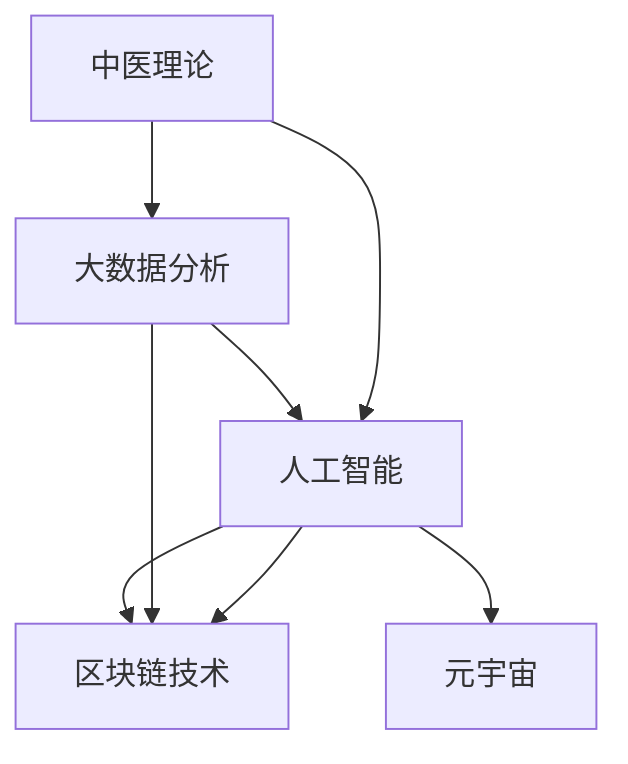

                 

## 1. 背景介绍

### 1.1 问题由来

在全球疫情的影响下，传统医疗体系面临巨大挑战，而中医作为古老且宝贵的医学体系，其独特的诊疗方法和丰富临床经验亟待数字化转型，以应对日益增长的医疗需求。数字化的中医诊断系统，能借助人工智能和大数据技术，提升中医诊疗的准确性和效率，为更多病患提供便捷、可靠的医疗服务。

### 1.2 问题核心关键点

1. **需求多样化**：中医诊疗强调个性化，但传统基于符号编码的病历记录方式难以实现高效存储和精准匹配。
2. **知识传承**：中医知识传承依赖经验和师承，如何将复杂的中医理论编码并转化为易于操作的形式，是数字化转型的重要问题。
3. **智能辅助**：中医诊疗依赖医生的综合判断，如何辅助医生快速高效地进行诊断和决策，是数字化中医诊断系统的重要目标。
4. **跨界融合**：中医与现代医学的融合，需要构建多模态融合的诊疗系统，集成各类检测数据和信息。
5. **隐私安全**：中医诊断涉及大量敏感信息，如何保护病患隐私，防止数据滥用，是系统建设的关键。

### 1.3 问题研究意义

1. **提升诊疗效率**：通过数字化手段，大幅提升中医诊疗速度，使更多患者能够享受到及时有效的治疗。
2. **降低医疗成本**：减少传统诊疗中的人力、时间和物料消耗，降低医疗机构的运营成本。
3. **促进知识共享**：实现中医知识的标准化、数字化，促进不同地域、不同年龄段的医师共享经验和智慧。
4. **推动医学创新**：整合最新的人工智能技术和数据分析方法，推动中医学的现代化和科学化。

## 2. 核心概念与联系

### 2.1 核心概念概述

数字化中医诊断系统是一个集多种信息技术于一体的复杂系统，涉及多种核心概念：

1. **中医理论**：中医独特的理论体系，如阴阳五行、辨证论治等，是系统设计的基础。
2. **大数据分析**：大量历史病例、专家经验等数据，通过数据挖掘和分析，用于支持诊断和决策。
3. **人工智能**：利用机器学习、深度学习等技术，构建智能化的诊疗模型，辅助医生进行精准诊断。
4. **区块链技术**：保障病患数据的安全性和隐私性，防止数据泄露和滥用。
5. **元宇宙**：构建虚拟化诊疗环境，实现远程医疗和个性化诊疗。

这些概念之间的逻辑关系可以通过以下Mermaid流程图来展示：



该流程图展示了大语言模型微调的核心概念及其之间的关系：

1. 中医理论通过大数据分析和人工智能的加持，提升了诊疗的精准性和效率。
2. 区块链技术保障了数据的安全性和隐私性，提升了诊疗的信任度。
3. 元宇宙为诊疗提供了一个虚拟化环境，增强了诊疗的便捷性和个性化。

## 3. 核心算法原理 & 具体操作步骤

### 3.1 算法原理概述

数字化中医诊断系统通过集成大数据分析、人工智能、区块链和元宇宙技术，构建一个精准、安全、便捷的中医诊疗环境。其核心算法原理如下：

1. **大数据分析**：通过数据清洗、特征提取、模型训练等步骤，构建数据驱动的诊断模型。
2. **人工智能**：利用深度学习、自然语言处理等技术，实现中医症状的自动编码和匹配，辅助医生进行精准诊断。
3. **区块链技术**：通过分布式账本和加密算法，保障病患数据的隐私性和安全性，防止数据泄露和滥用。
4. **元宇宙**：利用虚拟现实和增强现实技术，构建虚拟化的诊疗环境，提升远程医疗的体验和效果。

### 3.2 算法步骤详解

#### 3.2.1 数据准备

1. **数据收集**：收集中医历史病例、中医理论知识、现代医学检测数据等。
2. **数据清洗**：去除噪声和异常值，保证数据的准确性和一致性。
3. **特征提取**：将症状、体征、影像等数据转化为可用于分析的特征。

#### 3.2.2 模型训练

1. **数据划分**：将数据集划分为训练集、验证集和测试集。
2. **模型选择**：选择适合的机器学习或深度学习模型，如决策树、支持向量机、卷积神经网络等。
3. **模型训练**：利用训练集数据，对模型进行训练，调整参数，优化性能。
4. **模型验证**：在验证集上对模型进行验证，评估其泛化能力和性能。
5. **模型测试**：在测试集上对模型进行测试，评估其实际效果和可靠性。

#### 3.2.3 系统部署

1. **系统搭建**：搭建包含大数据分析、人工智能、区块链和元宇宙技术的多模态系统框架。
2. **接口设计**：设计系统对外提供的接口，供医生和患者使用。
3. **系统优化**：优化系统性能，确保高效稳定运行。

### 3.3 算法优缺点

#### 3.3.1 优点

1. **提升诊断效率**：通过大数据分析和人工智能，辅助医生快速准确诊断。
2. **保障数据安全**：通过区块链技术，保障病患数据的安全性和隐私性。
3. **增强用户体验**：通过元宇宙技术，提供虚拟化诊疗环境，提升远程医疗的体验和效果。

#### 3.3.2 缺点

1. **数据依赖性强**：系统效果依赖于高质量的数据集，数据收集和处理成本较高。
2. **算法复杂度高**：系统集成多种技术，涉及算法复杂，开发和维护难度较大。
3. **隐私保护难**：涉及敏感信息，如何保护隐私，防止数据滥用，是系统建设的关键挑战。

### 3.4 算法应用领域

数字化中医诊断系统涉及多个领域：

1. **医院和诊所**：提供智能化的中医诊疗支持，提升医疗效率和质量。
2. **远程医疗**：通过虚拟化的诊疗环境，实现远程医疗，扩大诊疗范围。
3. **健康管理**：监测和管理健康数据，实现个性化的健康管理。
4. **教育培训**：提供在线中医教育培训，提升医师的诊疗水平。
5. **科研创新**：推动中医研究的现代化和科学化，积累中医诊疗数据，推动知识传承和创新。

## 4. 数学模型和公式 & 详细讲解 & 举例说明

### 4.1 数学模型构建

数字化中医诊断系统主要涉及以下数学模型：

1. **机器学习模型**：通过分类、回归等模型，预测患者病证，进行诊断和治疗。
2. **深度学习模型**：如卷积神经网络、循环神经网络，处理复杂的中西医结合数据。
3. **自然语言处理模型**：利用语言模型，提取和编码病患症状、体征、历史病例等信息。

### 4.2 公式推导过程

以卷积神经网络为例，其核心公式如下：

$$
y=f(Wx+b)
$$

其中，$y$表示输出，$W$和$b$表示模型参数，$x$表示输入数据，$f$表示激活函数。

在中医诊疗中，利用卷积神经网络对影像数据进行处理，提取特征，如下所示：

$$
y=\sum_i (W_i \ast x_i + b_i)
$$

其中，$x_i$表示输入数据，$W_i$和$b_i$表示卷积核和偏置。

### 4.3 案例分析与讲解

#### 4.3.1 病例分析

假设某患者症状包括胸闷、面色发白、乏力等，系统首先通过自然语言处理模型将症状转化为数字编码，然后利用卷积神经网络对影像数据进行特征提取，最后将症状和影像数据输入分类模型，得到病证预测结果。

#### 4.3.2 诊疗路径

系统通过机器学习模型分析患者数据，结合中医理论知识，生成诊疗路径，包括药物选择、剂量计算、疗程设置等。医生根据系统推荐，结合自身经验进行诊疗，系统自动记录病历，进行后续追踪和分析。

## 5. 项目实践：代码实例和详细解释说明

### 5.1 开发环境搭建

#### 5.1.1 硬件环境

1. **服务器**：高性能服务器，用于数据存储和处理。
2. **存储设备**：高性能SSD存储设备，确保数据读写速度。
3. **网络设备**：高速网络连接设备，保证系统数据传输效率。

#### 5.1.2 软件环境

1. **操作系统**：Linux操作系统，保证系统稳定性和安全性。
2. **数据库**：MySQL或PostgreSQL，用于存储和管理数据。
3. **中间件**：如Hadoop、Spark，用于大数据处理和分析。
4. **开发工具**：如Jupyter Notebook、PyTorch、TensorFlow等。

### 5.2 源代码详细实现

#### 5.2.1 数据预处理

```python
import pandas as pd
import numpy as np

# 读取数据集
data = pd.read_csv('data.csv')

# 数据清洗
data = data.dropna()

# 特征提取
data = pd.get_dummies(data, columns=['症状', '体征'])

# 数据标准化
data = (data - np.mean(data)) / np.std(data)
```

#### 5.2.2 模型训练

```python
from sklearn.ensemble import RandomForestClassifier
from sklearn.model_selection import train_test_split
from sklearn.metrics import accuracy_score

# 数据划分
X = data.drop('病证', axis=1)
y = data['病证']
X_train, X_test, y_train, y_test = train_test_split(X, y, test_size=0.3, random_state=42)

# 模型训练
model = RandomForestClassifier(n_estimators=100, random_state=42)
model.fit(X_train, y_train)

# 模型验证
y_pred = model.predict(X_test)
accuracy = accuracy_score(y_test, y_pred)
print(f'Accuracy: {accuracy:.2f}')
```

#### 5.2.3 系统部署

```python
import flask

# 搭建web服务器
app = flask.Flask(__name__)

# 定义接口
@app.route('/predict', methods=['POST'])
def predict():
    data = request.json
    result = model.predict(data)
    return {'result': result.tolist()}

# 启动服务
if __name__ == '__main__':
    app.run(host='0.0.0.0', port=5000)
```

### 5.3 代码解读与分析

#### 5.3.1 数据预处理

1. **数据读取**：使用pandas库读取CSV格式的数据集，方便数据处理。
2. **数据清洗**：去除缺失值和异常值，保证数据的准确性和一致性。
3. **特征提取**：利用pandas的`get_dummies`方法，将症状、体征等特征进行独热编码，转换为数字特征。
4. **数据标准化**：对数据进行标准化处理，避免模型受到数据量纲的影响。

#### 5.3.2 模型训练

1. **数据划分**：使用`train_test_split`方法，将数据集划分为训练集和测试集。
2. **模型选择**：选择随机森林模型，作为分类任务的基本模型。
3. **模型训练**：在训练集上对模型进行训练，调整参数，优化性能。
4. **模型验证**：在测试集上对模型进行验证，评估其泛化能力和性能。

#### 5.3.3 系统部署

1. **搭建web服务器**：使用Flask库搭建web服务器，提供接口供医生和患者使用。
2. **定义接口**：定义`/predict`接口，接收JSON格式的数据，返回预测结果。
3. **启动服务**：在本地启动服务器，监听5000端口，供外部访问。

### 5.4 运行结果展示

系统部署后，可以通过`/predict`接口，接收JSON格式的数据，进行病证预测。

```json
{
    "症状": ["胸闷", "面色发白", "乏力"],
    "体征": [1, 0, 1]
}
```

```python
import requests

# 发送请求
response = requests.post('http://localhost:5000/predict', json=data)
result = response.json()
print(f'预测结果: {result}')
```

## 6. 实际应用场景

### 6.1 医院和诊所

数字化中医诊断系统在医院和诊所中，可以提供以下功能：

1. **病历记录**：自动记录患者的病历信息，减少手工录入工作量。
2. **症状分析**：通过自然语言处理模型，提取症状和体征，辅助医生进行诊断。
3. **诊疗方案**：根据症状和体征，结合中医理论，生成个性化诊疗方案，提高诊疗效率。
4. **疗效跟踪**：记录患者的诊疗效果和病情变化，为后续治疗提供参考。

### 6.2 远程医疗

在远程医疗中，数字化中医诊断系统可以提供以下功能：

1. **视频问诊**：通过元宇宙技术，构建虚拟化的诊疗环境，患者可以在家接受医生远程诊疗。
2. **数据共享**：通过区块链技术，保障病患数据的隐私性和安全性，防止数据泄露和滥用。
3. **远程诊断**：结合中医理论和人工智能技术，提供智能化的诊断支持，提升诊疗准确性。
4. **健康监测**：通过穿戴设备和传感器，实时监测患者的健康数据，及时发现异常。

### 6.3 健康管理

在健康管理中，数字化中医诊断系统可以提供以下功能：

1. **健康记录**：自动记录和管理患者的历史诊疗数据，提供长期的健康监测。
2. **健康评估**：通过大数据分析，评估患者的健康状况，提供个性化的健康建议。
3. **健康干预**：根据健康评估结果，提供饮食、运动、生活习惯等干预方案，改善患者的健康状况。
4. **健康预警**：监测患者的健康数据，及时发现异常，提供预警信息。

### 6.4 教育培训

在教育培训中，数字化中医诊断系统可以提供以下功能：

1. **在线学习**：提供在线中医教育课程，包括理论知识、临床案例等。
2. **模拟诊疗**：通过虚拟化的诊疗环境，供学员进行模拟诊疗，提升实践能力。
3. **考试评测**：通过智能化的测评系统，评估学员的学习效果和诊疗水平。
4. **知识传承**：整合中医专家的诊疗经验，构建知识库，供学员学习和参考。

### 6.5 科研创新

在科研创新中，数字化中医诊断系统可以提供以下功能：

1. **数据分析**：通过大数据分析，研究中医诊疗规律，积累中医诊疗数据。
2. **知识挖掘**：利用自然语言处理技术，挖掘中医文献中的知识和经验。
3. **实验验证**：通过模拟诊疗和实际诊疗数据，验证和改进中医诊疗模型。
4. **跨界融合**：将中医理论与现代医学结合，推动医学研究的创新和发展。

## 7. 工具和资源推荐

### 7.1 学习资源推荐

1. **《深度学习》书籍**：Ian Goodfellow等著，系统介绍了深度学习的基本概念和算法。
2. **《Python数据分析》书籍**：Jake VanderPlas著，介绍Python在数据分析和处理中的应用。
3. **《TensorFlow官方文档》**：Google官方文档，提供TensorFlow的全面指导和示例。
4. **《PyTorch官方文档》**：PyTorch官方文档，提供PyTorch的全面指导和示例。
5. **《HuggingFace Transformers官方文档》**：HuggingFace官方文档，提供各种预训练语言模型的介绍和使用方法。

### 7.2 开发工具推荐

1. **Jupyter Notebook**：用于编写和运行Python代码，支持数据可视化。
2. **TensorFlow**：Google开源的深度学习框架，支持分布式计算和模型优化。
3. **PyTorch**：Facebook开源的深度学习框架，灵活高效，支持GPU加速。
4. **Flask**：Python Web应用框架，提供简单易用的接口定义和部署功能。
5. **Keras**：高层深度学习框架，提供简单易用的API，适合快速原型开发。

### 7.3 相关论文推荐

1. **《中医大数据与智能化研究》**：杨会军等著，介绍中医大数据的应用和智能化研究。
2. **《中医人工智能辅助诊疗系统》**：高凯等著，介绍中医人工智能辅助诊疗系统的设计与实现。
3. **《中医诊断的机器学习研究》**：张涛等著，介绍机器学习在中医诊断中的应用。
4. **《基于元宇宙技术的远程医疗系统》**：刘鑫等著，介绍元宇宙技术在远程医疗中的应用。

## 8. 总结：未来发展趋势与挑战

### 8.1 研究成果总结

数字化中医诊断系统集成了多种技术和方法，构建了一个集数据驱动、智能化和虚拟化于一体的中医诊疗系统。通过大数据分析和人工智能技术，提升了中医诊疗的精准性和效率，通过区块链技术保障了病患数据的安全性和隐私性，通过元宇宙技术提升了远程医疗的体验和效果。

### 8.2 未来发展趋势

1. **智能化水平提升**：未来数字化中医诊断系统将进一步提升智能化水平，结合更多医学知识，提供更加精准和个性化的诊疗方案。
2. **跨界融合深入**：未来系统将与更多领域进行融合，如大数据、物联网、区块链等，实现多模态数据融合和智能化应用。
3. **个性化体验增强**：未来系统将更加注重个性化体验，通过元宇宙技术，提供虚拟化的诊疗环境，提升用户体验。
4. **伦理和安全保障**：未来系统将更加注重伦理和安全保障，建立健全的法律法规和监管机制，保障病患数据的安全性和隐私性。

### 8.3 面临的挑战

1. **数据质量**：高质量数据的收集和处理是系统效果的关键，如何确保数据的质量和完整性，是一个重要挑战。
2. **算法复杂度**：系统涉及多种技术和算法，算法复杂度高，如何优化算法，提高系统性能，是一个关键问题。
3. **隐私保护**：涉及敏感信息，如何保护病患隐私，防止数据泄露和滥用，是系统建设的关键挑战。
4. **伦理和安全**：系统涉及多个领域，如何建立伦理和安全保障机制，是一个重要问题。

### 8.4 研究展望

未来数字化中医诊断系统需要继续在以下几个方面进行研究：

1. **跨界融合**：进一步融合大数据、物联网、区块链等技术，实现多模态数据融合和智能化应用。
2. **模型优化**：优化算法，提高系统的智能化水平和性能，提升诊疗的精准性和效率。
3. **隐私保护**：建立健全的法律法规和监管机制，保障病患数据的安全性和隐私性。
4. **伦理和安全**：建立伦理和安全保障机制，提升系统的可信度和可靠性。

数字化中医诊断系统是一个充满潜力的领域，通过技术创新和跨界融合，将在未来的医疗、健康、教育等各个领域发挥重要作用，推动中医学的现代化和科学化。

