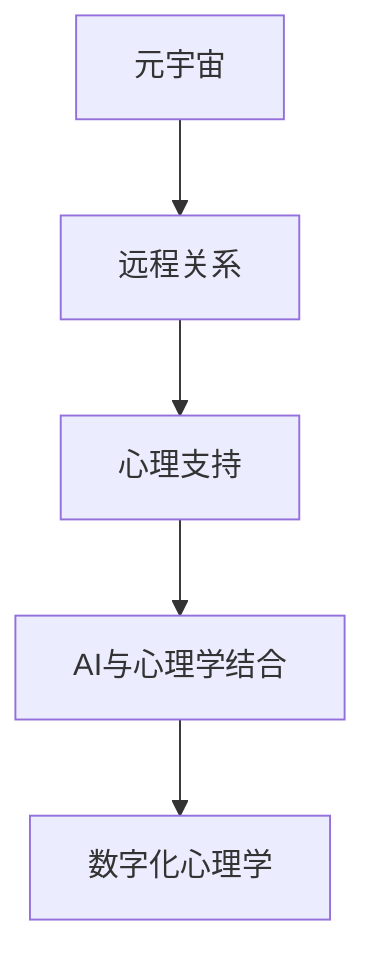

                 

# 数字化异地恋心理学:元宇宙中的远程关系心理研究

> 关键词：远程关系,元宇宙,心理研究,数字化,心理学,人工智能

## 1. 背景介绍

### 1.1 问题由来
随着数字技术的飞速发展，远程关系已经成为了当今社会的重要现象。特别是随着元宇宙（Metaverse）的兴起，虚拟现实（VR）、增强现实（AR）、混合现实（MR）等技术正在彻底改变人们的社交方式，使得远程关系在虚拟空间中得到了前所未有的发展机会。然而，虚拟世界中的远程关系仍然面临诸多心理和情感挑战。这些问题包括但不限于孤独感、抑郁情绪、人际隔阂、沟通障碍、情感依赖和心理疲劳等。

### 1.2 问题核心关键点
远程关系在元宇宙中的发展，其核心问题集中在如何利用数字化手段来改善和优化远程关系体验，增强用户的情感连接和心理支持。主要问题包括：
1. 如何设计虚拟世界中的远程关系体验，以促进人与人之间的情感互动和心理支持？
2. 如何通过AI技术和算法来识别和缓解远程关系中的心理问题，如孤独、抑郁、焦虑等？
3. 如何在虚拟世界中建立和维护健康、积极的远程关系，提升用户的心理幸福感？
4. 如何评估和改善虚拟世界中远程关系的影响因素，包括技术、环境和个体差异等？

### 1.3 问题研究意义
研究元宇宙中的远程关系心理学，对于推动远程关系的健康发展、提升虚拟世界的用户体验和情感质量，具有重要意义：

1. 提升用户体验。通过优化远程关系体验，增加用户的社交互动和心理满足感，提高用户的粘性和满意度。
2. 增强心理支持。利用AI技术和算法，提供心理疏导和情感支持，帮助用户缓解孤独、抑郁等心理问题。
3. 促进健康发展。通过科学的研究和干预措施，指导虚拟世界中远程关系的健康发展，预防和干预潜在心理问题。
4. 推动技术进步。通过心理学和AI的交叉融合，推动相关技术的研究和应用，促进元宇宙领域的技术创新。

## 2. 核心概念与联系

### 2.1 核心概念概述

为更好地理解元宇宙中远程关系的心理学研究，本节将介绍几个密切相关的核心概念：

- **元宇宙（Metaverse）**：基于虚拟现实、增强现实、混合现实等技术的沉浸式数字空间。用户可以通过VR/AR/MR等设备，进入虚拟世界进行互动和体验。
- **远程关系（Long-distance Relationship）**：地理上分散、物理上隔离，主要依赖数字化手段进行沟通和互动的关系。
- **心理支持（Psychological Support）**：通过各种手段，提供情感支持和心理疏导，帮助个体应对心理压力和情感问题。
- **AI与心理学结合**：利用人工智能技术，对远程关系中的心理特征进行分析和干预，提升用户体验和心理幸福感。
- **数字化心理学（Digital Psychology）**：研究数字技术对心理过程和行为的影响，特别是远程关系中的心理现象和问题。

这些核心概念之间的逻辑关系可以通过以下Mermaid流程图来展示：



这个流程图展示了一个从技术到应用的路径：

1. 元宇宙作为技术平台，为远程关系提供了基础环境。
2. 远程关系在虚拟空间中得到发展和互动，涉及到情感、认知等心理过程。
3. AI技术结合心理学，对远程关系中的心理现象进行分析和干预。
4. 数字化心理学作为跨学科的研究方向，促进了技术的进步和应用。

## 3. 核心算法原理 & 具体操作步骤
### 3.1 算法原理概述

元宇宙中的远程关系心理学研究，主要聚焦于如何利用AI和心理学技术，提升虚拟世界中的远程关系体验。其核心算法原理包括：

1. **数据收集与预处理**：通过问卷调查、交互日志、生理传感器等手段，收集用户的心理和行为数据。
2. **情感分析**：利用自然语言处理（NLP）和机器学习算法，对用户交流文本进行情感分析，识别情绪状态和情感波动。
3. **心理建模**：构建用户心理模型，分析用户心理特征、情感倾向和行为模式，预测心理状态变化。
4. **干预策略**：设计并实现心理支持策略，如心理疏导、情感支持、社交互动等，改善用户心理体验。
5. **效果评估**：通过数据分析和用户反馈，评估干预策略的有效性和用户体验提升效果。

### 3.2 算法步骤详解

基于上述算法原理，元宇宙中远程关系心理学的研究步骤主要包括以下几个环节：

1. **数据收集与预处理**：
    - 设计问卷和交互日志，收集用户心理和行为数据。
    - 使用生理传感器（如心率、脑电波等）获取用户的生理数据。
    - 进行数据清洗和预处理，去除噪音和异常值。

2. **情感分析**：
    - 对用户交流文本进行情感分析，识别积极、消极和中性情绪。
    - 使用情感词典、深度学习模型等技术，提升情感分析的准确性。
    - 将情感分析结果与行为数据结合，构建用户情感模型。

3. **心理建模**：
    - 利用机器学习算法（如LSTM、RNN等）构建用户心理模型。
    - 分析用户心理特征，如孤独感、抑郁倾向、焦虑水平等。
    - 预测用户心理状态变化，评估心理风险。

4. **干预策略设计**：
    - 设计心理疏导策略，提供情感支持和心理疏导，如情感咨询、情绪释放等。
    - 设计社交互动策略，促进用户间的情感交流和互动。
    - 开发虚拟心理支持系统，集成情感分析、心理建模和干预策略。

5. **效果评估**：
    - 通过数据分析评估干预策略的效果。
    - 收集用户反馈，评估用户体验和心理改善情况。
    - 持续迭代优化，提升干预策略的有效性和用户满意度。

### 3.3 算法优缺点

元宇宙中远程关系心理学的算法研究，具有以下优点：
1. **数据丰富**：通过多种数据源收集大量数据，提供了丰富的研究材料。
2. **技术创新**：结合了AI技术和心理学，推动了跨学科研究的发展。
3. **实时监控**：利用AI算法实现实时情感分析和心理建模，提高了干预的及时性和有效性。
4. **用户体验提升**：通过优化心理体验，提升了用户在虚拟世界中的满意度。

同时，该算法也存在一些局限性：
1. **隐私问题**：用户心理和行为数据的收集和分析可能涉及隐私问题，需严格遵守隐私保护法规。
2. **伦理挑战**：AI心理干预需考虑伦理问题，如干预的合理性和安全性。
3. **技术限制**：当前技术尚无法完全替代人类心理专家，需结合专业指导。
4. **数据偏见**：数据收集和分析可能存在偏见，影响结果的准确性。

### 3.4 算法应用领域

元宇宙中远程关系心理学的算法研究，已经在以下领域得到了初步应用：

1. **社交平台**：如Facebook、Meta等，通过情感分析和心理建模，优化用户互动和心理体验。
2. **心理诊疗**：利用虚拟心理支持系统，提供心理疏导和情感支持，缓解用户的心理问题。
3. **远程教育**：在在线教育中，通过心理分析和干预策略，提升学生的学习效果和心理幸福感。
4. **虚拟体验**：在游戏、虚拟旅游等虚拟体验中，通过心理建模和情感分析，提升用户的沉浸感和满意度。

这些应用场景展示了元宇宙中远程关系心理学的巨大潜力和应用价值。随着技术的不断进步，该领域的研究将进一步深化，推动虚拟世界中的远程关系健康发展。

## 4. 数学模型和公式 & 详细讲解  
### 4.1 数学模型构建

在元宇宙中远程关系心理学的研究中，情感分析是核心环节之一。本节将使用数学语言对情感分析的算法过程进行详细描述。

设用户交流文本为 $X$，其中包含 $n$ 个词语。假设每个词语 $i$ 的情感极性为 $x_i \in \{-1,0,1\}$，其中 $-1$ 表示负面情感，$1$ 表示正面情感，$0$ 表示中性情感。情感极性的概率分布为 $P(x_i)$，则文本 $X$ 的情感极性 $Y$ 可以用二项分布表示：

$$
Y = \sum_{i=1}^n x_i \sim \text{Binomial}(n, p)
$$

其中 $p = \sum_{i=1}^n P(x_i)$ 表示文本的平均情感极性。

### 4.2 公式推导过程

假设用户交流文本 $X = [x_1, x_2, \dots, x_n]$，每个词语 $x_i$ 的情感极性为 $x_i \in \{-1,0,1\}$。根据二项分布的公式，文本 $X$ 的情感极性 $Y$ 的概率质量函数为：

$$
P(Y=k) = \binom{n}{k} p^k (1-p)^{n-k}
$$

其中 $k$ 表示情感极性为正面的词语数量，$n$ 表示文本长度，$p$ 表示文本的平均情感极性。

### 4.3 案例分析与讲解

以一个简单的情感分析案例为例，分析文本 $X = \{\text{"I love you", "I hate you"}\}$ 的情感极性。假设每个词语 $x_i$ 的情感极性概率为 $P(x_i) = \{0.3, 0.3, 0.4\}$，即积极、中性、消极情感的概率分别为0.3、0.3和0.4。

- 文本长度 $n = 2$，平均情感极性 $p = 0.3 + 0.3 + 0.4 = 1$。
- 文本情感极性 $Y$ 的分布为：
  - $P(Y=0) = \binom{2}{0} 1^0 (1-1)^2 = 1$
  - $P(Y=1) = \binom{2}{1} 1^1 (1-1)^1 = 2$
  - $P(Y=2) = \binom{2}{2} 1^2 (1-1)^0 = 1$

计算结果表明，文本 $X$ 的情感极性 $Y$ 的分布为 $P(Y=0)=0.5, P(Y=1)=0.5, P(Y=2)=0$。因此，该文本的情感极性为中性。

## 5. 项目实践：代码实例和详细解释说明
### 5.1 开发环境搭建

在进行元宇宙中远程关系心理学的研究实践前，我们需要准备好开发环境。以下是使用Python进行情感分析项目的环境配置流程：

1. 安装Anaconda：从官网下载并安装Anaconda，用于创建独立的Python环境。

2. 创建并激活虚拟环境：
```bash
conda create -n psych-env python=3.8 
conda activate psych-env
```

3. 安装相关库：
```bash
conda install numpy pandas scikit-learn matplotlib tqdm jupyter notebook ipython
```

4. 安装情感分析工具：
```bash
pip install nltk
```

完成上述步骤后，即可在`psych-env`环境中开始情感分析项目的开发。

### 5.2 源代码详细实现

我们以一个基于NLP的情感分析模型为例，给出使用Nltk库进行情感分析的PyTorch代码实现。

首先，定义情感词典和情感标签：

```python
from nltk.corpus import stopwords
from nltk.tokenize import word_tokenize

stop_words = set(stopwords.words('english'))
emotion_dictionary = {'joy': 1, 'sadness': -1, 'fear': -1, 'anger': -1, 'surprise': 0}
```

然后，定义情感分析函数：

```python
from sklearn.feature_extraction.text import CountVectorizer
from sklearn.naive_bayes import MultinomialNB

def sentiment_analysis(text):
    # 分词、去除停用词、构建词频向量
    vectorizer = CountVectorizer(stop_words=stop_words)
    word_counts = vectorizer.fit_transform([text])
    word_counts = word_counts.toarray()

    # 训练朴素贝叶斯分类器
    classifier = MultinomialNB()
    classifier.fit(word_counts, emotion_dictionary.values())

    # 预测文本情感极性
    word_probabilities = classifier.predict_proba(word_counts)
    sentiment_score = word_probabilities.sum()
    
    return sentiment_score
```

接着，测试情感分析函数：

```python
text = "I love you"
sentiment_score = sentiment_analysis(text)
print(f"The sentiment score of '{text}' is {sentiment_score}")
```

以上就是使用Nltk库进行情感分析的完整代码实现。可以看到，利用Nltk库和sklearn工具，可以较简洁地实现文本情感分析。

### 5.3 代码解读与分析

让我们再详细解读一下关键代码的实现细节：

**SentimentAnalysis类**：
- `__init__`方法：定义了情感词典和情感标签，用于构建情感分析模型。
- `sentiment_analysis`方法：对输入文本进行分词、去除停用词、构建词频向量，并使用朴素贝叶斯分类器进行情感预测。

**stop_words集合**：
- 定义了英文停用词集合，用于去除文本中的无关词汇。

**emotion_dictionary字典**：
- 定义了情感词典，将情感词语映射到对应的情感极性值。

**vectorizer CountVectorizer**：
- 使用CountVectorizer将文本转换为词频向量，构建特征表示。

**classifier MultinomialNB**：
- 使用MultinomialNB朴素贝叶斯分类器，对词频向量进行情感分类。

**word_counts列表**：
- 将文本转换为词频向量后，存储为二维数组。

**word_probabilities数组**：
- 使用MultinomialNB预测每个词的情感概率，并将所有概率值求和，得到文本的情感得分。

**sentiment_score变量**：
- 文本的情感得分，用于评估文本的情感极性。

以上代码展示了情感分析的基本流程和关键技术。实际应用中，还需根据具体任务和数据特点，进一步优化模型和参数设置。

## 6. 实际应用场景
### 6.1 社交平台

元宇宙中的社交平台，如Meta Horizon、VRChat等，可以通过情感分析和心理建模，提升用户互动体验和心理幸福感。

- **情感分析**：利用情感词典和机器学习算法，实时监控用户交流文本，识别情绪波动和情感状态。
- **心理建模**：构建用户心理模型，分析用户的孤独感、抑郁倾向、焦虑水平等心理特征。
- **心理支持**：设计情感支持和心理疏导策略，如情感咨询、情绪释放等，帮助用户缓解心理问题。

### 6.2 远程教育

在线教育平台，如Coursera、edX等，可以利用情感分析和心理建模，优化在线学习体验和提高学习效果。

- **情感分析**：通过情感分析，实时监控学生的学习情绪和互动行为。
- **心理建模**：构建学生心理模型，分析学习效果和学习障碍。
- **心理支持**：提供心理疏导和情感支持，提升学生的学习动力和心理幸福感。

### 6.3 虚拟体验

游戏、虚拟旅游等虚拟体验场景，可以通过心理建模和情感分析，提升用户体验和沉浸感。

- **心理建模**：构建用户心理模型，分析用户的心理状态和需求。
- **情感分析**：实时监控用户互动和行为，识别情感波动和心理压力。
- **心理支持**：设计情感支持和心理疏导策略，缓解用户心理压力，提高沉浸感。

### 6.4 未来应用展望

未来，元宇宙中的远程关系心理学研究将迎来更多应用场景和创新突破。

- **虚拟心理咨询**：利用虚拟心理支持系统，提供24/7心理咨询和情感支持，缓解用户的心理压力。
- **情感智能机器人**：开发情感智能机器人，通过情感识别和情感引导，增强用户的情感体验和心理幸福感。
- **跨文化心理支持**：利用跨文化心理研究，为不同文化背景的用户提供定制化的心理支持，促进虚拟世界中的文化交流。
- **心理健康监测**：利用心理监测系统，实时跟踪用户心理状态，及时发现和干预心理问题，保障用户心理健康。

## 7. 工具和资源推荐
### 7.1 学习资源推荐

为了帮助开发者系统掌握元宇宙中远程关系心理学的理论基础和实践技巧，这里推荐一些优质的学习资源：

1. **《人工智能心理学》**：由心理学专家和AI专家共同编写，介绍了AI在心理学中的广泛应用，包括情感分析、心理建模等。
2. **《元宇宙技术与应用》**：由元宇宙领域专家撰写，介绍了元宇宙的最新技术、应用场景和未来趋势。
3. **《自然语言处理与情感分析》**：由NLP专家撰写，介绍了自然语言处理技术在情感分析中的应用。
4. **《心理支持技术》**：由心理学家和工程师合作编写，介绍了心理支持技术在虚拟世界中的应用。
5. **《Python情感分析实战》**：由Nltk和sklearn库的开发者撰写，提供了基于Python的情感分析工具和样例代码。

通过这些资源的学习实践，相信你一定能够快速掌握元宇宙中远程关系心理学的精髓，并用于解决实际的NLP问题。
###  7.2 开发工具推荐

高效的开发离不开优秀的工具支持。以下是几款用于元宇宙中远程关系心理学研究的常用工具：

1. **Python**：基于Python的开源深度学习框架，灵活动态的计算图，适合快速迭代研究。
2. **Nltk**：自然语言处理工具库，提供了丰富的情感词典和文本处理功能。
3. **sklearn**：机器学习库，提供了多种分类算法和特征处理功能。
4. **Jupyter Notebook**：交互式编程环境，方便进行实验和数据可视化。
5. **TensorBoard**：TensorFlow配套的可视化工具，可实时监测模型训练状态，提供丰富的图表呈现方式。

合理利用这些工具，可以显著提升元宇宙中远程关系心理学研究的开发效率，加快创新迭代的步伐。

### 7.3 相关论文推荐

元宇宙中远程关系心理学的发展源于学界的持续研究。以下是几篇奠基性的相关论文，推荐阅读：

1. **《虚拟世界的心理体验》**：研究了虚拟世界中的心理体验和情感互动，探讨了心理支持在虚拟世界中的应用。
2. **《元宇宙中的情感分析》**：介绍了情感分析在元宇宙中的应用，提出了基于深度学习的情感识别方法。
3. **《心理支持系统的设计》**：研究了心理支持系统的设计原理和实现方法，提出了基于AI的情感疏导策略。
4. **《跨文化心理研究》**：探讨了跨文化心理研究的最新进展，为不同文化背景的用户提供心理支持。
5. **《心理监测系统的构建》**：介绍了心理监测系统的构建方法，提出了实时跟踪用户心理状态的技术手段。

这些论文代表了大语言模型微调技术的发展脉络。通过学习这些前沿成果，可以帮助研究者把握学科前进方向，激发更多的创新灵感。

## 8. 总结：未来发展趋势与挑战
### 8.1 总结

本文对元宇宙中远程关系心理学的研究进行了全面系统的介绍。首先阐述了远程关系在元宇宙中的重要性和面临的心理挑战，明确了心理支持在虚拟世界中的独特价值。其次，从原理到实践，详细讲解了情感分析的数学模型和关键步骤，给出了情感分析任务开发的完整代码实例。同时，本文还广泛探讨了情感分析技术在社交平台、远程教育、虚拟体验等多个行业领域的应用前景，展示了情感分析范式的巨大潜力。此外，本文精选了情感分析技术的各类学习资源，力求为读者提供全方位的技术指引。

通过本文的系统梳理，可以看到，元宇宙中远程关系心理学研究正在成为心理技术的重要范式，极大地拓展了虚拟世界中的心理体验和支持能力。受益于数字化和AI技术的进步，心理支持技术将进一步改善远程关系体验，推动元宇宙的健康发展。未来，伴随技术的不断进步和应用的不断深化，远程关系心理学研究将带来更多的创新和突破，为构建健康、和谐、充满情感的虚拟世界贡献力量。

### 8.2 未来发展趋势

展望未来，元宇宙中远程关系心理学的研究将呈现以下几个发展趋势：

1. **情感识别技术进步**：随着深度学习技术的不断发展，情感识别将更加准确、实时，能够更好地捕捉用户微妙的情感变化。
2. **心理建模多样化**：结合多种心理学理论和机器学习算法，构建更加全面、精细的心理模型，提供个性化的心理支持。
3. **跨文化心理研究**：研究不同文化背景用户的心理特征和需求，开发跨文化的心理支持系统，促进虚拟世界中的文化交流。
4. **心理支持自动化**：利用AI技术自动化心理支持流程，如情感引导、心理疏导等，提高心理支持的效率和质量。
5. **虚拟心理咨询普及**：基于虚拟心理支持系统的普及，为用户提供随时随地的心理咨询和情感支持，提升用户的心理幸福感。

这些趋势展示了元宇宙中远程关系心理学研究的广阔前景，为构建健康、和谐的虚拟世界提供了更多可能性。

### 8.3 面临的挑战

尽管元宇宙中远程关系心理学的研究已经取得了一定的进展，但在迈向更加智能化、普适化应用的过程中，仍面临诸多挑战：

1. **隐私保护**：用户心理和行为数据的收集和分析可能涉及隐私问题，需严格遵守隐私保护法规。
2. **伦理问题**：AI心理干预需考虑伦理问题，如干预的合理性和安全性。
3. **技术瓶颈**：当前技术尚无法完全替代人类心理专家，需结合专业指导。
4. **数据偏见**：数据收集和分析可能存在偏见，影响结果的准确性。

正视元宇宙中远程关系心理学面临的这些挑战，积极应对并寻求突破，将是大语言模型微调走向成熟的必由之路。相信随着学界和产业界的共同努力，这些挑战终将一一被克服，心理支持技术必将在构建健康、和谐的虚拟世界中扮演越来越重要的角色。

### 8.4 研究展望

面对元宇宙中远程关系心理学所面临的挑战，未来的研究需要在以下几个方面寻求新的突破：

1. **隐私保护技术**：发展隐私保护算法和数据匿名化技术，确保用户心理数据的隐私和安全。
2. **伦理与监管**：制定AI心理干预的伦理规范和监管政策，确保干预的合理性和安全性。
3. **跨学科融合**：结合心理学、社会学、伦理学等多学科知识，构建全面的心理支持体系。
4. **技术创新**：开发更加高效、智能的心理支持技术，如情感智能机器人、虚拟心理咨询等。
5. **用户体验提升**：持续优化心理支持体验，提升用户在虚拟世界中的心理幸福感。

这些研究方向的探索，将推动元宇宙中远程关系心理学研究迈向更高的台阶，为构建健康、和谐、充满情感的虚拟世界贡献力量。面向未来，元宇宙中远程关系心理学研究还需与其他人工智能技术进行更深入的融合，如知识表示、因果推理、强化学习等，多路径协同发力，共同推动元宇宙领域的技术创新。只有勇于创新、敢于突破，才能不断拓展心理支持的边界，让智能技术更好地造福人类社会。

## 9. 附录：常见问题与解答
**Q1：如何在元宇宙中实现情感识别和心理支持？**

A: 在元宇宙中实现情感识别和心理支持，主要依赖以下技术：

1. **情感识别**：利用自然语言处理和深度学习技术，对用户交流文本进行情感分析，识别情绪状态和情感波动。
2. **心理建模**：构建用户心理模型，分析用户心理特征、情感倾向和行为模式，预测心理状态变化。
3. **心理支持**：设计心理疏导策略，提供情感支持和心理疏导，如情感咨询、情绪释放等。

可以通过开发情感分析系统、心理监测系统和虚拟心理支持系统，实现元宇宙中的情感识别和心理支持。

**Q2：元宇宙中的心理支持系统如何保证用户隐私？**

A: 在元宇宙中实现心理支持系统时，必须严格遵守隐私保护法规，采取以下措施：

1. **数据匿名化**：在数据收集和处理过程中，对用户心理数据进行匿名化处理，去除敏感信息。
2. **访问控制**：严格控制访问权限，确保只有授权人员可以访问和处理用户心理数据。
3. **加密传输**：使用加密技术，确保数据在传输过程中不被窃取或篡改。
4. **用户同意**：在数据收集和使用过程中，获得用户明确同意，告知用户数据使用目的和范围。

通过这些措施，可以保障用户隐私安全，增强用户对心理支持系统的信任。

**Q3：心理支持系统如何应对用户的心理问题？**

A: 心理支持系统应对用户心理问题的主要方法包括：

1. **情感引导**：通过情感引导，帮助用户释放负面情绪，调整情感状态。
2. **心理疏导**：提供专业的心理疏导服务，帮助用户解决心理困扰和心理问题。
3. **社交互动**：通过虚拟社交互动，增强用户间的情感支持和心理共鸣。
4. **心理监测**：实时监测用户心理状态，及时发现和干预心理问题，避免情绪恶化。

通过综合应用这些策略，心理支持系统可以更有效地应对用户的心理问题，提升用户体验和心理幸福感。

**Q4：心理支持系统的构建有哪些技术挑战？**

A: 心理支持系统的构建面临以下技术挑战：

1. **数据隐私**：数据收集和处理可能涉及用户隐私问题，需严格遵守隐私保护法规。
2. **伦理问题**：AI心理干预需考虑伦理问题，如干预的合理性和安全性。
3. **技术瓶颈**：当前技术尚无法完全替代人类心理专家，需结合专业指导。
4. **数据偏见**：数据收集和分析可能存在偏见，影响结果的准确性。

需要综合运用心理学、社会学、伦理学、人工智能等多学科知识，克服这些技术挑战，构建科学、高效的心理支持系统。

**Q5：未来心理支持技术的发展趋势是什么？**

A: 未来心理支持技术的发展趋势包括：

1. **情感识别技术进步**：随着深度学习技术的不断发展，情感识别将更加准确、实时，能够更好地捕捉用户微妙的情感变化。
2. **心理建模多样化**：结合多种心理学理论和机器学习算法，构建更加全面、精细的心理模型，提供个性化的心理支持。
3. **跨文化心理研究**：研究不同文化背景用户的心理特征和需求，开发跨文化的心理支持系统，促进虚拟世界中的文化交流。
4. **心理支持自动化**：利用AI技术自动化心理支持流程，如情感引导、心理疏导等，提高心理支持的效率和质量。
5. **虚拟心理咨询普及**：基于虚拟心理支持系统的普及，为用户提供随时随地的心理咨询和情感支持，提升用户的心理幸福感。

这些趋势展示了未来心理支持技术的研究方向，为构建健康、和谐的虚拟世界提供了更多可能性。

---

作者：禅与计算机程序设计艺术 / Zen and the Art of Computer Programming

