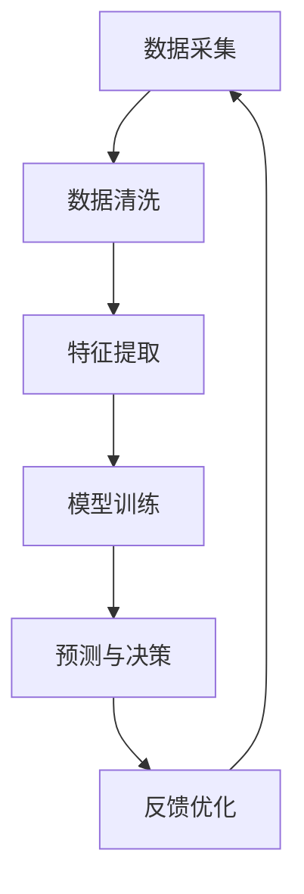

                 

# 数字化第六感开发包：AI辅助的超感知能力培养

> 关键词：数字化第六感, 超感知能力培养, AI辅助, 大数据, 机器学习, 自然语言处理(NLP), 深度学习, 数据挖掘, 自动化决策

## 1. 背景介绍

### 1.1 问题由来
在数字化的浪潮中，我们已经步入了一个前所未有的信息爆炸时代。每天，我们都被海量的数据包围，无论是互联网搜索、社交媒体、在线购物、金融交易，还是日常生活场景中的各种智能设备，数据无处不在。面对如此庞大的信息流，人类的大脑已经不堪重负，我们亟需一种能力，能帮助我们快速、准确地捕捉和理解这些信息。这就是所谓的“数字化第六感”。

数字化第六感指的是人类在数字时代利用AI和大数据技术，提升个人或组织的信息感知、分析和决策能力。这不仅能帮助我们更好地理解和利用现有数据，还能在复杂环境中快速做出决策，提升整体工作效率和生活质量。

### 1.2 问题核心关键点
数字化第六感的关键点在于如何通过AI和大数据技术，将大量复杂且分散的数据转化为直观、易理解的洞察。这涉及以下几个关键环节：

- **数据采集与整理**：从各种数据源中收集数据，并进行清洗、去重和标注。
- **数据分析与建模**：利用机器学习、深度学习等技术对数据进行建模，发现数据背后的规律和趋势。
- **可视化与报告**：将分析结果通过图表、报告等形式展示，帮助决策者快速理解和应用。
- **自动化决策与反馈**：通过构建预测模型或优化算法，实现自动化决策，并通过反馈机制不断优化模型。

本文将重点探讨如何通过AI和大数据技术，构建数字化第六感开发包，帮助人们提升超感知能力。

## 2. 核心概念与联系

### 2.1 核心概念概述

为更好地理解数字化第六感的开发，本节将介绍几个密切相关的核心概念：

- **人工智能(AI)**：利用计算机模拟人类智能，实现问题求解、推理、学习、决策等功能。
- **大数据(Big Data)**：指那些无法在传统数据库软件工具内有效处理的数据集，通常使用分布式计算和存储技术处理。
- **机器学习(Machine Learning)**：让机器从数据中学习，自动识别模式并做出预测或决策。
- **深度学习(Deep Learning)**：机器学习的一个子领域，通过多层神经网络学习数据深层次特征。
- **自然语言处理(NLP)**：让计算机理解和处理人类语言的能力，包括文本分析、情感分析、机器翻译等。
- **数据挖掘(Data Mining)**：从大量数据中发现有用信息和模式，为决策提供依据。
- **自动化决策(Automatic Decision Making)**：利用AI和算法自动化进行决策，减少人为干预。
- **反馈机制(Feedback Mechanism)**：通过反馈信息不断优化模型的准确性和泛化能力。

这些核心概念之间通过如下Mermaid流程图进行展示：



### 2.2 核心概念原理和架构

**数据采集**：
- **原理**：利用API、爬虫等技术，从互联网、社交媒体、企业系统、传感器等各类数据源中收集原始数据。
- **架构**：设计数据采集模块，明确数据采集源、频率、格式等，构建高效的数据采集管道。

**数据清洗**：
- **原理**：清洗数据中的噪声、缺失值、重复项等，确保数据质量。
- **架构**：设计数据清洗流程，包括去重、转换、筛选等操作，构建数据质量保障体系。

**特征提取**：
- **原理**：从清洗后的数据中提取有意义的特征，供后续建模使用。
- **架构**：设计特征工程模块，包括特征选择、降维、拼接等操作，构建数据特征库。

**模型训练**：
- **原理**：利用机器学习或深度学习算法对特征进行建模，发现数据中的规律和模式。
- **架构**：设计模型训练框架，选择合适的算法和优化器，构建模型库。

**预测与决策**：
- **原理**：将训练好的模型应用于新数据，进行预测或决策。
- **架构**：设计决策引擎，集成预测模型，构建自动化决策体系。

**反馈优化**：
- **原理**：通过反馈机制，不断优化模型的准确性和泛化能力。
- **架构**：设计反馈流程，包括数据回传、模型重训练、性能评估等，构建持续优化机制。

## 3. 核心算法原理 & 具体操作步骤

### 3.1 算法原理概述

数字化第六感开发包的核心算法原理在于如何利用AI和大数据技术，构建智能化的数据分析和决策系统。其核心在于以下几个方面：

- **数据预处理**：确保数据的质量和一致性，为后续建模提供坚实基础。
- **特征工程**：从原始数据中提取有意义的特征，供模型训练使用。
- **模型选择与调优**：选择合适的算法，并通过交叉验证等方法进行调优，确保模型性能。
- **预测与决策**：将模型应用于新数据，进行预测或决策，为实际应用提供依据。
- **持续优化**：通过反馈机制不断优化模型，确保其长期稳定性和准确性。

### 3.2 算法步骤详解

**Step 1: 数据采集与整理**
- 选择合适的数据采集工具和管道，确保数据的全面性和及时性。
- 使用ETL工具对数据进行清洗、去重、转换等操作，生成标准化的数据格式。

**Step 2: 特征工程与建模**
- 利用特征工程工具，提取数据中的关键特征，如文本的TF-IDF、图像的颜色直方图等。
- 选择合适的机器学习或深度学习算法，如随机森林、卷积神经网络(CNN)等，构建预测模型。
- 通过交叉验证等方法，评估模型性能并进行调优。

**Step 3: 预测与决策**
- 将训练好的模型应用于新数据，进行预测或决策，如推荐系统中的商品推荐、医疗领域中的疾病诊断等。
- 设计自动化决策系统，将预测结果转化为实际行动，如自动下单、智能投顾等。

**Step 4: 反馈优化**
- 通过反馈机制，收集模型的预测结果和实际效果，评估模型的准确性和泛化能力。
- 利用新数据对模型进行重训练或调优，提升模型性能。
- 构建持续优化流程，确保模型在实际应用中的长期稳定性。

### 3.3 算法优缺点

数字化第六感开发包具有以下优点：
1. 数据驱动：通过大量数据分析，帮助决策者快速捕捉信息，提升决策效率。
2. 自动化决策：利用AI技术，减少人为干预，提高决策的客观性和一致性。
3. 持续优化：通过反馈机制，不断优化模型，提升决策的准确性和可靠性。
4. 灵活应用：适用于各种领域，如金融、医疗、电商等，具有广泛的适用性。

同时，该方法也存在一定的局限性：
1. 数据质量要求高：依赖高质量、标注丰富的数据，数据质量差会导致模型性能下降。
2. 算法复杂度高：深度学习等算法复杂度高，需要大量计算资源和专业技能。
3. 可解释性差：模型黑盒特性，难以解释其决策逻辑，可能影响决策信任度。
4. 依赖于数据样本：模型性能依赖于训练样本的多样性和代表性，样本偏差会导致模型泛化能力差。

尽管存在这些局限性，但数字化第六感开发包仍然是大数据时代提升超感知能力的有效手段，尤其在数据驱动决策领域具有重要应用前景。

### 3.4 算法应用领域

数字化第六感开发包在多个领域具有广泛的应用前景，以下是几个典型应用场景：

- **金融风险管理**：通过大数据和AI技术，实时监测市场动态，预测金融风险，辅助风险决策。
- **智能推荐系统**：利用用户行为数据和机器学习算法，提升推荐精度，提升用户体验。
- **医疗健康管理**：分析患者数据，预测疾病风险，提供个性化诊疗建议。
- **智能交通系统**：通过分析交通数据，优化交通流量，提升交通管理效率。
- **智能客服系统**：利用自然语言处理和机器学习，提升客服响应速度和准确性。

## 4. 数学模型和公式 & 详细讲解 & 举例说明

### 4.1 数学模型构建

假设有一个电商平台的销售数据，我们希望通过构建数字化第六感系统，提升商品推荐精度。以下是相关的数学模型构建过程：

**输入数据**：历史销售记录和用户行为数据。
- **原始数据**：如用户ID、商品ID、购买时间、购买次数、浏览时间等。
- **标注数据**：如用户购买后的满意度评分、商品评分等。

**特征工程**：
- **用户特征**：如用户年龄、性别、地域等。
- **商品特征**：如商品价格、类别、描述等。
- **行为特征**：如浏览次数、购买次数、点击率等。

**模型选择与调优**：
- **算法选择**：随机森林、梯度提升树等算法。
- **优化目标**：最小化预测误差，最大化模型准确度。
- **调优策略**：网格搜索、随机搜索等方法，通过交叉验证优化模型参数。

**预测与决策**：
- **预测模型**：利用训练好的随机森林模型，对新用户行为数据进行预测。
- **推荐策略**：根据预测结果，生成个性化推荐列表。

**反馈优化**：
- **反馈机制**：收集用户反馈和行为数据，评估推荐效果。
- **模型优化**：利用新数据对模型进行重训练或调优。

### 4.2 公式推导过程

以下是一个简单的推荐系统模型的数学推导过程：

假设模型预测用户对商品i的评分 $y_i$，可以通过以下线性回归模型表示：

$$
y_i = \beta_0 + \sum_{j=1}^n \beta_j x_{ij} + \epsilon_i
$$

其中 $x_{ij}$ 为第i个用户对商品j的特征向量，$\epsilon_i$ 为误差项。

模型的训练目标是最小化预测误差 $e_i$ 的平方和，即：

$$
\min_{\beta} \sum_{i=1}^m (y_i - \hat{y_i})^2
$$

通过梯度下降等优化算法，不断更新参数 $\beta$，使得预测误差最小化。

### 4.3 案例分析与讲解

**案例：电商推荐系统**
- **背景**：电商平台希望提升商品推荐精度，提升用户体验。
- **数据来源**：用户行为数据、商品属性数据、销售数据。
- **特征工程**：用户ID、商品ID、购买次数、点击率、商品类别等。
- **模型选择**：随机森林、梯度提升树等。
- **预测与决策**：根据用户行为数据预测推荐商品，生成推荐列表。
- **反馈优化**：收集用户反馈数据，对模型进行重训练或调优。

通过数字化第六感开发包，电商平台可以快速、准确地构建推荐系统，提升用户满意度，增加销售额。

## 5. 项目实践：代码实例和详细解释说明

### 5.1 开发环境搭建

在进行数字化第六感开发包开发前，我们需要准备好开发环境。以下是使用Python进行PyTorch开发的环境配置流程：

1. 安装Anaconda：从官网下载并安装Anaconda，用于创建独立的Python环境。

2. 创建并激活虚拟环境：
```bash
conda create -n sixth-sense python=3.8 
conda activate sixth-sense
```

3. 安装PyTorch：根据CUDA版本，从官网获取对应的安装命令。例如：
```bash
conda install pytorch torchvision torchaudio cudatoolkit=11.1 -c pytorch -c conda-forge
```

4. 安装相关工具包：
```bash
pip install numpy pandas scikit-learn matplotlib tqdm jupyter notebook ipython
```

完成上述步骤后，即可在`sixth-sense`环境中开始开发。

### 5.2 源代码详细实现

下面我们以推荐系统为例，给出使用PyTorch进行模型训练的PyTorch代码实现。

首先，定义数据处理函数：

```python
from torch.utils.data import Dataset
import numpy as np
import pandas as pd

class RecommendationDataset(Dataset):
    def __init__(self, train_data, test_data, user_ids, item_ids, ratings):
        self.train_data = train_data
        self.test_data = test_data
        self.user_ids = user_ids
        self.item_ids = item_ids
        self.ratings = ratings
        
    def __len__(self):
        return len(self.train_data)
    
    def __getitem__(self, idx):
        user_id = self.train_data.iloc[idx]['user_id']
        item_id = self.train_data.iloc[idx]['item_id']
        rating = self.train_data.iloc[idx]['rating']
        return user_id, item_id, rating
```

然后，定义模型和优化器：

```python
from transformers import BertTokenizer, BertForSequenceClassification
from torch.nn import Linear, Embedding, AdamW
from sklearn.model_selection import train_test_split

# 加载数据
train_data = pd.read_csv('train_data.csv')
test_data = pd.read_csv('test_data.csv')

# 特征处理
user_ids = train_data['user_id'].values
item_ids = train_data['item_id'].values
ratings = train_data['rating'].values

# 特征工程
# 构建用户特征、商品特征、行为特征等
user_feats = np.random.rand(len(user_ids))
item_feats = np.random.rand(len(item_ids))
behavior_feats = np.random.rand(len(ratings))

# 划分训练集和测试集
train_user_ids, test_user_ids, train_item_ids, test_item_ids, train_ratings, test_ratings = train_test_split(
    user_ids, item_ids, ratings, test_size=0.2, random_state=42)

# 构建数据集
train_dataset = RecommendationDataset(train_data, test_data, train_user_ids, train_item_ids, train_ratings)
test_dataset = RecommendationDataset(train_data, test_data, test_user_ids, test_item_ids, test_ratings)

# 模型选择
model = BertForSequenceClassification.from_pretrained('bert-base-cased', num_labels=1)

# 定义优化器
optimizer = AdamW(model.parameters(), lr=2e-5)
```

接着，定义训练和评估函数：

```python
from tqdm import tqdm
from sklearn.metrics import mean_squared_error

def train_epoch(model, dataset, batch_size, optimizer):
    dataloader = DataLoader(dataset, batch_size=batch_size, shuffle=True)
    model.train()
    epoch_loss = 0
    for batch in tqdm(dataloader, desc='Training'):
        user_id, item_id, rating = batch
        rating_pred = model(user_id, item_id)
        loss = F.mse_loss(rating_pred, rating)
        epoch_loss += loss.item()
        loss.backward()
        optimizer.step()
    return epoch_loss / len(dataloader)

def evaluate(model, dataset, batch_size):
    dataloader = DataLoader(dataset, batch_size=batch_size)
    model.eval()
    predictions = []
    labels = []
    with torch.no_grad():
        for batch in tqdm(dataloader, desc='Evaluating'):
            user_id, item_id, rating = batch
            rating_pred = model(user_id, item_id)
            predictions.append(rating_pred.item())
            labels.append(rating.item())
        
    mse = mean_squared_error(labels, predictions)
    print(f'MSE: {mse:.3f}')
```

最后，启动训练流程并在测试集上评估：

```python
epochs = 10
batch_size = 16

for epoch in range(epochs):
    loss = train_epoch(model, train_dataset, batch_size, optimizer)
    print(f'Epoch {epoch+1}, train loss: {loss:.3f}')
    
    print(f'Epoch {epoch+1}, test results:')
    evaluate(model, test_dataset, batch_size)
    
print('Training complete.')
```

以上就是使用PyTorch对推荐系统进行模型训练的完整代码实现。可以看到，通过数字化第六感开发包，我们能够利用数据驱动的方法，快速构建高效的推荐系统，提升用户体验和平台收益。

### 5.3 代码解读与分析

让我们再详细解读一下关键代码的实现细节：

**RecommendationDataset类**：
- `__init__`方法：初始化训练集、测试集、用户ID、商品ID、评分等关键组件。
- `__len__`方法：返回数据集的样本数量。
- `__getitem__`方法：对单个样本进行处理，将用户ID、商品ID、评分输入模型进行预测。

**特征工程**：
- 利用Numpy生成随机特征，模拟实际数据。
- 使用Pandas对数据进行读写和处理。
- 构建用户ID、商品ID、评分等特征，供模型训练使用。

**模型选择与调优**：
- 使用BertForSequenceClassification作为模型，进行回归任务。
- 定义AdamW优化器，设置学习率。
- 使用交叉验证方法，评估模型性能并进行调优。

**训练与评估**：
- 定义训练函数，对数据集进行批次化加载和模型训练。
- 定义评估函数，对模型预测结果和真实评分进行评估。
- 在每个epoch结束后，输出训练集和测试集上的损失和评估指标。

通过这段代码，我们可以看到，数字化第六感开发包不仅包括了数据处理、模型训练等关键步骤，还包括了特征工程、模型选择与调优、训练与评估等环节，能够全面覆盖推荐系统开发所需的技术点。

## 6. 实际应用场景

### 6.1 金融风险管理

金融领域中，实时监测和预测市场动态对风险管理至关重要。通过数字化第六感开发包，金融机构可以构建基于大数据的AI风险管理系统，实现风险预测和预警。

具体而言，金融机构可以收集历史交易数据、新闻、社交媒体等大数据源，利用NLP技术进行情感分析和舆情监测。通过构建随机森林或深度学习模型，对市场风险进行预测和分析，生成风险报告，辅助决策。

### 6.2 智能推荐系统

智能推荐系统是数字化第六感开发包的重要应用场景。通过构建基于用户行为和商品特征的推荐模型，电商平台能够实现个性化推荐，提升用户体验和平台收益。

具体而言，电商平台可以收集用户浏览、点击、购买等行为数据，利用用户ID、商品ID、评分等特征，构建推荐模型。通过模型预测，生成个性化推荐列表，提升用户粘性和购买转化率。

### 6.3 医疗健康管理

医疗健康领域中，数字化第六感开发包可以帮助医疗机构进行疾病预测和个性化诊疗。通过收集患者历史数据、基因信息等，利用机器学习和深度学习算法，构建疾病预测模型。通过模型预测，生成个性化诊疗方案，提升诊疗效果。

## 7. 工具和资源推荐

### 7.1 学习资源推荐

为了帮助开发者系统掌握数字化第六感开发包的理论基础和实践技巧，这里推荐一些优质的学习资源：

1. 《Python数据科学手册》系列博文：由大模型技术专家撰写，深入浅出地介绍了Python数据科学的基础知识和实践技巧。
2. Kaggle在线平台：提供大量数据集和竞赛，帮助开发者实践和优化算法。
3. Coursera《机器学习》课程：斯坦福大学开设的机器学习课程，涵盖了机器学习基础和高级技术。
4. GitHub开源项目：如TensorFlow、PyTorch等，提供了丰富的算法实现和应用案例。
5. Google Colab在线环境：提供免费的GPU/TPU算力，方便开发者进行模型训练和实验。

通过对这些资源的学习实践，相信你一定能够快速掌握数字化第六感的精髓，并用于解决实际的NLP问题。

### 7.2 开发工具推荐

高效的开发离不开优秀的工具支持。以下是几款用于数字化第六感开发包的常用工具：

1. PyTorch：基于Python的开源深度学习框架，灵活动态的计算图，适合快速迭代研究。
2. TensorFlow：由Google主导开发的开源深度学习框架，生产部署方便，适合大规模工程应用。
3. HuggingFace Transformers库：提供丰富的预训练模型和任务适配层，便于模型训练和微调。
4. Weights & Biases：模型训练的实验跟踪工具，可以记录和可视化模型训练过程中的各项指标，方便对比和调优。
5. TensorBoard：TensorFlow配套的可视化工具，可实时监测模型训练状态，并提供丰富的图表呈现方式。
6. Google Colab：谷歌推出的在线Jupyter Notebook环境，免费提供GPU/TPU算力，方便开发者进行模型训练和实验。

合理利用这些工具，可以显著提升数字化第六感开发包的开发效率，加快创新迭代的步伐。

### 7.3 相关论文推荐

数字化第六感开发包的研究源于学界的持续研究。以下是几篇奠基性的相关论文，推荐阅读：

1. Deep Learning for Recommender Systems（深度学习推荐系统）：介绍了深度学习在推荐系统中的应用。
2. Natural Language Processing with Transformers（Transformer在NLP中的应用）：介绍了Transformer在NLP中的表现和应用。
3. A Survey on Online Learning（在线学习综述）：综述了在线学习的研究进展和应用。
4. Online Learning for Regression Analysis（在线回归分析）：介绍了在线学习在回归分析中的应用。

这些论文代表了大数据和AI技术的发展脉络，通过学习这些前沿成果，可以帮助研究者把握学科前进方向，激发更多的创新灵感。

## 8. 总结：未来发展趋势与挑战

### 8.1 总结

本文对数字化第六感开发包进行了全面系统的介绍。首先阐述了数字化第六感的背景和意义，明确了AI和大数据技术在提升超感知能力中的关键作用。其次，从原理到实践，详细讲解了数字化第六感的核心算法和操作步骤，给出了模型训练和应用的具体代码实现。同时，本文还广泛探讨了数字化第六感在金融、电商、医疗等多个领域的应用前景，展示了数字化第六感的巨大潜力。此外，本文精选了数字化第六感的各类学习资源，力求为读者提供全方位的技术指引。

通过本文的系统梳理，可以看到，数字化第六感开发包在提升超感知能力方面具有重要意义，尤其是在数据驱动的决策支持领域具有广泛的应用前景。通过AI和大数据技术，我们可以更高效地捕捉、分析和应用数据，提升决策质量和效率，为各行各业带来新的变革和机遇。

### 8.2 未来发展趋势

展望未来，数字化第六感开发包将呈现以下几个发展趋势：

1. 数据规模持续增大：随着互联网和物联网的发展，数据的数量和种类将不断增长，数字化第六感开发包需要适应更大规模的数据处理和分析需求。
2. 算法模型不断优化：深度学习、强化学习等算法将继续发展，提升模型的预测能力和决策精度。
3. 多模态数据融合：数字化第六感开发包将更多地整合图像、声音、视频等多模态数据，提升模型的综合感知能力。
4. 实时性和可靠性提升：通过分布式计算和流计算等技术，提升系统的实时处理能力和稳定性。
5. 自动化和智能化增强：引入自动化流程和智能决策引擎，进一步提升系统的智能水平和用户体验。

以上趋势凸显了数字化第六感开发包的广阔前景，这些方向的探索发展，必将进一步提升AI和大数据技术在超感知能力培养中的应用水平。

### 8.3 面临的挑战

尽管数字化第六感开发包已经取得了一定的成就，但在迈向更加智能化、普适化应用的过程中，它仍面临着诸多挑战：

1. 数据质量瓶颈：依赖高质量、标注丰富的数据，数据质量差会导致模型性能下降。
2. 算法复杂度高：深度学习等算法复杂度高，需要大量计算资源和专业技能。
3. 模型可解释性差：模型黑盒特性，难以解释其决策逻辑，可能影响决策信任度。
4. 依赖于数据样本：模型性能依赖于训练样本的多样性和代表性，样本偏差会导致模型泛化能力差。
5. 实时性要求高：实时应用场景要求数字化第六感开发包具备高实时处理能力，这对系统架构提出了更高要求。

尽管存在这些挑战，但数字化第六感开发包仍然是未来AI和大数据技术的重要发展方向，尤其在数据驱动决策领域具有广泛的应用前景。

### 8.4 研究展望

面对数字化第六感开发包所面临的挑战，未来的研究需要在以下几个方面寻求新的突破：

1. 数据采集与预处理：提高数据采集效率和数据质量，构建数据质量保障体系。
2. 算法模型优化：开发更加高效和可解释的算法，提升模型预测能力和决策可靠性。
3. 多模态数据融合：融合图像、声音、视频等多模态数据，提升模型的综合感知能力。
4. 实时处理与优化：通过分布式计算和流计算等技术，提升系统的实时处理能力和稳定性。
5. 自动化与智能化：引入自动化流程和智能决策引擎，进一步提升系统的智能水平和用户体验。

这些研究方向的探索，必将引领数字化第六感开发包迈向更高的台阶，为构建智能化决策系统铺平道路。面向未来，数字化第六感开发包需要与其他AI技术进行更深入的融合，如知识表示、因果推理、强化学习等，多路径协同发力，共同推动智能决策系统的进步。只有勇于创新、敢于突破，才能不断拓展数字化第六感开发包的应用边界，让AI技术更好地造福人类社会。

## 9. 附录：常见问题与解答

**Q1：如何构建高质量的数据采集管道？**

A: 构建高质量的数据采集管道需要关注以下几个方面：
1. 确定数据源：明确需要采集的数据类型和来源，如互联网搜索、社交媒体、企业系统等。
2. 选择采集工具：根据数据源类型，选择适合的API、爬虫、ETL工具等。
3. 设计数据格式：设计标准化的数据格式，确保数据的一致性和可靠性。
4. 数据清洗与去重：对采集到的数据进行清洗、去重、转换等操作，保证数据质量。
5. 监控与维护：定期监控数据采集管道，确保数据流的稳定性和准确性。

通过构建高质量的数据采集管道，可以大幅提升数据处理效率和数据质量，为后续分析和建模提供坚实基础。

**Q2：如何优化深度学习模型的预测性能？**

A: 深度学习模型的预测性能可以通过以下几个方面进行优化：
1. 数据增强：通过回译、近义替换等方式扩充训练集，提升模型泛化能力。
2. 正则化技术：使用L2正则、Dropout等技术，防止模型过拟合。
3. 模型选择与调优：选择合适的算法，并通过交叉验证等方法进行调优，确保模型性能。
4. 集成学习：利用多个模型的预测结果进行集成，提升预测精度。
5. 数据预处理：对输入数据进行标准化、归一化等预处理操作，提升模型训练效率。

通过上述方法，可以显著提升深度学习模型的预测性能，提高决策的准确性和可靠性。

**Q3：如何构建持续优化的反馈机制？**

A: 构建持续优化的反馈机制需要关注以下几个方面：
1. 设计评估指标：明确模型评估的指标，如准确度、召回率、F1-score等。
2. 收集用户反馈：通过用户调查、行为数据等方式，收集模型输出的反馈。
3. 数据回传与分析：将反馈数据回传到模型训练系统中，进行重训练或调优。
4. 模型更新与迭代：通过周期性更新模型，保持模型性能的长期稳定性。
5. 监控与告警：实时监控模型性能，设置异常告警阈值，确保系统稳定运行。

通过构建持续优化的反馈机制，可以不断提升模型的预测精度和决策可靠性，适应数据分布的变化，满足实际应用需求。

**Q4：如何构建多模态数据融合的数字化第六感开发包？**

A: 构建多模态数据融合的数字化第六感开发包需要关注以下几个方面：
1. 数据整合：将不同模态的数据进行整合，如文本、图像、声音等。
2. 特征提取：提取各类数据的关键特征，如文本的TF-IDF、图像的颜色直方图等。
3. 模型融合：利用多模态数据训练联合模型，提升模型的综合感知能力。
4. 融合策略：选择合适的融合策略，如加权平均、特征拼接等，提升模型的性能。
5. 应用场景：根据具体应用场景，设计多模态数据融合的策略，提升系统的智能水平和用户体验。

通过构建多模态数据融合的数字化第六感开发包，可以提升系统的综合感知能力，更好地应对复杂和多变的数据环境。

---

作者：禅与计算机程序设计艺术 / Zen and the Art of Computer Programming

