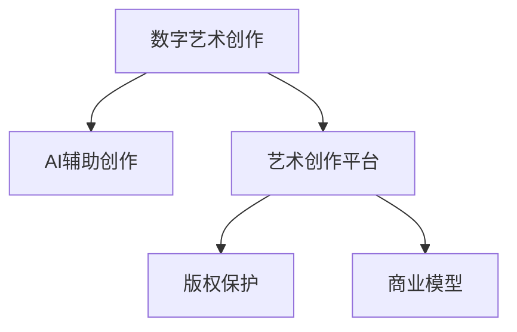

                 

## 1. 背景介绍

### 1.1 问题由来
随着数字技术的迅猛发展，艺术创作领域正经历着一场深刻的变革。数字艺术创作，通过计算机算法和人工智能技术，赋予创作新的可能，大大拓宽了传统艺术创作的边界。在这一背景下，利用AI辅助艺术创作不仅是一种技术创新，更是一种新的创业模式。AI辅助的创意产业，不仅提升了创作效率，降低了创作成本，还开辟了艺术创作的新方向和新形式，为艺术家们提供了更加丰富的创作工具。

### 1.2 问题核心关键点
AI辅助的艺术创作创业，其核心在于如何将AI技术与艺术创作紧密结合，实现技术的赋能与艺术创意的融合。这需要解决以下几个关键问题：
- 如何设计适合艺术创作的AI工具和算法？
- 如何将AI技术与艺术家的创作流程无缝对接？
- 如何保护艺术家的版权和创造性？
- 如何建立市场化的商业模式？

### 1.3 问题研究意义
AI辅助的艺术创作创业，不仅推动了数字艺术的发展，也为创业者提供了新的机会。通过技术赋能，不仅能够降低艺术创作的门槛，也能激发更多的创意产出。同时，这种模式的创业，有助于将艺术与科技紧密结合，打造跨领域的创新项目，推动数字经济的发展。

## 2. 核心概念与联系

### 2.1 核心概念概述

为了更好地理解AI辅助艺术创作创业的概念，本节将介绍几个关键概念及其相互联系：

- **数字艺术创作**：指通过计算机图形、动画、音乐、文字处理等数字技术进行的艺术创作，融合了艺术与科技的元素。
- **AI辅助创作**：指利用人工智能技术，如机器学习、生成对抗网络、自然语言处理等，辅助艺术家进行艺术创作，提升创作效率和创意质量。
- **艺术创作平台**：指支持艺术家使用AI工具进行创作的在线或离线平台，提供创作资源、交流社区、市场交易等功能。
- **版权保护**：指在数字化艺术创作过程中，通过区块链、数字水印等技术手段，保护艺术家的知识产权和创意成果。
- **商业模型**：指基于AI辅助艺术创作的创业项目，通过订阅、按需付费、版权销售等多种方式实现商业化，获取收益。

这些概念之间的逻辑关系可以通过以下Mermaid流程图来展示：



这个流程图展示了大语言模型的核心概念及其之间的关系：

1. 数字艺术创作通过AI辅助工具，提升创作效率和质量。
2. 创作平台提供工具和环境，支持艺术家使用AI进行创作。
3. 版权保护确保艺术家的知识产权。
4. 商业模型实现项目的盈利，推动项目持续发展。

## 3. 核心算法原理 & 具体操作步骤
### 3.1 算法原理概述

AI辅助的艺术创作创业，其核心算法原理包括以下几个方面：

- **计算机视觉**：通过计算机视觉技术，如图像识别、图像生成、物体检测等，辅助艺术家进行视觉艺术创作。
- **自然语言处理**：利用自然语言处理技术，如文本生成、情感分析、文本到图像转换等，辅助艺术家进行文字和图像创作。
- **生成对抗网络**：通过生成对抗网络（GAN），生成高质量的艺术作品，如绘画、雕塑等。
- **交互式创作工具**：利用交互式创作工具，如自动绘画、音乐生成等，提供直观的创作界面，激发艺术家的创意灵感。

### 3.2 算法步骤详解

基于AI辅助的艺术创作创业，其算法步骤一般包括以下几个关键环节：

**Step 1: 准备数据集和模型**

- 收集和标注适合艺术创作的数据集，如图像、文本、音乐等。数据集应尽可能涵盖不同艺术风格和流派，以训练出泛化能力强的模型。
- 选择合适的AI模型和工具，如GAN、BERT、DALL·E等，进行预训练和微调。

**Step 2: 设计创作工具**

- 根据艺术家的创作需求，设计适合的艺术创作工具和界面。工具应易于使用，同时具备足够的创作自由度。
- 集成多种AI技术，如计算机视觉、自然语言处理、生成对抗网络等，提供多样化的创作支持。

**Step 3: 交互式创作**

- 艺术家通过创作工具输入创作意图和初始素材，AI工具根据输入生成初步作品。
- 艺术家与AI工具进行互动，调整和完善作品，直至满意为止。
- 艺术家可以对AI生成的作品进行二次创作，加入个人风格和创意。

**Step 4: 版权保护**

- 对创作过程进行记录和标识，生成数字水印，确保作品原创性。
- 利用区块链技术，记录创作过程和版权信息，防止侵权和篡改。

**Step 5: 市场化运作**

- 建立艺术作品的市场交易平台，支持线上线下销售。
- 通过订阅、按需付费、版权销售等方式，实现商业化运作。

### 3.3 算法优缺点

AI辅助的艺术创作创业，具有以下优点：

- **创作效率高**：AI工具可以快速生成作品，辅助艺术家进行创作，减少手工操作的耗时。
- **创作自由度高**：AI工具提供创作自由度，艺术家可以自由调整和完善作品，加入个人创意。
- **创作成本低**：AI工具可以批量生成作品，降低人力和材料的成本。
- **创作多样性**：AI工具可以生成多种风格的作品，拓展创作风格和题材。

同时，该方法也存在一定的局限性：

- **技术依赖强**：对AI工具的依赖可能导致创作失去部分原创性和灵动感。
- **版权保护问题**：AI工具生成的作品可能存在版权争议，艺术家和创作者需要特别注意。
- **商业化难度高**：艺术作品的市场需求和价值难以量化，商业模式尚需探索和完善。
- **用户接受度低**：部分艺术家和观众对AI创作作品持怀疑态度，需要进一步普及和教育。

尽管存在这些局限性，但AI辅助的艺术创作创业仍是大势所趋，预计在未来将有更多探索和创新。

### 3.4 算法应用领域

AI辅助的艺术创作创业，已经在多个领域得到了应用，例如：

- **视觉艺术创作**：如绘画、雕塑、设计等，通过计算机视觉和生成对抗网络生成作品，艺术家再进行二次创作。
- **音乐创作**：通过自然语言处理技术生成音乐，或将音乐转换为图像进行创作。
- **文字创作**：利用自然语言处理技术生成文本，或将文本转换为图像进行创作。
- **多媒体创作**：将多种媒介如文字、图像、音乐、视频等结合，创作多媒体作品。

除了这些常见的应用领域，AI辅助的艺术创作创业还在游戏开发、广告设计、虚拟现实等新兴领域中展现了强大的潜力。

## 4. 数学模型和公式 & 详细讲解 & 举例说明

### 4.1 数学模型构建

在本节中，我们将介绍几个基本的数学模型，用于描述AI辅助艺术创作的基本过程：

- **图像生成模型**：通过生成对抗网络（GAN）生成艺术作品。GAN由生成器（Generator）和判别器（Discriminator）两部分组成，生成器负责生成作品，判别器负责区分生成作品与真实作品。模型通过对抗训练，不断提升生成器的生成能力。
- **文本生成模型**：通过自然语言处理技术，如循环神经网络（RNN）、变分自编码器（VAE）等，生成文本或将文本转换为图像。
- **交互式创作模型**：通过强化学习技术，设计交互式创作工具，如自动绘画、音乐生成等，提供直观的创作界面，激发艺术家的创意灵感。

### 4.2 公式推导过程

以图像生成模型为例，GAN的基本训练过程如下：

1. 生成器生成假图片 $G(z)$。
2. 判别器判断生成图片与真实图片的差异 $D(x, G(z))$。
3. 生成器根据判别器的反馈更新权重 $G^{t+1} = G^t - \eta \nabla_G \mathcal{L}_{G}(G^t)$。
4. 判别器根据生成图片与真实图片的差异更新权重 $D^{t+1} = D^t - \eta \nabla_D \mathcal{L}_{D}(D^t, G^t)$。
5. 交替更新生成器和判别器，直至收敛。

其中，$\mathcal{L}_{G}$ 和 $\mathcal{L}_{D}$ 分别为生成器和判别器的损失函数。

### 4.3 案例分析与讲解

**案例：利用GAN生成绘画**

假设艺术家希望创作一幅抽象画，可以按以下步骤进行：

1. 收集和标注适合抽象画的图像数据集，如抽象画风格的作品。
2. 使用预训练的GAN模型，如CycleGAN、StyleGAN等，进行生成对抗训练。
3. 在创作工具中输入艺术家的创作意图和初始素材，如颜色、线条、形状等。
4. 调用GAN模型生成初步的抽象画作品。
5. 艺术家对生成的作品进行调整和完善，加入个人风格和创意。
6. 记录创作过程，生成数字水印，确保作品原创性。

## 5. 项目实践：代码实例和详细解释说明
### 5.1 开发环境搭建

在进行艺术创作创业项目开发前，需要准备好开发环境。以下是使用Python进行PyTorch开发的Python环境配置流程：

1. 安装Anaconda：从官网下载并安装Anaconda，用于创建独立的Python环境。

2. 创建并激活虚拟环境：
```bash
conda create -n art-env python=3.8 
conda activate art-env
```

3. 安装PyTorch：根据CUDA版本，从官网获取对应的安装命令。例如：
```bash
conda install pytorch torchvision torchaudio cudatoolkit=11.1 -c pytorch -c conda-forge
```

4. 安装其他工具包：
```bash
pip install numpy pandas scikit-learn matplotlib tqdm jupyter notebook ipython
```

完成上述步骤后，即可在`art-env`环境中开始项目开发。

### 5.2 源代码详细实现

下面我们以利用GAN生成绘画为例，给出使用PyTorch进行创作的代码实现。

首先，定义GAN模型：

```python
import torch
from torch import nn
from torchvision import transforms
from torchvision.utils import save_image

class Generator(nn.Module):
    def __init__(self):
        super(Generator, self).__init__()
        self.model = nn.Sequential(
            nn.ConvTranspose2d(100, 256, 4, 1, 0, bias=False),
            nn.BatchNorm2d(256),
            nn.ReLU(inplace=True),
            nn.ConvTranspose2d(256, 128, 4, 2, 1, bias=False),
            nn.BatchNorm2d(128),
            nn.ReLU(inplace=True),
            nn.ConvTranspose2d(128, 64, 4, 2, 1, bias=False),
            nn.BatchNorm2d(64),
            nn.ReLU(inplace=True),
            nn.ConvTranspose2d(64, 3, 4, 2, 1, bias=False, padding=1),
            nn.Tanh()
        )

    def forward(self, input):
        return self.model(input)

class Discriminator(nn.Module):
    def __init__(self):
        super(Discriminator, self).__init__()
        self.model = nn.Sequential(
            nn.Conv2d(3, 64, 4, 2, 1, bias=False),
            nn.LeakyReLU(0.2, inplace=True),
            nn.Conv2d(64, 128, 4, 2, 1, bias=False),
            nn.BatchNorm2d(128),
            nn.LeakyReLU(0.2, inplace=True),
            nn.Conv2d(128, 256, 4, 2, 1, bias=False),
            nn.BatchNorm2d(256),
            nn.LeakyReLU(0.2, inplace=True),
            nn.Conv2d(256, 1, 4, 1, 0, bias=False),
            nn.Sigmoid()
        )

    def forward(self, input):
        return self.model(input)

# 实例化模型
generator = Generator()
discriminator = Discriminator()
```

接着，定义损失函数和优化器：

```python
import torch.nn.functional as F

loss_f = nn.BCELoss()
loss_g = nn.BCELoss()
opt_f = torch.optim.Adam(discriminator.parameters(), lr=0.0002)
opt_g = torch.optim.Adam(generator.parameters(), lr=0.0002)
```

然后，定义训练函数：

```python
def train_gan(generator, discriminator, dataloader, num_epochs=100, batch_size=128):
    for epoch in range(num_epochs):
        for i, (images, _) in enumerate(dataloader):
            batch_size = min(batch_size, images.size(0))
            images = images[:batch_size].to(device)
            real_labels = torch.ones(batch_size, 1).to(device)
            fake_labels = torch.zeros(batch_size, 1).to(device)
            real_outputs = discriminator(images)
            real_loss = loss_f(real_outputs, real_labels)
            generator.zero_grad()
            z = torch.randn(batch_size, 100, 1, 1).to(device)
            fake_images = generator(z)
            fake_outputs = discriminator(fake_images)
            fake_loss = loss_f(fake_outputs, fake_labels)
            total_loss = real_loss + fake_loss
            total_loss.backward()
            opt_g.step()
            opt_f.step()
            if (i+1) % 500 == 0:
                print('[%d/%d][%d/%d][%d] loss: D %.4f, G %.4f'
                      %(epoch+1, num_epochs, i+1, len(dataloader), batch_size,
                        float(real_loss), float(fake_loss)))
```

最后，启动训练流程并保存结果：

```python
from torchvision.datasets import MNIST
from torchvision.transforms import ToTensor

dataloader = MNIST('mnist', download=True, transform=ToTensor(), batch_size=128)
device = torch.device('cuda' if torch.cuda.is_available() else 'cpu')

generator.to(device)
discriminator.to(device)

train_gan(generator, discriminator, dataloader)

# 保存模型和图像
state_dict = generator.state_dict()
save_image(generator(z), 'generated_image.png', nrow=8, normalize=True)
```

以上就是使用PyTorch进行GAN绘画生成的完整代码实现。可以看到，通过代码实现了GAN的基本结构、训练流程和输出保存，展示了AI辅助艺术创作的实际应用。

### 5.3 代码解读与分析

让我们再详细解读一下关键代码的实现细节：

**GAN模型定义**：
- `Generator`类：定义了生成器模型，采用一系列的卷积和激活函数，将随机噪声 $z$ 转换为图像。
- `Discriminator`类：定义了判别器模型，采用一系列的卷积和激活函数，判断输入图像是真实图像还是生成图像。

**损失函数和优化器**：
- `loss_f`：定义了二分类交叉熵损失函数，用于判别器训练。
- `loss_g`：定义了二分类交叉熵损失函数，用于生成器训练。
- `opt_f`和`opt_g`：定义了Adam优化器，用于判别器和生成器的参数更新。

**训练函数**：
- `train_gan`：定义了GAN训练的函数，通过迭代训练判别器和生成器，不断更新参数，优化损失函数。
- 在每个epoch内，先训练判别器，再训练生成器，交替进行。

**数据集加载**：
- 使用`torchvision.datasets.MNIST`加载MNIST数据集，并应用`transforms.ToTensor()`转换为Tensor格式。
- 定义`dataloader`，用于批量加载数据。

**模型保存和输出**：
- 保存训练后的生成器模型，使用`torch.save()`将模型状态字典保存到文件中。
- 调用`save_image`函数保存生成的图像。

可以看到，通过代码实例，我们可以直观地理解AI辅助艺术创作的实现过程。开发者可以根据实际需求，进一步扩展和优化模型结构，提升创作的自由度和多样性。

## 6. 实际应用场景
### 6.1 数字艺术创作平台

AI辅助的数字艺术创作平台，为艺术家们提供了全面的创作支持，包括工具、素材、交流社区等。平台可以整合多种AI工具，如GAN、BERT、DALL·E等，提供丰富的创作资源和交互式创作界面。

艺术家可以在平台上上传自己的作品，通过AI工具进行修改和优化，获取创作灵感和建议。平台还可以提供作品展示和交易功能，推动作品的传播和市场化。

### 6.2 虚拟现实艺术创作

虚拟现实（VR）技术为艺术创作提供了全新的空间和形式，AI辅助的VR艺术创作能够进一步提升创作效率和效果。通过VR头盔和控制器，艺术家可以在虚拟环境中进行创作，如虚拟绘画、雕塑、动画等。

AI工具可以根据艺术家的创作意图和素材，生成初步作品，并通过交互界面进行调整和完善。VR技术能够提供沉浸式的创作体验，激发艺术家的创意灵感，提升创作的质量和多样性。

### 6.3 跨领域艺术创作

AI辅助的艺术创作，不再局限于单一媒介或领域，跨领域的创作成为可能。例如，结合音乐、舞蹈、戏剧等艺术形式，创作多媒体艺术作品。AI工具可以帮助艺术家设计音乐节奏、舞蹈动作、戏剧场景等，提供创作支持和灵感。

跨领域的创作不仅丰富了艺术形式，也拓展了艺术的表现力和影响力。未来，AI辅助的跨领域创作将为艺术家们提供更多的创新空间和表现手法。

### 6.4 未来应用展望

随着AI技术的不断发展，基于AI辅助的艺术创作将迎来更多创新和突破。未来，AI辅助的艺术创作创业将展现出以下趋势：

- **创作工具多样化**：开发更多的AI工具，如文字生成、音乐创作、动画制作等，支持多种艺术形式和创作需求。
- **创作环境沉浸化**：通过VR、AR等技术，提供沉浸式的创作环境，提升创作体验和效率。
- **创作过程记录化**：记录创作过程，生成数字水印和版权信息，确保作品的原创性和可追溯性。
- **市场化运作规范化**：建立标准化的交易平台，规范市场运作，保护艺术家和创作者的权益。
- **跨领域融合化**：促进艺术与科技、艺术与商业的融合，推动跨领域创新项目的落地。

## 7. 工具和资源推荐
### 7.1 学习资源推荐

为了帮助开发者系统掌握AI辅助艺术创作创业的理论基础和实践技巧，这里推荐一些优质的学习资源：

1. **《Python深度学习》**：由Ian Goodfellow等人合著的深度学习经典教材，详细介绍了深度学习的基本原理和实践方法。

2. **《Deep Learning with Python》**：Francois Chollet编写的深度学习实战指南，结合TensorFlow和Keras，提供丰富的代码示例。

3. **《Artificial Intelligence: A Modern Approach》**：由Stuart Russell和Peter Norvig合著的AI教材，全面介绍了AI的基本概念和技术。

4. **Coursera深度学习课程**：由斯坦福大学Andrew Ng教授主讲的深度学习课程，涵盖深度学习的基础和前沿技术。

5. **Kaggle数据科学竞赛**：提供丰富的数据集和竞赛机会，锻炼数据处理和机器学习技能，了解最新AI应用。

6. **arXiv.org**：科学论文库，提供最新的AI和艺术创作领域的论文和研究成果。

通过对这些资源的学习实践，相信你一定能够快速掌握AI辅助艺术创作创业的精髓，并用于解决实际的创作问题。

### 7.2 开发工具推荐

高效的开发离不开优秀的工具支持。以下是几款用于AI辅助艺术创作开发的常用工具：

1. **PyTorch**：基于Python的开源深度学习框架，灵活动态的计算图，适合快速迭代研究。

2. **TensorFlow**：由Google主导开发的开源深度学习框架，生产部署方便，适合大规模工程应用。

3. **Jupyter Notebook**：交互式编程环境，支持代码、文档、图形等的混合展示，便于研究和开发。

4. **OpenAI GPT系列**：基于自然语言处理技术的AI创作工具，支持文本生成、对话系统等。

5. **Adobe Creative Suite**：专业的设计软件，支持图像、视频、音频等多媒体创作。

6. **Unreal Engine**：强大的游戏引擎，支持虚拟现实、增强现实等技术，提供丰富的创作支持。

合理利用这些工具，可以显著提升AI辅助艺术创作的开发效率，加快创新迭代的步伐。

### 7.3 相关论文推荐

AI辅助的艺术创作创业，在学界和工业界的研究已经取得了丰硕成果。以下是几篇奠基性的相关论文，推荐阅读：

1. **Generative Adversarial Nets (GAN)**：Ian Goodfellow等人提出的生成对抗网络，用于生成高质量的艺术作品。

2. **Neural Style Transfer**：Leon A. Gatys等人提出的风格迁移技术，将艺术作品的风格迁移到其他图像中。

3. **BERT: Pre-training of Deep Bidirectional Transformers for Language Understanding**：BERT模型，通过自监督学习任务，提升语言理解和生成的能力。

4. **Adversarial Creation of Realistic Text**：利用生成对抗网络生成高质量的文本，应用于文学创作和剧本生成。

5. **Inceptionism: Going Deeper into Neural Art**：利用卷积神经网络生成高分辨率的艺术作品，应用于视觉艺术创作。

6. **Creativity in AI**：探讨AI在创作中的应用，提出如何让AI更加具有创造性。

这些论文代表了大语言模型微调技术的发展脉络。通过学习这些前沿成果，可以帮助研究者把握学科前进方向，激发更多的创新灵感。

## 8. 总结：未来发展趋势与挑战
### 8.1 总结

本文对基于AI辅助的艺术创作创业进行了全面系统的介绍。首先阐述了数字艺术创作的发展背景和趋势，明确了AI辅助创意产业的重要性和潜力。其次，从原理到实践，详细讲解了AI辅助艺术创作的数学模型和关键步骤，给出了完整的代码实例。同时，本文还广泛探讨了AI辅助艺术创作在多个行业领域的应用前景，展示了其广阔的发展空间。

通过本文的系统梳理，可以看到，AI辅助的艺术创作创业不仅推动了数字艺术的发展，也为创业者提供了新的机会。通过技术赋能，不仅能够降低艺术创作的门槛，也能激发更多的创意产出。同时，这种模式的创业，有助于将艺术与科技紧密结合，打造跨领域的创新项目，推动数字经济的发展。未来，伴随AI技术的不断发展，基于AI辅助的艺术创作将迎来更多创新和突破，为艺术创作带来新的可能性。

### 8.2 未来发展趋势

展望未来，AI辅助的艺术创作创业将呈现以下几个发展趋势：

- **创作工具智能化**：开发更加智能化的创作工具，能够自动生成创作灵感和方案，提升创作效率和质量。
- **创作环境多样化**：结合VR、AR、MR等技术，提供更加多样化的创作环境，拓展创作空间。
- **创作过程记录化**：记录创作过程，生成数字水印和版权信息，确保作品的原创性和可追溯性。
- **市场化运作规范化**：建立标准化的交易平台，规范市场运作，保护艺术家和创作者的权益。
- **跨领域融合化**：促进艺术与科技、艺术与商业的融合，推动跨领域创新项目的落地。

### 8.3 面临的挑战

尽管AI辅助的艺术创作创业已经取得了一定的成果，但在迈向更加智能化、普适化应用的过程中，仍面临诸多挑战：

- **技术依赖强**：对AI工具的依赖可能导致创作失去部分原创性和灵动感。
- **版权保护问题**：AI工具生成的作品可能存在版权争议，艺术家和创作者需要特别注意。
- **市场化难度高**：艺术作品的市场需求和价值难以量化，商业模式尚需探索和完善。
- **用户接受度低**：部分艺术家和观众对AI创作作品持怀疑态度，需要进一步普及和教育。
- **伦理和安全问题**：AI创作作品可能存在伦理和安全问题，如歧视、偏见等，需要加强规范和监管。

尽管存在这些挑战，但随着学界和产业界的共同努力，AI辅助的艺术创作创业必将在未来取得更大的突破和进展。

### 8.4 研究展望

未来，针对AI辅助的艺术创作创业，需要在以下几个方面进行更多的研究探索：

- **AI工具的可解释性**：如何让AI工具具备更好的可解释性，增强艺术家对其创作过程的信任和理解。
- **跨领域融合技术**：如何更好地将AI工具与传统艺术创作工具进行融合，提升创作效率和质量。
- **用户个性化需求**：如何根据用户的个性化需求，提供更加定制化的创作支持，提升用户满意度。
- **伦理和安全性**：如何确保AI创作作品的安全性和道德性，避免伦理和安全问题。

这些研究方向将推动AI辅助的艺术创作创业向更加智能、普适、安全的方向发展，为艺术创作带来新的可能性和价值。

## 9. 附录：常见问题与解答

**Q1：AI辅助的艺术创作创业是否适用于所有艺术形式？**

A: AI辅助的艺术创作创业，在视觉艺术、音乐、文字创作等领域已经取得了不错的效果。但对于一些高度依赖个人情感和技艺的艺术形式，如舞蹈、戏剧等，AI工具的辅助可能仍存在一定的局限。未来，随着AI技术的进一步发展，AI辅助的创作形式将更加多样化，更多艺术形式也将能够受益。

**Q2：AI辅助的艺术创作创业如何实现商业化？**

A: AI辅助的艺术创作创业可以通过以下几种方式实现商业化：
- 订阅服务：用户可以订阅平台提供的创作工具和素材，享受高质量的创作支持。
- 按需付费：用户可以根据创作需求，按需购买特定的创作工具或服务。
- 版权销售：平台可以销售艺术家和创作者的原创作品，获取收益。
- 广告和赞助：平台可以通过展示广告、接受赞助等方式，获取商业收益。
- NFT交易：利用区块链技术，艺术家可以通过NFT（非同质化代币）交易自己的作品，获得经济收益。

**Q3：AI辅助的艺术创作创业如何保护艺术家和创作者的权益？**

A: AI辅助的艺术创作创业在保护艺术家和创作者权益方面，可以从以下几个方面进行：
- 版权声明：艺术家和创作者在发布作品前，应声明作品的版权归属和授权使用条件。
- 数字水印：为作品生成数字水印，确保作品的原创性和可追溯性。
- 区块链记录：利用区块链技术，记录作品的创作过程和版权信息，防止侵权和篡改。
- 法律保护：通过法律手段，保护艺术家的知识产权和创作者的权利。

**Q4：AI辅助的艺术创作创业如何避免伦理和安全问题？**

A: AI辅助的艺术创作创业在避免伦理和安全问题方面，可以从以下几个方面进行：
- 数据隐私保护：收集和使用艺术家的数据时，确保数据隐私和安全，避免泄露。
- 算法公平性：设计和训练AI模型时，避免算法偏见和歧视，确保作品的公正性和多样性。
- 内容审查机制：建立内容审查机制，防止有害内容生成和传播。
- 伦理审查委员会：成立伦理审查委员会，对创作作品进行伦理审查，确保符合伦理道德标准。

通过这些措施，可以有效避免伦理和安全问题，确保AI辅助的艺术创作创业健康、可持续地发展。

**Q5：AI辅助的艺术创作创业如何获取更多的用户和市场？**

A: AI辅助的艺术创作创业可以通过以下几种方式获取更多的用户和市场：
- 社交媒体推广：通过社交媒体平台，推广平台和作品，吸引更多用户关注和参与。
- 合作推广：与艺术院校、艺术机构等合作，推广平台和作品。
- 参展和活动：参加艺术展览和活动，展示作品和平台，吸引更多用户。
- 教育推广：通过在线课程和教育活动，提升用户对平台和作品的认知和兴趣。
- 优惠活动：提供优惠活动和免费试用，吸引更多用户注册和使用。

通过这些推广方式，可以有效扩大平台和作品的知名度和影响力，吸引更多的用户和市场。

