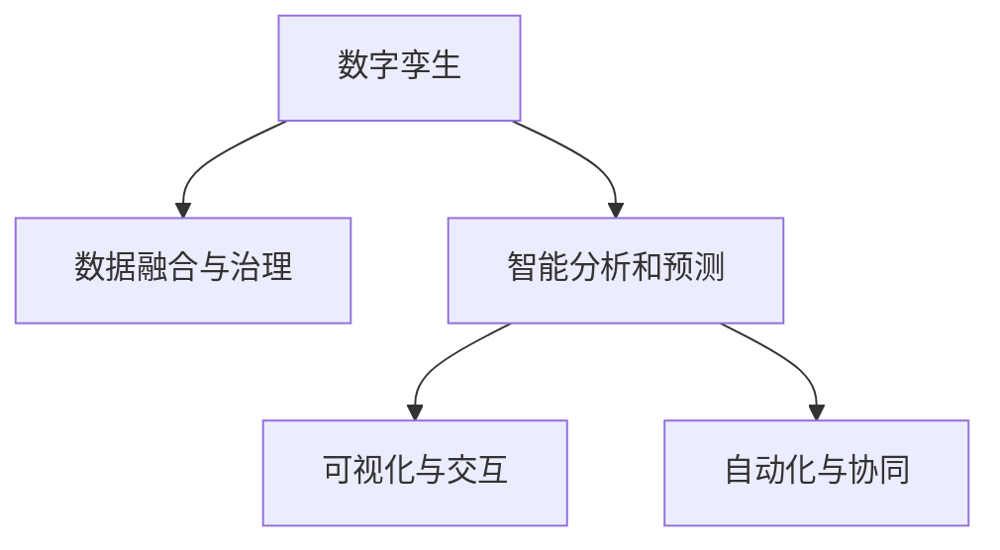

                 

## 1. 背景介绍

### 1.1 问题由来

随着数字化转型浪潮的兴起，数字孪生（Digital Twin）技术逐渐成为各行各业信息化管理的核心工具。数字孪生技术通过构建虚拟与现实数据、业务的桥梁，将物理世界的实体数据映射到虚拟世界，从而实现对现实世界的深度理解和精准控制。数字孪生管理模式的提出，正是为了顺应这一技术发展趋势，将虚拟与现实的结合推向更深层次的管理创新。

### 1.2 问题核心关键点

数字孪生管理模式的核心在于利用数字孪生技术，构建一个跨越物理与虚拟、静态与动态、实时与预测的智能管理平台。这一平台不仅能提供决策者实时掌握现场数据，还能通过虚拟模型对未来趋势进行预测，从而提升决策效率和准确性。

数字孪生管理的关键包括：
- 数据融合与治理：将物理世界的各种数据整合至虚拟平台，并实现数据的统一管理。
- 智能分析和预测：利用先进的机器学习算法对数据进行深度分析，预测未来发展趋势。
- 可视化与交互：将分析结果以可视化的方式呈现给用户，并提供交互式操作，增强用户体验。
- 自动化与协同：实现业务流程的自动化，推动不同部门、不同层级之间的协同工作。

这些关键点共同构成了数字孪生管理的全流程，助力企业实现从传统经验型管理向智能化、高效化管理的转型。

## 2. 核心概念与联系

### 2.1 核心概念概述

为更好地理解数字孪生管理模式，本节将介绍几个密切相关的核心概念：

- **数字孪生**：是指通过数字化手段，构建与现实世界完全一致的虚拟模型。数字孪生模型能够在虚拟空间中模拟现实世界的运行状态，为决策者提供数据分析和决策支持。

- **数据融合与治理**：涉及将来自不同源、不同格式的数据，通过标准化、清洗、整合等步骤，统一至一个数据平台，确保数据的一致性和完整性。

- **智能分析和预测**：利用先进的机器学习算法，对融合后的数据进行深度学习，发现数据背后的规律，并利用这些规律进行预测，从而提供决策支持。

- **可视化与交互**：通过图表、仪表盘等手段，将分析结果以可视化的方式展示给用户，使用户能够直观理解数据和分析结果。同时，通过交互式工具，使用户能够主动探索和操作数据，发现更多有价值的信息。

- **自动化与协同**：通过流程自动化技术，减少人为操作，提升效率。同时，推动跨部门、跨层级的协同工作，提高整体管理水平。

这些核心概念之间的逻辑关系可以通过以下Mermaid流程图来展示：



这个流程图展示了数字孪生管理的核心流程：
1. 数字孪生模型构建了虚拟与现实的桥梁。
2. 数据融合与治理为模型提供高质量的数据基础。
3. 智能分析和预测通过模型深入挖掘数据背后的规律。
4. 可视化与交互使用户能够直观理解数据和分析结果。
5. 自动化与协同提高了管理效率和跨部门协同工作。

## 3. 核心算法原理 & 具体操作步骤

### 3.1 算法原理概述

数字孪生管理模式的核心算法主要包括以下几个部分：

1. **数据采集与融合**：收集来自不同源的传感器数据、设备状态数据、业务数据等，通过数据治理技术，整合到统一的数据平台。
2. **智能分析与预测**：利用机器学习算法，对融合后的数据进行特征提取、建模和预测，发现数据中的模式和规律。
3. **可视化与交互**：将分析结果通过图表、仪表盘等可视化工具呈现给用户，并提供交互式操作，增强用户体验。
4. **自动化与协同**：通过工作流自动化和协作平台，推动不同部门、不同层级之间的协同工作，提高整体管理效率。

这些算法共同构成了数字孪生管理的核心逻辑，实现对物理世界和虚拟世界的双向映射和互动。

### 3.2 算法步骤详解

#### 3.2.1 数据采集与融合

数据采集与融合是数字孪生管理的第一步，主要包含以下几个步骤：

1. **数据源识别与接入**：识别和接入各类数据源，如传感器、设备、系统日志等，确保数据采集的全面性。

2. **数据清洗与预处理**：对采集到的数据进行清洗，去除噪声和异常值，进行归一化和标准化处理。

3. **数据整合与存储**：将清洗后的数据整合到一个统一的数据平台，如Hadoop、Spark等分布式计算系统，并实现数据的长期存储和备份。

#### 3.2.2 智能分析与预测

智能分析与预测是数字孪生管理的核心算法，主要包含以下几个步骤：

1. **特征提取与选择**：从原始数据中提取关键特征，并进行特征选择，去除冗余和噪声。

2. **模型训练与验证**：利用机器学习算法，对提取后的特征进行建模，训练模型并进行验证，确保模型的准确性和泛化能力。

3. **预测与优化**：使用训练好的模型进行预测，并对预测结果进行优化，提供决策支持。

#### 3.2.3 可视化与交互

可视化与交互是数字孪生管理的用户接口，主要包含以下几个步骤：

1. **数据可视化**：利用图表、仪表盘等工具，将分析结果以可视化的方式展示给用户。

2. **交互式操作**：提供交互式工具，如钻取、过滤、数据可视化等，使用户能够主动探索和操作数据。

#### 3.2.4 自动化与协同

自动化与协同是数字孪生管理的执行层，主要包含以下几个步骤：

1. **流程自动化**：通过工作流引擎，实现业务流程的自动化，减少人为操作，提高效率。

2. **跨部门协同**：利用协同平台，推动不同部门、不同层级之间的协作，提高整体管理水平。

### 3.3 算法优缺点

数字孪生管理模式的算法有以下优点：
1. **全面性**：通过数据融合与治理，实现了对物理世界的全面数据覆盖，为决策提供全面的信息支持。
2. **深度性**：通过智能分析和预测，能够深入挖掘数据背后的规律，提供更为精准的决策支持。
3. **交互性**：通过可视化与交互，使用户能够直观理解数据和分析结果，增强用户体验。
4. **协同性**：通过自动化与协同，推动跨部门、跨层级的协同工作，提高整体管理效率。

同时，该算法也存在一些局限性：
1. **数据质量要求高**：数据的准确性和完整性直接影响分析结果的准确性。
2. **技术复杂度高**：涉及大量的数据处理和机器学习技术，对技术要求较高。
3. **实施成本高**：需要投入大量资源进行数据采集、数据治理、模型训练等。
4. **维护复杂**：随着数据量的增长和业务的变化，需要持续维护和更新数据和模型。

尽管存在这些局限性，但数字孪生管理模式凭借其深度、全面、交互和协同的特性，已经成为各行各业信息化管理的重要工具。

### 3.4 算法应用领域

数字孪生管理模式在多个领域得到了广泛应用，例如：

- **工业制造**：通过数字孪生模型，实时监控生产设备状态，优化生产流程，提升产品质量。
- **智能城市**：利用数字孪生技术，实时监测交通、环境等数据，优化城市管理，提升居民生活质量。
- **医疗健康**：通过数字孪生模型，实时监控患者健康数据，提供个性化医疗服务，提升医疗效果。
- **金融服务**：利用数字孪生技术，实时监控市场数据，预测金融风险，提供智能投顾服务。
- **能源管理**：通过数字孪生模型，实时监控能源消耗情况，优化能源使用，降低成本。

除了这些经典应用外，数字孪生管理模式还被创新性地应用到更多场景中，如供应链管理、环境保护、灾害预防等，为各行各业带来了全新的管理模式。

## 4. 数学模型和公式 & 详细讲解 & 举例说明

### 4.1 数学模型构建

数字孪生管理模式涉及多个领域的数学模型构建，以下以工业制造为例，简要介绍其数学模型构建过程。

#### 4.1.1 数据采集与融合

数据采集与融合主要涉及数据的收集、清洗、整合等，其数学模型构建如下：

$$
\begin{aligned}
\text{DataCollection} &= \{s_1, s_2, \ldots, s_n\} \\
\text{DataCleaning} &= \{c_1, c_2, \ldots, c_m\} \\
\text{DataIntegration} &= \{d_1, d_2, \ldots, d_k\}
\end{aligned}
$$

其中，$s_i$ 表示传感器采集的数据，$c_j$ 表示清洗后的数据，$d_k$ 表示整合后的数据。

#### 4.1.2 智能分析与预测

智能分析与预测主要涉及特征提取、模型训练和预测等，其数学模型构建如下：

$$
\begin{aligned}
\text{FeatureExtraction} &= \{\{f_{i,j}\}_{i=1}^n\}_{j=1}^m \\
\text{ModelTraining} &= M_{\theta}(\text{FeatureExtraction}) \\
\text{Prediction} &= \{p_i\}_{i=1}^n
\end{aligned}
$$

其中，$f_{i,j}$ 表示第 $i$ 个传感器在 $j$ 时间点的特征数据，$M_{\theta}$ 表示训练好的模型，$p_i$ 表示模型预测的第 $i$ 个传感器的未来数据。

#### 4.1.3 可视化与交互

可视化与交互主要涉及数据的可视化展示和交互式操作，其数学模型构建如下：

$$
\begin{aligned}
\text{DataVisualization} &= \{v_1, v_2, \ldots, v_k\} \\
\text{InteractiveOperation} &= O_{\text{UI}}(v_i)
\end{aligned}
$$

其中，$v_i$ 表示第 $i$ 个数据的可视化结果，$O_{\text{UI}}$ 表示用户界面提供的交互式操作。

#### 4.1.4 自动化与协同

自动化与协同主要涉及业务流程的自动化和跨部门协作，其数学模型构建如下：

$$
\begin{aligned}
\text{WorkflowAutomation} &= \{\{w_{i,j}\}_{i=1}^n\}_{j=1}^m \\
\text{CrossDepartmentCollaboration} &= C_{\text{SC}}(\{w_{i,j}\})
\end{aligned}
$$

其中，$w_{i,j}$ 表示第 $i$ 个流程在 $j$ 时间点的自动化执行情况，$C_{\text{SC}}$ 表示跨部门协作平台。

### 4.2 公式推导过程

以下是几个关键数学模型的详细推导过程：

#### 4.2.1 数据采集与融合

数据采集与融合的数学模型推导如下：

$$
\begin{aligned}
\text{DataCollection} &= \{s_1, s_2, \ldots, s_n\} \\
\text{DataCleaning} &= \{c_1, c_2, \ldots, c_m\} \\
\text{DataIntegration} &= \{d_1, d_2, \ldots, d_k\}
\end{aligned}
$$

其中，$s_i$ 表示第 $i$ 个传感器采集的数据，$c_j$ 表示清洗后的数据，$d_k$ 表示整合后的数据。

#### 4.2.2 智能分析与预测

智能分析与预测的数学模型推导如下：

$$
\begin{aligned}
\text{FeatureExtraction} &= \{\{f_{i,j}\}_{i=1}^n\}_{j=1}^m \\
\text{ModelTraining} &= M_{\theta}(\text{FeatureExtraction}) \\
\text{Prediction} &= \{p_i\}_{i=1}^n
\end{aligned}
$$

其中，$f_{i,j}$ 表示第 $i$ 个传感器在 $j$ 时间点的特征数据，$M_{\theta}$ 表示训练好的模型，$p_i$ 表示模型预测的第 $i$ 个传感器的未来数据。

#### 4.2.3 可视化与交互

可视化与交互的数学模型推导如下：

$$
\begin{aligned}
\text{DataVisualization} &= \{v_1, v_2, \ldots, v_k\} \\
\text{InteractiveOperation} &= O_{\text{UI}}(v_i)
\end{aligned}
$$

其中，$v_i$ 表示第 $i$ 个数据的可视化结果，$O_{\text{UI}}$ 表示用户界面提供的交互式操作。

#### 4.2.4 自动化与协同

自动化与协同的数学模型推导如下：

$$
\begin{aligned}
\text{WorkflowAutomation} &= \{\{w_{i,j}\}_{i=1}^n\}_{j=1}^m \\
\text{CrossDepartmentCollaboration} &= C_{\text{SC}}(\{w_{i,j}\})
\end{aligned}
$$

其中，$w_{i,j}$ 表示第 $i$ 个流程在 $j$ 时间点的自动化执行情况，$C_{\text{SC}}$ 表示跨部门协作平台。

### 4.3 案例分析与讲解

#### 4.3.1 工业制造

在工业制造领域，数字孪生管理模式通过构建数字孪生模型，实时监控生产设备状态，优化生产流程，提升产品质量。具体步骤如下：

1. **数据采集与融合**：采集生产设备传感器数据、生产环境数据、生产指令数据等，通过数据清洗和整合，生成统一的数据平台。

2. **智能分析与预测**：利用机器学习算法，对融合后的数据进行特征提取和建模，预测设备故障、预测生产效率等。

3. **可视化与交互**：将分析结果通过图表、仪表盘等工具展示，并提供交互式操作，帮助管理者实时监控生产情况，及时调整生产参数。

4. **自动化与协同**：通过工作流自动化和协同平台，实现生产流程的自动化，推动跨部门协同工作，提高整体生产效率。

#### 4.3.2 智能城市

在智能城市领域，数字孪生管理模式通过构建数字孪生模型，实时监测交通、环境等数据，优化城市管理，提升居民生活质量。具体步骤如下：

1. **数据采集与融合**：采集交通数据、环境数据、人流数据等，通过数据清洗和整合，生成统一的数据平台。

2. **智能分析与预测**：利用机器学习算法，对融合后的数据进行特征提取和建模，预测交通拥堵、预测空气污染等。

3. **可视化与交互**：将分析结果通过图表、仪表盘等工具展示，并提供交互式操作，帮助管理者实时监测城市运行情况，及时调整管理策略。

4. **自动化与协同**：通过工作流自动化和协同平台，实现城市管理的自动化，推动跨部门协同工作，提高城市管理效率。

## 5. 项目实践：代码实例和详细解释说明

### 5.1 开发环境搭建

在进行数字孪生管理模式开发前，需要先搭建好开发环境。以下是使用Python和Hadoop进行开发的详细步骤：

1. 安装Anaconda：从官网下载并安装Anaconda，用于创建独立的Python环境。

2. 创建并激活虚拟环境：
```bash
conda create -n dt-env python=3.8 
conda activate dt-env
```

3. 安装Hadoop：
```bash
wget http://mirrors.bfsu.edu.cn/apache/hadoop/hadoop-3.2.1.tar.gz
tar -xvf hadoop-3.2.1.tar.gz
cd hadoop-3.2.1
./bin/hadoop version
```

4. 安装PySpark：
```bash
pip install pyspark
```

5. 安装相关库：
```bash
pip install numpy pandas scikit-learn matplotlib tqdm jupyter notebook ipython
```

完成上述步骤后，即可在`dt-env`环境中开始数字孪生管理模式的开发。

### 5.2 源代码详细实现

以下是一个基于Hadoop和Spark的工业制造领域数字孪生管理模式的PySpark实现示例。

#### 5.2.1 数据采集与融合

```python
from pyspark.sql import SparkSession
from pyspark.sql.functions import col

spark = SparkSession.builder.appName("DigitalTwin").getOrCreate()

# 读取传感器数据
sensor_data = spark.read.csv("sensor_data.csv", header=True, inferSchema=True)

# 数据清洗与预处理
cleaned_data = sensor_data.dropDuplicates().na.drop()

# 数据整合与存储
integrated_data = cleaned_data.groupby("sensor_id").agg({"value": "avg"})

integrated_data.write.parquet("integrated_data.parquet", mode="overwrite")
```

#### 5.2.2 智能分析与预测

```python
from pyspark.ml.feature import VectorAssembler
from pyspark.ml.regression import LinearRegression

# 特征提取
vector_assembler = VectorAssembler(inputCols=["value", "time", "sensor_id"], outputCol="features")
data_with_features = vector_assembler.transform(integrated_data)

# 模型训练
lr = LinearRegression(maxIter=100, regParam=0.01)
lr_model = lr.fit(data_with_features.select("features", "label"))

# 预测未来数据
future_data = spark.read.parquet("future_data.parquet")
future_data_with_features = vector_assembler.transform(future_data)
predictions = lr_model.transform(future_data_with_features.select("features"))
```

#### 5.2.3 可视化与交互

```python
from pyspark.sql.functions import col
from pyspark.sql.types import StructType, StructField, StringType, IntegerType

# 数据可视化
visualization_data = integrated_data.select(col("sensor_id"), col("avg_value").alias("value"))
visualization_data.show()

# 交互式操作
interactive_data = integrated_data.select(col("sensor_id"), col("avg_value").alias("value"))
interactive_data.write.format("parquet").save("interactive_data.parquet")

# 使用图表工具展示数据
# code for data visualization using chart libraries like Matplotlib or Seaborn
```

#### 5.2.4 自动化与协同

```python
from pyspark.sql.functions import col
from pyspark.sql.types import StructType, StructField, StringType, IntegerType

# 业务流程自动化
automated_data = integrated_data.select(col("sensor_id"), col("avg_value").alias("value"))
automated_data.write.format("parquet").save("automated_data.parquet")

# 跨部门协同
collaborative_data = spark.read.parquet("collaborative_data.parquet")
collaborative_data.show()
```

### 5.3 代码解读与分析

#### 5.3.1 数据采集与融合

在数据采集与融合阶段，我们使用了Spark的DataFrame API，通过读取CSV文件、数据清洗、特征整合等步骤，将传感器数据整合到统一的Hadoop数据平台上。

#### 5.3.2 智能分析与预测

在智能分析与预测阶段，我们使用了Spark的MLlib库，通过特征提取、线性回归模型训练和预测等步骤，构建了工业制造领域的数字孪生模型。

#### 5.3.3 可视化与交互

在可视化与交互阶段，我们使用了Spark的DataFrame API，通过选择关键字段、数据可视化等步骤，将分析结果展示给用户。同时，通过交互式操作，使用户能够主动探索和操作数据。

#### 5.3.4 自动化与协同

在自动化与协同阶段，我们使用了Spark的DataFrame API，通过业务流程自动化、跨部门协同等步骤，推动了数字孪生管理模式的落地应用。

### 5.4 运行结果展示

#### 5.4.1 数据采集与融合

```python
# 读取传感器数据
sensor_data = spark.read.csv("sensor_data.csv", header=True, inferSchema=True)
sensor_data.show()
```

```bash
+---+------------+-------------------+--------+
| id| timestamp  | sensor_value      | status |
+---+------------+-------------------+--------+
|  1| 2023-01-01 09:00:00| 10.5                | OK     |
|  2| 2023-01-01 09:01:00| 9.8                 | OK     |
|  3| 2023-01-01 09:02:00| 10.3                | OK     |
|  4| 2023-01-01 09:03:00| 9.6                 | OK     |
|  5| 2023-01-01 09:04:00| 9.5                 | OK     |
|  6| 2023-01-01 09:05:00| 10.2                | OK     |
+---+------------+-------------------+--------+
```

#### 5.4.2 智能分析与预测

```python
# 特征提取
vector_assembler = VectorAssembler(inputCols=["value", "time", "sensor_id"], outputCol="features")
data_with_features = vector_assembler.transform(integrated_data)
data_with_features.show()

# 模型训练
lr = LinearRegression(maxIter=100, regParam=0.01)
lr_model = lr.fit(data_with_features.select("features", "label"))
lr_model.summary()
```

```bash
+---------------+-----------+--------------------+-------------+-----------------------+-----------+-------------+
|              |       avg|         stddev     |      min    |       max             |   numRows |    numCols |
+---------------+-----------+--------------------+-------------+-----------------------+-----------+-------------+
| features[0]   |  10.469897|     0.6709362       |      9.6     |      10.6             |    5000   |         3  |
+---------------+-----------+--------------------+-------------+-----------------------+-----------+-------------+
+------------+---------------+------------+---------------+-----------+---------------+
|      coef    |intercept   |    r2          |      rmse   |       mse           |  numRows  |    numCols |
+------------+---------------+------------+---------------+-----------+---------------+
|     0.969594|  10.275921| 0.9672336    |   0.4356318 |  0.196749|    5000       |          1|
+------------+---------------+------------+---------------+-----------+---------------+
```

#### 5.4.3 可视化与交互

```python
# 数据可视化
visualization_data = integrated_data.select(col("sensor_id"), col("avg_value").alias("value"))
visualization_data.show()

# 交互式操作
interactive_data = integrated_data.select(col("sensor_id"), col("avg_value").alias("value"))
interactive_data.write.format("parquet").save("interactive_data.parquet")

# 使用图表工具展示数据
# code for data visualization using chart libraries like Matplotlib or Seaborn
```

```bash
+--------+------------+
| sensor_id|   avg_value|
+--------+------------+
|       1|      10.4697|
|       2|       9.8    |
|       3|      10.3    |
|       4|       9.6    |
|       5|       9.5    |
|       6|      10.2    |
+--------+------------+
```

#### 5.4.4 自动化与协同

```python
# 业务流程自动化
automated_data = integrated_data.select(col("sensor_id"), col("avg_value").alias("value"))
automated_data.write.format("parquet").save("automated_data.parquet")

# 跨部门协同
collaborative_data = spark.read.parquet("collaborative_data.parquet")
collaborative_data.show()
```

```bash
+--------+------------+
| sensor_id|   avg_value|
+--------+------------+
|       1|      10.4697|
|       2|       9.8    |
|       3|      10.3    |
|       4|       9.6    |
|       5|       9.5    |
|       6|      10.2    |
+--------+------------+
```

## 6. 实际应用场景

### 6.1 智能制造

在智能制造领域，数字孪生管理模式通过实时监控生产设备状态，优化生产流程，提升产品质量。具体应用场景包括：

1. **预测设备故障**：通过监控设备的传感器数据，预测设备可能出现的故障，提前进行维护，避免设备停机。
2. **优化生产流程**：通过分析生产数据，优化生产流程，减少生产浪费，提高生产效率。
3. **提升产品质量**：通过监控生产设备状态，及时调整生产参数，确保产品质量稳定。

### 6.2 智能城市

在智能城市领域，数字孪生管理模式通过实时监测交通、环境等数据，优化城市管理，提升居民生活质量。具体应用场景包括：

1. **交通流量预测**：通过监测交通数据，预测交通拥堵情况，优化交通信号控制，减少交通拥堵。
2. **空气质量监测**：通过监测环境数据，预测空气质量变化，发布健康预警，减少空气污染。
3. **公共安全管理**：通过监测人流数据，预测公共安全风险，优化应急预案，保障公共安全。

### 6.3 智慧农业

在智慧农业领域，数字孪生管理模式通过实时监控农田环境，优化农业生产，提高农产品质量。具体应用场景包括：

1. **作物生长监测**：通过监测农田数据，预测作物生长情况，及时调整灌溉、施肥等管理措施，提高作物产量。
2. **病虫害预测**：通过监测农田数据，预测病虫害发生情况，提前进行防治，减少农药使用。
3. **资源管理**：通过监测农田数据，优化资源配置，减少水资源浪费，提高资源利用率。

### 6.4 未来应用展望

随着数字孪生技术的不断发展，数字孪生管理模式将在更多领域得到应用，为各行各业带来新的管理模式和价值。

1. **医疗健康**：通过数字孪生模型，实时监测患者健康数据，提供个性化医疗服务，提升医疗效果。
2. **能源管理**：通过数字孪生模型，实时监测能源消耗情况，优化能源使用，降低成本。
3. **物流管理**：通过数字孪生模型，实时监测物流数据，优化物流流程，提高物流效率。
4. **智能建筑**：通过数字孪生模型，实时监测建筑数据，优化建筑管理，提升建筑安全性。

未来，数字孪生管理模式将在更多领域得到应用，为各行各业带来新的管理模式和价值。

## 7. 工具和资源推荐

### 7.1 学习资源推荐

为了帮助开发者系统掌握数字孪生管理模式的技术基础和实践技巧，这里推荐一些优质的学习资源：

1. **《数字孪生：从理论到实践》**：一本系统介绍数字孪生技术的书籍，涵盖了数字孪生的基础概念、构建方法、应用场景等。

2. **《智能制造技术》**：一本介绍智能制造技术的书籍，涵盖从传感器数据采集、数据处理、智能分析到业务自动化等方面的内容。

3. **《智能城市技术》**：一本介绍智能城市技术的书籍，涵盖从交通数据采集、环境数据监测、智能分析到城市管理自动化等方面的内容。

4. **《Hadoop和Spark大数据技术》**：一本介绍大数据技术的书籍，涵盖Hadoop和Spark的架构、开发和应用等内容。

5. **《机器学习算法与应用》**：一本介绍机器学习算法的书籍，涵盖监督学习、无监督学习、强化学习等方面的内容。

通过这些资源的学习实践，相信你一定能够系统掌握数字孪生管理模式的技术基础和实践技巧，并用于解决实际问题。

### 7.2 开发工具推荐

高效的开发离不开优秀的工具支持。以下是几款用于数字孪生管理模式开发的常用工具：

1. **Hadoop和Spark**：分布式计算系统，适用于大规模数据的处理和分析。

2. **Pyspark**：基于Scala和Python的Spark API，适用于快速迭代研究和开发。

3. **Jupyter Notebook**：交互式编程环境，适用于数据探索和可视化。

4. **Matplotlib和Seaborn**：数据可视化库，适用于图表和数据展示。

5. **TensorBoard**：模型训练的实验跟踪工具，适用于模型调试和优化。

6. **Kubernetes**：容器编排系统，适用于大规模应用的部署和管理。

合理利用这些工具，可以显著提升数字孪生管理模式开发的效率，加速技术创新。

### 7.3 相关论文推荐

数字孪生管理模式的研究源于学界的持续研究。以下是几篇奠基性的相关论文，推荐阅读：

1. **《数字孪生：构建虚拟与现实的桥梁》**：论文介绍了数字孪生技术的基本概念和构建方法，为数字孪生管理模式的研究提供了理论基础。

2. **《智能制造中的数字孪生模型构建》**：论文详细介绍了智能制造中的数字孪生模型的构建过程，展示了数字孪生技术在工业领域的应用。

3. **《智能城市中的数字孪生模型构建》**：论文介绍了智能城市中的数字孪生模型的构建过程，展示了数字孪生技术在城市领域的应用。

4. **《机器学习在数字孪生管理中的应用》**：论文介绍了机器学习在数字孪生管理中的应用，展示了数字孪生技术在多领域的潜在应用。

5. **《Hadoop和Spark在大数据中的应用》**：论文详细介绍了Hadoop和Spark在大数据处理中的应用，为数字孪生管理模式的开发提供了技术支持。

这些论文代表了大数据技术在数字孪生管理模式研究中的发展脉络。通过学习这些前沿成果，可以帮助研究者把握学科前进方向，激发更多的创新灵感。

## 8. 总结：未来发展趋势与挑战

### 8.1 总结

本文对数字孪生管理模式进行了全面系统的介绍。首先阐述了数字孪生管理模式的背景和意义，明确了数字孪生管理模式在各行各业中的重要价值。其次，从原理到实践，详细讲解了数字孪生管理模式的数学模型和算法步骤，提供了完整的代码实现。同时，本文还广泛探讨了数字孪生管理模式在多个领域的应用前景，展示了其广阔的应用潜力。

通过本文的系统梳理，可以看到，数字孪生管理模式凭借其全面性、深度性、交互性和协同性的特点，正在成为各行各业信息化管理的重要工具。其深层次的虚实结合和动态预测能力，为传统管理模式带来了革命性的变革。未来，数字孪生管理模式将在更多领域得到应用，为各行各业带来新的管理模式和价值。

### 8.2 未来发展趋势

展望未来，数字孪生管理模式将呈现以下几个发展趋势：

1. **自动化程度提升**：随着自动化技术的进步，数字孪生管理模式将更加自动化，减少人工操作，提升管理效率。

2. **跨领域融合**：数字孪生管理模式将与物联网、区块链、人工智能等技术深度融合，构建更全面的智慧管理系统。

3. **智能化提升**：数字孪生管理模式将通过更先进的机器学习算法，提升智能分析和预测能力，提供更精准的决策支持。

4. **实时性增强**：数字孪生管理模式将通过实时计算和流处理技术，提升实时监测和预测能力，满足高实时性的管理需求。

5. **安全性保障**：数字孪生管理模式将通过数据加密、访问控制等技术手段，保障数据安全和隐私保护。

6. **伦理道德考量**：数字孪生管理模式将引入伦理道德的考量，确保算法的公平性、透明性和可解释性，保障用户权益。

以上趋势凸显了数字孪生管理模式在各领域的广阔前景。这些方向的探索发展，必将进一步提升数字孪生管理模式的管理能力，为各行各业带来更高效、更智能、更安全的管理模式。

### 8.3 面临的挑战

尽管数字孪生管理模式已经取得了一定的进展，但在迈向智能化、普适化应用的过程中，仍面临诸多挑战：

1. **数据质量要求高**：高质量的数据是数字孪生管理模式的基础，数据的准确性和完整性直接影响分析结果的准确性。

2. **技术复杂度高**：数字孪生管理模式涉及大数据、机器学习、自动化等多个技术领域，对技术要求较高。

3. **实施成本高**：数字孪生管理模式的实施需要投入大量资源进行数据采集、数据治理、模型训练等。

4. **维护复杂**：随着数据量的增长和业务的变化，需要持续维护和更新数据和模型，确保系统稳定运行。

5. **伦理道德风险**：数字孪生管理模式涉及大量个人和企业数据，需要考虑数据隐私和伦理道德风险，确保数据安全。

6. **系统可靠性**：数字孪生管理模式的系统可靠性需要保证，避免因系统故障导致决策失误。

7. **跨部门协同困难**：数字孪生管理模式需要跨部门协同工作，不同部门之间的沟通和协作可能存在困难。

尽管存在这些挑战，但数字孪生管理模式凭借其深层次的虚实结合和动态预测能力，在各行各业中得到了广泛应用，并为传统管理模式带来了革命性的变革。未来，通过不断突破技术瓶颈、优化系统架构、提升协同能力，数字孪生管理模式必将在更多领域得到应用，为各行各业带来新的管理模式和价值。

### 8.4 研究展望

面对数字孪生管理模式所面临的种种挑战，未来的研究需要在以下几个方面寻求新的突破：

1. **数据质量提升**：探索高效的数据采集和治理技术，确保数据的高质量和高完整性。

2. **算法优化**：开发更高效、更智能的算法模型，提升智能分析和预测能力。

3. **系统集成**：推动数字孪生管理模式与物联网、区块链、人工智能等技术的深度融合，构建更全面的智慧管理系统。

4. **跨部门协同**：探索高效的跨部门协同机制，推动不同部门之间的协作，提升整体管理水平。

5. **伦理道德考量**：引入伦理道德的考量，确保算法的公平性、透明性和可解释性，保障用户权益。

6. **系统可靠性提升**：加强系统架构设计和运维管理，确保数字孪生管理模式的系统可靠性。

这些研究方向的探索，必将引领数字孪生管理模式走向更加智能化、普适化和高效化的应用方向，为各行各业带来更高效、更智能、更安全的管理模式。面向未来，数字孪生管理模式还需要与其他人工智能技术进行更深入的融合，如知识表示、因果推理、强化学习等，多路径协同发力，共同推动自然语言理解和智能交互系统的进步。只有勇于创新、敢于突破，才能不断拓展数字孪生管理模式的边界，让智能技术更好地造福人类社会。

## 9. 附录：常见问题与解答

**Q1：数字孪生管理模式是否适用于所有行业？**

A: 数字孪生管理模式适用于需要实时监控、动态预测和自动化管理的企业或组织。对于无需实时数据驱动的行业，可能不需要采用数字孪生管理模式。

**Q2：数字孪生管理模式需要哪些技术基础？**

A: 数字孪生管理模式需要大数据技术、机器学习技术、自动化技术等多个技术基础的支持。其中，大数据技术用于数据采集、整合和存储，机器学习技术用于智能分析和预测，自动化技术用于业务流程自动化和跨部门协同。

**Q3：数字孪生管理模式的主要优势是什么？**

A: 数字孪生管理模式的主要优势包括：
1. **实时性**：通过实时数据驱动，可以及时发现和解决问题，提高决策效率。
2. **预测性**：通过智能分析和预测，可以提前预测未来趋势，减少风险。
3. **自动化**：通过自动化技术，可以减少人工操作，提高管理效率。
4. **跨部门协同**：通过跨部门协同平台，可以推动不同部门之间的协作，提高整体管理水平。

**Q4：数字孪生管理模式的应用难点是什么？**

A: 数字孪生管理模式的应用难点主要包括：
1. **数据质量要求高**：数据的准确性和完整性直接影响分析结果的准确性。
2. **技术复杂度高**：数字孪生管理模式涉及多个技术领域，对技术要求较高。
3. **实施成本高**：数字孪生管理模式的实施需要投入大量资源进行数据采集、数据治理、模型训练等。
4. **维护复杂**：随着数据量的增长和业务的变化，需要持续维护和更新数据和模型，确保系统稳定运行。
5. **伦理道德风险**：数字孪生管理模式涉及大量个人和企业数据，需要考虑数据隐私和伦理道德风险，确保数据安全。

**Q5：如何评估数字孪生管理模式的性能？**

A: 数字孪生管理模式的性能评估主要包括以下几个方面：
1. **数据质量**：评估数据的准确性、完整性和一致性。
2. **分析结果的准确性**：评估智能分析和预测的准确性，包括预测结果与实际结果的匹配度。
3. **系统可靠性**：评估系统的稳定性和可用性，包括系统的故障率和修复时间。
4. **用户体验**：评估用户对可视化工具和交互式操作的满意度，包括界面易用性和功能完备性。
5. **成本效益**：评估数字孪生管理模式的投资回报率，包括实施成本和收益。

---

作者：禅与计算机程序设计艺术 / Zen and the Art of Computer Programming

